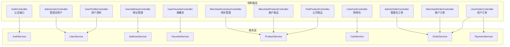
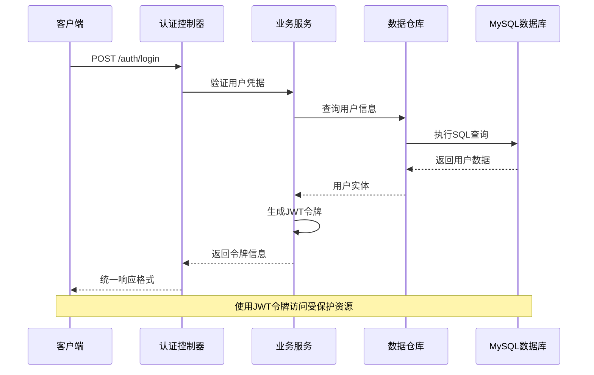

# API接口文档

<cite>
**本文档引用的文件**
- [AuthController.java](file://backend/src/main/java/com/mall/controller/AuthController.java)
- [UserProfileController.java](file://backend/src/main/java/com/mall/controller/user/UserProfileController.java)
- [UserAddressController.java](file://backend/src/main/java/com/mall/controller/user/UserAddressController.java)
- [UserFavoriteController.java](file://backend/src/main/java/com/mall/controller/user/UserFavoriteController.java)
- [PubProductController.java](file://backend/src/main/java/com/mall/controller/pub/PubProductController.java)
- [UserCartController.java](file://backend/src/main/java/com/mall/controller/user/UserCartController.java)
- [UserOrderController.java](file://backend/src/main/java/com/mall/controller/user/UserOrderController.java)
- [AdminUserController.java](file://backend/src/main/java/com/mall/controller/admin/AdminUserController.java)
- [AdminOrderController.java](file://backend/src/main/java/com/mall/controller/admin/AdminOrderController.java)
- [MerchantProductController.java](file://backend/src/main/java/com/mall/controller/merchant/MerchantProductController.java)
- [MerchantInventoryController.java](file://backend/src/main/java/com/mall/controller/merchant/MerchantInventoryController.java)
- [MerchantOrderController.java](file://backend/src/main/java/com/mall/controller/merchant/MerchantOrderController.java)
- [Result.java](file://backend/src/main/java/com/mall/dto/Result.java)
- [application.yml](file://backend/src/main/resources/application.yml)
</cite>

## 目录
1. [简介](#简介)
2. [项目结构](#项目结构)
3. [核心组件](#核心组件)
4. [架构总览](#架构总览)
5. [详细组件分析](#详细组件分析)
6. [依赖分析](#依赖分析)
7. [性能考虑](#性能考虑)
8. [故障排除指南](#故障排除指南)
9. [结论](#结论)
10. [附录](#附录)

## 简介
本项目是一个基于Spring Boot的电商商城系统，提供完整的前后端分离架构。后端采用RESTful API设计，通过统一响应包装器返回数据，支持多角色（用户、商户、管理员）访问控制。系统包含认证授权、商品浏览、购物车、订单处理、商户管理、库存管理、后台管理等核心功能模块。

## 项目结构
后端采用按功能模块划分的包结构，主要分为以下层次：
- controller层：按角色划分（auth、user、merchant、admin、pub）
- service层：业务逻辑处理
- repository层：数据访问
- entity/dto：数据模型和传输对象
- config/security：安全配置和JWT认证

**图表来源**
- [AuthController.java:11-35](file://backend/src/main/java/com/mall/controller/AuthController.java#L11-L35)
- [UserProfileController.java:12-27](file://backend/src/main/java/com/mall/controller/user/UserProfileController.java#L12-L27)
- [UserAddressController.java:13-62](file://backend/src/main/java/com/mall/controller/user/UserAddressController.java#L13-L62)
- [UserFavoriteController.java:14-58](file://backend/src/main/java/com/mall/controller/user/UserFavoriteController.java#L14-L58)
- [PubProductController.java:16-94](file://backend/src/main/java/com/mall/controller/pub/PubProductController.java#L16-L94)
- [UserCartController.java:14-66](file://backend/src/main/java/com/mall/controller/user/UserCartController.java#L14-L66)
- [UserOrderController.java:19-197](file://backend/src/main/java/com/mall/controller/user/UserOrderController.java#L19-L197)
- [MerchantProductController.java:18-179](file://backend/src/main/java/com/mall/controller/merchant/MerchantProductController.java#L18-L179)
- [MerchantInventoryController.java:16-117](file://backend/src/main/java/com/mall/controller/merchant/MerchantInventoryController.java#L16-L117)
- [MerchantOrderController.java:20-99](file://backend/src/main/java/com/mall/controller/merchant/MerchantOrderController.java#L20-L99)
- [AdminUserController.java:17-80](file://backend/src/main/java/com/mall/controller/admin/AdminUserController.java#L17-80)
- [AdminOrderController.java:17-44](file://backend/src/main/java/com/mall/controller/admin/AdminOrderController.java#L17-44)

**章节来源**
- [application.yml:1-36](file://backend/src/main/resources/application.yml#L1-L36)

## 核心组件
系统采用统一响应包装器Result进行所有API响应，标准格式包含状态码、消息和数据体。JWT用于身份认证，支持用户、商户、管理员三种角色。

### 统一响应格式
- 成功响应：code=200, message="success", data=实际数据
- 失败响应：code=400, message=错误信息, data=null

### 认证机制
- JWT令牌有效期：24小时
- 支持角色切换：用户、商户、管理员
- 基于Spring Security的权限控制

**章节来源**
- [Result.java:10-23](file://backend/src/main/java/com/mall/dto/Result.java#L10-L23)
- [application.yml:27-30](file://backend/src/main/resources/application.yml#L27-L30)

## 架构总览
系统采用分层架构，通过RESTful API实现前后端分离。各模块职责清晰，通过依赖注入实现松耦合。

**图表来源**
- [AuthController.java:18-35](file://backend/src/main/java/com/mall/controller/AuthController.java#L18-L35)
- [Result.java:16-22](file://backend/src/main/java/com/mall/dto/Result.java#L16-L22)

## 详细组件分析

### 认证接口
提供用户登录、注册功能，支持多种角色认证。

#### 登录接口
- 方法：POST
- 路径：/auth/login
- 请求参数：
  - username: 用户名（必填）
  - password: 密码（必填）
  - role: 角色类型（必填：USER/MERCHANT/ADMIN）

- 响应格式：
  - 成功：返回用户信息和JWT令牌
  - 失败：返回错误信息

#### 注册接口
- 方法：POST
- 路径：/auth/register
- 请求参数：
  - username: 用户名（必填）
  - password: 密码（必填）
  - nickname: 昵称（必填）
  - gender: 性别
  - email: 邮箱
  - phone: 手机号
  - receiverName: 默认收货人姓名
  - receiverPhone: 默认收货人电话
  - receiverAddress: 默认收货地址

- 响应格式：注册成功消息

**章节来源**
- [AuthController.java:18-71](file://backend/src/main/java/com/mall/controller/AuthController.java#L18-L71)

### 用户接口

#### 个人信息接口
- 获取用户资料：GET /user/profile
- 更新用户资料：PUT /user/profile

#### 地址管理接口
- 查询地址列表：GET /user/address
- 查询单个地址：GET /user/address/{id}
- 创建地址：POST /user/address
- 更新地址：PUT /user/address/{id}
- 删除地址：DELETE /user/address/{id}
- 设置默认地址：PUT /user/address/{id}/default
- 查询默认地址：GET /user/address/default

#### 收藏夹接口
- 查询收藏列表：GET /user/favorite
- 检查收藏状态：GET /user/favorite/check?productId={id}
- 添加收藏：POST /user/favorite/add
- 取消收藏：DELETE /user/favorite/{productId}

#### 购物车接口
- 查询购物车：GET /user/cart
- 添加商品：POST /user/cart/add
- 更新数量：PUT /user/cart/quantity
- 移除商品：DELETE /user/cart/{productId}

#### 订单接口
- 创建订单：POST /user/order/create
- 查询我的订单：GET /user/order?page=&size=
- 订单详情：GET /user/order/{id}
- 支付订单：POST /user/order/{id}/pay
- 确认收货：POST /user/order/{id}/confirm-receive
- 完成订单：POST /user/order/{id}/complete
- 取消订单：POST /user/order/{id}/cancel
- 申请退款：POST /user/order/{id}/refund-request
- 单项退款申请：POST /user/order/{orderId}/items/{itemId}/refund-request
- 批量退款申请：POST /user/order/{orderId}/items/batch-refund-request

**章节来源**
- [UserProfileController.java:21-39](file://backend/src/main/java/com/mall/controller/user/UserProfileController.java#L21-L39)
- [UserAddressController.java:19-71](file://backend/src/main/java/com/mall/controller/user/UserAddressController.java#L19-L71)
- [UserFavoriteController.java:28-58](file://backend/src/main/java/com/mall/controller/user/UserFavoriteController.java#L28-L58)
- [UserCartController.java:28-65](file://backend/src/main/java/com/mall/controller/user/UserCartController.java#L28-L65)
- [UserOrderController.java:34-196](file://backend/src/main/java/com/mall/controller/user/UserOrderController.java#L34-L196)

### 商品接口
公开商品浏览、搜索、推荐功能。

#### 公开商品接口
- 商品列表：GET /pub/products?page=&size=&categoryId=&search=&sort=&direction=
- 商品详情：GET /pub/products/{id}
- 新品推荐：GET /pub/products/new?size=
- 销量排行：GET /pub/products/rank?size=
- 个性化推荐：GET /pub/products/recommend?userId=&size=

**章节来源**
- [PubProductController.java:25-93](file://backend/src/main/java/com/mall/controller/pub/PubProductController.java#L25-L93)

### 商户接口

#### 商品管理接口
- 商品列表：GET /merchant/product?page=&size=
- 商品详情：GET /merchant/product/{id}
- 创建商品：POST /merchant/product
- 更新商品：PUT /merchant/product/{id}
- 删除商品：DELETE /merchant/product/{id}

#### 库存管理接口
- 库存列表：GET /merchant/inventory?page=&size=&keyword=&stockStatus=
- 调整库存：PUT /merchant/inventory/{productId}/stock
- 批量调整：PUT /merchant/inventory/batch-stock
- 库存预警：GET /merchant/inventory/warnings?threshold=

#### 订单处理接口
- 订单列表：GET /merchant/order?page=&size=
- 订单详情：GET /merchant/order/{id}
- 发货操作：POST /merchant/order/{id}/ship
- 同意退款：POST /merchant/order/{id}/accept-refund
- 同意单项退款：POST /merchant/order/{orderId}/items/{itemId}/accept-refund

**章节来源**
- [MerchantProductController.java:37-178](file://backend/src/main/java/com/mall/controller/merchant/MerchantProductController.java#L37-L178)
- [MerchantInventoryController.java:34-117](file://backend/src/main/java/com/mall/controller/merchant/MerchantInventoryController.java#L34-L117)
- [MerchantOrderController.java:38-99](file://backend/src/main/java/com/mall/controller/merchant/MerchantOrderController.java#L38-L99)

### 管理员接口

#### 用户管理接口
- 用户列表：GET /admin/user?page=&size=&role=
- 创建用户：POST /admin/user
- 更新用户：PUT /admin/user/{id}
- 删除用户：DELETE /admin/user/{id}

#### 订单管理接口
- 订单列表：GET /admin/order?page=&size=
- 订单详情：GET /admin/order/{id}

**章节来源**
- [AdminUserController.java:27-79](file://backend/src/main/java/com/mall/controller/admin/AdminUserController.java#L27-L79)
- [AdminOrderController.java:26-43](file://backend/src/main/java/com/mall/controller/admin/AdminOrderController.java#L26-L43)

## 依赖分析
系统采用模块化设计，各控制器通过服务层解耦业务逻辑。

```mermaid
classDiagram
class AuthController {
+login(body) Result
+register(body) Result
}
class UserProfileController {
+get(auth) Result
+update(auth, body) Result
}
class UserAddressController {
+getAddresses(user) Result
+getAddress(id, user) Result
+createAddress(address, user) Result
+updateAddress(id, user, address) Result
+deleteAddress(id, user) Result
+setDefaultAddress(id, user) Result
+getDefaultAddress(user) Result
}
class UserFavoriteController {
+list(auth) Result
+check(auth, productId) Result
+add(auth, body) Result
+remove(auth, productId) Result
}
class PubProductController {
+list(page, size, categoryId, search, sort, direction) Result
+get(id) Result
+newArrivals(size) Result
+salesRank(size) Result
+recommend(userId, size) Result
}
class UserCartController {
+list(auth) Result
+add(auth, body) Result
+updateQuantity(auth, body) Result
+remove(auth, productId) Result
}
class UserOrderController {
+create(auth, body) Result
+myOrders(auth, page, size) Result
+detail(auth, id) Result
+pay(auth, id, body) Result
+confirmReceive(auth, id) Result
+complete(auth, id) Result
+cancel(auth, id) Result
+refundRequest(auth, id, body) Result
+itemRefundRequest(auth, orderId, itemId, body) Result
+batchItemRefundRequest(auth, orderId, body) Result
}
class MerchantProductController {
+list(auth, page, size) Result
+get(auth, id) Result
+create(auth, request) Result
+update(auth, id, request) Result
+delete(auth, id) Result
}
class MerchantInventoryController {
+list(auth, page, size, keyword, stockStatus) Result
+updateStock(auth, productId, request) Result
+batchUpdateStock(auth, stockUpdates) Result
+getStockWarnings(auth, threshold) Result
}
class MerchantOrderController {
+list(auth, page, size) Result
+detail(auth, id) Result
+ship(auth, id) Result
+acceptRefund(auth, id) Result
+acceptItemRefund(auth, orderId, itemId) Result
}
class AdminUserController {
+list(role, page, size) Result
+create(body) Result
+update(id, body) Result
+delete(id) Result
}
class AdminOrderController {
+list(page, size) Result
+detail(id) Result
}
class Result {
+int code
+String message
+T data
+ok(data) Result
+fail(message) Result
}
```

**图表来源**
- [AuthController.java:11-71](file://backend/src/main/java/com/mall/controller/AuthController.java#L11-L71)
- [UserProfileController.java:12-39](file://backend/src/main/java/com/mall/controller/user/UserProfileController.java#L12-L39)
- [UserAddressController.java:13-71](file://backend/src/main/java/com/mall/controller/user/UserAddressController.java#L13-L71)
- [UserFavoriteController.java:14-58](file://backend/src/main/java/com/mall/controller/user/UserFavoriteController.java#L14-L58)
- [PubProductController.java:16-94](file://backend/src/main/java/com/mall/controller/pub/PubProductController.java#L16-L94)
- [UserCartController.java:14-66](file://backend/src/main/java/com/mall/controller/user/UserCartController.java#L14-L66)
- [UserOrderController.java:19-197](file://backend/src/main/java/com/mall/controller/user/UserOrderController.java#L19-L197)
- [MerchantProductController.java:18-179](file://backend/src/main/java/com/mall/controller/merchant/MerchantProductController.java#L18-L179)
- [MerchantInventoryController.java:16-117](file://backend/src/main/java/com/mall/controller/merchant/MerchantInventoryController.java#L16-L117)
- [MerchantOrderController.java:20-99](file://backend/src/main/java/com/mall/controller/merchant/MerchantOrderController.java#L20-L99)
- [AdminUserController.java:17-80](file://backend/src/main/java/com/mall/controller/admin/AdminUserController.java#L17-L80)
- [AdminOrderController.java:17-44](file://backend/src/main/java/com/mall/controller/admin/AdminOrderController.java#L17-L44)
- [Result.java:10-23](file://backend/src/main/java/com/mall/dto/Result.java#L10-L23)

## 性能考虑
- 分页查询：所有列表接口均支持分页参数，避免一次性加载大量数据
- 排序优化：支持按价格、销量、创建时间排序，使用数据库索引提升查询效率
- 缓存策略：推荐系统使用协同过滤算法，建议在生产环境引入Redis缓存
- 并发控制：库存操作需要考虑并发场景下的数据一致性问题
- 数据传输：统一使用Result包装响应，减少前端解析复杂度

## 故障排除指南
- 认证失败：检查JWT令牌是否过期或格式是否正确
- 权限不足：确认用户角色是否正确，商户操作需要绑定商户ID
- 参数验证：关注控制器中的参数校验逻辑，确保请求参数完整且格式正确
- 数据不存在：检查ID参数是否正确，确认数据是否属于当前用户或商户
- 数据库连接：检查application.yml中的数据库配置是否正确

**章节来源**
- [application.yml:4-25](file://backend/src/main/resources/application.yml#L4-L25)

## 结论
本电商商城系统提供了完整的API接口体系，涵盖了用户、商户、管理员三个角色的所有核心业务需求。系统采用现代化的Spring Boot技术栈，具有良好的扩展性和维护性。通过统一的响应格式和完善的错误处理机制，为前端开发提供了清晰的接口规范。

## 附录

### API测试指南
1. **环境准备**
   - 启动MySQL数据库并创建mall数据库
   - 修改application.yml中的数据库连接配置
   - 启动Spring Boot应用

2. **Postman集合**
   - 建议按模块创建集合：认证、用户、商品、订单、商户、管理
   - 为每个接口创建请求模板，包含请求头、请求体示例
   - 设置全局变量：BASE_URL、JWT_TOKEN

3. **测试步骤**
   - 先进行登录获取JWT令牌
   - 在后续请求中设置Authorization头
   - 逐步测试各模块的核心功能
   - 验证错误场景和边界条件

4. **常见测试场景**
   - 正常流程测试：登录→浏览商品→加入购物车→下单→支付
   - 异常流程测试：参数缺失、权限不足、数据冲突
   - 性能测试：大量数据的分页查询和排序功能

### 状态码说明
- 200：请求成功
- 400：请求参数错误或业务逻辑错误
- 401：未认证或令牌无效
- 403：权限不足
- 404：请求的资源不存在

### 请求头设置
- Content-Type: application/json
- Authorization: Bearer {JWT_TOKEN}