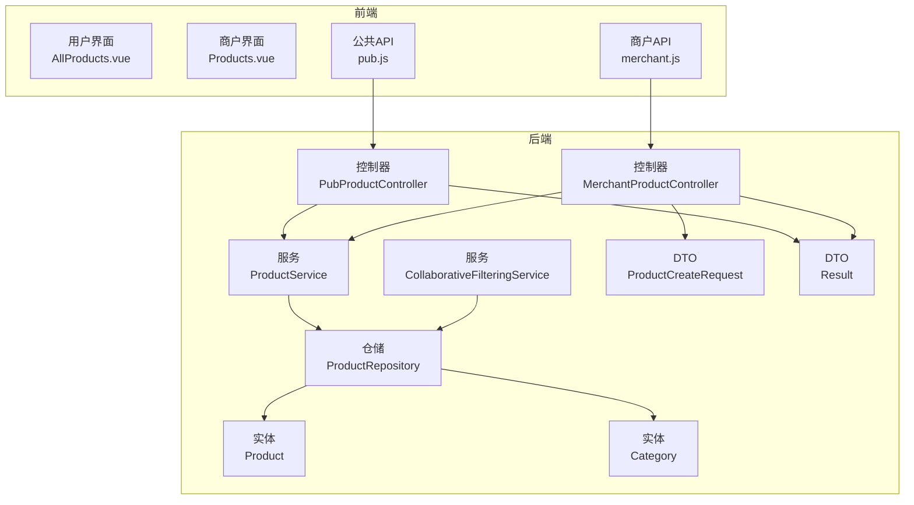
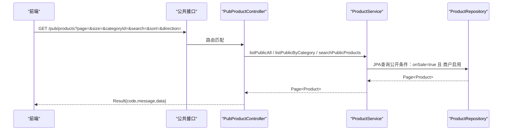
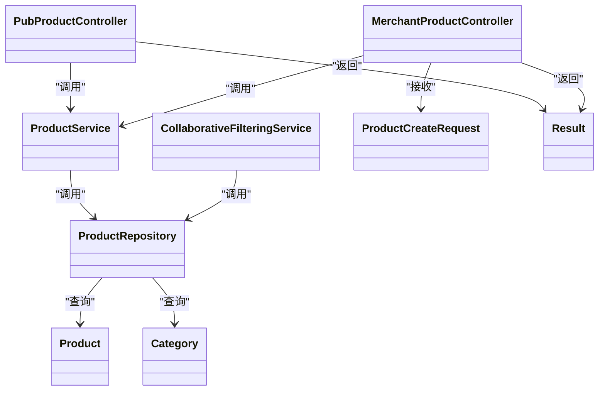

# 商品接口

<cite>
**本文引用的文件**
- [PubProductController.java](file://backend/src/main/java/com/mall/controller/pub/PubProductController.java)
- [MerchantProductController.java](file://backend/src/main/java/com/mall/controller/merchant/MerchantProductController.java)
- [ProductService.java](file://backend/src/main/java/com/mall/service/ProductService.java)
- [ProductRepository.java](file://backend/src/main/java/com/mall/repository/ProductRepository.java)
- [Product.java](file://backend/src/main/java/com/mall/entity/Product.java)
- [ProductCreateRequest.java](file://backend/src/main/java/com/mall/dto/ProductCreateRequest.java)
- [PubCategoryController.java](file://backend/src/main/java/com/mall/controller/pub/PubCategoryController.java)
- [Category.java](file://backend/src/main/java/com/mall/entity/Category.java)
- [CollaborativeFilteringService.java](file://backend/src/main/java/com/mall/service/CollaborativeFilteringService.java)
- [Result.java](file://backend/src/main/java/com/mall/dto/Result.java)
- [application.yml](file://backend/src/main/resources/application.yml)
- [pub.js](file://frontend/src/api/pub.js)
- [merchant.js](file://frontend/src/api/merchant.js)
- [AllProducts.vue](file://frontend/src/views/user/AllProducts.vue)
- [Products.vue](file://frontend/src/views/merchant/Products.vue)
- [Recommend.vue](file://frontend/src/views/user/Recommend.vue)
</cite>

## 目录
1. [简介](#简介)
2. [项目结构](#项目结构)
3. [核心组件](#核心组件)
4. [架构总览](#架构总览)
5. [详细组件分析](#详细组件分析)
6. [依赖分析](#依赖分析)
7. [性能考虑](#性能考虑)
8. [故障排查指南](#故障排查指南)
9. [结论](#结论)
10. [附录](#附录)

## 简介
本文件为电商商城系统的商品接口API文档，覆盖用户端与商户端两大视角：
- 用户端接口：商品浏览（分类筛选、搜索、分页）、商品详情、新品、销量排行、个性化推荐（协同过滤）。
- 商户端接口：商品列表、详情、新增、更新、删除；支持按分类名自动创建分类；支持按关键字与库存状态筛选。

文档提供接口定义、参数说明、响应格式、调用示例与注意事项，帮助前后端协作与集成。

## 项目结构
后端采用Spring Boot + Spring Data JPA，控制器按业务域划分：
- 公共接口域（pub）：面向用户端的公开商品与分类查询。
- 商户接口域（merchant）：面向商户的商品管理与库存管理。
- 服务层（service）：封装业务逻辑，屏蔽仓储细节。
- 仓储层（repository）：基于JPA的查询方法，含公开与管理端专用查询。
- 数据模型（entity）：商品、分类等实体。
- DTO：接口入参与统一响应包装。

图表来源
- [PubProductController.java:15-95](file://backend/src/main/java/com/mall/controller/pub/PubProductController.java#L15-L95)
- [MerchantProductController.java:18-180](file://backend/src/main/java/com/mall/controller/merchant/MerchantProductController.java#L18-L180)
- [ProductService.java:15-126](file://backend/src/main/java/com/mall/service/ProductService.java#L15-L126)
- [ProductRepository.java:12-125](file://backend/src/main/java/com/mall/repository/ProductRepository.java#L12-L125)
- [Product.java:9-101](file://backend/src/main/java/com/mall/entity/Product.java#L9-L101)
- [Category.java:8-41](file://backend/src/main/java/com/mall/entity/Category.java#L8-L41)
- [ProductCreateRequest.java:10-32](file://backend/src/main/java/com/mall/dto/ProductCreateRequest.java#L10-L32)
- [Result.java:7-24](file://backend/src/main/java/com/mall/dto/Result.java#L7-L24)

章节来源
- [application.yml:22-25](file://backend/src/main/resources/application.yml#L22-L25)

## 核心组件
- 控制器
  - 公共商品控制器：提供商品列表、详情、新品、销量排行、个性化推荐等接口。
  - 商户商品控制器：提供商品列表、详情、新增、更新、删除等接口。
- 服务层
  - 商品服务：封装公开与管理端查询、搜索、分页、库存筛选等。
  - 协同过滤服务：基于历史订单生成个性化推荐。
- 仓储层
  - 商品仓储：实现公开查询（上架且商户启用）、管理端查询、库存筛选等。
- 数据模型
  - 商品实体：包含名称、价格、库存、上下架状态、品牌、参数、图片等字段。
  - 分类实体：支持树形结构（父子关系）与排序。
- DTO
  - 统一响应包装Result。
  - 商品创建请求对象，支持按分类名自动创建分类。

章节来源
- [PubProductController.java:15-95](file://backend/src/main/java/com/mall/controller/pub/PubProductController.java#L15-L95)
- [MerchantProductController.java:18-180](file://backend/src/main/java/com/mall/controller/merchant/MerchantProductController.java#L18-L180)
- [ProductService.java:15-126](file://backend/src/main/java/com/mall/service/ProductService.java#L15-L126)
- [ProductRepository.java:12-125](file://backend/src/main/java/com/mall/repository/ProductRepository.java#L12-L125)
- [Product.java:9-101](file://backend/src/main/java/com/mall/entity/Product.java#L9-L101)
- [Category.java:8-41](file://backend/src/main/java/com/mall/entity/Category.java#L8-L41)
- [ProductCreateRequest.java:10-32](file://backend/src/main/java/com/mall/dto/ProductCreateRequest.java#L10-L32)
- [Result.java:7-24](file://backend/src/main/java/com/mall/dto/Result.java#L7-L24)

## 架构总览
- 接口路径前缀
  - 公共接口：/api/pub
  - 商户接口：/api/merchant
- 统一响应结构
  - 成功：code=200, message="success", data=实际数据
  - 失败：code=400, message=错误信息, data=null
- 安全与鉴权
  - 商户接口需要认证（基于Security配置），控制器通过Authentication获取当前商户ID。
  - 公共接口无需登录。

图表来源
- [PubProductController.java:24-46](file://backend/src/main/java/com/mall/controller/pub/PubProductController.java#L24-L46)
- [ProductService.java:42-82](file://backend/src/main/java/com/mall/service/ProductService.java#L42-L82)
- [ProductRepository.java:32-105](file://backend/src/main/java/com/mall/repository/ProductRepository.java#L32-L105)

## 详细组件分析

### 公共商品接口（用户端）
- 商品列表（分页、分类筛选、搜索、排序）
  - 方法与路径：GET /pub/products
  - 查询参数
    - page：页码（从0开始，默认0）
    - size：每页大小（默认12）
    - categoryId：分类ID（可选）
    - search：关键词（可选）
    - sort：排序字段（price/sales/createdAt，默认空表示不排序）
    - direction：排序方向（asc/desc，默认asc）
  - 行为说明
    - 提供关键词搜索、分类筛选、排序组合查询。
    - 返回公开商品（上架且商户启用）。
  - 响应
    - Result.ok(data: Page<Product>) 或 Result.ok(data: List<Product>)（新品/销量排行）。
- 商品详情
  - 方法与路径：GET /pub/products/{id}
  - 行为说明
    - 返回公开商品详情（上架且商户启用）。
- 新品列表
  - 方法与路径：GET /pub/products/new
  - 查询参数：size（默认10）
  - 行为说明：返回公开新品（上架且商户启用且isNew=true）。
- 销量排行
  - 方法与路径：GET /pub/products/rank
  - 查询参数：size（默认10）
  - 行为说明：按销量降序返回公开商品。
- 个性化推荐（协同过滤）
  - 方法与路径：GET /pub/products/recommend
  - 查询参数：userId（必填）、size（默认20）
  - 行为说明：基于相似购买行为的协同过滤推荐，若无足够数据则回退到销量排行。

章节来源
- [PubProductController.java:24-93](file://backend/src/main/java/com/mall/controller/pub/PubProductController.java#L24-L93)
- [ProductService.java:57-82](file://backend/src/main/java/com/mall/service/ProductService.java#L57-L82)
- [ProductRepository.java:32-105](file://backend/src/main/java/com/mall/repository/ProductRepository.java#L32-L105)
- [CollaborativeFilteringService.java:29-79](file://backend/src/main/java/com/mall/service/CollaborativeFilteringService.java#L29-L79)

### 商户商品接口（商户端）
- 商品列表
  - 方法与路径：GET /merchant/product
  - 查询参数：page、size
  - 行为说明：仅返回当前商户的上架商品。
- 商品详情
  - 方法与路径：GET /merchant/product/{id}
  - 行为说明：校验商品归属当前商户，否则返回不存在。
- 创建商品
  - 方法与路径：POST /merchant/product
  - 请求体：ProductCreateRequest
    - 支持按分类名自动创建分类（当提供categoryName时）。
    - 图片处理：支持images数组或detailImages字符串，最终入库为detailImages逗号分隔。
  - 校验规则
    - 名称非空；价格>0；库存>=0。
- 更新商品
  - 方法与路径：PUT /merchant/product/{id}
  - 请求体：ProductCreateRequest（同创建，但会更新现有记录）。
- 删除商品
  - 方法与路径：DELETE /merchant/product/{id}
  - 行为说明：校验归属并删除。

章节来源
- [MerchantProductController.java:36-178](file://backend/src/main/java/com/mall/controller/merchant/MerchantProductController.java#L36-L178)
- [ProductCreateRequest.java:14-31](file://backend/src/main/java/com/mall/dto/ProductCreateRequest.java#L14-L31)
- [ProductRepository.java:15-21](file://backend/src/main/java/com/mall/repository/ProductRepository.java#L15-L21)

### 商品分类接口（用户端）
- 分类列表
  - 方法与路径：GET /pub/categories
  - 查询参数
    - parentId：父级ID（可选）
    - all：是否返回全部（可选，true时忽略parentId）
  - 行为说明：默认返回顶级分类，或指定父级下的子分类，或全部分类（按sortOrder与id升序）。

章节来源
- [PubCategoryController.java:21-36](file://backend/src/main/java/com/mall/controller/pub/PubCategoryController.java#L21-L36)
- [Category.java:8-41](file://backend/src/main/java/com/mall/entity/Category.java#L8-L41)

### 数据模型与字段说明
- 商品实体（部分关键字段）
  - id、merchantId、categoryId、name、description、detailDescription、image、imageList、detailImages、brand、attributes、price、originalPrice、unit、stock、sales、onSale、isNew、createdAt、updatedAt
- 分类实体
  - id、name、parentId、icon、sortOrder、createdAt

章节来源
- [Product.java:16-101](file://backend/src/main/java/com/mall/entity/Product.java#L16-L101)
- [Category.java:15-41](file://backend/src/main/java/com/mall/entity/Category.java#L15-L41)

### 统一响应结构
- Result<T>
  - code：200成功，400失败
  - message：提示信息
  - data：具体数据

章节来源
- [Result.java:7-24](file://backend/src/main/java/com/mall/dto/Result.java#L7-L24)

### 前端调用示例与页面使用
- 用户端
  - 商品列表：getProducts(params)
  - 商品详情：getProduct(id)
  - 新品：getNewArrivals(size)
  - 销量排行：getSalesRank(size)
  - 推荐：getRecommend(userId, size)
  - 分类：getCategories(parentId)/getAllCategories()
- 商户端
  - 商品列表：getProducts(params)
  - 新增/更新/删除：createProduct(data)、updateProduct(id, data)、deleteProduct(id)

章节来源
- [pub.js:8-74](file://frontend/src/api/pub.js#L8-L74)
- [merchant.js:13-135](file://frontend/src/api/merchant.js#L13-L135)
- [AllProducts.vue:186-261](file://frontend/src/views/user/AllProducts.vue#L186-L261)
- [Products.vue:144-226](file://frontend/src/views/merchant/Products.vue#L144-L226)
- [Recommend.vue:18-31](file://frontend/src/views/user/Recommend.vue#L18-L31)

## 依赖分析
- 控制器依赖服务，服务依赖仓储，仓储依赖实体。
- 公共接口依赖公开查询条件（上架且商户启用）。
- 商户接口依赖当前登录商户ID进行归属校验。
- 协同过滤依赖订单与订单项仓储以提取用户购买行为。

图表来源
- [PubProductController.java:15-95](file://backend/src/main/java/com/mall/controller/pub/PubProductController.java#L15-L95)
- [MerchantProductController.java:18-180](file://backend/src/main/java/com/mall/controller/merchant/MerchantProductController.java#L18-L180)
- [ProductService.java:15-126](file://backend/src/main/java/com/mall/service/ProductService.java#L15-L126)
- [ProductRepository.java:12-125](file://backend/src/main/java/com/mall/repository/ProductRepository.java#L12-L125)
- [Product.java:9-101](file://backend/src/main/java/com/mall/entity/Product.java#L9-L101)
- [Category.java:8-41](file://backend/src/main/java/com/mall/entity/Category.java#L8-L41)
- [ProductCreateRequest.java:10-32](file://backend/src/main/java/com/mall/dto/ProductCreateRequest.java#L10-L32)
- [Result.java:7-24](file://backend/src/main/java/com/mall/dto/Result.java#L7-L24)

## 性能考虑
- 分页与排序
  - 使用PageRequest与Sort，避免一次性加载大量数据。
  - 排序字段限制在price、sales、createdAt，减少复杂索引需求。
- 查询条件
  - 公共查询强制onSale=true且商户启用，避免无效数据扫描。
  - 搜索使用LIKE模糊匹配，建议在name与description建立合适索引。
- 推荐算法
  - 协同过滤先查当前用户已收货商品，再与其他用户交集评分，必要时回退销量排行。
- 图片存储
  - 主图image与详情图detailImages采用逗号分隔字符串，便于快速渲染；建议前端按需懒加载。

## 故障排查指南
- 商品不存在
  - 公共详情：返回失败提示。
  - 商户详情/更新/删除：校验归属失败返回失败提示。
- 参数校验失败
  - 创建/更新时名称为空、价格<=0、库存<0会触发失败。
- 排序字段非法
  - sort仅接受price/sales/createdAt，其他值将不生效。
- 推荐无结果
  - 当前用户无收货记录或无相似用户时，回退到销量排行。

章节来源
- [PubProductController.java:63-69](file://backend/src/main/java/com/mall/controller/pub/PubProductController.java#L63-L69)
- [MerchantProductController.java:47-54](file://backend/src/main/java/com/mall/controller/merchant/MerchantProductController.java#L47-L54)
- [MerchantProductController.java:116-122](file://backend/src/main/java/com/mall/controller/merchant/MerchantProductController.java#L116-L122)
- [MerchantProductController.java:169-177](file://backend/src/main/java/com/mall/controller/merchant/MerchantProductController.java#L169-L177)
- [MerchantProductController.java:58-67](file://backend/src/main/java/com/mall/controller/merchant/MerchantProductController.java#L58-L67)
- [CollaborativeFilteringService.java:32-79](file://backend/src/main/java/com/mall/service/CollaborativeFilteringService.java#L32-L79)

## 结论
本商品接口体系清晰地分离了用户端与商户端职责：
- 用户端专注浏览体验：分类筛选、搜索、分页、新品与销量排行、个性化推荐。
- 商户端专注运营效率：商品全生命周期管理、库存管理、图片上传与规格管理。
通过统一响应结构与明确的参数约束，前后端协作更加顺畅。建议后续结合业务扩展更多高级筛选与统计指标。

## 附录

### 接口一览与差异对比
- 公共接口（用户端）
  - GET /pub/products：分页、分类、搜索、排序
  - GET /pub/products/{id}：公开详情
  - GET /pub/products/new：新品
  - GET /pub/products/rank：销量排行
  - GET /pub/products/recommend：个性化推荐
  - GET /pub/categories：分类列表
- 商户接口（商户端）
  - GET /merchant/product：商品列表
  - GET /merchant/product/{id}：商品详情
  - POST /merchant/product：创建商品（支持按分类名自动创建）
  - PUT /merchant/product/{id}：更新商品
  - DELETE /merchant/product/{id}：删除商品

章节来源
- [PubProductController.java:24-93](file://backend/src/main/java/com/mall/controller/pub/PubProductController.java#L24-L93)
- [MerchantProductController.java:36-178](file://backend/src/main/java/com/mall/controller/merchant/MerchantProductController.java#L36-L178)
- [PubCategoryController.java:21-36](file://backend/src/main/java/com/mall/controller/pub/PubCategoryController.java#L21-L36)