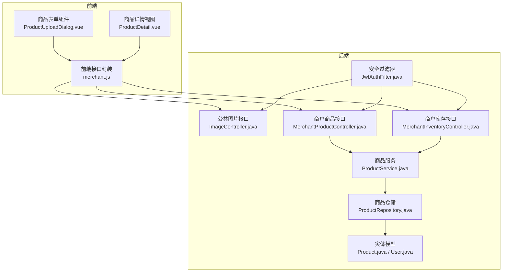
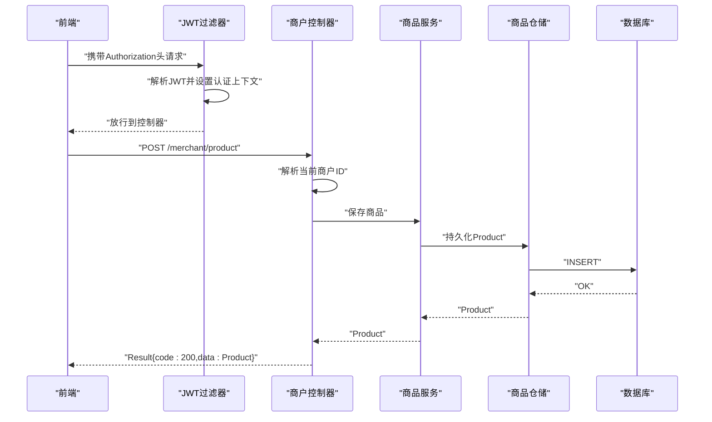
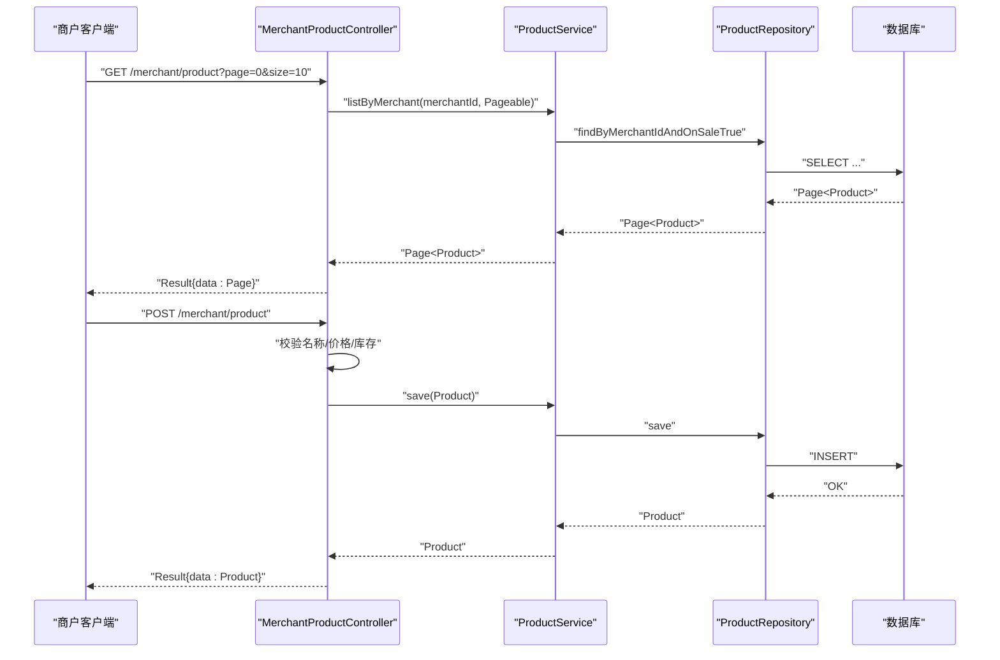
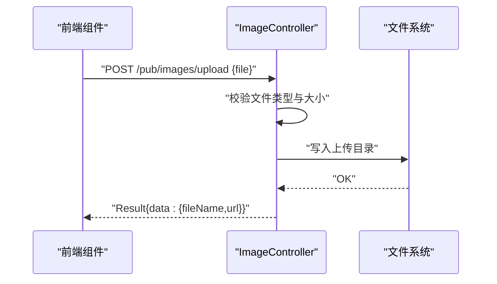
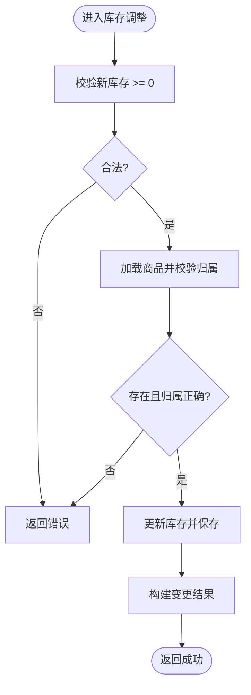
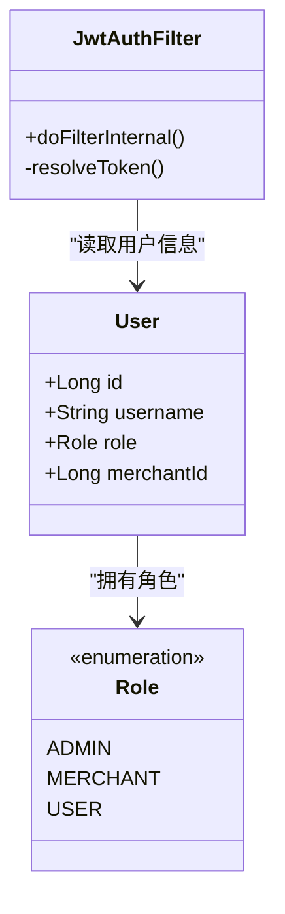
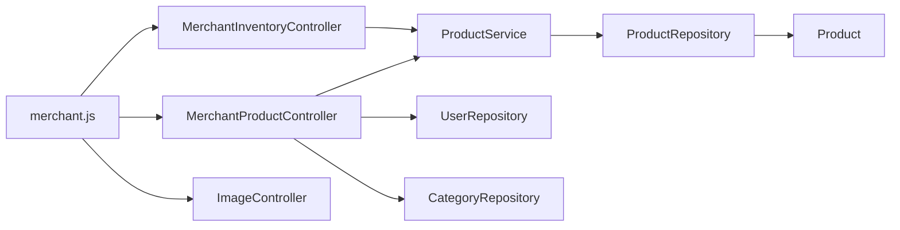

# 商户端商品管理接口

<cite>
**本文引用的文件**
- [MerchantProductController.java](file://backend/src/main/java/com/mall/controller/merchant/MerchantProductController.java)
- [MerchantInventoryController.java](file://backend/src/main/java/com/mall/controller/merchant/MerchantInventoryController.java)
- [ProductCreateRequest.java](file://backend/src/main/java/com/mall/dto/ProductCreateRequest.java)
- [Product.java](file://backend/src/main/java/com/mall/entity/Product.java)
- [ProductService.java](file://backend/src/main/java/com/mall/service/ProductService.java)
- [ProductRepository.java](file://backend/src/main/java/com/mall/repository/ProductRepository.java)
- [ImageController.java](file://backend/src/main/java/com/mall/controller/pub/ImageController.java)
- [merchant.js](file://frontend/src/api/merchant.js)
- [ProductUploadDialog.vue](file://frontend/src/components/merchant/ProductUploadDialog.vue)
- [ProductDetail.vue](file://frontend/src/views/merchant/ProductDetail.vue)
- [User.java](file://backend/src/main/java/com/mall/entity/User.java)
- [Role.java](file://backend/src/main/java/com/mall/common/Role.java)
- [JwtAuthFilter.java](file://backend/src/main/java/com/mall/security/JwtAuthFilter.java)
- [application.yml](file://backend/src/main/resources/application.yml)
</cite>

## 目录
1. [简介](#简介)
2. [项目结构](#项目结构)
3. [核心组件](#核心组件)
4. [架构总览](#架构总览)
5. [详细组件分析](#详细组件分析)
6. [依赖分析](#依赖分析)
7. [性能考虑](#性能考虑)
8. [故障排查指南](#故障排查指南)
9. [结论](#结论)
10. [附录](#附录)

## 简介
本文件面向电商商城系统的商户端，提供完整的商品管理接口文档，覆盖以下能力：
- 商户商品管理：商品上架、下架、编辑、删除
- 商品信息维护：名称、简介、详情、品牌、参数、单位等
- 商品图片上传：主图、详情图上传与管理
- 库存管理：库存查询、库存调整、批量调整、库存预警
- 商品状态管理：是否新品、是否上架
- 权限控制：基于 JWT 的商户角色认证与授权
- 数据验证规则与文件上传处理流程

本接口以商户视角为核心，强调“仅对当前登录商户可见与可操作”的约束，确保数据隔离与业务正确性。

## 项目结构
后端采用 Spring Boot + JPA，按功能域划分控制器层（merchant、pub、user、admin），服务层与仓储层分离，前端采用 Vue + Element UI，通过统一的请求封装调用后端接口。

图表来源
- [merchant.js:1-135](file://frontend/src/api/merchant.js#L1-L135)
- [ProductUploadDialog.vue:1-920](file://frontend/src/components/merchant/ProductUploadDialog.vue#L1-L920)
- [ProductDetail.vue:1-429](file://frontend/src/views/merchant/ProductDetail.vue#L1-L429)
- [JwtAuthFilter.java:1-57](file://backend/src/main/java/com/mall/security/JwtAuthFilter.java#L1-L57)
- [ImageController.java:1-155](file://backend/src/main/java/com/mall/controller/pub/ImageController.java#L1-L155)
- [MerchantProductController.java:1-180](file://backend/src/main/java/com/mall/controller/merchant/MerchantProductController.java#L1-L180)
- [MerchantInventoryController.java:1-118](file://backend/src/main/java/com/mall/controller/merchant/MerchantInventoryController.java#L1-L118)
- [ProductService.java:1-126](file://backend/src/main/java/com/mall/service/ProductService.java#L1-L126)
- [ProductRepository.java:1-125](file://backend/src/main/java/com/mall/repository/ProductRepository.java#L1-L125)
- [Product.java:1-101](file://backend/src/main/java/com/mall/entity/Product.java#L1-L101)
- [User.java:1-88](file://backend/src/main/java/com/mall/entity/User.java#L1-L88)

章节来源
- [application.yml:1-36](file://backend/src/main/resources/application.yml#L1-L36)

## 核心组件
- 商户商品控制器：提供商品列表、详情、创建、更新、删除接口，内置商户身份解析与权限校验。
- 商户库存控制器：提供库存列表、单个库存调整、批量调整、库存预警接口。
- 商品服务：封装商品查询、分页、保存、删除以及库存相关查询逻辑。
- 商品仓储：基于 JPA 的查询方法，区分公开端与运营端查询条件。
- 公共图片控制器：提供图片上传、列表、查看接口，支持多种图片格式与安全校验。
- 前端接口封装与组件：统一调用后端接口，处理表单、图片上传、富文本编辑器集成。

章节来源
- [MerchantProductController.java:1-180](file://backend/src/main/java/com/mall/controller/merchant/MerchantProductController.java#L1-L180)
- [MerchantInventoryController.java:1-118](file://backend/src/main/java/com/mall/controller/merchant/MerchantInventoryController.java#L1-L118)
- [ProductService.java:1-126](file://backend/src/main/java/com/mall/service/ProductService.java#L1-L126)
- [ProductRepository.java:1-125](file://backend/src/main/java/com/mall/repository/ProductRepository.java#L1-L125)
- [ImageController.java:1-155](file://backend/src/main/java/com/mall/controller/pub/ImageController.java#L1-L155)
- [merchant.js:1-135](file://frontend/src/api/merchant.js#L1-L135)

## 架构总览
商户端接口遵循“控制器-服务-仓储-实体”分层，安全层通过 JWT 过滤器注入认证上下文，控制器在执行业务前进行商户身份解析与资源归属校验。

图表来源
- [JwtAuthFilter.java:1-57](file://backend/src/main/java/com/mall/security/JwtAuthFilter.java#L1-L57)
- [MerchantProductController.java:1-180](file://backend/src/main/java/com/mall/controller/merchant/MerchantProductController.java#L1-L180)
- [ProductService.java:1-126](file://backend/src/main/java/com/mall/service/ProductService.java#L1-L126)
- [ProductRepository.java:1-125](file://backend/src/main/java/com/mall/repository/ProductRepository.java#L1-L125)

## 详细组件分析

### 商户商品管理接口
- 接口范围：商品列表、详情、创建、更新、删除
- 权限控制：通过 JWT 中的用户ID映射到商户ID，仅允许操作属于当前商户的商品
- 数据验证：名称、价格、库存等字段的基础校验；分类可直接指定categoryId或提供categoryName自动创建
- 图片处理：支持 images 数组与 detailImages 字段，最终统一存储为逗号分隔的详情图列表

图表来源
- [MerchantProductController.java:1-180](file://backend/src/main/java/com/mall/controller/merchant/MerchantProductController.java#L1-L180)
- [ProductService.java:1-126](file://backend/src/main/java/com/mall/service/ProductService.java#L1-L126)
- [ProductRepository.java:1-125](file://backend/src/main/java/com/mall/repository/ProductRepository.java#L1-L125)

章节来源
- [MerchantProductController.java:36-114](file://backend/src/main/java/com/mall/controller/merchant/MerchantProductController.java#L36-L114)
- [ProductCreateRequest.java:1-32](file://backend/src/main/java/com/mall/dto/ProductCreateRequest.java#L1-L32)
- [Product.java:1-101](file://backend/src/main/java/com/mall/entity/Product.java#L1-L101)

### 商品信息维护接口
- 支持字段：名称、简介、详情、品牌、参数、单位、分类、价格、原价、库存、是否新品、是否上架
- 分类策略：优先使用已存在的categoryId；若提供categoryName则自动创建顶级分类
- 详情图策略：images数组会被拼接为逗号分隔字符串存储到detailImages字段

章节来源
- [MerchantProductController.java:56-114](file://backend/src/main/java/com/mall/controller/merchant/MerchantProductController.java#L56-L114)
- [ProductCreateRequest.java:14-31](file://backend/src/main/java/com/mall/dto/ProductCreateRequest.java#L14-L31)
- [Product.java:42-47](file://backend/src/main/java/com/mall/entity/Product.java#L42-L47)

### 商品图片上传接口
- 接口路径：/pub/images/upload
- 请求方式：POST multipart/form-data
- 表单字段：file（必填）
- 支持格式：jpg、jpeg、png、gif、webp、bmp
- 返回结构：包含fileName与可访问URL
- 前端集成：富文本编辑器与表单组件均通过该接口上传图片

图表来源
- [ImageController.java:107-153](file://backend/src/main/java/com/mall/controller/pub/ImageController.java#L107-L153)
- [ProductUploadDialog.vue:384-430](file://frontend/src/components/merchant/ProductUploadDialog.vue#L384-L430)
- [ProductDetail.vue:54-64](file://frontend/src/views/merchant/ProductDetail.vue#L54-L64)

章节来源
- [ImageController.java:107-153](file://backend/src/main/java/com/mall/controller/pub/ImageController.java#L107-L153)
- [merchant.js:127-134](file://frontend/src/api/merchant.js#L127-L134)

### 库存管理接口
- 库存查询：支持关键词与库存状态筛选，返回当前商户下的商品列表（包含下架商品）
- 单个库存调整：校验新库存非负，更新并返回变更前后库存与变化量
- 批量库存调整：逐项校验与更新，支持一次提交多个商品ID与新库存
- 库存预警：根据阈值返回低库存商品列表

图表来源
- [MerchantInventoryController.java:46-108](file://backend/src/main/java/com/mall/controller/merchant/MerchantInventoryController.java#L46-L108)
- [ProductService.java:94-124](file://backend/src/main/java/com/mall/service/ProductService.java#L94-L124)
- [ProductRepository.java:107-123](file://backend/src/main/java/com/mall/repository/ProductRepository.java#L107-L123)

章节来源
- [MerchantInventoryController.java:33-118](file://backend/src/main/java/com/mall/controller/merchant/MerchantInventoryController.java#L33-L118)
- [ProductService.java:94-124](file://backend/src/main/java/com/mall/service/ProductService.java#L94-L124)

### 商品状态管理接口
- 是否新品：isNew 字段，默认false
- 是否上架：onSale 字段，默认true
- 控制方式：创建/更新请求中显式设置；查询默认仅返回上架商品（运营端仍可看到下架商品）

章节来源
- [Product.java:76-82](file://backend/src/main/java/com/mall/entity/Product.java#L76-L82)
- [MerchantProductController.java:108-110](file://backend/src/main/java/com/mall/controller/merchant/MerchantProductController.java#L108-L110)
- [ProductService.java:52-55](file://backend/src/main/java/com/mall/service/ProductService.java#L52-L55)

### 权限与认证机制
- 角色枚举：ADMIN（管理员）、MERCHANT（商户）、USER（用户）
- 认证流程：JWT 过滤器从 Authorization 头解析令牌，构造认证主体，设置到 SecurityContext
- 商户绑定：User 实体中的 merchantId 字段用于标识商户身份
- 接口校验：控制器通过当前用户ID映射到商户ID，确保资源归属一致

图表来源
- [User.java:1-88](file://backend/src/main/java/com/mall/entity/User.java#L1-L88)
- [Role.java:1-8](file://backend/src/main/java/com/mall/common/Role.java#L1-L8)
- [JwtAuthFilter.java:1-57](file://backend/src/main/java/com/mall/security/JwtAuthFilter.java#L1-L57)

章节来源
- [User.java:56-62](file://backend/src/main/java/com/mall/entity/User.java#L56-L62)
- [Role.java:1-8](file://backend/src/main/java/com/mall/common/Role.java#L1-L8)
- [JwtAuthFilter.java:30-47](file://backend/src/main/java/com/mall/security/JwtAuthFilter.java#L30-L47)

## 依赖分析
- 控制器依赖服务层，服务层依赖仓储层，仓储层依赖实体模型
- 商户控制器依赖用户仓储以解析商户ID，依赖分类仓储以支持动态分类创建
- 前端通过统一接口封装调用后端，组件内集成图片上传与富文本编辑器

图表来源
- [MerchantProductController.java:1-180](file://backend/src/main/java/com/mall/controller/merchant/MerchantProductController.java#L1-L180)
- [MerchantInventoryController.java:1-118](file://backend/src/main/java/com/mall/controller/merchant/MerchantInventoryController.java#L1-L118)
- [ProductService.java:1-126](file://backend/src/main/java/com/mall/service/ProductService.java#L1-L126)
- [ProductRepository.java:1-125](file://backend/src/main/java/com/mall/repository/ProductRepository.java#L1-L125)
- [merchant.js:1-135](file://frontend/src/api/merchant.js#L1-L135)

章节来源
- [MerchantProductController.java:24-26](file://backend/src/main/java/com/mall/controller/merchant/MerchantProductController.java#L24-L26)
- [MerchantInventoryController.java:22-23](file://backend/src/main/java/com/mall/controller/merchant/MerchantInventoryController.java#L22-L23)

## 性能考虑
- 分页查询：列表与库存查询均使用 PageRequest，避免一次性加载大量数据
- 条件查询：仓储层针对不同场景提供专用查询方法，减少复杂SQL拼接
- 图片上传：采用本地文件系统存储，建议在生产环境配置对象存储（如 OSS/COS）并开启 CDN 加速
- 富文本编辑器：图片上传采用异步与进度反馈，避免阻塞主线程

## 故障排查指南
- 401/403 认证失败：检查 Authorization 头是否为 Bearer Token，确认令牌未过期
- 404/400 资源不存在或参数非法：核对商品ID、库存值非负、图片格式支持
- 500 服务器异常：关注图片上传目录权限、磁盘空间、文件名安全校验
- 前端上传失败：确认 /pub/images/upload 可达，检查跨域与 Content-Type 设置

章节来源
- [ImageController.java:107-153](file://backend/src/main/java/com/mall/controller/pub/ImageController.java#L107-L153)
- [merchant.js:127-134](file://frontend/src/api/merchant.js#L127-L134)

## 结论
商户端商品管理接口围绕“商户身份+资源归属”的核心原则设计，结合严格的参数校验与图片上传处理，形成完整的商品全生命周期管理能力。通过清晰的分层与职责划分，系统具备良好的可维护性与扩展性。

## 附录

### API 定义与示例

- 商品列表
  - 方法与路径：GET /merchant/product
  - 查询参数：page（默认0）、size（默认10）
  - 成功响应：Result{code:200, data: Page<Product>}

- 商品详情
  - 方法与路径：GET /merchant/product/{id}
  - 成功响应：Result{code:200, data: Product}

- 创建商品
  - 方法与路径：POST /merchant/product
  - 请求体：ProductCreateRequest（字段见下节）
  - 成功响应：Result{code:200, data: Product}

- 更新商品
  - 方法与路径：PUT /merchant/product/{id}
  - 请求体：ProductCreateRequest
  - 成功响应：Result{code:200, data: Product}

- 删除商品
  - 方法与路径：DELETE /merchant/product/{id}
  - 成功响应：Result{code:200, data: null}

- 库存列表
  - 方法与路径：GET /merchant/inventory
  - 查询参数：page、size、keyword（可选）、stockStatus（0缺货/1低库存/2正常，可选）
  - 成功响应：Result{code:200, data: Page<Product>}

- 调整库存
  - 方法与路径：PUT /merchant/inventory/{productId}/stock
  - 请求体：{ stock: number }
  - 成功响应：Result{code:200, data: {productId, oldStock, newStock, change}}

- 批量调整库存
  - 方法与路径：PUT /merchant/inventory/batch-stock
  - 请求体：{ [productId]: stock }
  - 成功响应：Result{code:200, data: "批量更新库存成功"}

- 库存预警
  - 方法与路径：GET /merchant/inventory/warnings?threshold=10
  - 成功响应：Result{code:200, data: List<Product>}

- 图片上传
  - 方法与路径：POST /pub/images/upload
  - 表单字段：file（必填）
  - 成功响应：Result{code:200, data: {fileName, url}}

章节来源
- [MerchantProductController.java:36-178](file://backend/src/main/java/com/mall/controller/merchant/MerchantProductController.java#L36-L178)
- [MerchantInventoryController.java:33-118](file://backend/src/main/java/com/mall/controller/merchant/MerchantInventoryController.java#L33-L118)
- [ImageController.java:107-153](file://backend/src/main/java/com/mall/controller/pub/ImageController.java#L107-L153)

### 请求体与数据格式

- 商品创建/更新请求体（ProductCreateRequest）
  - 关键字段：name、description、detailDescription、detailImages、images、brand、unit、categoryId、categoryName、price、originalPrice、stock、image、isNew、onSale
  - 说明：images 数组将被转换为 detailImages 存储；categoryName 为空则使用 categoryId；isNew/onSale 默认值在控制器中设置

- 库存调整请求体
  - 单个：{ stock: number }
  - 批量：{ [productId]: stock }

- 图片上传请求体（FormData）
  - 字段：file（二进制文件）
  - Content-Type：multipart/form-data

章节来源
- [ProductCreateRequest.java:14-31](file://backend/src/main/java/com/mall/dto/ProductCreateRequest.java#L14-L31)
- [MerchantInventoryController.java:47-108](file://backend/src/main/java/com/mall/controller/merchant/MerchantInventoryController.java#L47-L108)
- [ImageController.java:107-153](file://backend/src/main/java/com/mall/controller/pub/ImageController.java#L107-L153)

### 前端调用示例
- 商品 CRUD：通过 merchant.js 的 createProduct/updateProduct/getProduct/deleteProduct 等方法
- 图片上传：通过 uploadImage 发送 FormData；富文本编辑器与表单组件均集成该接口
- 库存管理：getInventory/updateProductStock/batchUpdateStock/getStockWarnings

章节来源
- [merchant.js:13-134](file://frontend/src/api/merchant.js#L13-L134)
- [ProductUploadDialog.vue:384-430](file://frontend/src/components/merchant/ProductUploadDialog.vue#L384-L430)
- [ProductDetail.vue:54-64](file://frontend/src/views/merchant/ProductDetail.vue#L54-L64)

### 商户端与用户端接口区别
- 商户端：/merchant/*，面向运营者，可查看/编辑/删除属于自己的商品，支持库存管理与预警
- 用户端：/pub/* 或其他前缀（如 /pub/product），面向消费者，仅返回“上架且运营启用”的商品
- 权限差异：商户端接口在控制器中进行商户ID归属校验；用户端接口在仓储层通过 onSale 与商户启用状态联合过滤

章节来源
- [ProductRepository.java:32-105](file://backend/src/main/java/com/mall/repository/ProductRepository.java#L32-L105)
- [MerchantProductController.java:48-54](file://backend/src/main/java/com/mall/controller/merchant/MerchantProductController.java#L48-L54)