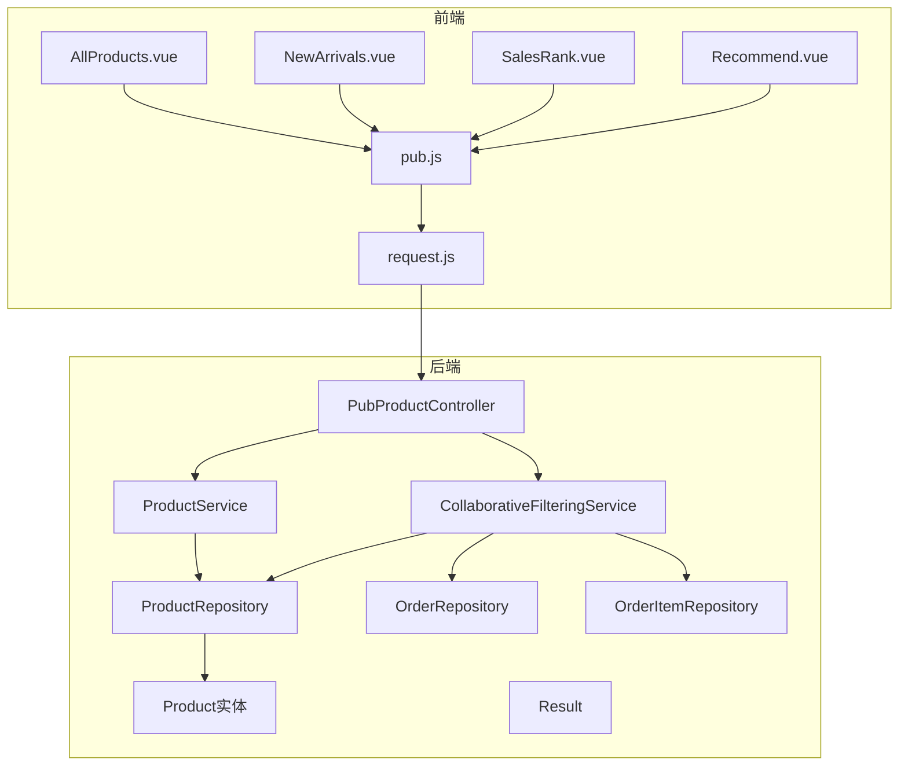
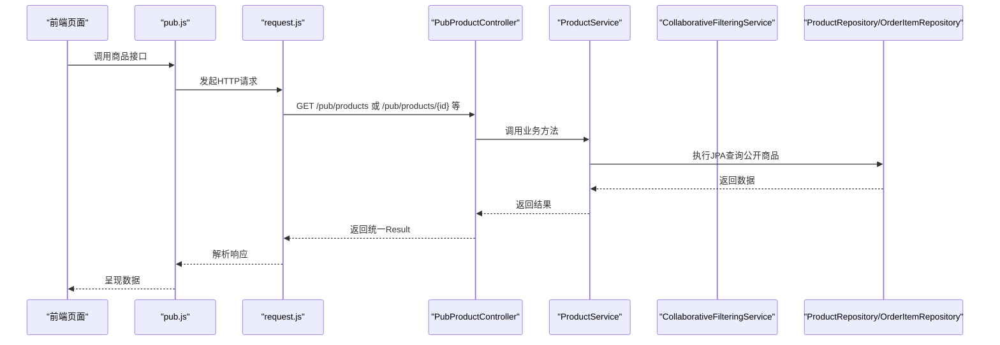
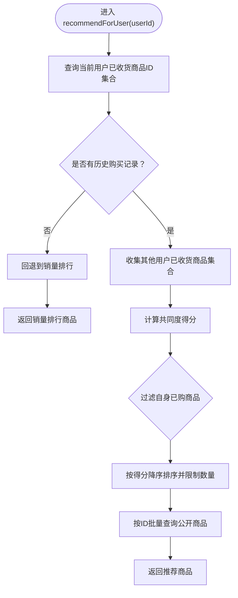
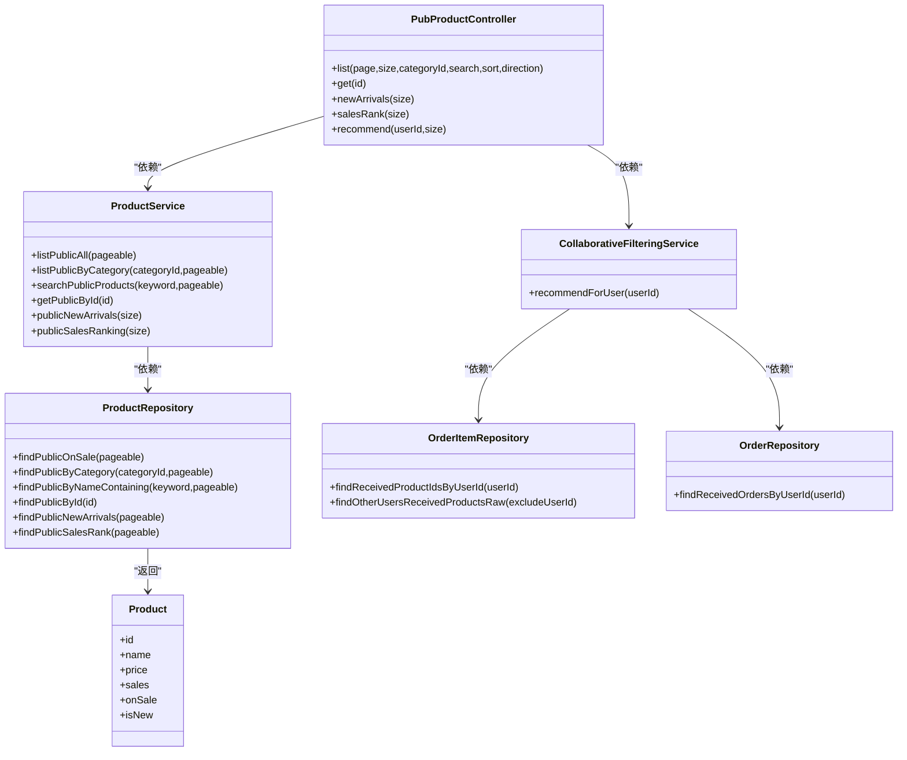

# 用户端商品接口

<cite>
**本文引用的文件**
- [PubProductController.java](file://backend/src/main/java/com/mall/controller/pub/PubProductController.java)
- [ProductService.java](file://backend/src/main/java/com/mall/service/ProductService.java)
- [CollaborativeFilteringService.java](file://backend/src/main/java/com/mall/service/CollaborativeFilteringService.java)
- [ProductRepository.java](file://backend/src/main/java/com/mall/repository/ProductRepository.java)
- [OrderItemRepository.java](file://backend/src/main/java/com/mall/repository/OrderItemRepository.java)
- [OrderRepository.java](file://backend/src/main/java/com/mall/repository/OrderRepository.java)
- [Product.java](file://backend/src/main/java/com/mall/entity/Product.java)
- [Result.java](file://backend/src/main/java/com/mall/dto/Result.java)
- [pub.js](file://frontend/src/api/pub.js)
- [AllProducts.vue](file://frontend/src/views/user/AllProducts.vue)
- [NewArrivals.vue](file://frontend/src/views/user/NewArrivals.vue)
- [SalesRank.vue](file://frontend/src/views/user/SalesRank.vue)
- [Recommend.vue](file://frontend/src/views/user/Recommend.vue)
- [request.js](file://frontend/src/api/request.js)
- [application.yml](file://backend/src/main/resources/application.yml)
</cite>

## 目录
1. [简介](#简介)
2. [项目结构](#项目结构)
3. [核心组件](#核心组件)
4. [架构总览](#架构总览)
5. [详细组件分析](#详细组件分析)
6. [依赖分析](#依赖分析)
7. [性能考虑](#性能考虑)
8. [故障排查指南](#故障排查指南)
9. [结论](#结论)
10. [附录](#附录)

## 简介
本文件面向电商商城系统用户端的商品接口，提供完整、可操作的API文档，覆盖以下用户侧能力：
- 公开商品列表查询（分页、分类过滤、搜索、排序）
- 商品详情查询
- 新品推荐
- 销量排行
- 个性化推荐（协同过滤算法）

文档包含接口定义、请求参数、响应格式、错误处理、调用示例及实现原理说明，帮助前后端协作与集成。

## 项目结构
后端采用Spring Boot + Spring Data JPA，控制器位于公开模块，服务层负责业务逻辑，仓储层封装数据库查询；前端通过统一的API模块封装HTTP请求。

图表来源
- [PubProductController.java:15-95](file://backend/src/main/java/com/mall/controller/pub/PubProductController.java#L15-L95)
- [ProductService.java:15-126](file://backend/src/main/java/com/mall/service/ProductService.java#L15-L126)
- [CollaborativeFilteringService.java:14-81](file://backend/src/main/java/com/mall/service/CollaborativeFilteringService.java#L14-L81)
- [ProductRepository.java:12-125](file://backend/src/main/java/com/mall/repository/ProductRepository.java#L12-L125)
- [OrderItemRepository.java:9-20](file://backend/src/main/java/com/mall/repository/OrderItemRepository.java#L9-L20)
- [OrderRepository.java:13-28](file://backend/src/main/java/com/mall/repository/OrderRepository.java#L13-L28)
- [Product.java:9-101](file://backend/src/main/java/com/mall/entity/Product.java#L9-L101)
- [Result.java:7-24](file://backend/src/main/java/com/mall/dto/Result.java#L7-L24)
- [pub.js:1-74](file://frontend/src/api/pub.js#L1-L74)
- [AllProducts.vue:130-267](file://frontend/src/views/user/AllProducts.vue#L130-L267)
- [NewArrivals.vue:16-32](file://frontend/src/views/user/NewArrivals.vue#L16-L32)
- [SalesRank.vue:16-32](file://frontend/src/views/user/SalesRank.vue#L16-L32)
- [Recommend.vue:18-41](file://frontend/src/views/user/Recommend.vue#L18-L41)
- [request.js:1-38](file://frontend/src/api/request.js#L1-L38)

章节来源
- [application.yml:22-26](file://backend/src/main/resources/application.yml#L22-L26)

## 核心组件
- 控制器：公开商品接口由控制器集中暴露，支持分页、过滤、搜索、排序、详情、新品、排行、个性化推荐。
- 服务层：
  - 商品服务：封装公开与管理端的商品查询、搜索、新品与销量排行。
  - 协同过滤服务：基于“相似用户共同购买”生成个性化推荐。
- 仓储层：JPA查询封装公开商品的上架与运营启用状态约束，以及搜索、分类、销量等查询。
- 数据模型：商品实体包含价格、销量、上下架、新品标记等关键字段。
- 统一响应：后端统一返回包装对象，便于前端解析。

章节来源
- [PubProductController.java:15-95](file://backend/src/main/java/com/mall/controller/pub/PubProductController.java#L15-L95)
- [ProductService.java:15-126](file://backend/src/main/java/com/mall/service/ProductService.java#L15-L126)
- [CollaborativeFilteringService.java:14-81](file://backend/src/main/java/com/mall/service/CollaborativeFilteringService.java#L14-L81)
- [ProductRepository.java:12-125](file://backend/src/main/java/com/mall/repository/ProductRepository.java#L12-L125)
- [Product.java:9-101](file://backend/src/main/java/com/mall/entity/Product.java#L9-L101)
- [Result.java:7-24](file://backend/src/main/java/com/mall/dto/Result.java#L7-L24)

## 架构总览
用户端商品接口遵循“前端请求 → 控制器 → 服务 → 仓储 → 数据库”的标准分层架构。公开接口统一走“公开商品”查询路径，确保只返回“上架且商家启用”的商品。

图表来源
- [pub.js:1-74](file://frontend/src/api/pub.js#L1-L74)
- [request.js:1-38](file://frontend/src/api/request.js#L1-L38)
- [PubProductController.java:24-93](file://backend/src/main/java/com/mall/controller/pub/PubProductController.java#L24-L93)
- [ProductService.java:42-82](file://backend/src/main/java/com/mall/service/ProductService.java#L42-L82)
- [ProductRepository.java:32-105](file://backend/src/main/java/com/mall/repository/ProductRepository.java#L32-L105)
- [CollaborativeFilteringService.java:32-79](file://backend/src/main/java/com/mall/service/CollaborativeFilteringService.java#L32-L79)

## 详细组件分析

### 公开商品列表查询接口
- URL路径：/pub/products
- HTTP方法：GET
- 功能：分页查询公开商品，支持按分类过滤、关键词搜索、排序。
- 请求参数
  - page：页码，从0开始，默认0
  - size：每页数量，默认12
  - categoryId：可选，按分类过滤
  - search：可选，关键词搜索
  - sort：可选，排序字段，支持 price、sales、createdAt
  - direction：可选，排序方向 asc 或 desc，默认 asc
- 响应格式
  - 成功：统一包装对象，data为分页结果
  - 失败：统一包装对象，code非200，message为错误信息
- 实现要点
  - 构建排序规范，映射前端字段到实体字段
  - 搜索优先于分类过滤
  - 返回“上架且商家启用”的商品
- 调用示例
  - GET /pub/products?page=0&size=12&categoryId=1&sort=price&direction=asc
  - GET /pub/products?page=0&size=12&search=手机&sort=sales&direction=desc

章节来源
- [PubProductController.java:24-46](file://backend/src/main/java/com/mall/controller/pub/PubProductController.java#L24-L46)
- [ProductService.java:42-50](file://backend/src/main/java/com/mall/service/ProductService.java#L42-L50)
- [ProductRepository.java:32-58](file://backend/src/main/java/com/mall/repository/ProductRepository.java#L32-L58)
- [Result.java:16-22](file://backend/src/main/java/com/mall/dto/Result.java#L16-L22)

### 商品详情查询接口
- URL路径：/pub/products/{id}
- HTTP方法：GET
- 功能：查询公开商品详情，仅返回“上架且商家启用”的商品
- 请求参数
  - id：路径参数，商品ID
- 响应格式
  - 成功：统一包装对象，data为商品详情
  - 失败：统一包装对象，message提示“商品不存在”
- 调用示例
  - GET /pub/products/123

章节来源
- [PubProductController.java:63-69](file://backend/src/main/java/com/mall/controller/pub/PubProductController.java#L63-L69)
- [ProductService.java:27-30](file://backend/src/main/java/com/mall/service/ProductService.java#L27-L30)
- [ProductRepository.java:85-91](file://backend/src/main/java/com/mall/repository/ProductRepository.java#L85-L91)
- [Result.java:16-22](file://backend/src/main/java/com/mall/dto/Result.java#L16-L22)

### 新品推荐接口
- URL路径：/pub/products/new
- HTTP方法：GET
- 功能：返回公开的新品列表
- 请求参数
  - size：可选，返回数量，默认10
- 响应格式
  - 成功：统一包装对象，data为商品数组
- 调用示例
  - GET /pub/products/new?size=20

章节来源
- [PubProductController.java:71-76](file://backend/src/main/java/com/mall/controller/pub/PubProductController.java#L71-L76)
- [ProductService.java:69-72](file://backend/src/main/java/com/mall/service/ProductService.java#L69-L72)
- [ProductRepository.java:60-67](file://backend/src/main/java/com/mall/repository/ProductRepository.java#L60-L67)

### 销量排行接口
- URL路径：/pub/products/rank
- HTTP方法：GET
- 功能：返回公开的销量排行
- 请求参数
  - size：可选，返回数量，默认10
- 响应格式
  - 成功：统一包装对象，data为商品数组
- 调用示例
  - GET /pub/products/rank?size=20

章节来源
- [PubProductController.java:78-83](file://backend/src/main/java/com/mall/controller/pub/PubProductController.java#L78-L83)
- [ProductService.java:74-77](file://backend/src/main/java/com/mall/service/ProductService.java#L74-L77)
- [ProductRepository.java:69-75](file://backend/src/main/java/com/mall/repository/ProductRepository.java#L69-L75)

### 个性化推荐接口（协同过滤）
- URL路径：/pub/products/recommend
- HTTP方法：GET
- 功能：基于协同过滤算法生成“猜您想买”，需登录用户传入userId
- 请求参数
  - userId：必填，当前登录用户ID
  - size：可选，返回数量，默认20
- 响应格式
  - 成功：统一包装对象，data为商品数组
  - 无历史购买记录或无匹配推荐时，回退到销量排行
- 实现原理
  - 收集当前用户已收货商品ID集合
  - 统计其他用户与其存在共同购买记录的商品，按共同度打分
  - 过滤掉当前用户已购买商品，按分数降序取Top N
  - 若无推荐则回退到公开销量排行
- 调用示例
  - GET /pub/products/recommend?userId=1001&size=20

图表来源
- [CollaborativeFilteringService.java:32-79](file://backend/src/main/java/com/mall/service/CollaborativeFilteringService.java#L32-L79)
- [OrderItemRepository.java:13-18](file://backend/src/main/java/com/mall/repository/OrderItemRepository.java#L13-L18)
- [ProductRepository.java:76-83](file://backend/src/main/java/com/mall/repository/ProductRepository.java#L76-L83)

章节来源
- [PubProductController.java:85-93](file://backend/src/main/java/com/mall/controller/pub/PubProductController.java#L85-L93)
- [CollaborativeFilteringService.java:14-81](file://backend/src/main/java/com/mall/service/CollaborativeFilteringService.java#L14-L81)
- [OrderItemRepository.java:13-18](file://backend/src/main/java/com/mall/repository/OrderItemRepository.java#L13-L18)
- [ProductRepository.java:76-83](file://backend/src/main/java/com/mall/repository/ProductRepository.java#L76-L83)

### 前端调用与页面集成
- 商品列表页
  - 使用API模块发起分页查询，支持分类过滤、关键词搜索、多种排序方式
  - 自动同步URL查询参数，避免重复请求
- 新品页、销量排行页、个性化推荐页
  - 分别调用对应接口，渲染商品卡片
- 统一请求封装
  - 基础URL为 /api，自动附加Authorization头
  - 401/403时清理本地会话并跳转登录

章节来源
- [pub.js:8-31](file://frontend/src/api/pub.js#L8-L31)
- [AllProducts.vue:176-261](file://frontend/src/views/user/AllProducts.vue#L176-L261)
- [NewArrivals.vue:16-32](file://frontend/src/views/user/NewArrivals.vue#L16-L32)
- [SalesRank.vue:16-32](file://frontend/src/views/user/SalesRank.vue#L16-L32)
- [Recommend.vue:18-41](file://frontend/src/views/user/Recommend.vue#L18-L41)
- [request.js:4-35](file://frontend/src/api/request.js#L4-L35)

## 依赖分析
- 控制器依赖服务层，服务层依赖仓储层
- 协同过滤依赖订单项与订单仓储以获取用户购买行为
- 仓储层依赖数据库，公开查询强制“上架且商家启用”

图表来源
- [PubProductController.java:21-22](file://backend/src/main/java/com/mall/controller/pub/PubProductController.java#L21-L22)
- [ProductService.java:20-20](file://backend/src/main/java/com/mall/service/ProductService.java#L20-L20)
- [CollaborativeFilteringService.java:22-24](file://backend/src/main/java/com/mall/service/CollaborativeFilteringService.java#L22-L24)
- [ProductRepository.java:13-13](file://backend/src/main/java/com/mall/repository/ProductRepository.java#L13-L13)
- [OrderItemRepository.java:9-9](file://backend/src/main/java/com/mall/repository/OrderItemRepository.java#L9-L9)
- [OrderRepository.java:13-13](file://backend/src/main/java/com/mall/repository/OrderRepository.java#L13-L13)
- [Product.java:16-101](file://backend/src/main/java/com/mall/entity/Product.java#L16-L101)

## 性能考虑
- 分页与排序
  - 后端默认分页大小为12，排序字段限定在价格、销量、创建时间，避免全表扫描
- 查询约束
  - 公开查询强制“上架且商家启用”，减少无效数据传输
- 推荐回退
  - 协同过滤无结果时回退销量排行，保证用户体验
- 前端缓存
  - 建议对静态列表与排行接口进行轻量缓存，降低后端压力

## 故障排查指南
- 401/403鉴权失败
  - 前端拦截器会清理本地token并跳转登录页
- 商品不存在
  - 详情接口返回“商品不存在”，检查ID与公开状态
- 推荐为空
  - 当前用户无购买记录或无相似用户共同购买，触发销量排行回退
- 搜索无结果
  - 检查关键词是否命中商品名称或描述，确认公开状态

章节来源
- [request.js:18-35](file://frontend/src/api/request.js#L18-L35)
- [PubProductController.java:67-69](file://backend/src/main/java/com/mall/controller/pub/PubProductController.java#L67-L69)
- [CollaborativeFilteringService.java:36-64](file://backend/src/main/java/com/mall/service/CollaborativeFilteringService.java#L36-L64)

## 结论
用户端商品接口以公开查询为核心，结合搜索、分类、排序与排行能力，辅以协同过滤个性化推荐，形成完整的前端展示与交互闭环。通过统一的响应包装与清晰的参数约定，便于前后端协作与扩展。

## 附录

### 统一响应格式
- 成功：{ code: 200, message: "success", data: ... }
- 失败：{ code: 非200, message: "错误信息", data: null }

章节来源
- [Result.java:16-22](file://backend/src/main/java/com/mall/dto/Result.java#L16-L22)

### 数据模型（商品）
- 关键字段：id、merchantId、categoryId、name、description、detailDescription、image、imageList、detailImages、brand、attributes、price、originalPrice、unit、stock、sales、onSale、isNew、createdAt、updatedAt

章节来源
- [Product.java:16-101](file://backend/src/main/java/com/mall/entity/Product.java#L16-L101)