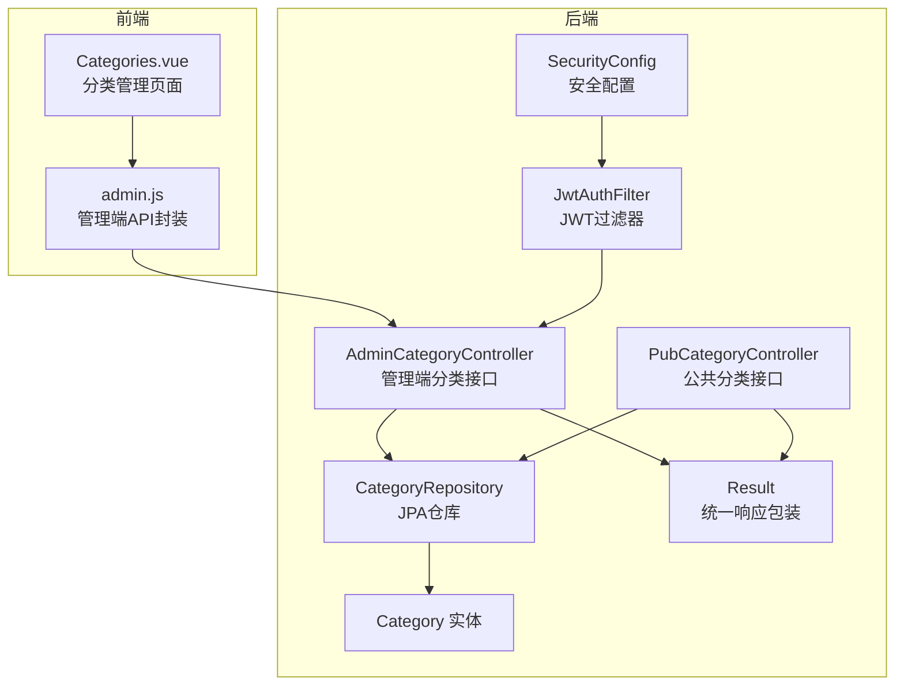
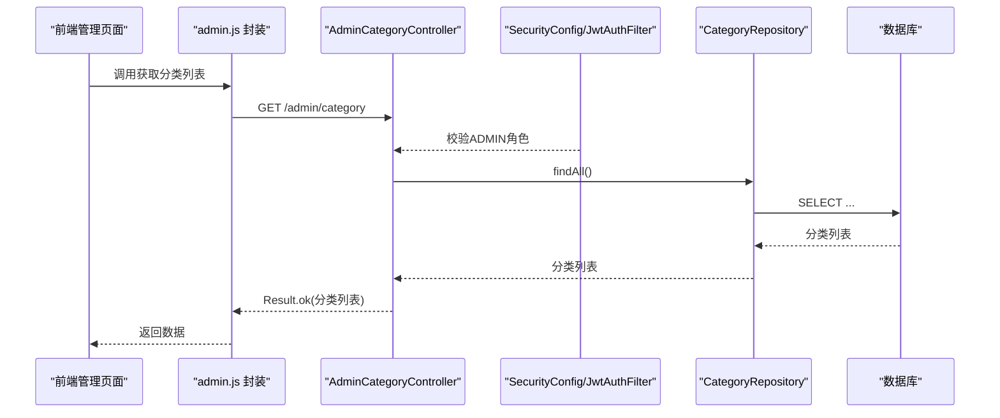
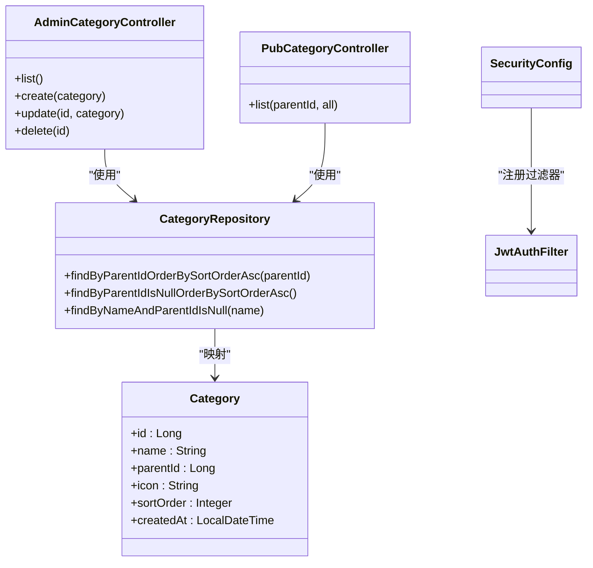
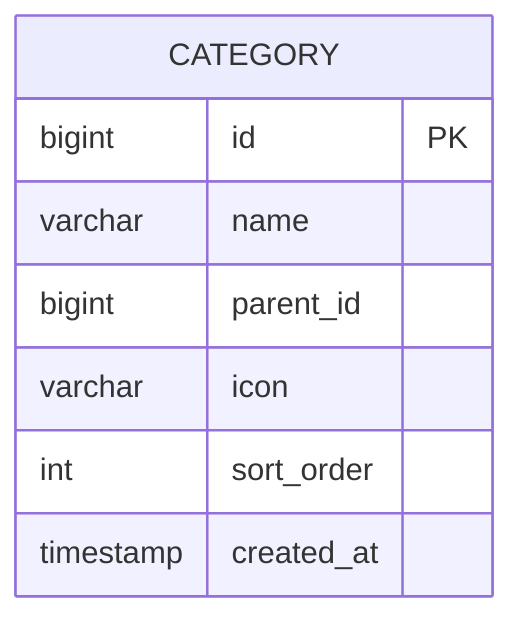

# 管理员商品分类接口

<cite>
**本文引用的文件**
- [AdminCategoryController.java](file://backend/src/main/java/com/mall/controller/admin/AdminCategoryController.java)
- [Category.java](file://backend/src/main/java/com/mall/entity/Category.java)
- [CategoryRepository.java](file://backend/src/main/java/com/mall/repository/CategoryRepository.java)
- [PubCategoryController.java](file://backend/src/main/java/com/mall/controller/pub/PubCategoryController.java)
- [SecurityConfig.java](file://backend/src/main/java/com/mall/config/SecurityConfig.java)
- [JwtAuthFilter.java](file://backend/src/main/java/com/mall/security/JwtAuthFilter.java)
- [Role.java](file://backend/src/main/java/com/mall/common/Role.java)
- [Result.java](file://backend/src/main/java/com/mall/dto/Result.java)
- [Categories.vue](file://frontend/src/views/admin/Categories.vue)
- [admin.js](file://frontend/src/api/admin.js)
- [application.yml](file://backend/src/main/resources/application.yml)
</cite>

## 目录
1. [简介](#简介)
2. [项目结构](#项目结构)
3. [核心组件](#核心组件)
4. [架构总览](#架构总览)
5. [详细组件分析](#详细组件分析)
6. [依赖分析](#依赖分析)
7. [性能考虑](#性能考虑)
8. [故障排除指南](#故障排除指南)
9. [结论](#结论)
10. [附录](#附录)

## 简介
本文件面向电商商城系统管理员，提供商品分类管理接口的完整API文档。内容涵盖：
- 分类管理接口：创建、编辑、删除、列表查询
- 分类查询接口：树形结构查询、按父级查询
- 分类状态管理：通过排序字段控制展示顺序
- 层级结构实现：父子关系与排序机制
- 完整操作示例：请求格式、响应结构、删除级联逻辑
- 权限范围与数据安全：基于角色的访问控制与JWT认证

## 项目结构
后端采用Spring Boot + JPA，管理员分类接口位于管理端控制器中，数据库实体与仓库定义清晰，公共端提供分类树形查询能力；前端提供分类管理页面与API封装。

图表来源
- [AdminCategoryController.java:12-46](file://backend/src/main/java/com/mall/controller/admin/AdminCategoryController.java#L12-L46)
- [PubCategoryController.java:13-37](file://backend/src/main/java/com/mall/controller/pub/PubCategoryController.java#L13-L37)
- [CategoryRepository.java:9-16](file://backend/src/main/java/com/mall/repository/CategoryRepository.java#L9-L16)
- [Category.java:8-40](file://backend/src/main/java/com/mall/entity/Category.java#L8-L40)
- [SecurityConfig.java:22-54](file://backend/src/main/java/com/mall/config/SecurityConfig.java#L22-L54)
- [JwtAuthFilter.java:18-56](file://backend/src/main/java/com/mall/security/JwtAuthFilter.java#L18-L56)
- [Result.java:7-23](file://backend/src/main/java/com/mall/dto/Result.java#L7-L23)
- [Categories.vue:99-215](file://frontend/src/views/admin/Categories.vue#L99-L215)
- [admin.js:58-76](file://frontend/src/api/admin.js#L58-L76)

章节来源
- [AdminCategoryController.java:12-46](file://backend/src/main/java/com/mall/controller/admin/AdminCategoryController.java#L12-L46)
- [PubCategoryController.java:13-37](file://backend/src/main/java/com/mall/controller/pub/PubCategoryController.java#L13-L37)
- [CategoryRepository.java:9-16](file://backend/src/main/java/com/mall/repository/CategoryRepository.java#L9-L16)
- [Category.java:8-40](file://backend/src/main/java/com/mall/entity/Category.java#L8-L40)
- [SecurityConfig.java:22-54](file://backend/src/main/java/com/mall/config/SecurityConfig.java#L22-L54)
- [JwtAuthFilter.java:18-56](file://backend/src/main/java/com/mall/security/JwtAuthFilter.java#L18-L56)
- [Result.java:7-23](file://backend/src/main/java/com/mall/dto/Result.java#L7-L23)
- [Categories.vue:99-215](file://frontend/src/views/admin/Categories.vue#L99-L215)
- [admin.js:58-76](file://frontend/src/api/admin.js#L58-L76)

## 核心组件
- 管理端分类控制器：提供分类的增删改查REST接口，返回统一结果包装。
- 分类实体：包含主键、名称、父级ID、图标、排序字段、创建时间等。
- 分类仓库：提供按父级查询、顶级查询、排序规则等方法。
- 公共分类控制器：提供树形查询能力，支持按父级或全量查询。
- 安全配置：基于路径匹配的权限控制，/admin/** 需要ADMIN角色。
- JWT过滤器：从请求头解析Bearer Token，注入认证上下文。
- 统一响应：Result包装code、message、data，便于前后端约定。

章节来源
- [AdminCategoryController.java:12-46](file://backend/src/main/java/com/mall/controller/admin/AdminCategoryController.java#L12-L46)
- [Category.java:15-40](file://backend/src/main/java/com/mall/entity/Category.java#L15-L40)
- [CategoryRepository.java:9-16](file://backend/src/main/java/com/mall/repository/CategoryRepository.java#L9-L16)
- [PubCategoryController.java:13-37](file://backend/src/main/java/com/mall/controller/pub/PubCategoryController.java#L13-L37)
- [SecurityConfig.java:33-54](file://backend/src/main/java/com/mall/config/SecurityConfig.java#L33-L54)
- [JwtAuthFilter.java:24-47](file://backend/src/main/java/com/mall/security/JwtAuthFilter.java#L24-L47)
- [Result.java:10-23](file://backend/src/main/java/com/mall/dto/Result.java#L10-L23)

## 架构总览
管理员分类管理遵循前后端分离架构：前端通过封装的API调用后端管理端接口；后端通过控制器暴露REST端点，使用JPA仓库访问数据库；安全层通过JWT过滤器与Spring Security进行角色校验。

图表来源
- [admin.js:58-61](file://frontend/src/api/admin.js#L58-L61)
- [AdminCategoryController.java:20-24](file://backend/src/main/java/com/mall/controller/admin/AdminCategoryController.java#L20-L24)
- [SecurityConfig.java:48-50](file://backend/src/main/java/com/mall/config/SecurityConfig.java#L48-L50)
- [JwtAuthFilter.java:30-46](file://backend/src/main/java/com/mall/security/JwtAuthFilter.java#L30-L46)
- [CategoryRepository.java:9-16](file://backend/src/main/java/com/mall/repository/CategoryRepository.java#L9-L16)

## 详细组件分析

### 管理端分类接口
- 接口路径：/admin/category
- 方法与用途：
  - GET /admin/category：获取分类列表（按sortOrder升序）
  - POST /admin/category：创建分类（请求体为Category对象）
  - PUT /admin/category/{id}：更新分类（请求体为Category对象）
  - DELETE /admin/category/{id}：删除分类（物理删除）

请求与响应要点
- 请求体：Category对象，包含name、parentId、icon、sortOrder等字段
- 响应体：Result包装，code=200表示成功，data为实际业务数据
- 删除行为：当前实现为物理删除，未做子分类迁移或重排

章节来源
- [AdminCategoryController.java:20-45](file://backend/src/main/java/com/mall/controller/admin/AdminCategoryController.java#L20-L45)
- [Result.java:16-18](file://backend/src/main/java/com/mall/dto/Result.java#L16-L18)

### 分类实体与层级结构
- 主键：id（自增）
- 名称：name（非空，长度限制）
- 父级：parentId（可空，空表示顶级）
- 图标：icon（可空）
- 排序：sortOrder（默认0，数值越小优先级越高）
- 时间：createdAt（持久化前自动填充）

层级与排序实现
- 顶级分类：parentId为空
- 子分类：通过parentId关联父节点
- 展示顺序：按sortOrder升序，再按id升序

章节来源
- [Category.java:17-40](file://backend/src/main/java/com/mall/entity/Category.java#L17-L40)
- [CategoryRepository.java:11-13](file://backend/src/main/java/com/mall/repository/CategoryRepository.java#L11-L13)

### 分类仓库与查询策略
- findByParentIdOrderBySortOrderAsc：按父级查询子分类并按sortOrder升序
- findByParentIdIsNullOrderBySortOrderAsc：查询顶级分类并按sortOrder升序
- findByNameAndParentIdIsNull：按名称与父级为空查询唯一顶级分类

章节来源
- [CategoryRepository.java:11-15](file://backend/src/main/java/com/mall/repository/CategoryRepository.java#L11-L15)

### 公共分类查询接口
- 接口路径：/pub/categories
- 参数：
  - parentId：指定父级ID，查询其子分类
  - all：true时返回全部分类，按sortOrder与id升序
- 返回：分类列表（Result包装）

章节来源
- [PubCategoryController.java:21-36](file://backend/src/main/java/com/mall/controller/pub/PubCategoryController.java#L21-L36)

### 前端集成与操作流程
- 页面：Categories.vue 提供分类列表、搜索、筛选、排序、弹窗编辑/新增
- API封装：admin.js 提供getCategories/createCategory/updateCategory/deleteCategory
- 操作流程：加载列表 → 选择父级 → 设置排序 → 提交表单 → 刷新列表

章节来源
- [Categories.vue:100-214](file://frontend/src/views/admin/Categories.vue#L100-L214)
- [admin.js:58-76](file://frontend/src/api/admin.js#L58-L76)

### 安全与权限控制
- 角色枚举：ADMIN、MERCHANT、USER
- 路由权限：
  - /admin/** 需要ADMIN角色
  - /merchant/** 需要MERCHANT角色
  - /user/** 需要USER角色
- JWT认证：
  - 请求头携带 Authorization: Bearer <token>
  - 过滤器解析token，注入认证信息到SecurityContext

章节来源
- [SecurityConfig.java:48-50](file://backend/src/main/java/com/mall/config/SecurityConfig.java#L48-L50)
- [JwtAuthFilter.java:30-46](file://backend/src/main/java/com/mall/security/JwtAuthFilter.java#L30-L46)
- [Role.java:3-7](file://backend/src/main/java/com/mall/common/Role.java#L3-L7)

## 依赖分析
- 控制器依赖仓库：AdminCategoryController依赖CategoryRepository进行数据访问
- 仓库依赖实体：CategoryRepository继承JPA，映射Category实体
- 公共接口依赖仓库：PubCategoryController同样依赖CategoryRepository
- 安全依赖：SecurityConfig配置路径匹配与JWT过滤器链

图表来源
- [AdminCategoryController.java:18-18](file://backend/src/main/java/com/mall/controller/admin/AdminCategoryController.java#L18-L18)
- [PubCategoryController.java:19-19](file://backend/src/main/java/com/mall/controller/pub/PubCategoryController.java#L19-L19)
- [CategoryRepository.java:9-16](file://backend/src/main/java/com/mall/repository/CategoryRepository.java#L9-L16)
- [Category.java:15-40](file://backend/src/main/java/com/mall/entity/Category.java#L15-L40)
- [SecurityConfig.java:29-31](file://backend/src/main/java/com/mall/config/SecurityConfig.java#L29-L31)
- [JwtAuthFilter.java:26-27](file://backend/src/main/java/com/mall/security/JwtAuthFilter.java#L26-L27)

章节来源
- [AdminCategoryController.java:18-18](file://backend/src/main/java/com/mall/controller/admin/AdminCategoryController.java#L18-L18)
- [PubCategoryController.java:19-19](file://backend/src/main/java/com/mall/controller/pub/PubCategoryController.java#L19-L19)
- [CategoryRepository.java:9-16](file://backend/src/main/java/com/mall/repository/CategoryRepository.java#L9-L16)
- [Category.java:15-40](file://backend/src/main/java/com/mall/entity/Category.java#L15-L40)
- [SecurityConfig.java:29-31](file://backend/src/main/java/com/mall/config/SecurityConfig.java#L29-L31)
- [JwtAuthFilter.java:26-27](file://backend/src/main/java/com/mall/security/JwtAuthFilter.java#L26-L27)

## 性能考虑
- 查询排序：仓库已按sortOrder升序，避免前端重复排序
- 分页建议：若分类规模扩大，建议在管理端接口引入分页参数（Pageable），减少一次性传输
- 索引优化：数据库可对parentId、sortOrder建立索引，提升树形查询效率
- 前端渲染：当前前端对列表进行本地过滤与排序，数据量大时建议后端承担排序与筛选

## 故障排除指南
- 认证失败
  - 现象：返回未授权或被拒绝
  - 排查：确认请求头是否包含正确的Authorization: Bearer <token>，token是否过期
  - 参考：SecurityConfig对/admin/**的权限配置与JwtAuthFilter的token解析
- 权限不足
  - 现象：403 Forbidden
  - 排查：确认登录用户角色为ADMIN
  - 参考：SecurityConfig中/admin/**需要ADMIN角色
- 删除异常
  - 现象：删除后子分类仍存在或顺序错乱
  - 说明：当前实现为物理删除，未做子分类迁移或重排；如需级联处理，应在服务层扩展
- 排序异常
  - 现象：排序不生效
  - 排查：确认sortOrder字段值正确，仓库查询按sortOrder升序

章节来源
- [SecurityConfig.java:48-50](file://backend/src/main/java/com/mall/config/SecurityConfig.java#L48-L50)
- [JwtAuthFilter.java:30-46](file://backend/src/main/java/com/mall/security/JwtAuthFilter.java#L30-L46)
- [AdminCategoryController.java:40-45](file://backend/src/main/java/com/mall/controller/admin/AdminCategoryController.java#L40-L45)
- [CategoryRepository.java:11-13](file://backend/src/main/java/com/mall/repository/CategoryRepository.java#L11-L13)

## 结论
管理员商品分类接口提供了完整的增删改查能力，结合排序字段实现了层级展示与顺序控制。通过JWT与角色权限保障了接口的安全性。当前删除为物理删除，未做子分类处理；建议在后续版本中增强服务层逻辑以支持更完善的层级维护与级联处理。

## 附录

### API定义与示例

- 获取分类列表
  - 方法：GET
  - 路径：/admin/category
  - 认证：ADMIN角色
  - 响应：Result.ok(分类数组)
  - 示例：参考前端调用封装

- 创建分类
  - 方法：POST
  - 路径：/admin/category
  - 请求体：Category对象（name、parentId、icon、sortOrder）
  - 认证：ADMIN角色
  - 响应：Result.ok(新建分类)

- 更新分类
  - 方法：PUT
  - 路径：/admin/category/{id}
  - 请求体：Category对象（含id）
  - 认证：ADMIN角色
  - 响应：Result.ok(更新后的分类)

- 删除分类
  - 方法：DELETE
  - 路径：/admin/category/{id}
  - 认证：ADMIN角色
  - 响应：Result.ok(null)
  - 说明：当前为物理删除，未做子分类迁移

- 公共分类查询
  - 方法：GET
  - 路径：/pub/categories
  - 参数：
    - parentId：父级ID（可选）
    - all：true时返回全部分类（可选）
  - 响应：Result.ok(分类数组)

章节来源
- [AdminCategoryController.java:20-45](file://backend/src/main/java/com/mall/controller/admin/AdminCategoryController.java#L20-L45)
- [PubCategoryController.java:21-36](file://backend/src/main/java/com/mall/controller/pub/PubCategoryController.java#L21-L36)
- [admin.js:58-76](file://frontend/src/api/admin.js#L58-L76)

### 数据模型图

图表来源
- [Category.java:17-40](file://backend/src/main/java/com/mall/entity/Category.java#L17-L40)