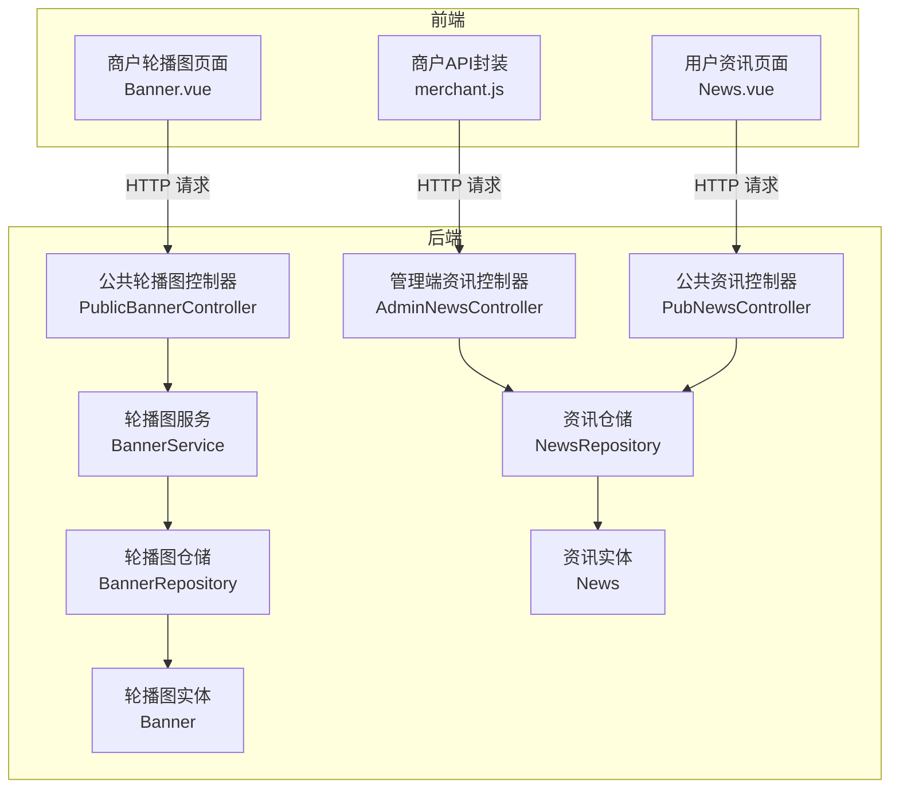
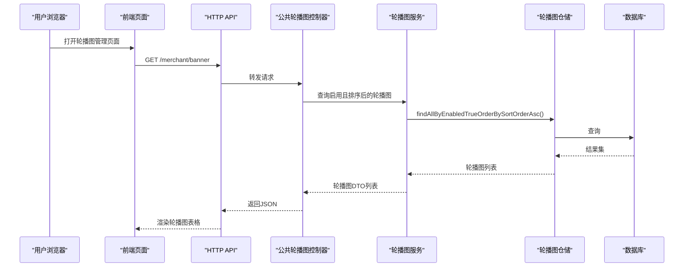
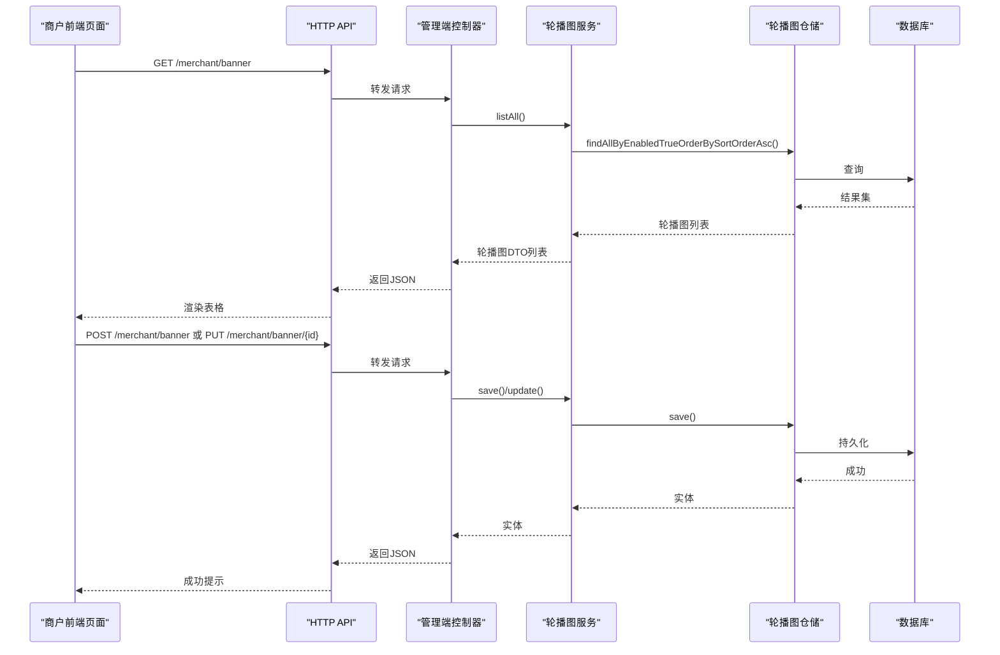
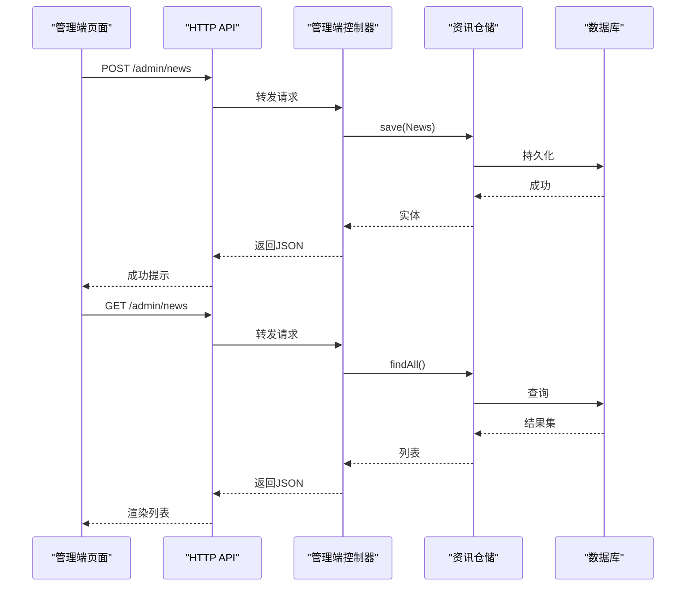
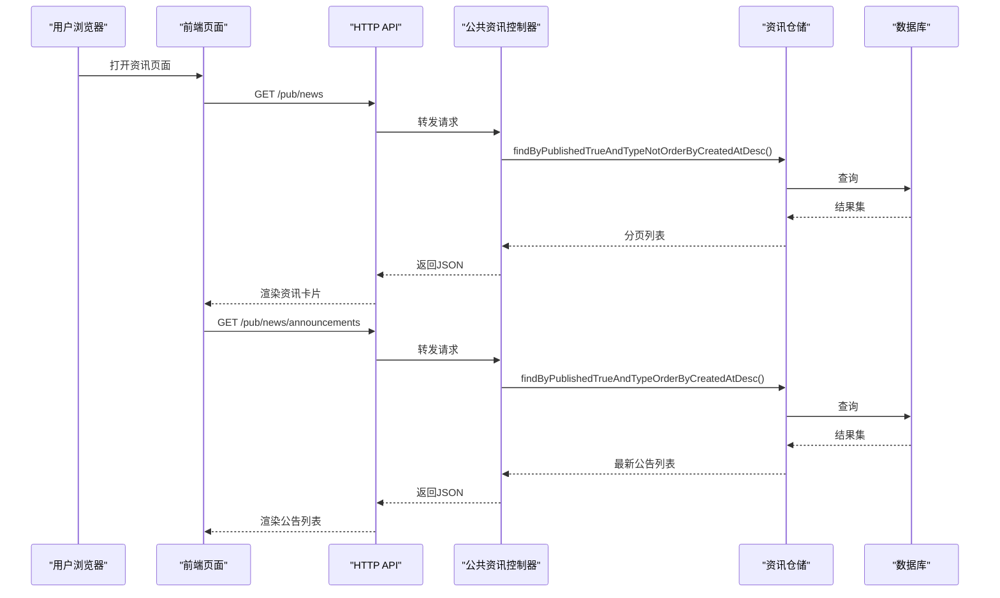
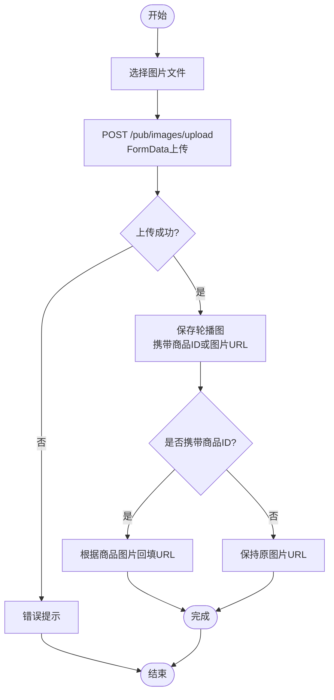
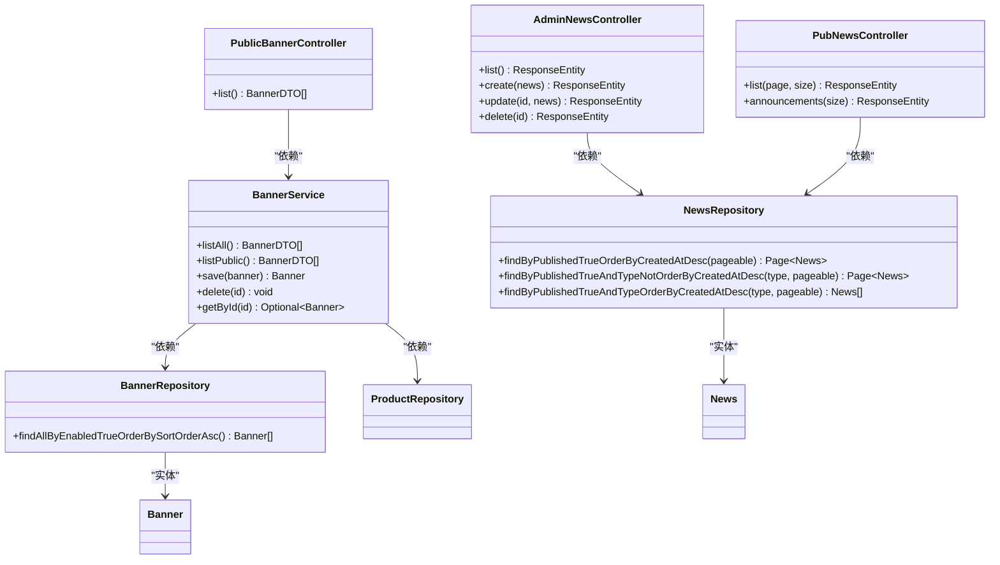

# 内容管理接口

<cite>
**本文引用的文件**
- [application.yml](file://backend/src/main/resources/application.yml)
- [Banner.java](file://backend/src/main/java/com/mall/entity/Banner.java)
- [BannerDTO.java](file://backend/src/main/java/com/mall/dto/BannerDTO.java)
- [BannerRepository.java](file://backend/src/main/java/com/mall/repository/BannerRepository.java)
- [BannerService.java](file://backend/src/main/java/com/mall/service/BannerService.java)
- [PublicBannerController.java](file://backend/src/main/java/com/mall/controller/pub/PublicBannerController.java)
- [News.java](file://backend/src/main/java/com/mall/entity/News.java)
- [NewsRepository.java](file://backend/src/main/java/com/mall/repository/NewsRepository.java)
- [AdminNewsController.java](file://backend/src/main/java/com/mall/controller/admin/AdminNewsController.java)
- [PubNewsController.java](file://backend/src/main/java/com/mall/controller/pub/PubNewsController.java)
- [Banner.vue](file://frontend/src/views/merchant/Banner.vue)
- [News.vue](file://frontend/src/views/user/News.vue)
- [merchant.js](file://frontend/src/api/merchant.js)
</cite>

## 目录
1. [简介](#简介)
2. [项目结构](#项目结构)
3. [核心组件](#核心组件)
4. [架构总览](#架构总览)
5. [详细组件分析](#详细组件分析)
6. [依赖分析](#依赖分析)
7. [性能考虑](#性能考虑)
8. [故障排查指南](#故障排查指南)
9. [结论](#结论)
10. [附录](#附录)

## 简介
本文件面向电商商城系统的商户内容管理接口，聚焦以下能力：
- 轮播图管理：新增、编辑、删除、排序、启用/禁用；支持关联已上架商品并自动填充商品信息。
- 公告与资讯发布：后台管理端创建/修改/删除资讯与公告；前台公共接口分页查询与展示。
- 图片上传：统一的图片上传接口，支持轮播图与商品图片等场景。

文档同时提供图片上传规范、轮播图尺寸建议、内容展示位置配置说明，并给出内容营销最佳实践、视觉设计建议与用户体验优化方案。

## 项目结构
后端采用Spring Boot + JPA，前端使用Vue 2 + Element UI。商户侧内容管理主要涉及：
- 商户轮播图管理页面（前端）
- 公共轮播图接口（后端）
- 公告/资讯管理接口（后端）
- 数据模型与仓储层（后端）

图表来源
- [PublicBannerController.java:12-22](file://backend/src/main/java/com/mall/controller/pub/PublicBannerController.java#L12-L22)
- [AdminNewsController.java:13-47](file://backend/src/main/java/com/mall/controller/admin/AdminNewsController.java#L13-L47)
- [PubNewsController.java:13-35](file://backend/src/main/java/com/mall/controller/pub/PubNewsController.java#L13-L35)
- [BannerService.java:16-84](file://backend/src/main/java/com/mall/service/BannerService.java#L16-L84)
- [BannerRepository.java:7-9](file://backend/src/main/java/com/mall/repository/BannerRepository.java#L7-L9)
- [NewsRepository.java:11-18](file://backend/src/main/java/com/mall/repository/NewsRepository.java#L11-L18)
- [Banner.java:7-59](file://backend/src/main/java/com/mall/entity/Banner.java#L7-L59)
- [News.java:8-51](file://backend/src/main/java/com/mall/entity/News.java#L8-L51)

章节来源
- [application.yml:1-36](file://backend/src/main/resources/application.yml#L1-L36)

## 核心组件
- 轮播图实体与DTO
  - 实体包含标题、关联商品ID、图片URL、跳转链接、排序权重、启用状态及时间戳。
  - DTO在实体基础上扩展商品展示字段，便于前后端交互。
- 轮播图服务
  - 提供列表查询、公开列表过滤、保存、删除、按ID查询等方法；保存时根据商品ID回填图片URL。
- 轮播图仓储
  - 提供按启用状态与排序权重升序查询的方法。
- 公共轮播图控制器
  - 对外提供轮播图列表查询接口，仅返回启用且排序后的轮播图。
- 公告/资讯实体与仓储
  - 实体包含标题、内容、类型（资讯/公告）、发布状态及时间戳。
  - 仓储提供按发布状态与类型筛选的分页查询方法。
- 公共资讯控制器与管理端控制器
  - 公共接口：分页查询已发布资讯（排除公告），查询最新公告列表。
  - 管理端接口：对资讯/公告进行增删改查。
- 前端组件
  - 商户轮播图页面：支持选择已上架商品、设置排序权重、启用/禁用、图片预览与增删改操作。
  - 用户资讯页面：支持资讯与公告分类查看与合并展示。

章节来源
- [Banner.java:14-59](file://backend/src/main/java/com/mall/entity/Banner.java#L14-L59)
- [BannerDTO.java:7-32](file://backend/src/main/java/com/mall/dto/BannerDTO.java#L7-L32)
- [BannerService.java:16-84](file://backend/src/main/java/com/mall/service/BannerService.java#L16-L84)
- [BannerRepository.java:7-9](file://backend/src/main/java/com/mall/repository/BannerRepository.java#L7-L9)
- [PublicBannerController.java:12-22](file://backend/src/main/java/com/mall/controller/pub/PublicBannerController.java#L12-L22)
- [News.java:16-51](file://backend/src/main/java/com/mall/entity/News.java#L16-L51)
- [NewsRepository.java:11-18](file://backend/src/main/java/com/mall/repository/NewsRepository.java#L11-L18)
- [AdminNewsController.java:13-47](file://backend/src/main/java/com/mall/controller/admin/AdminNewsController.java#L13-L47)
- [PubNewsController.java:13-35](file://backend/src/main/java/com/mall/controller/pub/PubNewsController.java#L13-L35)
- [Banner.vue:143-286](file://frontend/src/views/merchant/Banner.vue#L143-L286)
- [News.vue:84-146](file://frontend/src/views/user/News.vue#L84-L146)

## 架构总览
系统遵循“前端页面 + HTTP API + 后端服务 + 数据库”的分层架构。商户轮播图管理通过前端页面调用后端公共接口；公告/资讯由管理端维护并通过公共接口向用户展示。

图表来源
- [PublicBannerController.java:18-21](file://backend/src/main/java/com/mall/controller/pub/PublicBannerController.java#L18-L21)
- [BannerService.java:22-33](file://backend/src/main/java/com/mall/service/BannerService.java#L22-L33)
- [BannerRepository.java:8-8](file://backend/src/main/java/com/mall/repository/BannerRepository.java#L8-L8)

## 详细组件分析

### 轮播图管理（商户侧）
- 功能点
  - 新增/编辑：选择已上架商品、设置排序权重、启用/禁用。
  - 删除：确认对话框后发起删除请求。
  - 图片预览：点击缩略图弹出大图查看器。
- 数据流
  - 前端从商品接口获取已上架商品列表，选择后填充商品预览。
  - 保存时根据是否存在ID判断新增或更新，提交到对应路径。
- 关键接口
  - GET /merchant/banner：获取轮播图列表（前端页面已使用）
  - POST /merchant/banner：新增轮播图
  - PUT /merchant/banner/{id}：更新轮播图
  - DELETE /merchant/banner/{id}：删除轮播图

图表来源
- [Banner.vue:173-247](file://frontend/src/views/merchant/Banner.vue#L173-L247)
- [merchant.js:122-134](file://frontend/src/api/merchant.js#L122-L134)
- [BannerService.java:69-75](file://backend/src/main/java/com/mall/service/BannerService.java#L69-L75)
- [BannerRepository.java:8-8](file://backend/src/main/java/com/mall/repository/BannerRepository.java#L8-L8)

章节来源
- [Banner.vue:143-286](file://frontend/src/views/merchant/Banner.vue#L143-L286)
- [merchant.js:122-134](file://frontend/src/api/merchant.js#L122-L134)
- [BannerService.java:16-84](file://backend/src/main/java/com/mall/service/BannerService.java#L16-L84)
- [BannerRepository.java:7-9](file://backend/src/main/java/com/mall/repository/BannerRepository.java#L7-L9)

### 公告与资讯发布（管理端与公共接口）
- 管理端能力
  - 列表查询、创建、更新、删除资讯/公告。
- 公共接口能力
  - 分页查询已发布资讯（排除公告）。
  - 查询最新公告列表。
- 数据模型
  - News实体包含标题、内容、类型（资讯/公告）、发布状态与时间戳。
  - 仓储提供按发布状态与类型筛选的分页查询方法。

图表来源
- [AdminNewsController.java:21-46](file://backend/src/main/java/com/mall/controller/admin/AdminNewsController.java#L21-L46)
- [NewsRepository.java:11-18](file://backend/src/main/java/com/mall/repository/NewsRepository.java#L11-L18)

图表来源
- [PubNewsController.java:21-34](file://backend/src/main/java/com/mall/controller/pub/PubNewsController.java#L21-L34)
- [NewsRepository.java:15-17](file://backend/src/main/java/com/mall/repository/NewsRepository.java#L15-L17)

章节来源
- [AdminNewsController.java:13-47](file://backend/src/main/java/com/mall/controller/admin/AdminNewsController.java#L13-L47)
- [PubNewsController.java:13-35](file://backend/src/main/java/com/mall/controller/pub/PubNewsController.java#L13-L35)
- [News.java:16-51](file://backend/src/main/java/com/mall/entity/News.java#L16-L51)
- [NewsRepository.java:11-18](file://backend/src/main/java/com/mall/repository/NewsRepository.java#L11-L18)
- [News.vue:84-146](file://frontend/src/views/user/News.vue#L84-L146)

### 图片上传与轮播图图片管理
- 统一上传接口
  - 前端通过multipart/form-data上传文件至后端图片上传接口。
  - 返回上传后的URL，商户在轮播图中直接引用该URL。
- 轮播图图片回填
  - 保存轮播图时，若传入商品ID，则服务层自动根据商品图片回填轮播图图片URL，减少重复输入。

图表来源
- [merchant.js:127-134](file://frontend/src/api/merchant.js#L127-L134)
- [BannerService.java:69-75](file://backend/src/main/java/com/mall/service/BannerService.java#L69-L75)

章节来源
- [merchant.js:122-134](file://frontend/src/api/merchant.js#L122-L134)
- [BannerService.java:69-75](file://backend/src/main/java/com/mall/service/BannerService.java#L69-L75)

## 依赖分析
- 组件耦合
  - 控制器仅依赖服务层，服务层依赖仓储层，职责清晰。
  - 轮播图服务在保存时依赖商品仓储以回填图片URL，存在跨实体依赖但逻辑简单。
- 外部依赖
  - Spring Data JPA提供仓储抽象与分页查询能力。
  - MySQL作为持久化存储。

图表来源
- [PublicBannerController.java:12-22](file://backend/src/main/java/com/mall/controller/pub/PublicBannerController.java#L12-L22)
- [AdminNewsController.java:13-47](file://backend/src/main/java/com/mall/controller/admin/AdminNewsController.java#L13-L47)
- [PubNewsController.java:13-35](file://backend/src/main/java/com/mall/controller/pub/PubNewsController.java#L13-L35)
- [BannerService.java:16-84](file://backend/src/main/java/com/mall/service/BannerService.java#L16-L84)
- [BannerRepository.java:7-9](file://backend/src/main/java/com/mall/repository/BannerRepository.java#L7-L9)
- [NewsRepository.java:11-18](file://backend/src/main/java/com/mall/repository/NewsRepository.java#L11-L18)

## 性能考虑
- 查询优化
  - 轮播图列表按启用状态与排序权重升序查询，避免前端二次排序。
  - 公告/资讯查询使用分页参数，限制每次返回数量。
- 缓存建议
  - 对高频访问的轮播图列表与公告列表可引入Redis缓存，降低数据库压力。
- 图片优化
  - 建议对上传图片进行压缩与格式标准化，减少带宽与渲染时间。
- 并发与事务
  - 保存轮播图时尽量保持短事务，避免长时间锁表。

## 故障排查指南
- 轮播图无法显示
  - 检查轮播图是否启用(enabled=true)，以及排序权重是否正确。
  - 确认图片URL可访问，必要时重新上传图片。
- 商品未关联或图片未回填
  - 确认选择的是已上架商品，服务层会根据商品ID回填图片URL。
- 公告/资讯未在前台展示
  - 管理端需将published设为true，且类型不为ANNOUNCEMENT（资讯列表排除公告）。
- 图片上传失败
  - 检查文件类型与大小限制，确认上传接口路径与Content-Type设置正确。

章节来源
- [BannerService.java:69-75](file://backend/src/main/java/com/mall/service/BannerService.java#L69-L75)
- [BannerRepository.java:8-8](file://backend/src/main/java/com/mall/repository/BannerRepository.java#L8-L8)
- [PubNewsController.java:21-34](file://backend/src/main/java/com/mall/controller/pub/PubNewsController.java#L21-L34)
- [merchant.js:127-134](file://frontend/src/api/merchant.js#L127-L134)

## 结论
本内容管理接口围绕轮播图与公告/资讯两大模块构建，前后端职责清晰、接口简洁明确。通过统一的图片上传能力与商品联动回填机制，商户可以高效地完成首页内容营销与信息发布的日常运营工作。建议在生产环境中结合缓存与图片优化策略进一步提升性能与用户体验。

## 附录

### 接口清单与规范

- 轮播图管理（商户侧）
  - GET /merchant/banner：获取轮播图列表（按启用状态与排序权重升序）
  - POST /merchant/banner：新增轮播图
  - PUT /merchant/banner/{id}：更新轮播图
  - DELETE /merchant/banner/{id}：删除轮播图

- 公告与资讯（管理端）
  - GET /admin/news：查询资讯/公告列表
  - POST /admin/news：创建资讯/公告
  - PUT /admin/news/{id}：更新资讯/公告
  - DELETE /admin/news/{id}：删除资讯/公告

- 公告与资讯（公共接口）
  - GET /pub/news：分页查询已发布资讯（排除公告）
  - GET /pub/news/announcements：查询最新公告列表

- 图片上传
  - POST /pub/images/upload：上传图片，返回URL

章节来源
- [PublicBannerController.java:18-21](file://backend/src/main/java/com/mall/controller/pub/PublicBannerController.java#L18-L21)
- [AdminNewsController.java:21-46](file://backend/src/main/java/com/mall/controller/admin/AdminNewsController.java#L21-L46)
- [PubNewsController.java:21-34](file://backend/src/main/java/com/mall/controller/pub/PubNewsController.java#L21-L34)
- [merchant.js:127-134](file://frontend/src/api/merchant.js#L127-L134)

### 图片上传规范与轮播图尺寸建议
- 文件类型
  - 推荐JPG/JPEG、PNG，避免GIF动画以减少资源消耗。
- 尺寸与比例
  - 首页轮播图建议尺寸：宽度≥750px，高度≈300px，比例约2.5:1。
  - 图片最大文件大小：建议≤2MB。
- URL与CDN
  - 上传后使用稳定域名或CDN加速，确保跨终端加载速度一致。
- 安全性
  - 上传前进行类型与大小校验，防止恶意文件上传。

### 内容展示位置配置
- 首页轮播区
  - 展示位置：首页顶部横幅区域，支持点击跳转至商品详情或自定义链接。
  - 排序规则：数值越小越靠前；默认按sortOrder升序排列。
  - 启用状态：仅enabled=true的轮播图参与展示。
- 公告与资讯区
  - 公告：突出展示，建议置顶最近公告，使用醒目标签。
  - 资讯：按发布时间倒序排列，支持分页浏览。

### 内容营销最佳实践
- 视觉设计
  - 使用品牌主色与对比度高的文案，保证在移动端清晰可读。
  - 图片风格统一，避免过多元素干扰用户注意力。
- 用户体验
  - 轮播图自动轮播时长适中（建议3-5秒），允许用户手动切换。
  - 提供“跳过”按钮或指示器，增强可控性。
- 信息架构
  - 公告优先级分级：紧急/重要/一般，配合颜色与图标区分。
  - 资讯分类标签：如“新品”、“活动”、“系统更新”，便于检索。
- 数据驱动
  - 通过埋点统计点击率与转化率，持续优化内容与排版。