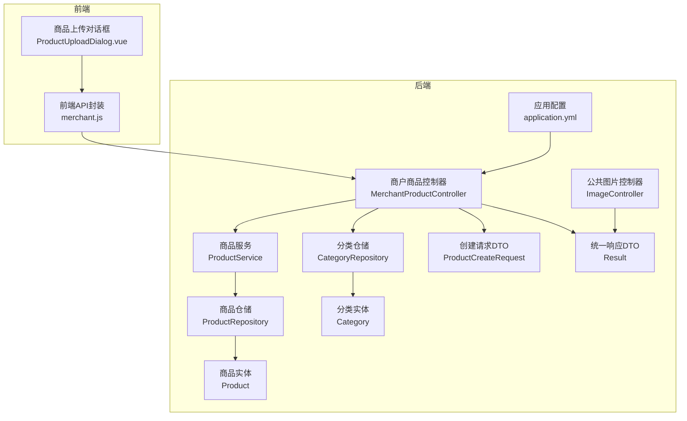
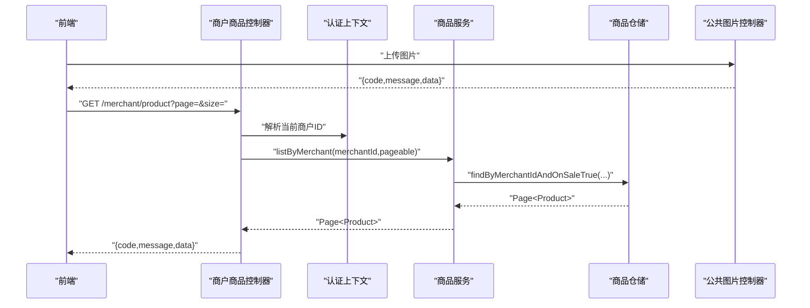
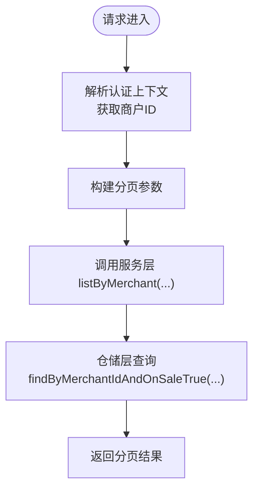
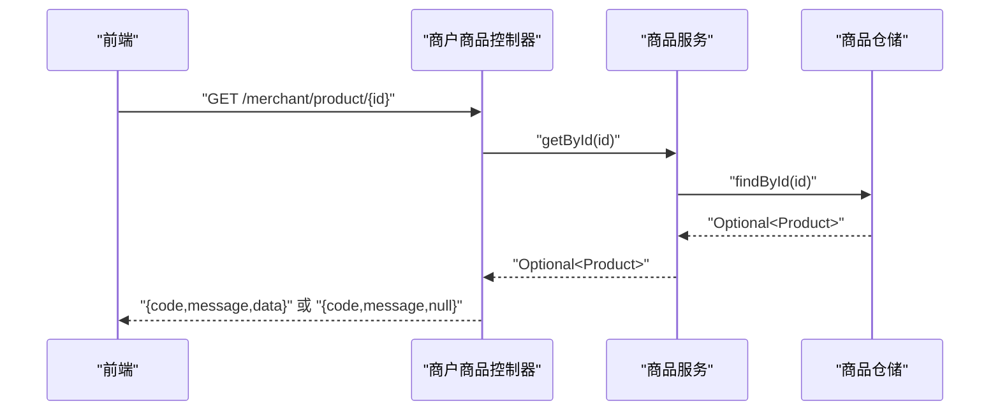
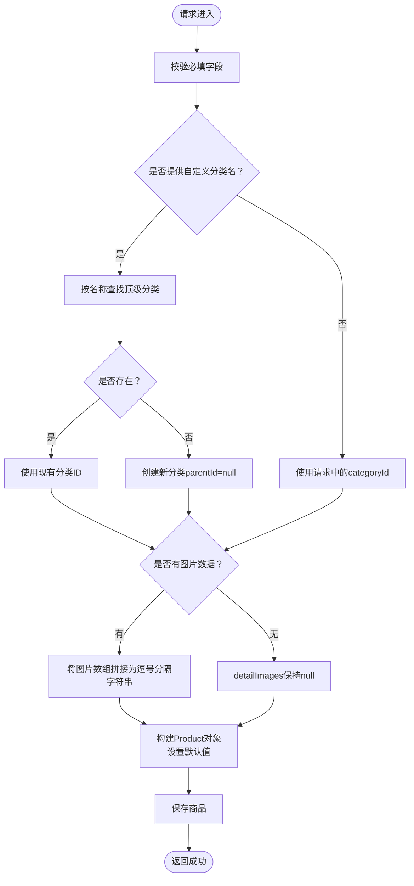
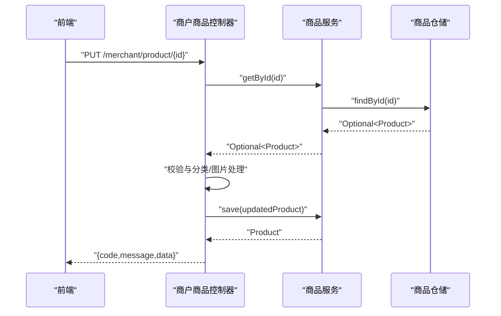
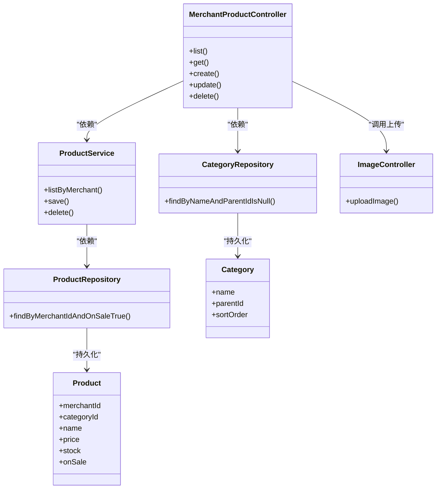

# 商品管理接口

<cite>
**本文引用的文件**
- [MerchantProductController.java](file://backend/src/main/java/com/mall/controller/merchant/MerchantProductController.java)
- [ProductService.java](file://backend/src/main/java/com/mall/service/ProductService.java)
- [ProductRepository.java](file://backend/src/main/java/com/mall/repository/ProductRepository.java)
- [Product.java](file://backend/src/main/java/com/mall/entity/Product.java)
- [Category.java](file://backend/src/main/java/com/mall/entity/Category.java)
- [CategoryRepository.java](file://backend/src/main/java/com/mall/repository/CategoryRepository.java)
- [ProductCreateRequest.java](file://backend/src/main/java/com/mall/dto/ProductCreateRequest.java)
- [Result.java](file://backend/src/main/java/com/mall/dto/Result.java)
- [ImageController.java](file://backend/src/main/java/com/mall/controller/pub/ImageController.java)
- [application.yml](file://backend/src/main/resources/application.yml)
- [merchant.js](file://frontend/src/api/merchant.js)
- [ProductUploadDialog.vue](file://frontend/src/components/merchant/ProductUploadDialog.vue)
- [banner.sql](file://backend/src/main/resources/banner.sql)
</cite>

## 目录
1. [简介](#简介)
2. [项目结构](#项目结构)
3. [核心组件](#核心组件)
4. [架构总览](#架构总览)
5. [详细组件分析](#详细组件分析)
6. [依赖关系分析](#依赖关系分析)
7. [性能考虑](#性能考虑)
8. [故障排查指南](#故障排查指南)
9. [结论](#结论)
10. [附录](#附录)

## 简介
本文件面向电商商城系统的商户角色，提供商品管理接口的完整API文档。内容覆盖：
- 商品列表查询（分页、按运营维度筛选）
- 商品详情获取
- 商品创建（支持分类自动创建、图片处理）
- 商品更新（字段更新、状态变更）
- 商品删除
- 数据模型说明、请求参数校验规则、分类处理逻辑、图片上传格式要求
- 接口调用示例、错误码说明与最佳实践建议

## 项目结构
后端采用Spring Boot + Spring Data JPA架构，接口位于商户模块，数据模型与仓储层清晰分离；前端通过统一请求封装调用后端接口。

**图表来源**
- [MerchantProductController.java:18-180](file://backend/src/main/java/com/mall/controller/merchant/MerchantProductController.java#L18-L180)
- [ProductService.java:15-126](file://backend/src/main/java/com/mall/service/ProductService.java#L15-L126)
- [ProductRepository.java:12-125](file://backend/src/main/java/com/mall/repository/ProductRepository.java#L12-L125)
- [Product.java:9-101](file://backend/src/main/java/com/mall/entity/Product.java#L9-L101)
- [Category.java:8-41](file://backend/src/main/java/com/mall/entity/Category.java#L8-L41)
- [CategoryRepository.java:9-17](file://backend/src/main/java/com/mall/repository/CategoryRepository.java#L9-L17)
- [ProductCreateRequest.java:10-32](file://backend/src/main/java/com/mall/dto/ProductCreateRequest.java#L10-L32)
- [Result.java:10-24](file://backend/src/main/java/com/mall/dto/Result.java#L10-L24)
- [ImageController.java:19-155](file://backend/src/main/java/com/mall/controller/pub/ImageController.java#L19-L155)
- [application.yml:1-36](file://backend/src/main/resources/application.yml#L1-L36)

**章节来源**
- [MerchantProductController.java:18-180](file://backend/src/main/java/com/mall/controller/merchant/MerchantProductController.java#L18-L180)
- [application.yml:22-25](file://backend/src/main/resources/application.yml#L22-L25)

## 核心组件
- 控制器：负责接收HTTP请求、鉴权、参数校验、调用服务层并返回统一响应。
- 服务层：封装业务逻辑，包括分页查询、库存管理、上下架控制等。
- 仓储层：基于JPA的查询方法，提供公开与运营端不同的查询视图。
- 实体模型：商品与分类的数据结构，含字段约束与默认值。
- 请求DTO：商品创建/更新时的入参载体。
- 统一响应：统一返回结构，便于前端处理。
- 图片上传：公共图片接口，支持多格式校验与安全存储。

**章节来源**
- [ProductService.java:15-126](file://backend/src/main/java/com/mall/service/ProductService.java#L15-L126)
- [ProductRepository.java:12-125](file://backend/src/main/java/com/mall/repository/ProductRepository.java#L12-L125)
- [Product.java:9-101](file://backend/src/main/java/com/mall/entity/Product.java#L9-L101)
- [Category.java:8-41](file://backend/src/main/java/com/mall/entity/Category.java#L8-L41)
- [ProductCreateRequest.java:10-32](file://backend/src/main/java/com/mall/dto/ProductCreateRequest.java#L10-L32)
- [Result.java:10-24](file://backend/src/main/java/com/mall/dto/Result.java#L10-L24)

## 架构总览
商户商品管理接口遵循REST风格，通过认证上下文解析当前商户ID，确保操作范围限定在当前运营主体内。图片上传通过独立的公共接口完成，商品详情与列表查询受“上架+运营启用”双重过滤。

**图表来源**
- [MerchantProductController.java:36-44](file://backend/src/main/java/com/mall/controller/merchant/MerchantProductController.java#L36-L44)
- [ProductService.java:52-55](file://backend/src/main/java/com/mall/service/ProductService.java#L52-L55)
- [ProductRepository.java:21-21](file://backend/src/main/java/com/mall/repository/ProductRepository.java#L21-L21)
- [ImageController.java:107-153](file://backend/src/main/java/com/mall/controller/pub/ImageController.java#L107-L153)

## 详细组件分析

### 商品列表查询（分页、按运营维度）
- 接口路径：GET /merchant/product
- 认证：需要商户登录，从认证上下文中提取商户ID
- 参数：
  - page：页码，默认0
  - size：每页大小，默认10
- 返回：分页商品列表（仅“上架且运营启用”的商品）
- 业务要点：
  - 服务层按商户ID与上架状态过滤
  - 仓储层使用原生JPQL实现“运营启用”条件

**图表来源**
- [MerchantProductController.java:36-44](file://backend/src/main/java/com/mall/controller/merchant/MerchantProductController.java#L36-L44)
- [ProductService.java:52-55](file://backend/src/main/java/com/mall/service/ProductService.java#L52-L55)
- [ProductRepository.java:21-21](file://backend/src/main/java/com/mall/repository/ProductRepository.java#L21-L21)

**章节来源**
- [MerchantProductController.java:36-44](file://backend/src/main/java/com/mall/controller/merchant/MerchantProductController.java#L36-L44)
- [ProductService.java:52-55](file://backend/src/main/java/com/mall/service/ProductService.java#L52-L55)
- [ProductRepository.java:21-21](file://backend/src/main/java/com/mall/repository/ProductRepository.java#L21-L21)

### 商品详情获取
- 接口路径：GET /merchant/product/{id}
- 认证：商户登录
- 校验：商品存在且属于当前商户
- 返回：商品详情（若不满足条件返回失败）

**图表来源**
- [MerchantProductController.java:46-54](file://backend/src/main/java/com/mall/controller/merchant/MerchantProductController.java#L46-L54)
- [ProductService.java:22-30](file://backend/src/main/java/com/mall/service/ProductService.java#L22-L30)
- [ProductRepository.java:13-15](file://backend/src/main/java/com/mall/repository/ProductRepository.java#L13-L15)

**章节来源**
- [MerchantProductController.java:46-54](file://backend/src/main/java/com/mall/controller/merchant/MerchantProductController.java#L46-L54)
- [ProductService.java:22-30](file://backend/src/main/java/com/mall/service/ProductService.java#L22-L30)

### 商品创建（支持分类自动创建、图片处理）
- 接口路径：POST /merchant/product
- 认证：商户登录
- 请求体：ProductCreateRequest
- 参数校验：
  - 名称非空
  - 价格 > 0
  - 库存 >= 0
- 分类处理：
  - 若提供categoryId则直接使用
  - 若提供categoryName则先查重，不存在则新建（parentId为空，sortOrder为计数+1）
- 图片处理：
  - images（数组）或detailImages（逗号分隔字符串）二选一
  - 将images数组拼接为逗号分隔字符串存入detailImages
- 默认值：
  - unit默认“件”
  - isNew默认false
  - onSale默认true
  - sales默认0
- 返回：创建后的商品对象

**图表来源**
- [MerchantProductController.java:56-114](file://backend/src/main/java/com/mall/controller/merchant/MerchantProductController.java#L56-L114)
- [CategoryRepository.java:15-15](file://backend/src/main/java/com/mall/repository/CategoryRepository.java#L15-L15)
- [Product.java:64-82](file://backend/src/main/java/com/mall/entity/Product.java#L64-L82)

**章节来源**
- [MerchantProductController.java:56-114](file://backend/src/main/java/com/mall/controller/merchant/MerchantProductController.java#L56-L114)
- [ProductCreateRequest.java:14-31](file://backend/src/main/java/com/mall/dto/ProductCreateRequest.java#L14-L31)
- [CategoryRepository.java:15-15](file://backend/src/main/java/com/mall/repository/CategoryRepository.java#L15-L15)
- [Product.java:64-82](file://backend/src/main/java/com/mall/entity/Product.java#L64-L82)

### 商品更新（字段更新、状态变更）
- 接口路径：PUT /merchant/product/{id}
- 认证：商户登录
- 校验：商品存在且属于当前商户
- 分类处理：同创建逻辑
- 图片处理：同创建逻辑
- 返回：更新后的商品对象

**图表来源**
- [MerchantProductController.java:116-167](file://backend/src/main/java/com/mall/controller/merchant/MerchantProductController.java#L116-L167)
- [ProductService.java:84-92](file://backend/src/main/java/com/mall/service/ProductService.java#L84-L92)

**章节来源**
- [MerchantProductController.java:116-167](file://backend/src/main/java/com/mall/controller/merchant/MerchantProductController.java#L116-L167)
- [ProductService.java:84-92](file://backend/src/main/java/com/mall/service/ProductService.java#L84-L92)

### 商品删除
- 接口路径：DELETE /merchant/product/{id}
- 认证：商户登录
- 校验：商品存在且属于当前商户
- 行为：删除商品
- 返回：空数据

**章节来源**
- [MerchantProductController.java:169-178](file://backend/src/main/java/com/mall/controller/merchant/MerchantProductController.java#L169-L178)

### 数据模型与字段说明
- 商品实体（部分关键字段）
  - merchantId：所属商户ID（必填）
  - categoryId：分类ID
  - name：商品名称（必填，长度<=128）
  - description：商品简介（长度<=500）
  - detailDescription：详细描述（LONGTEXT）
  - image：主图URL
  - detailImages：详情图列表（逗号分隔）
  - brand：品牌
  - attributes：商品参数/规格说明（LONGTEXT）
  - price：现价（必填，精度12,2）
  - originalPrice：原价（精度12,2）
  - unit：价格单位（默认“件”）
  - stock：库存（默认0）
  - sales：销量（默认0）
  - onSale：是否上架（默认true）
  - isNew：是否新品（默认false）
  - createdAt/updatedAt：时间戳
- 分类实体
  - name：分类名称（必填，长度<=64）
  - parentId：父级ID（顶级为null）
  - icon：图标
  - sortOrder：排序权重（默认0）
  - createdAt：创建时间

**章节来源**
- [Product.java:16-101](file://backend/src/main/java/com/mall/entity/Product.java#L16-L101)
- [Category.java:15-41](file://backend/src/main/java/com/mall/entity/Category.java#L15-L41)

### 请求参数与校验规则
- ProductCreateRequest（创建/更新）
  - name：必填，长度2-128
  - description：可选，长度<=500
  - detailDescription：可选，LONGTEXT
  - detailImages：可选，逗号分隔字符串
  - images：可选，字符串数组（内部会拼接为detailImages）
  - brand：可选，长度<=64
  - attributes：可选，LONGTEXT
  - unit：可选，默认“件”
  - categoryId：可选
  - categoryName：可选（用于自动创建分类）
  - price：必填，>0
  - originalPrice：可选，>=0
  - stock：必填，>=0
  - image：可选
  - isNew：可选，默认false
  - onSale：可选，默认true

**章节来源**
- [ProductCreateRequest.java:14-31](file://backend/src/main/java/com/mall/dto/ProductCreateRequest.java#L14-L31)
- [MerchantProductController.java:59-67](file://backend/src/main/java/com/mall/controller/merchant/MerchantProductController.java#L59-L67)

### 分类处理逻辑
- 若请求提供categoryId：直接使用
- 若请求提供categoryName：
  - 查询是否存在同名顶级分类
  - 存在：使用其ID
  - 不存在：创建新分类（parentId=null，sortOrder为当前计数+1）
- 未提供分类参数：保持原有分类（若更新时未传则不变更）

**章节来源**
- [MerchantProductController.java:69-85](file://backend/src/main/java/com/mall/controller/merchant/MerchantProductController.java#L69-L85)
- [CategoryRepository.java:15-15](file://backend/src/main/java/com/mall/repository/CategoryRepository.java#L15-L15)

### 图片上传与格式要求
- 图片上传接口
  - POST /pub/images/upload
  - 支持格式：jpg, jpeg, png, gif, webp, bmp
  - 返回：{fileName, url}
- 商品详情图片处理
  - 前端可上传多张详情图，后端将其拼接为逗号分隔字符串存入detailImages
  - 主图image字段存放单张主图URL
- 前端组件行为
  - 支持单图与多图上传
  - 富文本编辑器集成图片上传（通过fetch调用后端上传接口）

**章节来源**
- [ImageController.java:107-153](file://backend/src/main/java/com/mall/controller/pub/ImageController.java#L107-L153)
- [ProductUploadDialog.vue:382-430](file://frontend/src/components/merchant/ProductUploadDialog.vue#L382-L430)
- [ProductUploadDialog.vue:516-580](file://frontend/src/components/merchant/ProductUploadDialog.vue#L516-L580)

### 统一响应与错误码
- 成功：code=200, message="success"
- 失败：code=400, message=具体错误信息
- 控制器内对非法参数与越权访问返回失败

**章节来源**
- [Result.java:16-22](file://backend/src/main/java/com/mall/dto/Result.java#L16-L22)
- [MerchantProductController.java:59-67](file://backend/src/main/java/com/mall/controller/merchant/MerchantProductController.java#L59-L67)
- [MerchantProductController.java:50-52](file://backend/src/main/java/com/mall/controller/merchant/MerchantProductController.java#L50-L52)

### 前端调用示例
- 查询商品列表：GET /merchant/product?page=0&size=10
- 查询商品详情：GET /merchant/product/{id}
- 创建商品：POST /merchant/product
- 更新商品：PUT /merchant/product/{id}
- 删除商品：DELETE /merchant/product/{id}
- 上传图片：POST /pub/images/upload

**章节来源**
- [merchant.js:13-36](file://frontend/src/api/merchant.js#L13-L36)
- [merchant.js:127-134](file://frontend/src/api/merchant.js#L127-L134)

## 依赖关系分析
- 控制器依赖服务层与仓储层，服务层依赖仓储层
- 商品实体与分类实体通过外键关联（商品可无分类）
- 图片上传独立于商品流程，通过公共接口提供

**图表来源**
- [MerchantProductController.java:24-26](file://backend/src/main/java/com/mall/controller/merchant/MerchantProductController.java#L24-L26)
- [ProductService.java:20-20](file://backend/src/main/java/com/mall/service/ProductService.java#L20-L20)
- [ProductRepository.java:13-21](file://backend/src/main/java/com/mall/repository/ProductRepository.java#L13-L21)
- [CategoryRepository.java:9-15](file://backend/src/main/java/com/mall/repository/CategoryRepository.java#L9-L15)
- [Product.java:16-26](file://backend/src/main/java/com/mall/entity/Product.java#L16-L26)
- [Category.java:15-31](file://backend/src/main/java/com/mall/entity/Category.java#L15-L31)
- [ImageController.java:107-153](file://backend/src/main/java/com/mall/controller/pub/ImageController.java#L107-L153)

**章节来源**
- [MerchantProductController.java:24-26](file://backend/src/main/java/com/mall/controller/merchant/MerchantProductController.java#L24-L26)
- [ProductService.java:20-20](file://backend/src/main/java/com/mall/service/ProductService.java#L20-L20)
- [ProductRepository.java:13-21](file://backend/src/main/java/com/mall/repository/ProductRepository.java#L13-L21)
- [CategoryRepository.java:9-15](file://backend/src/main/java/com/mall/repository/CategoryRepository.java#L9-L15)

## 性能考虑
- 分页查询：使用PageRequest避免一次性加载大量数据
- 条件过滤：仓储层已针对“上架+运营启用”进行过滤，减少前端二次处理
- 图片处理：详情图以逗号分隔字符串存储，查询时O(1)读取，但注意字符串长度限制
- 分类创建：按名称查找与新建均走索引/简单查询，复杂度较低

[本节为通用建议，无需特定文件引用]

## 故障排查指南
- 参数校验失败
  - 现象：返回code=400，message为具体校验错误
  - 排查：检查name、price、stock是否符合要求
- 越权访问
  - 现象：返回“商品不存在”
  - 排查：确认当前登录商户ID与商品merchantId一致
- 图片上传失败
  - 现象：上传接口返回失败
  - 排查：确认文件格式在允许范围内，服务器磁盘权限正常
- 分类创建冲突
  - 现象：重复分类名导致逻辑异常
  - 排查：确认categoryName唯一性或直接提供categoryId

**章节来源**
- [MerchantProductController.java:59-67](file://backend/src/main/java/com/mall/controller/merchant/MerchantProductController.java#L59-L67)
- [MerchantProductController.java:50-52](file://backend/src/main/java/com/mall/controller/merchant/MerchantProductController.java#L50-L52)
- [ImageController.java:118-124](file://backend/src/main/java/com/mall/controller/pub/ImageController.java#L118-L124)

## 结论
本接口体系围绕“商户维度+上架状态”两大约束设计，既保证了运营侧的可控性，又简化了前端调用。通过分类自动创建与图片处理的内置逻辑，进一步降低了前端接入成本。建议在生产环境中结合缓存与CDN优化图片访问，并持续监控分页查询性能。

[本节为总结性内容，无需特定文件引用]

## 附录

### 接口一览（摘要）
- GET /merchant/product?page=&size=
- GET /merchant/product/{id}
- POST /merchant/product
- PUT /merchant/product/{id}
- DELETE /merchant/product/{id}
- POST /pub/images/upload

**章节来源**
- [merchant.js:13-36](file://frontend/src/api/merchant.js#L13-L36)
- [ImageController.java:107-153](file://backend/src/main/java/com/mall/controller/pub/ImageController.java#L107-L153)

### 数据库表结构参考
- 商品表（product）：包含主键、商户ID、分类ID、名称、价格、库存、上下架状态、创建/更新时间等字段
- 分类表（category）：包含主键、名称、父级ID、排序权重、创建时间等字段
- 轮播广告表（banner）：包含主键、标题、关联商品ID、图片URL、链接、排序权重、启用状态、创建/更新时间等字段

**章节来源**
- [Product.java:16-101](file://backend/src/main/java/com/mall/entity/Product.java#L16-L101)
- [Category.java:15-41](file://backend/src/main/java/com/mall/entity/Category.java#L15-L41)
- [banner.sql:1-14](file://backend/src/main/resources/banner.sql#L1-L14)