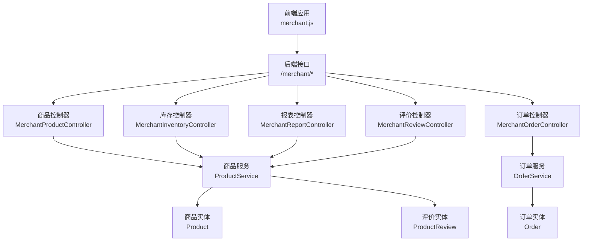
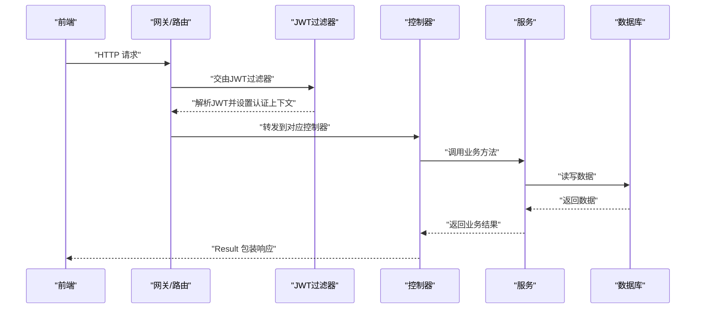
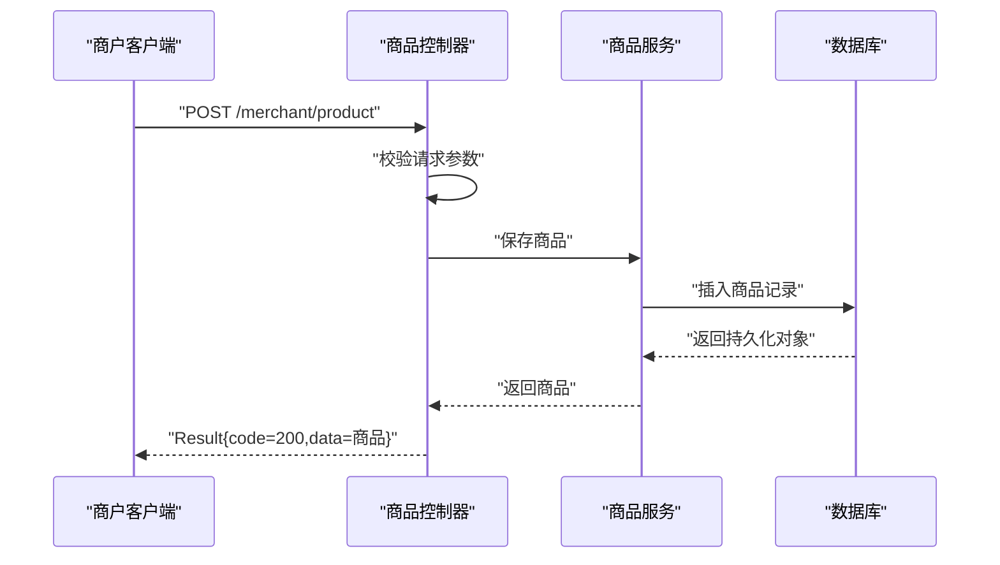
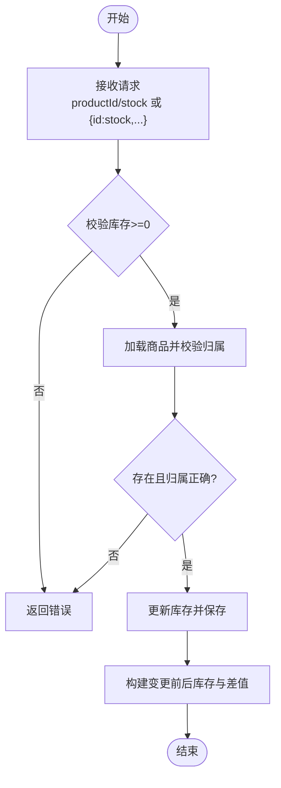
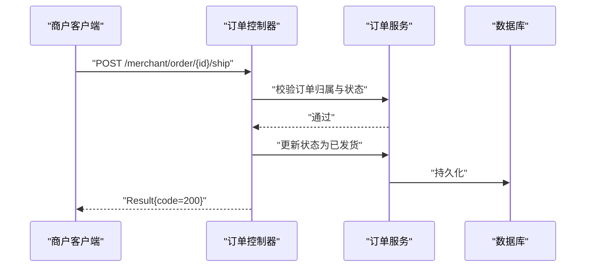
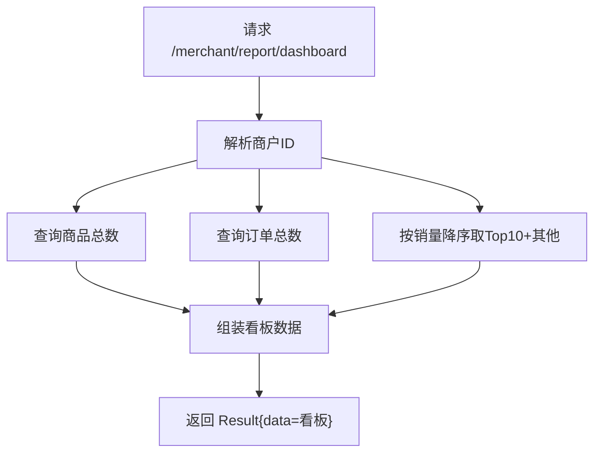
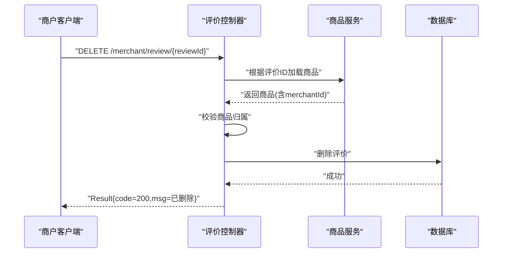
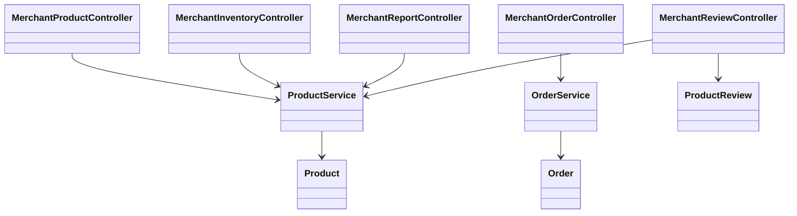

# 商户接口

<cite>
**本文引用的文件**
- [MerchantProductController.java](file://backend/src/main/java/com/mall/controller/merchant/MerchantProductController.java)
- [MerchantInventoryController.java](file://backend/src/main/java/com/mall/controller/merchant/MerchantInventoryController.java)
- [MerchantOrderController.java](file://backend/src/main/java/com/mall/controller/merchant/MerchantOrderController.java)
- [MerchantReportController.java](file://backend/src/main/java/com/mall/controller/merchant/MerchantReportController.java)
- [MerchantReviewController.java](file://backend/src/main/java/com/mall/controller/merchant/MerchantReviewController.java)
- [ProductService.java](file://backend/src/main/java/com/mall/service/ProductService.java)
- [OrderService.java](file://backend/src/main/java/com/mall/service/OrderService.java)
- [Product.java](file://backend/src/main/java/com/mall/entity/Product.java)
- [Order.java](file://backend/src/main/java/com/mall/entity/Order.java)
- [ProductReview.java](file://backend/src/main/java/com/mall/entity/ProductReview.java)
- [Result.java](file://backend/src/main/java/com/mall/dto/Result.java)
- [Role.java](file://backend/src/main/java/com/mall/common/Role.java)
- [application.yml](file://backend/src/main/resources/application.yml)
- [JwtAuthFilter.java](file://backend/src/main/java/com/mall/security/JwtAuthFilter.java)
- [merchant.js](file://frontend/src/api/merchant.js)
</cite>

## 目录
1. [简介](#简介)
2. [项目结构](#项目结构)
3. [核心组件](#核心组件)
4. [架构总览](#架构总览)
5. [详细组件分析](#详细组件分析)
6. [依赖分析](#依赖分析)
7. [性能考虑](#性能考虑)
8. [故障排查指南](#故障排查指南)
9. [结论](#结论)
10. [附录](#附录)

## 简介
本文件为电商商城系统的“商户接口”专业API文档，面向运营（商户）角色，覆盖以下业务域：
- 商品管理：商品上架、下架、编辑、删除、批量操作
- 库存管理：库存查询、库存调整、批量调整、库存预警
- 订单处理：订单接收、发货、状态更新、单项退款审批
- 报表统计：看板数据、商品销量排行
- 评价管理：评价查询、删除、批量删除
- 内容管理：图片上传（用于商品详情等）

同时，文档明确商户权限范围、接口调用限制、数据安全保护机制，并提供接口测试指南与最佳实践。

## 项目结构
后端采用Spring Boot工程，控制器位于merchant包下，对应各业务域的REST接口；服务层封装业务逻辑；实体层定义数据库模型；前端通过统一请求模块调用后端接口。

图表来源
- [merchant.js:1-135](file://frontend/src/api/merchant.js#L1-L135)
- [MerchantProductController.java:1-180](file://backend/src/main/java/com/mall/controller/merchant/MerchantProductController.java#L1-L180)
- [MerchantInventoryController.java:1-118](file://backend/src/main/java/com/mall/controller/merchant/MerchantInventoryController.java#L1-L118)
- [MerchantOrderController.java:1-100](file://backend/src/main/java/com/mall/controller/merchant/MerchantOrderController.java#L1-L100)
- [MerchantReportController.java:1-81](file://backend/src/main/java/com/mall/controller/merchant/MerchantReportController.java#L1-L81)
- [MerchantReviewController.java:1-157](file://backend/src/main/java/com/mall/controller/merchant/MerchantReviewController.java#L1-L157)
- [ProductService.java:1-126](file://backend/src/main/java/com/mall/service/ProductService.java#L1-L126)
- [OrderService.java:1-280](file://backend/src/main/java/com/mall/service/OrderService.java#L1-L280)
- [Product.java:1-101](file://backend/src/main/java/com/mall/entity/Product.java#L1-L101)
- [Order.java:1-83](file://backend/src/main/java/com/mall/entity/Order.java#L1-L83)
- [ProductReview.java:1-44](file://backend/src/main/java/com/mall/entity/ProductReview.java#L1-L44)

章节来源
- [merchant.js:1-135](file://frontend/src/api/merchant.js#L1-L135)
- [application.yml:1-36](file://backend/src/main/resources/application.yml#L1-L36)

## 核心组件
- 接口响应包装器：统一返回结构，便于前端处理
- 商户权限解析：基于JWT载荷解析商户ID，确保资源隔离
- 业务服务层：商品、订单、库存、评价等核心业务逻辑
- 实体模型：商品、订单、评价的数据结构与字段约束

章节来源
- [Result.java:1-24](file://backend/src/main/java/com/mall/dto/Result.java#L1-L24)
- [JwtAuthFilter.java:1-57](file://backend/src/main/java/com/mall/security/JwtAuthFilter.java#L1-L57)
- [ProductService.java:1-126](file://backend/src/main/java/com/mall/service/ProductService.java#L1-L126)
- [OrderService.java:1-280](file://backend/src/main/java/com/mall/service/OrderService.java#L1-L280)
- [Product.java:1-101](file://backend/src/main/java/com/mall/entity/Product.java#L1-L101)
- [Order.java:1-83](file://backend/src/main/java/com/mall/entity/Order.java#L1-L83)
- [ProductReview.java:1-44](file://backend/src/main/java/com/mall/entity/ProductReview.java#L1-L44)

## 架构总览
商户接口遵循“控制器-服务-仓储-实体”的分层架构，使用JWT进行身份认证与授权，控制器通过服务层完成业务处理，并以统一结果对象返回。

图表来源
- [JwtAuthFilter.java:1-57](file://backend/src/main/java/com/mall/security/JwtAuthFilter.java#L1-L57)
- [MerchantProductController.java:1-180](file://backend/src/main/java/com/mall/controller/merchant/MerchantProductController.java#L1-L180)
- [MerchantInventoryController.java:1-118](file://backend/src/main/java/com/mall/controller/merchant/MerchantInventoryController.java#L1-L118)
- [MerchantOrderController.java:1-100](file://backend/src/main/java/com/mall/controller/merchant/MerchantOrderController.java#L1-L100)
- [MerchantReportController.java:1-81](file://backend/src/main/java/com/mall/controller/merchant/MerchantReportController.java#L1-L81)
- [MerchantReviewController.java:1-157](file://backend/src/main/java/com/mall/controller/merchant/MerchantReviewController.java#L1-L157)
- [ProductService.java:1-126](file://backend/src/main/java/com/mall/service/ProductService.java#L1-L126)
- [OrderService.java:1-280](file://backend/src/main/java/com/mall/service/OrderService.java#L1-L280)

## 详细组件分析

### 商品管理接口
- 功能清单
  - 分页查询当前商户商品列表
  - 查询单个商品详情（校验归属）
  - 新增商品（支持按分类名自动创建分类；支持多图逗号分隔存储）
  - 更新商品（同上）
  - 删除商品（校验归属）
- 关键点
  - 控制器通过当前登录用户映射到商户ID，所有操作均进行归属校验
  - 新增/更新时对必填字段进行基础校验
  - 分类名为空则复用既有分类，否则自动创建顶级分类
  - 图片列表统一转换为逗号分隔字符串存储

图表来源
- [MerchantProductController.java:56-114](file://backend/src/main/java/com/mall/controller/merchant/MerchantProductController.java#L56-L114)
- [ProductService.java:84-87](file://backend/src/main/java/com/mall/service/ProductService.java#L84-L87)

章节来源
- [MerchantProductController.java:1-180](file://backend/src/main/java/com/mall/controller/merchant/MerchantProductController.java#L1-L180)
- [ProductService.java:1-126](file://backend/src/main/java/com/mall/service/ProductService.java#L1-L126)
- [Product.java:1-101](file://backend/src/main/java/com/mall/entity/Product.java#L1-L101)

### 库存管理接口
- 功能清单
  - 分页查询库存（支持关键词与库存状态筛选）
  - 单个商品库存调整（校验归属与库存非负）
  - 批量库存调整（逐项校验并原子更新）
  - 库存预警查询（阈值默认10）
- 关键点
  - 所有操作均基于商户维度，防止越权
  - 返回变更前后库存与变化量，便于审计
  - 批量更新失败时，错误信息包含具体商品ID

图表来源
- [MerchantInventoryController.java:46-108](file://backend/src/main/java/com/mall/controller/merchant/MerchantInventoryController.java#L46-L108)
- [ProductService.java:94-124](file://backend/src/main/java/com/mall/service/ProductService.java#L94-L124)

章节来源
- [MerchantInventoryController.java:1-118](file://backend/src/main/java/com/mall/controller/merchant/MerchantInventoryController.java#L1-L118)
- [ProductService.java:94-124](file://backend/src/main/java/com/mall/service/ProductService.java#L94-L124)

### 订单处理接口
- 功能清单
  - 分页查询当前商户订单
  - 查询订单详情（含订单项）
  - 发货（仅已支付订单）
  - 同意整单退款（仅退款申请中）
  - 同意单项退款（仅退款申请中，支持部分数量拆分）
- 关键点
  - 所有操作均进行订单归属校验
  - 发货前置条件为“已支付”，避免异常状态流转
  - 单项退款审批后，若全部订单项已退款，整单同步为已退款

图表来源
- [MerchantOrderController.java:61-71](file://backend/src/main/java/com/mall/controller/merchant/MerchantOrderController.java#L61-L71)
- [OrderService.java:115-121](file://backend/src/main/java/com/mall/service/OrderService.java#L115-L121)

章节来源
- [MerchantOrderController.java:1-100](file://backend/src/main/java/com/mall/controller/merchant/MerchantOrderController.java#L1-L100)
- [OrderService.java:115-121](file://backend/src/main/java/com/mall/service/OrderService.java#L115-L121)
- [Order.java:1-83](file://backend/src/main/java/com/mall/entity/Order.java#L1-L83)

### 报表统计接口
- 功能清单
  - 商家看板：商品数、订单数、销量TopN（其余合并为“其他”）
- 关键点
  - 仅统计当前商户下的数据
  - 销量TopN默认取前10，其余销量求和并加入“其他”

图表来源
- [MerchantReportController.java:41-79](file://backend/src/main/java/com/mall/controller/merchant/MerchantReportController.java#L41-L79)

章节来源
- [MerchantReportController.java:1-81](file://backend/src/main/java/com/mall/controller/merchant/MerchantReportController.java#L1-L81)
- [Product.java](file://backend/src/main/java/com/mall/entity/Product.java#L74)

### 评价管理接口
- 功能清单
  - 分页查询当前商户所有商品的评价（支持按商品与最低评分过滤）
  - 查询单个商品的评价
  - 删除单条评价（校验商品归属）
  - 批量删除评价（逐条校验并删除）
- 关键点
  - 评价查询先收集商户所有商品ID，再过滤对应评价，避免跨商户数据泄露
  - 删除操作严格校验评价所属商品是否属于当前商户

图表来源
- [MerchantReviewController.java:112-132](file://backend/src/main/java/com/mall/controller/merchant/MerchantReviewController.java#L112-L132)
- [ProductReview.java:1-44](file://backend/src/main/java/com/mall/entity/ProductReview.java#L1-L44)

章节来源
- [MerchantReviewController.java:1-157](file://backend/src/main/java/com/mall/controller/merchant/MerchantReviewController.java#L1-L157)
- [ProductReview.java:1-44](file://backend/src/main/java/com/mall/entity/ProductReview.java#L1-L44)

## 依赖分析
- 控制器依赖服务层，服务层依赖仓储与实体
- 控制器间无直接耦合，职责清晰
- 服务层内部通过仓储访问数据库，避免跨模块耦合
- 实体模型定义字段与约束，支撑业务规则

图表来源
- [MerchantProductController.java:1-180](file://backend/src/main/java/com/mall/controller/merchant/MerchantProductController.java#L1-L180)
- [MerchantInventoryController.java:1-118](file://backend/src/main/java/com/mall/controller/merchant/MerchantInventoryController.java#L1-L118)
- [MerchantOrderController.java:1-100](file://backend/src/main/java/com/mall/controller/merchant/MerchantOrderController.java#L1-L100)
- [MerchantReportController.java:1-81](file://backend/src/main/java/com/mall/controller/merchant/MerchantReportController.java#L1-L81)
- [MerchantReviewController.java:1-157](file://backend/src/main/java/com/mall/controller/merchant/MerchantReviewController.java#L1-L157)
- [ProductService.java:1-126](file://backend/src/main/java/com/mall/service/ProductService.java#L1-L126)
- [OrderService.java:1-280](file://backend/src/main/java/com/mall/service/OrderService.java#L1-L280)
- [Product.java:1-101](file://backend/src/main/java/com/mall/entity/Product.java#L1-L101)
- [Order.java:1-83](file://backend/src/main/java/com/mall/entity/Order.java#L1-L83)
- [ProductReview.java:1-44](file://backend/src/main/java/com/mall/entity/ProductReview.java#L1-L44)

## 性能考虑
- 分页查询：所有列表接口均支持分页参数，避免一次性返回大量数据
- 数据筛选：库存查询支持关键词与库存状态筛选，减少无效数据传输
- 批量操作：批量库存调整在服务层循环更新，建议控制单次批量规模，避免长事务
- 查询优化：报表接口按销量降序取TopN，避免全量排序带来的开销
- 安全与鉴权：JWT过滤器在请求进入控制器前完成认证，降低控制器内重复校验成本

## 故障排查指南
- 通用错误
  - 返回码非200：检查请求参数与权限
  - “商品不存在”、“无权限操作”：确认当前登录用户是否属于目标商户
- 库存相关
  - “库存数量必须大于等于0”：确保传入库存非负
  - “商品ID X 的库存数量必须大于等于0”：定位具体商品ID修正
- 订单相关
  - “订单未支付”：仅对已支付订单执行发货
  - “订单不在退货申请状态”：仅对退款申请中订单执行同意退款
- 评价相关
  - “评价不存在”或“无权限删除此评价”：确认评价ID与商品归属

章节来源
- [MerchantInventoryController.java:54-61](file://backend/src/main/java/com/mall/controller/merchant/MerchantInventoryController.java#L54-L61)
- [MerchantOrderController.java:68-82](file://backend/src/main/java/com/mall/controller/merchant/MerchantOrderController.java#L68-L82)
- [MerchantReviewController.java:120-128](file://backend/src/main/java/com/mall/controller/merchant/MerchantReviewController.java#L120-L128)

## 结论
商户接口围绕“商品、库存、订单、报表、评价”五大领域提供完整能力，通过JWT认证与商户ID绑定实现严格的权限隔离。接口设计遵循分层架构与统一响应规范，具备良好的扩展性与安全性。建议在生产环境中结合限流、日志与监控进一步强化稳定性与可观测性。

## 附录

### 接口调用限制与权限范围
- 认证方式：Bearer Token（JWT），请求头格式为 Authorization: Bearer <token>
- 角色要求：仅商户（MERCHANT）角色可访问
- 权限边界：所有接口均以当前登录用户的商户ID作为边界，禁止越权访问

章节来源
- [application.yml:27-30](file://backend/src/main/resources/application.yml#L27-L30)
- [JwtAuthFilter.java:30-46](file://backend/src/main/java/com/mall/security/JwtAuthFilter.java#L30-L46)
- [Role.java:1-8](file://backend/src/main/java/com/mall/common/Role.java#L1-L8)

### 数据安全保护措施
- 身份认证：JWT过滤器解析并校验令牌，注入认证上下文
- 资源隔离：控制器内通过currentMerchantId校验资源归属
- 参数校验：控制器对关键字段进行基础校验（如库存非负、价格>0等）
- 最小暴露：统一Result包装，隐藏底层异常细节

章节来源
- [JwtAuthFilter.java:1-57](file://backend/src/main/java/com/mall/security/JwtAuthFilter.java#L1-L57)
- [MerchantProductController.java:59-67](file://backend/src/main/java/com/mall/controller/merchant/MerchantProductController.java#L59-L67)
- [MerchantInventoryController.java:54-56](file://backend/src/main/java/com/mall/controller/merchant/MerchantInventoryController.java#L54-L56)
- [Result.java:1-24](file://backend/src/main/java/com/mall/dto/Result.java#L1-L24)

### 接口测试指南
- 看板数据
  - GET /merchant/report/dashboard
  - 响应字段：productCount、orderCount、productSalesPie
- 商品管理
  - GET /merchant/product?page=&size=
  - GET /merchant/product/{id}
  - POST /merchant/product
  - PUT /merchant/product/{id}
  - DELETE /merchant/product/{id}
- 库存管理
  - GET /merchant/inventory?page=&size=&keyword=&stockStatus=
  - PUT /merchant/inventory/{productId}/stock（body: {stock: number}）
  - PUT /merchant/inventory/batch-stock（body: {productId: number}...）
  - GET /merchant/inventory/warnings?threshold=
- 订单处理
  - GET /merchant/order?page=&size=
  - GET /merchant/order/{id}
  - POST /merchant/order/{id}/ship
  - POST /merchant/order/{id}/accept-refund
  - POST /merchant/order/{orderId}/items/{itemId}/accept-refund
- 评价管理
  - GET /merchant/review?page=&size=&productId=&minRating=
  - GET /merchant/review/product/{productId}
  - DELETE /merchant/review/{reviewId}
  - POST /merchant/review/batch-delete（body: [reviewId...]）

章节来源
- [merchant.js:1-135](file://frontend/src/api/merchant.js#L1-L135)
- [MerchantReportController.java:41-79](file://backend/src/main/java/com/mall/controller/merchant/MerchantReportController.java#L41-L79)
- [MerchantProductController.java:36-54](file://backend/src/main/java/com/mall/controller/merchant/MerchantProductController.java#L36-L54)
- [MerchantInventoryController.java:33-44](file://backend/src/main/java/com/mall/controller/merchant/MerchantInventoryController.java#L33-L44)
- [MerchantOrderController.java:37-59](file://backend/src/main/java/com/mall/controller/merchant/MerchantOrderController.java#L37-L59)
- [MerchantReviewController.java:39-91](file://backend/src/main/java/com/mall/controller/merchant/MerchantReviewController.java#L39-L91)

### 最佳实践建议
- 统一使用Result响应结构，前端按code与message处理
- 对外暴露的接口尽量使用分页参数，避免超大数据集
- 批量操作建议限制单次批量规模，结合幂等设计
- 对关键字段（库存、价格）进行边界校验与类型约束
- 使用JWT刷新策略与合理过期时间，保障会话安全
- 订单状态机严格控制流转，避免并发状态冲突