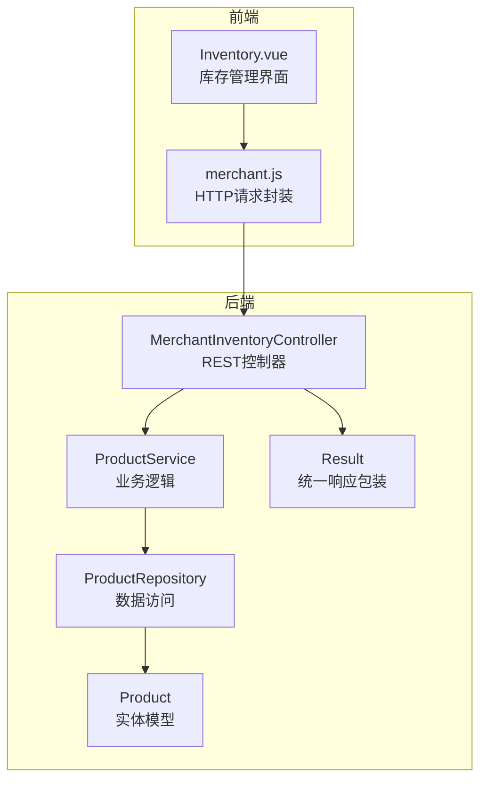
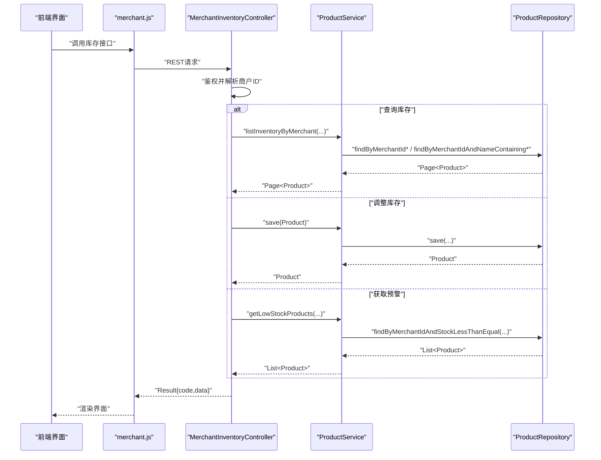
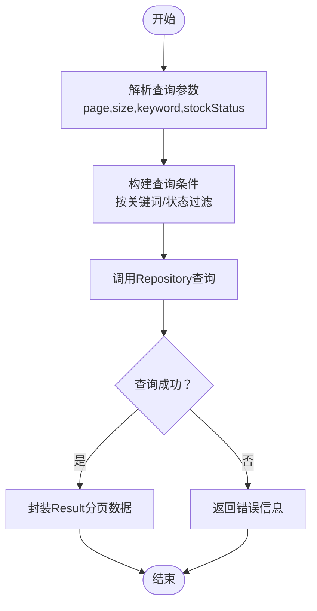
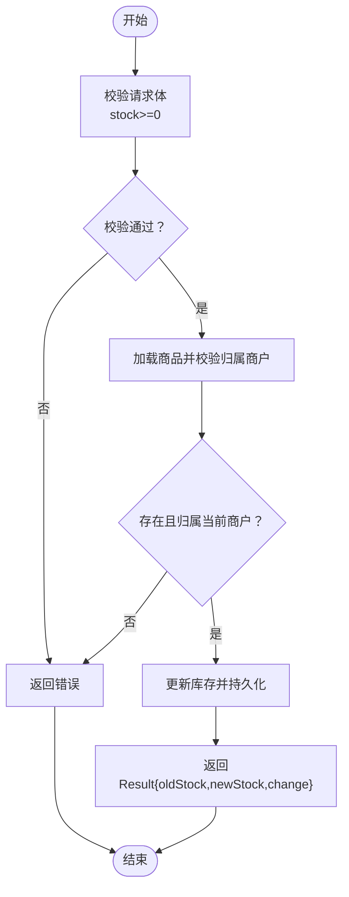
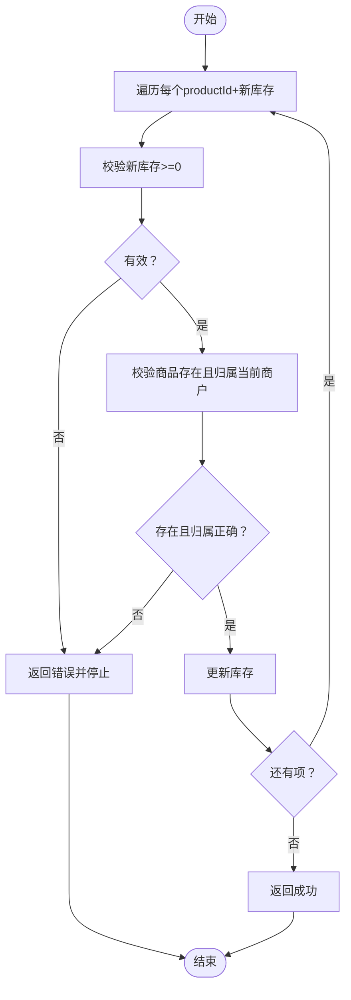
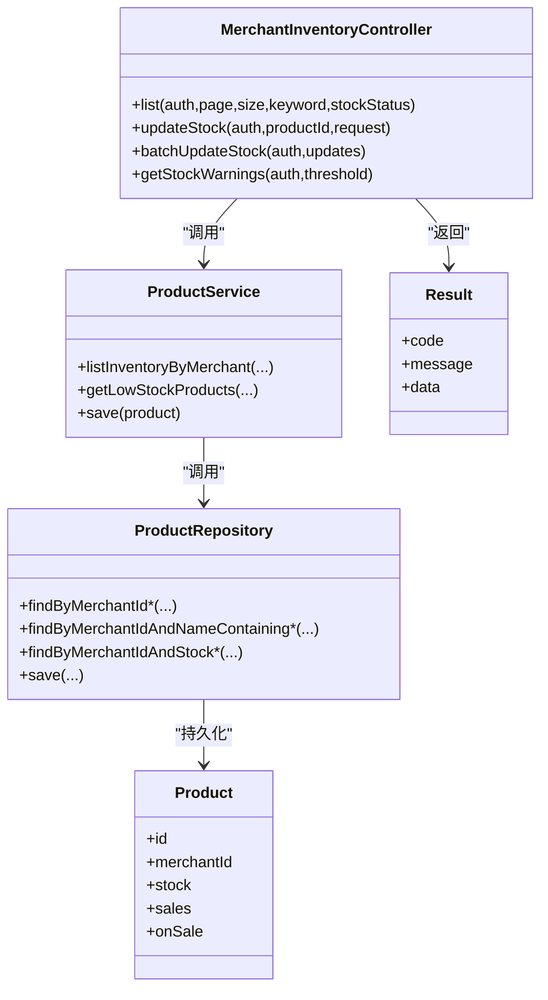

# 库存管理接口

<cite>
**本文引用的文件**
- [MerchantInventoryController.java](file://backend/src/main/java/com/mall/controller/merchant/MerchantInventoryController.java)
- [ProductService.java](file://backend/src/main/java/com/mall/service/ProductService.java)
- [ProductRepository.java](file://backend/src/main/java/com/mall/repository/ProductRepository.java)
- [Product.java](file://backend/src/main/java/com/mall/entity/Product.java)
- [Result.java](file://backend/src/main/java/com/mall/dto/Result.java)
- [application.yml](file://backend/src/main/resources/application.yml)
- [Inventory.vue](file://frontend/src/views/merchant/Inventory.vue)
- [merchant.js](file://frontend/src/api/merchant.js)
- [banner.sql](file://backend/src/main/resources/banner.sql)
</cite>

## 目录
1. [简介](#简介)
2. [项目结构](#项目结构)
3. [核心组件](#核心组件)
4. [架构总览](#架构总览)
5. [详细组件分析](#详细组件分析)
6. [依赖关系分析](#依赖关系分析)
7. [性能考虑](#性能考虑)
8. [故障排查指南](#故障排查指南)
9. [结论](#结论)
10. [附录](#附录)

## 简介
本文件为电商商城系统的商户库存管理接口专业API文档，覆盖以下功能：
- 实时库存查询：支持关键词搜索、库存状态筛选、分页展示
- 库存预警：按阈值查询低库存商品
- 库存调整：单个商品库存调整、批量库存调整
- 库存统计分析：缺货、低库存、总库存等概览指标

文档同时提供最佳实践、常见问题解决方案与性能优化建议，帮助商户高效管理库存。

## 项目结构
后端采用Spring Boot + JPA分层架构，前端使用Vue + Element UI构建商户库存管理界面。接口通过REST风格暴露，统一以Result包装响应。

图表来源
- [MerchantInventoryController.java:1-118](file://backend/src/main/java/com/mall/controller/merchant/MerchantInventoryController.java#L1-L118)
- [ProductService.java:1-126](file://backend/src/main/java/com/mall/service/ProductService.java#L1-L126)
- [ProductRepository.java:1-125](file://backend/src/main/java/com/mall/repository/ProductRepository.java#L1-L125)
- [Product.java:1-101](file://backend/src/main/java/com/mall/entity/Product.java#L1-L101)
- [Result.java:1-24](file://backend/src/main/java/com/mall/dto/Result.java#L1-L24)

章节来源
- [application.yml:1-36](file://backend/src/main/resources/application.yml#L1-L36)

## 核心组件
- 控制器层：负责接收HTTP请求、鉴权校验、参数校验与调用服务层，并以Result统一封装响应。
- 服务层：实现库存查询、库存预警、库存调整等业务逻辑。
- 数据访问层：基于JPA Repository提供库存相关查询方法。
- 实体模型：Product实体包含库存字段与基础属性。
- 前端界面：提供库存概览、搜索筛选、快速调整、批量调整等交互。

章节来源
- [MerchantInventoryController.java:16-118](file://backend/src/main/java/com/mall/controller/merchant/MerchantInventoryController.java#L16-L118)
- [ProductService.java:94-125](file://backend/src/main/java/com/mall/service/ProductService.java#L94-L125)
- [ProductRepository.java:107-124](file://backend/src/main/java/com/mall/repository/ProductRepository.java#L107-L124)
- [Product.java:68-82](file://backend/src/main/java/com/mall/entity/Product.java#L68-L82)
- [Result.java:10-23](file://backend/src/main/java/com/mall/dto/Result.java#L10-L23)

## 架构总览
后端接口通过认证上下文获取当前商户ID，确保操作权限；库存查询支持关键词与库存状态过滤；库存调整提供单次与批量两种方式；库存预警按阈值返回低库存商品列表。

图表来源
- [MerchantInventoryController.java:33-117](file://backend/src/main/java/com/mall/controller/merchant/MerchantInventoryController.java#L33-L117)
- [ProductService.java:94-124](file://backend/src/main/java/com/mall/service/ProductService.java#L94-L124)
- [ProductRepository.java:107-123](file://backend/src/main/java/com/mall/repository/ProductRepository.java#L107-L123)

## 详细组件分析

### 接口定义与参数说明
- 查询库存列表
  - 方法：GET
  - 路径：/merchant/inventory
  - 认证：需要商户登录
  - 查询参数：
    - page：页码（默认0）
    - size：每页大小（默认10）
    - keyword：商品名称关键词（可选）
    - stockStatus：库存状态（0=缺货，1=低库存(1-10)，2=正常库存(>10)，可选）
  - 返回：Result分页数据，内容为商品列表（包含库存、销量等）

- 单个商品库存调整
  - 方法：PUT
  - 路径：/merchant/inventory/{productId}/stock
  - 请求体：{"stock": 新库存数量}
  - 返回：Result包含productId、oldStock、newStock、change

- 批量库存调整
  - 方法：PUT
  - 路径：/merchant/inventory/batch-stock
  - 请求体：{"productId": 新库存数量, ...}
  - 返回：Result成功消息

- 库存预警查询
  - 方法：GET
  - 路径：/merchant/inventory/warnings
  - 查询参数：threshold（默认10）
  - 返回：Result商品列表（库存<=阈值）

章节来源
- [MerchantInventoryController.java:33-117](file://backend/src/main/java/com/mall/controller/merchant/MerchantInventoryController.java#L33-L117)
- [merchant.js:70-88](file://frontend/src/api/merchant.js#L70-L88)

### 数据模型与状态标识
- Product实体关键字段
  - id：商品ID
  - merchantId：所属商户ID
  - stock：当前库存数量（默认0）
  - sales：销量（用于转化率计算）
  - onSale：是否上架（影响公开查询）
- 库存状态标识
  - 缺货：stock = 0
  - 低库存：0 < stock <= 10
  - 正常库存：stock > 10
- 前端展示逻辑
  - 根据库存值映射到标签样式与文本，便于直观识别

章节来源
- [Product.java:68-82](file://backend/src/main/java/com/mall/entity/Product.java#L68-L82)
- [Inventory.vue:468-480](file://frontend/src/views/merchant/Inventory.vue#L468-L480)

### 处理流程与错误处理

#### 库存查询流程

图表来源
- [ProductService.java:94-119](file://backend/src/main/java/com/mall/service/ProductService.java#L94-L119)
- [ProductRepository.java:107-123](file://backend/src/main/java/com/mall/repository/ProductRepository.java#L107-L123)

#### 库存调整流程

图表来源
- [MerchantInventoryController.java:46-74](file://backend/src/main/java/com/mall/controller/merchant/MerchantInventoryController.java#L46-L74)

#### 批量调整流程

图表来源
- [MerchantInventoryController.java:76-108](file://backend/src/main/java/com/mall/controller/merchant/MerchantInventoryController.java#L76-L108)

### 前端集成与交互
- 前端通过merchant.js封装REST调用，Inventory.vue负责：
  - 概览卡片：总商品数、低库存数、缺货数、总库存
  - 搜索与筛选：关键词、库存状态
  - 表格展示：商品信息、当前库存、销量、转化率
  - 快速调整：±1库存
  - 批量调整：固定值或百分比，支持全量、低库存、缺货三类目标
- 分页与刷新：支持分页参数变更与手动刷新

章节来源
- [Inventory.vue:405-668](file://frontend/src/views/merchant/Inventory.vue#L405-L668)
- [merchant.js:70-88](file://frontend/src/api/merchant.js#L70-L88)

## 依赖关系分析
- 控制器依赖服务层，服务层依赖仓库层，仓库层依赖实体模型
- 统一响应Result作为跨层契约
- 前端通过API模块调用后端接口

图表来源
- [MerchantInventoryController.java:22-23](file://backend/src/main/java/com/mall/controller/merchant/MerchantInventoryController.java#L22-L23)
- [ProductService.java:20-20](file://backend/src/main/java/com/mall/service/ProductService.java#L20-L20)
- [ProductRepository.java:13-13](file://backend/src/main/java/com/mall/repository/ProductRepository.java#L13-L13)
- [Product.java:18-88](file://backend/src/main/java/com/mall/entity/Product.java#L18-L88)
- [Result.java:12-14](file://backend/src/main/java/com/mall/dto/Result.java#L12-L14)

## 性能考虑
- 分页查询：接口默认每页10条，前端支持10/20/50/100切换，避免一次性加载过多数据
- 条件查询：支持关键词与库存状态组合过滤，减少无效数据传输
- 批量调整：前端先在内存中计算新库存再提交，降低网络往返次数
- 数据库索引：banner.sql展示了索引设计思路，建议对高频查询列建立合适索引（如merchant_id、on_sale、name等）
- 建议
  - 对高频查询添加数据库索引
  - 使用缓存（如Redis）缓存热点商品库存
  - 批量调整时限制单次更新数量，避免长事务
  - 对库存变更进行异步通知，减轻同步压力

章节来源
- [banner.sql:11](file://backend/src/main/resources/banner.sql#L11)

## 故障排查指南
- 常见错误与原因
  - 非商户账号：控制器会拒绝非商户用户访问
  - 商品不存在或无权限：校验失败返回错误
  - 库存数量非法：新库存必须≥0
  - 批量调整中任一项校验失败：立即返回错误
- 前端提示
  - 调整失败时显示错误消息
  - 快速调整前检查库存不得小于0
  - 批量调整前检查应用范围与调整值
- 后端日志
  - application.yml配置了日志级别，便于定位问题

章节来源
- [MerchantInventoryController.java:25-31](file://backend/src/main/java/com/mall/controller/merchant/MerchantInventoryController.java#L25-L31)
- [MerchantInventoryController.java:54-61](file://backend/src/main/java/com/mall/controller/merchant/MerchantInventoryController.java#L54-L61)
- [MerchantInventoryController.java:87-95](file://backend/src/main/java/com/mall/controller/merchant/MerchantInventoryController.java#L87-L95)
- [application.yml:32-36](file://backend/src/main/resources/application.yml#L32-L36)

## 结论
该库存管理接口提供了完整的商户库存查询、预警与调整能力，前后端职责清晰、耦合度低。通过合理的分页与条件过滤、统一的响应封装以及前端直观的交互设计，能够满足日常库存管理需求。建议结合索引优化、缓存策略与批量更新限流，进一步提升系统性能与稳定性。

## 附录

### API一览表
- GET /merchant/inventory
  - 功能：分页查询当前商户库存
  - 参数：page, size, keyword, stockStatus
  - 返回：Result分页数据
- PUT /merchant/inventory/{productId}/stock
  - 功能：调整单个商品库存
  - 请求体：{"stock": 新库存}
  - 返回：Result包含oldStock/newStock/change
- PUT /merchant/inventory/batch-stock
  - 功能：批量调整库存
  - 请求体：{"productId": 新库存, ...}
  - 返回：Result成功消息
- GET /merchant/inventory/warnings?threshold=10
  - 功能：获取低库存商品（默认阈值10）
  - 返回：Result商品列表

章节来源
- [MerchantInventoryController.java:33-117](file://backend/src/main/java/com/mall/controller/merchant/MerchantInventoryController.java#L33-L117)
- [merchant.js:70-88](file://frontend/src/api/merchant.js#L70-L88)