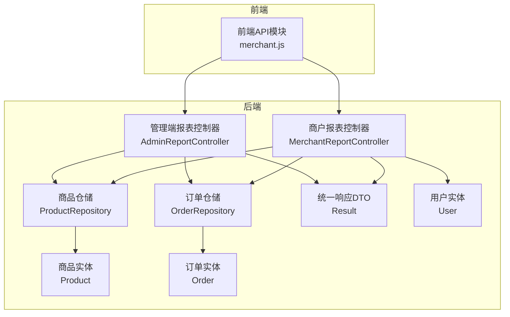
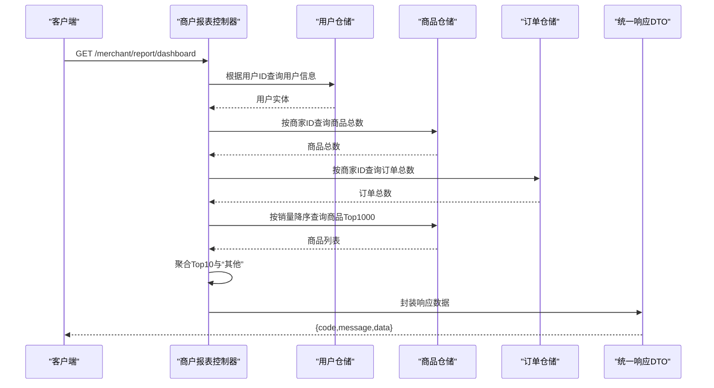
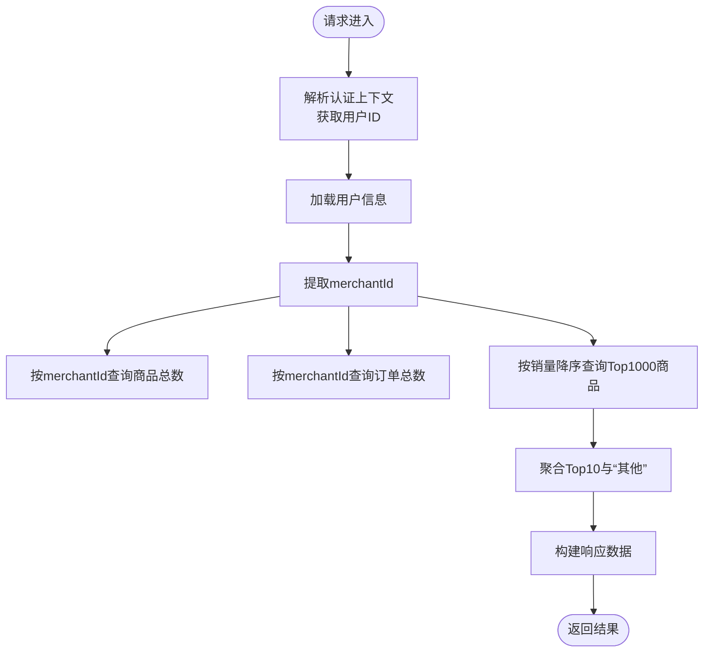
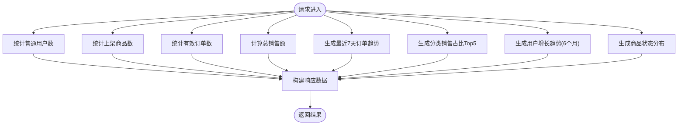
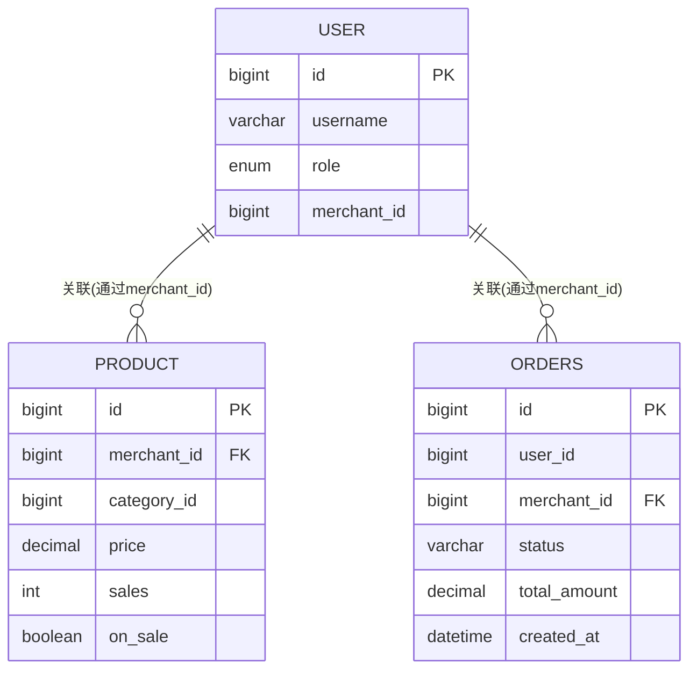
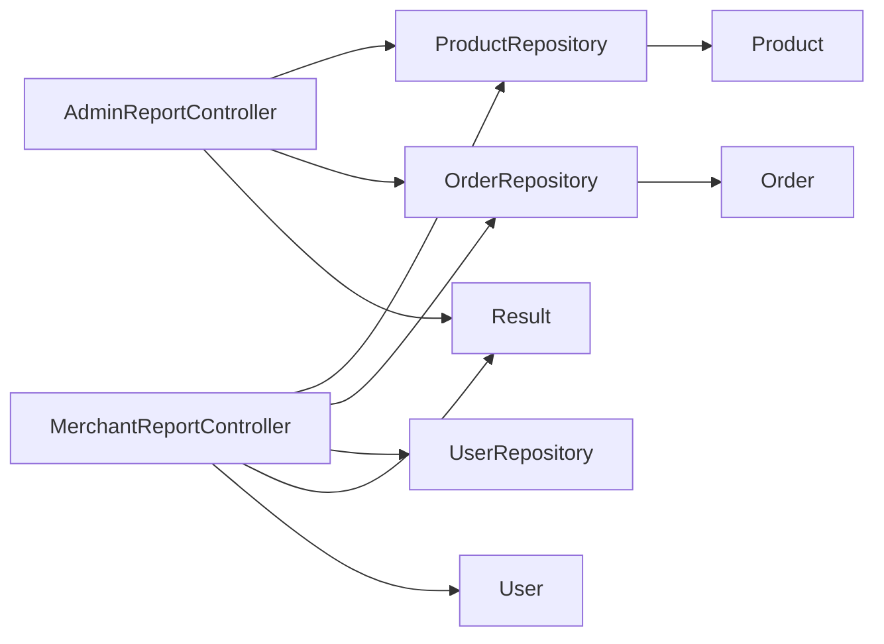

# 报表统计接口

<cite>
**本文档引用的文件**
- [MerchantReportController.java](file://backend/src/main/java/com/mall/controller/merchant/MerchantReportController.java)
- [AdminReportController.java](file://backend/src/main/java/com/mall/controller/admin/AdminReportController.java)
- [Result.java](file://backend/src/main/java/com/mall/dto/Result.java)
- [ProductRepository.java](file://backend/src/main/java/com/mall/repository/ProductRepository.java)
- [OrderRepository.java](file://backend/src/main/java/com/mall/repository/OrderRepository.java)
- [Product.java](file://backend/src/main/java/com/mall/entity/Product.java)
- [Order.java](file://backend/src/main/java/com/mall/entity/Order.java)
- [User.java](file://backend/src/main/java/com/mall/entity/User.java)
- [merchant.js](file://frontend/src/api/merchant.js)
</cite>

## 目录
1. [简介](#简介)
2. [项目结构](#项目结构)
3. [核心组件](#核心组件)
4. [架构概览](#架构概览)
5. [详细组件分析](#详细组件分析)
6. [依赖分析](#依赖分析)
7. [性能考虑](#性能考虑)
8. [故障排除指南](#故障排除指南)
9. [结论](#结论)
10. [附录](#附录)

## 简介
本文件为电商商城系统的商户报表统计接口的专业API文档，聚焦于商户视角的销售统计与商品销量分析能力。当前系统已实现以下功能：
- 商户看板数据：商品数量、订单数量、商品销量扇形图（Top10+其他）
- 管理端看板数据：用户数、商品数、订单数、总销售额、最近7天订单趋势、分类销售占比、用户增长趋势、商品状态分布

文档将详细说明接口定义、请求响应格式、统计维度、时间范围选择、数据聚合方式，并提供报表数据的解读指南、趋势分析方法和业务决策支持建议。

## 项目结构
后端采用Spring Boot分层架构，报表相关代码主要位于控制层与仓储层：
- 控制器层：商户报表控制器、管理端报表控制器
- 仓储层：商品仓储、订单仓储
- 实体层：商品、订单、用户实体
- DTO层：统一响应包装类

**图表来源**
- [MerchantReportController.java:1-81](file://backend/src/main/java/com/mall/controller/merchant/MerchantReportController.java#L1-L81)
- [AdminReportController.java:1-176](file://backend/src/main/java/com/mall/controller/admin/AdminReportController.java#L1-L176)
- [ProductRepository.java:1-125](file://backend/src/main/java/com/mall/repository/ProductRepository.java#L1-L125)
- [OrderRepository.java:1-28](file://backend/src/main/java/com/mall/repository/OrderRepository.java#L1-L28)
- [Result.java:1-24](file://backend/src/main/java/com/mall/dto/Result.java#L1-L24)
- [Product.java:1-101](file://backend/src/main/java/com/mall/entity/Product.java#L1-L101)
- [Order.java:1-83](file://backend/src/main/java/com/mall/entity/Order.java#L1-L83)
- [User.java:1-88](file://backend/src/main/java/com/mall/entity/User.java#L1-L88)

**章节来源**
- [MerchantReportController.java:1-81](file://backend/src/main/java/com/mall/controller/merchant/MerchantReportController.java#L1-L81)
- [AdminReportController.java:1-176](file://backend/src/main/java/com/mall/controller/admin/AdminReportController.java#L1-L176)

## 核心组件
- 商户报表控制器：提供商户看板数据接口，包含商品数量、订单数量、商品销量扇形图。
- 管理端报表控制器：提供平台级看板数据接口，包含用户数、商品数、订单数、总销售额、最近7天订单趋势、分类销售占比、用户增长趋势、商品状态分布。
- 统一响应DTO：封装标准响应结构，便于前后端交互。
- 仓储层：提供按商家维度的商品与订单查询能力。

**章节来源**
- [MerchantReportController.java:23-81](file://backend/src/main/java/com/mall/controller/merchant/MerchantReportController.java#L23-L81)
- [AdminReportController.java:23-176](file://backend/src/main/java/com/mall/controller/admin/AdminReportController.java#L23-L176)
- [Result.java:10-23](file://backend/src/main/java/com/mall/dto/Result.java#L10-L23)

## 架构概览
商户报表接口遵循RESTful设计，通过认证上下文解析当前登录用户的所属商家ID，基于仓储层查询统计数据并返回统一响应格式。

**图表来源**
- [MerchantReportController.java:33-79](file://backend/src/main/java/com/mall/controller/merchant/MerchantReportController.java#L33-L79)
- [User.java:60-62](file://backend/src/main/java/com/mall/entity/User.java#L60-L62)
- [ProductRepository.java:15-25](file://backend/src/main/java/com/mall/repository/ProductRepository.java#L15-L25)
- [OrderRepository.java:19](file://backend/src/main/java/com/mall/repository/OrderRepository.java#L19)
- [Result.java:16-18](file://backend/src/main/java/com/mall/dto/Result.java#L16-L18)

## 详细组件分析

### 商户看板接口
- 接口路径：GET /merchant/report/dashboard
- 功能概述：返回商户维度的看板数据，包括商品数量、订单数量、商品销量扇形图（Top10+其他）。
- 认证机制：通过SecurityContext解析当前用户ID，再从用户实体提取merchantId。
- 数据来源：
  - 商品数量：按merchantId查询商品总数。
  - 订单数量：按merchantId查询订单总数。
  - 商品销量扇形图：按销量降序查询前1000商品，取前10项作为Top10，其余销量合并为“其他”。

**图表来源**
- [MerchantReportController.java:33-79](file://backend/src/main/java/com/mall/controller/merchant/MerchantReportController.java#L33-L79)
- [User.java:60-62](file://backend/src/main/java/com/mall/entity/User.java#L60-L62)
- [ProductRepository.java:15](file://backend/src/main/java/com/mall/repository/ProductRepository.java#L15)
- [OrderRepository.java:19](file://backend/src/main/java/com/mall/repository/OrderRepository.java#L19)

**章节来源**
- [MerchantReportController.java:41-79](file://backend/src/main/java/com/mall/controller/merchant/MerchantReportController.java#L41-L79)

### 管理端看板接口
- 接口路径：GET /admin/report/dashboard
- 功能概述：返回平台级看板数据，包括用户数、商品数、订单数、总销售额、最近7天订单趋势、分类销售占比、用户增长趋势、商品状态分布。
- 数据来源：
  - 用户数：统计角色为普通用户的总数。
  - 商品数：统计上架商品总数。
  - 订单数：统计已支付及以后状态的订单总数。
  - 总销售额：对已支付订单的总额进行求和。
  - 最近7天订单趋势：按自然日统计订单数量。
  - 分类销售占比：按分类聚合销售额，取前5。
  - 用户增长趋势：按月统计用户累计数量。
  - 商品状态分布：统计销售中、已售罄、已下架的数量。

**图表来源**
- [AdminReportController.java:33-77](file://backend/src/main/java/com/mall/controller/admin/AdminReportController.java#L33-L77)
- [AdminReportController.java:79-94](file://backend/src/main/java/com/mall/controller/admin/AdminReportController.java#L79-L94)
- [AdminReportController.java:96-126](file://backend/src/main/java/com/mall/controller/admin/AdminReportController.java#L96-L126)
- [AdminReportController.java:128-147](file://backend/src/main/java/com/mall/controller/admin/AdminReportController.java#L128-L147)
- [AdminReportController.java:149-174](file://backend/src/main/java/com/mall/controller/admin/AdminReportController.java#L149-L174)

**章节来源**
- [AdminReportController.java:33-176](file://backend/src/main/java/com/mall/controller/admin/AdminReportController.java#L33-L176)

### 统一响应结构
- 结构字段：code、message、data
- 成功响应：code=200，message="success"
- 失败响应：code=400，message为错误信息

**章节来源**
- [Result.java:10-23](file://backend/src/main/java/com/mall/dto/Result.java#L10-L23)

### 数据模型与仓储查询
- 商品实体：包含merchantId、categoryId、price、sales等字段，用于统计与排序。
- 订单实体：包含merchantId、status、totalAmount、createdAt等字段，用于销售额与趋势统计。
- 仓储查询：
  - 按商家ID查询商品与订单总数
  - 按销量降序查询商品Top1000
  - 按创建时间倒序查询订单

**图表来源**
- [User.java:21-62](file://backend/src/main/java/com/mall/entity/User.java#L21-L62)
- [Product.java:22-74](file://backend/src/main/java/com/mall/entity/Product.java#L22-L74)
- [Order.java:25-33](file://backend/src/main/java/com/mall/entity/Order.java#L25-L33)

**章节来源**
- [ProductRepository.java:15-25](file://backend/src/main/java/com/mall/repository/ProductRepository.java#L15-L25)
- [OrderRepository.java:19](file://backend/src/main/java/com/mall/repository/OrderRepository.java#L19)

## 依赖分析
- 控制器依赖仓储层进行数据查询，避免在控制器中直接操作数据库。
- 统一响应DTO提供标准化输出，便于前端处理。
- 实体层定义了统计所需的字段，如商品销量、订单金额、创建时间等。

**图表来源**
- [MerchantReportController.java:29-31](file://backend/src/main/java/com/mall/controller/merchant/MerchantReportController.java#L29-L31)
- [AdminReportController.java:29-31](file://backend/src/main/java/com/mall/controller/admin/AdminReportController.java#L29-L31)
- [Result.java:10-23](file://backend/src/main/java/com/mall/dto/Result.java#L10-L23)

**章节来源**
- [MerchantReportController.java:29-31](file://backend/src/main/java/com/mall/controller/merchant/MerchantReportController.java#L29-L31)
- [AdminReportController.java:29-31](file://backend/src/main/java/com/mall/controller/admin/AdminReportController.java#L29-L31)

## 性能考虑
- 当前实现使用内存流式聚合（如管理端看板中的流式统计），在数据量较大时可能导致性能瓶颈。建议：
  - 使用数据库原生聚合查询替代内存流式统计，减少JVM内存压力。
  - 对高频查询增加索引（如商品销量、订单创建时间、商家ID）。
  - 对TopN查询限制最大扫描范围，避免全表扫描。
- 时间范围选择：
  - 商户看板默认按销量降序查询Top1000，可根据业务需要调整阈值。
  - 管理端看板的时间范围固定（最近7天、最近6个月），建议支持动态参数化。

[本节为通用性能建议，不直接分析具体文件]

## 故障排除指南
- 非商家账号访问：
  - 现象：解析用户merchantId失败抛出异常。
  - 处理：确保登录用户角色为商家，或在前端拦截非商家用户访问报表页面。
- 数据为空：
  - 现象：商品数量、订单数量或销量扇形图为空。
  - 处理：检查商品是否上架、销量字段是否更新；确认订单状态过滤逻辑。
- 统一响应格式：
  - 现象：前端无法解析响应。
  - 处理：确认后端返回code=200且message="success"，data为期望的数据结构。

**章节来源**
- [MerchantReportController.java:33-39](file://backend/src/main/java/com/mall/controller/merchant/MerchantReportController.java#L33-L39)
- [Result.java:16-18](file://backend/src/main/java/com/mall/dto/Result.java#L16-L18)

## 结论
当前系统已实现基础的商户看板与管理端看板统计能力，能够满足日常运营监控需求。为进一步提升报表能力，建议：
- 扩展时间范围参数化与统计维度（如按周、月、季度）。
- 引入数据库原生聚合查询优化性能。
- 增加更多业务指标（如转化率、客单价、复购率等）。

[本节为总结性内容，不直接分析具体文件]

## 附录

### API定义与示例
- 商户看板接口
  - 方法：GET
  - 路径：/merchant/report/dashboard
  - 请求头：Authorization（Bearer Token）
  - 响应：统一响应结构，data包含商品数量、订单数量、商品销量扇形图
- 管理端看板接口
  - 方法：GET
  - 路径：/admin/report/dashboard
  - 响应：统一响应结构，data包含用户数、商品数、订单数、总销售额、最近7天订单趋势、分类销售占比、用户增长趋势、商品状态分布

**章节来源**
- [MerchantReportController.java:42-79](file://backend/src/main/java/com/mall/controller/merchant/MerchantReportController.java#L42-L79)
- [AdminReportController.java:34-77](file://backend/src/main/java/com/mall/controller/admin/AdminReportController.java#L34-L77)
- [Result.java:16-18](file://backend/src/main/java/com/mall/dto/Result.java#L16-L18)

### 前端调用示例
- 获取商户看板数据：调用前端API函数获取报表数据

**章节来源**
- [merchant.js:8-11](file://frontend/src/api/merchant.js#L8-L11)

### 统计维度与数据解读
- 销售统计维度
  - 销售额：订单总金额（已支付及以后状态）
  - 订单量：有效订单数量（已支付及以后状态）
  - 商品销量：按商品销量降序统计
- 时间范围选择
  - 默认：最近7天（管理端）、按销量降序Top1000（商户端）
  - 建议：支持自定义开始/结束日期
- 数据聚合方式
  - 内存流式聚合：适用于小规模数据
  - 数据库原生聚合：适用于大规模数据
- 趋势分析方法
  - 移动平均：平滑短期波动
  - 环比/同比：对比周期变化
- 业务决策支持
  - 销售额与订单量：评估营销活动效果
  - 商品销量排行：指导补货与促销策略
  - 用户增长趋势：评估获客成本与留存

[本节为通用业务指导，不直接分析具体文件]