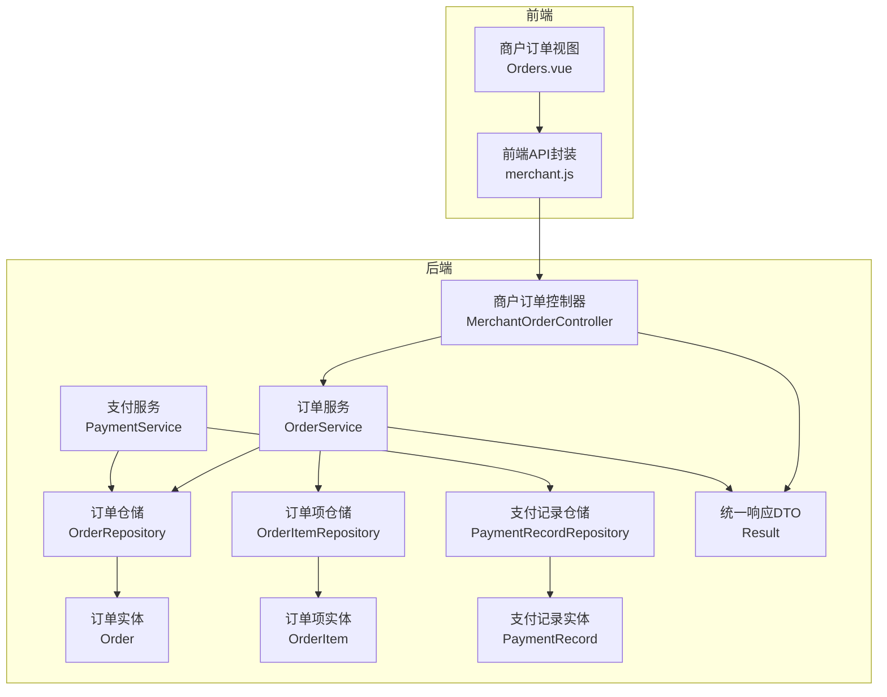
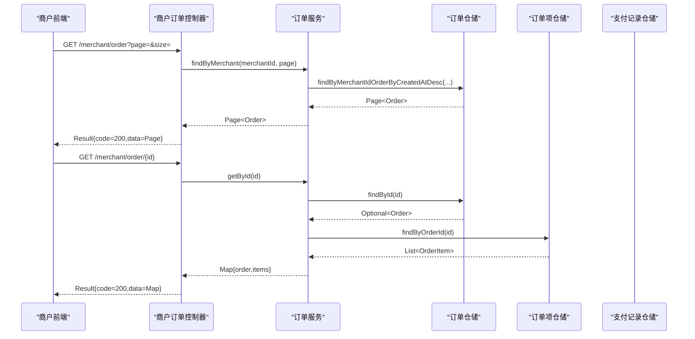
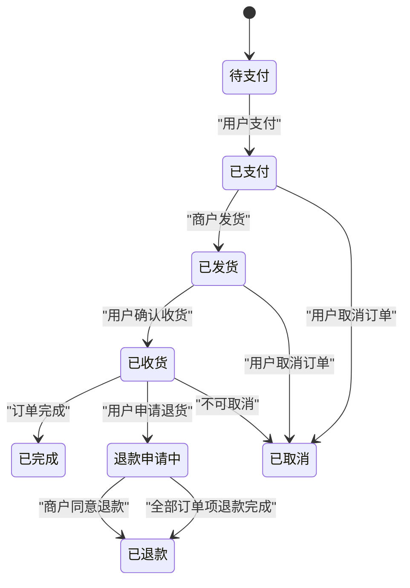
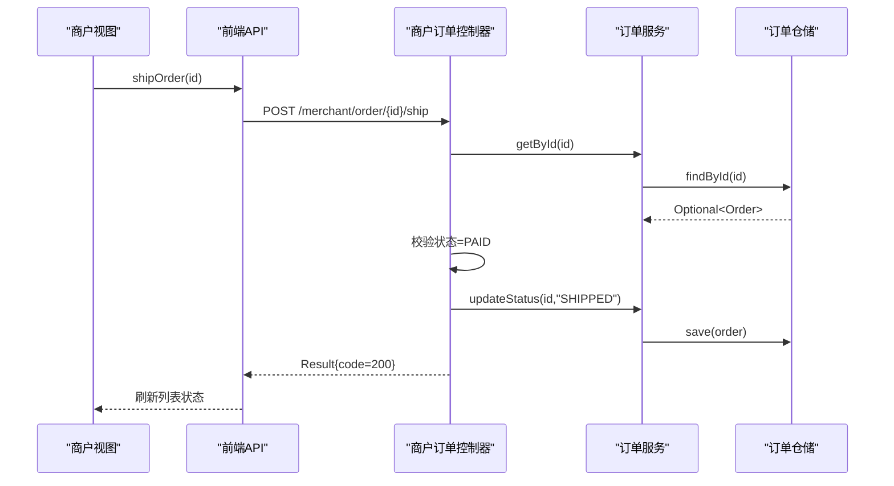
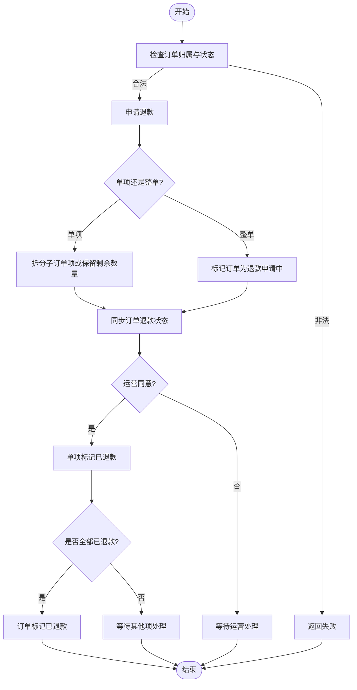
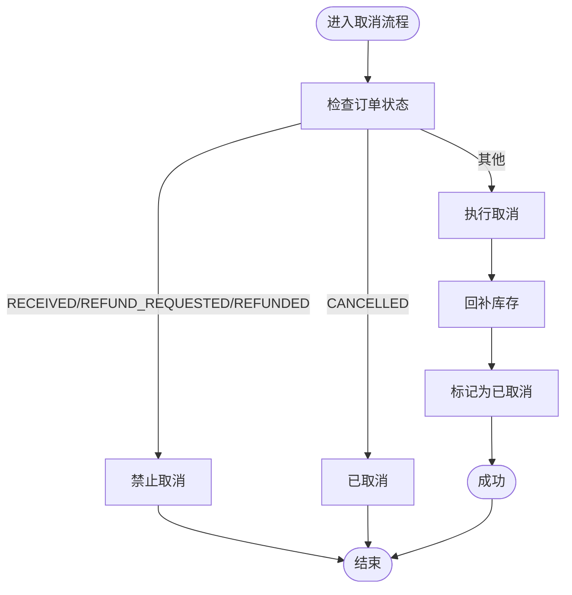
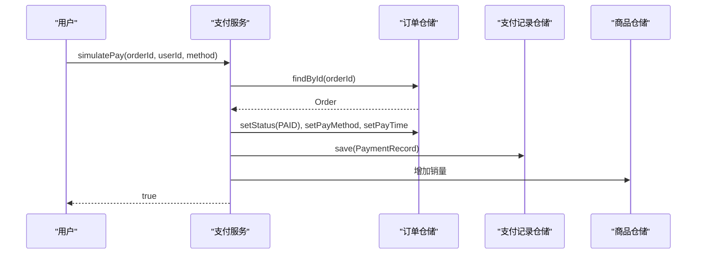
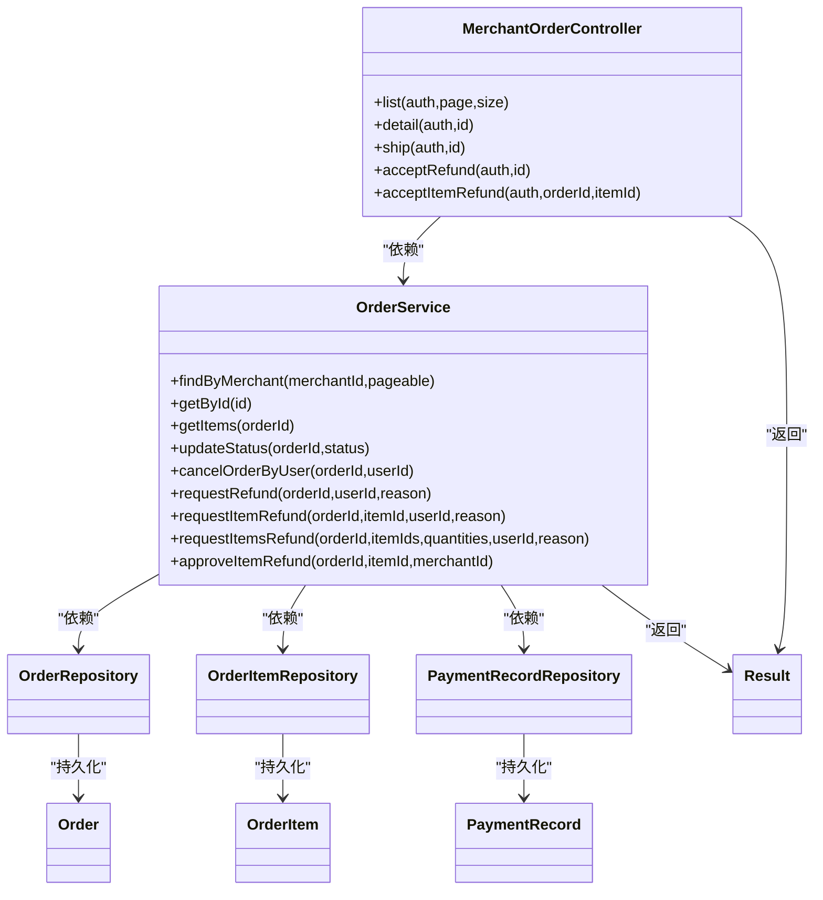

# 订单处理接口

<cite>
**本文引用的文件**
- [MerchantOrderController.java](file://backend/src/main/java/com/mall/controller/merchant/MerchantOrderController.java)
- [OrderService.java](file://backend/src/main/java/com/mall/service/OrderService.java)
- [Order.java](file://backend/src/main/java/com/mall/entity/Order.java)
- [OrderItem.java](file://backend/src/main/java/com/mall/entity/OrderItem.java)
- [OrderRepository.java](file://backend/src/main/java/com/mall/repository/OrderRepository.java)
- [Result.java](file://backend/src/main/java/com/mall/dto/Result.java)
- [application.yml](file://backend/src/main/resources/application.yml)
- [merchant.js](file://frontend/src/api/merchant.js)
- [Orders.vue](file://frontend/src/views/merchant/Orders.vue)
- [PaymentService.java](file://backend/src/main/java/com/mall/service/PaymentService.java)
- [PaymentRecord.java](file://backend/src/main/java/com/mall/entity/PaymentRecord.java)
- [PaymentRecordRepository.java](file://backend/src/main/java/com/mall/repository/PaymentRecordRepository.java)
</cite>

## 目录
1. [简介](#简介)
2. [项目结构](#项目结构)
3. [核心组件](#核心组件)
4. [架构总览](#架构总览)
5. [详细组件分析](#详细组件分析)
6. [依赖关系分析](#依赖关系分析)
7. [性能考虑](#性能考虑)
8. [故障排除指南](#故障排除指南)
9. [结论](#结论)
10. [附录](#附录)

## 简介
本文件为电商商城系统的商户订单处理接口的详细API文档，覆盖以下功能：
- 订单查询：按运营方分页查询、订单详情查看
- 订单状态更新：确认接单（标记为已支付）、准备发货（标记为已发货）、已完成（由用户确认收货）
- 订单取消处理：用户在特定状态下取消订单并回补库存
- 退货/退款处理：支持整单或单项申请退款，运营同意退款并同步订单状态
- 发货流程：仅允许已支付订单进行发货
- 异常订单处理：状态校验、库存回补、退款状态同步

文档同时提供标准流程图、状态流转图、错误处理策略与常见问题解决方案，帮助商户高效完成订单履约。

## 项目结构
后端采用Spring Boot + JPA分层架构，前端Vue + Element UI实现商户侧订单管理界面。商户订单处理接口位于后端控制器层，通过服务层协调仓储层完成业务逻辑。

图表来源
- [MerchantOrderController.java:1-100](file://backend/src/main/java/com/mall/controller/merchant/MerchantOrderController.java#L1-L100)
- [OrderService.java:1-280](file://backend/src/main/java/com/mall/service/OrderService.java#L1-L280)
- [OrderRepository.java:1-28](file://backend/src/main/java/com/mall/repository/OrderRepository.java#L1-L28)
- [OrderItem.java:1-73](file://backend/src/main/java/com/mall/entity/OrderItem.java#L1-L73)
- [Order.java:1-83](file://backend/src/main/java/com/mall/entity/Order.java#L1-L83)
- [Result.java:1-24](file://backend/src/main/java/com/mall/dto/Result.java#L1-L24)
- [merchant.js:1-135](file://frontend/src/api/merchant.js#L1-L135)
- [Orders.vue:1-203](file://frontend/src/views/merchant/Orders.vue#L1-L203)

章节来源
- [application.yml:1-36](file://backend/src/main/resources/application.yml#L1-L36)

## 核心组件
- 商户订单控制器：提供订单查询、详情查看、发货、同意退款等接口，负责鉴权与参数校验。
- 订单服务：实现订单状态流转、库存回补、退款申请与审批、订单项退款拆分与合并等复杂逻辑。
- 支付服务：模拟支付，将订单状态置为已支付并写入支付记录。
- 实体与仓储：订单、订单项、支付记录的JPA实体及对应仓储接口，支撑查询与持久化。
- 统一响应DTO：Result封装统一的响应结构，便于前后端交互。

章节来源
- [MerchantOrderController.java:20-100](file://backend/src/main/java/com/mall/controller/merchant/MerchantOrderController.java#L20-L100)
- [OrderService.java:23-280](file://backend/src/main/java/com/mall/service/OrderService.java#L23-L280)
- [PaymentService.java:21-67](file://backend/src/main/java/com/mall/service/PaymentService.java#L21-L67)
- [Order.java:9-83](file://backend/src/main/java/com/mall/entity/Order.java#L9-L83)
- [OrderItem.java:9-73](file://backend/src/main/java/com/mall/entity/OrderItem.java#L9-L73)
- [OrderRepository.java:13-28](file://backend/src/main/java/com/mall/repository/OrderRepository.java#L13-L28)
- [Result.java:7-24](file://backend/src/main/java/com/mall/dto/Result.java#L7-L24)

## 架构总览
商户订单处理接口遵循“控制器-服务-仓储-实体”的分层设计，前端通过REST API调用后端接口，后端通过服务层协调数据库操作，确保事务一致性与状态正确性。

图表来源
- [MerchantOrderController.java:37-59](file://backend/src/main/java/com/mall/controller/merchant/MerchantOrderController.java#L37-L59)
- [OrderService.java:100-113](file://backend/src/main/java/com/mall/service/OrderService.java#L100-L113)
- [OrderRepository.java:19-21](file://backend/src/main/java/com/mall/repository/OrderRepository.java#L19-L21)
- [OrderItem.java:1-73](file://backend/src/main/java/com/mall/entity/OrderItem.java#L1-L73)

## 详细组件分析

### 接口定义与请求流程
- 订单查询（分页，按运营方）
  - 方法：GET
  - 路径：/merchant/order
  - 参数：page（默认0）、size（默认10）
  - 返回：Result{code,message,data=Page<Order>}
- 订单详情查看
  - 方法：GET
  - 路径：/merchant/order/{id}
  - 返回：Result{code,message,data={order,items}}
- 订单发货
  - 方法：POST
  - 路径：/merchant/order/{id}/ship
  - 规则：仅允许状态为“已支付”的订单执行发货
  - 返回：Result{code,message}
- 同意整单退款
  - 方法：POST
  - 路径：/merchant/order/{id}/accept-refund
  - 规则：仅允许状态为“退款申请中”的订单执行同意退款
  - 返回：Result{code,message}
- 同意单项退款
  - 方法：POST
  - 路径：/merchant/order/{orderId}/items/{itemId}/accept-refund
  - 规则：仅允许处于“退款申请中”的订单项执行同意退款
  - 返回：Result{code,message}

章节来源
- [MerchantOrderController.java:37-99](file://backend/src/main/java/com/mall/controller/merchant/MerchantOrderController.java#L37-L99)
- [merchant.js:58-120](file://frontend/src/api/merchant.js#L58-L120)

### 订单状态与流转
订单状态包括：PENDING（待支付）、PAID（已支付）、SHIPPED（已发货）、RECEIVED（已收货）、CANCELLED（已取消）、REFUND_REQUESTED（退款申请中）、REFUNDED（已退款）。

图表来源
- [Order.java:31-33](file://backend/src/main/java/com/mall/entity/Order.java#L31-L33)
- [OrderItem.java:50-52](file://backend/src/main/java/com/mall/entity/OrderItem.java#L50-L52)
- [OrderService.java:123-145](file://backend/src/main/java/com/mall/service/OrderService.java#L123-L145)
- [OrderService.java:147-161](file://backend/src/main/java/com/mall/service/OrderService.java#L147-L161)
- [OrderService.java:254-278](file://backend/src/main/java/com/mall/service/OrderService.java#L254-L278)

### 发货流程
- 前端触发：商户在订单列表点击“发货”
- 控制器校验：订单存在且属于当前运营方、状态为“已支付”
- 服务层更新：将订单状态置为“已发货”
- 前端更新UI：刷新列表状态为“已发货”

图表来源
- [Orders.vue:125-132](file://frontend/src/views/merchant/Orders.vue#L125-L132)
- [merchant.js:112-115](file://frontend/src/api/merchant.js#L112-L115)
- [MerchantOrderController.java:61-71](file://backend/src/main/java/com/mall/controller/merchant/MerchantOrderController.java#L61-L71)
- [OrderService.java:115-121](file://backend/src/main/java/com/mall/service/OrderService.java#L115-L121)

### 退货/退款处理机制
- 整单申请退款：用户在“已收货”状态下申请，订单状态置为“退款申请中”
- 单项申请退款：支持部分数量退款，系统拆分子订单项或保留剩余数量
- 运营同意退款：单项同意后若所有有申请的项均完成退款，则订单整体置为“已退款”

图表来源
- [OrderService.java:147-161](file://backend/src/main/java/com/mall/service/OrderService.java#L147-L161)
- [OrderService.java:163-240](file://backend/src/main/java/com/mall/service/OrderService.java#L163-L240)
- [OrderService.java:254-278](file://backend/src/main/java/com/mall/service/OrderService.java#L254-L278)

### 订单取消处理
- 用户可在“待支付”、“已支付”、“已发货”阶段取消订单
- 取消成功后：回补库存、订单状态置为“已取消”
- 已收货、退款申请中、已退款状态不可取消

图表来源
- [OrderService.java:123-145](file://backend/src/main/java/com/mall/service/OrderService.java#L123-L145)

### 支付流程（前置条件）
- 用户点击支付后，调用支付服务将订单状态置为“已支付”，写入支付记录并更新商品销量
- 商户发货仅允许“已支付”状态的订单

图表来源
- [PaymentService.java:30-65](file://backend/src/main/java/com/mall/service/PaymentService.java#L30-L65)
- [PaymentRecord.java:17-45](file://backend/src/main/java/com/mall/entity/PaymentRecord.java#L17-L45)

## 依赖关系分析
- 控制器依赖服务层：负责鉴权、参数校验与结果封装
- 服务层依赖仓储层：完成订单、订单项、支付记录的查询与更新
- 实体层提供数据模型：订单、订单项、支付记录的字段与生命周期钩子
- 统一响应DTO：Result提供一致的响应格式

图表来源
- [MerchantOrderController.java:20-100](file://backend/src/main/java/com/mall/controller/merchant/MerchantOrderController.java#L20-L100)
- [OrderService.java:23-280](file://backend/src/main/java/com/mall/service/OrderService.java#L23-L280)
- [OrderRepository.java:13-28](file://backend/src/main/java/com/mall/repository/OrderRepository.java#L13-L28)
- [OrderItem.java:9-73](file://backend/src/main/java/com/mall/entity/OrderItem.java#L9-L73)
- [Order.java:9-83](file://backend/src/main/java/com/mall/entity/Order.java#L9-L83)
- [PaymentRecord.java:17-45](file://backend/src/main/java/com/mall/entity/PaymentRecord.java#L17-L45)
- [Result.java:7-24](file://backend/src/main/java/com/mall/dto/Result.java#L7-L24)

## 性能考虑
- 分页查询：使用Pageable避免一次性加载大量订单，建议前端设置合理的page与size
- 状态校验：在控制器与服务层双重校验，减少无效数据库写入
- 事务边界：退款、取消、发货等关键操作使用@Transactional，确保一致性
- 批量操作：批量回补库存与销量更新可结合批量写入优化

## 故障排除指南
- 订单不存在或不属于当前运营方
  - 现象：返回失败信息
  - 处理：检查鉴权与订单归属
- 订单未支付
  - 现象：发货失败
  - 处理：先完成支付流程
- 订单不在退款申请状态
  - 现象：整单同意退款失败
  - 处理：确认用户是否已申请退款
- 订单项已申请退款或已退款
  - 现象：单项同意退款失败
  - 处理：检查订单项退款状态
- 已收货、退款申请中、已退款状态不可取消
  - 现象：取消失败
  - 处理：引导用户走退货流程或联系客服

章节来源
- [MerchantOrderController.java:51-53](file://backend/src/main/java/com/mall/controller/merchant/MerchantOrderController.java#L51-L53)
- [MerchantOrderController.java:68](file://backend/src/main/java/com/mall/controller/merchant/MerchantOrderController.java#L68)
- [MerchantOrderController.java:80-82](file://backend/src/main/java/com/mall/controller/merchant/MerchantOrderController.java#L80-L82)
- [OrderService.java:128-133](file://backend/src/main/java/com/mall/service/OrderService.java#L128-L133)
- [OrderService.java:175-176](file://backend/src/main/java/com/mall/service/OrderService.java#L175-L176)

## 结论
商户订单处理接口围绕“状态驱动”的设计，通过严格的前置校验与事务控制保障数据一致性。发货、退款、取消等关键流程清晰明确，配合前端直观的UI交互，能够有效提升商户的订单履约效率。建议在生产环境中进一步完善日志与监控，以快速定位异常场景。

## 附录

### API定义表
- 订单查询（分页，按运营方）
  - 方法：GET
  - 路径：/merchant/order
  - 参数：page（默认0）、size（默认10）
  - 返回：Result{code,message,data=Page<Order>}
- 订单详情查看
  - 方法：GET
  - 路径：/merchant/order/{id}
  - 返回：Result{code,message,data={order,items}}
- 订单发货
  - 方法：POST
  - 路径：/merchant/order/{id}/ship
  - 规则：仅允许状态为“已支付”的订单执行发货
  - 返回：Result{code,message}
- 同意整单退款
  - 方法：POST
  - 路径：/merchant/order/{id}/accept-refund
  - 规则：仅允许状态为“退款申请中”的订单执行同意退款
  - 返回：Result{code,message}
- 同意单项退款
  - 方法：POST
  - 路径：/merchant/order/{orderId}/items/{itemId}/accept-refund
  - 规则：仅允许处于“退款申请中”的订单项执行同意退款
  - 返回：Result{code,message}

章节来源
- [MerchantOrderController.java:37-99](file://backend/src/main/java/com/mall/controller/merchant/MerchantOrderController.java#L37-L99)
- [merchant.js:58-120](file://frontend/src/api/merchant.js#L58-L120)

### 状态码说明
- 成功：200，message="success"
- 失败：400，message=具体错误信息

章节来源
- [Result.java:16-22](file://backend/src/main/java/com/mall/dto/Result.java#L16-L22)

### 常见问题处理方案
- 发货按钮不可用
  - 检查订单状态是否为“已支付”
- 退货申请无法同意
  - 确认订单状态为“退款申请中”
- 取消订单失败
  - 检查当前订单状态是否允许取消
- 单项退款数量不合法
  - 确认选择的数量不超过购买数量且大于0

章节来源
- [Orders.vue:125-132](file://frontend/src/views/merchant/Orders.vue#L125-L132)
- [OrderService.java:196-210](file://backend/src/main/java/com/mall/service/OrderService.java#L196-L210)