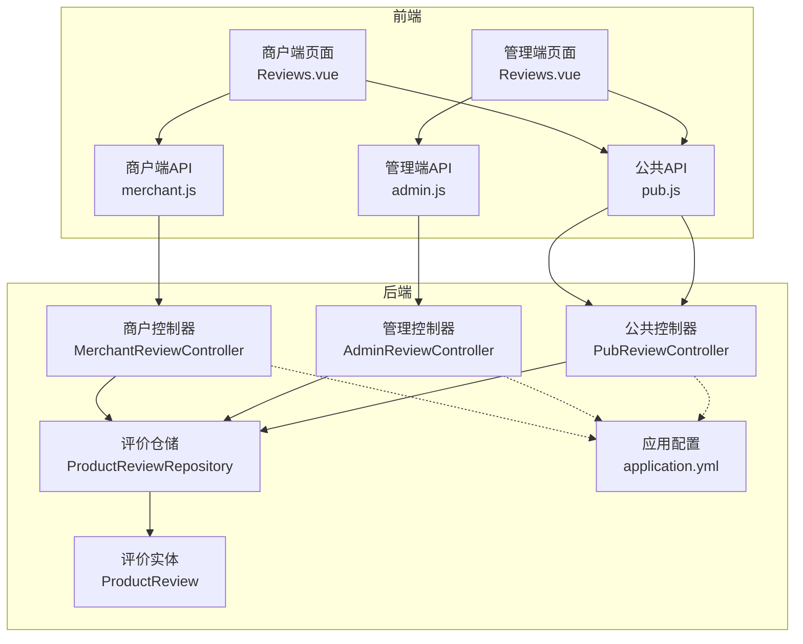
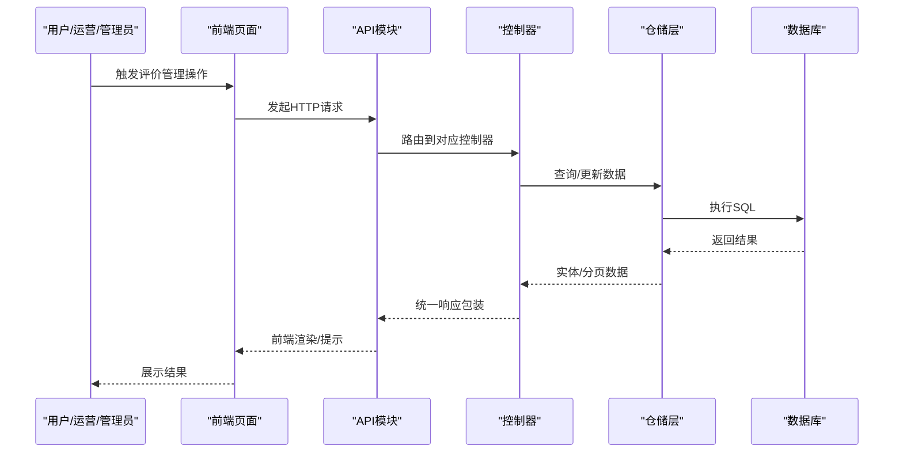
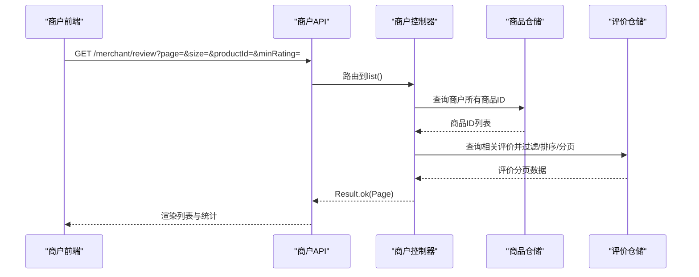
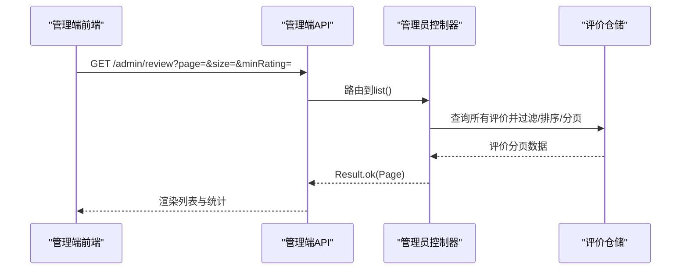
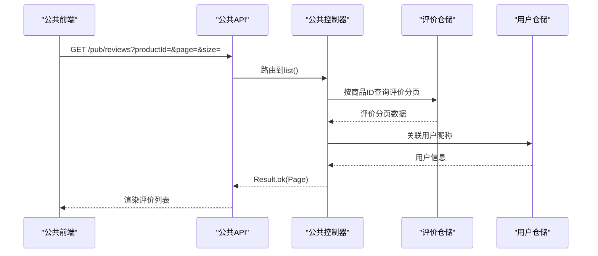
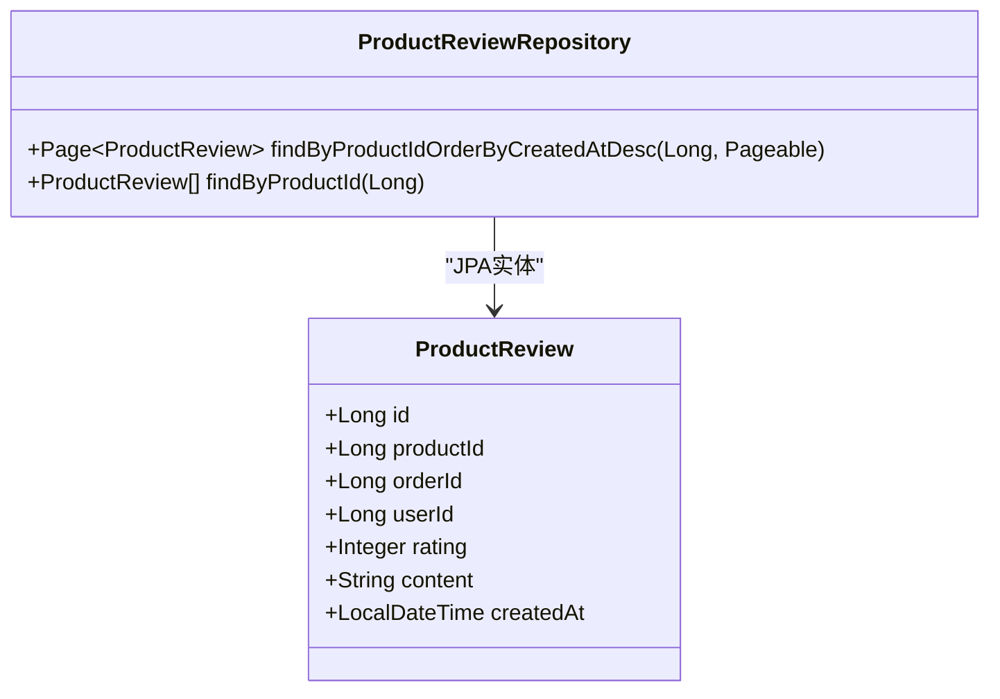
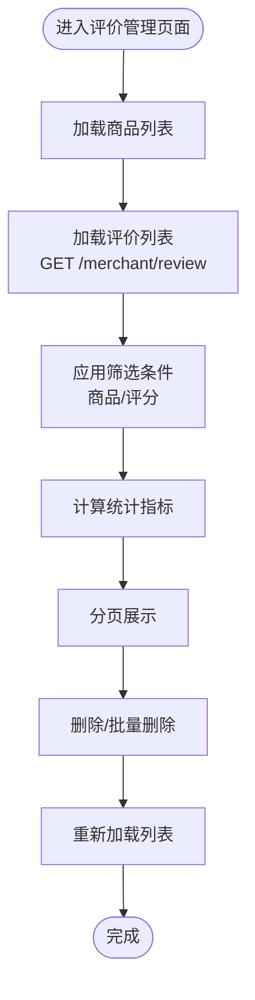
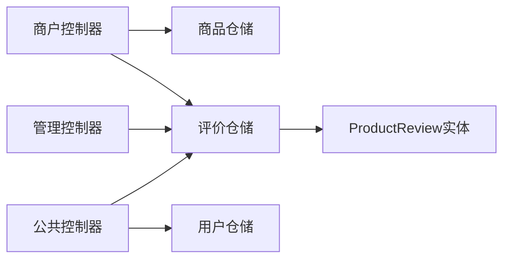

# 评价管理接口

<cite>
**本文档引用的文件**
- [MerchantReviewController.java](file://backend/src/main/java/com/mall/controller/merchant/MerchantReviewController.java)
- [AdminReviewController.java](file://backend/src/main/java/com/mall/controller/admin/AdminReviewController.java)
- [PubReviewController.java](file://backend/src/main/java/com/mall/controller/pub/PubReviewController.java)
- [ProductReview.java](file://backend/src/main/java/com/mall/entity/ProductReview.java)
- [ProductReviewRepository.java](file://backend/src/main/java/com/mall/repository/ProductReviewRepository.java)
- [Reviews.vue（商户端）](file://frontend/src/views/merchant/Reviews.vue)
- [Reviews.vue（管理端）](file://frontend/src/views/admin/Reviews.vue)
- [merchant.js](file://frontend/src/api/merchant.js)
- [admin.js](file://frontend/src/api/admin.js)
- [pub.js](file://frontend/src/api/pub.js)
- [application.yml](file://backend/src/main/resources/application.yml)
</cite>

## 目录
1. [简介](#简介)
2. [项目结构](#项目结构)
3. [核心组件](#核心组件)
4. [架构概览](#架构概览)
5. [详细组件分析](#详细组件分析)
6. [依赖分析](#依赖分析)
7. [性能考虑](#性能考虑)
8. [故障排除指南](#故障排除指南)
9. [结论](#结论)
10. [附录](#附录)

## 简介
本文件面向电商商城系统的“商户评价管理接口”，提供完整、可操作的API文档与最佳实践指南。系统支持以下关键能力：
- 商户维度：查询旗下商品评价、按商品与评分筛选、删除评价、批量删除
- 平台维度：全站评价查询、按评分筛选、删除评价、批量删除
- 前台维度：按商品分页查询评价列表（公开接口）
- 数据模型：统一的评价实体与仓储层
- 前端集成：商户端与管理端的评价管理界面与交互逻辑

本文件同时覆盖评价处理流程、回复规范、质量控制机制，并给出客户反馈处理建议与品牌声誉维护策略。

## 项目结构
后端采用Spring Boot分层架构，控制器按角色划分（商户、管理员、公共），实体与仓储层负责数据持久化，前端通过API模块对接各控制器。

图表来源
- [MerchantReviewController.java:21-157](file://backend/src/main/java/com/mall/controller/merchant/MerchantReviewController.java#L21-L157)
- [AdminReviewController.java:16-92](file://backend/src/main/java/com/mall/controller/admin/AdminReviewController.java#L16-L92)
- [PubReviewController.java:19-64](file://backend/src/main/java/com/mall/controller/pub/PubReviewController.java#L19-L64)
- [ProductReviewRepository.java:10-16](file://backend/src/main/java/com/mall/repository/ProductReviewRepository.java#L10-L16)
- [ProductReview.java:8-44](file://backend/src/main/java/com/mall/entity/ProductReview.java#L8-L44)
- [application.yml:1-36](file://backend/src/main/resources/application.yml#L1-L36)

章节来源
- [MerchantReviewController.java:21-157](file://backend/src/main/java/com/mall/controller/merchant/MerchantReviewController.java#L21-L157)
- [AdminReviewController.java:16-92](file://backend/src/main/java/com/mall/controller/admin/AdminReviewController.java#L16-L92)
- [PubReviewController.java:19-64](file://backend/src/main/java/com/mall/controller/pub/PubReviewController.java#L19-L64)
- [ProductReviewRepository.java:10-16](file://backend/src/main/java/com/mall/repository/ProductReviewRepository.java#L10-L16)
- [ProductReview.java:8-44](file://backend/src/main/java/com/mall/entity/ProductReview.java#L8-L44)
- [application.yml:1-36](file://backend/src/main/resources/application.yml#L1-L36)

## 核心组件
- 控制器层
  - 商户评价控制器：提供分页查询、按商品查询、删除与批量删除功能
  - 管理员评价控制器：提供全站评价分页查询与删除功能
  - 公共评价控制器：提供按商品分页查询评价列表（公开）
- 实体与仓储
  - 评价实体：包含评分、内容、创建时间等字段
  - 评价仓储：提供按商品ID排序查询与列表查询
- 前端集成
  - 商户端与管理端页面均提供筛选、分页、统计与删除操作
  - 前端API模块封装请求路径与参数

章节来源
- [MerchantReviewController.java:21-157](file://backend/src/main/java/com/mall/controller/merchant/MerchantReviewController.java#L21-L157)
- [AdminReviewController.java:16-92](file://backend/src/main/java/com/mall/controller/admin/AdminReviewController.java#L16-L92)
- [PubReviewController.java:19-64](file://backend/src/main/java/com/mall/controller/pub/PubReviewController.java#L19-L64)
- [ProductReview.java:15-44](file://backend/src/main/java/com/mall/entity/ProductReview.java#L15-L44)
- [ProductReviewRepository.java:10-16](file://backend/src/main/java/com/mall/repository/ProductReviewRepository.java#L10-L16)
- [Reviews.vue（商户端）:1-462](file://frontend/src/views/merchant/Reviews.vue#L1-L462)
- [Reviews.vue（管理端）:1-402](file://frontend/src/views/admin/Reviews.vue#L1-L402)
- [merchant.js:90-110](file://frontend/src/api/merchant.js#L90-L110)
- [admin.js:113-128](file://frontend/src/api/admin.js#L113-L128)
- [pub.js:60-63](file://frontend/src/api/pub.js#L60-L63)

## 架构概览
系统遵循前后端分离与控制器分层设计，商户与管理员分别拥有独立的评价管理入口；公共接口仅暴露必要信息，避免敏感操作。

图表来源
- [MerchantReviewController.java:40-91](file://backend/src/main/java/com/mall/controller/merchant/MerchantReviewController.java#L40-L91)
- [AdminReviewController.java:24-64](file://backend/src/main/java/com/mall/controller/admin/AdminReviewController.java#L24-L64)
- [PubReviewController.java:28-61](file://backend/src/main/java/com/mall/controller/pub/PubReviewController.java#L28-L61)
- [ProductReviewRepository.java:12-14](file://backend/src/main/java/com/mall/repository/ProductReviewRepository.java#L12-L14)

## 详细组件分析

### 商户评价管理接口
- 接口目标：商户可查看、筛选、删除其名下商品的用户评价
- 关键能力
  - 分页查询：支持按商品ID与最低评分筛选，按创建时间倒序
  - 单商品查询：按商品ID查询评价列表
  - 删除与批量删除：校验商品归属，确保权限安全
- 参数与返回
  - 分页查询：page、size、productId（可选）、minRating（可选，-3表示低于3星）
  - 单商品查询：productId（路径参数）
  - 删除：reviewId（路径参数）
  - 批量删除：数组reviewIds（请求体）
- 安全与权限
  - 通过认证上下文解析当前商户ID，校验商品归属
  - 非法操作返回明确错误码

图表来源
- [MerchantReviewController.java:40-91](file://backend/src/main/java/com/mall/controller/merchant/MerchantReviewController.java#L40-L91)
- [ProductReviewRepository.java:12-14](file://backend/src/main/java/com/mall/repository/ProductReviewRepository.java#L12-L14)

章节来源
- [MerchantReviewController.java:40-155](file://backend/src/main/java/com/mall/controller/merchant/MerchantReviewController.java#L40-L155)
- [Reviews.vue（商户端）:236-281](file://frontend/src/views/merchant/Reviews.vue#L236-L281)
- [merchant.js:92-110](file://frontend/src/api/merchant.js#L92-L110)

### 管理员评价管理接口
- 接口目标：平台管理员查看与删除全站评价
- 关键能力
  - 全站分页查询：支持按商品ID与最低评分筛选，按创建时间倒序
  - 删除与批量删除：直接基于ID校验与删除
- 参数与返回
  - 分页查询：page、size、productId（可选）、minRating（可选，-3表示低于3星）
  - 删除：reviewId（路径参数）
  - 批量删除：数组reviewIds（请求体）

图表来源
- [AdminReviewController.java:24-64](file://backend/src/main/java/com/mall/controller/admin/AdminReviewController.java#L24-L64)

章节来源
- [AdminReviewController.java:24-90](file://backend/src/main/java/com/mall/controller/admin/AdminReviewController.java#L24-L90)
- [Reviews.vue（管理端）:196-242](file://frontend/src/views/admin/Reviews.vue#L196-L242)
- [admin.js:115-128](file://frontend/src/api/admin.js#L115-L128)

### 公共评价接口
- 接口目标：前台按商品分页查询评价列表，增强用户体验
- 关键能力
  - 按商品ID分页查询评价
  - 关联用户昵称（若无昵称则回退用户名），匿名用户显示“匿名用户”
- 参数与返回
  - productId（查询参数）、page、size
  - 返回分页数据，包含评价详情与用户昵称

图表来源
- [PubReviewController.java:28-61](file://backend/src/main/java/com/mall/controller/pub/PubReviewController.java#L28-L61)
- [ProductReviewRepository.java:12-14](file://backend/src/main/java/com/mall/repository/ProductReviewRepository.java#L12-L14)

章节来源
- [PubReviewController.java:28-61](file://backend/src/main/java/com/mall/controller/pub/PubReviewController.java#L28-L61)
- [pub.js:60-63](file://frontend/src/api/pub.js#L60-L63)

### 数据模型与仓储
- 评价实体
  - 字段：主键、商品ID、订单ID、用户ID、评分、内容、创建时间
  - 默认评分与自动填充创建时间
- 仓储接口
  - 按商品ID查询并按创建时间倒序分页
  - 按商品ID查询列表

图表来源
- [ProductReview.java:15-44](file://backend/src/main/java/com/mall/entity/ProductReview.java#L15-L44)
- [ProductReviewRepository.java:10-16](file://backend/src/main/java/com/mall/repository/ProductReviewRepository.java#L10-L16)

章节来源
- [ProductReview.java:15-44](file://backend/src/main/java/com/mall/entity/ProductReview.java#L15-L44)
- [ProductReviewRepository.java:10-16](file://backend/src/main/java/com/mall/repository/ProductReviewRepository.java#L10-L16)

### 前端集成与交互
- 商户端页面
  - 提供商品筛选、评分筛选（含“低于3星”）、分页与批量删除
  - 动态计算统计指标：总评价数、5星数量、平均评分、低评价数
- 管理端页面
  - 提供评分筛选、分页与批量删除
  - 动态计算统计指标：总评价数、5星数量、平均评分、低评价数
- API模块
  - 封装GET/DELETE/POST请求，参数与后端控制器保持一致

图表来源
- [Reviews.vue（商户端）:224-281](file://frontend/src/views/merchant/Reviews.vue#L224-L281)
- [Reviews.vue（管理端）:196-242](file://frontend/src/views/admin/Reviews.vue#L196-L242)
- [merchant.js:92-110](file://frontend/src/api/merchant.js#L92-L110)
- [admin.js:115-128](file://frontend/src/api/admin.js#L115-L128)

章节来源
- [Reviews.vue（商户端）:1-462](file://frontend/src/views/merchant/Reviews.vue#L1-L462)
- [Reviews.vue（管理端）:1-402](file://frontend/src/views/admin/Reviews.vue#L1-L402)
- [merchant.js:90-110](file://frontend/src/api/merchant.js#L90-L110)
- [admin.js:113-128](file://frontend/src/api/admin.js#L113-L128)

## 依赖分析
- 控制器依赖
  - 商户控制器依赖商品仓储与评价仓储，用于权限校验与数据查询
  - 管理控制器依赖评价仓储，执行全站查询与删除
  - 公共控制器依赖评价仓储与用户仓储，用于关联用户昵称
- 仓储与实体
  - 评价仓储继承JPA基础能力，提供按商品ID查询与分页
  - 实体定义字段与默认值，仓储方法与实体字段一一对应
- 前端依赖
  - 商户端与管理端页面分别调用对应API模块
  - 公共页面调用公共API模块

图表来源
- [MerchantReviewController.java:27-29](file://backend/src/main/java/com/mall/controller/merchant/MerchantReviewController.java#L27-L29)
- [AdminReviewController.java](file://backend/src/main/java/com/mall/controller/admin/AdminReviewController.java#L22)
- [PubReviewController.java:25-26](file://backend/src/main/java/com/mall/controller/pub/PubReviewController.java#L25-L26)
- [ProductReviewRepository.java:10-16](file://backend/src/main/java/com/mall/repository/ProductReviewRepository.java#L10-L16)
- [ProductReview.java:15-44](file://backend/src/main/java/com/mall/entity/ProductReview.java#L15-L44)

章节来源
- [MerchantReviewController.java:27-29](file://backend/src/main/java/com/mall/controller/merchant/MerchantReviewController.java#L27-L29)
- [AdminReviewController.java](file://backend/src/main/java/com/mall/controller/admin/AdminReviewController.java#L22)
- [PubReviewController.java:25-26](file://backend/src/main/java/com/mall/controller/pub/PubReviewController.java#L25-L26)
- [ProductReviewRepository.java:10-16](file://backend/src/main/java/com/mall/repository/ProductReviewRepository.java#L10-L16)
- [ProductReview.java:15-44](file://backend/src/main/java/com/mall/entity/ProductReview.java#L15-L44)

## 性能考虑
- 查询优化
  - 商户端分页查询时先获取商户商品ID列表，再在内存中过滤评价，适合中小规模商品数量
  - 若商品数量较大，建议在仓储层增加按商户ID与商品ID联合过滤的查询方法，减少内存过滤开销
- 分页与排序
  - 使用数据库分页与排序，避免一次性加载全部数据
- 前端渲染
  - 大文本内容采用省略与弹窗展示，提升表格渲染性能
- 缓存策略
  - 对高频查询的商品评价列表可引入缓存（如Redis），降低数据库压力

## 故障排除指南
- 常见问题
  - 无权限操作：商户尝试删除非自身商品的评价，返回明确错误提示
  - 评价不存在：删除或批量删除时传入无效ID，返回错误提示
  - 非运营账号：认证用户未绑定商户信息，触发异常
- 排查步骤
  - 检查认证是否正确传递与解析
  - 核对商品ID与商户ID的归属关系
  - 确认仓储查询方法与实体字段匹配
- 建议
  - 在控制器层增加更细粒度的异常捕获与日志记录
  - 对批量删除操作增加事务边界，确保一致性

章节来源
- [MerchantReviewController.java:112-132](file://backend/src/main/java/com/mall/controller/merchant/MerchantReviewController.java#L112-L132)
- [AdminReviewController.java:66-76](file://backend/src/main/java/com/mall/controller/admin/AdminReviewController.java#L66-L76)

## 结论
本评价管理接口体系覆盖商户与管理员两类角色，提供完善的查询、筛选、删除与统计能力。通过清晰的控制器分层、统一的数据模型与前端交互，系统在易用性与安全性之间取得平衡。建议后续在高并发场景下引入仓储层优化与缓存策略，以进一步提升性能与稳定性。

## 附录

### API定义与使用说明

- 商户评价查询
  - 方法与路径：GET /merchant/review
  - 查询参数：
    - page：页码（从0开始，默认0）
    - size：每页大小（默认10）
    - productId：商品ID（可选）
    - minRating：最低评分（可选，-3表示低于3星）
  - 返回：分页的评价列表（按创建时间倒序）
  - 示例路径：[MerchantReviewController.java:40-91](file://backend/src/main/java/com/mall/controller/merchant/MerchantReviewController.java#L40-L91)

- 单商品评价查询
  - 方法与路径：GET /merchant/review/product/{productId}
  - 路径参数：productId
  - 返回：该商品的评价列表（按创建时间倒序）
  - 示例路径：[MerchantReviewController.java:94-110](file://backend/src/main/java/com/mall/controller/merchant/MerchantReviewController.java#L94-L110)

- 删除单条评价
  - 方法与路径：DELETE /merchant/review/{reviewId}
  - 路径参数：reviewId
  - 返回：操作结果
  - 示例路径：[MerchantReviewController.java:112-132](file://backend/src/main/java/com/mall/controller/merchant/MerchantReviewController.java#L112-L132)

- 批量删除评价
  - 方法与路径：POST /merchant/review/batch-delete
  - 请求体：reviewIds（数组）
  - 返回：成功删除数量
  - 示例路径：[MerchantReviewController.java:134-155](file://backend/src/main/java/com/mall/controller/merchant/MerchantReviewController.java#L134-L155)

- 管理员评价查询
  - 方法与路径：GET /admin/review
  - 查询参数：page、size、productId（可选）、minRating（可选，-3表示低于3星）
  - 返回：全站评价分页列表
  - 示例路径：[AdminReviewController.java:24-64](file://backend/src/main/java/com/mall/controller/admin/AdminReviewController.java#L24-L64)

- 管理员删除单条评价
  - 方法与路径：DELETE /admin/review/{reviewId}
  - 返回：操作结果
  - 示例路径：[AdminReviewController.java:66-76](file://backend/src/main/java/com/mall/controller/admin/AdminReviewController.java#L66-L76)

- 管理员批量删除评价
  - 方法与路径：POST /admin/review/batch-delete
  - 请求体：reviewIds（数组）
  - 返回：成功删除数量
  - 示例路径：[AdminReviewController.java:78-90](file://backend/src/main/java/com/mall/controller/admin/AdminReviewController.java#L78-L90)

- 公共评价查询
  - 方法与路径：GET /pub/reviews
  - 查询参数：productId、page、size
  - 返回：评价列表（包含用户昵称）
  - 示例路径：[PubReviewController.java:28-61](file://backend/src/main/java/com/mall/controller/pub/PubReviewController.java#L28-L61)

### 评价处理流程与规范
- 处理流程
  - 查询：按需筛选与分页
  - 审核：识别不当内容（广告、辱骂、虚假评价）
  - 处置：删除违规评价，必要时封禁账号
  - 反馈：向用户发送通知（如适用）
- 回复规范
  - 积极正面：感谢与改进承诺
  - 明确具体：针对问题给出解决方案
  - 限时响应：设定合理回复时限
- 质量控制
  - 内容审核：关键词过滤与人工复核
  - 评分分布：关注低分集中区域
  - 重复评价：识别刷评与恶意差评
  - 用户画像：结合购买行为与历史评价

### 最佳实践与品牌声誉维护
- 建立评价分级与预警机制，对低分集中商品进行专项治理
- 强化内容安全策略，及时清理违规内容
- 提升客服响应效率，将负面评价转化为正向口碑
- 定期发布评价分析报告，指导产品与服务优化
- 对优质评价进行展示与激励，营造健康评价生态