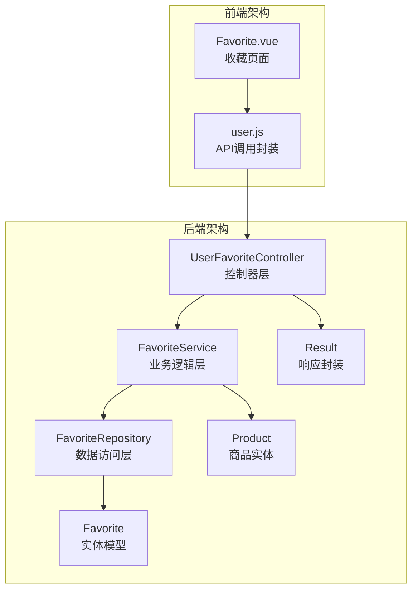
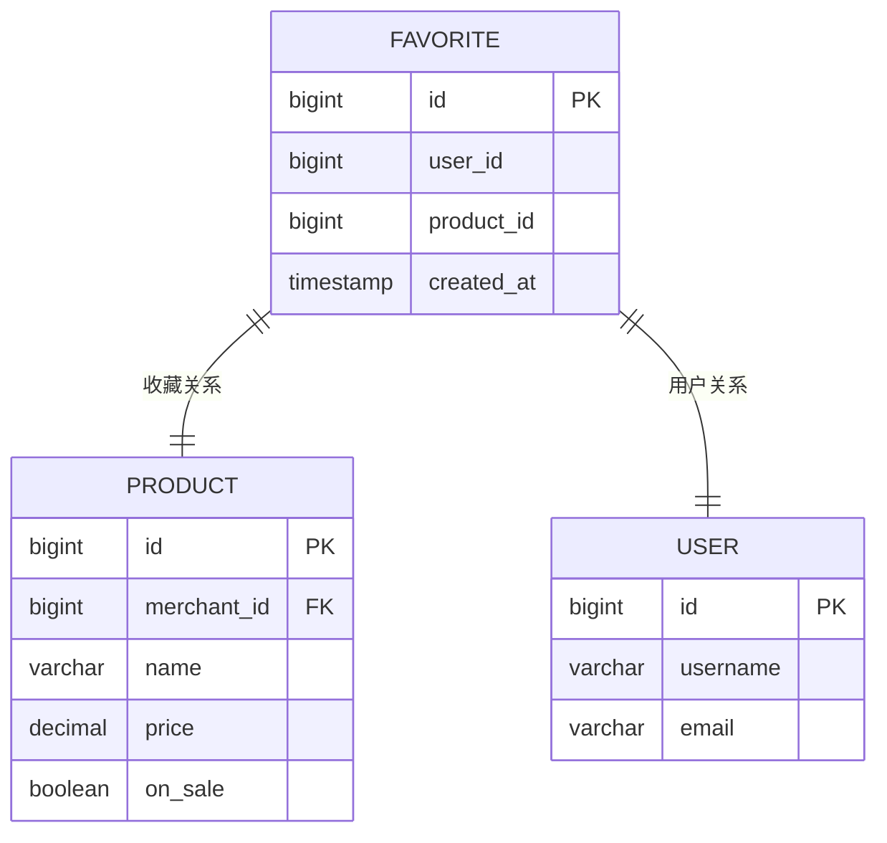
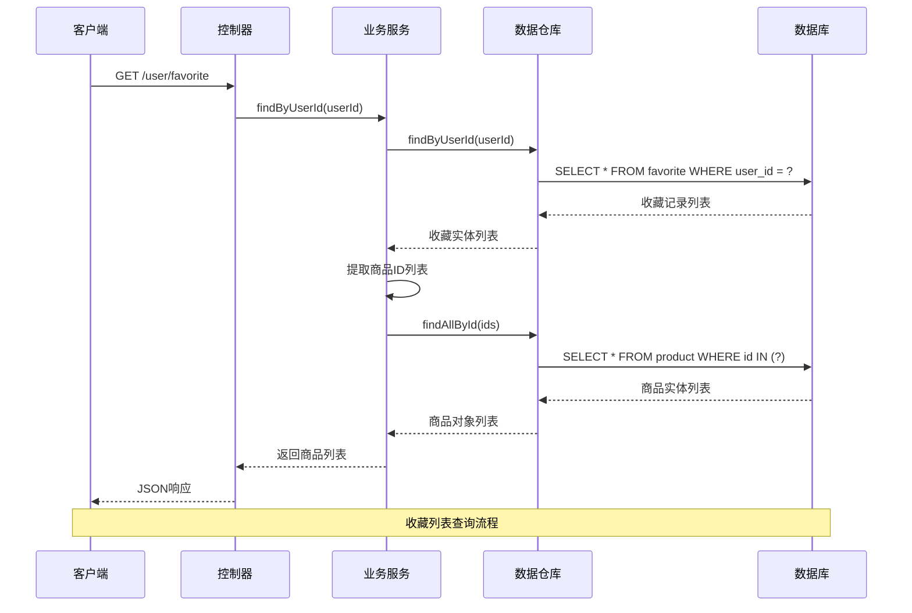
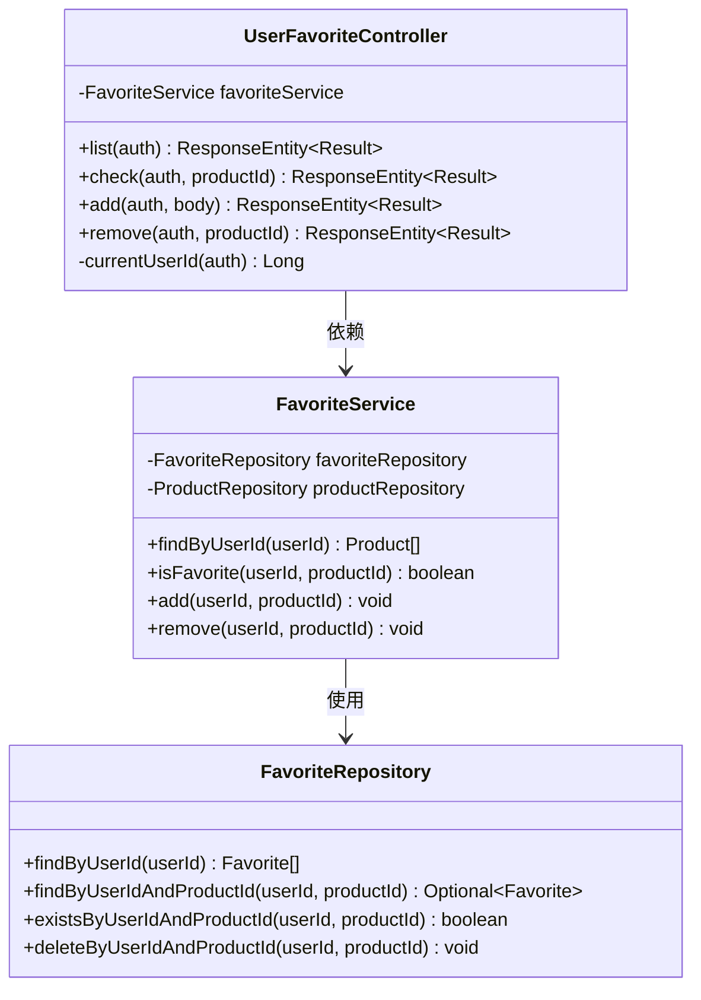
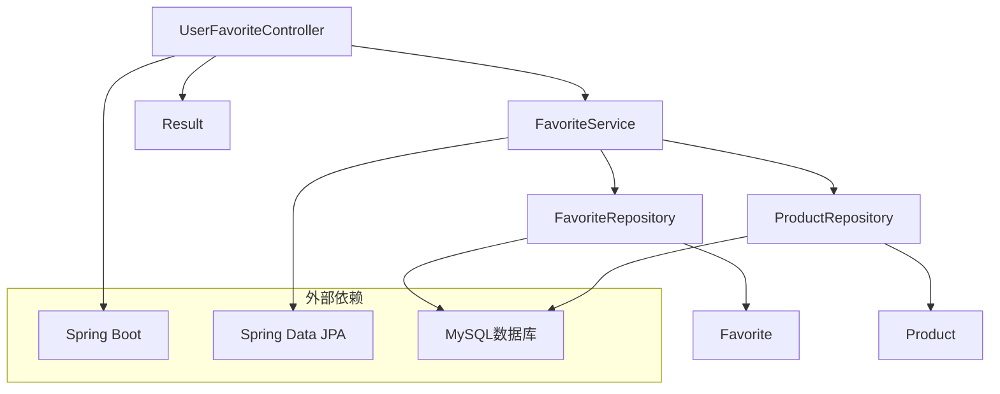

# 收藏夹接口

<cite>
**本文档引用的文件**
- [UserFavoriteController.java](file://backend/src/main/java/com/mall/controller/user/UserFavoriteController.java)
- [FavoriteService.java](file://backend/src/main/java/com/mall/service/FavoriteService.java)
- [FavoriteRepository.java](file://backend/src/main/java/com/mall/repository/FavoriteRepository.java)
- [Favorite.java](file://backend/src/main/java/com/mall/entity/Favorite.java)
- [Product.java](file://backend/src/main/java/com/mall/entity/Product.java)
- [ProductRepository.java](file://backend/src/main/java/com/mall/repository/ProductRepository.java)
- [Result.java](file://backend/src/main/java/com/mall/dto/Result.java)
- [application.yml](file://backend/src/main/resources/application.yml)
- [user.js](file://frontend/src/api/user.js)
- [Favorite.vue](file://frontend/src/views/user/Favorite.vue)
</cite>

## 目录
1. [简介](#简介)
2. [项目结构](#项目结构)
3. [核心组件](#核心组件)
4. [架构概览](#架构概览)
5. [详细组件分析](#详细组件分析)
6. [依赖关系分析](#依赖关系分析)
7. [性能考虑](#性能考虑)
8. [故障排除指南](#故障排除指南)
9. [结论](#结论)

## 简介

收藏夹管理接口是电商系统中重要的用户个性化功能模块，允许用户收藏感兴趣的商品以便后续查看和购买。本接口实现了完整的收藏夹生命周期管理，包括商品收藏、取消收藏、收藏列表查询和收藏状态检查等功能。

系统采用Spring Boot + Spring Data JPA的技术栈，使用MySQL作为数据存储，通过RESTful API提供服务。收藏夹数据结构设计简洁高效，支持高并发场景下的读写操作。

## 项目结构

收藏夹相关的核心文件组织如下：

**图表来源**
- [UserFavoriteController.java:14-60](file://backend/src/main/java/com/mall/controller/user/UserFavoriteController.java#L14-L60)
- [FavoriteService.java:14-43](file://backend/src/main/java/com/mall/service/FavoriteService.java#L14-L43)
- [FavoriteRepository.java:9-19](file://backend/src/main/java/com/mall/repository/FavoriteRepository.java#L9-L19)

**章节来源**
- [UserFavoriteController.java:1-60](file://backend/src/main/java/com/mall/controller/user/UserFavoriteController.java#L1-L60)
- [application.yml:1-36](file://backend/src/main/resources/application.yml#L1-L36)

## 核心组件

### 数据模型设计

收藏夹采用独立的实体模型，通过用户ID和商品ID的唯一约束确保收藏关系的完整性：

**图表来源**
- [Favorite.java:15-35](file://backend/src/main/java/com/mall/entity/Favorite.java#L15-L35)
- [Product.java:16-101](file://backend/src/main/java/com/mall/entity/Product.java#L16-L101)

### 接口定义

系统提供以下核心API接口：

| 方法 | 路径 | 功能描述 | 请求参数 | 响应数据 |
|------|------|----------|----------|----------|
| GET | `/user/favorite` | 查询收藏列表 | 无 | 商品列表 |
| GET | `/user/favorite/check` | 检查收藏状态 | productId | {favorite: boolean} |
| POST | `/user/favorite/add` | 添加收藏 | productId | 成功/失败 |
| DELETE | `/user/favorite/{productId}` | 取消收藏 | 路径参数 | 成功/失败 |

**章节来源**
- [UserFavoriteController.java:27-58](file://backend/src/main/java/com/mall/controller/user/UserFavoriteController.java#L27-L58)
- [user.js:38-56](file://frontend/src/api/user.js#L38-L56)

## 架构概览

收藏夹系统的整体架构采用经典的三层架构模式：

**图表来源**
- [UserFavoriteController.java:28-32](file://backend/src/main/java/com/mall/controller/user/UserFavoriteController.java#L28-L32)
- [FavoriteService.java:21-25](file://backend/src/main/java/com/mall/service/FavoriteService.java#L21-L25)

**章节来源**
- [UserFavoriteController.java:14-60](file://backend/src/main/java/com/mall/controller/user/UserFavoriteController.java#L14-L60)
- [FavoriteService.java:14-43](file://backend/src/main/java/com/mall/service/FavoriteService.java#L14-L43)

## 详细组件分析

### 控制器层分析

UserFavoriteController负责处理所有收藏夹相关的HTTP请求，采用基于注解的RESTful设计：

**图表来源**
- [UserFavoriteController.java:14-60](file://backend/src/main/java/com/mall/controller/user/UserFavoriteController.java#L14-L60)
- [FavoriteService.java:14-43](file://backend/src/main/java/com/mall/service/FavoriteService.java#L14-L43)
- [FavoriteRepository.java:9-19](file://backend/src/main/java/com/mall/repository/FavoriteRepository.java#L9-L19)

#### 认证与授权机制

控制器通过Spring Security的Authentication对象获取当前登录用户ID，确保每个收藏操作都与正确的用户关联：

- 使用`@AuthenticationPrincipal`注解获取用户身份
- 自动验证JWT令牌的有效性
- 确保用户只能操作自己的收藏数据

#### 错误处理策略

控制器采用统一的错误处理机制：
- 捕获业务异常并返回标准化的错误响应
- 对于重复收藏操作进行幂等性处理
- 返回符合Result DTO规范的JSON格式

**章节来源**
- [UserFavoriteController.java:22-25](file://backend/src/main/java/com/mall/controller/user/UserFavoriteController.java#L22-L25)
- [UserFavoriteController.java:45-50](file://backend/src/main/java/com/mall/controller/user/UserFavoriteController.java#L45-L50)

### 业务逻辑层分析

FavoriteService实现收藏夹的核心业务逻辑，包含完整的事务管理和数据一致性保证：

#### 查询优化策略

收藏列表查询采用两阶段查询优化：
1. **第一阶段**：从favorite表查询当前用户的收藏记录，获取商品ID列表
2. **第二阶段**：使用IN查询从product表批量获取商品详细信息

这种设计避免了复杂的JOIN操作，提高了查询效率。

#### 幂等性保证

添加收藏操作具有天然的幂等性：
- 通过唯一约束防止重复收藏
- 已存在的收藏直接返回成功
- 避免了不必要的数据库写操作

**章节来源**
- [FavoriteService.java:21-29](file://backend/src/main/java/com/mall/service/FavoriteService.java#L21-L29)
- [FavoriteService.java:31-41](file://backend/src/main/java/com/mall/service/FavoriteService.java#L31-L41)

### 数据访问层分析

FavoriteRepository继承JpaRepository，提供了丰富的查询方法：

#### 查询方法设计

| 方法名 | SQL语句 | 用途 |
|--------|---------|------|
| findByUserId | SELECT * FROM favorite WHERE user_id = ? | 获取用户所有收藏 |
| findByUserIdAndProductId | SELECT * FROM favorite WHERE user_id = ? AND product_id = ? | 检查特定收藏 |
| existsByUserIdAndProductId | EXISTS(SELECT 1 FROM favorite WHERE user_id = ? AND product_id = ?) | 收藏状态检查 |
| deleteByUserIdAndProductId | DELETE FROM favorite WHERE user_id = ? AND product_id = ? | 取消收藏 |

#### 性能优化特性

- 使用原生SQL查询避免ORM开销
- 通过索引优化常用查询条件
- 支持批量操作减少数据库往返

**章节来源**
- [FavoriteRepository.java:11-17](file://backend/src/main/java/com/mall/repository/FavoriteRepository.java#L11-L17)

### 实体模型分析

Favorite实体采用标准的JPA注解配置：

#### 字段设计原则

| 字段名 | 类型 | 约束 | 说明 |
|--------|------|------|------|
| id | BIGINT | 主键, 自增 | 收藏记录唯一标识 |
| user_id | BIGINT | 非空 | 关联用户ID |
| product_id | BIGINT | 非空 | 关联商品ID |
| created_at | TIMESTAMP | 非空, 不可更新 | 收藏时间戳 |

#### 约束与索引

- 唯一约束：`(user_id, product_id)`确保收藏关系唯一性
- 外键约束：指向user和product表
- 索引优化：针对查询频率高的字段建立索引

**章节来源**
- [Favorite.java:8-35](file://backend/src/main/java/com/mall/entity/Favorite.java#L8-L35)

## 依赖关系分析

收藏夹模块的依赖关系清晰明确，遵循单一职责原则：

**图表来源**
- [UserFavoriteController.java:3-6](file://backend/src/main/java/com/mall/controller/user/UserFavoriteController.java#L3-L6)
- [FavoriteService.java:3-6](file://backend/src/main/java/com/mall/service/FavoriteService.java#L3-L6)

### 外部依赖

系统依赖的关键技术组件：
- **Spring Boot**: 提供Web框架和依赖注入
- **Spring Data JPA**: 提供ORM映射和数据访问抽象
- **MySQL**: 关系型数据库存储
- **JWT**: 用户认证和授权

**章节来源**
- [application.yml:4-17](file://backend/src/main/resources/application.yml#L4-L17)

## 性能考虑

### 查询性能优化

#### N+1查询问题解决

通过两阶段查询避免N+1问题：
1. 先查询收藏记录获取商品ID列表
2. 再使用批量查询获取商品详情

这种设计将查询次数从O(n)降低到O(1)，显著提升性能。

#### 缓存策略建议

虽然当前实现未使用缓存，但可以考虑以下优化：
- 使用Redis缓存热门商品信息
- 对频繁查询的收藏列表进行缓存
- 实现缓存失效策略确保数据一致性

### 并发控制

#### 事务管理

所有收藏操作都在事务中执行：
- 添加收藏：检查存在性 + 插入记录
- 取消收藏：删除对应记录
- 原子性保证：要么全部成功，要么全部失败

#### 并发冲突处理

- 唯一约束防止重复收藏
- 数据库层面的并发控制
- 业务逻辑层的幂等性设计

## 故障排除指南

### 常见问题及解决方案

#### 收藏失败问题

**问题现象**：添加收藏时抛出异常
**可能原因**：
- 商品ID不存在
- 数据库连接异常
- 事务回滚

**解决方案**：
- 验证商品ID的有效性
- 检查数据库连接状态
- 查看事务日志

#### 查询性能问题

**问题现象**：收藏列表加载缓慢
**可能原因**：
- 收藏数量过多
- 数据库索引缺失
- 查询条件不优化

**解决方案**：
- 实现分页查询
- 添加适当的数据库索引
- 优化查询逻辑

#### 并发冲突问题

**问题现象**：重复收藏或数据不一致
**可能原因**：
- 多线程同时操作
- 网络延迟导致的重复请求
- 事务隔离级别不当

**解决方案**：
- 利用数据库唯一约束
- 实现幂等性设计
- 调整事务隔离级别

**章节来源**
- [FavoriteService.java:34-35](file://backend/src/main/java/com/mall/service/FavoriteService.java#L34-L35)
- [UserFavoriteController.java:48-50](file://backend/src/main/java/com/mall/controller/user/UserFavoriteController.java#L48-L50)

## 结论

收藏夹管理接口设计合理，实现了完整的收藏功能需求。系统采用分层架构，职责分离明确，具有良好的可维护性和扩展性。

### 设计优势

1. **简洁的数据模型**：独立的收藏实体，避免了复杂的关联关系
2. **高效的查询策略**：两阶段查询优化，避免N+1问题
3. **完善的错误处理**：统一的异常处理机制和幂等性设计
4. **良好的扩展性**：模块化设计便于功能扩展

### 改进建议

1. **增加批量操作支持**：支持批量添加、删除收藏
2. **实现缓存机制**：提升高频查询的响应速度
3. **添加排序和筛选**：支持按时间、价格等条件排序
4. **增强监控指标**：添加性能监控和错误统计

该接口为电商系统的用户个性化功能提供了坚实的基础，能够满足大多数应用场景的需求。