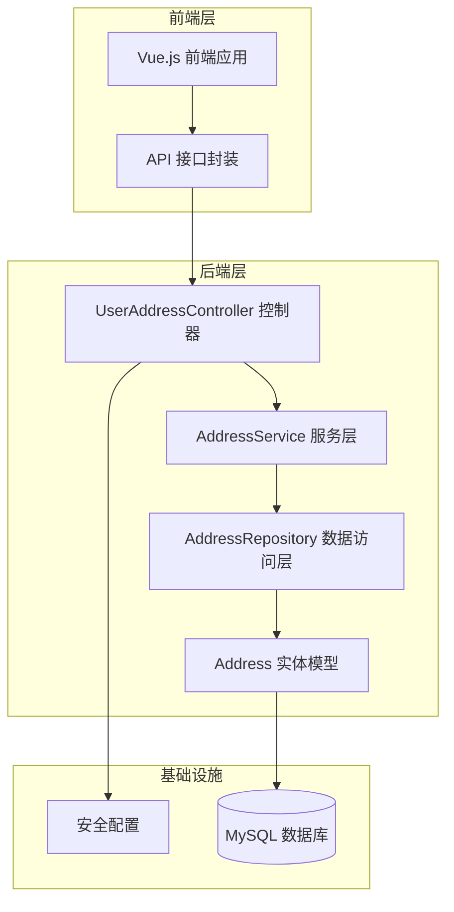
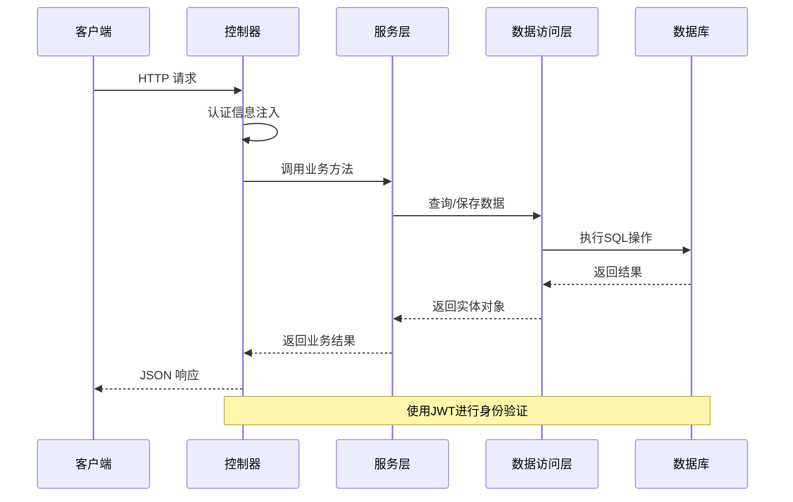
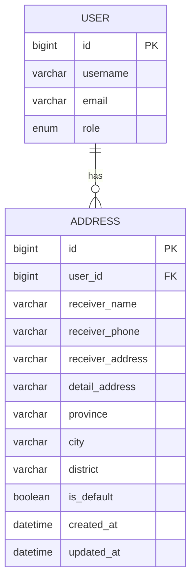
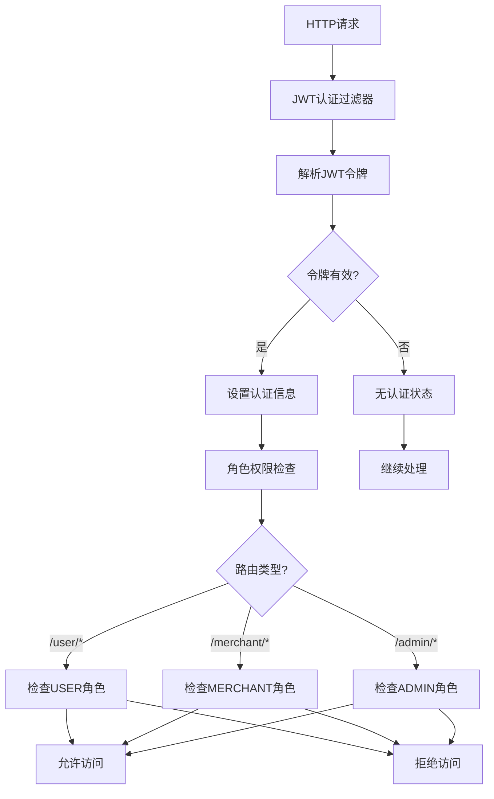
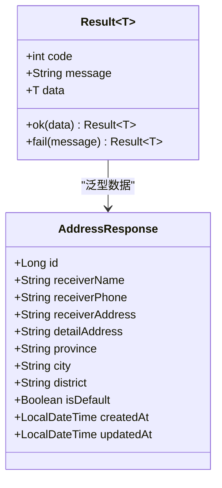
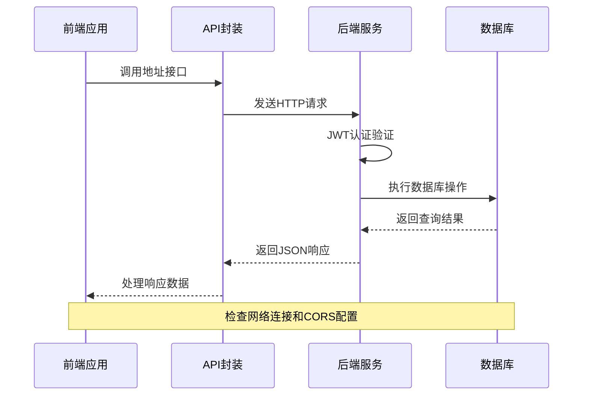

# 收货地址接口

<cite>
**本文档引用的文件**
- [UserAddressController.java](file://backend/src/main/java/com/mall/controller/user/UserAddressController.java)
- [AddressService.java](file://backend/src/main/java/com/mall/service/AddressService.java)
- [Address.java](file://backend/src/main/java/com/mall/entity/Address.java)
- [AddressRepository.java](file://backend/src/main/java/com/mall/repository/AddressRepository.java)
- [Result.java](file://backend/src/main/java/com/mall/dto/Result.java)
- [SecurityConfig.java](file://backend/src/main/java/com/mall/config/SecurityConfig.java)
- [JwtAuthFilter.java](file://backend/src/main/java/com/mall/security/JwtAuthFilter.java)
- [application.yml](file://backend/src/main/resources/application.yml)
- [user.js](file://frontend/src/api/user.js)
- [AddressBook.vue](file://frontend/src/views/user/AddressBook.vue)
</cite>

## 目录
1. [简介](#简介)
2. [项目结构](#项目结构)
3. [核心组件](#核心组件)
4. [架构概览](#架构概览)
5. [详细接口文档](#详细接口文档)
6. [数据模型](#数据模型)
7. [权限控制](#权限控制)
8. [错误处理](#错误处理)
9. [性能考虑](#性能考虑)
10. [故障排除指南](#故障排除指南)
11. [结论](#结论)

## 简介

本文件为收货地址管理接口的完整API文档，涵盖了用户收货地址的增删改查操作。系统采用Spring Boot + Vue.js技术栈构建，提供RESTful风格的API接口，支持用户对个人收货地址的完整生命周期管理。

## 项目结构

收货地址功能在后端采用分层架构设计，主要包含以下层次：



**图表来源**
- [UserAddressController.java:1-73](file://backend/src/main/java/com/mall/controller/user/UserAddressController.java#L1-L73)
- [AddressService.java:1-91](file://backend/src/main/java/com/mall/service/AddressService.java#L1-L91)
- [AddressRepository.java:1-22](file://backend/src/main/java/com/mall/repository/AddressRepository.java#L1-L22)

**章节来源**
- [UserAddressController.java:1-73](file://backend/src/main/java/com/mall/controller/user/UserAddressController.java#L1-L73)
- [AddressService.java:1-91](file://backend/src/main/java/com/mall/service/AddressService.java#L1-L91)
- [AddressRepository.java:1-22](file://backend/src/main/java/com/mall/repository/AddressRepository.java#L1-L22)

## 核心组件

### 控制器层
- **UserAddressController**: 提供所有收货地址相关的HTTP接口
- 处理用户认证信息注入
- 调用服务层执行业务逻辑
- 统一返回Result格式的数据

### 服务层
- **AddressService**: 实现地址管理的核心业务逻辑
- 处理默认地址的互斥性
- 管理地址的创建、更新、删除操作
- 提供地址查询和默认地址设置功能

### 数据访问层
- **AddressRepository**: JPA Repository接口
- 提供基于用户ID的地址查询
- 支持默认地址的查找
- 统计用户地址数量

### 实体模型
- **Address**: 地址实体，包含完整的地址信息字段
- 支持默认地址标记
- 自动维护创建和更新时间

**章节来源**
- [UserAddressController.java:13-73](file://backend/src/main/java/com/mall/controller/user/UserAddressController.java#L13-L73)
- [AddressService.java:12-91](file://backend/src/main/java/com/mall/service/AddressService.java#L12-L91)
- [AddressRepository.java:11-22](file://backend/src/main/java/com/mall/repository/AddressRepository.java#L11-L22)
- [Address.java:7-60](file://backend/src/main/java/com/mall/entity/Address.java#L7-L60)

## 架构概览

系统采用经典的三层架构模式，结合Spring Security实现权限控制：



**图表来源**
- [UserAddressController.java:19-71](file://backend/src/main/java/com/mall/controller/user/UserAddressController.java#L19-L71)
- [AddressService.java:17-89](file://backend/src/main/java/com/mall/service/AddressService.java#L17-L89)
- [JwtAuthFilter.java:30-47](file://backend/src/main/java/com/mall/security/JwtAuthFilter.java#L30-L47)

## 详细接口文档

### 获取地址列表

**接口描述**: 获取当前登录用户的全部收货地址列表

**HTTP请求**: `GET /api/user/address`

**请求头参数**:
- `Authorization: Bearer <token>` - JWT认证令牌

**响应数据**:
```json
{
  "code": 200,
  "message": "success",
  "data": [
    {
      "id": 1,
      "receiverName": "张三",
      "receiverPhone": "13800138000",
      "receiverAddress": "广东省广州市天河区",
      "detailAddress": "珠江新城华夏路1088号",
      "province": "广东省",
      "city": "广州市",
      "district": "天河区",
      "isDefault": true,
      "createdAt": "2024-01-01T10:00:00",
      "updatedAt": "2024-01-01T10:00:00"
    }
  ]
}
```

**业务逻辑**:
- 按默认地址优先、创建时间倒序排列
- 默认地址排在列表首位
- 自动过滤用户权限范围

**章节来源**
- [UserAddressController.java:19-23](file://backend/src/main/java/com/mall/controller/user/UserAddressController.java#L19-L23)
- [AddressService.java:17-19](file://backend/src/main/java/com/mall/service/AddressService.java#L17-L19)
- [AddressRepository.java:13-15](file://backend/src/main/java/com/mall/repository/AddressRepository.java#L13-L15)

### 获取地址详情

**接口描述**: 获取指定ID的收货地址详情

**HTTP请求**: `GET /api/user/address/{id}`

**路径参数**:
- `id` (Long): 地址ID

**响应数据**:
- 成功: 返回地址详情对象
- 失败: 返回错误信息

**业务逻辑**:
- 验证地址属于当前用户
- 不存在时返回错误

**章节来源**
- [UserAddressController.java:25-32](file://backend/src/main/java/com/mall/controller/user/UserAddressController.java#L25-L32)
- [AddressService.java:21-25](file://backend/src/main/java/com/mall/service/AddressService.java#L21-L25)

### 新增收货地址

**接口描述**: 创建新的收货地址

**HTTP请求**: `POST /api/user/address`

**请求体参数**:
```json
{
  "receiverName": "张三",
  "receiverPhone": "13800138000",
  "receiverAddress": "广东省广州市天河区",
  "detailAddress": "珠江新城华夏路1088号",
  "province": "广东省",
  "city": "广州市",
  "district": "天河区",
  "isDefault": false
}
```

**响应数据**:
- 成功: 返回创建的地址对象
- 失败: 返回错误信息

**业务逻辑**:
- 如果设置为默认地址，自动取消用户其他地址的默认标记
- 设置创建者为当前用户
- 自动设置创建时间和更新时间

**章节来源**
- [UserAddressController.java:34-38](file://backend/src/main/java/com/mall/controller/user/UserAddressController.java#L34-L38)
- [AddressService.java:27-34](file://backend/src/main/java/com/mall/service/AddressService.java#L27-L34)

### 更新收货地址

**接口描述**: 更新现有收货地址信息

**HTTP请求**: `PUT /api/user/address/{id}`

**路径参数**:
- `id` (Long): 地址ID

**请求体参数**:
- 同新增接口的参数结构
- 可选择性更新部分字段

**响应数据**:
- 成功: 返回更新后的地址对象
- 失败: 返回错误信息

**业务逻辑**:
- 验证地址属于当前用户
- 如果新状态为默认且原状态不是默认，自动取消其他默认地址
- 更新所有可变字段

**章节来源**
- [UserAddressController.java:40-47](file://backend/src/main/java/com/mall/controller/user/UserAddressController.java#L40-L47)
- [AddressService.java:36-57](file://backend/src/main/java/com/mall/service/AddressService.java#L36-L57)

### 删除收货地址

**接口描述**: 删除指定的收货地址

**HTTP请求**: `DELETE /api/user/address/{id}`

**路径参数**:
- `id` (Long): 地址ID

**响应数据**:
- 成功: 返回空数据
- 失败: 返回错误信息

**业务逻辑**:
- 验证地址属于当前用户
- 存在则删除，不存在则忽略

**章节来源**
- [UserAddressController.java:49-53](file://backend/src/main/java/com/mall/controller/user/UserAddressController.java#L49-L53)
- [AddressService.java:59-65](file://backend/src/main/java/com/mall/service/AddressService.java#L59-L65)

### 设置默认收货地址

**接口描述**: 将指定地址设置为默认收货地址

**HTTP请求**: `PUT /api/user/address/{id}/default`

**路径参数**:
- `id` (Long): 地址ID

**响应数据**:
- 成功: 返回设置后的地址对象
- 失败: 返回错误信息

**业务逻辑**:
- 验证地址属于当前用户
- 自动取消用户其他地址的默认标记
- 设置当前地址为默认

**章节来源**
- [UserAddressController.java:55-62](file://backend/src/main/java/com/mall/controller/user/UserAddressController.java#L55-L62)
- [AddressService.java:67-76](file://backend/src/main/java/com/mall/service/AddressService.java#L67-L76)

### 获取默认收货地址

**接口描述**: 获取当前用户的默认收货地址

**HTTP请求**: `GET /api/user/address/default`

**响应数据**:
- 成功: 返回默认地址对象
- 失败: 返回错误信息

**业务逻辑**:
- 查找用户标记为默认的地址
- 不存在时返回错误

**章节来源**
- [UserAddressController.java:64-71](file://backend/src/main/java/com/mall/controller/user/UserAddressController.java#L64-L71)
- [AddressService.java:87-89](file://backend/src/main/java/com/mall/service/AddressService.java#L87-L89)

## 数据模型

### Address 实体结构



**图表来源**
- [Address.java:10-59](file://backend/src/main/java/com/mall/entity/Address.java#L10-L59)

### 字段详细说明

| 字段名 | 类型 | 必填 | 描述 | 长度限制 |
|--------|------|------|------|----------|
| id | Long | 是 | 地址ID | - |
| receiverName | String | 是 | 收货人姓名 | 32字符 |
| receiverPhone | String | 是 | 收货人电话 | 20字符 |
| receiverAddress | String | 是 | 收货人地址 | 255字符 |
| detailAddress | String | 否 | 详细地址 | 64字符 |
| province | String | 否 | 省份 | 32字符 |
| city | String | 否 | 城市 | 32字符 |
| district | String | 否 | 区县 | 32字符 |
| isDefault | Boolean | 否 | 是否默认地址 | - |
| createdAt | LocalDateTime | 是 | 创建时间 | - |
| updatedAt | LocalDateTime | 是 | 更新时间 | - |

**章节来源**
- [Address.java:19-47](file://backend/src/main/java/com/mall/entity/Address.java#L19-L47)

## 权限控制

### 安全配置

系统采用基于角色的权限控制机制：



**图表来源**
- [SecurityConfig.java:33-55](file://backend/src/main/java/com/mall/config/SecurityConfig.java#L33-L55)
- [JwtAuthFilter.java:30-47](file://backend/src/main/java/com/mall/security/JwtAuthFilter.java#L30-L47)

### 权限规则

- **用户端接口**: `/user/**` 需要 `ROLE_USER` 角色
- **商户端接口**: `/merchant/**` 需要 `ROLE_MERCHANT` 角色  
- **管理员接口**: `/admin/**` 需要 `ROLE_ADMIN` 角色
- **公共接口**: 不需要认证

### 认证流程

1. 客户端发送带有 `Authorization: Bearer <token>` 的请求
2. JWT过滤器解析并验证令牌
3. 从令牌中提取用户信息和角色
4. 在Spring Security上下文中设置认证状态
5. 根据URL路径检查角色权限

**章节来源**
- [SecurityConfig.java:39-51](file://backend/src/main/java/com/mall/config/SecurityConfig.java#L39-L51)
- [JwtAuthFilter.java:21-55](file://backend/src/main/java/com/mall/security/JwtAuthFilter.java#L21-L55)

## 错误处理

### 统一响应格式

系统采用统一的响应格式：



**图表来源**
- [Result.java:10-23](file://backend/src/main/java/com/mall/dto/Result.java#L10-L23)

### 错误码定义

| 状态码 | 描述 | 使用场景 |
|--------|------|----------|
| 200 | success | 操作成功 |
| 400 | 错误信息 | 参数错误或业务异常 |
| 401 | 未认证 | JWT令牌无效或过期 |
| 403 | 禁止访问 | 权限不足 |
| 404 | 未找到 | 资源不存在 |

### 典型错误场景

1. **地址不存在**: 更新、删除、设置默认地址时，如果地址不属于当前用户
2. **权限不足**: 非法访问其他用户的地址数据
3. **参数验证**: 手机号码格式不正确
4. **数据库约束**: 重复的默认地址设置

**章节来源**
- [Result.java:16-22](file://backend/src/main/java/com/mall/dto/Result.java#L16-L22)
- [UserAddressController.java:28-30](file://backend/src/main/java/com/mall/controller/user/UserAddressController.java#L28-L30)
- [UserAddressController.java:58-60](file://backend/src/main/java/com/mall/controller/user/UserAddressController.java#L58-L60)

## 性能考虑

### 数据库优化

1. **索引策略**:
   - `user_id` 列建立索引，支持按用户查询
   - `is_default` 列建立索引，支持快速查找默认地址

2. **查询优化**:
   - 使用 `findByUserOrderByIsDefaultDescCreatedAtDesc` 方法按默认优先级排序
   - 避免 N+1 查询问题，批量获取用户地址

3. **事务管理**:
   - 所有写操作使用 `@Transactional` 注解确保数据一致性
   - 默认地址切换时的原子性操作

### 缓存策略

- 当前实现未引入缓存层
- 可考虑在高频读取场景下引入Redis缓存
- 缓存用户地址列表，设置合理的过期时间

### 并发控制

- 使用数据库层面的唯一约束防止重复默认地址
- 通过事务保证并发场景下的数据一致性

## 故障排除指南

### 常见问题诊断

1. **无法获取地址列表**
   - 检查JWT令牌是否正确传递
   - 验证用户角色是否为 `ROLE_USER`
   - 确认数据库连接正常

2. **设置默认地址失败**
   - 检查目标地址是否属于当前用户
   - 验证地址ID是否有效
   - 确认数据库事务是否正常提交

3. **地址更新异常**
   - 检查必填字段是否完整
   - 验证手机号格式是否正确
   - 确认没有违反数据库约束

### 前端集成问题



**图表来源**
- [user.js:128-161](file://frontend/src/api/user.js#L128-L161)
- [AddressBook.vue:269-285](file://frontend/src/views/user/AddressBook.vue#L269-L285)

### 调试建议

1. **后端调试**:
   - 启用Spring Boot日志输出
   - 检查JWT令牌解析过程
   - 监控数据库查询性能

2. **前端调试**:
   - 使用浏览器开发者工具查看网络请求
   - 检查API响应格式
   - 验证数据绑定和状态管理

**章节来源**
- [application.yml:32-36](file://backend/src/main/resources/application.yml#L32-L36)
- [user.js:128-161](file://frontend/src/api/user.js#L128-L161)

## 结论

收货地址管理系统提供了完整的地址生命周期管理功能，具有以下特点：

1. **完整的CRUD操作**: 支持地址的创建、读取、更新、删除
2. **智能默认管理**: 自动维护用户默认地址的唯一性
3. **严格的权限控制**: 基于JWT和角色的访问控制
4. **统一的响应格式**: 标准化的API响应结构
5. **良好的扩展性**: 清晰的分层架构便于功能扩展

系统在设计上充分考虑了用户体验和数据一致性，为电商系统的订单处理提供了可靠的基础支撑。