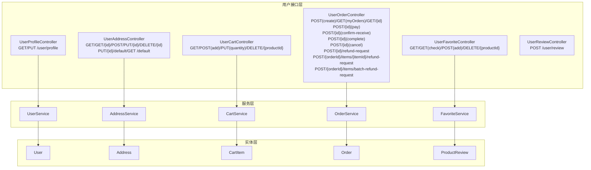
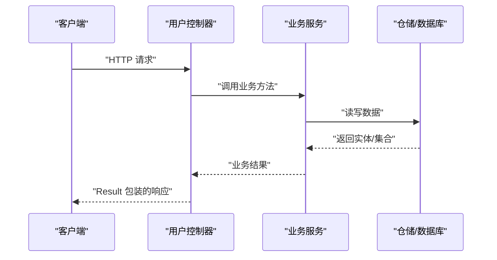
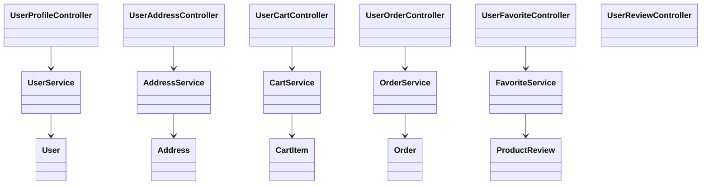

# 用户接口

<cite>
**本文引用的文件**
- [UserProfileController.java](file://backend/src/main/java/com/mall/controller/user/UserProfileController.java)
- [UserAddressController.java](file://backend/src/main/java/com/mall/controller/user/UserAddressController.java)
- [UserCartController.java](file://backend/src/main/java/com/mall/controller/user/UserCartController.java)
- [UserOrderController.java](file://backend/src/main/java/com/mall/controller/user/UserOrderController.java)
- [UserFavoriteController.java](file://backend/src/main/java/com/mall/controller/user/UserFavoriteController.java)
- [UserReviewController.java](file://backend/src/main/java/com/mall/controller/user/UserReviewController.java)
- [UserService.java](file://backend/src/main/java/com/mall/service/UserService.java)
- [AddressService.java](file://backend/src/main/java/com/mall/service/AddressService.java)
- [CartService.java](file://backend/src/main/java/com/mall/service/CartService.java)
- [OrderService.java](file://backend/src/main/java/com/mall/service/OrderService.java)
- [FavoriteService.java](file://backend/src/main/java/com/mall/service/FavoriteService.java)
- [User.java](file://backend/src/main/java/com/mall/entity/User.java)
- [Address.java](file://backend/src/main/java/com/mall/entity/Address.java)
- [CartItem.java](file://backend/src/main/java/com/mall/entity/CartItem.java)
- [Order.java](file://backend/src/main/java/com/mall/entity/Order.java)
- [ProductReview.java](file://backend/src/main/java/com/mall/entity/ProductReview.java)
</cite>

## 目录
1. [简介](#简介)
2. [项目结构](#项目结构)
3. [核心组件](#核心组件)
4. [架构总览](#架构总览)
5. [详细组件分析](#详细组件分析)
6. [依赖分析](#依赖分析)
7. [性能考虑](#性能考虑)
8. [故障排查指南](#故障排查指南)
9. [结论](#结论)
10. [附录](#附录)

## 简介
本文件为电商商城系统的“用户接口”API文档，覆盖以下功能域：
- 用户个人信息管理：查询与更新资料
- 收货地址管理：查询、新增、修改、删除、设置默认地址、查询默认地址
- 购物车管理：查询、添加商品、修改数量、删除商品
- 订单管理：从购物车创建订单、分页查询我的订单、订单详情、模拟支付、确认收货、完成订单、取消订单、退货/退款申请（含单项与批量）
- 收藏夹管理：收藏列表、检查收藏状态、新增收藏、取消收藏
- 评价系统：提交商品评价、避免重复评价

所有接口均基于Spring MVC控制器实现，使用统一响应包装Result，采用Spring Security进行鉴权，请求主体多为JSON对象。

## 项目结构
用户相关接口位于后端模块的user包控制器中，对应的服务层提供业务逻辑，实体模型定义了数据结构与字段约束。

图表来源
- [UserProfileController.java:12-40](file://backend/src/main/java/com/mall/controller/user/UserProfileController.java#L12-L40)
- [UserAddressController.java:13-72](file://backend/src/main/java/com/mall/controller/user/UserAddressController.java#L13-L72)
- [UserCartController.java:14-66](file://backend/src/main/java/com/mall/controller/user/UserCartController.java#L14-L66)
- [UserOrderController.java:19-197](file://backend/src/main/java/com/mall/controller/user/UserOrderController.java#L19-L197)
- [UserFavoriteController.java:14-59](file://backend/src/main/java/com/mall/controller/user/UserFavoriteController.java#L14-L59)
- [UserReviewController.java:17-72](file://backend/src/main/java/com/mall/controller/user/UserReviewController.java#L17-L72)
- [UserService.java:12-41](file://backend/src/main/java/com/mall/service/UserService.java#L12-L41)
- [AddressService.java:12-90](file://backend/src/main/java/com/mall/service/AddressService.java#L12-L90)
- [CartService.java:14-61](file://backend/src/main/java/com/mall/service/CartService.java#L14-L61)
- [OrderService.java:23-279](file://backend/src/main/java/com/mall/service/OrderService.java#L23-L279)
- [FavoriteService.java:14-42](file://backend/src/main/java/com/mall/service/FavoriteService.java#L14-L42)
- [User.java:10-87](file://backend/src/main/java/com/mall/entity/User.java#L10-L87)
- [Address.java:7-59](file://backend/src/main/java/com/mall/entity/Address.java#L7-L59)
- [CartItem.java:8-49](file://backend/src/main/java/com/mall/entity/CartItem.java#L8-L49)
- [Order.java:9-82](file://backend/src/main/java/com/mall/entity/Order.java#L9-L82)
- [ProductReview.java:8-43](file://backend/src/main/java/com/mall/entity/ProductReview.java#L8-L43)

章节来源
- [UserProfileController.java:12-40](file://backend/src/main/java/com/mall/controller/user/UserProfileController.java#L12-L40)
- [UserAddressController.java:13-72](file://backend/src/main/java/com/mall/controller/user/UserAddressController.java#L13-L72)
- [UserCartController.java:14-66](file://backend/src/main/java/com/mall/controller/user/UserCartController.java#L14-L66)
- [UserOrderController.java:19-197](file://backend/src/main/java/com/mall/controller/user/UserOrderController.java#L19-L197)
- [UserFavoriteController.java:14-59](file://backend/src/main/java/com/mall/controller/user/UserFavoriteController.java#L14-L59)
- [UserReviewController.java:17-72](file://backend/src/main/java/com/mall/controller/user/UserReviewController.java#L17-L72)

## 核心组件
- 控制器层：各功能域的REST控制器，负责接收请求、解析参数、调用服务层并返回Result封装的响应。
- 服务层：实现业务规则与事务控制，如订单创建时的库存扣减、默认地址互斥、退款状态同步等。
- 实体层：映射数据库表结构，包含字段长度、精度、枚举值等约束。

章节来源
- [UserService.java:12-41](file://backend/src/main/java/com/mall/service/UserService.java#L12-L41)
- [AddressService.java:12-90](file://backend/src/main/java/com/mall/service/AddressService.java#L12-L90)
- [CartService.java:14-61](file://backend/src/main/java/com/mall/service/CartService.java#L14-L61)
- [OrderService.java:23-279](file://backend/src/main/java/com/mall/service/OrderService.java#L23-L279)
- [FavoriteService.java:14-42](file://backend/src/main/java/com/mall/service/FavoriteService.java#L14-L42)
- [User.java:10-87](file://backend/src/main/java/com/mall/entity/User.java#L10-L87)
- [Address.java:7-59](file://backend/src/main/java/com/mall/entity/Address.java#L7-L59)
- [CartItem.java:8-49](file://backend/src/main/java/com/mall/entity/CartItem.java#L8-L49)
- [Order.java:9-82](file://backend/src/main/java/com/mall/entity/Order.java#L9-L82)
- [ProductReview.java:8-43](file://backend/src/main/java/com/mall/entity/ProductReview.java#L8-L43)

## 架构总览
用户接口遵循“控制器-服务-仓储”的分层架构，统一通过Result包装响应，异常通过全局异常处理器转换为标准错误响应。鉴权使用Spring Security，控制器参数通过@AuthenticationPrincipal或Authentication获取当前用户ID。

图表来源
- [UserProfileController.java:20-39](file://backend/src/main/java/com/mall/controller/user/UserProfileController.java#L20-L39)
- [UserAddressController.java:19-71](file://backend/src/main/java/com/mall/controller/user/UserAddressController.java#L19-L71)
- [UserCartController.java:27-65](file://backend/src/main/java/com/mall/controller/user/UserCartController.java#L27-L65)
- [UserOrderController.java:33-196](file://backend/src/main/java/com/mall/controller/user/UserOrderController.java#L33-L196)
- [UserFavoriteController.java:27-58](file://backend/src/main/java/com/mall/controller/user/UserFavoriteController.java#L27-L58)
- [UserReviewController.java:31-71](file://backend/src/main/java/com/mall/controller/user/UserReviewController.java#L31-L71)

## 详细组件分析

### 用户个人信息管理
- 接口一：获取当前登录用户资料
  - 方法与路径：GET /user/profile
  - 权限：需要认证
  - 请求参数：无
  - 响应：Result<User>
  - 失败：用户不存在时返回失败
- 接口二：更新当前登录用户资料
  - 方法与路径：PUT /user/profile
  - 权限：需要认证
  - 请求体：Map<String, Object>，可包含字段如昵称、头像、性别、邮箱、电话、收货人姓名、手机、地址等
  - 响应：Result<User>
  - 失败：异常消息封装为失败响应

章节来源
- [UserProfileController.java:20-39](file://backend/src/main/java/com/mall/controller/user/UserProfileController.java#L20-L39)
- [UserService.java:22-34](file://backend/src/main/java/com/mall/service/UserService.java#L22-L34)
- [User.java:17-87](file://backend/src/main/java/com/mall/entity/User.java#L17-L87)

### 收货地址管理
- 接口一：查询用户全部地址
  - 方法与路径：GET /user/address
  - 权限：需要认证
  - 响应：Result<List<Address>>
- 接口二：按ID查询地址
  - 方法与路径：GET /user/address/{id}
  - 权限：需要认证
  - 响应：Result<Address>，不存在返回失败
- 接口三：新增地址
  - 方法与路径：POST /user/address
  - 权限：需要认证
  - 请求体：Address 对象
  - 响应：Result<Address>
- 接口四：按ID修改地址
  - 方法与路径：PUT /user/address/{id}
  - 权限：需要认证
  - 请求体：Address 对象
  - 响应：Result<Address>，不存在返回失败
- 接口五：按ID删除地址
  - 方法与路径：DELETE /user/address/{id}
  - 权限：需要认证
  - 响应：Result<Void>
- 接口六：设置默认地址
  - 方法与路径：PUT /user/address/{id}/default
  - 权限：需要认证
  - 响应：Result<Address>，不存在返回失败
- 接口七：查询默认地址
  - 方法与路径：GET /user/address/default
  - 权限：需要认证
  - 响应：Result<Address>，未设置返回失败

章节来源
- [UserAddressController.java:19-71](file://backend/src/main/java/com/mall/controller/user/UserAddressController.java#L19-L71)
- [AddressService.java:17-89](file://backend/src/main/java/com/mall/service/AddressService.java#L17-L89)
- [Address.java:10-59](file://backend/src/main/java/com/mall/entity/Address.java#L10-L59)

### 购物车管理
- 接口一：查询当前用户购物车
  - 方法与路径：GET /user/cart
  - 权限：需要认证
  - 响应：Result<List<CartItem>>
- 接口二：添加商品到购物车
  - 方法与路径：POST /user/cart/add
  - 权限：需要认证
  - 请求体：Map，包含productId、quantity（可选，默认1）
  - 响应：Result<CartItem>
  - 失败：商品不存在或已下架、数量非法等
- 接口三：更新购物车商品数量
  - 方法与路径：PUT /user/cart/quantity
  - 权限：需要认证
  - 请求体：Map，包含productId、quantity
  - 响应：Result<Void>
  - 失败：数量非法或商品不存在
- 接口四：从购物车移除商品
  - 方法与路径：DELETE /user/cart/{productId}
  - 权限：需要认证
  - 响应：Result<Void>

章节来源
- [UserCartController.java:27-65](file://backend/src/main/java/com/mall/controller/user/UserCartController.java#L27-L65)
- [CartService.java:21-60](file://backend/src/main/java/com/mall/service/CartService.java#L21-L60)
- [CartItem.java:14-49](file://backend/src/main/java/com/mall/entity/CartItem.java#L14-L49)

### 订单管理
- 接口一：从购物车创建订单
  - 方法与路径：POST /user/order/create
  - 权限：需要认证
  - 请求体：Map，包含merchantId、receiverName、receiverPhone、receiverAddress
  - 响应：Result<{id, orderNo}>
  - 失败：购物车为空、商品缺货、库存不足等
- 接口二：分页查询我的订单（含订单项）
  - 方法与路径：GET /user/order?page=...&size=...
  - 权限：需要认证
  - 响应：Result 分页对象，每条记录包含订单基础信息与items列表
- 接口三：查询订单详情（含订单项）
  - 方法与路径：GET /user/order/{id}
  - 权限：需要认证
  - 响应：Result<{order, items}>
  - 失败：订单不存在或不属于当前用户
- 接口四：模拟支付
  - 方法与路径：POST /user/order/{id}/pay
  - 权限：需要认证
  - 请求体：Map，可包含paymentMethod（默认WECHAT）
  - 响应：Result<Void>
- 接口五：用户确认收货
  - 方法与路径：POST /user/order/{id}/confirm-receive
  - 权限：需要认证
  - 响应：Result<Void>
  - 失败：订单不存在或不属于当前用户
- 接口六：完成订单（评价后）
  - 方法与路径：POST /user/order/{id}/complete
  - 权限：需要认证
  - 响应：Result<Void>
  - 失败：订单不存在或不属于当前用户
- 接口七：收货前取消订单（回补库存）
  - 方法与路径：POST /user/order/{id}/cancel
  - 权限：需要认证
  - 响应：Result<Void>
  - 失败：订单状态不允许取消
- 接口八：整单退货/退款申请（简化）
  - 方法与路径：POST /user/order/{id}/refund-request
  - 权限：需要认证
  - 请求体：Map，可包含reason
  - 响应：Result<Void>
  - 失败：订单状态不允许退款
- 接口九：针对单个订单项申请退款
  - 方法与路径：POST /user/order/{orderId}/items/{itemId}/refund-request
  - 权限：需要认证
  - 请求体：Map，可包含reason
  - 响应：Result<Void>
  - 失败：订单状态或状态不允许退款、已申请等
- 接口十：批量申请多个订单项退款
  - 方法与路径：POST /user/order/{orderId}/items/batch-refund-request
  - 权限：需要认证
  - 请求体：Map，包含reason、itemIds、itemQuantities（可选）
  - 响应：Result<Void>
  - 失败：参数不合法、数量不匹配等

章节来源
- [UserOrderController.java:33-196](file://backend/src/main/java/com/mall/controller/user/UserOrderController.java#L33-L196)
- [OrderService.java:33-279](file://backend/src/main/java/com/mall/service/OrderService.java#L33-L279)
- [Order.java:16-82](file://backend/src/main/java/com/mall/entity/Order.java#L16-L82)

### 收藏夹管理
- 接口一：查询收藏商品列表
  - 方法与路径：GET /user/favorite
  - 权限：需要认证
  - 响应：Result<List<Product>>
- 接口二：检查商品是否已收藏
  - 方法与路径：GET /user/favorite/check?productId=...
  - 权限：需要认证
  - 响应：Result<{favorite: boolean}>
- 接口三：新增收藏
  - 方法与路径：POST /user/favorite/add
  - 权限：需要认证
  - 请求体：Map，包含productId
  - 响应：Result<Void>
  - 失败：商品不存在
- 接口四：取消收藏
  - 方法与路径：DELETE /user/favorite/{productId}
  - 权限：需要认证
  - 响应：Result<Void>

章节来源
- [UserFavoriteController.java:27-58](file://backend/src/main/java/com/mall/controller/user/UserFavoriteController.java#L27-L58)
- [FavoriteService.java:21-41](file://backend/src/main/java/com/mall/service/FavoriteService.java#L21-L41)

### 评价系统
- 接口：新增商品评价
  - 方法与路径：POST /user/review
  - 权限：需要认证
  - 请求体：Map，包含productId、orderId（可选）、rating（可选，默认5）、content（可选）
  - 行为：若同一用户对同一商品（可选关联订单）已评价则拒绝重复评价；保存评价并标记对应订单项为已评价（若提供orderId）
  - 响应：Result<ProductReview>
  - 失败：已评价、参数不合法等

章节来源
- [UserReviewController.java:31-71](file://backend/src/main/java/com/mall/controller/user/UserReviewController.java#L31-L71)
- [ProductReview.java:15-43](file://backend/src/main/java/com/mall/entity/ProductReview.java#L15-L43)

## 依赖分析
- 控制器依赖服务：各控制器通过构造注入方式依赖对应服务，职责清晰。
- 服务依赖仓储：服务层通过仓储访问数据库，保证业务规则在服务层实现。
- 实体依赖JPA注解：实体类使用JPA注解定义主键、唯一约束、外键、时间戳等。
- 统一响应：Result作为统一响应载体，控制器返回Result，便于前后端约定。

图表来源
- [UserProfileController.java:12-40](file://backend/src/main/java/com/mall/controller/user/UserProfileController.java#L12-L40)
- [UserAddressController.java:13-72](file://backend/src/main/java/com/mall/controller/user/UserAddressController.java#L13-L72)
- [UserCartController.java:14-66](file://backend/src/main/java/com/mall/controller/user/UserCartController.java#L14-L66)
- [UserOrderController.java:19-197](file://backend/src/main/java/com/mall/controller/user/UserOrderController.java#L19-L197)
- [UserFavoriteController.java:14-59](file://backend/src/main/java/com/mall/controller/user/UserFavoriteController.java#L14-L59)
- [UserReviewController.java:17-72](file://backend/src/main/java/com/mall/controller/user/UserReviewController.java#L17-L72)
- [UserService.java:12-41](file://backend/src/main/java/com/mall/service/UserService.java#L12-L41)
- [AddressService.java:12-90](file://backend/src/main/java/com/mall/service/AddressService.java#L12-L90)
- [CartService.java:14-61](file://backend/src/main/java/com/mall/service/CartService.java#L14-L61)
- [OrderService.java:23-279](file://backend/src/main/java/com/mall/service/OrderService.java#L23-L279)
- [FavoriteService.java:14-42](file://backend/src/main/java/com/mall/service/FavoriteService.java#L14-L42)
- [User.java:17-87](file://backend/src/main/java/com/mall/entity/User.java#L17-L87)
- [Address.java:10-59](file://backend/src/main/java/com/mall/entity/Address.java#L10-L59)
- [CartItem.java:14-49](file://backend/src/main/java/com/mall/entity/CartItem.java#L14-L49)
- [Order.java:16-82](file://backend/src/main/java/com/mall/entity/Order.java#L16-L82)
- [ProductReview.java:15-43](file://backend/src/main/java/com/mall/entity/ProductReview.java#L15-L43)

## 性能考虑
- 分页查询：订单列表与收藏列表使用分页参数，建议前端传入合理page与size以控制单次数据量。
- 批量退款：批量申请退款接口支持一次提交多个订单项，减少多次请求开销。
- 默认地址互斥：设置默认地址时自动取消其他默认标记，避免冗余查询。
- 事务边界：订单创建、库存扣减、购物车清理、退款状态同步等关键操作均在事务内执行，确保一致性。

## 故障排查指南
- 用户资料更新失败
  - 检查请求体字段是否合法，服务层会根据存在性更新字段。
  - 参考：[UserService.updateProfile:22-34](file://backend/src/main/java/com/mall/service/UserService.java#L22-L34)
- 地址操作失败
  - 确认地址ID归属当前用户；设置默认地址时会自动取消其他默认标记。
  - 参考：[AddressService:27-89](file://backend/src/main/java/com/mall/service/AddressService.java#L27-L89)
- 购物车添加失败
  - 商品必须在售；若商品已存在则合并数量；否则新建记录。
  - 参考：[CartService.add:25-43](file://backend/src/main/java/com/mall/service/CartService.java#L25-L43)
- 订单创建失败
  - 购物车需包含指定商户商品且库存充足；创建后会扣减库存并清空对应购物车项。
  - 参考：[OrderService.createFromCart:33-88](file://backend/src/main/java/com/mall/service/OrderService.java#L33-L88)
- 退款申请失败
  - 仅允许“已收货”或“已申请退款”状态的订单发起退款；单项/批量退款数量需合法。
  - 参考：[OrderService.requestRefund/requestItemRefund/requestItemsRefund:147-240](file://backend/src/main/java/com/mall/service/OrderService.java#L147-L240)
- 重复评价
  - 同一用户对同一商品（可选关联订单）不可重复评价。
  - 参考：[UserReviewController.add:31-71](file://backend/src/main/java/com/mall/controller/user/UserReviewController.java#L31-L71)

## 结论
本文档梳理了电商商城系统的用户接口，明确了各接口的HTTP方法、路径、请求参数、响应格式与权限要求，并结合服务层与实体层的实现细节给出错误处理与最佳实践建议。建议前端在调用时严格遵循请求体结构与分页参数，后端通过Result统一响应，便于联调与维护。

## 附录
- 统一响应结构
  - 成功：Result.ok(data)
  - 失败：Result.fail(message)
- 订单状态说明
  - PENDING：待支付
  - PAID：已支付
  - SHIPPED：已发货
  - RECEIVED：已收货
  - CANCELLED：已取消
  - REFUND_REQUESTED：已申请退货/退款
  - REFUNDED：已退款
- 退款状态同步
  - 当所有订单项均处于“已申请退款”或“已退款”，订单整体标记为“已申请退货/退款”或“已退款”。