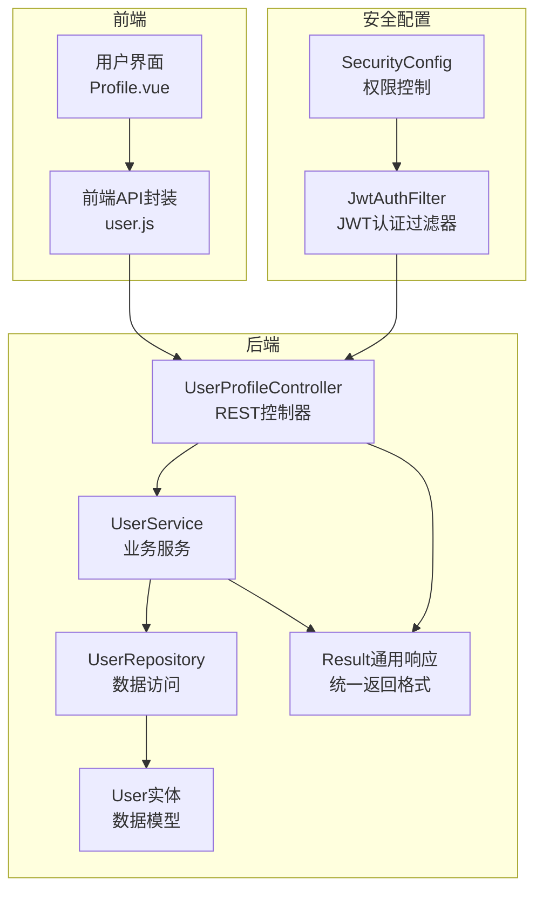
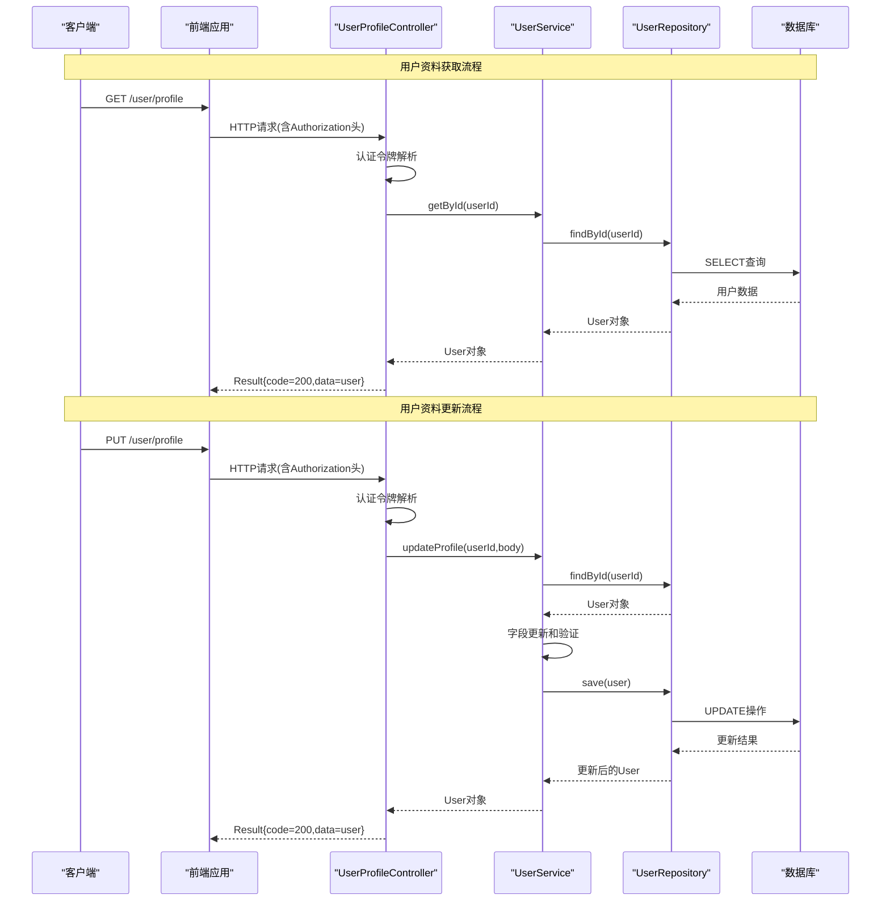
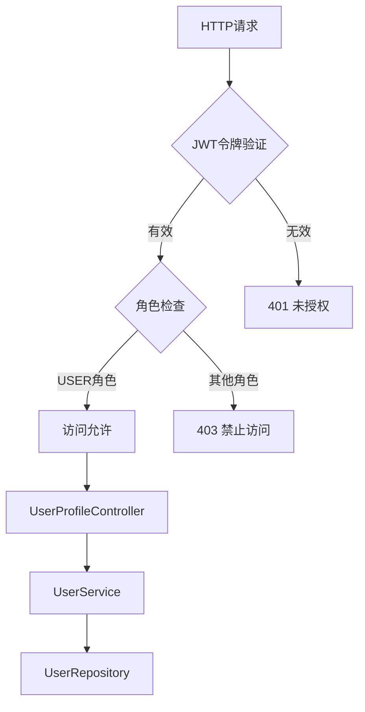
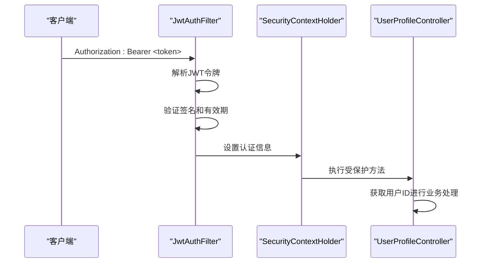
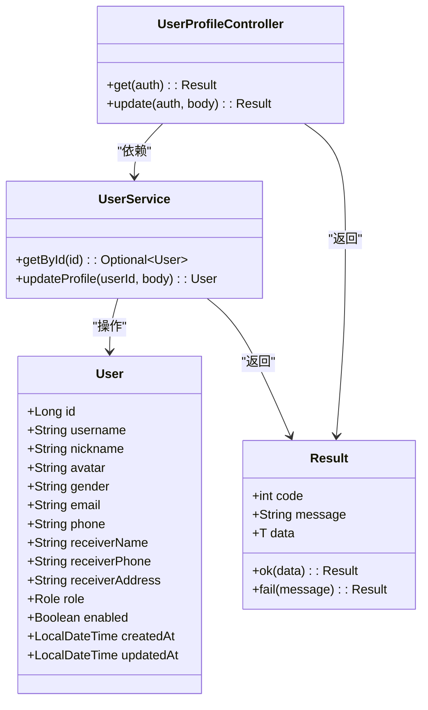

# 用户资料接口

<cite>
**本文档引用的文件**
- [UserProfileController.java](file://backend/src/main/java/com/mall/controller/user/UserProfileController.java)
- [UserService.java](file://backend/src/main/java/com/mall/service/UserService.java)
- [User.java](file://backend/src/main/java/com/mall/entity/User.java)
- [Result.java](file://backend/src/main/java/com/mall/dto/Result.java)
- [SecurityConfig.java](file://backend/src/main/java/com/mall/config/SecurityConfig.java)
- [JwtAuthFilter.java](file://backend/src/main/java/com/mall/security/JwtAuthFilter.java)
- [application.yml](file://backend/src/main/resources/application.yml)
- [Role.java](file://backend/src/main/java/com/mall/common/Role.java)
- [user.js](file://frontend/src/api/user.js)
- [Profile.vue](file://frontend/src/views/user/Profile.vue)
</cite>

## 目录
1. [简介](#简介)
2. [项目结构](#项目结构)
3. [核心组件](#核心组件)
4. [架构概览](#架构概览)
5. [详细组件分析](#详细组件分析)
6. [依赖分析](#依赖分析)
7. [性能考虑](#性能考虑)
8. [故障排除指南](#故障排除指南)
9. [结论](#结论)

## 简介
本文档详细说明了用户资料管理接口，包括获取当前登录用户信息（GET /user/profile）和更新用户资料（PUT /user/profile）两个核心接口。内容涵盖请求参数、响应格式、权限要求、错误处理、数据验证规则以及安全注意事项，并提供了完整的前后端集成示例。

## 项目结构
用户资料接口位于后端Spring Boot应用的用户模块中，采用标准的分层架构：
- 控制器层：处理HTTP请求和响应
- 服务层：业务逻辑处理
- 数据访问层：JPA Repository操作数据库
- 实体层：用户数据模型定义



**图表来源**
- [UserProfileController.java:12-40](file://backend/src/main/java/com/mall/controller/user/UserProfileController.java#L12-L40)
- [UserService.java:12-41](file://backend/src/main/java/com/mall/service/UserService.java#L12-L41)
- [SecurityConfig.java:25-55](file://backend/src/main/java/com/mall/config/SecurityConfig.java#L25-L55)

**章节来源**
- [UserProfileController.java:1-41](file://backend/src/main/java/com/mall/controller/user/UserProfileController.java#L1-L41)
- [UserService.java:1-42](file://backend/src/main/java/com/mall/service/UserService.java#L1-L42)
- [User.java:10-87](file://backend/src/main/java/com/mall/entity/User.java#L10-L87)

## 核心组件
用户资料接口由以下核心组件构成：

### 用户实体模型
用户实体包含完整的个人信息字段，支持基本资料和收货信息管理。

### 控制器层
- UserProfileController：提供用户资料的查询和更新功能
- 基于Spring Security的认证机制
- 统一的Result响应格式

### 服务层
- UserService：实现用户资料的业务逻辑
- 支持部分字段更新
- 数据验证和转换

**章节来源**
- [User.java:17-87](file://backend/src/main/java/com/mall/entity/User.java#L17-L87)
- [UserProfileController.java:15-40](file://backend/src/main/java/com/mall/controller/user/UserProfileController.java#L15-L40)
- [UserService.java:14-41](file://backend/src/main/java/com/mall/service/UserService.java#L14-L41)

## 架构概览
用户资料接口采用RESTful设计模式，结合JWT认证和基于角色的权限控制。



**图表来源**
- [UserProfileController.java:21-39](file://backend/src/main/java/com/mall/controller/user/UserProfileController.java#L21-L39)
- [UserService.java:18-34](file://backend/src/main/java/com/mall/service/UserService.java#L18-L34)
- [SecurityConfig.java:48-51](file://backend/src/main/java/com/mall/config/SecurityConfig.java#L48-L51)

## 详细组件分析

### 接口定义

#### 获取用户资料接口
- **URL**: `GET /user/profile`
- **功能**: 获取当前登录用户的完整资料信息
- **认证要求**: 需要有效的JWT令牌
- **权限要求**: 角色必须为USER

#### 更新用户资料接口
- **URL**: `PUT /user/profile`
- **功能**: 更新当前登录用户的部分或全部资料
- **认证要求**: 需要有效的JWT令牌
- **权限要求**: 角色必须为USER
- **请求方式**: PATCH风格的部分更新

### 请求参数规范

#### 查询参数
该接口无需查询参数。

#### 请求体参数
支持以下可选字段的部分更新：

| 字段名 | 类型 | 长度限制 | 必填 | 描述 |
|--------|------|----------|------|------|
| nickname | String | 32字符 | 否 | 昵称 |
| avatar | String | 255字符 | 否 | 头像URL |
| gender | String | 10字符 | 否 | 性别(MALE/FEMALE/OTHER) |
| email | String | 64字符 | 否 | 邮箱地址 |
| phone | String | 20字符 | 否 | 手机号码 |
| receiverName | String | 32字符 | 否 | 收货人姓名 |
| receiverPhone | String | 20字符 | 否 | 收货人电话 |
| receiverAddress | String | 255字符 | 否 | 收货地址 |

### 响应格式

#### 成功响应
```json
{
  "code": 200,
  "message": "success",
  "data": {
    "id": 1,
    "username": "john_doe",
    "nickname": "John",
    "avatar": "https://example.com/avatar.jpg",
    "gender": "MALE",
    "email": "john@example.com",
    "phone": "13800001111",
    "receiverName": "张三",
    "receiverPhone": "13800002222",
    "receiverAddress": "北京市朝阳区xxx街道xxx号",
    "role": "USER",
    "enabled": true,
    "createdAt": "2024-01-01T00:00:00",
    "updatedAt": "2024-01-02T10:30:00"
  }
}
```

#### 错误响应
```json
{
  "code": 400,
  "message": "用户不存在",
  "data": null
}
```

### 权限控制机制

系统采用基于角色的访问控制(RBAC)，用户资料接口需要特定的角色权限：



**图表来源**
- [SecurityConfig.java:48-51](file://backend/src/main/java/com/mall/config/SecurityConfig.java#L48-L51)
- [Role.java:3-7](file://backend/src/main/java/com/mall/common/Role.java#L3-L7)

### 数据验证规则

#### 后端验证
- 所有字符串字段自动去除首尾空白
- 空字符串转换为null值
- 字段长度严格遵循实体定义的约束

#### 前端验证
- 昵称：2-32字符，必填
- 手机号：11位数字，格式验证
- 邮箱：标准邮箱格式验证
- 收货人信息：收货人姓名、电话、地址必填

### 安全注意事项

#### JWT认证流程


**图表来源**
- [JwtAuthFilter.java:30-47](file://backend/src/main/java/com/mall/security/JwtAuthFilter.java#L30-L47)
- [application.yml:27-30](file://backend/src/main/resources/application.yml#L27-L30)

#### 安全配置要点
- 使用无状态会话策略(STATELESS)
- CORS配置允许指定域名访问
- 密码使用BCrypt加密存储
- JWT令牌包含用户ID和角色信息

**章节来源**
- [UserProfileController.java:20-39](file://backend/src/main/java/com/mall/controller/user/UserProfileController.java#L20-L39)
- [UserService.java:22-34](file://backend/src/main/java/com/mall/service/UserService.java#L22-L34)
- [SecurityConfig.java:34-55](file://backend/src/main/java/com/mall/config/SecurityConfig.java#L34-L55)

## 依赖分析

### 组件依赖关系



**图表来源**
- [UserProfileController.java:18-39](file://backend/src/main/java/com/mall/controller/user/UserProfileController.java#L18-L39)
- [UserService.java:16-34](file://backend/src/main/java/com/mall/service/UserService.java#L16-L34)
- [User.java:17-87](file://backend/src/main/java/com/mall/entity/User.java#L17-L87)
- [Result.java:10-23](file://backend/src/main/java/com/mall/dto/Result.java#L10-L23)

### 外部依赖

#### 前端集成
- 使用Axios进行HTTP请求
- 自动携带Authorization头
- 统一的错误处理机制

#### 后端依赖
- Spring Security进行认证授权
- JWT进行无状态认证
- JPA进行数据持久化

**章节来源**
- [user.js:8-16](file://frontend/src/api/user.js#L8-L16)
- [Profile.vue:704-789](file://frontend/src/views/user/Profile.vue#L704-L789)

## 性能考虑

### 查询优化
- 使用懒加载避免不必要的关联查询
- 数据库层面的索引优化
- 缓存热点数据减少数据库压力

### 更新策略
- 支持部分字段更新，减少不必要的数据库写操作
- 批量更新场景下的事务管理
- 数据验证前置，避免无效的数据库操作

### 安全性能
- JWT令牌验证的性能开销最小化
- CORS预检请求的合理配置
- 密码哈希算法的性能平衡

## 故障排除指南

### 常见错误及解决方案

#### 401 未授权
**原因**: 缺少有效的JWT令牌或令牌已过期
**解决方案**: 
- 确保请求头包含正确的Authorization: Bearer <token>
- 检查令牌有效期和签名
- 重新登录获取新的访问令牌

#### 403 禁止访问
**原因**: 用户角色不是USER或权限不足
**解决方案**:
- 验证用户角色是否正确
- 检查SecurityConfig中的权限配置
- 确认用户具有相应的角色权限

#### 404 用户不存在
**原因**: 用户ID在数据库中找不到
**解决方案**:
- 验证用户ID的有效性
- 检查用户是否被禁用或删除
- 确认JWT令牌中的用户ID正确

#### 400 参数错误
**原因**: 请求参数格式或内容不符合要求
**解决方案**:
- 检查字段长度和格式约束
- 验证必填字段是否完整
- 确认数据类型匹配

### 调试建议

#### 后端调试
- 启用Spring Security日志查看认证过程
- 检查JWT令牌的claims内容
- 验证数据库连接和事务配置

#### 前端调试
- 在浏览器开发者工具中查看网络请求
- 检查Authorization头是否正确设置
- 验证响应数据的结构和内容

**章节来源**
- [SecurityConfig.java:34-55](file://backend/src/main/java/com/mall/config/SecurityConfig.java#L34-L55)
- [JwtAuthFilter.java:30-47](file://backend/src/main/java/com/mall/security/JwtAuthFilter.java#L30-L47)

## 结论
用户资料管理接口提供了完整的用户信息查询和更新功能，采用RESTful设计和JWT认证机制，确保了系统的安全性、可扩展性和易用性。通过合理的权限控制、数据验证和错误处理机制，为用户提供了良好的使用体验。建议在生产环境中进一步完善监控和日志记录，以提升系统的可观测性和维护性。