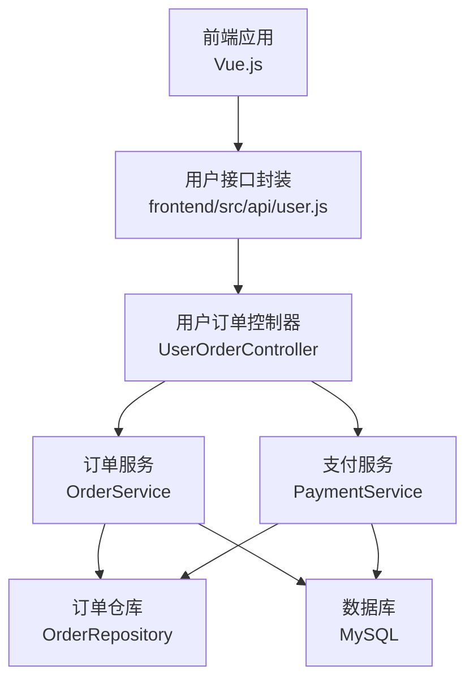
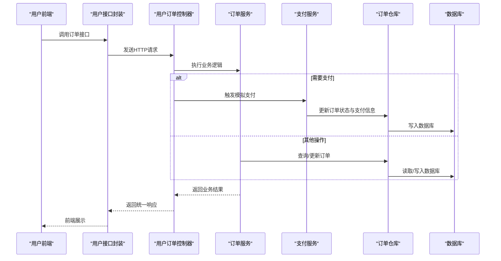
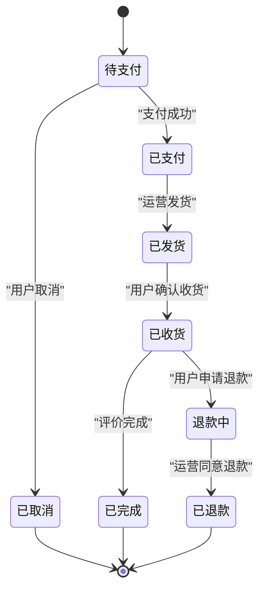
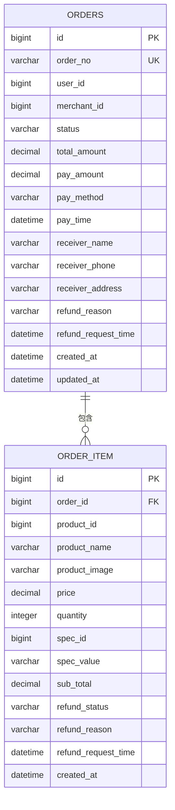
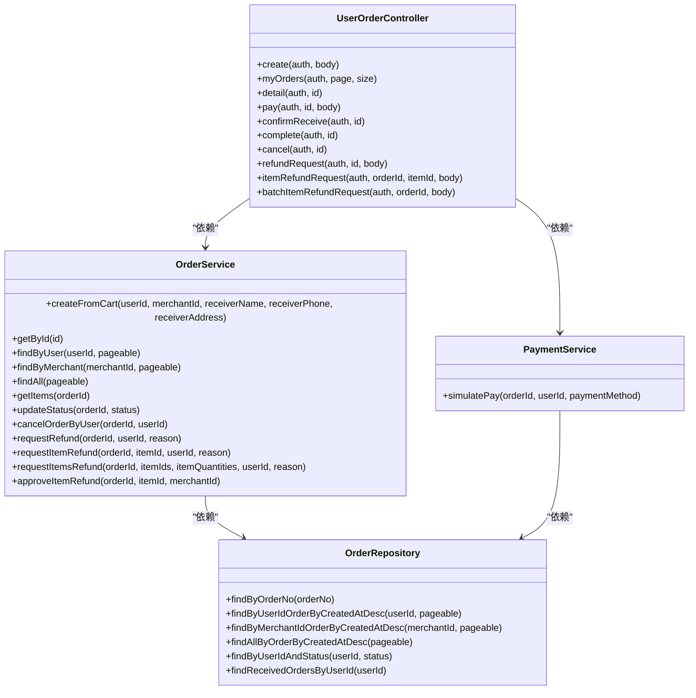

# 订单接口

<cite>
**本文档引用的文件**
- [UserOrderController.java](file://backend/src/main/java/com/mall/controller/user/UserOrderController.java)
- [OrderService.java](file://backend/src/main/java/com/mall/service/OrderService.java)
- [PaymentService.java](file://backend/src/main/java/com/mall/service/PaymentService.java)
- [Order.java](file://backend/src/main/java/com/mall/entity/Order.java)
- [OrderItem.java](file://backend/src/main/java/com/mall/entity/OrderItem.java)
- [OrderRepository.java](file://backend/src/main/java/com/mall/repository/OrderRepository.java)
- [Result.java](file://backend/src/main/java/com/mall/dto/Result.java)
- [application.yml](file://backend/src/main/resources/application.yml)
- [user.js](file://frontend/src/api/user.js)
- [MyOrders.vue](file://frontend/src/views/user/MyOrders.vue)
- [MyOrders_new.vue](file://frontend/src/views/user/MyOrders_new.vue)
</cite>

## 目录
1. [简介](#简介)
2. [项目结构](#项目结构)
3. [核心组件](#核心组件)
4. [架构总览](#架构总览)
5. [详细组件分析](#详细组件分析)
6. [依赖关系分析](#依赖关系分析)
7. [性能考虑](#性能考虑)
8. [故障排除指南](#故障排除指南)
9. [结论](#结论)
10. [附录](#附录)

## 简介
本文件为订单管理接口的完整API文档，覆盖用户侧订单生命周期管理，包括订单创建、支付、状态查询、订单列表、取消以及退款申请等核心功能。文档详细说明了订单状态流转、支付流程集成、订单数据结构与异常处理机制，帮助前后端开发者快速理解并正确调用接口。

## 项目结构
后端采用Spring Boot + JPA架构，订单模块位于用户控制器层，业务逻辑由服务层提供，数据持久化通过JPA仓库完成。前端通过统一的请求封装调用后端接口。

图表来源
- [UserOrderController.java:19-23](file://backend/src/main/java/com/mall/controller/user/UserOrderController.java#L19-L23)
- [OrderService.java:23-26](file://backend/src/main/java/com/mall/service/OrderService.java#L23-L26)
- [PaymentService.java:21-23](file://backend/src/main/java/com/mall/service/PaymentService.java#L21-L23)
- [OrderRepository.java:13-27](file://backend/src/main/java/com/mall/repository/OrderRepository.java#L13-L27)

章节来源
- [application.yml:1-36](file://backend/src/main/resources/application.yml#L1-L36)
- [user.js:1-162](file://frontend/src/api/user.js#L1-L162)

## 核心组件
- 控制器层：用户订单控制器提供REST接口，负责接收请求、鉴权与返回统一响应格式。
- 服务层：订单服务与支付服务封装业务逻辑，包含下单、状态更新、库存扣减、退款处理等。
- 数据模型：订单实体与订单项实体定义订单数据结构及字段约束。
- 仓储层：JPA仓库提供订单查询与分页能力。
- 统一响应：Result类提供统一的响应结构，便于前端处理。

章节来源
- [UserOrderController.java:23-26](file://backend/src/main/java/com/mall/controller/user/UserOrderController.java#L23-L26)
- [OrderService.java:23-26](file://backend/src/main/java/com/mall/service/OrderService.java#L23-L26)
- [PaymentService.java:21-23](file://backend/src/main/java/com/mall/service/PaymentService.java#L21-L23)
- [Result.java:10-23](file://backend/src/main/java/com/mall/dto/Result.java#L10-L23)

## 架构总览
用户通过前端调用后端接口，控制器层进行鉴权与参数校验，随后委托服务层执行业务逻辑，服务层通过仓库访问数据库，最终返回统一响应给前端。

图表来源
- [UserOrderController.java:34-144](file://backend/src/main/java/com/mall/controller/user/UserOrderController.java#L34-L144)
- [OrderService.java:34-88](file://backend/src/main/java/com/mall/service/OrderService.java#L34-L88)
- [PaymentService.java:30-65](file://backend/src/main/java/com/mall/service/PaymentService.java#L30-L65)
- [OrderRepository.java:13-27](file://backend/src/main/java/com/mall/repository/OrderRepository.java#L13-L27)

## 详细组件分析

### 订单状态与流转
订单状态包括：PENDING（待支付）、PAID（已支付）、SHIPPED（已发货）、RECEIVED（已收货）、CANCELLED（已取消）、REFUND_REQUESTED（退款中）、REFUNDED（已退款）。状态流转遵循严格的业务规则，确保数据一致性与业务合规性。

图表来源
- [Order.java:31-33](file://backend/src/main/java/com/mall/entity/Order.java#L31-L33)
- [OrderItem.java:50-52](file://backend/src/main/java/com/mall/entity/OrderItem.java#L50-L52)
- [OrderService.java:123-145](file://backend/src/main/java/com/mall/service/OrderService.java#L123-L145)
- [OrderService.java:147-161](file://backend/src/main/java/com/mall/service/OrderService.java#L147-L161)
- [OrderService.java:254-278](file://backend/src/main/java/com/mall/service/OrderService.java#L254-L278)

章节来源
- [Order.java:31-33](file://backend/src/main/java/com/mall/entity/Order.java#L31-L33)
- [OrderItem.java:50-52](file://backend/src/main/java/com/mall/entity/OrderItem.java#L50-L52)
- [OrderService.java:115-121](file://backend/src/main/java/com/mall/service/OrderService.java#L115-L121)

### 订单数据模型
订单与订单项的数据结构定义了字段类型、长度、精度与约束，确保数据完整性与一致性。

图表来源
- [Order.java:18-81](file://backend/src/main/java/com/mall/entity/Order.java#L18-L81)
- [OrderItem.java:18-71](file://backend/src/main/java/com/mall/entity/OrderItem.java#L18-L71)

章节来源
- [Order.java:18-81](file://backend/src/main/java/com/mall/entity/Order.java#L18-L81)
- [OrderItem.java:18-71](file://backend/src/main/java/com/mall/entity/OrderItem.java#L18-L71)

### 接口定义与示例

#### 订单创建（POST /user/order/create）
- 功能：从购物车创建订单，按运营维度聚合商品，校验库存并扣减库存。
- 请求体字段：
  - merchantId：运营ID（必填）
  - receiverName：收货人姓名（必填）
  - receiverPhone：收货人电话（必填）
  - receiverAddress：收货地址（必填）
- 成功响应：返回订单ID与订单号。
- 异常：购物车为空或库存不足时抛出异常。

章节来源
- [UserOrderController.java:34-50](file://backend/src/main/java/com/mall/controller/user/UserOrderController.java#L34-L50)
- [OrderService.java:34-88](file://backend/src/main/java/com/mall/service/OrderService.java#L34-L88)

#### 订单支付（POST /user/order/{id}/pay）
- 功能：模拟支付，将订单状态从“待支付”更新为“已支付”，记录支付方式与时间。
- 请求路径参数：id（订单ID）
- 请求体字段：paymentMethod（可选，默认微信）
- 成功响应：空数据。
- 异常：订单不存在、非本人订单、状态不是“待支付”。

章节来源
- [UserOrderController.java:103-111](file://backend/src/main/java/com/mall/controller/user/UserOrderController.java#L103-L111)
- [PaymentService.java:30-65](file://backend/src/main/java/com/mall/service/PaymentService.java#L30-L65)

#### 订单状态查询（GET /user/order/{id}）
- 功能：查询订单详情，包含订单基本信息与订单项列表。
- 请求路径参数：id（订单ID）
- 成功响应：包含订单与订单项的组合对象。
- 异常：订单不存在或非本人订单。

章节来源
- [UserOrderController.java:88-100](file://backend/src/main/java/com/mall/controller/user/UserOrderController.java#L88-L100)
- [OrderService.java:90-98](file://backend/src/main/java/com/mall/service/OrderService.java#L90-L98)

#### 用户订单列表（GET /user/order）
- 功能：分页查询当前用户的订单，包含每个订单的商品项。
- 请求参数：page（页码，默认0）、size（每页条数，默认10）
- 成功响应：分页结果，包含订单与订单项列表。
- 异常：无。

章节来源
- [UserOrderController.java:52-86](file://backend/src/main/java/com/mall/controller/user/UserOrderController.java#L52-L86)
- [OrderService.java:95-98](file://backend/src/main/java/com/mall/service/OrderService.java#L95-L98)

#### 订单取消（POST /user/order/{id}/cancel）
- 功能：在收货前取消订单，回补库存并更新状态为“已取消”。
- 请求路径参数：id（订单ID）
- 成功响应：空数据。
- 异常：订单不存在、非本人订单、当前状态不可取消。

章节来源
- [UserOrderController.java:135-144](file://backend/src/main/java/com/mall/controller/user/UserOrderController.java#L135-L144)
- [OrderService.java:123-145](file://backend/src/main/java/com/mall/service/OrderService.java#L123-L145)

#### 确认收货（POST /user/order/{id}/confirm-receive）
- 功能：用户确认收货，将订单状态更新为“已收货”。
- 请求路径参数：id（订单ID）
- 成功响应：空数据。
- 异常：订单不存在或非本人订单。

章节来源
- [UserOrderController.java:113-122](file://backend/src/main/java/com/mall/controller/user/UserOrderController.java#L113-L122)
- [OrderService.java:115-121](file://backend/src/main/java/com/mall/service/OrderService.java#L115-L121)

#### 完成订单（POST /user/order/{id}/complete）
- 功能：评价完成后完成订单，将订单状态更新为“已完成”。
- 请求路径参数：id（订单ID）
- 成功响应：空数据。
- 异常：订单不存在或非本人订单。

章节来源
- [UserOrderController.java:124-133](file://backend/src/main/java/com/mall/controller/user/UserOrderController.java#L124-L133)
- [OrderService.java:115-121](file://backend/src/main/java/com/mall/service/OrderService.java#L115-L121)

#### 申请退货/退款（POST /user/order/{id}/refund-request）
- 功能：针对整单申请退款，仅允许“已收货”状态的订单发起。
- 请求路径参数：id（订单ID）
- 请求体字段：reason（退款原因，可选）
- 成功响应：空数据。
- 异常：订单不存在、非本人订单、当前状态不可退款。

章节来源
- [UserOrderController.java:146-152](file://backend/src/main/java/com/mall/controller/user/UserOrderController.java#L146-L152)
- [OrderService.java:147-161](file://backend/src/main/java/com/mall/service/OrderService.java#L147-L161)

#### 针对单个订单项申请退款（POST /user/order/{orderId}/items/{itemId}/refund-request）
- 功能：针对单个订单项申请退款，支持部分数量退款与拆分订单项。
- 请求路径参数：orderId（订单ID）、itemId（订单项ID）
- 请求体字段：reason（退款原因，可选）
- 成功响应：空数据。
- 异常：订单不存在、非本人订单、当前状态不可退款、数量不合法。

章节来源
- [UserOrderController.java:154-168](file://backend/src/main/java/com/mall/controller/user/UserOrderController.java#L154-L168)
- [OrderService.java:166-185](file://backend/src/main/java/com/mall/service/OrderService.java#L166-L185)

#### 批量申请多个订单项退款（POST /user/order/{orderId}/items/batch-refund-request）
- 功能：批量选择多个订单项进行退款申请，支持部分数量退款与拆分。
- 请求路径参数：orderId（订单ID）
- 请求体字段：reason（退款原因，可选）、itemIds（订单项ID列表）、itemQuantities（订单项ID到数量的映射）
- 成功响应：空数据。
- 异常：订单不存在、非本人订单、当前状态不可退款、数量不合法。

章节来源
- [UserOrderController.java:170-196](file://backend/src/main/java/com/mall/controller/user/UserOrderController.java#L170-L196)
- [OrderService.java:189-240](file://backend/src/main/java/com/mall/service/OrderService.java#L189-L240)

### 前端对接要点
- 前端通过统一的请求封装调用后端接口，接口路径与参数与后端控制器保持一致。
- 前端页面根据订单状态动态显示操作按钮（去支付、取消订单、确认收货、申请退货等）。

章节来源
- [user.js:58-112](file://frontend/src/api/user.js#L58-L112)
- [MyOrders.vue:136-180](file://frontend/src/views/user/MyOrders.vue#L136-L180)
- [MyOrders_new.vue:136-180](file://frontend/src/views/user/MyOrders_new.vue#L136-L180)

## 依赖关系分析
- 控制器依赖服务层，服务层依赖仓库层，仓库层依赖数据库。
- 支付服务与订单服务协作，共同维护订单状态与支付记录。
- 前端通过接口封装与控制器交互，控制器与服务层解耦，便于扩展与测试。

图表来源
- [UserOrderController.java:23-26](file://backend/src/main/java/com/mall/controller/user/UserOrderController.java#L23-L26)
- [OrderService.java:23-32](file://backend/src/main/java/com/mall/service/OrderService.java#L23-L32)
- [PaymentService.java:21-28](file://backend/src/main/java/com/mall/service/PaymentService.java#L21-L28)
- [OrderRepository.java:13-27](file://backend/src/main/java/com/mall/repository/OrderRepository.java#L13-L27)

## 性能考虑
- 分页查询：使用Pageable进行分页，避免一次性加载大量订单数据。
- 批量操作：批量退款时按需拆分订单项，减少不必要的数据库写入。
- 事务边界：关键业务（下单、支付、退款）使用@Transactional保证原子性。
- 缓存策略：可结合Redis缓存热点订单数据，降低数据库压力（建议）。

## 故障排除指南
- 订单不存在或非本人订单：检查用户鉴权与订单归属。
- 当前状态不可操作：确认订单状态是否符合业务要求（如仅“已收货”可申请退款）。
- 库存不足：下单前应校验库存，避免重复下单导致超卖。
- 支付失败：检查支付方式与订单状态，确保订单处于“待支付”。

章节来源
- [UserOrderController.java:92-94](file://backend/src/main/java/com/mall/controller/user/UserOrderController.java#L92-L94)
- [OrderService.java:127-133](file://backend/src/main/java/com/mall/service/OrderService.java#L127-L133)
- [OrderService.java:153-154](file://backend/src/main/java/com/mall/service/OrderService.java#L153-L154)
- [PaymentService.java:32-36](file://backend/src/main/java/com/mall/service/PaymentService.java#L32-L36)

## 结论
本订单接口体系围绕用户订单生命周期设计，提供了完整的下单、支付、状态查询、取消与退款能力。通过清晰的状态机与严格的业务校验，确保订单数据的一致性与安全性。前后端通过统一的接口与响应格式协同工作，便于扩展与维护。

## 附录
- 统一响应结构：包含code、message与data字段，便于前端统一处理。
- 前端操作映射：根据订单状态动态显示操作按钮，提升用户体验。

章节来源
- [Result.java:10-23](file://backend/src/main/java/com/mall/dto/Result.java#L10-L23)
- [MyOrders.vue:136-180](file://frontend/src/views/user/MyOrders.vue#L136-L180)
- [MyOrders_new.vue:136-180](file://frontend/src/views/user/MyOrders_new.vue#L136-L180)