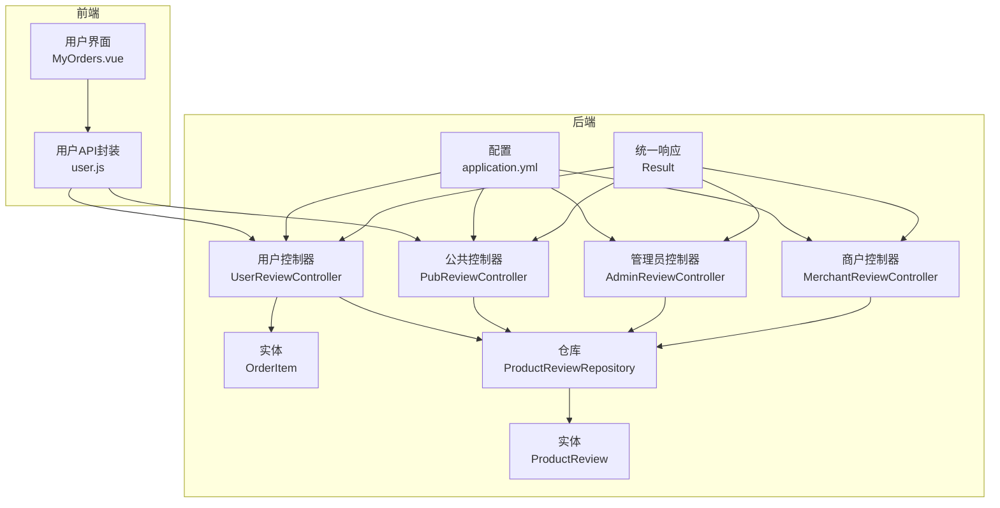
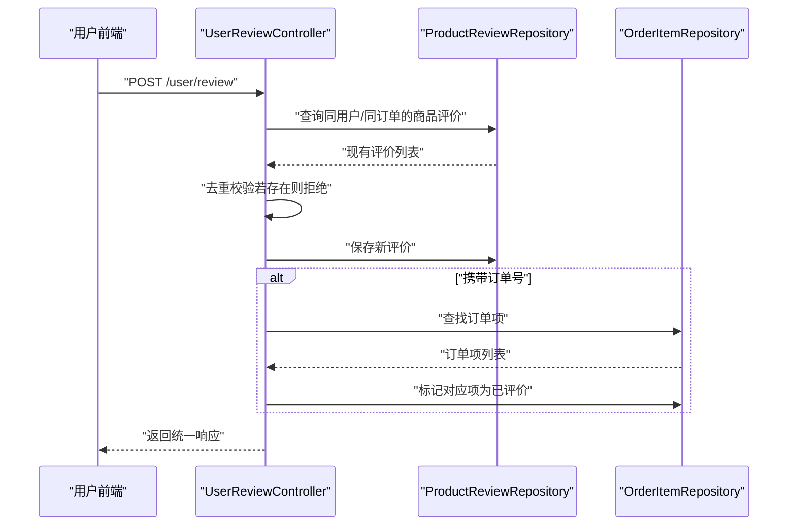
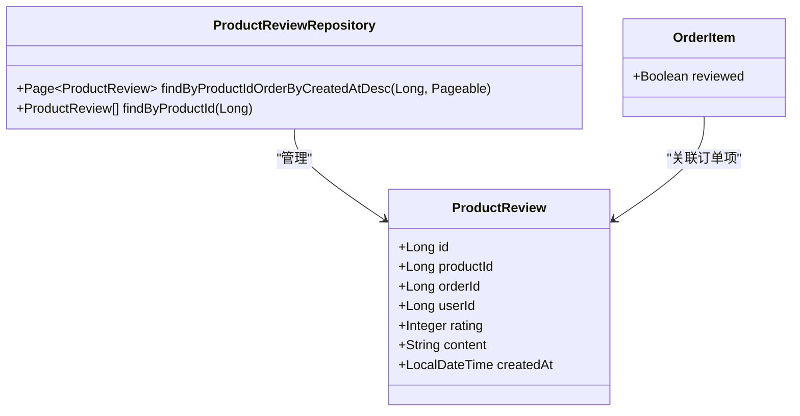
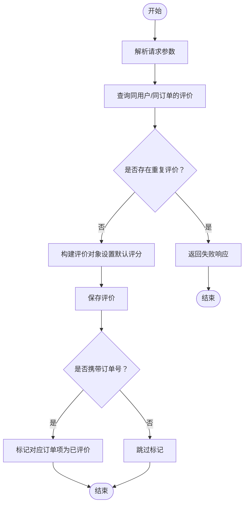
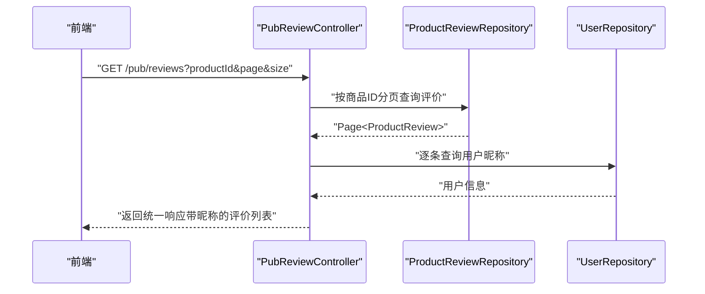
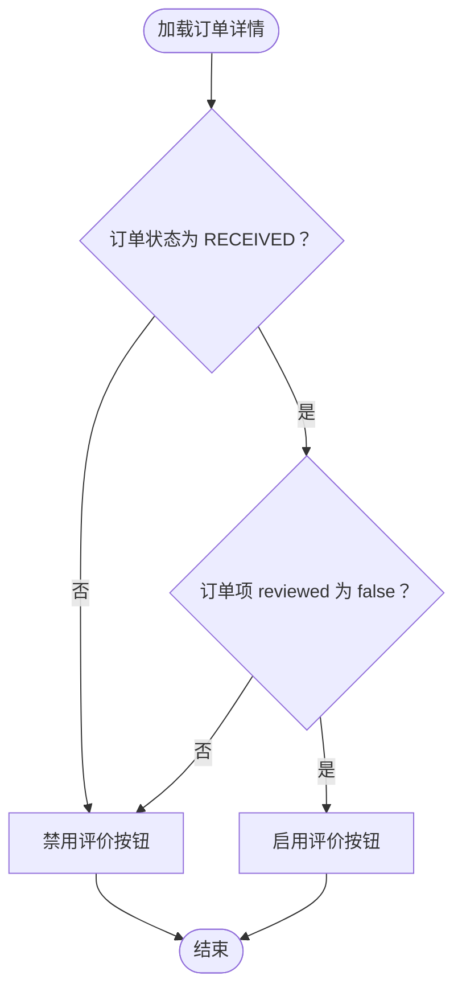
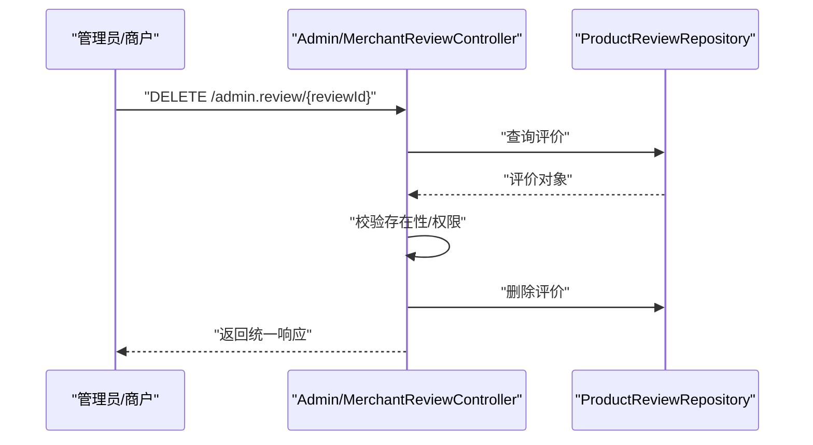
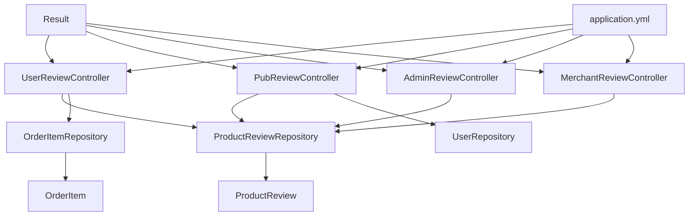

# 评价接口

<cite>
**本文引用的文件**
- [UserReviewController.java](file://backend/src/main/java/com/mall/controller/user/UserReviewController.java)
- [PubReviewController.java](file://backend/src/main/java/com/mall/controller/pub/PubReviewController.java)
- [AdminReviewController.java](file://backend/src/main/java/com/mall/controller/admin/AdminReviewController.java)
- [MerchantReviewController.java](file://backend/src/main/java/com/mall/controller/merchant/MerchantReviewController.java)
- [ProductReview.java](file://backend/src/main/java/com/mall/entity/ProductReview.java)
- [ProductReviewRepository.java](file://backend/src/main/java/com/mall/repository/ProductReviewRepository.java)
- [OrderItem.java](file://backend/src/main/java/com/mall/entity/OrderItem.java)
- [application.yml](file://backend/src/main/resources/application.yml)
- [Result.java](file://backend/src/main/java/com/mall/dto/Result.java)
- [user.js](file://frontend/src/api/user.js)
- [MyOrders.vue](file://frontend/src/views/user/MyOrders.vue)
</cite>

## 目录
1. [简介](#简介)
2. [项目结构](#项目结构)
3. [核心组件](#核心组件)
4. [架构概览](#架构概览)
5. [详细组件分析](#详细组件分析)
6. [依赖分析](#依赖分析)
7. [性能考虑](#性能考虑)
8. [故障排除指南](#故障排除指南)
9. [结论](#结论)

## 简介
本文件为商品评价接口的完整API文档，覆盖以下核心能力：
- 提交商品评价：POST /user/review
- 查询商品评价列表：GET /pub/reviews（公共接口）
- 查询订单评价状态：GET /user/review/status/{orderId}（前端逻辑体现）
- 删除评价：DELETE /admin/review/{reviewId}、DELETE /merchant/review/{reviewId}

文档同时阐述评价数据结构、评分规则、评价审核流程以及评价统计计算方式，并提供面向开发与运维的可视化架构图与序列图。

## 项目结构
后端采用Spring Boot分层架构，评价相关模块位于controller、entity、repository三层：
- 控制器层：用户端、公共、管理员、商户四个维度的控制器
- 实体层：ProductReview（评价实体）、OrderItem（订单项，含评价标记字段）
- 仓储层：ProductReviewRepository（JPA仓库）
- 配置层：application.yml（数据库、JPA、JWT配置）

图表来源
- [UserReviewController.java:17-72](file://backend/src/main/java/com/mall/controller/user/UserReviewController.java#L17-L72)
- [PubReviewController.java:19-61](file://backend/src/main/java/com/mall/controller/pub/PubReviewController.java#L19-L61)
- [AdminReviewController.java:16-91](file://backend/src/main/java/com/mall/controller/admin/AdminReviewController.java#L16-L91)
- [MerchantReviewController.java:21-156](file://backend/src/main/java/com/mall/controller/merchant/MerchantReviewController.java#L21-L156)
- [ProductReview.java:8-43](file://backend/src/main/java/com/mall/entity/ProductReview.java#L8-L43)
- [OrderItem.java:60-63](file://backend/src/main/java/com/mall/entity/OrderItem.java#L60-L63)
- [ProductReviewRepository.java:10-15](file://backend/src/main/java/com/mall/repository/ProductReviewRepository.java#L10-L15)
- [application.yml:1-36](file://backend/src/main/resources/application.yml#L1-L36)
- [Result.java:10-22](file://backend/src/main/java/com/mall/dto/Result.java#L10-L22)

章节来源
- [UserReviewController.java:17-72](file://backend/src/main/java/com/mall/controller/user/UserReviewController.java#L17-L72)
- [PubReviewController.java:19-61](file://backend/src/main/java/com/mall/controller/pub/PubReviewController.java#L19-L61)
- [AdminReviewController.java:16-91](file://backend/src/main/java/com/mall/controller/admin/AdminReviewController.java#L16-L91)
- [MerchantReviewController.java:21-156](file://backend/src/main/java/com/mall/controller/merchant/MerchantReviewController.java#L21-L156)
- [ProductReview.java:8-43](file://backend/src/main/java/com/mall/entity/ProductReview.java#L8-L43)
- [OrderItem.java:60-63](file://backend/src/main/java/com/mall/entity/OrderItem.java#L60-L63)
- [ProductReviewRepository.java:10-15](file://backend/src/main/java/com/mall/repository/ProductReviewRepository.java#L10-L15)
- [application.yml:1-36](file://backend/src/main/resources/application.yml#L1-L36)
- [Result.java:10-22](file://backend/src/main/java/com/mall/dto/Result.java#L10-L22)

## 核心组件
- 用户控制器（UserReviewController）：负责用户提交评价、重复评价校验、订单项评价标记
- 公共控制器（PubReviewController）：负责按商品分页查询评价列表，并关联用户昵称
- 管理员控制器（AdminReviewController）：负责平台级评价的查看、删除与批量删除
- 商户控制器（MerchantReviewController）：负责商户维度的评价查看、删除与批量删除
- 实体（ProductReview）：评价数据模型，包含评分、内容、创建时间等
- 仓储（ProductReviewRepository）：提供按商品分页查询与列表查询
- 订单项（OrderItem）：包含“是否已评价”标记字段，用于订单完成流程控制
- 统一响应（Result）：后端统一返回格式

章节来源
- [UserReviewController.java:26-71](file://backend/src/main/java/com/mall/controller/user/UserReviewController.java#L26-L71)
- [PubReviewController.java:28-61](file://backend/src/main/java/com/mall/controller/pub/PubReviewController.java#L28-L61)
- [AdminReviewController.java:24-90](file://backend/src/main/java/com/mall/controller/admin/AdminReviewController.java#L24-L90)
- [MerchantReviewController.java:39-155](file://backend/src/main/java/com/mall/controller/merchant/MerchantReviewController.java#L39-L155)
- [ProductReview.java:15-42](file://backend/src/main/java/com/mall/entity/ProductReview.java#L15-L42)
- [ProductReviewRepository.java:10-15](file://backend/src/main/java/com/mall/repository/ProductReviewRepository.java#L10-L15)
- [OrderItem.java:60-63](file://backend/src/main/java/com/mall/entity/OrderItem.java#L60-L63)
- [Result.java:10-22](file://backend/src/main/java/com/mall/dto/Result.java#L10-L22)

## 架构概览
评价接口围绕ProductReview实体展开，用户通过UserReviewController提交评价；公共展示通过PubReviewController查询；管理员与商户分别通过AdminReviewController与MerchantReviewController进行管理；OrderItem中的reviewed字段用于订单完成流程控制。

图表来源
- [UserReviewController.java:31-71](file://backend/src/main/java/com/mall/controller/user/UserReviewController.java#L31-L71)
- [ProductReviewRepository.java:10-15](file://backend/src/main/java/com/mall/repository/ProductReviewRepository.java#L10-L15)
- [OrderItem.java:60-63](file://backend/src/main/java/com/mall/entity/OrderItem.java#L60-L63)

## 详细组件分析

### 数据模型与字段定义
- 评价实体（ProductReview）
  - 字段：id、productId、orderId、userId、rating、content、createdAt
  - 默认值：rating默认为5
  - 时间戳：createdAt在持久化前自动填充
- 订单项（OrderItem）
  - 字段：reviewed（是否已评价，默认false）
  - 作用：用于订单完成后禁止重复评价

图表来源
- [ProductReview.java:15-42](file://backend/src/main/java/com/mall/entity/ProductReview.java#L15-L42)
- [OrderItem.java:60-63](file://backend/src/main/java/com/mall/entity/OrderItem.java#L60-L63)
- [ProductReviewRepository.java:10-15](file://backend/src/main/java/com/mall/repository/ProductReviewRepository.java#L10-L15)

章节来源
- [ProductReview.java:15-42](file://backend/src/main/java/com/mall/entity/ProductReview.java#L15-L42)
- [OrderItem.java:60-63](file://backend/src/main/java/com/mall/entity/OrderItem.java#L60-L63)
- [ProductReviewRepository.java:10-15](file://backend/src/main/java/com/mall/repository/ProductReviewRepository.java#L10-L15)

### 提交商品评价（POST /user/review）
- 功能概述
  - 用户提交评价，支持携带orderId（可选），必填productId、rating、content
  - 后端进行重复评价校验（同一用户对同一商品/同一订单）
  - 若携带orderId，提交成功后将对应订单项标记为已评价
- 请求参数
  - productId：商品ID（必填）
  - orderId：订单ID（可选）
  - rating：评分（整数，建议1-5；默认5）
  - content：评价内容（字符串，最大长度512）
- 返回结果
  - 成功：统一响应（code=200，message="success"，data为新增评价）
  - 失败：统一响应（code=400，message为错误信息）

图表来源
- [UserReviewController.java:31-71](file://backend/src/main/java/com/mall/controller/user/UserReviewController.java#L31-L71)

章节来源
- [UserReviewController.java:31-71](file://backend/src/main/java/com/mall/controller/user/UserReviewController.java#L31-L71)

### 查询商品评价列表（GET /pub/reviews）
- 功能概述
  - 公共接口，按商品ID分页查询评价列表
  - 将评价数据与用户昵称进行关联（若用户不存在或昵称为空则显示用户名）
- 请求参数
  - productId：商品ID（必填）
  - page：页码（从0开始，默认0）
  - size：每页大小（默认10）
- 返回结果
  - 成功：统一响应（data为分页对象，包含评价列表与分页信息）

图表来源
- [PubReviewController.java:28-61](file://backend/src/main/java/com/mall/controller/pub/PubReviewController.java#L28-L61)
- [ProductReviewRepository.java:12-14](file://backend/src/main/java/com/mall/repository/ProductReviewRepository.java#L12-L14)

章节来源
- [PubReviewController.java:28-61](file://backend/src/main/java/com/mall/controller/pub/PubReviewController.java#L28-L61)
- [ProductReviewRepository.java:12-14](file://backend/src/main/java/com/mall/repository/ProductReviewRepository.java#L12-L14)

### 查询订单评价状态（GET /user/review/status/{orderId}）
- 功能概述
  - 前端逻辑体现：仅在订单状态为“已收货”且订单项未评价时，允许用户发起评价
  - 该接口在后端未实现，状态判断由前端根据订单状态与订单项reviewed字段决定
- 前端实现要点
  - 当订单状态为“RECEIVED”且订单项reviewed为false时，显示“评价”按钮
  - 提交评价成功后，调用完成订单接口以更新订单状态

图表来源
- [MyOrders.vue:769-885](file://frontend/src/views/user/MyOrders.vue#L769-L885)
- [OrderItem.java:60-63](file://backend/src/main/java/com/mall/entity/OrderItem.java#L60-L63)

章节来源
- [MyOrders.vue:769-885](file://frontend/src/views/user/MyOrders.vue#L769-L885)
- [OrderItem.java:60-63](file://backend/src/main/java/com/mall/entity/OrderItem.java#L60-L63)

### 删除评价
- 管理员删除（DELETE /admin/review/{reviewId}）
  - 校验评价是否存在，存在则删除并返回成功信息
- 商户删除（DELETE /merchant/review/{reviewId}）
  - 校验评价是否存在且属于当前商户名下的商品，满足条件则删除
- 批量删除
  - 管理员：POST /admin/review/batch-delete
  - 商户：POST /merchant/review/batch-delete

图表来源
- [AdminReviewController.java:66-76](file://backend/src/main/java/com/mall/controller/admin/AdminReviewController.java#L66-L76)
- [MerchantReviewController.java:112-132](file://backend/src/main/java/com/mall/controller/merchant/MerchantReviewController.java#L112-L132)

章节来源
- [AdminReviewController.java:66-76](file://backend/src/main/java/com/mall/controller/admin/AdminReviewController.java#L66-L76)
- [MerchantReviewController.java:112-132](file://backend/src/main/java/com/mall/controller/merchant/MerchantReviewController.java#L112-L132)

### 评价统计计算
- 平台统计（管理员/商户页面）
  - 总评价数：按商品或全站统计
  - 5星评价数：按星级过滤
  - 平均评分：按商品所有评价的rating求平均
  - 低评价：通常指低于3星的评价
- 计算方式
  - 使用ProductReviewRepository按商品ID查询列表
  - 在服务层或前端进行聚合计算（如平均值、星级分布）

章节来源
- [AdminReviewController.java:24-63](file://backend/src/main/java/com/mall/controller/admin/AdminReviewController.java#L24-L63)
- [MerchantReviewController.java:39-90](file://backend/src/main/java/com/mall/controller/merchant/MerchantReviewController.java#L39-L90)
- [ProductReviewRepository.java:14-15](file://backend/src/main/java/com/mall/repository/ProductReviewRepository.java#L14-L15)

## 依赖分析
- 控制器与仓储
  - UserReviewController依赖ProductReviewRepository与OrderItemRepository
  - PubReviewController依赖ProductReviewRepository与UserRepository
  - AdminReviewController与MerchantReviewController依赖ProductReviewRepository
- 统一响应
  - 所有控制器返回Result封装的响应
- 配置
  - application.yml提供数据库连接、JPA方言、JWT密钥与过期时间等

图表来源
- [UserReviewController.java:23-24](file://backend/src/main/java/com/mall/controller/user/UserReviewController.java#L23-L24)
- [PubReviewController.java:25-26](file://backend/src/main/java/com/mall/controller/pub/PubReviewController.java#L25-L26)
- [AdminReviewController.java](file://backend/src/main/java/com/mall/controller/admin/AdminReviewController.java#L22)
- [MerchantReviewController.java:27-29](file://backend/src/main/java/com/mall/controller/merchant/MerchantReviewController.java#L27-L29)
- [Result.java:10-22](file://backend/src/main/java/com/mall/dto/Result.java#L10-L22)
- [application.yml:1-36](file://backend/src/main/resources/application.yml#L1-L36)

章节来源
- [UserReviewController.java:23-24](file://backend/src/main/java/com/mall/controller/user/UserReviewController.java#L23-L24)
- [PubReviewController.java:25-26](file://backend/src/main/java/com/mall/controller/pub/PubReviewController.java#L25-L26)
- [AdminReviewController.java](file://backend/src/main/java/com/mall/controller/admin/AdminReviewController.java#L22)
- [MerchantReviewController.java:27-29](file://backend/src/main/java/com/mall/controller/merchant/MerchantReviewController.java#L27-L29)
- [Result.java:10-22](file://backend/src/main/java/com/mall/dto/Result.java#L10-L22)
- [application.yml:1-36](file://backend/src/main/resources/application.yml#L1-L36)

## 性能考虑
- 分页查询
  - PubReviewController与管理员/商户控制器均使用分页查询，避免一次性加载大量评价
- 聚合计算
  - 平台统计建议在服务层进行缓存或异步计算，减少高频查询压力
- 关联查询
  - 公共接口在返回评价列表时需关联用户昵称，建议在仓储层优化或使用投影减少不必要的字段传输

## 故障排除指南
- 提交评价失败
  - 重复评价：同一用户对同一商品/同一订单已存在评价时会被拒绝
  - 参数缺失：缺少productId、rating或content可能导致校验失败
- 删除评价失败
  - 评价不存在：删除前会校验评价是否存在
  - 权限不足：商户删除时需确保评价属于当前商户名下商品
- 订单状态异常
  - 仅在订单状态为“已收货”且订单项未评价时允许评价
  - 提交评价成功后应调用完成订单接口以更新状态

章节来源
- [UserReviewController.java:40-47](file://backend/src/main/java/com/mall/controller/user/UserReviewController.java#L40-L47)
- [AdminReviewController.java:66-76](file://backend/src/main/java/com/mall/controller/admin/AdminReviewController.java#L66-L76)
- [MerchantReviewController.java:112-132](file://backend/src/main/java/com/mall/controller/merchant/MerchantReviewController.java#L112-L132)
- [MyOrders.vue:769-885](file://frontend/src/views/user/MyOrders.vue#L769-L885)

## 结论
本评价接口体系以ProductReview为核心，结合OrderItem的reviewed字段实现了完整的“下单-收货-评价-完成”的闭环。用户端提供便捷的提交入口，公共接口支持评价列表展示，管理员与商户具备完善的管理能力。建议在生产环境中进一步完善评分范围校验、内容敏感词过滤与统计缓存策略，以提升系统稳定性与用户体验。