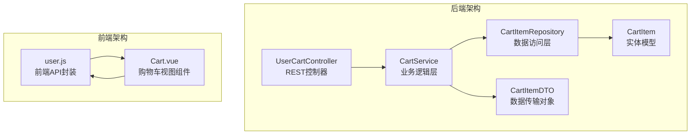
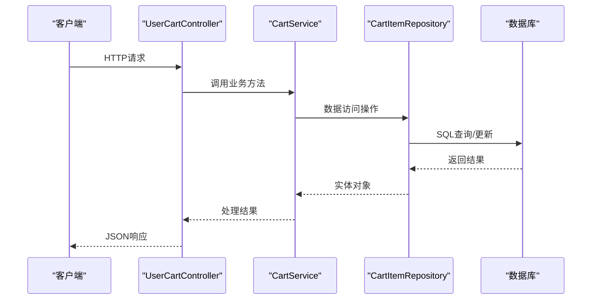
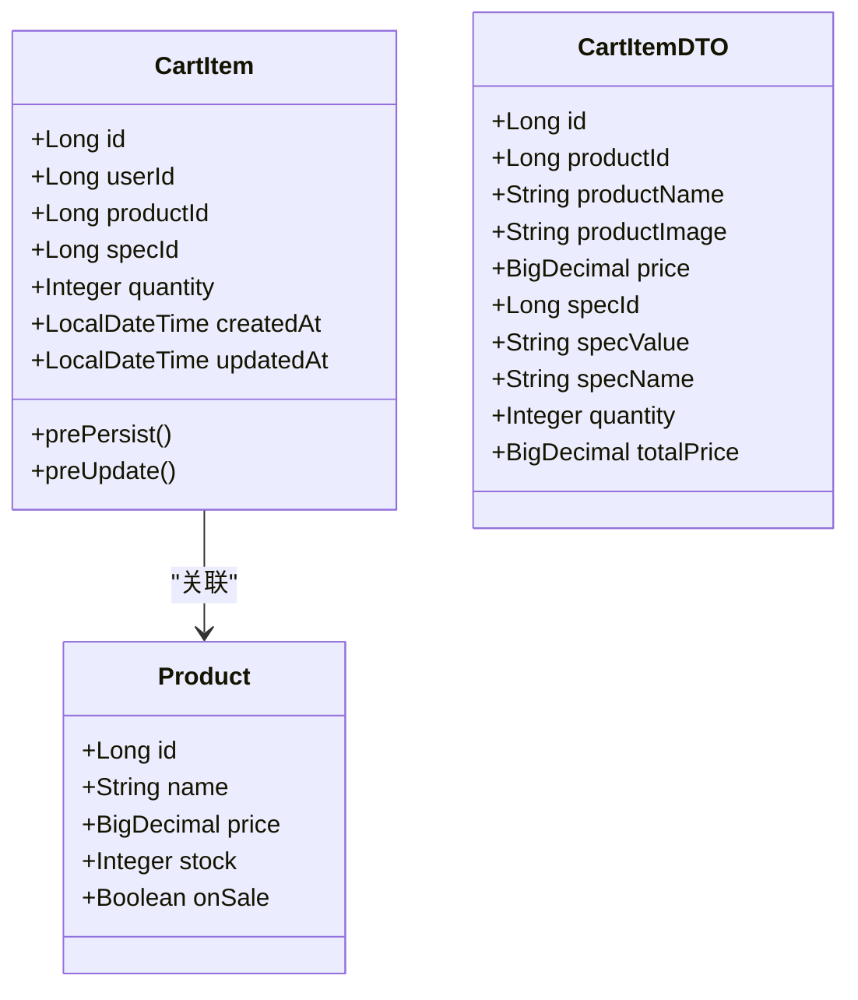
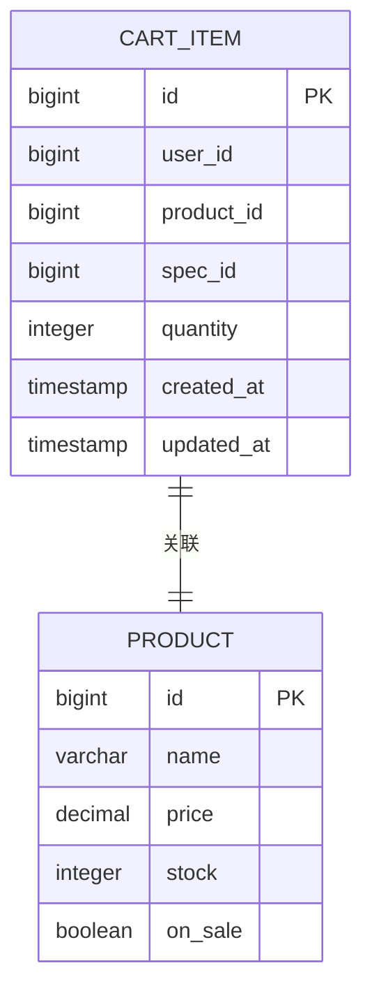
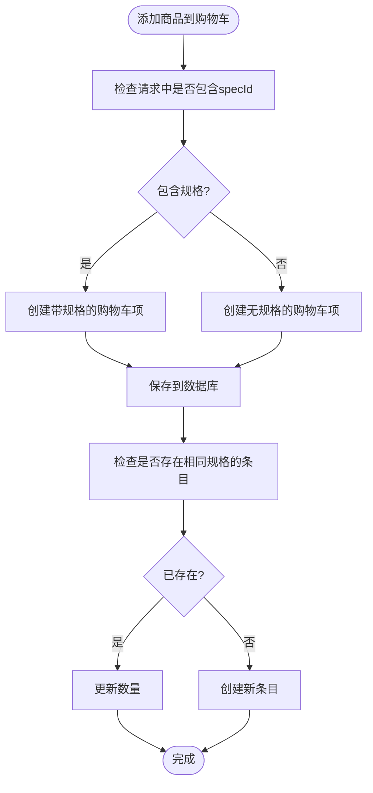
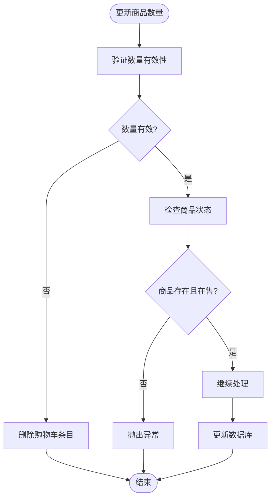
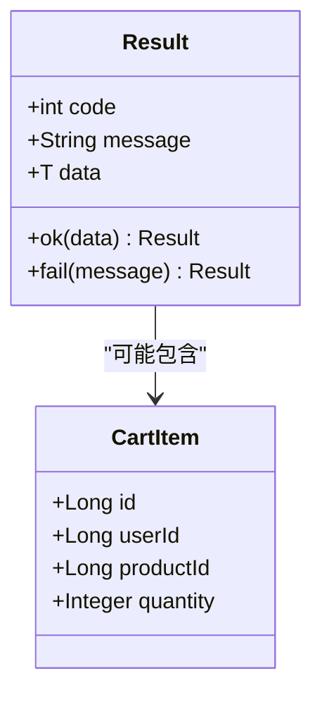
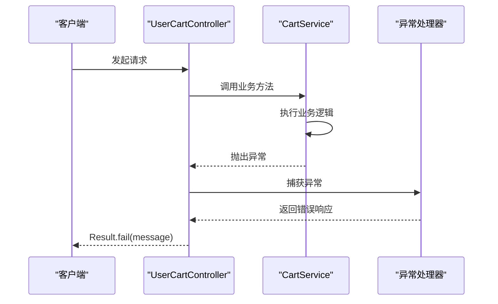

# 购物车接口

<cite>
**本文档引用的文件**
- [UserCartController.java](file://backend/src/main/java/com/mall/controller/user/UserCartController.java)
- [CartService.java](file://backend/src/main/java/com/mall/service/CartService.java)
- [CartItem.java](file://backend/src/main/java/com/mall/entity/CartItem.java)
- [CartItemDTO.java](file://backend/src/main/java/com/mall/dto/CartItemDTO.java)
- [CartItemRequest.java](file://backend/src/main/java/com/mall/dto/CartItemRequest.java)
- [CartItemRepository.java](file://backend/src/main/java/com/mall/repository/CartItemRepository.java)
- [Product.java](file://backend/src/main/java/com/mall/entity/Product.java)
- [ProductRepository.java](file://backend/src/main/java/com/mall/repository/ProductRepository.java)
- [Result.java](file://backend/src/main/java/com/mall/dto/Result.java)
- [application.yml](file://backend/src/main/resources/application.yml)
- [user.js](file://frontend/src/api/user.js)
- [Cart.vue](file://frontend/src/views/user/Cart.vue)
</cite>

## 目录
1. [简介](#简介)
2. [项目结构](#项目结构)
3. [核心组件](#核心组件)
4. [架构概览](#架构概览)
5. [详细接口文档](#详细接口文档)
6. [数据模型](#数据模型)
7. [购物车规格处理](#购物车规格处理)
8. [数量验证与库存检查](#数量验证与库存检查)
9. [错误处理](#错误处理)
10. [性能考虑](#性能考虑)
11. [故障排除指南](#故障排除指南)
12. [结论](#结论)

## 简介

本文件为购物车管理接口的详细API文档，涵盖用户购物车的所有核心功能。系统采用Spring Boot + Vue.js技术栈构建，提供完整的购物车管理解决方案，包括商品添加、数量修改、商品移除、购物车查询等功能。

## 项目结构

购物车相关的核心文件组织如下：



**图表来源**
- [UserCartController.java:1-67](file://backend/src/main/java/com/mall/controller/user/UserCartController.java#L1-L67)
- [CartService.java:1-62](file://backend/src/main/java/com/mall/service/CartService.java#L1-L62)
- [CartItemRepository.java:1-21](file://backend/src/main/java/com/mall/repository/CartItemRepository.java#L1-L21)

**章节来源**
- [UserCartController.java:1-67](file://backend/src/main/java/com/mall/controller/user/UserCartController.java#L1-L67)
- [application.yml:1-36](file://backend/src/main/resources/application.yml#L1-L36)

## 核心组件

### 后端核心组件

系统采用分层架构设计，主要包含以下核心组件：

1. **控制器层**：处理HTTP请求和响应
2. **服务层**：实现业务逻辑和事务管理
3. **数据访问层**：提供数据持久化操作
4. **实体层**：定义数据库映射模型
5. **DTO层**：封装数据传输对象

### 前端核心组件

前端采用Vue.js框架，主要组件包括：
- API封装模块：统一管理所有HTTP请求
- 购物车视图组件：提供用户交互界面

**章节来源**
- [CartService.java:14-62](file://backend/src/main/java/com/mall/service/CartService.java#L14-L62)
- [CartItemRepository.java:9-21](file://backend/src/main/java/com/mall/repository/CartItemRepository.java#L9-L21)

## 架构概览



**图表来源**
- [UserCartController.java:27-65](file://backend/src/main/java/com/mall/controller/user/UserCartController.java#L27-L65)
- [CartService.java:21-60](file://backend/src/main/java/com/mall/service/CartService.java#L21-L60)
- [CartItemRepository.java:11-19](file://backend/src/main/java/com/mall/repository/CartItemRepository.java#L11-L19)

## 详细接口文档

### 基础信息

- **基础URL**：`/api/user/cart`
- **认证要求**：需要JWT令牌
- **内容类型**：`application/json`
- **响应格式**：统一Result包装

### 接口列表

#### 1. 查询购物车列表

**请求方法**：`GET`
**请求路径**：`/user/cart`

**请求示例**：
```bash
curl -X GET "http://localhost:8080/api/user/cart" \
  -H "Authorization: Bearer YOUR_JWT_TOKEN"
```

**响应结构**：
```json
{
  "code": 200,
  "message": "success",
  "data": [
    {
      "id": 1,
      "userId": 1001,
      "productId": 2001,
      "specId": null,
      "quantity": 2,
      "createdAt": "2024-01-15T10:30:00",
      "updatedAt": "2024-01-15T14:20:00"
    }
  ]
}
```

**状态码**：
- `200`：成功
- `401`：未授权
- `403`：权限不足

**章节来源**
- [UserCartController.java:27-32](file://backend/src/main/java/com/mall/controller/user/UserCartController.java#L27-L32)

#### 2. 添加商品到购物车

**请求方法**：`POST`
**请求路径**：`/user/cart/add`

**请求头**：
```http
Content-Type: application/json
Authorization: Bearer YOUR_JWT_TOKEN
```

**请求体**：
```json
{
  "productId": 2001,
  "quantity": 1
}
```

**响应示例**：
```json
{
  "code": 200,
  "message": "success",
  "data": {
    "id": 1,
    "userId": 1001,
    "productId": 2001,
    "specId": null,
    "quantity": 1,
    "createdAt": "2024-01-15T15:45:00",
    "updatedAt": "2024-01-15T15:45:00"
  }
}
```

**状态码**：
- `200`：成功
- `400`：失败（包含错误信息）

**章节来源**
- [UserCartController.java:34-45](file://backend/src/main/java/com/mall/controller/user/UserCartController.java#L34-L45)

#### 3. 更新商品数量

**请求方法**：`PUT`
**请求路径**：`/user/cart/quantity`

**请求体**：
```json
{
  "productId": 2001,
  "quantity": 3
}
```

**响应示例**：
```json
{
  "code": 200,
  "message": "success",
  "data": null
}
```

**注意**：当quantity小于等于0时，系统会自动删除该商品

**状态码**：
- `200`：成功
- `400`：失败

**章节来源**
- [UserCartController.java:47-58](file://backend/src/main/java/com/mall/controller/user/UserCartController.java#L47-L58)

#### 4. 从购物车移除商品

**请求方法**：`DELETE`
**请求路径**：`/user/cart/{productId}`

**路径参数**：
- `productId`：商品ID（必需）

**响应示例**：
```json
{
  "code": 200,
  "message": "success",
  "data": null
}
```

**状态码**：
- `200`：成功
- `400`：失败

**章节来源**
- [UserCartController.java:60-65](file://backend/src/main/java/com/mall/controller/user/UserCartController.java#L60-L65)

## 数据模型

### 购物车项实体



**图表来源**
- [CartItem.java:15-49](file://backend/src/main/java/com/mall/entity/CartItem.java#L15-L49)
- [Product.java:16-100](file://backend/src/main/java/com/mall/entity/Product.java#L16-L100)
- [CartItemDTO.java:11-32](file://backend/src/main/java/com/mall/dto/CartItemDTO.java#L11-L32)

### 数据库表结构



**图表来源**
- [CartItem.java:8-49](file://backend/src/main/java/com/mall/entity/CartItem.java#L8-L49)
- [Product.java:9-100](file://backend/src/main/java/com/mall/entity/Product.java#L9-L100)

**章节来源**
- [CartItem.java:1-50](file://backend/src/main/java/com/mall/entity/CartItem.java#L1-L50)
- [Product.java:1-101](file://backend/src/main/java/com/mall/entity/Product.java#L1-L101)

## 购物车规格处理

### 规格支持机制

系统支持商品规格的购物车管理，通过`specId`字段实现规格级别的购物车条目管理。

### 规格唯一性约束

购物车表具有复合唯一约束，确保同一用户对同一商品的相同规格只能存在一个条目：

```sql
UNIQUE KEY uk_user_product_spec (user_id, product_id, spec_id)
```

### 规格数据流



**图表来源**
- [CartItem.java:9-28](file://backend/src/main/java/com/mall/entity/CartItem.java#L9-L28)
- [CartService.java:25-43](file://backend/src/main/java/com/mall/service/CartService.java#L25-L43)

**章节来源**
- [CartItem.java:9-28](file://backend/src/main/java/com/mall/entity/CartItem.java#L9-L28)
- [CartService.java:25-43](file://backend/src/main/java/com/mall/service/CartService.java#L25-L43)

## 数量验证与库存检查

### 数量验证规则

系统对购物车数量进行严格的验证和处理：

1. **最小数量**：至少为1
2. **最大数量**：无硬性限制，但受库存约束
3. **特殊处理**：数量为0时自动删除条目

### 库存检查机制



**图表来源**
- [CartService.java:45-55](file://backend/src/main/java/com/mall/service/CartService.java#L45-L55)
- [CartService.java:25-43](file://backend/src/main/java/com/mall/service/CartService.java#L25-L43)

### 库存约束检查

在添加商品到购物车时，系统执行以下检查：

1. **商品存在性**：验证商品ID的有效性
2. **商品状态**：检查商品是否在售
3. **规格匹配**：如果指定规格，确保规格存在

**章节来源**
- [CartService.java:25-43](file://backend/src/main/java/com/mall/service/CartService.java#L25-L43)
- [CartService.java:45-55](file://backend/src/main/java/com/mall/service/CartService.java#L45-L55)

## 错误处理

### 统一响应格式

所有API响应都遵循统一的Result格式：



**图表来源**
- [Result.java:10-23](file://backend/src/main/java/com/mall/dto/Result.java#L10-L23)

### 错误码定义

| 状态码 | 描述 | 用途 |
|--------|------|------|
| 200 | success | 请求成功 |
| 400 | 错误信息 | 业务逻辑错误 |
| 401 | 未授权 | 认证失败 |
| 403 | 权限不足 | 授权失败 |

### 异常处理流程



**图表来源**
- [UserCartController.java:39-44](file://backend/src/main/java/com/mall/controller/user/UserCartController.java#L39-L44)
- [CartService.java:28](file://backend/src/main/java/com/mall/service/CartService.java#L28)

**章节来源**
- [Result.java:10-23](file://backend/src/main/java/com/mall/dto/Result.java#L10-L23)
- [UserCartController.java:39-44](file://backend/src/main/java/com/mall/controller/user/UserCartController.java#L39-L44)

## 性能考虑

### 数据库优化

1. **索引策略**：
   - `user_id`：用于快速查询用户购物车
   - `product_id`：用于快速查找商品
   - `spec_id`：支持规格查询

2. **查询优化**：
   - 使用JPA Repository的原生查询
   - 避免N+1查询问题

### 缓存策略

建议在高并发场景下考虑以下缓存策略：
- Redis缓存热门商品信息
- 缓存用户购物车列表
- 商品库存信息缓存

### 并发控制

系统通过以下机制保证数据一致性：
- 事务管理确保操作原子性
- 数据库唯一约束防止重复条目
- 同步锁避免竞态条件

## 故障排除指南

### 常见问题及解决方案

#### 1. 购物车为空
**症状**：查询购物车返回空数组
**原因**：用户首次使用或已清空购物车
**解决**：引导用户添加商品到购物车

#### 2. 商品添加失败
**症状**：添加商品返回错误
**可能原因**：
- 商品不存在或已下架
- 网络连接问题
- 服务器异常

**解决**：检查商品状态，重试请求

#### 3. 数量更新异常
**症状**：更新数量后购物车消失
**原因**：数量设置为0或负数
**解决**：确保数量大于0

#### 4. 规格商品无法添加
**症状**：添加规格商品失败
**原因**：规格ID无效或商品无规格
**解决**：检查规格配置和商品规格

### 调试建议

1. **启用日志**：在开发环境开启详细日志
2. **监控指标**：关注数据库查询性能
3. **错误追踪**：使用异常监控工具
4. **API测试**：使用Postman等工具测试接口

**章节来源**
- [CartService.java:25-43](file://backend/src/main/java/com/mall/service/CartService.java#L25-L43)
- [UserCartController.java:39-44](file://backend/src/main/java/com/mall/controller/user/UserCartController.java#L39-L44)

## 结论

购物车管理系统提供了完整的电商购物车功能，包括商品添加、数量管理、规格支持和库存检查等核心特性。系统采用分层架构设计，具有良好的可扩展性和维护性。

### 主要优势

1. **完整的功能覆盖**：涵盖购物车管理的所有核心需求
2. **规范的架构设计**：清晰的分层结构便于维护
3. **完善的错误处理**：统一的响应格式和异常处理
4. **灵活的规格支持**：支持商品规格级别的购物车管理
5. **安全的认证机制**：基于JWT的用户认证

### 未来改进方向

1. **性能优化**：引入缓存机制提升响应速度
2. **功能扩展**：支持购物车分享、合并等功能
3. **监控增强**：添加更详细的性能监控指标
4. **用户体验**：优化前端交互和加载体验