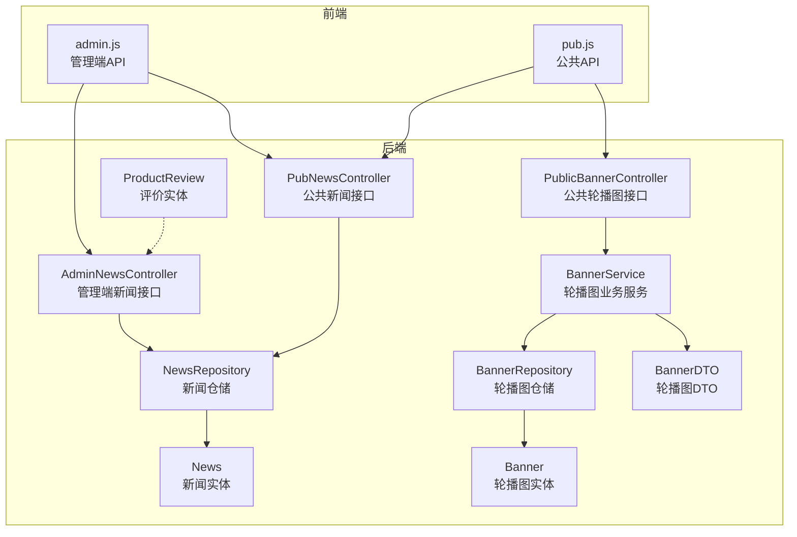
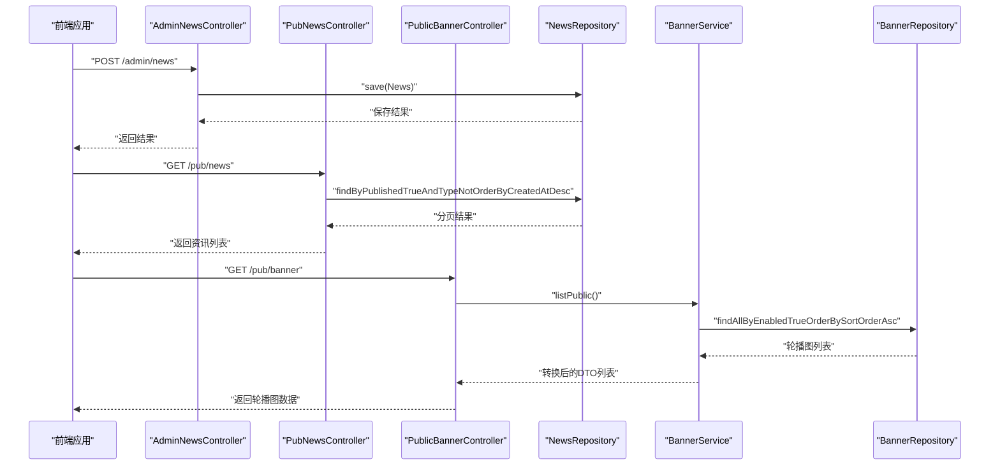
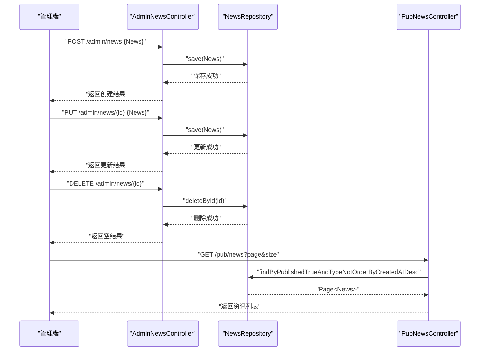
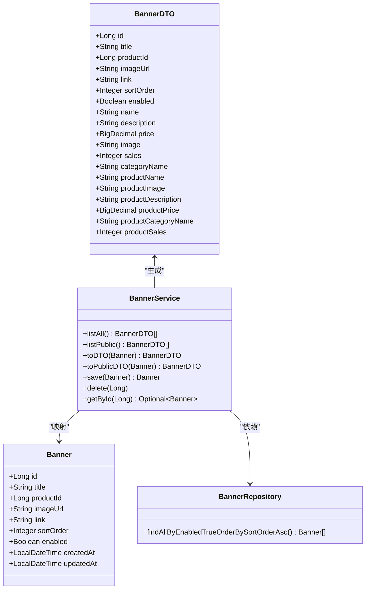
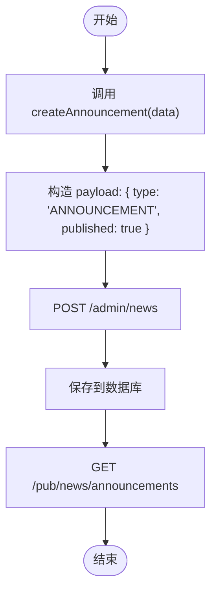
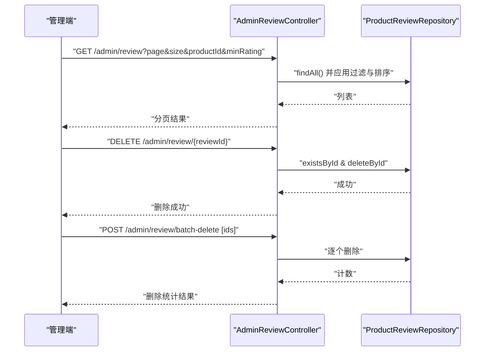
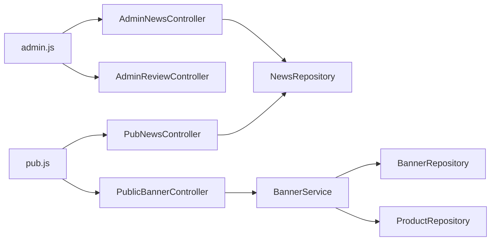

# 内容管理接口

<cite>
**本文档引用的文件**
- [AdminNewsController.java](file://backend/src/main/java/com/mall/controller/admin/AdminNewsController.java)
- [PubNewsController.java](file://backend/src/main/java/com/mall/controller/pub/PubNewsController.java)
- [PublicBannerController.java](file://backend/src/main/java/com/mall/controller/pub/PublicBannerController.java)
- [AdminReviewController.java](file://backend/src/main/java/com/mall/controller/admin/AdminReviewController.java)
- [News.java](file://backend/src/main/java/com/mall/entity/News.java)
- [Banner.java](file://backend/src/main/java/com/mall/entity/Banner.java)
- [ProductReview.java](file://backend/src/main/java/com/mall/entity/ProductReview.java)
- [NewsRepository.java](file://backend/src/main/java/com/mall/repository/NewsRepository.java)
- [BannerRepository.java](file://backend/src/main/java/com/mall/repository/BannerRepository.java)
- [BannerService.java](file://backend/src/main/java/com/mall/service/BannerService.java)
- [BannerDTO.java](file://backend/src/main/java/com/mall/dto/BannerDTO.java)
- [admin.js](file://frontend/src/api/admin.js)
- [pub.js](file://frontend/src/api/pub.js)
- [application.yml](file://backend/src/main/resources/application.yml)
</cite>

## 目录
1. [简介](#简介)
2. [项目结构](#项目结构)
3. [核心组件](#核心组件)
4. [架构总览](#架构总览)
5. [详细组件分析](#详细组件分析)
6. [依赖关系分析](#依赖关系分析)
7. [性能考虑](#性能考虑)
8. [故障排除指南](#故障排除指南)
9. [结论](#结论)

## 简介
本文件面向电商商城系统的“内容管理接口”，聚焦以下核心业务：
- 新闻资讯管理接口：新闻发布、编辑、删除
- 轮播图管理接口：图片上传、位置管理、展示控制
- 公告发布接口：公告创建、定时发布、紧急通知
- 内容审核接口：评价审核与管理
- 内容发布流程与审核机制、用户体验相关业务逻辑

系统采用前后端分离架构，后端基于 Spring Boot，前端基于 Vue.js，通过 RESTful API 进行交互。

## 项目结构
后端模块中与内容管理直接相关的目录与文件如下：
- 控制器层：管理端与公共端的新闻、轮播图、评价管理控制器
- 实体层：News、Banner、ProductReview 等核心领域模型
- 仓储层：NewsRepository、BannerRepository 提供数据访问
- 服务层：BannerService 提供轮播图业务处理
- DTO 层：BannerDTO 用于封装轮播图对外展示的数据结构
- 前端 API：admin.js、pub.js 定义调用后端接口的方法

图表来源
- [AdminNewsController.java:13-47](file://backend/src/main/java/com/mall/controller/admin/AdminNewsController.java#L13-L47)
- [PubNewsController.java:13-35](file://backend/src/main/java/com/mall/controller/pub/PubNewsController.java#L13-L35)
- [PublicBannerController.java:12-22](file://backend/src/main/java/com/mall/controller/pub/PublicBannerController.java#L12-L22)
- [BannerService.java:16-84](file://backend/src/main/java/com/mall/service/BannerService.java#L16-L84)
- [NewsRepository.java:10-18](file://backend/src/main/java/com/mall/repository/NewsRepository.java#L10-L18)
- [BannerRepository.java:7-9](file://backend/src/main/java/com/mall/repository/BannerRepository.java#L7-L9)
- [News.java:8-51](file://backend/src/main/java/com/mall/entity/News.java#L8-L51)
- [Banner.java:7-59](file://backend/src/main/java/com/mall/entity/Banner.java#L7-L59)
- [ProductReview.java:8-43](file://backend/src/main/java/com/mall/entity/ProductReview.java#L8-L43)
- [BannerDTO.java:6-32](file://backend/src/main/java/com/mall/dto/BannerDTO.java#L6-L32)
- [admin.js:88-111](file://frontend/src/api/admin.js#L88-L111)
- [pub.js:45-58](file://frontend/src/api/pub.js#L45-L58)

章节来源
- [application.yml:22-25](file://backend/src/main/resources/application.yml#L22-L25)

## 核心组件
- 管理端新闻接口：提供新闻/公告的增删改查能力，支持类型区分（NEWS/ANNOUNCEMENT），统一通过管理端控制器暴露。
- 公共新闻接口：提供资讯列表与公告列表的查询，支持分页与排序。
- 公共轮播图接口：提供轮播图列表查询，仅返回启用状态且按排序权重升序排列的记录。
- 轮播图服务：负责轮播图数据转换、产品信息填充、保存与删除等业务逻辑。
- 仓储层：NewsRepository、BannerRepository 提供 JPA 查询方法，支撑分页与条件查询。
- 前端 API：admin.js、pub.js 封装了对后端接口的调用，便于在管理端与公共页面中复用。

章节来源
- [AdminNewsController.java:13-47](file://backend/src/main/java/com/mall/controller/admin/AdminNewsController.java#L13-L47)
- [PubNewsController.java:13-35](file://backend/src/main/java/com/mall/controller/pub/PubNewsController.java#L13-L35)
- [PublicBannerController.java:12-22](file://backend/src/main/java/com/mall/controller/pub/PublicBannerController.java#L12-L22)
- [BannerService.java:16-84](file://backend/src/main/java/com/mall/service/BannerService.java#L16-L84)
- [NewsRepository.java:10-18](file://backend/src/main/java/com/mall/repository/NewsRepository.java#L10-L18)
- [BannerRepository.java:7-9](file://backend/src/main/java/com/mall/repository/BannerRepository.java#L7-L9)
- [admin.js:88-111](file://frontend/src/api/admin.js#L88-L111)
- [pub.js:45-58](file://frontend/src/api/pub.js#L45-L58)

## 架构总览
系统采用典型的三层架构：
- 表现层：前端 Vue 页面通过 admin.js、pub.js 发起请求
- 控制器层：Spring MVC 控制器接收请求并调用服务层
- 业务层：服务层实现业务规则与数据转换
- 数据访问层：JPA Repository 提供数据库访问

图表来源
- [AdminNewsController.java:27-32](file://backend/src/main/java/com/mall/controller/admin/AdminNewsController.java#L27-L32)
- [PubNewsController.java:21-27](file://backend/src/main/java/com/mall/controller/pub/PubNewsController.java#L21-L27)
- [PublicBannerController.java:18-21](file://backend/src/main/java/com/mall/controller/pub/PublicBannerController.java#L18-L21)
- [NewsRepository.java:13-17](file://backend/src/main/java/com/mall/repository/NewsRepository.java#L13-L17)
- [BannerService.java:27-33](file://backend/src/main/java/com/mall/service/BannerService.java#L27-L33)
- [BannerRepository.java](file://backend/src/main/java/com/mall/repository/BannerRepository.java#L8)

## 详细组件分析

### 新闻资讯管理接口
- 功能概述
  - 列表查询：管理端查询所有新闻/公告；公共端分页查询已发布资讯（排除公告）
  - 创建/更新：支持设置标题、内容、类型（NEWS/ANNOUNCEMENT）、发布状态
  - 删除：根据 ID 删除指定记录
- 请求路径与参数
  - GET /admin/news：管理端查询所有新闻/公告
  - POST /admin/news：创建新闻/公告（请求体为 News 对象）
  - PUT /admin/news/{id}：更新指定 ID 的新闻/公告
  - DELETE /admin/news/{id}：删除指定 ID 的新闻/公告
  - GET /pub/news：公共端分页查询已发布资讯（page、size）
  - GET /pub/news/announcements：公共端查询最新公告列表（size）
- 数据模型
  - News 实体包含 id、title、content、type、published、created_at、updated_at 等字段
- 业务逻辑
  - 管理端接口直接持久化 News 记录，未内置审核流程
  - 公共端接口通过 published 字段筛选已发布内容，并按创建时间倒序

图表来源
- [AdminNewsController.java:21-46](file://backend/src/main/java/com/mall/controller/admin/AdminNewsController.java#L21-L46)
- [PubNewsController.java:21-34](file://backend/src/main/java/com/mall/controller/pub/PubNewsController.java#L21-L34)
- [NewsRepository.java:13-17](file://backend/src/main/java/com/mall/repository/NewsRepository.java#L13-L17)
- [News.java:16-50](file://backend/src/main/java/com/mall/entity/News.java#L16-L50)

章节来源
- [AdminNewsController.java:13-47](file://backend/src/main/java/com/mall/controller/admin/AdminNewsController.java#L13-L47)
- [PubNewsController.java:13-35](file://backend/src/main/java/com/mall/controller/pub/PubNewsController.java#L13-L35)
- [NewsRepository.java:10-18](file://backend/src/main/java/com/mall/repository/NewsRepository.java#L10-L18)
- [News.java:8-51](file://backend/src/main/java/com/mall/entity/News.java#L8-L51)
- [admin.js:88-111](file://frontend/src/api/admin.js#L88-L111)
- [pub.js:45-53](file://frontend/src/api/pub.js#L45-L53)

### 轮播图管理接口
- 功能概述
  - 管理端：维护轮播图的标题、关联商品、图片 URL、跳转链接、排序权重、启用状态
  - 公共端：查询启用状态的轮播图，按排序权重升序返回
- 请求路径与参数
  - GET /pub/banner：公共端获取轮播图列表
  - 管理端接口：由前端 admin.js 中的轮播图页面调用，具体路径在管理端控制器中定义
- 数据模型
  - Banner 实体包含 id、title、productId、imageUrl、link、sortOrder、enabled 及时间戳字段
  - BannerDTO 用于对外展示，包含商品名称、图片、描述、价格等信息
- 业务逻辑
  - BannerService 在保存时若存在 productId，则自动回填图片 URL
  - listPublic 过滤掉 productId 或商品图片为空的记录，确保对外展示数据完整

图表来源
- [Banner.java:14-59](file://backend/src/main/java/com/mall/entity/Banner.java#L14-L59)
- [BannerDTO.java:7-32](file://backend/src/main/java/com/mall/dto/BannerDTO.java#L7-L32)
- [BannerService.java:18-84](file://backend/src/main/java/com/mall/service/BannerService.java#L18-L84)
- [BannerRepository.java:7-9](file://backend/src/main/java/com/mall/repository/BannerRepository.java#L7-L9)

章节来源
- [PublicBannerController.java:12-22](file://backend/src/main/java/com/mall/controller/pub/PublicBannerController.java#L12-L22)
- [BannerService.java:16-84](file://backend/src/main/java/com/mall/service/BannerService.java#L16-L84)
- [BannerRepository.java:7-9](file://backend/src/main/java/com/mall/repository/BannerRepository.java#L7-L9)
- [Banner.java:7-59](file://backend/src/main/java/com/mall/entity/Banner.java#L7-L59)
- [BannerDTO.java:6-32](file://backend/src/main/java/com/mall/dto/BannerDTO.java#L6-L32)
- [pub.js:55-58](file://frontend/src/api/pub.js#L55-L58)

### 公告发布接口
- 功能概述
  - 支持公告的创建与快速发布，类型固定为 ANNOUNCEMENT，发布状态默认为已发布
  - 公共端提供最新公告列表查询接口
- 请求路径与参数
  - POST /admin/news：创建新闻/公告（前端通过 admin.js 的 createAnnouncement 方法传入 { type: "ANNOUNCEMENT", published: true }）
  - GET /pub/news/announcements：查询最新公告列表（size 参数控制数量）

图表来源
- [admin.js:108-111](file://frontend/src/api/admin.js#L108-L111)
- [AdminNewsController.java:27-32](file://backend/src/main/java/com/mall/controller/admin/AdminNewsController.java#L27-L32)
- [PubNewsController.java:29-34](file://backend/src/main/java/com/mall/controller/pub/PubNewsController.java#L29-L34)

章节来源
- [admin.js:108-111](file://frontend/src/api/admin.js#L108-L111)
- [AdminNewsController.java:13-47](file://backend/src/main/java/com/mall/controller/admin/AdminNewsController.java#L13-L47)
- [PubNewsController.java:13-35](file://backend/src/main/java/com/mall/controller/pub/PubNewsController.java#L13-L35)

### 内容审核接口
- 功能概述
  - 管理端可查看与删除用户评价，支持按商品 ID 与最低评分过滤
  - 支持单条与批量删除评价
- 请求路径与参数
  - GET /admin/review：分页查询评价（page、size、productId、minRating）
  - DELETE /admin/review/{reviewId}：删除单条评价
  - POST /admin/review/batch-delete：批量删除评价（请求体为 ID 数组）

图表来源
- [AdminReviewController.java:24-90](file://backend/src/main/java/com/mall/controller/admin/AdminReviewController.java#L24-L90)
- [ProductReview.java:15-43](file://backend/src/main/java/com/mall/entity/ProductReview.java#L15-L43)

章节来源
- [AdminReviewController.java:16-91](file://backend/src/main/java/com/mall/controller/admin/AdminReviewController.java#L16-L91)
- [ProductReview.java:8-43](file://backend/src/main/java/com/mall/entity/ProductReview.java#L8-L43)

## 依赖关系分析
- 控制器依赖仓储：AdminNewsController、PubNewsController 直接依赖 NewsRepository；PublicBannerController 依赖 BannerService
- 服务层依赖仓储与实体：BannerService 依赖 BannerRepository 与 ProductRepository，进行数据转换与业务处理
- 前端依赖后端接口：admin.js、pub.js 将后端接口封装为可复用函数

图表来源
- [AdminNewsController.java](file://backend/src/main/java/com/mall/controller/admin/AdminNewsController.java#L19)
- [PubNewsController.java](file://backend/src/main/java/com/mall/controller/pub/PubNewsController.java#L19)
- [PublicBannerController.java](file://backend/src/main/java/com/mall/controller/pub/PublicBannerController.java#L16)
- [BannerService.java:19-20](file://backend/src/main/java/com/mall/service/BannerService.java#L19-L20)
- [admin.js:88-111](file://frontend/src/api/admin.js#L88-L111)
- [pub.js:45-58](file://frontend/src/api/pub.js#L45-L58)

章节来源
- [AdminNewsController.java:13-47](file://backend/src/main/java/com/mall/controller/admin/AdminNewsController.java#L13-L47)
- [PubNewsController.java:13-35](file://backend/src/main/java/com/mall/controller/pub/PubNewsController.java#L13-L35)
- [PublicBannerController.java:12-22](file://backend/src/main/java/com/mall/controller/pub/PublicBannerController.java#L12-L22)
- [BannerService.java:16-84](file://backend/src/main/java/com/mall/service/BannerService.java#L16-L84)
- [admin.js:88-111](file://frontend/src/api/admin.js#L88-L111)
- [pub.js:45-58](file://frontend/src/api/pub.js#L45-L58)

## 性能考虑
- 分页查询：公共新闻接口使用 PageRequest 进行分页，避免一次性加载大量数据
- 排序与筛选：BannerService 的 listPublic 在内存中进行过滤，建议在数据库层面增加索引以优化查询性能
- DTO 映射：BannerService 使用 BeanUtils 进行属性复制，注意避免不必要的大对象拷贝
- 缓存策略：可在 BannerService 层引入缓存（如 Redis）存储热门轮播图，减少数据库压力

## 故障排除指南
- 新闻/公告创建失败
  - 检查请求体是否包含必需字段（title、content、type、published）
  - 确认管理端控制器保存逻辑是否正常执行
- 公告未显示
  - 确认 published 字段为 true，且 type 为 ANNOUNCEMENT
  - 公共端查询接口仅返回已发布的公告
- 轮播图不显示
  - 确认 enabled 为 true，sortOrder 正常
  - 确保 productId 关联的商品存在且图片可用
- 评价删除异常
  - 确认 reviewId 存在，避免重复删除导致的异常

章节来源
- [AdminNewsController.java:27-32](file://backend/src/main/java/com/mall/controller/admin/AdminNewsController.java#L27-L32)
- [PubNewsController.java:21-34](file://backend/src/main/java/com/mall/controller/pub/PubNewsController.java#L21-L34)
- [BannerService.java:27-33](file://backend/src/main/java/com/mall/service/BannerService.java#L27-L33)
- [AdminReviewController.java:66-90](file://backend/src/main/java/com/mall/controller/admin/AdminReviewController.java#L66-L90)

## 结论
本内容管理接口围绕新闻资讯、轮播图与评价审核三大模块构建，具备清晰的职责划分与稳定的前后端交互方式。当前实现侧重于基础的增删改查与公开数据展示，未内置复杂的内容审核流程。后续可考虑引入内容审核队列、定时发布机制以及更完善的权限控制与审计日志，以提升系统的安全性与可运维性。