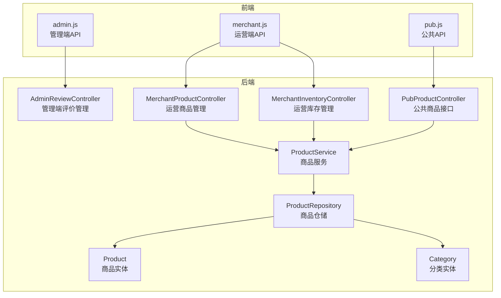
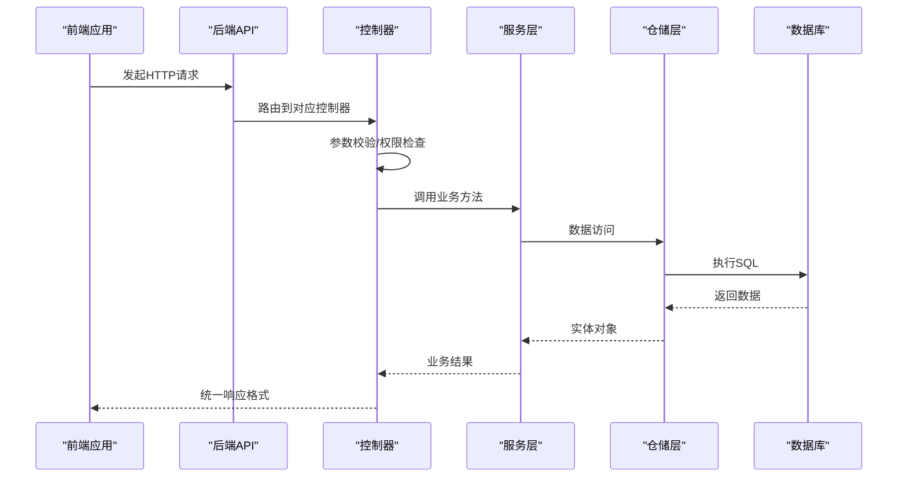
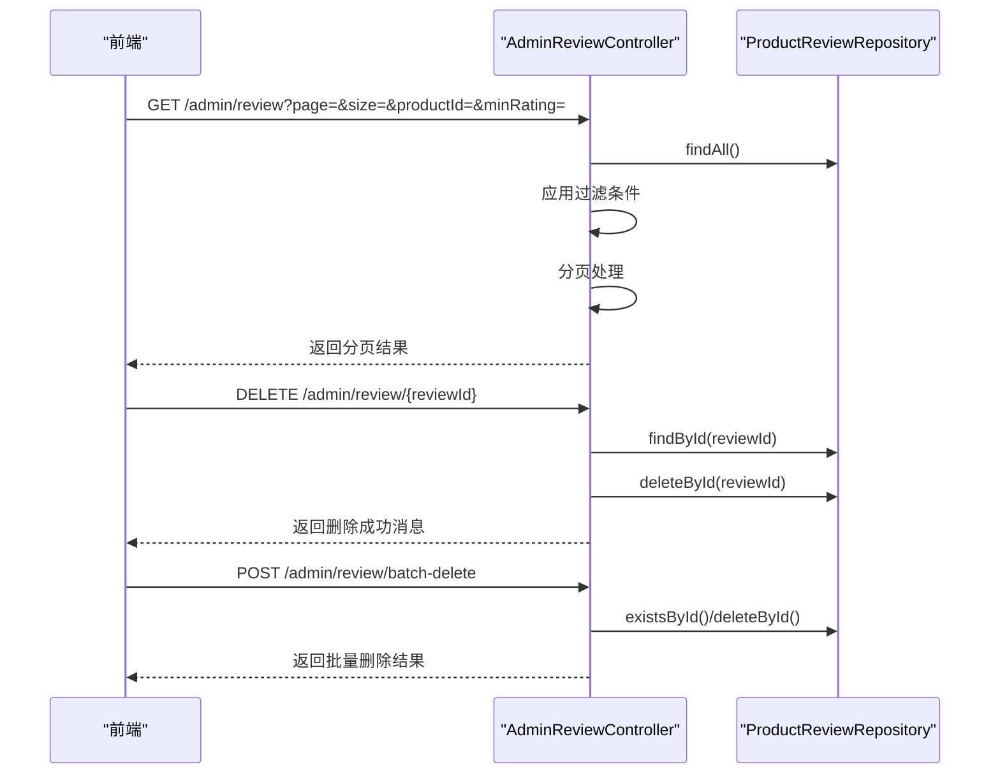
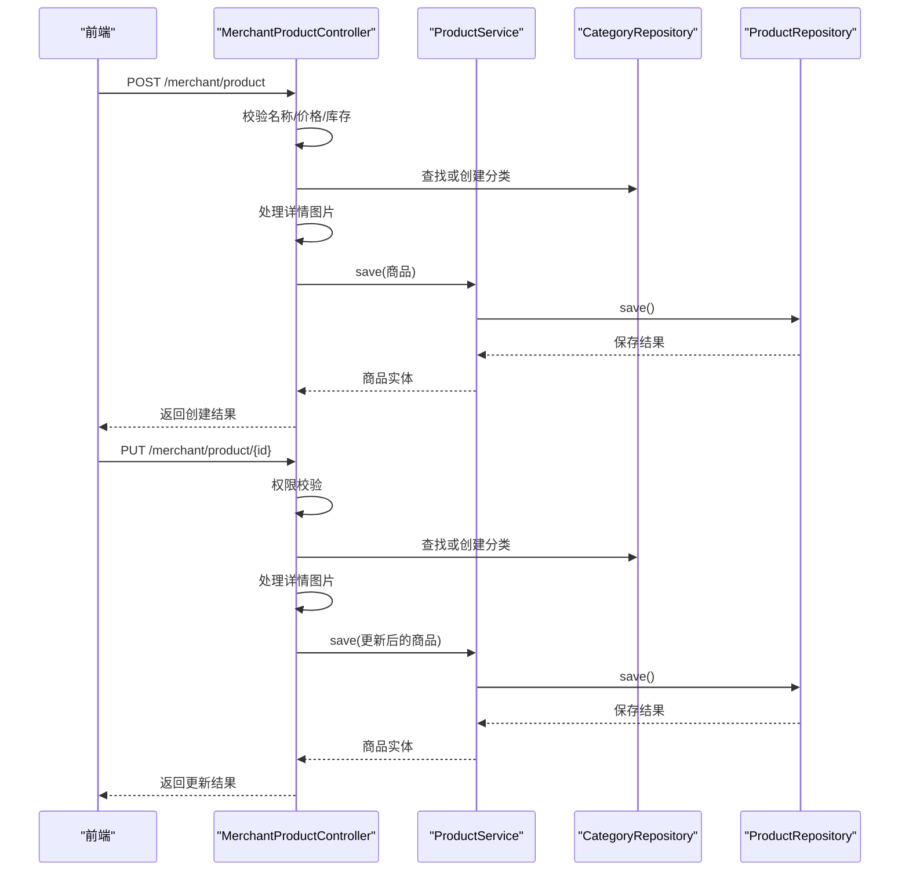
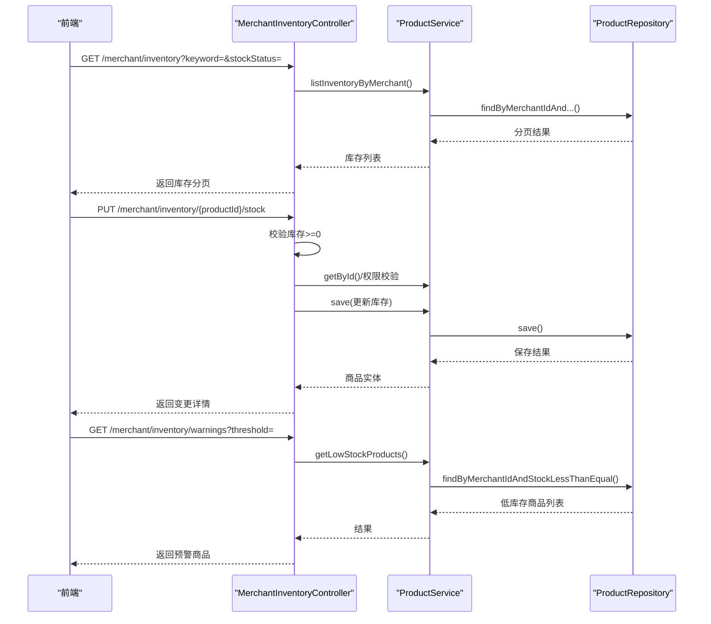
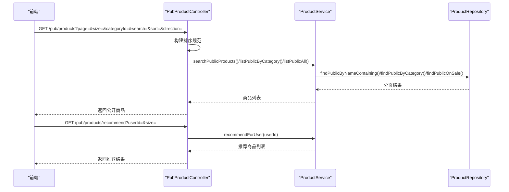
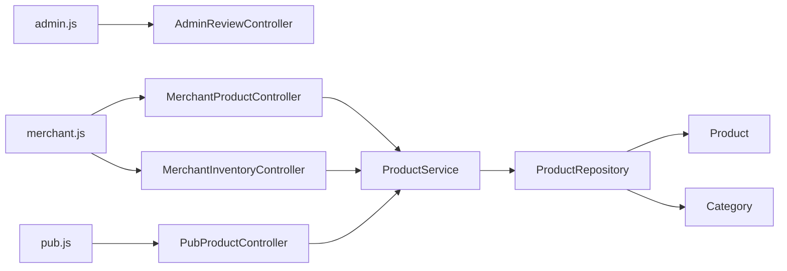

# 商品管理接口

<cite>
**本文档引用的文件**
- [AdminReviewController.java](file://backend/src/main/java/com/mall/controller/admin/AdminReviewController.java)
- [MerchantProductController.java](file://backend/src/main/java/com/mall/controller/merchant/MerchantProductController.java)
- [PubProductController.java](file://backend/src/main/java/com/mall/controller/pub/PubProductController.java)
- [ProductService.java](file://backend/src/main/java/com/mall/service/ProductService.java)
- [Product.java](file://backend/src/main/java/com/mall/entity/Product.java)
- [ProductRepository.java](file://backend/src/main/java/com/mall/repository/ProductRepository.java)
- [ProductCreateRequest.java](file://backend/src/main/java/com/mall/dto/ProductCreateRequest.java)
- [MerchantInventoryController.java](file://backend/src/main/java/com/mall/controller/merchant/MerchantInventoryController.java)
- [AdminCategoryController.java](file://backend/src/main/java/com/mall/controller/admin/AdminCategoryController.java)
- [Category.java](file://backend/src/main/java/com/mall/entity/Category.java)
- [application.yml](file://backend/src/main/resources/application.yml)
- [admin.js](file://frontend/src/api/admin.js)
- [merchant.js](file://frontend/src/api/merchant.js)
- [pub.js](file://frontend/src/api/pub.js)
</cite>

## 目录
1. [简介](#简介)
2. [项目结构](#项目结构)
3. [核心组件](#核心组件)
4. [架构总览](#架构总览)
5. [详细组件分析](#详细组件分析)
6. [依赖分析](#依赖分析)
7. [性能考虑](#性能考虑)
8. [故障排除指南](#故障排除指南)
9. [结论](#结论)
10. [附录](#附录)

## 简介
本文件为电商商城系统的商品管理接口文档，覆盖以下核心功能：
- 商品审核接口：商品上架审核、违规商品处理
- 商品信息管理接口：商品资料更新、分类调整
- 商品状态控制接口：上下架管理、库存预警
- 商品统计分析接口：新品、销量排行、搜索、推荐等
- 商品审核标准、质量控制、违规处理等相关业务规则

系统采用前后端分离架构，后端基于 Spring Boot，前端基于 Vue.js，通过 RESTful API 进行交互。

## 项目结构
后端采用分层架构，按角色划分控制器包：
- admin：管理端接口（商品、分类、订单、评价等）
- merchant：运营端接口（商品、库存、订单、评价等）
- pub：公共接口（商品列表、详情、搜索、推荐等）

**图表来源**
- [AdminReviewController.java:16-91](file://backend/src/main/java/com/mall/controller/admin/AdminReviewController.java#L16-L91)
- [MerchantProductController.java:18-179](file://backend/src/main/java/com/mall/controller/merchant/MerchantProductController.java#L18-L179)
- [MerchantInventoryController.java:16-117](file://backend/src/main/java/com/mall/controller/merchant/MerchantInventoryController.java#L16-L117)
- [PubProductController.java:15-94](file://backend/src/main/java/com/mall/controller/pub/PubProductController.java#L15-L94)
- [ProductService.java:15-125](file://backend/src/main/java/com/mall/service/ProductService.java#L15-L125)
- [ProductRepository.java:12-124](file://backend/src/main/java/com/mall/repository/ProductRepository.java#L12-L124)
- [Product.java:9-100](file://backend/src/main/java/com/mall/entity/Product.java#L9-L100)
- [Category.java:8-40](file://backend/src/main/java/com/mall/entity/Category.java#L8-L40)
- [admin.js:1-129](file://frontend/src/api/admin.js#L1-L129)
- [merchant.js:1-135](file://frontend/src/api/merchant.js#L1-L135)
- [pub.js:1-74](file://frontend/src/api/pub.js#L1-L74)

**章节来源**
- [application.yml:1-36](file://backend/src/main/resources/application.yml#L1-L36)

## 核心组件
- 商品实体（Product）：包含商品基本信息、价格、库存、上下架状态、新品标识等字段
- 商品仓储（ProductRepository）：提供商品查询、分页、搜索、库存筛选等数据库操作
- 商品服务（ProductService）：封装商品业务逻辑，包括公开接口、运营接口、库存管理
- 控制器层：
  - 管理端：AdminReviewController（评价管理）
  - 运营端：MerchantProductController（商品管理）、MerchantInventoryController（库存管理）
  - 公共端：PubProductController（商品列表、详情、搜索、推荐）

**章节来源**
- [Product.java:16-100](file://backend/src/main/java/com/mall/entity/Product.java#L16-L100)
- [ProductRepository.java:13-124](file://backend/src/main/java/com/mall/repository/ProductRepository.java#L13-L124)
- [ProductService.java:15-125](file://backend/src/main/java/com/mall/service/ProductService.java#L15-L125)
- [AdminReviewController.java:16-91](file://backend/src/main/java/com/mall/controller/admin/AdminReviewController.java#L16-L91)
- [MerchantProductController.java:18-179](file://backend/src/main/java/com/mall/controller/merchant/MerchantProductController.java#L18-L179)
- [MerchantInventoryController.java:16-117](file://backend/src/main/java/com/mall/controller/merchant/MerchantInventoryController.java#L16-L117)
- [PubProductController.java:15-94](file://backend/src/main/java/com/mall/controller/pub/PubProductController.java#L15-L94)

## 架构总览
系统通过 RESTful API 提供商品管理能力，前端通过统一请求封装调用后端接口。后端控制器负责接收请求、参数校验、权限检查，并调用服务层完成业务处理，最终返回统一结果包装。

**图表来源**
- [MerchantProductController.java:56-114](file://backend/src/main/java/com/mall/controller/merchant/MerchantProductController.java#L56-L114)
- [ProductService.java:84-92](file://backend/src/main/java/com/mall/service/ProductService.java#L84-L92)
- [ProductRepository.java:13-124](file://backend/src/main/java/com/mall/repository/ProductRepository.java#L13-L124)

## 详细组件分析

### 商品审核接口
管理端提供评价审核与违规处理能力，支持分页查询、删除单条与批量删除评价。

- 接口概览
  - GET /admin/review：分页查询评价，支持按商品ID与最低评分过滤
  - DELETE /admin/review/{reviewId}：删除单条评价
  - POST /admin/review/batch-delete：批量删除评价

- 关键流程
  - 分页查询：先加载全部评价，再应用过滤条件，最后分页返回
  - 删除流程：先验证存在性，再执行删除，支持批量删除并统计成功数量

**图表来源**
- [AdminReviewController.java:24-90](file://backend/src/main/java/com/mall/controller/admin/AdminReviewController.java#L24-L90)

**章节来源**
- [AdminReviewController.java:16-91](file://backend/src/main/java/com/mall/controller/admin/AdminReviewController.java#L16-L91)

### 商品信息管理接口
运营端提供商品的增删改查与分类调整能力，支持按分类名自动创建分类、详情图片处理等。

- 接口概览
  - GET /merchant/product：分页查询当前运营的商品
  - GET /merchant/product/{id}：查询当前运营的商品详情
  - POST /merchant/product：创建商品（支持自定义分类名）
  - PUT /merchant/product/{id}：更新商品
  - DELETE /merchant/product/{id}：删除商品

- 关键流程
  - 创建流程：参数校验（名称、价格、库存），处理分类（自定义分类名自动创建/查找），处理详情图片，构建商品实体并保存
  - 更新流程：权限校验（商品归属运营），处理分类与图片，更新商品字段并保存
  - 删除流程：权限校验后删除

**图表来源**
- [MerchantProductController.java:56-167](file://backend/src/main/java/com/mall/controller/merchant/MerchantProductController.java#L56-L167)
- [ProductService.java:84-87](file://backend/src/main/java/com/mall/service/ProductService.java#L84-L87)

**章节来源**
- [MerchantProductController.java:18-179](file://backend/src/main/java/com/mall/controller/merchant/MerchantProductController.java#L18-L179)
- [ProductCreateRequest.java:14-31](file://backend/src/main/java/com/mall/dto/ProductCreateRequest.java#L14-L31)

### 商品状态控制接口
运营端提供库存管理与上下架控制能力，支持库存查询、调整、预警等功能。

- 接口概览
  - GET /merchant/inventory：分页查询库存（支持关键词与库存状态过滤）
  - PUT /merchant/inventory/{productId}/stock：调整单个商品库存
  - PUT /merchant/inventory/batch-stock：批量调整库存
  - GET /merchant/inventory/warnings：获取库存预警商品

- 关键流程
  - 库存查询：支持关键词与库存状态（缺货、低库存、正常）过滤
  - 库存调整：参数校验（库存>=0），权限校验（商品归属运营），执行更新并返回变更详情
  - 预警查询：根据阈值返回低库存商品列表

**图表来源**
- [MerchantInventoryController.java:33-117](file://backend/src/main/java/com/mall/controller/merchant/MerchantInventoryController.java#L33-L117)
- [ProductService.java:94-124](file://backend/src/main/java/com/mall/service/ProductService.java#L94-L124)
- [ProductRepository.java:107-123](file://backend/src/main/java/com/mall/repository/ProductRepository.java#L107-L123)

**章节来源**
- [MerchantInventoryController.java:16-117](file://backend/src/main/java/com/mall/controller/merchant/MerchantInventoryController.java#L16-L117)
- [ProductService.java:94-125](file://backend/src/main/java/com/mall/service/ProductService.java#L94-L125)

### 商品统计分析接口
公共端提供商品列表、详情、搜索、新品、销量排行、个性化推荐等能力。

- 接口概览
  - GET /pub/products：分页查询公开商品，支持分类过滤、搜索、排序
  - GET /pub/products/{id}：查询公开商品详情
  - GET /pub/products/new：获取新品列表
  - GET /pub/products/rank：获取销量排行
  - GET /pub/products/recommend：个性化推荐（需传userId）

- 关键流程
  - 列表查询：支持关键词搜索、分类过滤、排序（价格、销量、创建时间）
  - 公开展示：仅返回“上架且运营启用”的商品
  - 推荐：基于协同过滤算法生成推荐列表

**图表来源**
- [PubProductController.java:24-93](file://backend/src/main/java/com/mall/controller/pub/PubProductController.java#L24-L93)
- [ProductService.java:79-82](file://backend/src/main/java/com/mall/service/ProductService.java#L79-L82)
- [ProductRepository.java:32-105](file://backend/src/main/java/com/mall/repository/ProductRepository.java#L32-L105)

**章节来源**
- [PubProductController.java:15-94](file://backend/src/main/java/com/mall/controller/pub/PubProductController.java#L15-L94)
- [ProductService.java:42-82](file://backend/src/main/java/com/mall/service/ProductService.java#L42-L82)

### 商品审核标准与质量控制
- 审核范围：管理端评价审核，支持按商品ID与最低评分过滤
- 质量控制：运营端商品创建/更新时进行基础参数校验（名称、价格、库存）
- 违规处理：支持删除单条与批量删除评价，确保内容合规

**章节来源**
- [AdminReviewController.java:24-90](file://backend/src/main/java/com/mall/controller/admin/AdminReviewController.java#L24-L90)
- [MerchantProductController.java:56-67](file://backend/src/main/java/com/mall/controller/merchant/MerchantProductController.java#L56-L67)

## 依赖分析
- 控制器依赖服务层，服务层依赖仓储层
- 商品实体与分类实体通过仓储层持久化
- 前端通过统一请求封装调用后端接口

**图表来源**
- [admin.js:113-128](file://frontend/src/api/admin.js#L113-L128)
- [merchant.js:13-88](file://frontend/src/api/merchant.js#L13-L88)
- [pub.js:8-31](file://frontend/src/api/pub.js#L8-L31)
- [MerchantProductController.java:24-26](file://backend/src/main/java/com/mall/controller/merchant/MerchantProductController.java#L24-L26)
- [MerchantInventoryController.java:22-23](file://backend/src/main/java/com/mall/controller/merchant/MerchantInventoryController.java#L22-L23)
- [PubProductController.java:21-22](file://backend/src/main/java/com/mall/controller/pub/PubProductController.java#L21-L22)
- [ProductService.java:20-20](file://backend/src/main/java/com/mall/service/ProductService.java#L20-L20)
- [ProductRepository.java:13-13](file://backend/src/main/java/com/mall/repository/ProductRepository.java#L13-L13)
- [Product.java:16-16](file://backend/src/main/java/com/mall/entity/Product.java#L16-L16)
- [Category.java:15-15](file://backend/src/main/java/com/mall/entity/Category.java#L15-L15)

**章节来源**
- [admin.js:1-129](file://frontend/src/api/admin.js#L1-L129)
- [merchant.js:1-135](file://frontend/src/api/merchant.js#L1-L135)
- [pub.js:1-74](file://frontend/src/api/pub.js#L1-L74)

## 性能考虑
- 分页查询：后端使用 PageRequest 进行分页，避免一次性加载大量数据
- 查询优化：公开接口仅返回“上架且运营启用”的商品，减少无效数据传输
- 排序与搜索：支持按价格、销量、创建时间排序，搜索使用模糊匹配，建议在数据库层面建立索引以提升性能
- 批量操作：提供批量调整库存接口，减少多次网络往返

## 故障排除指南
- 商品不存在或无权限
  - 现象：返回“商品不存在”或“无权限操作”
  - 处理：确认商品ID正确性与运营归属关系
- 库存参数非法
  - 现象：返回“库存数量必须大于等于0”
  - 处理：确保库存值为非负数
- 评价不存在
  - 现象：返回“评价不存在”
  - 处理：确认评价ID正确性
- 分类管理异常
  - 现象：分类创建/更新失败
  - 处理：检查分类名称唯一性与父级ID有效性

**章节来源**
- [MerchantProductController.java:50-53](file://backend/src/main/java/com/mall/controller/merchant/MerchantProductController.java#L50-L53)
- [MerchantInventoryController.java:54-56](file://backend/src/main/java/com/mall/controller/merchant/MerchantInventoryController.java#L54-L56)
- [AdminReviewController.java:70-72](file://backend/src/main/java/com/mall/controller/admin/AdminReviewController.java#L70-L72)

## 结论
本商品管理接口体系覆盖了从运营端到管理端的完整商品生命周期管理需求，包括商品信息维护、库存控制、公开展示与统计分析。通过清晰的分层架构与统一的响应格式，系统具备良好的可扩展性与可维护性。建议后续在数据库层面增加必要的索引以提升查询性能，并完善更细粒度的权限控制与审计日志。

## 附录
- 统一响应格式：所有接口返回 Result 包装的结果，包含状态码与数据
- 前端调用：通过 admin.js、merchant.js、pub.js 封装各端 API 调用
- 数据库配置：MySQL 数据源与 JPA 配置位于 application.yml

**章节来源**
- [application.yml:4-25](file://backend/src/main/resources/application.yml#L4-L25)
- [admin.js:1-129](file://frontend/src/api/admin.js#L1-L129)
- [merchant.js:1-135](file://frontend/src/api/merchant.js#L1-L135)
- [pub.js:1-74](file://frontend/src/api/pub.js#L1-L74)