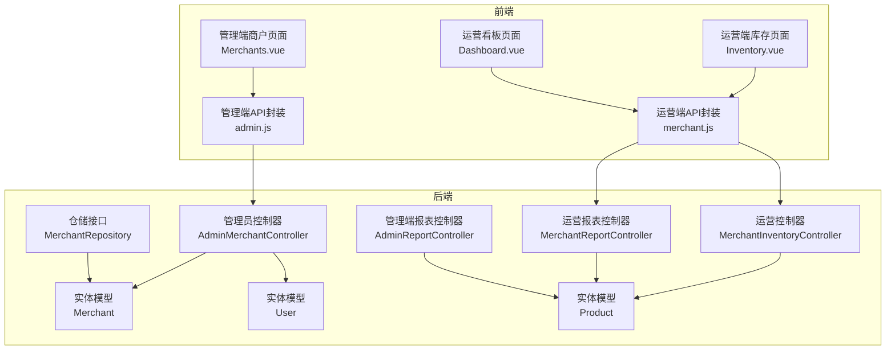
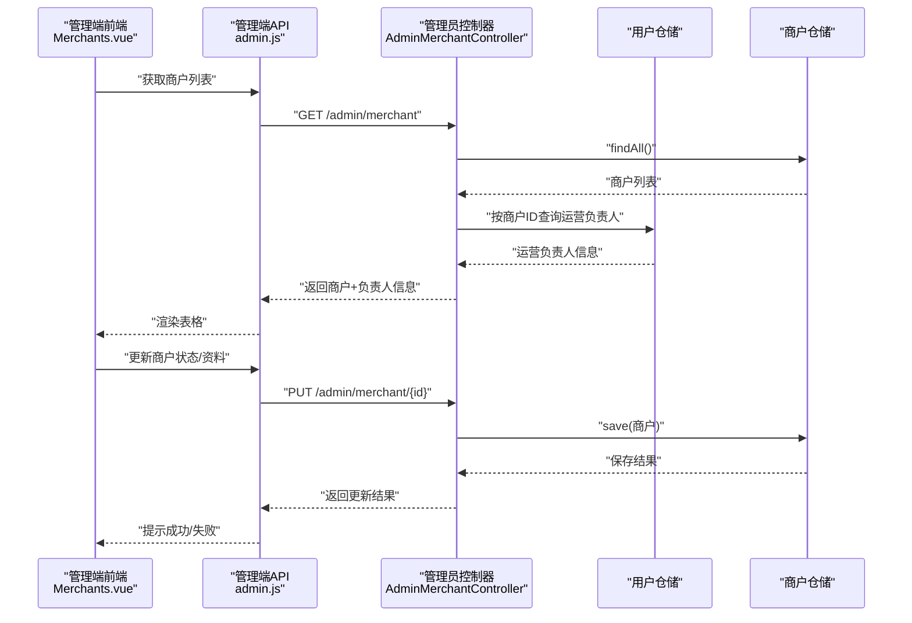
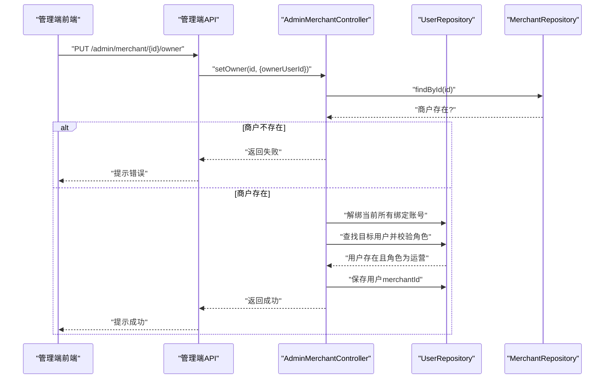
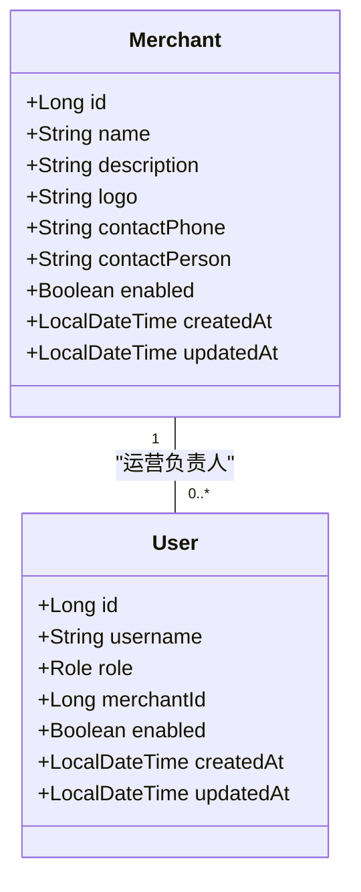
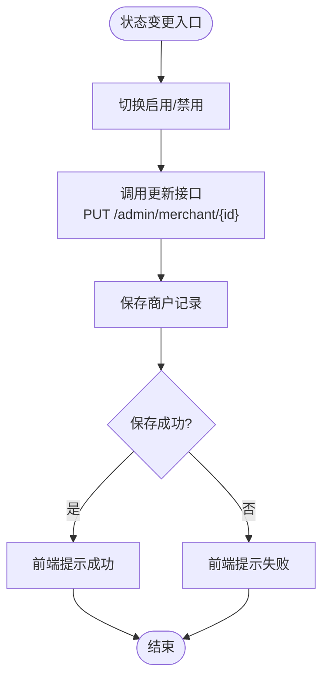
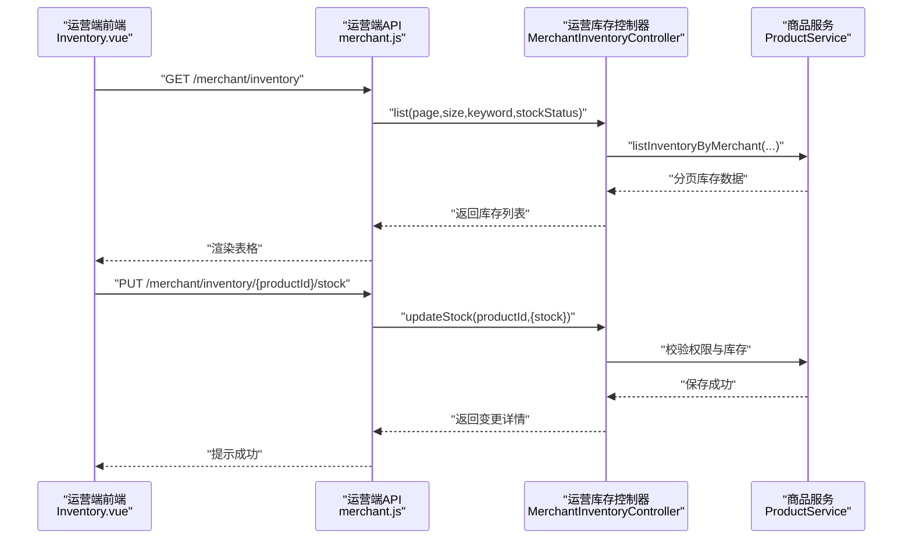
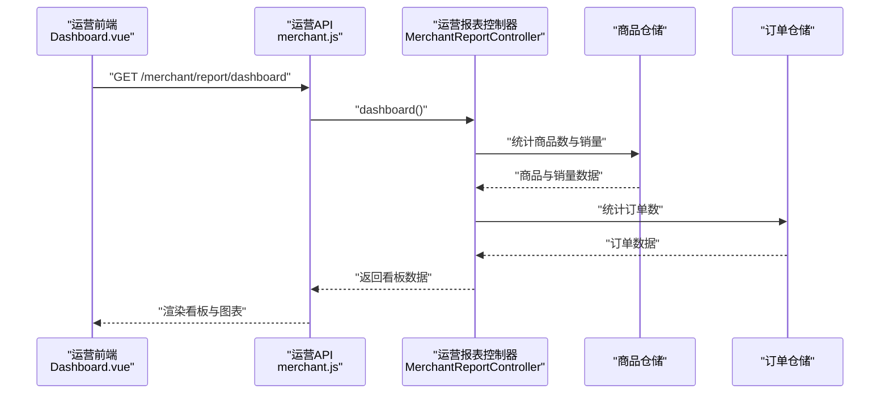
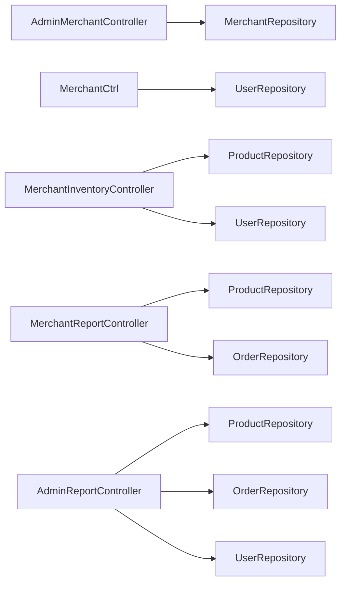

# 商户管理接口

<cite>
**本文档引用的文件**
- [AdminMerchantController.java](file://backend/src/main/java/com/mall/controller/admin/AdminMerchantController.java)
- [Merchant.java](file://backend/src/main/java/com/mall/entity/Merchant.java)
- [MerchantRepository.java](file://backend/src/main/java/com/mall/repository/MerchantRepository.java)
- [User.java](file://backend/src/main/java/com/mall/entity/User.java)
- [Role.java](file://backend/src/main/java/com/mall/common/Role.java)
- [admin.js](file://frontend/src/api/admin.js)
- [Merchants.vue](file://frontend/src/views/admin/Merchants.vue)
- [MerchantInventoryController.java](file://backend/src/main/java/com/mall/controller/merchant/MerchantInventoryController.java)
- [Product.java](file://backend/src/main/java/com/mall/entity/Product.java)
- [merchant.js](file://frontend/src/api/merchant.js)
- [Inventory.vue](file://frontend/src/views/merchant/Inventory.vue)
- [MerchantReportController.java](file://backend/src/main/java/com/mall/controller/merchant/MerchantReportController.java)
- [AdminReportController.java](file://backend/src/main/java/com/mall/controller/admin/AdminReportController.java)
- [Dashboard.vue](file://frontend/src/views/merchant/Dashboard.vue)
- [application.yml](file://backend/src/main/resources/application.yml)
</cite>

## 目录
1. [简介](#简介)
2. [项目结构](#项目结构)
3. [核心组件](#核心组件)
4. [架构总览](#架构总览)
5. [详细组件分析](#详细组件分析)
6. [依赖关系分析](#依赖关系分析)
7. [性能考虑](#性能考虑)
8. [故障排除指南](#故障排除指南)
9. [结论](#结论)

## 简介
本文件为电商商城系统的商户管理接口权威API文档，覆盖以下核心功能：
- 商户审核与状态控制：商户资质审核、启用/禁用状态变更、违规处理
- 商户信息管理：商户资料更新、等级管理（通过扩展字段实现）
- 商户状态控制：营业许可管理、违规处理
- 商户统计分析：运营看板、销量分布、库存预警

文档基于后端Spring Boot控制器、实体模型与前端Vue页面的完整实现进行梳理，提供接口定义、数据模型、调用流程与错误处理说明。

## 项目结构
系统采用前后端分离架构，后端使用Spring Boot + JPA，前端使用Vue + Element UI + ECharts。商户管理相关模块主要分布在：
- 后端控制器：管理员端商户管理、运营端库存与报表
- 实体模型：商户、用户、商品等
- 前端API封装与页面视图：管理端商户列表、运营端库存与看板

**图表来源**
- [AdminMerchantController.java:17-122](file://backend/src/main/java/com/mall/controller/admin/AdminMerchantController.java#L17-L122)
- [MerchantInventoryController.java:16-118](file://backend/src/main/java/com/mall/controller/merchant/MerchantInventoryController.java#L16-L118)
- [MerchantReportController.java:23-80](file://backend/src/main/java/com/mall/controller/merchant/MerchantReportController.java#L23-L80)
- [AdminReportController.java:23-176](file://backend/src/main/java/com/mall/controller/admin/AdminReportController.java#L23-L176)
- [Merchant.java:8-56](file://backend/src/main/java/com/mall/entity/Merchant.java#L8-L56)
- [User.java:10-88](file://backend/src/main/java/com/mall/entity/User.java#L10-L88)
- [Product.java:9-101](file://backend/src/main/java/com/mall/entity/Product.java#L9-L101)
- [MerchantRepository.java:7-9](file://backend/src/main/java/com/mall/repository/MerchantRepository.java#L7-L9)
- [admin.js:33-56](file://frontend/src/api/admin.js#L33-L56)
- [merchant.js:53-105](file://frontend/src/api/merchant.js#L53-L105)
- [Merchants.vue:1-199](file://frontend/src/views/admin/Merchants.vue#L1-L199)
- [Inventory.vue:1-372](file://frontend/src/views/merchant/Inventory.vue#L1-L372)
- [Dashboard.vue:1-94](file://frontend/src/views/merchant/Dashboard.vue#L1-L94)

**章节来源**
- [application.yml:1-36](file://backend/src/main/resources/application.yml#L1-L36)

## 核心组件
- 管理端商户控制器：提供商户列表、创建、更新、删除、绑定/解绑运营负责人等能力
- 运营端库存控制器：提供库存查询、调整、批量调整、库存预警
- 运营端报表控制器：提供运营看板数据与销量分布
- 管理端报表控制器：提供平台级看板数据与趋势分析
- 实体模型：商户、用户、商品，支撑商户与运营的关联与权限校验

**章节来源**
- [AdminMerchantController.java:26-121](file://backend/src/main/java/com/mall/controller/admin/AdminMerchantController.java#L26-L121)
- [MerchantInventoryController.java:33-118](file://backend/src/main/java/com/mall/controller/merchant/MerchantInventoryController.java#L33-L118)
- [MerchantReportController.java:41-79](file://backend/src/main/java/com/mall/controller/merchant/MerchantReportController.java#L41-L79)
- [AdminReportController.java:33-175](file://backend/src/main/java/com/mall/controller/admin/AdminReportController.java#L33-L175)
- [Merchant.java:15-56](file://backend/src/main/java/com/mall/entity/Merchant.java#L15-L56)
- [User.java:17-88](file://backend/src/main/java/com/mall/entity/User.java#L17-L88)
- [Product.java:16-101](file://backend/src/main/java/com/mall/entity/Product.java#L16-L101)

## 架构总览
系统通过REST接口暴露商户管理能力，前端通过统一的API封装调用后端控制器。权限通过用户角色与商户绑定关系实现，运营端接口通过认证上下文解析当前商户ID，确保数据隔离与操作权限。

**图表来源**
- [Merchants.vue:115-149](file://frontend/src/views/admin/Merchants.vue#L115-L149)
- [admin.js:33-51](file://frontend/src/api/admin.js#L33-L51)
- [AdminMerchantController.java:26-70](file://backend/src/main/java/com/mall/controller/admin/AdminMerchantController.java#L26-L70)
- [MerchantRepository.java:7-9](file://backend/src/main/java/com/mall/repository/MerchantRepository.java#L7-L9)
- [User.java:17-88](file://backend/src/main/java/com/mall/entity/User.java#L17-L88)

## 详细组件分析

### 管理端商户管理接口
- 接口概览
  - GET /admin/merchant：查询商户列表，附带所属运营负责人信息
  - POST /admin/merchant：新建商户
  - PUT /admin/merchant/{id}：更新商户信息
  - DELETE /admin/merchant/{id}：删除商户
  - PUT /admin/merchant/{id}/owner：绑定/解绑运营负责人账号
  - GET /admin/merchant/{id}：查询单个商户详情

- 关键逻辑
  - 列表查询时，按商户ID查询运营负责人（sys_user.merchant_id），并返回用户名、昵称等
  - 绑定/解绑逻辑：先解绑当前商户所有绑定账号，再检查目标用户是否为运营角色，最后保存
  - 更新与创建均通过JPA仓储持久化

**图表来源**
- [AdminMerchantController.java:76-105](file://backend/src/main/java/com/mall/controller/admin/AdminMerchantController.java#L76-L105)
- [User.java:56-62](file://backend/src/main/java/com/mall/entity/User.java#L56-L62)
- [Role.java:3-7](file://backend/src/main/java/com/mall/common/Role.java#L3-L7)

**章节来源**
- [AdminMerchantController.java:26-121](file://backend/src/main/java/com/mall/controller/admin/AdminMerchantController.java#L26-L121)
- [admin.js:33-56](file://frontend/src/api/admin.js#L33-L56)
- [Merchants.vue:104-181](file://frontend/src/views/admin/Merchants.vue#L104-L181)

### 商户信息管理接口
- 接口概览
  - GET /admin/merchant：返回商户基础信息与负责人信息
  - POST /admin/merchant：创建新商户
  - PUT /admin/merchant/{id}：更新商户资料（名称、描述、启用状态、联系方式等）
  - DELETE /admin/merchant/{id}：删除商户

- 数据模型
  - 商户实体包含名称、描述、Logo、联系电话、联系人、启用状态、创建/更新时间等字段
  - 通过PrePersist/PreUpdate自动维护时间戳

**图表来源**
- [Merchant.java:15-56](file://backend/src/main/java/com/mall/entity/Merchant.java#L15-L56)
- [User.java:17-88](file://backend/src/main/java/com/mall/entity/User.java#L17-L88)
- [Role.java:3-7](file://backend/src/main/java/com/mall/common/Role.java#L3-L7)

**章节来源**
- [Merchant.java:15-56](file://backend/src/main/java/com/mall/entity/Merchant.java#L15-L56)
- [AdminMerchantController.java:26-70](file://backend/src/main/java/com/mall/controller/admin/AdminMerchantController.java#L26-L70)

### 商户状态控制接口
- 启用/禁用控制
  - 通过更新商户的enabled字段实现状态变更
  - 前端通过开关控件触发更新请求

- 违规处理
  - 当前实现未提供专门的违规处理接口，可通过扩展enabled字段或新增状态枚举实现
  - 建议在商户实体中增加状态字段（如正常、违规封禁、待审核等）

**图表来源**
- [Merchants.vue:140-149](file://frontend/src/views/admin/Merchants.vue#L140-L149)
- [AdminMerchantController.java:65-70](file://backend/src/main/java/com/mall/controller/admin/AdminMerchantController.java#L65-L70)

**章节来源**
- [Merchants.vue:140-149](file://frontend/src/views/admin/Merchants.vue#L140-L149)

### 商户库存管理接口
- 接口概览
  - GET /merchant/inventory：分页查询当前运营的商品库存，支持关键词与库存状态筛选
  - PUT /merchant/inventory/{productId}/stock：调整单个商品库存
  - PUT /merchant/inventory/batch-stock：批量调整库存
  - GET /merchant/inventory/warnings：获取库存预警商品（默认阈值10）

- 关键逻辑
  - 通过认证上下文解析当前运营ID，确保只能操作自己名下的商品
  - 库存调整前进行权限校验与数值合法性检查
  - 批量调整对每个商品执行相同校验

**图表来源**
- [Inventory.vue:340-372](file://frontend/src/views/merchant/Inventory.vue#L340-L372)
- [merchant.js:53-88](file://frontend/src/api/merchant.js#L53-L88)
- [MerchantInventoryController.java:33-118](file://backend/src/main/java/com/mall/controller/merchant/MerchantInventoryController.java#L33-L118)
- [Product.java:16-101](file://backend/src/main/java/com/mall/entity/Product.java#L16-L101)

**章节来源**
- [MerchantInventoryController.java:33-118](file://backend/src/main/java/com/mall/controller/merchant/MerchantInventoryController.java#L33-L118)
- [merchant.js:53-88](file://frontend/src/api/merchant.js#L53-L88)
- [Inventory.vue:340-372](file://frontend/src/views/merchant/Inventory.vue#L340-L372)

### 商户统计分析接口
- 运营看板
  - GET /merchant/report/dashboard：返回商品数、订单数、销量Top商品扇形图数据
  - 销量Top10商品合并为“其他”类别，便于图表展示

- 管理端看板
  - GET /admin/report/dashboard：返回用户数、商品数、订单数、总销售额、最近7天订单趋势、分类销售占比、用户增长趋势、商品状态分布

**图表来源**
- [Dashboard.vue:34-71](file://frontend/src/views/merchant/Dashboard.vue#L34-L71)
- [merchant.js:1-20](file://frontend/src/api/merchant.js#L1-L20)
- [MerchantReportController.java:41-79](file://backend/src/main/java/com/mall/controller/merchant/MerchantReportController.java#L41-L79)
- [Product.java:16-101](file://backend/src/main/java/com/mall/entity/Product.java#L16-L101)

**章节来源**
- [MerchantReportController.java:41-79](file://backend/src/main/java/com/mall/controller/merchant/MerchantReportController.java#L41-L79)
- [AdminReportController.java:33-175](file://backend/src/main/java/com/mall/controller/admin/AdminReportController.java#L33-L175)
- [Dashboard.vue:34-71](file://frontend/src/views/merchant/Dashboard.vue#L34-L71)

## 依赖关系分析
- 控制器依赖仓储与服务层，实现业务逻辑与数据持久化分离
- 实体模型通过JPA注解映射数据库表，维护时间戳与外键关系
- 前端通过API封装统一调用后端接口，页面负责数据展示与交互

**图表来源**
- [AdminMerchantController.java:23-24](file://backend/src/main/java/com/mall/controller/admin/AdminMerchantController.java#L23-L24)
- [MerchantInventoryController.java:22-23](file://backend/src/main/java/com/mall/controller/merchant/MerchantInventoryController.java#L22-L23)
- [MerchantReportController.java:29-31](file://backend/src/main/java/com/mall/controller/merchant/MerchantReportController.java#L29-L31)
- [AdminReportController.java:29-31](file://backend/src/main/java/com/mall/controller/admin/AdminReportController.java#L29-L31)

**章节来源**
- [MerchantRepository.java:7-9](file://backend/src/main/java/com/mall/repository/MerchantRepository.java#L7-L9)
- [User.java:17-88](file://backend/src/main/java/com/mall/entity/User.java#L17-L88)
- [Product.java:16-101](file://backend/src/main/java/com/mall/entity/Product.java#L16-L101)

## 性能考虑
- 分页查询：库存与报表接口均支持分页参数，避免一次性加载大量数据
- 条件过滤：库存查询支持关键词与库存状态过滤，减少无关数据传输
- 时间戳维护：实体预处理方法自动维护创建/更新时间，减少业务层重复逻辑
- 前端图表：ECharts按需渲染，避免不必要的重绘

[本节为通用性能建议，不直接分析具体文件]

## 故障排除指南
- 绑定运营负责人失败
  - 可能原因：商户不存在、目标用户不存在、用户角色非运营
  - 建议排查：确认商户ID与用户ID正确性，检查用户角色是否为运营

- 更新商户状态失败
  - 可能原因：网络异常、权限不足、数据冲突
  - 建议排查：检查前端提示与后端日志，确认请求参数与认证信息

- 库存调整异常
  - 可能原因：库存数量小于0、商品不属于当前运营、权限不足
  - 建议排查：核对库存数值范围与商品归属，确认认证上下文解析的运营ID

**章节来源**
- [AdminMerchantController.java:76-105](file://backend/src/main/java/com/mall/controller/admin/AdminMerchantController.java#L76-L105)
- [MerchantInventoryController.java:46-108](file://backend/src/main/java/com/mall/controller/merchant/MerchantInventoryController.java#L46-L108)

## 结论
本系统提供了完整的商户管理能力，涵盖商户信息管理、状态控制、库存管理与统计分析。通过角色与绑定关系实现运营隔离，前端通过统一API封装简化调用。建议后续扩展违规处理与等级管理等高级功能，进一步完善商户生命周期管理。