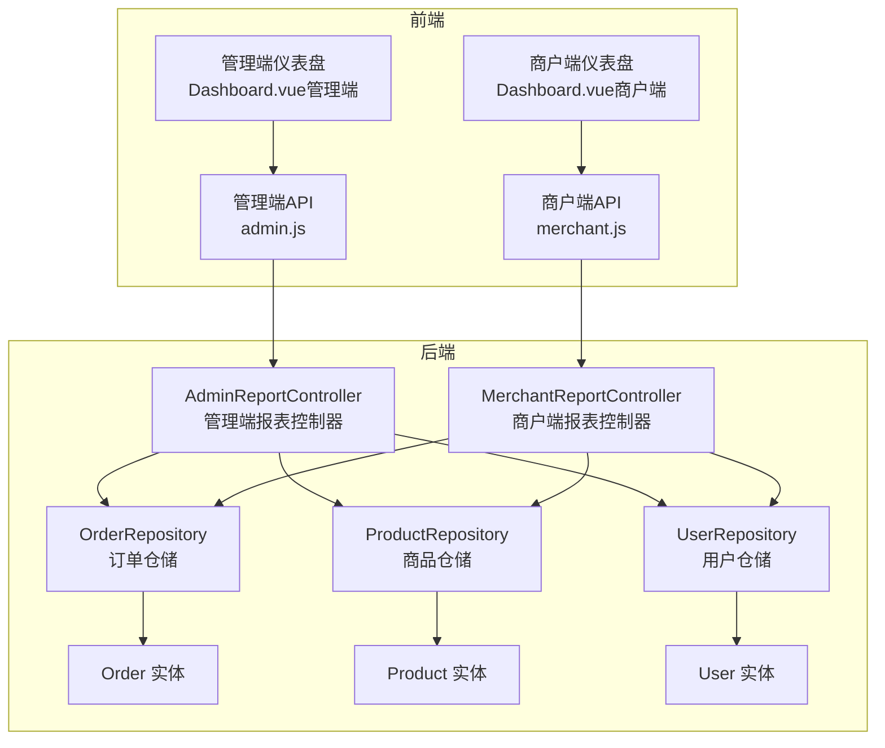
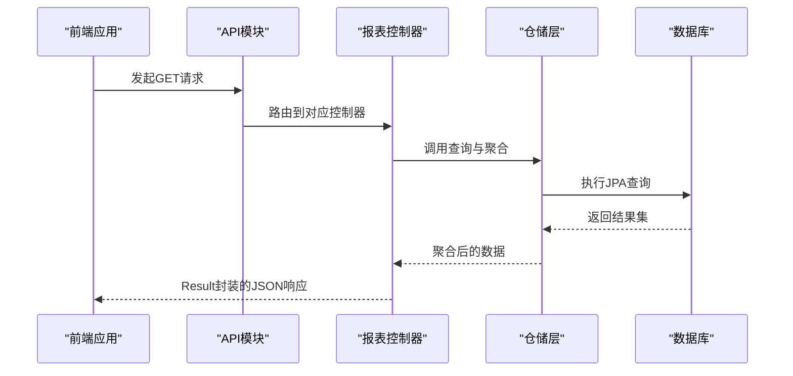
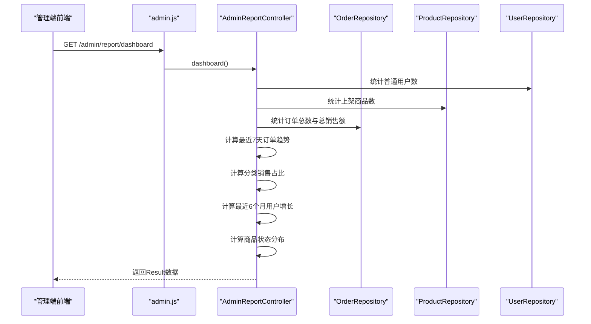
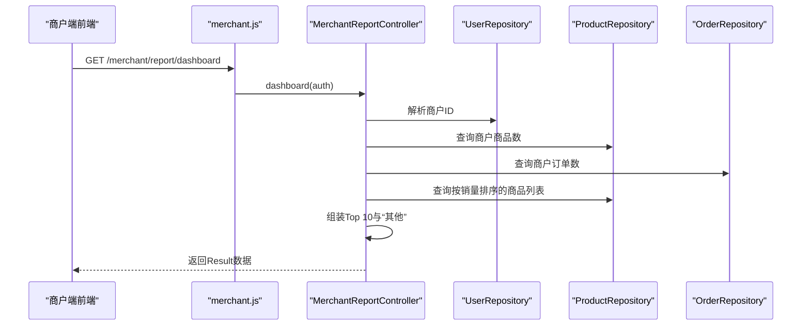
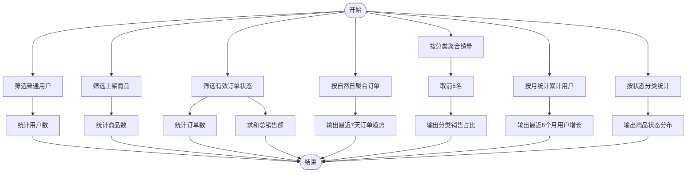
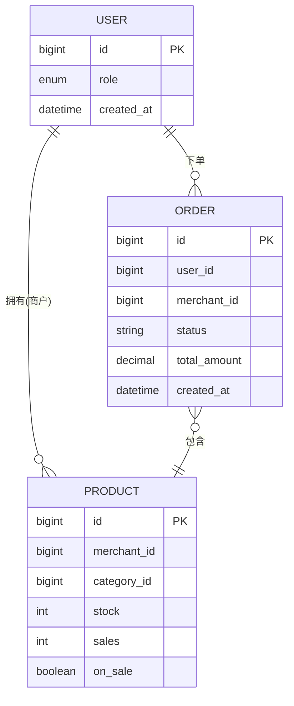
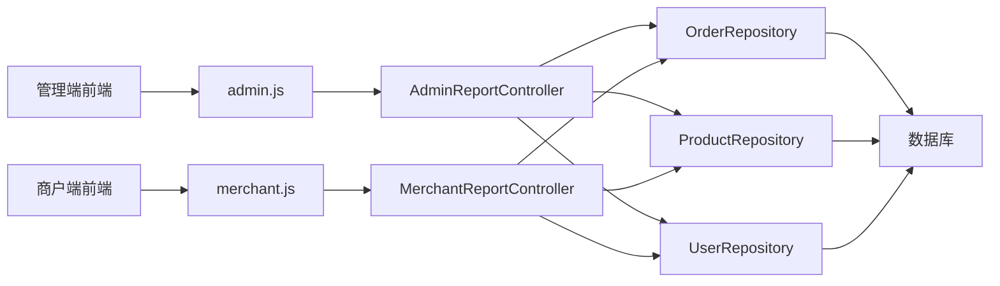

# 报表统计接口

<cite>
**本文档引用的文件**
- [AdminReportController.java](file://backend/src/main/java/com/mall/controller/admin/AdminReportController.java)
- [MerchantReportController.java](file://backend/src/main/java/com/mall/controller/merchant/MerchantReportController.java)
- [Order.java](file://backend/src/main/java/com/mall/entity/Order.java)
- [Product.java](file://backend/src/main/java/com/mall/entity/Product.java)
- [User.java](file://backend/src/main/java/com/mall/entity/User.java)
- [OrderRepository.java](file://backend/src/main/java/com/mall/repository/OrderRepository.java)
- [ProductRepository.java](file://backend/src/main/java/com/mall/repository/ProductRepository.java)
- [UserRepository.java](file://backend/src/main/java/com/mall/repository/UserRepository.java)
- [Dashboard.vue（管理端）](file://frontend/src/views/admin/Dashboard.vue)
- [Dashboard.vue（商户端）](file://frontend/src/views/merchant/Dashboard.vue)
- [admin.js](file://frontend/src/api/admin.js)
- [merchant.js](file://frontend/src/api/merchant.js)
- [application.yml](file://backend/src/main/resources/application.yml)
</cite>

## 目录
1. [简介](#简介)
2. [项目结构](#项目结构)
3. [核心组件](#核心组件)
4. [架构概览](#架构概览)
5. [详细组件分析](#详细组件分析)
6. [依赖关系分析](#依赖关系分析)
7. [性能考虑](#性能考虑)
8. [故障排除指南](#故障排除指南)
9. [结论](#结论)
10. [附录](#附录)

## 简介
本文件为电商商城系统的报表统计接口权威API文档，覆盖平台数据统计（销售总额、订单量、用户增长）、销售分析（商品销售排行、品类分析、地区分布）、用户分析（用户画像、活跃度分析、留存率）、财务报表等核心功能。文档详细说明数据统计口径、报表生成流程、数据可视化实现，并提供代码级架构图与序列图，帮助开发者快速理解并扩展系统。

## 项目结构
后端采用Spring Boot + JPA，前端使用Vue + ECharts进行数据可视化展示。报表接口分为管理端与商户端两类：
- 管理端报表：提供全局看板数据与图表（订单趋势、分类销售占比、用户增长、商品状态分布）
- 商户报表：提供商户维度的看板数据与商品销量扇形图

**图表来源**
- [AdminReportController.java:24-77](file://backend/src/main/java/com/mall/controller/admin/AdminReportController.java#L24-L77)
- [MerchantReportController.java:24-79](file://backend/src/main/java/com/mall/controller/merchant/MerchantReportController.java#L24-L79)
- [OrderRepository.java:13-27](file://backend/src/main/java/com/mall/repository/OrderRepository.java#L13-L27)
- [ProductRepository.java:12-124](file://backend/src/main/java/com/mall/repository/ProductRepository.java#L12-L124)
- [UserRepository.java:10-19](file://backend/src/main/java/com/mall/repository/UserRepository.java#L10-L19)
- [Order.java:16-82](file://backend/src/main/java/com/mall/entity/Order.java#L16-L82)
- [Product.java:16-99](file://backend/src/main/java/com/mall/entity/Product.java#L16-L99)
- [User.java:17-87](file://backend/src/main/java/com/mall/entity/User.java#L17-L87)

**章节来源**
- [AdminReportController.java:24-77](file://backend/src/main/java/com/mall/controller/admin/AdminReportController.java#L24-L77)
- [MerchantReportController.java:24-79](file://backend/src/main/java/com/mall/controller/merchant/MerchantReportController.java#L24-L79)
- [Dashboard.vue（管理端）:1-146](file://frontend/src/views/admin/Dashboard.vue#L1-L146)
- [Dashboard.vue（商户端）:1-32](file://frontend/src/views/merchant/Dashboard.vue#L1-L32)
- [admin.js:8-11](file://frontend/src/api/admin.js#L8-L11)
- [merchant.js:8-11](file://frontend/src/api/merchant.js#L8-L11)

## 核心组件
- 管理端报表控制器：提供平台全局指标与图表数据，包括用户数、商品数、订单数、总销售额、最近7天订单趋势、分类销售占比、最近6个月用户增长、商品状态分布。
- 商户端报表控制器：提供商户维度指标与商品销量扇形图，包括商品数、订单数、Top N商品销量占比（其余合并为“其他”）。
- 数据模型：Order、Product、User实体定义了统计所需的字段与关系。
- 仓储层：OrderRepository、ProductRepository、UserRepository提供查询与聚合能力。

**章节来源**
- [AdminReportController.java:33-77](file://backend/src/main/java/com/mall/controller/admin/AdminReportController.java#L33-L77)
- [MerchantReportController.java:41-79](file://backend/src/main/java/com/mall/controller/merchant/MerchantReportController.java#L41-L79)
- [Order.java:31-36](file://backend/src/main/java/com/mall/entity/Order.java#L31-L36)
- [Product.java:25-78](file://backend/src/main/java/com/mall/entity/Product.java#L25-L78)
- [User.java:56-62](file://backend/src/main/java/com/mall/entity/User.java#L56-L62)

## 架构概览
管理端与商户端分别通过独立的控制器暴露REST接口，前端通过统一的API模块发起请求，后端控制器调用仓储层聚合数据并返回Result包装的响应体。ECharts负责前端图表渲染与交互。

**图表来源**
- [admin.js:8-11](file://frontend/src/api/admin.js#L8-L11)
- [merchant.js:8-11](file://frontend/src/api/merchant.js#L8-L11)
- [AdminReportController.java:34-77](file://backend/src/main/java/com/mall/controller/admin/AdminReportController.java#L34-L77)
- [MerchantReportController.java:42-79](file://backend/src/main/java/com/mall/controller/merchant/MerchantReportController.java#L42-L79)
- [OrderRepository.java:13-27](file://backend/src/main/java/com/mall/repository/OrderRepository.java#L13-L27)
- [ProductRepository.java:12-124](file://backend/src/main/java/com/mall/repository/ProductRepository.java#L12-L124)
- [UserRepository.java:10-19](file://backend/src/main/java/com/mall/repository/UserRepository.java#L10-L19)

## 详细组件分析

### 管理端报表接口
- 接口路径：/admin/report/dashboard
- 方法：GET
- 功能：
  - 平台核心指标：用户总数（仅普通用户）、商品总数（仅上架）、订单总数（已支付及以上状态）、总销售额（已支付订单总额）
  - 图表数据：最近7天订单趋势、分类销售占比（Top 5）、最近6个月用户增长、商品状态分布（销售中/已售罄/已下架）

**图表来源**
- [AdminReportController.java:34-77](file://backend/src/main/java/com/mall/controller/admin/AdminReportController.java#L34-L77)
- [OrderRepository.java:13-27](file://backend/src/main/java/com/mall/repository/OrderRepository.java#L13-L27)
- [ProductRepository.java:12-124](file://backend/src/main/java/com/mall/repository/ProductRepository.java#L12-L124)
- [UserRepository.java:10-19](file://backend/src/main/java/com/mall/repository/UserRepository.java#L10-L19)

**章节来源**
- [AdminReportController.java:33-77](file://backend/src/main/java/com/mall/controller/admin/AdminReportController.java#L33-L77)
- [Dashboard.vue（管理端）:11-83](file://frontend/src/views/admin/Dashboard.vue#L11-L83)
- [admin.js:8-11](file://frontend/src/api/admin.js#L8-L11)

### 商户端报表接口
- 接口路径：/merchant/report/dashboard
- 方法：GET
- 功能：
  - 从认证上下文解析当前商户ID
  - 商户维度指标：商品数、订单数
  - 商品销量扇形图：默认Top 10，其余合并为“其他”

**图表来源**
- [MerchantReportController.java:42-79](file://backend/src/main/java/com/mall/controller/merchant/MerchantReportController.java#L42-L79)
- [UserRepository.java:10-19](file://backend/src/main/java/com/mall/repository/UserRepository.java#L10-L19)
- [ProductRepository.java:12-124](file://backend/src/main/java/com/mall/repository/ProductRepository.java#L12-L124)
- [OrderRepository.java:13-27](file://backend/src/main/java/com/mall/repository/OrderRepository.java#L13-L27)

**章节来源**
- [MerchantReportController.java:33-79](file://backend/src/main/java/com/mall/controller/merchant/MerchantReportController.java#L33-L79)
- [Dashboard.vue（商户端）:1-32](file://frontend/src/views/merchant/Dashboard.vue#L1-L32)
- [merchant.js:8-11](file://frontend/src/api/merchant.js#L8-L11)

### 数据统计口径与算法
- 用户总数：筛选角色为普通用户的用户数量
- 商品总数：筛选上架状态且库存大于0的商品数量
- 订单总数：过滤掉“待支付/已取消”状态的订单
- 总销售额：对已支付订单的总金额求和并保留两位小数
- 最近7天订单趋势：按自然日聚合，过滤无效状态
- 分类销售占比：基于商品的销量字段进行聚合，取前5名
- 最近6个月用户增长：按月统计截止到当月最后时刻的累计用户数
- 商品状态分布：按“销售中/已售罄/已下架”三类统计

**图表来源**
- [AdminReportController.java:79-174](file://backend/src/main/java/com/mall/controller/admin/AdminReportController.java#L79-L174)

**章节来源**
- [AdminReportController.java:79-174](file://backend/src/main/java/com/mall/controller/admin/AdminReportController.java#L79-L174)

### 数据模型与仓储
- 订单实体：包含状态、金额、时间等字段，用于销售额与订单趋势统计
- 商品实体：包含类别、销量、库存、上下架状态等字段，用于分类销售占比与商品状态分布
- 用户实体：包含角色与创建时间，用于用户增长与用户总数统计
- 仓储接口：提供按商户、状态、时间范围等条件的查询与分页能力

**图表来源**
- [User.java:17-87](file://backend/src/main/java/com/mall/entity/User.java#L17-L87)
- [Product.java:16-99](file://backend/src/main/java/com/mall/entity/Product.java#L16-L99)
- [Order.java:16-82](file://backend/src/main/java/com/mall/entity/Order.java#L16-L82)

**章节来源**
- [UserRepository.java:10-19](file://backend/src/main/java/com/mall/repository/UserRepository.java#L10-L19)
- [ProductRepository.java:12-124](file://backend/src/main/java/com/mall/repository/ProductRepository.java#L12-L124)
- [OrderRepository.java:13-27](file://backend/src/main/java/com/mall/repository/OrderRepository.java#L13-L27)

## 依赖关系分析
- 控制器依赖仓储层进行数据聚合
- 仓储层依赖JPA与数据库
- 前端通过API模块调用后端接口，ECharts负责渲染

**图表来源**
- [admin.js:8-11](file://frontend/src/api/admin.js#L8-L11)
- [merchant.js:8-11](file://frontend/src/api/merchant.js#L8-L11)
- [AdminReportController.java:24-77](file://backend/src/main/java/com/mall/controller/admin/AdminReportController.java#L24-L77)
- [MerchantReportController.java:24-79](file://backend/src/main/java/com/mall/controller/merchant/MerchantReportController.java#L24-L79)
- [OrderRepository.java:13-27](file://backend/src/main/java/com/mall/repository/OrderRepository.java#L13-L27)
- [ProductRepository.java:12-124](file://backend/src/main/java/com/mall/repository/ProductRepository.java#L12-L124)
- [UserRepository.java:10-19](file://backend/src/main/java/com/mall/repository/UserRepository.java#L10-L19)

**章节来源**
- [application.yml:22-25](file://backend/src/main/resources/application.yml#L22-L25)

## 性能考虑
- 数据聚合在后端完成，建议对高频查询建立索引（如订单状态、创建时间、商品类别、商户ID等）
- 对于大规模数据，建议引入分页或缓存策略，避免全表扫描
- 前端图表渲染使用ECharts，注意在组件销毁时释放图表实例，防止内存泄漏
- 接口返回的数据结构保持简洁，减少不必要的字段传输

## 故障排除指南
- 接口返回空数据：检查数据库中是否存在符合条件的记录；确认订单状态过滤逻辑是否正确
- 商户报表报错“非商户账号”：确保当前登录用户绑定了有效的商户ID
- 图表不显示：检查前端图表容器是否正确初始化，以及数据结构是否符合预期
- 性能问题：关注JPA查询是否涉及大表全量扫描，必要时增加索引或分页

**章节来源**
- [MerchantReportController.java:33-39](file://backend/src/main/java/com/mall/controller/merchant/MerchantReportController.java#L33-L39)
- [Dashboard.vue（管理端）:483-499](file://frontend/src/views/admin/Dashboard.vue#L483-L499)
- [Dashboard.vue（商户端）:53-59](file://frontend/src/views/merchant/Dashboard.vue#L53-L59)

## 结论
本报表统计接口以清晰的职责划分与简洁的数据结构实现了平台与商户维度的关键指标与可视化展示。通过合理的统计口径与前端图表集成，能够为运营决策提供及时、直观的数据支持。后续可在性能优化、缓存策略与更细粒度的分析维度上进一步完善。

## 附录
- 管理端看板数据字段说明
  - userCount：普通用户总数
  - productCount：上架商品总数
  - orderCount：有效订单总数
  - totalRevenue：已支付订单总金额
  - orderTrend：最近7天订单数数组
  - categorySales：分类销售占比列表（name/value）
  - userGrowth：最近6个月用户累计数数组
  - productStatus：商品状态分布（销售中/已售罄/已下架）
- 商户端看板数据字段说明
  - productCount：商户商品总数
  - orderCount：商户订单总数
  - productSalesPie：商品销量扇形图数据（name/value），Top N+“其他”