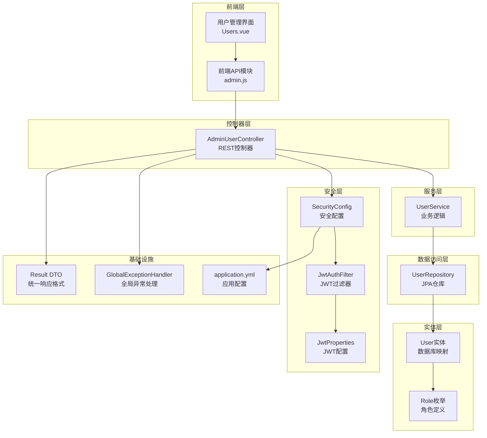
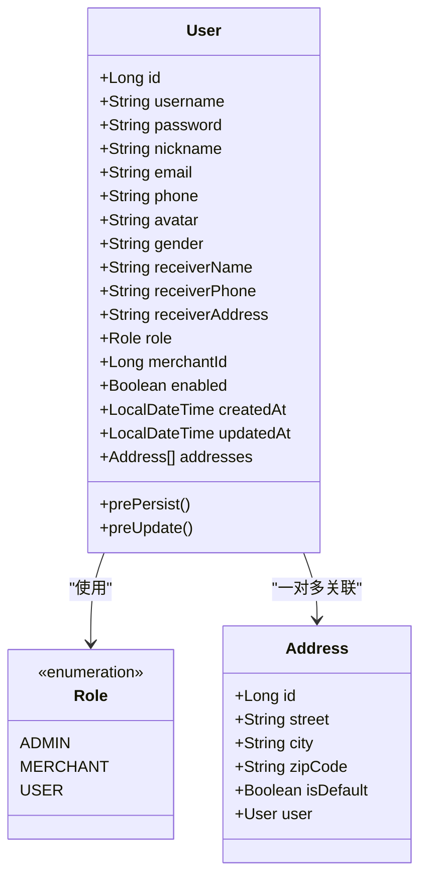
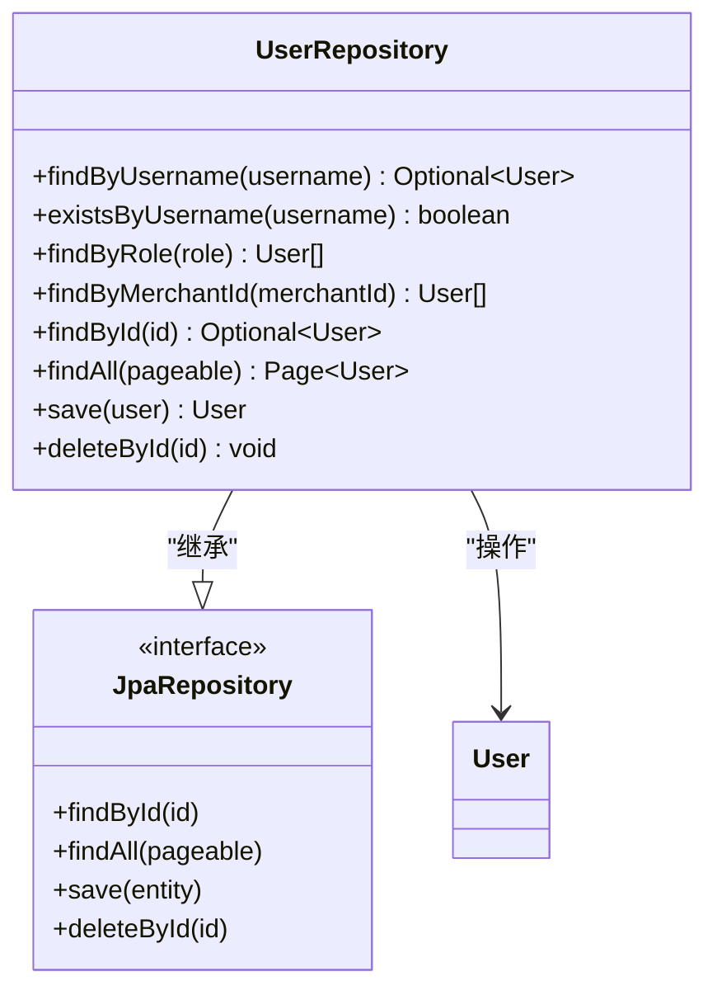
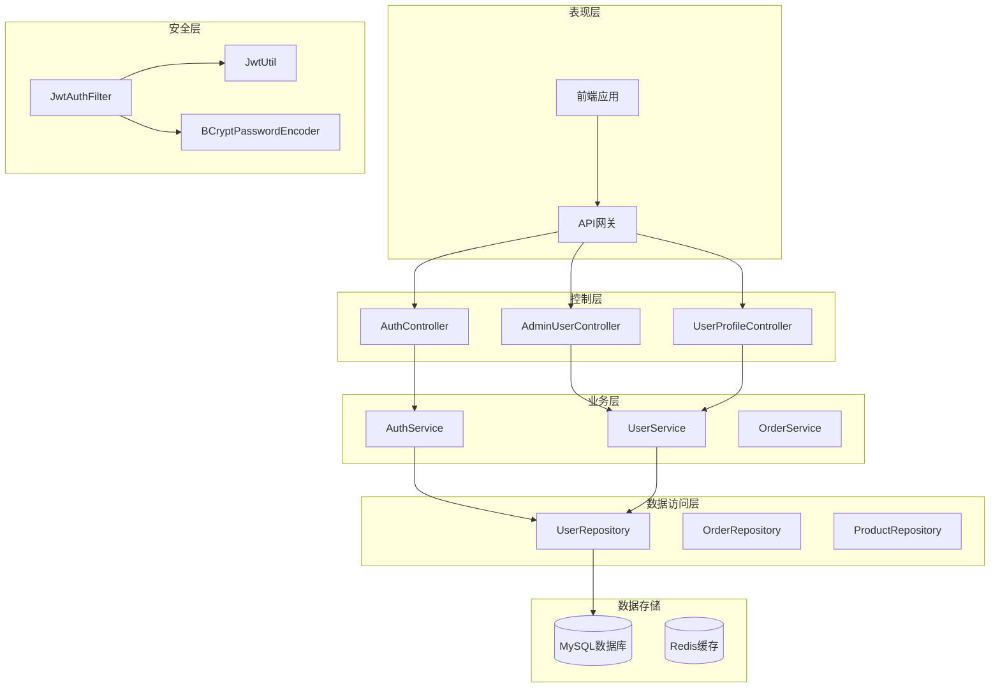
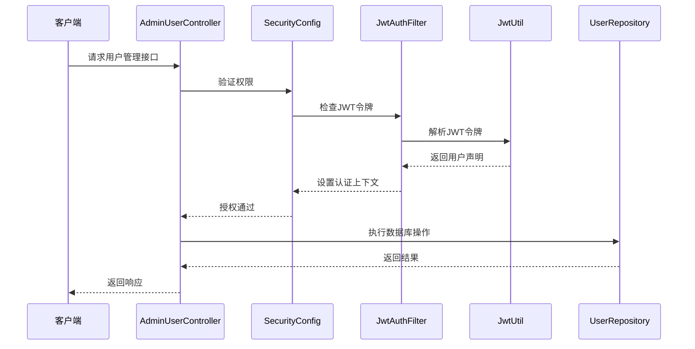
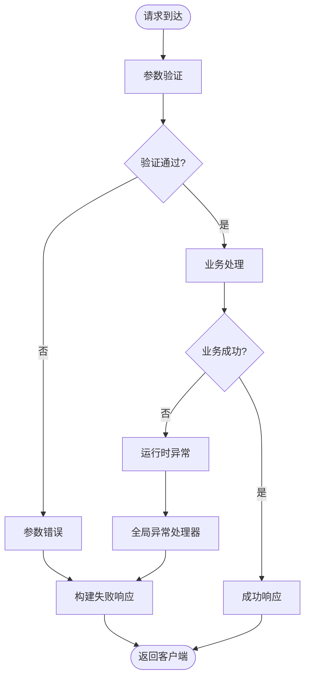
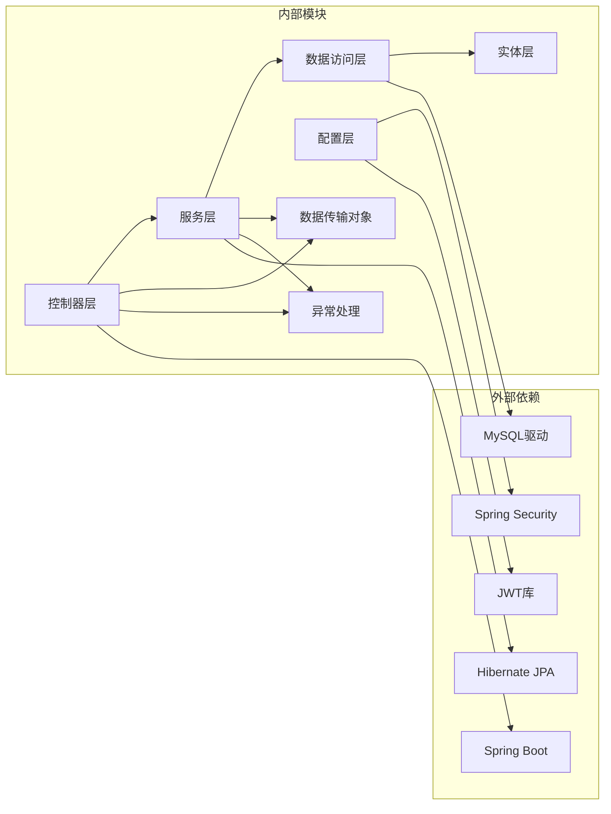
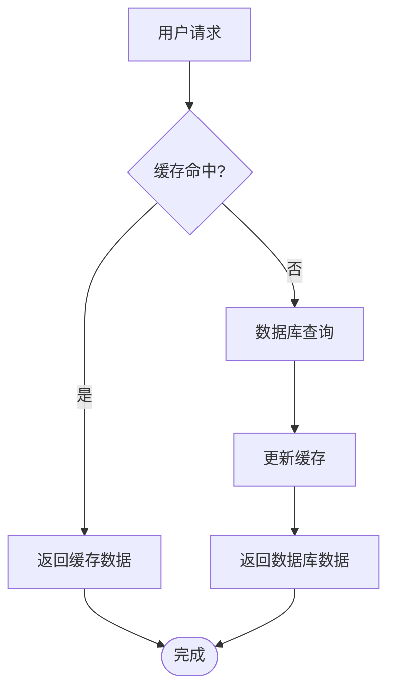

# 用户管理接口

<cite>
**本文档引用的文件**
- [AdminUserController.java](file://backend/src/main/java/com/mall/controller/admin/AdminUserController.java)
- [UserService.java](file://backend/src/main/java/com/mall/service/UserService.java)
- [User.java](file://backend/src/main/java/com/mall/entity/User.java)
- [UserRepository.java](file://backend/src/main/java/com/mall/repository/UserRepository.java)
- [Role.java](file://backend/src/main/java/com/mall/common/Role.java)
- [Result.java](file://backend/src/main/java/com/mall/dto/Result.java)
- [GlobalExceptionHandler.java](file://backend/src/main/java/com/mall/exception/GlobalExceptionHandler.java)
- [SecurityConfig.java](file://backend/src/main/java/com/mall/config/SecurityConfig.java)
- [JwtAuthFilter.java](file://backend/src/main/java/com/mall/security/JwtAuthFilter.java)
- [JwtProperties.java](file://backend/src/main/java/com/mall/config/JwtProperties.java)
- [application.yml](file://backend/src/main/resources/application.yml)
- [admin.js](file://frontend/src/api/admin.js)
- [Users.vue](file://frontend/src/views/admin/Users.vue)
</cite>

## 目录
1. [简介](#简介)
2. [项目结构](#项目结构)
3. [核心组件](#核心组件)
4. [架构概览](#架构概览)
5. [详细组件分析](#详细组件分析)
6. [依赖分析](#依赖分析)
7. [性能考虑](#性能考虑)
8. [故障排除指南](#故障排除指南)
9. [结论](#结论)

## 简介

本文档详细说明电商商城系统中的用户管理接口，涵盖管理员端的用户管理功能。该系统采用Spring Boot + Spring Security + JPA的技术栈，实现了完整的用户生命周期管理，包括用户列表查询、用户创建、用户信息更新和用户删除等核心功能。

系统支持三种用户角色：ADMIN（管理员）、MERCHANT（运营）和USER（普通用户），并提供完善的状态管理和权限控制机制。

## 项目结构

用户管理功能主要分布在以下层次：



**图表来源**
- [AdminUserController.java:17-81](file://backend/src/main/java/com/mall/controller/admin/AdminUserController.java#L17-L81)
- [UserService.java:12-42](file://backend/src/main/java/com/mall/service/UserService.java#L12-L42)
- [UserRepository.java:10-19](file://backend/src/main/java/com/mall/repository/UserRepository.java#L10-L19)
- [User.java:10-88](file://backend/src/main/java/com/mall/entity/User.java#L10-L88)
- [SecurityConfig.java:22-74](file://backend/src/main/java/com/mall/config/SecurityConfig.java#L22-L74)

**章节来源**
- [AdminUserController.java:17-81](file://backend/src/main/java/com/mall/controller/admin/AdminUserController.java#L17-L81)
- [application.yml:1-36](file://backend/src/main/resources/application.yml#L1-L36)

## 核心组件

### 用户实体模型

用户实体定义了完整的用户信息结构，包括基本属性、角色信息和状态管理：



**图表来源**
- [User.java:17-88](file://backend/src/main/java/com/mall/entity/User.java#L17-L88)
- [Role.java:3-7](file://backend/src/main/java/com/mall/common/Role.java#L3-L7)

### 数据访问层

UserRepository提供了用户数据的持久化操作，支持基于角色和商家ID的查询：



**图表来源**
- [UserRepository.java:10-19](file://backend/src/main/java/com/mall/repository/UserRepository.java#L10-L19)

**章节来源**
- [User.java:17-88](file://backend/src/main/java/com/mall/entity/User.java#L17-L88)
- [UserRepository.java:10-19](file://backend/src/main/java/com/mall/repository/UserRepository.java#L10-L19)

## 架构概览

系统采用分层架构设计，确保关注点分离和代码可维护性：



**图表来源**
- [AdminUserController.java:17-81](file://backend/src/main/java/com/mall/controller/admin/AdminUserController.java#L17-L81)
- [SecurityConfig.java:33-55](file://backend/src/main/java/com/mall/config/SecurityConfig.java#L33-L55)

## 详细组件分析

### 用户管理控制器

AdminUserController是用户管理的核心控制器，提供了完整的CRUD操作：

#### 用户列表查询接口

支持按角色过滤和分页查询的用户列表接口：

**接口定义**
- 方法：GET
- 路径：`/admin/user`
- 权限：ADMIN

**查询参数**
- `role`：可选，按角色过滤用户
  - 取值：`ADMIN`、`MERCHANT`、`USER`
- `page`：可选，页码，默认值：0
- `size`：可选，每页大小，默认值：10

**响应格式**
```json
{
  "code": 200,
  "message": "success",
  "data": [
    {
      "id": 1,
      "username": "john_doe",
      "nickname": "John Doe",
      "role": "USER",
      "enabled": true,
      "createdAt": "2024-01-01T10:00:00",
      "updatedAt": "2024-01-01T10:00:00"
    }
  ]
}
```

**错误处理**
- 角色参数无效：返回400状态码
- 查询结果为空：返回空数组

#### 用户创建接口

创建新用户账号，包含密码加密和角色分配：

**接口定义**
- 方法：POST
- 路径：`/admin/user`
- 权限：ADMIN

**请求体参数**
- `username`：必填，用户名，唯一性约束
- `password`：必填，用户密码，将自动加密存储
- `nickname`：可选，用户昵称
- `role`：必填，用户角色
  - 取值：`ADMIN`、`MERCHANT`、`USER`
- `merchantId`：可选，商家ID，仅当角色为MERCHANT时有效

**响应格式**
```json
{
  "code": 200,
  "message": "success",
  "data": {
    "id": 1,
    "username": "john_doe",
    "nickname": "John Doe",
    "role": "USER",
    "enabled": true,
    "merchantId": null,
    "createdAt": "2024-01-01T10:00:00",
    "updatedAt": "2024-01-01T10:00:00"
  }
}
```

**业务规则**
- 密码自动加密存储
- 默认启用状态为true
- 商家绑定仅对MERCHANT角色有效

#### 用户信息更新接口

更新用户的基础信息，包括昵称、状态和商家绑定：

**接口定义**
- 方法：PUT
- 路径：`/admin/user/{id}`
- 权限：ADMIN

**路径参数**
- `id`：必填，用户ID

**请求体参数**
- `nickname`：可选，用户昵称
- `enabled`：可选，启用状态（true/false）
- `merchantId`：可选，商家ID，null表示解绑

**响应格式**
```json
{
  "code": 200,
  "message": "success",
  "data": {
    "id": 1,
    "username": "john_doe",
    "nickname": "Updated Name",
    "role": "USER",
    "enabled": false,
    "merchantId": null,
    "createdAt": "2024-01-01T10:00:00",
    "updatedAt": "2024-01-01T11:00:00"
  }
}
```

**业务规则**
- 支持部分字段更新
- 状态切换会立即生效
- 商家解绑通过设置为null实现

#### 用户删除接口

删除指定用户：

**接口定义**
- 方法：DELETE
- 路径：`/admin/user/{id}`
- 权限：ADMIN

**路径参数**
- `id`：必填，用户ID

**响应格式**
```json
{
  "code": 200,
  "message": "success",
  "data": null
}
```

**注意事项**
- 删除操作不可逆
- 建议先禁用用户再删除

**章节来源**
- [AdminUserController.java:26-79](file://backend/src/main/java/com/mall/controller/admin/AdminUserController.java#L26-L79)

### 安全配置与权限控制

系统采用基于JWT的无状态认证机制，结合Spring Security实现细粒度的权限控制：



**图表来源**
- [SecurityConfig.java:33-55](file://backend/src/main/java/com/mall/config/SecurityConfig.java#L33-L55)
- [JwtAuthFilter.java:30-47](file://backend/src/main/java/com/mall/security/JwtAuthFilter.java#L30-L47)

**权限规则**
- `/admin/**` 需要ADMIN角色
- `/merchant/**` 需要MERCHANT角色  
- `/user/**` 需要USER角色
- `/auth/**` 公开访问

**章节来源**
- [SecurityConfig.java:33-55](file://backend/src/main/java/com/mall/config/SecurityConfig.java#L33-L55)
- [JwtAuthFilter.java:30-47](file://backend/src/main/java/com/mall/security/JwtAuthFilter.java#L30-L47)

### 错误处理机制

系统采用统一的异常处理机制，确保前后端交互的一致性：



**图表来源**
- [GlobalExceptionHandler.java:13-17](file://backend/src/main/java/com/mall/exception/GlobalExceptionHandler.java#L13-L17)

**响应格式**
```json
{
  "code": 400,
  "message": "用户名已存在",
  "data": null
}
```

**错误类型**
- 参数验证错误：返回400状态码
- 业务逻辑错误：返回400状态码
- 系统异常：统一转换为400状态码

**章节来源**
- [GlobalExceptionHandler.java:13-17](file://backend/src/main/java/com/mall/exception/GlobalExceptionHandler.java#L13-L17)

## 依赖分析

系统各组件之间的依赖关系如下：



**图表来源**
- [AdminUserController.java:23-24](file://backend/src/main/java/com/mall/controller/admin/AdminUserController.java#L23-L24)
- [UserService.java:16](file://backend/src/main/java/com/mall/service/UserService.java#L16)
- [UserRepository.java:12-18](file://backend/src/main/java/com/mall/repository/UserRepository.java#L12-L18)

**依赖特点**
- 控制器层依赖服务层，服务层依赖数据访问层
- 采用依赖注入模式，降低耦合度
- 统一的数据传输对象（DTO）简化了接口设计
- 异常处理集中化，便于维护

**章节来源**
- [AdminUserController.java:23-24](file://backend/src/main/java/com/mall/controller/admin/AdminUserController.java#L23-L24)
- [UserService.java:16](file://backend/src/main/java/com/mall/service/UserService.java#L16)
- [UserRepository.java:12-18](file://backend/src/main/java/com/mall/repository/UserRepository.java#L12-L18)

## 性能考虑

### 数据库优化策略

1. **索引设计**
   - 用户名字段建立唯一索引，确保唯一性约束
   - 角色字段建立普通索引，支持角色过滤查询
   - 商家ID字段建立索引，支持商家关联查询

2. **查询优化**
   - 使用分页查询避免大数据集加载
   - 条件查询时优先使用角色过滤减少数据量
   - 批量操作时使用事务保证一致性

3. **连接池配置**
   - 合理配置最大连接数和超时时间
   - 开启连接池监控和健康检查

### 缓存策略



### 安全性能优化

1. **JWT令牌优化**
   - 合理设置过期时间，平衡安全性与性能
   - 使用内存缓存存储最近使用的令牌
   - 实现令牌黑名单机制防止重复使用

2. **密码加密优化**
   - 使用BCrypt算法，成本因子适中
   - 避免在高并发场景下进行密码验证

## 故障排除指南

### 常见问题及解决方案

**1. 用户名重复错误**
- 现象：创建用户时报用户名已存在
- 原因：用户名违反唯一性约束
- 解决方案：检查用户名是否已被使用，或联系管理员

**2. 权限不足错误**
- 现象：403 Forbidden状态码
- 原因：当前用户角色不满足接口权限要求
- 解决方案：使用具有ADMIN角色的账户登录

**3. JWT令牌失效**
- 现象：401 Unauthorized状态码
- 原因：JWT令牌过期或格式错误
- 解决方案：重新登录获取新的JWT令牌

**4. 数据库连接异常**
- 现象：500 Internal Server Error
- 原因：数据库连接池耗尽或网络问题
- 解决方案：检查数据库连接配置和网络连通性

### 调试建议

1. **启用详细日志**
   ```yaml
   logging:
     level:
       com.mall: DEBUG
       org.springframework.security: DEBUG
   ```

2. **监控指标收集**
   - 数据库查询次数和响应时间
   - JWT令牌验证成功率
   - 用户操作日志

3. **性能基准测试**
   - 单用户操作响应时间
   - 并发用户操作吞吐量
   - 内存使用情况

**章节来源**
- [GlobalExceptionHandler.java:13-17](file://backend/src/main/java/com/mall/exception/GlobalExceptionHandler.java#L13-L17)
- [application.yml:32-36](file://backend/src/main/resources/application.yml#L32-L36)

## 结论

用户管理接口设计完整，涵盖了电商系统的核心用户管理需求。系统采用现代化的技术栈和架构模式，具有以下优势：

1. **安全性**：基于JWT的无状态认证，配合Spring Security实现细粒度权限控制
2. **可扩展性**：清晰的分层架构和依赖注入，便于功能扩展和维护
3. **可靠性**：统一的异常处理机制和错误响应格式
4. **易用性**：简洁的API设计和完整的前端集成

建议后续可以考虑：
- 添加用户操作审计日志
- 实现用户状态变更通知机制
- 优化批量用户操作的性能
- 增强用户数据导出功能