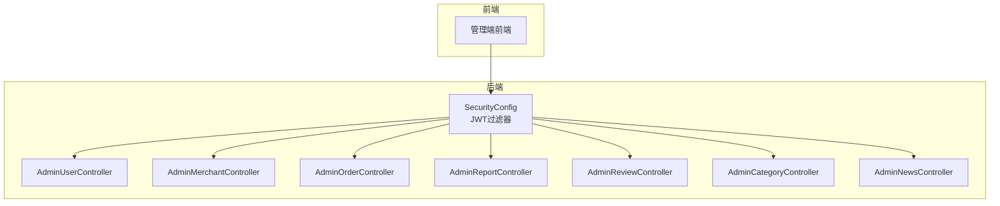
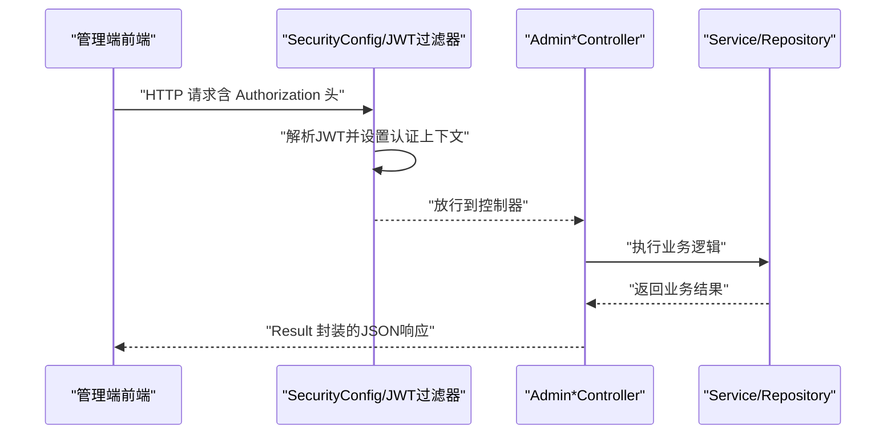
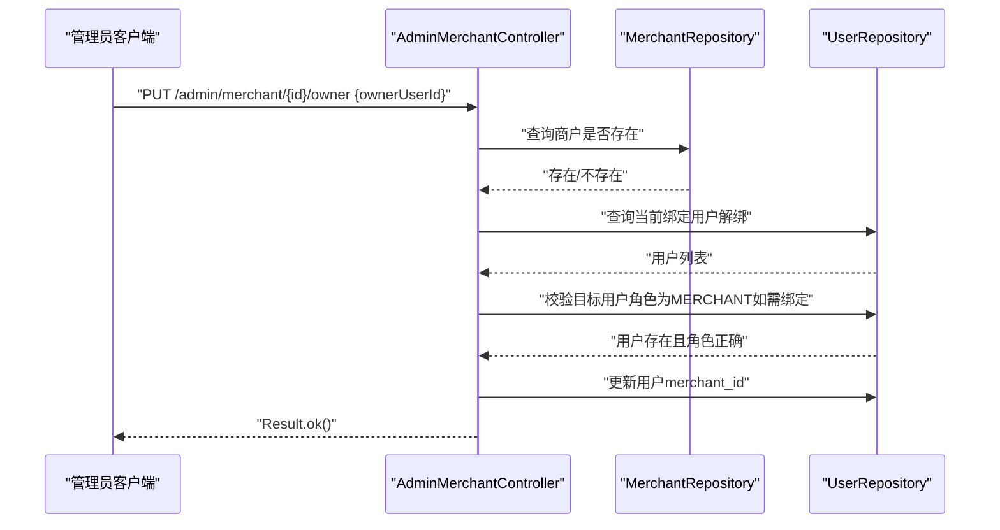
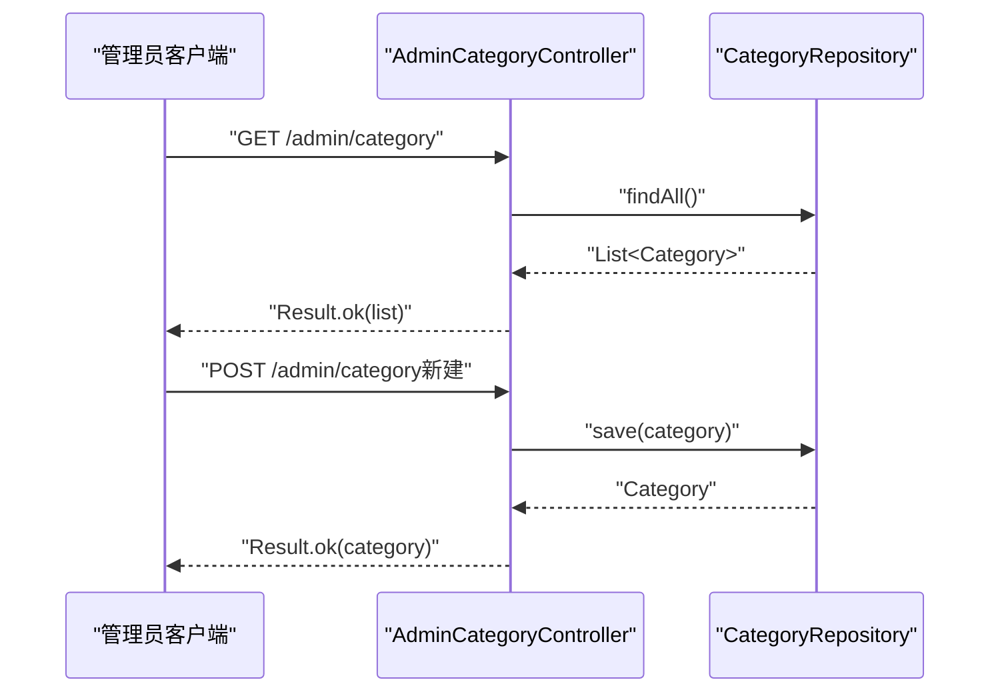
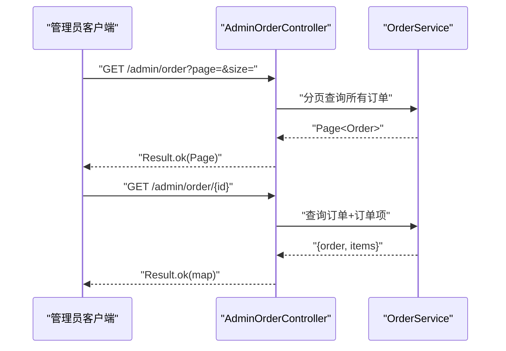
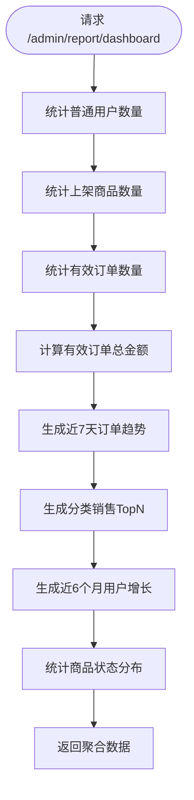
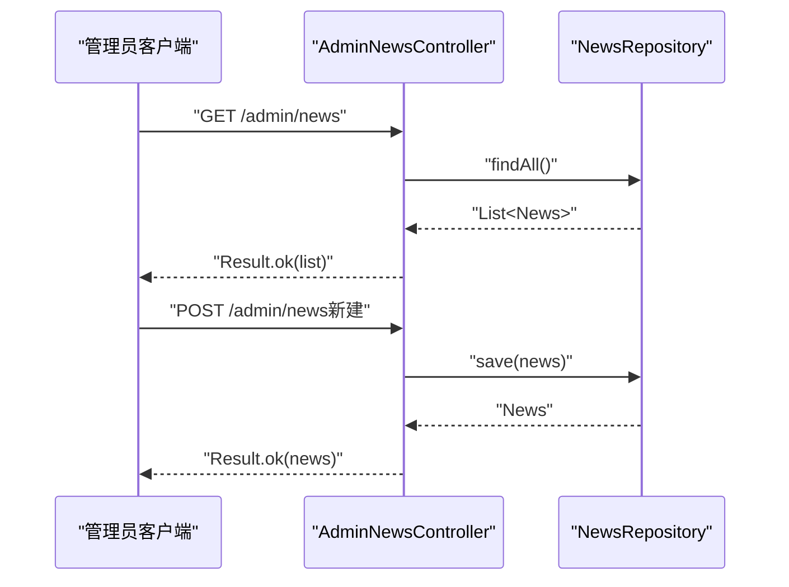
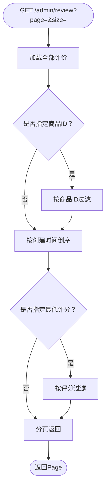
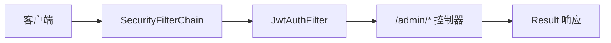

# 管理员接口

<cite>
**本文引用的文件**
- [AdminUserController.java](file://backend/src/main/java/com/mall/controller/admin/AdminUserController.java)
- [AdminMerchantController.java](file://backend/src/main/java/com/mall/controller/admin/AdminMerchantController.java)
- [AdminOrderController.java](file://backend/src/main/java/com/mall/controller/admin/AdminOrderController.java)
- [AdminReportController.java](file://backend/src/main/java/com/mall/controller/admin/AdminReportController.java)
- [AdminReviewController.java](file://backend/src/main/java/com/mall/controller/admin/AdminReviewController.java)
- [AdminCategoryController.java](file://backend/src/main/java/com/mall/controller/admin/AdminCategoryController.java)
- [AdminNewsController.java](file://backend/src/main/java/com/mall/controller/admin/AdminNewsController.java)
- [SecurityConfig.java](file://backend/src/main/java/com/mall/config/SecurityConfig.java)
- [JwtAuthFilter.java](file://backend/src/main/java/com/mall/security/JwtAuthFilter.java)
- [application.yml](file://backend/src/main/resources/application.yml)
- [Result.java](file://backend/src/main/java/com/mall/dto/Result.java)
- [Role.java](file://backend/src/main/java/com/mall/common/Role.java)
- [User.java](file://backend/src/main/java/com/mall/entity/User.java)
- [Merchant.java](file://backend/src/main/java/com/mall/entity/Merchant.java)
- [Product.java](file://backend/src/main/java/com/mall/entity/Product.java)
- [Order.java](file://backend/src/main/java/com/mall/entity/Order.java)
- [Category.java](file://backend/src/main/java/com/mall/entity/Category.java)
- [News.java](file://backend/src/main/java/com/mall/entity/News.java)
</cite>

## 目录
1. [简介](#简介)
2. [项目结构](#项目结构)
3. [核心组件](#核心组件)
4. [架构总览](#架构总览)
5. [详细组件分析](#详细组件分析)
6. [依赖分析](#依赖分析)
7. [性能考虑](#性能考虑)
8. [故障排查指南](#故障排查指南)
9. [结论](#结论)
10. [附录](#附录)

## 简介
本文件为电商商城系统的“管理员接口”权威API文档，覆盖用户管理、商户管理、商品管理、订单管理、报表统计、内容管理与评价管理等模块。文档同时阐述权限验证机制与操作审计思路，帮助开发者与测试人员快速理解并正确使用各接口。

## 项目结构
管理员接口位于后端工程的管理端控制器包中，采用按功能域分层的组织方式：
- 控制器层：/admin 下的各控制器负责具体业务接口
- 安全层：基于JWT的认证过滤器与Spring Security配置
- 数据模型：JPA实体定义了用户、商户、商品、订单、分类、资讯等核心领域对象
- 统一响应：Result<T>封装统一的返回结构

**图表来源**
- [SecurityConfig.java:33-55](file://backend/src/main/java/com/mall/config/SecurityConfig.java#L33-L55)
- [JwtAuthFilter.java:30-47](file://backend/src/main/java/com/mall/security/JwtAuthFilter.java#L30-L47)
- [AdminUserController.java:17-80](file://backend/src/main/java/com/mall/controller/admin/AdminUserController.java#L17-L80)
- [AdminMerchantController.java:17-121](file://backend/src/main/java/com/mall/controller/admin/AdminMerchantController.java#L17-L121)
- [AdminOrderController.java:17-44](file://backend/src/main/java/com/mall/controller/admin/AdminOrderController.java#L17-L44)
- [AdminReportController.java:23-77](file://backend/src/main/java/com/mall/controller/admin/AdminReportController.java#L23-L77)
- [AdminReviewController.java:16-91](file://backend/src/main/java/com/mall/controller/admin/AdminReviewController.java#L16-L91)
- [AdminCategoryController.java:12-46](file://backend/src/main/java/com/mall/controller/admin/AdminCategoryController.java#L12-L46)
- [AdminNewsController.java:13-47](file://backend/src/main/java/com/mall/controller/admin/AdminNewsController.java#L13-L47)

**章节来源**
- [SecurityConfig.java:33-55](file://backend/src/main/java/com/mall/config/SecurityConfig.java#L33-L55)
- [application.yml:22-25](file://backend/src/main/resources/application.yml#L22-L25)

## 核心组件
- 权限与安全
  - 基于JWT的无状态认证，请求头携带 Bearer Token
  - Spring Security通过路径匹配对 /admin/** 授权为 ADMIN 角色
- 统一响应
  - Result<T> 提供 code、message、data 的标准化返回
- 实体模型
  - 用户(User)、商户(Merchant)、商品(Product)、订单(Order)、分类(Category)、资讯(News) 等

**章节来源**
- [SecurityConfig.java:48-50](file://backend/src/main/java/com/mall/config/SecurityConfig.java#L48-L50)
- [JwtAuthFilter.java:21-22](file://backend/src/main/java/com/mall/security/JwtAuthFilter.java#L21-L22)
- [Result.java:16-22](file://backend/src/main/java/com/mall/dto/Result.java#L16-L22)
- [Role.java:3-7](file://backend/src/main/java/com/mall/common/Role.java#L3-L7)

## 架构总览
管理员接口遵循REST风格，统一通过 /api 前缀访问。请求流程如下：
- 前端携带 Authorization: Bearer <token> 发起请求
- JWT过滤器解析令牌，构建认证上下文
- Spring Security根据路径授权策略放行或拒绝
- 控制器调用服务层完成业务处理，返回Result封装的数据

**图表来源**
- [SecurityConfig.java:33-55](file://backend/src/main/java/com/mall/config/SecurityConfig.java#L33-L55)
- [JwtAuthFilter.java:30-47](file://backend/src/main/java/com/mall/security/JwtAuthFilter.java#L30-L47)
- [application.yml:22-25](file://backend/src/main/resources/application.yml#L22-L25)

## 详细组件分析

### 用户管理接口
- 接口概览
  - 列表查询：支持按角色过滤与分页
  - 创建用户：校验用户名唯一性，密码加密存储
  - 更新用户：可修改昵称、启用状态、绑定商户
  - 删除用户：物理删除
- 关键字段
  - 用户名、昵称、角色、启用状态、商户ID、创建/更新时间
- 安全与审计
  - 仅 ADMIN 可访问 /admin/user
  - 建议在更新/删除操作增加审计日志（当前代码未实现）

```mermaid
sequenceDiagram
participant Admin as "管理员客户端"
participant Ctrl as "AdminUserController"
participant Repo as "UserRepository"
participant Sec as "SecurityContext"
Admin->>Ctrl : "GET /admin/user?page=&size=&role="
Ctrl->>Sec : "鉴权ADMIN"
Ctrl->>Repo : "按条件查询"
Repo-->>Ctrl : "Page<User>"
Ctrl-->>Admin : "Result.ok(Page)"
Admin->>Ctrl : "POST /admin/user用户名、密码、角色、可选merchantId"
Ctrl->>Repo : "检查用户名唯一性"
Repo-->>Ctrl : "是否存在"
Ctrl->>Ctrl : "密码加密"
Ctrl->>Repo : "保存User"
Repo-->>Ctrl : "User"
Ctrl-->>Admin : "Result.ok(User)"
```

**图表来源**
- [AdminUserController.java:26-36](file://backend/src/main/java/com/mall/controller/admin/AdminUserController.java#L26-L36)
- [AdminUserController.java:38-59](file://backend/src/main/java/com/mall/controller/admin/AdminUserController.java#L38-L59)
- [AdminUserController.java:61-72](file://backend/src/main/java/com/mall/controller/admin/AdminUserController.java#L61-L72)
- [AdminUserController.java:74-79](file://backend/src/main/java/com/mall/controller/admin/AdminUserController.java#L74-L79)
- [User.java:56-65](file://backend/src/main/java/com/mall/entity/User.java#L56-L65)

**章节来源**
- [AdminUserController.java:26-79](file://backend/src/main/java/com/mall/controller/admin/AdminUserController.java#L26-L79)
- [User.java:17-87](file://backend/src/main/java/com/mall/entity/User.java#L17-L87)

### 商户管理接口
- 接口概览
  - 商户列表：附带所属商家账号信息（若存在）
  - 新建/更新/删除：标准CRUD
  - 绑定/解绑商家账号：将 sys_user.merchant_id 指向对应商户
- 关键字段
  - 商户名称、描述、LOGO、联系方式、启用状态、创建/更新时间
  - 商家账号：用户名、昵称、角色需为 MERCHANT
- 安全与审计
  - 仅 ADMIN 可访问 /admin/merchant
  - 绑定操作建议记录变更前后的 merchant_id 与操作人

**图表来源**
- [AdminMerchantController.java:76-105](file://backend/src/main/java/com/mall/controller/admin/AdminMerchantController.java#L76-L105)
- [User.java:56-62](file://backend/src/main/java/com/mall/entity/User.java#L56-L62)
- [Merchant.java:15-55](file://backend/src/main/java/com/mall/entity/Merchant.java#L15-L55)

**章节来源**
- [AdminMerchantController.java:26-121](file://backend/src/main/java/com/mall/controller/admin/AdminMerchantController.java#L26-L121)
- [Merchant.java:15-55](file://backend/src/main/java/com/mall/entity/Merchant.java#L15-L55)
- [User.java:17-87](file://backend/src/main/java/com/mall/entity/User.java#L17-L87)

### 商品管理接口（分类）
- 接口概览
  - 分类列表、新增、修改、删除
- 关键字段
  - 分类名称、父级ID、图标、排序、创建时间
- 安全与审计
  - 仅 ADMIN 可访问 /admin/category

**图表来源**
- [AdminCategoryController.java:20-45](file://backend/src/main/java/com/mall/controller/admin/AdminCategoryController.java#L20-L45)
- [Category.java:15-40](file://backend/src/main/java/com/mall/entity/Category.java#L15-L40)

**章节来源**
- [AdminCategoryController.java:12-46](file://backend/src/main/java/com/mall/controller/admin/AdminCategoryController.java#L12-L46)
- [Category.java:15-40](file://backend/src/main/java/com/mall/entity/Category.java#L15-L40)

### 订单管理接口
- 接口概览
  - 订单列表：分页查询
  - 订单详情：返回订单与订单项集合
- 关键字段
  - 订单号、用户ID、商户ID、状态、金额、收货信息、退款相关信息
- 安全与审计
  - 仅 ADMIN 可访问 /admin/order

**图表来源**
- [AdminOrderController.java:25-43](file://backend/src/main/java/com/mall/controller/admin/AdminOrderController.java#L25-L43)
- [Order.java:16-82](file://backend/src/main/java/com/mall/entity/Order.java#L16-L82)

**章节来源**
- [AdminOrderController.java:17-44](file://backend/src/main/java/com/mall/controller/admin/AdminOrderController.java#L17-L44)
- [Order.java:16-82](file://backend/src/main/java/com/mall/entity/Order.java#L16-L82)

### 报表统计接口
- 接口概览
  - 首页看板：用户数、商品数、订单数、总销售额
  - 近7天订单趋势、分类销售TopN、近6个月用户增长、商品状态分布
- 数据来源
  - 用户、商品、订单仓库聚合统计
- 安全与审计
  - 仅 ADMIN 可访问 /admin/report

**图表来源**
- [AdminReportController.java:33-77](file://backend/src/main/java/com/mall/controller/admin/AdminReportController.java#L33-L77)
- [AdminReportController.java:79-94](file://backend/src/main/java/com/mall/controller/admin/AdminReportController.java#L79-L94)
- [AdminReportController.java:96-126](file://backend/src/main/java/com/mall/controller/admin/AdminReportController.java#L96-L126)
- [AdminReportController.java:128-147](file://backend/src/main/java/com/mall/controller/admin/AdminReportController.java#L128-L147)
- [AdminReportController.java:149-174](file://backend/src/main/java/com/mall/controller/admin/AdminReportController.java#L149-L174)

**章节来源**
- [AdminReportController.java:23-175](file://backend/src/main/java/com/mall/controller/admin/AdminReportController.java#L23-L175)

### 内容管理接口（新闻资讯）
- 接口概览
  - 资讯列表、新增、修改、删除
- 关键字段
  - 标题、内容、类型（资讯/公告）、发布状态、创建/更新时间
- 安全与审计
  - 仅 ADMIN 可访问 /admin/news

**图表来源**
- [AdminNewsController.java:21-46](file://backend/src/main/java/com/mall/controller/admin/AdminNewsController.java#L21-L46)
- [News.java:16-51](file://backend/src/main/java/com/mall/entity/News.java#L16-L51)

**章节来源**
- [AdminNewsController.java:13-47](file://backend/src/main/java/com/mall/controller/admin/AdminNewsController.java#L13-L47)
- [News.java:16-51](file://backend/src/main/java/com/mall/entity/News.java#L16-L51)

### 评价管理接口
- 接口概览
  - 评价列表：支持按商品ID与最低评分过滤，按创建时间倒序分页
  - 删除单条评价
  - 批量删除评价
- 关键字段
  - 商品ID、评分、内容、创建时间
- 安全与审计
  - 仅 ADMIN 可访问 /admin/review

**图表来源**
- [AdminReviewController.java:24-64](file://backend/src/main/java/com/mall/controller/admin/AdminReviewController.java#L24-L64)
- [AdminReviewController.java:66-90](file://backend/src/main/java/com/mall/controller/admin/AdminReviewController.java#L66-L90)

**章节来源**
- [AdminReviewController.java:16-91](file://backend/src/main/java/com/mall/controller/admin/AdminReviewController.java#L16-L91)

## 依赖分析
- 路由与授权
  - /admin/** 仅 ADMIN 角色可访问
  - 公共资源与公开接口保持开放
- 认证链路
  - Authorization: Bearer <token> 解析并注入认证上下文
- 统一响应
  - Result<T> 统一返回码与消息结构

**图表来源**
- [SecurityConfig.java:39-51](file://backend/src/main/java/com/mall/config/SecurityConfig.java#L39-L51)
- [JwtAuthFilter.java:30-47](file://backend/src/main/java/com/mall/security/JwtAuthFilter.java#L30-L47)
- [Result.java:16-22](file://backend/src/main/java/com/mall/dto/Result.java#L16-L22)

**章节来源**
- [SecurityConfig.java:33-73](file://backend/src/main/java/com/mall/config/SecurityConfig.java#L33-L73)
- [application.yml:27-30](file://backend/src/main/resources/application.yml#L27-L30)

## 性能考虑
- 分页查询
  - 用户、商户、订单、评价均采用分页，避免一次性加载大量数据
- 过滤与排序
  - 评价列表支持按商品ID与最低评分过滤，减少无效数据传输
- 统计接口
  - 报表接口对全量数据进行内存聚合，建议在数据量增大时引入数据库侧聚合或缓存

[本节为通用指导，不直接分析具体文件]

## 故障排查指南
- 认证失败
  - 确认请求头 Authorization: Bearer <token> 是否正确
  - 检查 JWT 密钥与过期时间配置
- 权限不足
  - 确认登录账户角色为 ADMIN
  - 检查 /admin/** 路径授权规则
- 参数错误
  - 用户创建/更新时检查必填字段与类型
  - 商户绑定时确认目标用户角色为 MERCHANT
- 返回格式
  - 使用 Result.code 与 Result.message 判断请求是否成功

**章节来源**
- [SecurityConfig.java:48-50](file://backend/src/main/java/com/mall/config/SecurityConfig.java#L48-L50)
- [JwtAuthFilter.java:30-47](file://backend/src/main/java/com/mall/security/JwtAuthFilter.java#L30-L47)
- [Result.java:16-22](file://backend/src/main/java/com/mall/dto/Result.java#L16-L22)
- [application.yml:27-30](file://backend/src/main/resources/application.yml#L27-L30)

## 结论
管理员接口提供了完善的后台管理能力，涵盖用户、商户、商品、订单、报表、内容与评价等核心模块。配合基于JWT的无状态认证与统一响应结构，能够满足日常运营与数据分析需求。建议后续补充操作审计与更细粒度的权限控制，以进一步提升系统安全性与可追溯性。

[本节为总结性内容，不直接分析具体文件]

## 附录

### 接口清单与说明
- 用户管理
  - GET /admin/user?page=&size=&role=：分页查询用户（可按角色过滤）
  - POST /admin/user：创建用户（用户名、密码、角色、可选merchantId）
  - PUT /admin/user/{id}：更新用户（昵称、启用状态、商户绑定）
  - DELETE /admin/user/{id}：删除用户
- 商户管理
  - GET /admin/merchant：查询商户列表（附带所属账号信息）
  - POST /admin/merchant：新建商户
  - PUT /admin/merchant/{id}：更新商户
  - PUT /admin/merchant/{id}/owner：绑定/解绑商家账号
  - GET /admin/merchant/{id}：查询单个商户
  - DELETE /admin/merchant/{id}：删除商户
- 商品管理（分类）
  - GET /admin/category：分类列表
  - POST /admin/category：新增分类
  - PUT /admin/category/{id}：更新分类
  - DELETE /admin/category/{id}：删除分类
- 订单管理
  - GET /admin/order?page=&size=：订单列表
  - GET /admin/order/{id}：订单详情（含订单项）
- 报表统计
  - GET /admin/report/dashboard：后台看板数据
- 内容管理
  - GET /admin/news：资讯列表
  - POST /admin/news：新增资讯
  - PUT /admin/news/{id}：更新资讯
  - DELETE /admin/news/{id}：删除资讯
- 评价管理
  - GET /admin/review?page=&size=&productId=&minRating=：评价列表（可按商品与最低评分过滤）
  - DELETE /admin/review/{reviewId}：删除单条评价
  - POST /admin/review/batch-delete：批量删除评价

**章节来源**
- [AdminUserController.java:26-79](file://backend/src/main/java/com/mall/controller/admin/AdminUserController.java#L26-L79)
- [AdminMerchantController.java:26-121](file://backend/src/main/java/com/mall/controller/admin/AdminMerchantController.java#L26-L121)
- [AdminCategoryController.java:20-45](file://backend/src/main/java/com/mall/controller/admin/AdminCategoryController.java#L20-L45)
- [AdminOrderController.java:25-43](file://backend/src/main/java/com/mall/controller/admin/AdminOrderController.java#L25-L43)
- [AdminReportController.java:33-77](file://backend/src/main/java/com/mall/controller/admin/AdminReportController.java#L33-L77)
- [AdminNewsController.java:21-46](file://backend/src/main/java/com/mall/controller/admin/AdminNewsController.java#L21-L46)
- [AdminReviewController.java:24-90](file://backend/src/main/java/com/mall/controller/admin/AdminReviewController.java#L24-L90)

### 数据模型要点
- 用户：角色枚举（ADMIN/MERCHANT/USER），启用状态，可绑定商户ID
- 商户：启用状态，联系方式与创建时间
- 商品：价格、库存、销量、上下架状态、分类ID
- 订单：订单号、用户与商户ID、状态、金额、收货信息、退款相关字段
- 分类：名称、父级ID、排序
- 资讯：标题、内容、类型（资讯/公告）、发布状态

**章节来源**
- [Role.java:3-7](file://backend/src/main/java/com/mall/common/Role.java#L3-L7)
- [User.java:56-65](file://backend/src/main/java/com/mall/entity/User.java#L56-L65)
- [Merchant.java:36-37](file://backend/src/main/java/com/mall/entity/Merchant.java#L36-L37)
- [Product.java:57-78](file://backend/src/main/java/com/mall/entity/Product.java#L57-L78)
- [Order.java:31-61](file://backend/src/main/java/com/mall/entity/Order.java#L31-L61)
- [Category.java:21-31](file://backend/src/main/java/com/mall/entity/Category.java#L21-L31)
- [News.java:22-33](file://backend/src/main/java/com/mall/entity/News.java#L22-L33)