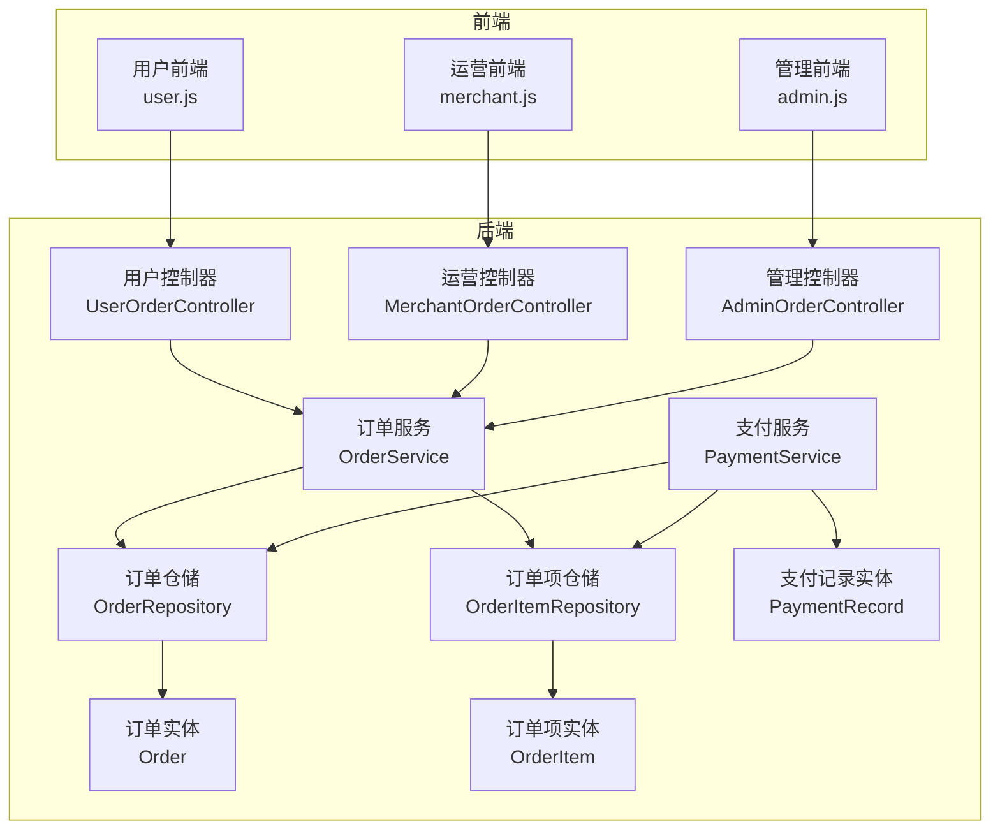
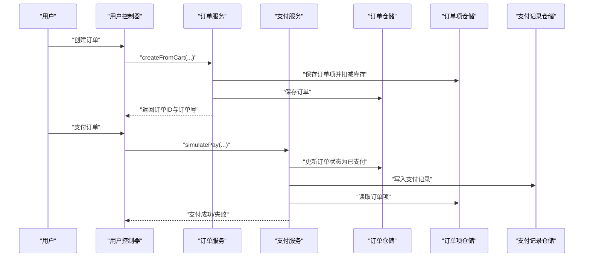
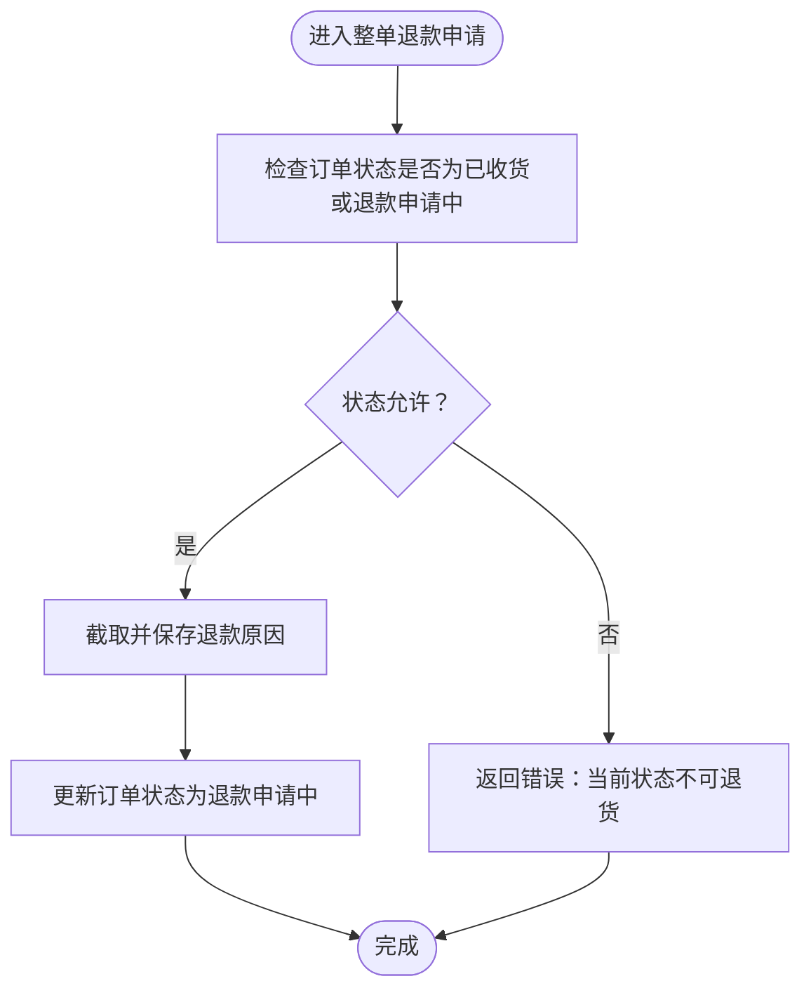
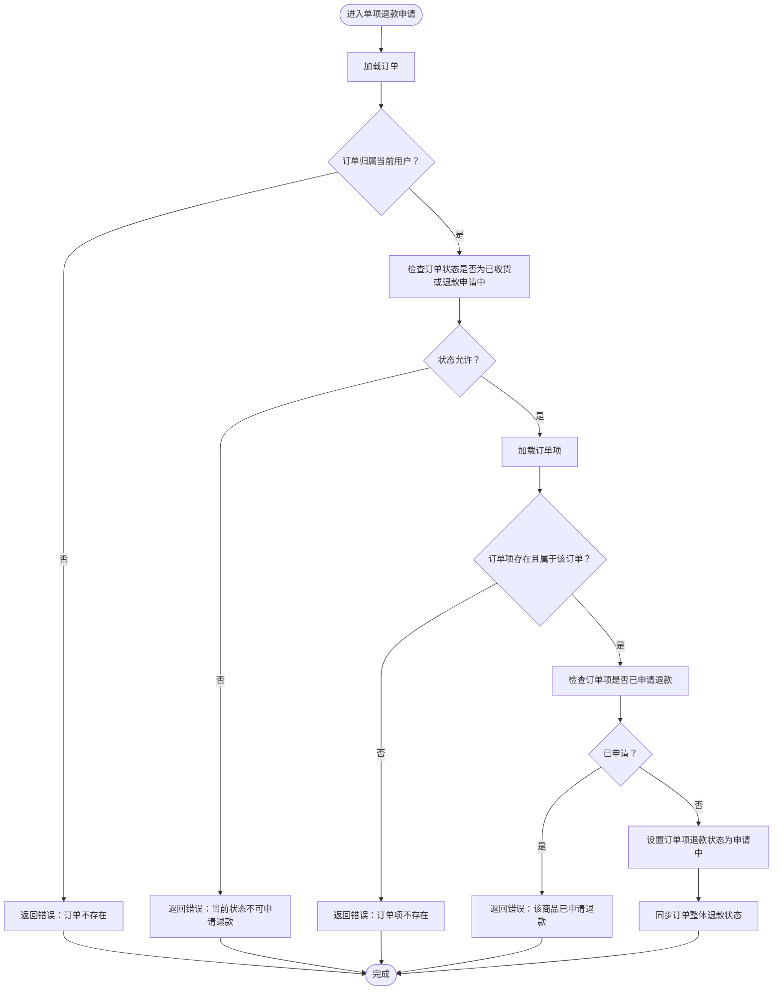
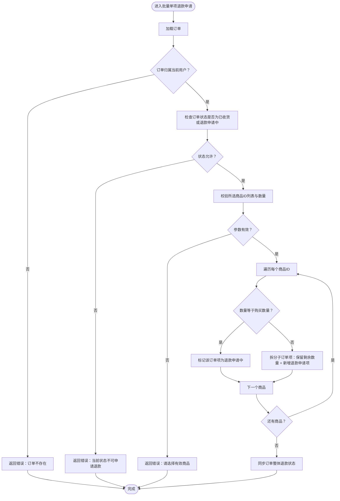
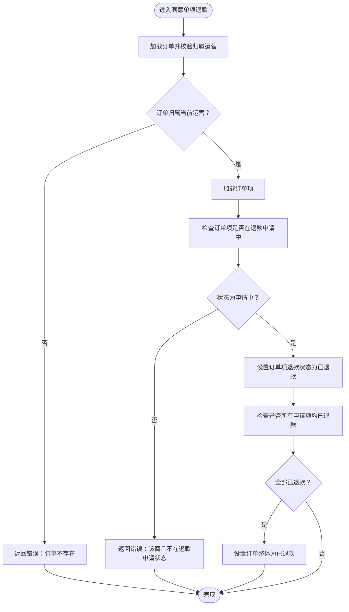
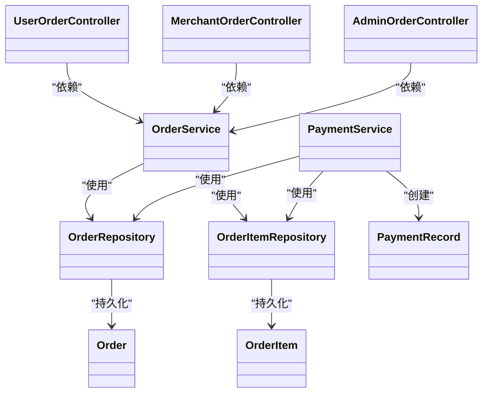

# 订单管理接口

<cite>
**本文档引用的文件**
- [AdminOrderController.java](file://backend/src/main/java/com/mall/controller/admin/AdminOrderController.java)
- [MerchantOrderController.java](file://backend/src/main/java/com/mall/controller/merchant/MerchantOrderController.java)
- [UserOrderController.java](file://backend/src/main/java/com/mall/controller/user/UserOrderController.java)
- [OrderService.java](file://backend/src/main/java/com/mall/service/OrderService.java)
- [PaymentService.java](file://backend/src/main/java/com/mall/service/PaymentService.java)
- [Order.java](file://backend/src/main/java/com/mall/entity/Order.java)
- [OrderItem.java](file://backend/src/main/java/com/mall/entity/OrderItem.java)
- [PaymentRecord.java](file://backend/src/main/java/com/mall/entity/PaymentRecord.java)
- [OrderRepository.java](file://backend/src/main/java/com/mall/repository/OrderRepository.java)
- [OrderItemRepository.java](file://backend/src/main/java/com/mall/repository/OrderItemRepository.java)
- [application.yml](file://backend/src/main/resources/application.yml)
- [user.js](file://frontend/src/api/user.js)
- [merchant.js](file://frontend/src/api/merchant.js)
- [admin.js](file://frontend/src/api/admin.js)
</cite>

## 目录
1. [简介](#简介)
2. [项目结构](#项目结构)
3. [核心组件](#核心组件)
4. [架构总览](#架构总览)
5. [详细组件分析](#详细组件分析)
6. [依赖关系分析](#依赖关系分析)
7. [性能考虑](#性能考虑)
8. [故障排查指南](#故障排查指南)
9. [结论](#结论)
10. [附录](#附录)

## 简介
本文件面向电商商城系统的订单管理接口，提供面向不同角色（用户、运营、管理）的完整API文档，涵盖订单统计、异常订单处理、订单查询与导出等核心功能。文档基于实际代码实现，详细说明了订单生命周期、状态流转、风控策略与客户服务流程，并通过可视化图表帮助读者快速理解系统架构与关键流程。

## 项目结构
后端采用Spring Boot + JPA分层架构，按角色划分控制器包：
- 控制器层：用户(UserOrderController)、运营(MerchantOrderController)、管理(AdminOrderController)
- 服务层：订单(OrderService)、支付(PaymentService)
- 数据访问层：OrderRepository、OrderItemRepository等
- 实体层：Order、OrderItem、PaymentRecord等

**图表来源**
- [UserOrderController.java:1-198](file://backend/src/main/java/com/mall/controller/user/UserOrderController.java#L1-198)
- [MerchantOrderController.java:1-100](file://backend/src/main/java/com/mall/controller/merchant/MerchantOrderController.java#L1-100)
- [AdminOrderController.java:1-45](file://backend/src/main/java/com/mall/controller/admin/AdminOrderController.java#L1-45)
- [OrderService.java:1-280](file://backend/src/main/java/com/mall/service/OrderService.java#L1-280)
- [PaymentService.java:1-67](file://backend/src/main/java/com/mall/service/PaymentService.java#L1-67)
- [OrderRepository.java:1-28](file://backend/src/main/java/com/mall/repository/OrderRepository.java#L1-28)
- [OrderItemRepository.java:1-20](file://backend/src/main/java/com/mall/repository/OrderItemRepository.java#L1-20)
- [Order.java:1-83](file://backend/src/main/java/com/mall/entity/Order.java#L1-83)
- [OrderItem.java:1-73](file://backend/src/main/java/com/mall/entity/OrderItem.java#L1-73)
- [PaymentRecord.java:1-46](file://backend/src/main/java/com/mall/entity/PaymentRecord.java#L1-46)

**章节来源**
- [application.yml:1-36](file://backend/src/main/resources/application.yml#L1-L36)

## 核心组件
- 订单实体(Order)：描述订单基础信息、金额、收货人信息、退款相关信息及时间戳
- 订单项实体(OrderItem)：描述订单内单项商品、单价、数量、小计、单品退款状态与评价标记
- 支付记录实体(PaymentRecord)：记录支付方式、金额与时间，确保支付数据完整性
- 订单服务(OrderService)：负责下单、查询、状态更新、退款申请与审批、库存回补等
- 支付服务(PaymentService)：模拟支付并写入支付记录，同时更新商品销量

**章节来源**
- [Order.java:1-83](file://backend/src/main/java/com/mall/entity/Order.java#L1-L83)
- [OrderItem.java:1-73](file://backend/src/main/java/com/mall/entity/OrderItem.java#L1-L73)
- [PaymentRecord.java:1-46](file://backend/src/main/java/com/mall/entity/PaymentRecord.java#L1-L46)
- [OrderService.java:1-280](file://backend/src/main/java/com/mall/service/OrderService.java#L1-L280)
- [PaymentService.java:1-67](file://backend/src/main/java/com/mall/service/PaymentService.java#L1-L67)

## 架构总览
系统围绕订单生命周期展开，用户发起下单与支付，运营负责发货与退款审批，管理端进行全局订单查询与报表。支付完成后触发销量更新与支付记录落库。

**图表来源**
- [UserOrderController.java:34-50](file://backend/src/main/java/com/mall/controller/user/UserOrderController.java#L34-L50)
- [OrderService.java:34-88](file://backend/src/main/java/com/mall/service/OrderService.java#L34-L88)
- [PaymentService.java:30-65](file://backend/src/main/java/com/mall/service/PaymentService.java#L30-L65)
- [OrderRepository.java:1-28](file://backend/src/main/java/com/mall/repository/OrderRepository.java#L1-L28)
- [OrderItemRepository.java:1-20](file://backend/src/main/java/com/mall/repository/OrderItemRepository.java#L1-L20)

## 详细组件分析

### 用户订单接口（用户端）
- 功能概览
  - 下单：从购物车创建订单，校验库存并扣减
  - 查询：分页获取我的订单，包含订单项明细
  - 支付：模拟支付，设置支付方式与时间，写入支付记录并更新销量
  - 状态变更：确认收货、完成订单、取消订单（收货前）
  - 退款：整单/单项/批量单项退款申请，支持部分数量退款拆分

- 关键流程图（整单退款申请）

**图表来源**
- [UserOrderController.java:146-152](file://backend/src/main/java/com/mall/controller/user/UserOrderController.java#L146-L152)
- [OrderService.java:147-161](file://backend/src/main/java/com/mall/service/OrderService.java#L147-L161)

- 关键流程图（单项退款申请）

**图表来源**
- [UserOrderController.java:154-168](file://backend/src/main/java/com/mall/controller/user/UserOrderController.java#L154-L168)
- [OrderService.java:163-185](file://backend/src/main/java/com/mall/service/OrderService.java#L163-L185)

- 关键流程图（批量单项退款申请）

**图表来源**
- [UserOrderController.java:170-196](file://backend/src/main/java/com/mall/controller/user/UserOrderController.java#L170-L196)
- [OrderService.java:187-240](file://backend/src/main/java/com/mall/service/OrderService.java#L187-L240)

- API定义（用户端）
  - 创建订单
    - 方法：POST
    - 路径：/user/order/create
    - 请求体：{ merchantId, receiverName, receiverPhone, receiverAddress }
    - 响应：{ id, orderNo }
  - 我的订单列表
    - 方法：GET
    - 路径：/user/order
    - 查询参数：page, size
    - 响应：分页订单列表（含订单项）
  - 订单详情
    - 方法：GET
    - 路径：/user/order/{id}
    - 响应：{ order, items }
  - 支付订单
    - 方法：POST
    - 路径：/user/order/{id}/pay
    - 请求体：{ paymentMethod? }
    - 响应：成功/失败
  - 确认收货
    - 方法：POST
    - 路径：/user/order/{id}/confirm-receive
    - 响应：成功/失败
  - 完成订单
    - 方法：POST
    - 路径：/user/order/{id}/complete
    - 响应：成功/失败
  - 取消订单（收货前）
    - 方法：POST
    - 路径：/user/order/{id}/cancel
    - 响应：成功/失败
  - 整单退款申请
    - 方法：POST
    - 路径：/user/order/{id}/refund-request
    - 请求体：{ reason? }
    - 响应：成功/失败
  - 单项退款申请
    - 方法：POST
    - 路径：/user/order/{orderId}/items/{itemId}/refund-request
    - 请求体：{ reason? }
    - 响应：成功/失败
  - 批量单项退款申请
    - 方法：POST
    - 路径：/user/order/{orderId}/items/batch-refund-request
    - 请求体：{ reason?, itemIds[], itemQuantities:{itemId:qty} }
    - 响应：成功/失败

**章节来源**
- [UserOrderController.java:1-198](file://backend/src/main/java/com/mall/controller/user/UserOrderController.java#L1-L198)
- [OrderService.java:147-240](file://backend/src/main/java/com/mall/service/OrderService.java#L147-L240)
- [PaymentService.java:30-65](file://backend/src/main/java/com/mall/service/PaymentService.java#L30-L65)
- [user.js:58-112](file://frontend/src/api/user.js#L58-L112)

### 运营订单接口（运营端）
- 功能概览
  - 订单查询：分页获取当前运营的订单列表与详情
  - 发货：仅允许已支付订单执行发货操作
  - 退款审批：同意整单退款、同意单项退款、单项退款审批

- 关键流程图（同意单项退款）

**图表来源**
- [MerchantOrderController.java:87-99](file://backend/src/main/java/com/mall/controller/merchant/MerchantOrderController.java#L87-L99)
- [OrderService.java:254-278](file://backend/src/main/java/com/mall/service/OrderService.java#L254-L278)

- API定义（运营端）
  - 订单列表
    - 方法：GET
    - 路径：/merchant/order
    - 查询参数：page, size
    - 响应：分页订单列表
  - 订单详情
    - 方法：GET
    - 路径：/merchant/order/{id}
    - 响应：{ order, items }
  - 发货
    - 方法：POST
    - 路径：/merchant/order/{id}/ship
    - 响应：成功/失败
  - 同意整单退款
    - 方法：POST
    - 路径：/merchant/order/{id}/accept-refund
    - 响应：成功/失败
  - 同意单项退款
    - 方法：POST
    - 路径：/merchant/order/{orderId}/items/{itemId}/accept-refund
    - 响应：成功/失败

**章节来源**
- [MerchantOrderController.java:1-100](file://backend/src/main/java/com/mall/controller/merchant/MerchantOrderController.java#L1-L100)
- [OrderService.java:254-278](file://backend/src/main/java/com/mall/service/OrderService.java#L254-L278)
- [merchant.js:58-120](file://frontend/src/api/merchant.js#L58-L120)

### 管理订单接口（管理端）
- 功能概览
  - 全站订单分页查询
  - 订单详情查询（含订单项）

- API定义（管理端）
  - 订单列表
    - 方法：GET
    - 路径：/admin/order
    - 查询参数：page, size
    - 响应：分页订单列表
  - 订单详情
    - 方法：GET
    - 路径：/admin/order/{id}
    - 响应：{ order, items }

**章节来源**
- [AdminOrderController.java:1-45](file://backend/src/main/java/com/mall/controller/admin/AdminOrderController.java#L1-L45)
- [admin.js:78-86](file://frontend/src/api/admin.js#L78-L86)

### 订单状态与风控
- 订单状态
  - PENDING：待支付
  - PAID：已支付
  - SHIPPED：已发货
  - RECEIVED：已收货
  - COMPLETED：已完成
  - CANCELLED：已取消
  - REFUND_REQUESTED：退款申请中
  - REFUNDED：已退款

- 风控要点
  - 用户取消：仅允许在特定状态取消，否则拒绝
  - 退款申请：仅允许已收货或退款申请中状态发起
  - 发货限制：仅允许已支付订单发货
  - 库存扣减与回补：下单扣减、取消回补，保障库存一致性
  - 销量更新：支付成功后更新商品销量

**章节来源**
- [Order.java:31-33](file://backend/src/main/java/com/mall/entity/Order.java#L31-L33)
- [OrderItem.java:50-52](file://backend/src/main/java/com/mall/entity/OrderItem.java#L50-L52)
- [OrderService.java:123-145](file://backend/src/main/java/com/mall/service/OrderService.java#L123-L145)
- [OrderService.java:147-161](file://backend/src/main/java/com/mall/service/OrderService.java#L147-L161)
- [OrderService.java:254-278](file://backend/src/main/java/com/mall/service/OrderService.java#L254-L278)
- [PaymentService.java:56-63](file://backend/src/main/java/com/mall/service/PaymentService.java#L56-L63)

### 订单导出与报表（概念性说明）
- 导出能力建议
  - 管理端可扩展导出接口，支持按时间范围、状态、运营筛选导出CSV/Excel
  - 报表维度：销售总额、订单量、退款率、商品销量排行、运营业绩等
- 风险控制
  - 导出需鉴权与审计日志
  - 大数据量导出建议异步任务+分页拉取

[本节为概念性内容，无需源码引用]

## 依赖关系分析
- 控制器依赖服务：UserOrderController、MerchantOrderController、AdminOrderController分别依赖OrderService
- 服务依赖仓储：OrderService依赖OrderRepository与OrderItemRepository；PaymentService依赖OrderRepository、OrderItemRepository与PaymentRecordRepository
- 实体关系：Order与OrderItem一对多，PaymentRecord与Order关联

**图表来源**
- [UserOrderController.java:1-198](file://backend/src/main/java/com/mall/controller/user/UserOrderController.java#L1-L198)
- [MerchantOrderController.java:1-100](file://backend/src/main/java/com/mall/controller/merchant/MerchantOrderController.java#L1-L100)
- [AdminOrderController.java:1-45](file://backend/src/main/java/com/mall/controller/admin/AdminOrderController.java#L1-L45)
- [OrderService.java:1-280](file://backend/src/main/java/com/mall/service/OrderService.java#L1-L280)
- [PaymentService.java:1-67](file://backend/src/main/java/com/mall/service/PaymentService.java#L1-L67)
- [OrderRepository.java:1-28](file://backend/src/main/java/com/mall/repository/OrderRepository.java#L1-L28)
- [OrderItemRepository.java:1-20](file://backend/src/main/java/com/mall/repository/OrderItemRepository.java#L1-L20)
- [Order.java:1-83](file://backend/src/main/java/com/mall/entity/Order.java#L1-L83)
- [OrderItem.java:1-73](file://backend/src/main/java/com/mall/entity/OrderItem.java#L1-L73)
- [PaymentRecord.java:1-46](file://backend/src/main/java/com/mall/entity/PaymentRecord.java#L1-L46)

**章节来源**
- [OrderRepository.java:1-28](file://backend/src/main/java/com/mall/repository/OrderRepository.java#L1-L28)
- [OrderItemRepository.java:1-20](file://backend/src/main/java/com/mall/repository/OrderItemRepository.java#L1-L20)

## 性能考虑
- 分页查询：用户、运营、管理端均使用分页接口，避免一次性加载大量订单
- 状态索引：订单状态字段建议建立索引，提升查询效率
- 批量操作：批量单项退款时建议限制单次处理的商品数量，防止超大事务
- 缓存策略：可对热销商品信息进行缓存，减少重复查询
- 异步导出：大体量导出建议异步任务+分页拉取，避免阻塞线程

[本节提供通用指导，无需源码引用]

## 故障排查指南
- 订单不存在/无权限
  - 现象：返回“订单不存在”
  - 排查：确认用户ID与订单归属、运营ID与订单归属
- 状态不允许
  - 现象：取消失败、退款失败、发货失败
  - 排查：核对当前订单状态是否符合操作要求
- 库存不足
  - 现象：下单失败
  - 排查：检查商品库存与购买数量
- 退款数量不合法
  - 现象：批量退款报错
  - 排查：确认请求数量不超过购买数量且大于0

**章节来源**
- [UserOrderController.java:135-144](file://backend/src/main/java/com/mall/controller/user/UserOrderController.java#L135-L144)
- [OrderService.java:123-145](file://backend/src/main/java/com/mall/service/OrderService.java#L123-L145)
- [OrderService.java:187-240](file://backend/src/main/java/com/mall/service/OrderService.java#L187-L240)

## 结论
本订单管理接口覆盖用户、运营、管理三方场景，实现了从下单、支付、发货到退款的完整闭环。通过严格的风控策略与清晰的状态机设计，保障了业务一致性与安全性。建议后续增强报表与导出能力，并结合缓存与异步机制进一步优化性能。

## 附录
- 端口与上下文路径
  - 服务器端口：8080
  - 上下文路径：/api
- JWT配置
  - 密钥与过期时间在配置文件中定义

**章节来源**
- [application.yml:22-30](file://backend/src/main/resources/application.yml#L22-L30)