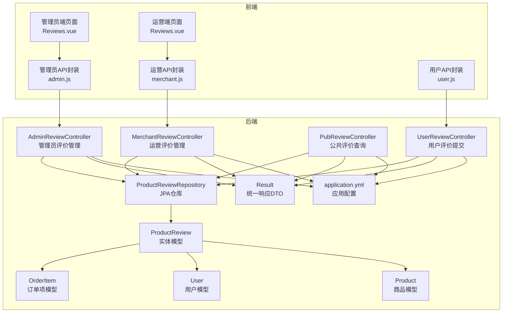
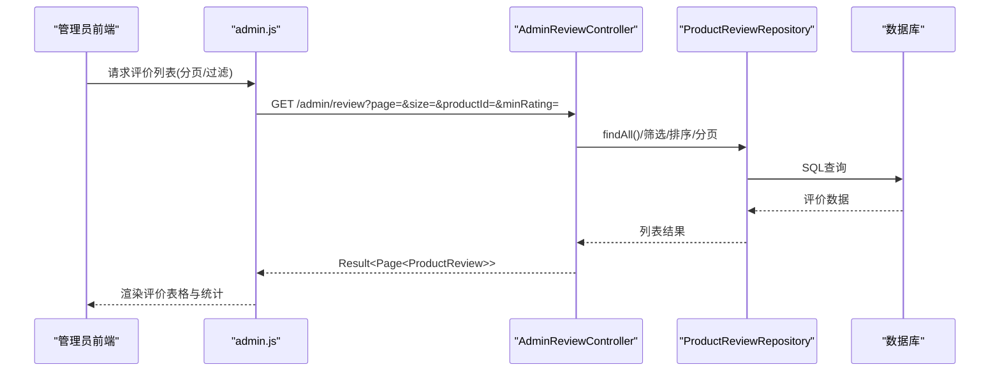
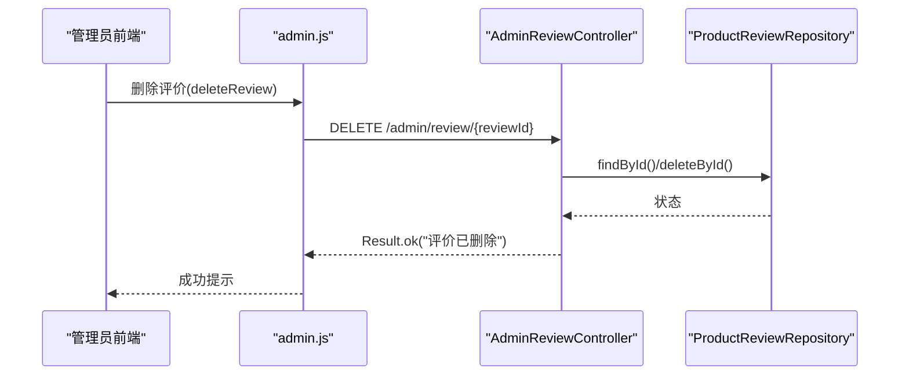
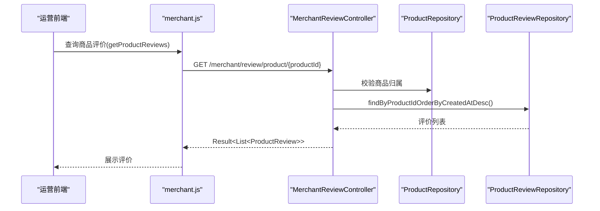
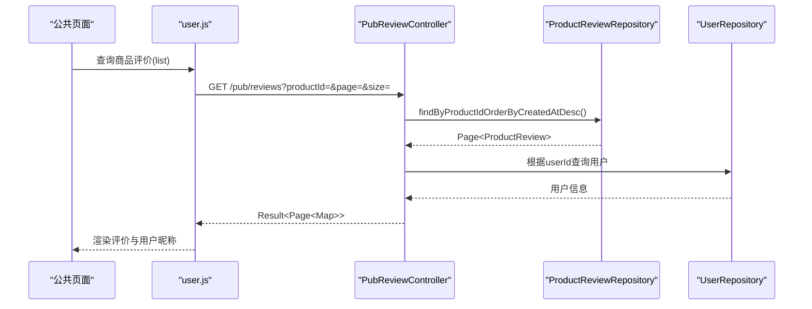
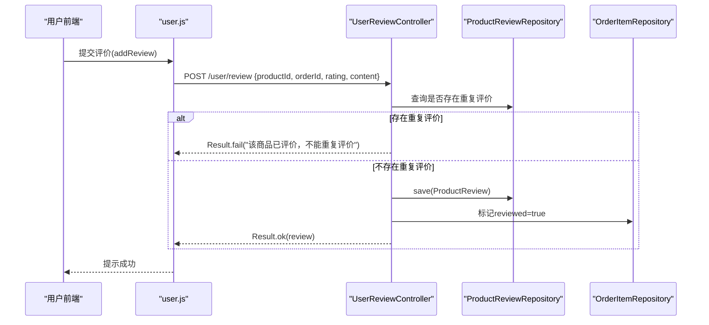
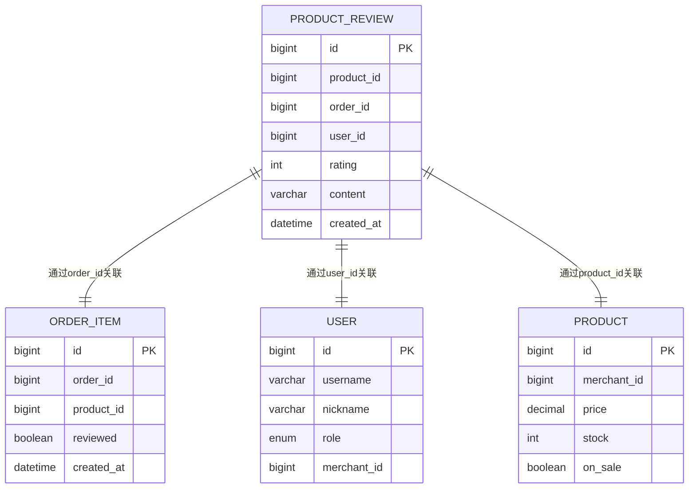
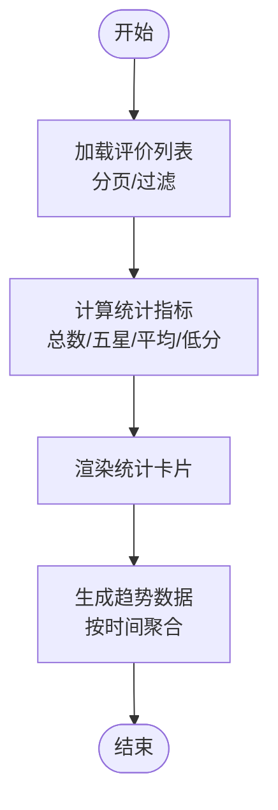
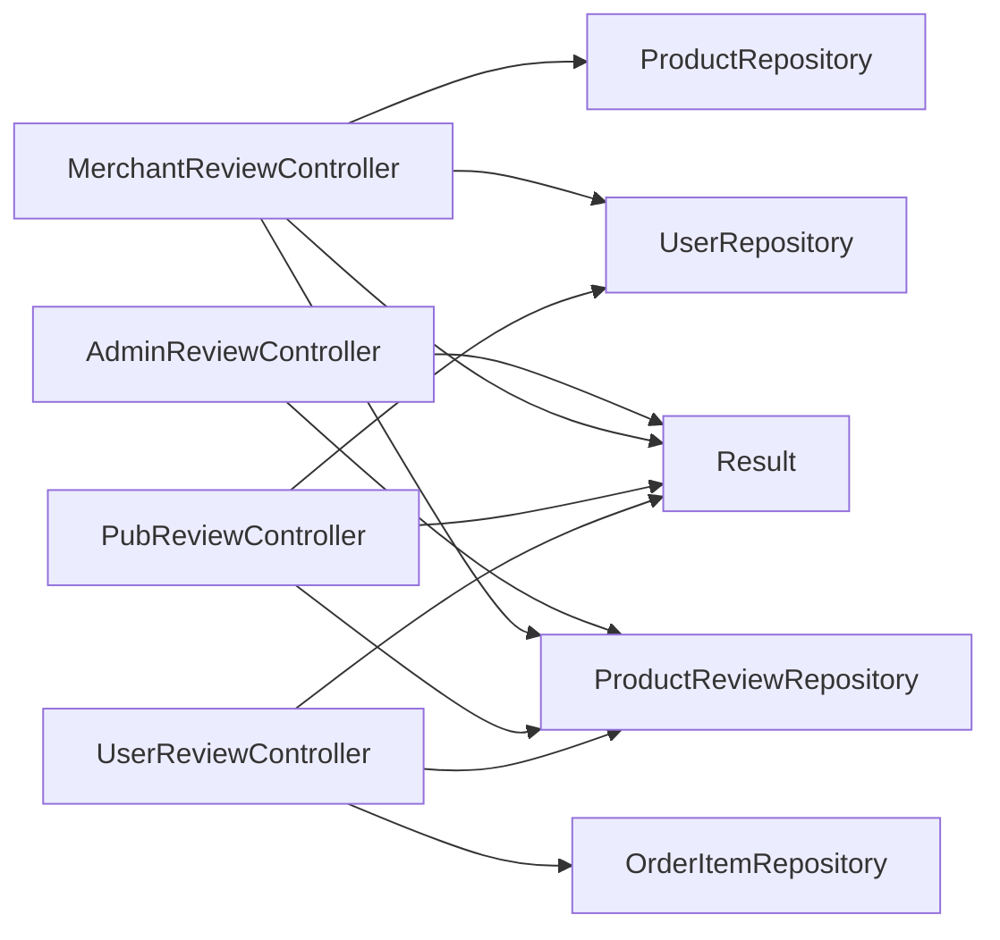

# 评价管理接口

<cite>
**本文档引用的文件**
- [AdminReviewController.java](file://backend/src/main/java/com/mall/controller/admin/AdminReviewController.java)
- [MerchantReviewController.java](file://backend/src/main/java/com/mall/controller/merchant/MerchantReviewController.java)
- [PubReviewController.java](file://backend/src/main/java/com/mall/controller/pub/PubReviewController.java)
- [UserReviewController.java](file://backend/src/main/java/com/mall/controller/user/UserReviewController.java)
- [ProductReview.java](file://backend/src/main/java/com/mall/entity/ProductReview.java)
- [ProductReviewRepository.java](file://backend/src/main/java/com/mall/repository/ProductReviewRepository.java)
- [OrderItem.java](file://backend/src/main/java/com/mall/entity/OrderItem.java)
- [User.java](file://backend/src/main/java/com/mall/entity/User.java)
- [Product.java](file://backend/src/main/java/com/mall/entity/Product.java)
- [Result.java](file://backend/src/main/java/com/mall/dto/Result.java)
- [application.yml](file://backend/src/main/resources/application.yml)
- [admin.js](file://frontend/src/api/admin.js)
- [merchant.js](file://frontend/src/api/merchant.js)
- [user.js](file://frontend/src/api/user.js)
- [Reviews.vue（管理员端）](file://frontend/src/views/admin/Reviews.vue)
- [Reviews.vue（运营端）](file://frontend/src/views/merchant/Reviews.vue)
</cite>

## 目录
1. [简介](#简介)
2. [项目结构](#项目结构)
3. [核心组件](#核心组件)
4. [架构概览](#架构概览)
5. [详细组件分析](#详细组件分析)
6. [依赖关系分析](#依赖关系分析)
7. [性能考虑](#性能考虑)
8. [故障排除指南](#故障排除指南)
9. [结论](#结论)
10. [附录](#附录)

## 简介
本文件为电商商城系统的评价管理接口提供全面的API文档，覆盖以下核心功能：
- 评价内容审核与违规处理：管理员与运营端对评价进行查看、筛选、删除与批量删除
- 评价统计分析：总评价数、五星评价数、平均评分、低分评价统计
- 评价趋势分析：基于时间维度的评价趋势（需结合业务扩展）
- 评价举报处理：用户举报审核与恶意评价处理（需结合业务扩展）
- 评价质量分析：基于评分分布、内容质量等指标的分析（需结合业务扩展）

同时，文档详细说明评价体系设计、内容安全策略、用户体验相关业务规则，并通过可视化图表展示系统架构与关键流程。

## 项目结构
后端采用Spring Boot + JPA分层架构，前端Vue + Element Plus实现管理界面。评价管理涉及四个控制器分别面向管理员、运营、公共展示与用户提交评价场景；数据模型围绕ProductReview、OrderItem、User、Product展开。

**图表来源**
- [AdminReviewController.java:16-91](file://backend/src/main/java/com/mall/controller/admin/AdminReviewController.java#L16-L91)
- [MerchantReviewController.java:21-156](file://backend/src/main/java/com/mall/controller/merchant/MerchantReviewController.java#L21-L156)
- [PubReviewController.java:19-62](file://backend/src/main/java/com/mall/controller/pub/PubReviewController.java#L19-L62)
- [UserReviewController.java:17-72](file://backend/src/main/java/com/mall/controller/user/UserReviewController.java#L17-L72)
- [ProductReviewRepository.java:10-15](file://backend/src/main/java/com/mall/repository/ProductReviewRepository.java#L10-L15)
- [ProductReview.java:15-43](file://backend/src/main/java/com/mall/entity/ProductReview.java#L15-L43)
- [OrderItem.java:16-72](file://backend/src/main/java/com/mall/entity/OrderItem.java#L16-L72)
- [User.java:17-87](file://backend/src/main/java/com/mall/entity/User.java#L17-L87)
- [Product.java:16-100](file://backend/src/main/java/com/mall/entity/Product.java#L16-L100)
- [Result.java:10-23](file://backend/src/main/java/com/mall/dto/Result.java#L10-L23)
- [application.yml:1-36](file://backend/src/main/resources/application.yml#L1-L36)

**章节来源**
- [AdminReviewController.java:16-91](file://backend/src/main/java/com/mall/controller/admin/AdminReviewController.java#L16-L91)
- [MerchantReviewController.java:21-156](file://backend/src/main/java/com/mall/controller/merchant/MerchantReviewController.java#L21-L156)
- [PubReviewController.java:19-62](file://backend/src/main/java/com/mall/controller/pub/PubReviewController.java#L19-L62)
- [UserReviewController.java:17-72](file://backend/src/main/java/com/mall/controller/user/UserReviewController.java#L17-L72)
- [application.yml:1-36](file://backend/src/main/resources/application.yml#L1-L36)

## 核心组件
- 管理员评价管理接口：提供全站评价的分页查询、按商品与最低评分过滤、删除单条与批量删除
- 运营评价管理接口：基于运营绑定的商品范围进行评价查询与删除，支持按商品与最低评分过滤
- 公共评价查询接口：按商品分页查询评价列表，并关联用户昵称
- 用户评价提交接口：用户在完成订单后提交评价，避免重复评价并标记订单项为已评价

**章节来源**
- [AdminReviewController.java:24-90](file://backend/src/main/java/com/mall/controller/admin/AdminReviewController.java#L24-L90)
- [MerchantReviewController.java:39-155](file://backend/src/main/java/com/mall/controller/merchant/MerchantReviewController.java#L39-L155)
- [PubReviewController.java:28-61](file://backend/src/main/java/com/mall/controller/pub/PubReviewController.java#L28-L61)
- [UserReviewController.java:31-71](file://backend/src/main/java/com/mall/controller/user/UserReviewController.java#L31-L71)

## 架构概览
评价管理模块遵循前后端分离架构，前端通过API封装调用后端REST接口，后端控制器负责业务逻辑与数据访问，JPA仓库提供持久化能力，实体模型定义数据结构与约束。

**图表来源**
- [AdminReviewController.java:24-64](file://backend/src/main/java/com/mall/controller/admin/AdminReviewController.java#L24-L64)
- [ProductReviewRepository.java:10-15](file://backend/src/main/java/com/mall/repository/ProductReviewRepository.java#L10-L15)
- [admin.js:115-118](file://frontend/src/api/admin.js#L115-L118)

**章节来源**
- [AdminReviewController.java:24-64](file://backend/src/main/java/com/mall/controller/admin/AdminReviewController.java#L24-L64)
- [admin.js:115-118](file://frontend/src/api/admin.js#L115-L118)

## 详细组件分析

### 管理员评价管理接口
- 接口路径：/admin/review
- 功能：
  - 分页查询所有评价，支持按商品ID与最低评分过滤
  - 删除单条评价
  - 批量删除评价
- 关键点：
  - 使用内存过滤与排序，适合中小规模数据
  - 返回统一Result包装的分页结果

**图表来源**
- [AdminReviewController.java:66-76](file://backend/src/main/java/com/mall/controller/admin/AdminReviewController.java#L66-L76)
- [admin.js:120-123](file://frontend/src/api/admin.js#L120-L123)

**章节来源**
- [AdminReviewController.java:24-90](file://backend/src/main/java/com/mall/controller/admin/AdminReviewController.java#L24-L90)
- [admin.js:115-129](file://frontend/src/api/admin.js#L115-L129)

### 运营评价管理接口
- 接口路径：/merchant/review
- 功能：
  - 分页查询当前运营名下商品的评价，支持按商品与最低评分过滤
  - 查询单个商品的所有评价
  - 删除单条评价（仅限运营拥有商品）
  - 批量删除评价（仅限运营拥有商品）
- 关键点：
  - 通过认证上下文获取运营ID并校验商品归属
  - 对删除操作进行权限控制

**图表来源**
- [MerchantReviewController.java:93-110](file://backend/src/main/java/com/mall/controller/merchant/MerchantReviewController.java#L93-L110)
- [merchant.js:97-100](file://frontend/src/api/merchant.js#L97-L100)

**章节来源**
- [MerchantReviewController.java:39-155](file://backend/src/main/java/com/mall/controller/merchant/MerchantReviewController.java#L39-L155)
- [merchant.js:90-110](file://frontend/src/api/merchant.js#L90-L110)

### 公共评价查询接口
- 接口路径：/pub/reviews
- 功能：
  - 按商品ID分页查询评价列表
  - 关联用户昵称，若无昵称则回退到用户名，否则显示“匿名用户”
- 关键点：
  - 将用户信息与评价数据合并返回，提升展示体验

**图表来源**
- [PubReviewController.java:28-61](file://backend/src/main/java/com/mall/controller/pub/PubReviewController.java#L28-L61)
- [user.js:114-117](file://frontend/src/api/user.js#L114-L117)

**章节来源**
- [PubReviewController.java:28-61](file://backend/src/main/java/com/mall/controller/pub/PubReviewController.java#L28-L61)
- [user.js:114-117](file://frontend/src/api/user.js#L114-L117)

### 用户评价提交接口
- 接口路径：/user/review
- 功能：
  - 提交商品评价，避免同一订单或同一用户对同一商品重复评价
  - 若提供订单ID，则标记对应订单项为已评价
- 关键点：
  - 通过订单项关联避免重复评价
  - 自动设置创建时间

**图表来源**
- [UserReviewController.java:31-71](file://backend/src/main/java/com/mall/controller/user/UserReviewController.java#L31-L71)
- [user.js:114-117](file://frontend/src/api/user.js#L114-L117)

**章节来源**
- [UserReviewController.java:31-71](file://backend/src/main/java/com/mall/controller/user/UserReviewController.java#L31-L71)
- [user.js:114-117](file://frontend/src/api/user.js#L114-L117)

### 数据模型与关系
评价管理涉及的核心实体包括ProductReview、OrderItem、User、Product，以及统一响应DTO Result。

**图表来源**
- [ProductReview.java:15-43](file://backend/src/main/java/com/mall/entity/ProductReview.java#L15-L43)
- [OrderItem.java:16-72](file://backend/src/main/java/com/mall/entity/OrderItem.java#L16-L72)
- [User.java:17-87](file://backend/src/main/java/com/mall/entity/User.java#L17-L87)
- [Product.java:16-100](file://backend/src/main/java/com/mall/entity/Product.java#L16-L100)

**章节来源**
- [ProductReview.java:15-43](file://backend/src/main/java/com/mall/entity/ProductReview.java#L15-L43)
- [OrderItem.java:16-72](file://backend/src/main/java/com/mall/entity/OrderItem.java#L16-L72)
- [User.java:17-87](file://backend/src/main/java/com/mall/entity/User.java#L17-L87)
- [Product.java:16-100](file://backend/src/main/java/com/mall/entity/Product.java#L16-L100)

### 评价统计与趋势分析
- 统计指标：
  - 总评价数：所有评价条目数量
  - 五星评价数：rating=5的评价数量
  - 平均评分：所有评价rating的平均值
  - 低评价：rating<3的评价数量
- 趋势分析：建议按月/周聚合评价数量与平均评分，前端可基于现有分页查询结果进行二次聚合（需扩展后端接口）

**图表来源**
- [Reviews.vue（管理员端）:222-242](file://frontend/src/views/admin/Reviews.vue#L222-L242)
- [Reviews.vue（运营端）:218-242](file://frontend/src/views/merchant/Reviews.vue#L218-L242)

**章节来源**
- [Reviews.vue（管理员端）:222-242](file://frontend/src/views/admin/Reviews.vue#L222-L242)
- [Reviews.vue（运营端）:218-242](file://frontend/src/views/merchant/Reviews.vue#L218-L242)

### 内容安全与举报处理
- 现状：后端未实现举报审核与恶意评价处理接口
- 建议扩展：
  - 新增举报实体与仓库
  - 新增举报审核控制器与接口
  - 实现恶意评价识别与封禁机制
  - 增加敏感词过滤与人工复核流程

[本节为概念性建议，不直接分析具体文件，故无章节来源]

## 依赖关系分析
- 控制器依赖：
  - AdminReviewController依赖ProductReviewRepository
  - MerchantReviewController依赖ProductReviewRepository、ProductRepository、UserRepository
  - PubReviewController依赖ProductReviewRepository、UserRepository
  - UserReviewController依赖ProductReviewRepository、OrderItemRepository
- 统一响应：
  - 所有控制器返回Result包装的数据结构
- 配置：
  - application.yml定义数据库连接、JPA方言与JWT配置

**图表来源**
- [AdminReviewController.java:22-22](file://backend/src/main/java/com/mall/controller/admin/AdminReviewController.java#L22-L22)
- [MerchantReviewController.java:27-29](file://backend/src/main/java/com/mall/controller/merchant/MerchantReviewController.java#L27-L29)
- [PubReviewController.java:25-26](file://backend/src/main/java/com/mall/controller/pub/PubReviewController.java#L25-L26)
- [UserReviewController.java:23-24](file://backend/src/main/java/com/mall/controller/user/UserReviewController.java#L23-L24)
- [Result.java:10-23](file://backend/src/main/java/com/mall/dto/Result.java#L10-L23)

**章节来源**
- [AdminReviewController.java:22-22](file://backend/src/main/java/com/mall/controller/admin/AdminReviewController.java#L22-L22)
- [MerchantReviewController.java:27-29](file://backend/src/main/java/com/mall/controller/merchant/MerchantReviewController.java#L27-L29)
- [PubReviewController.java:25-26](file://backend/src/main/java/com/mall/controller/pub/PubReviewController.java#L25-L26)
- [UserReviewController.java:23-24](file://backend/src/main/java/com/mall/controller/user/UserReviewController.java#L23-L24)
- [Result.java:10-23](file://backend/src/main/java/com/mall/dto/Result.java#L10-L23)

## 性能考虑
- 内存过滤与排序：管理员端在内存中对全量评价进行过滤与排序，适用于中小规模数据；大规模数据建议后端分页+数据库索引优化
- 分页参数：合理设置page与size，避免一次性加载过多数据
- 关联查询：公共查询接口需要根据userId查询用户昵称，建议在用户表建立索引以提升查询效率
- 缓存策略：对热门商品的评价列表可引入Redis缓存，降低数据库压力

[本节提供通用性能建议，不直接分析具体文件，故无章节来源]

## 故障排除指南
- 无权限删除评价：
  - 运营端删除评价时需确保评价所属商品属于当前运营，否则返回无权限错误
- 评价不存在：
  - 删除单条或批量删除时，若评价ID不存在，返回相应错误提示
- 重复评价：
  - 用户提交评价时，若同一订单或同一用户对同一商品已存在评价，返回重复评价错误
- 统计异常：
  - 前端统计计算依赖后端返回的评价列表，若列表为空，前端应正确处理并清零统计值

**章节来源**
- [MerchantReviewController.java:116-128](file://backend/src/main/java/com/mall/controller/merchant/MerchantReviewController.java#L116-L128)
- [AdminReviewController.java:69-72](file://backend/src/main/java/com/mall/controller/admin/AdminReviewController.java#L69-L72)
- [UserReviewController.java:40-47](file://backend/src/main/java/com/mall/controller/user/UserReviewController.java#L40-L47)
- [Reviews.vue（管理员端）:223-227](file://frontend/src/views/admin/Reviews.vue#L223-L227)

## 结论
评价管理接口已实现管理员与运营端对评价的查看、筛选、删除与批量删除能力，公共接口支持按商品分页查询并关联用户昵称，用户端支持提交评价并避免重复评价。建议后续扩展举报处理、恶意评价治理与评价质量分析能力，并针对大规模数据优化后端查询性能与前端展示体验。

[本节为总结性内容，不直接分析具体文件，故无章节来源]

## 附录

### API定义总览
- 管理端
  - GET /admin/review?page=&size=&productId=&minRating=：分页查询评价
  - DELETE /admin/review/{reviewId}：删除单条评价
  - POST /admin/review/batch-delete：批量删除评价
- 运营端
  - GET /merchant/review?page=&size=&productId=&minRating=：分页查询评价
  - GET /merchant/review/product/{productId}：查询单个商品评价
  - DELETE /merchant/review/{reviewId}：删除单条评价
  - POST /merchant/review/batch-delete：批量删除评价
- 公共端
  - GET /pub/reviews?productId=&page=&size=：按商品分页查询评价
- 用户端
  - POST /user/review：提交商品评价

**章节来源**
- [admin.js:115-129](file://frontend/src/api/admin.js#L115-L129)
- [merchant.js:92-110](file://frontend/src/api/merchant.js#L92-L110)
- [user.js:114-117](file://frontend/src/api/user.js#L114-L117)