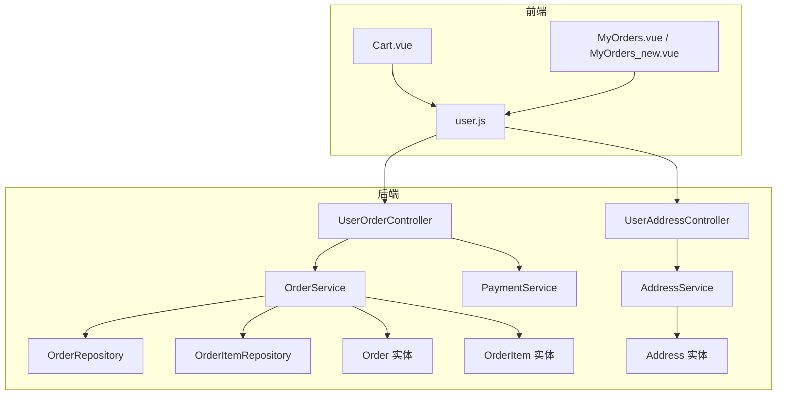
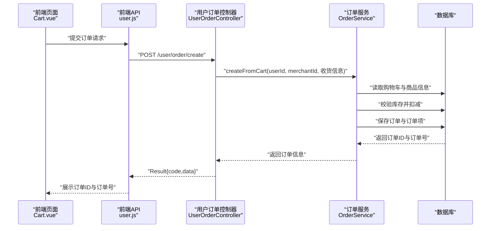
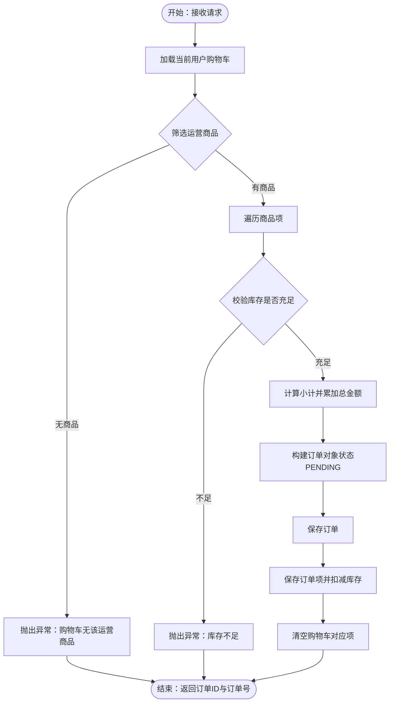
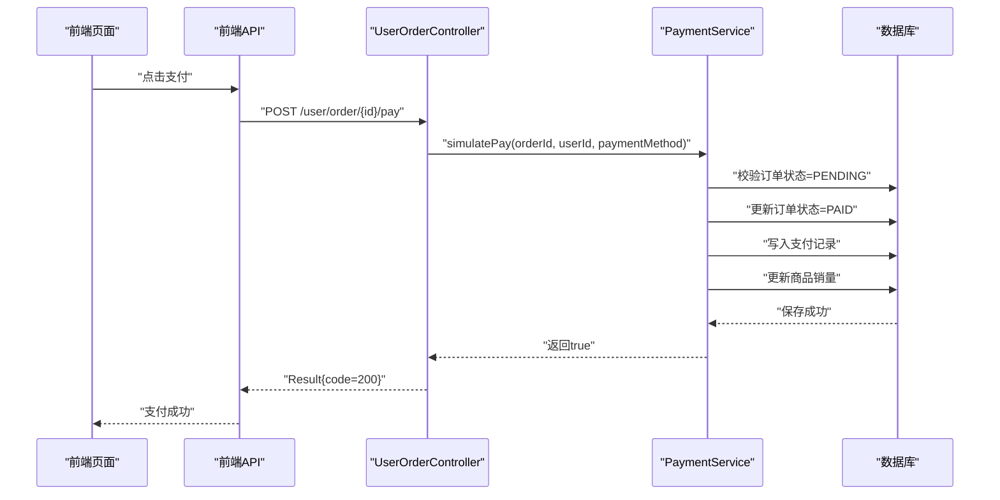
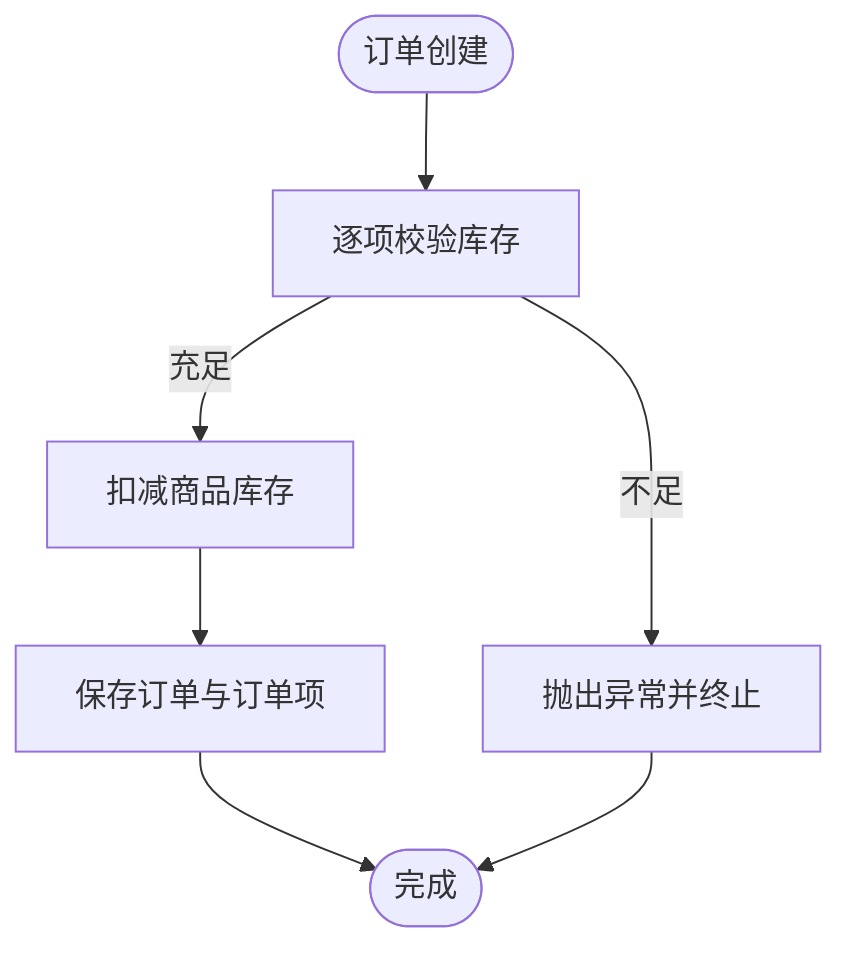
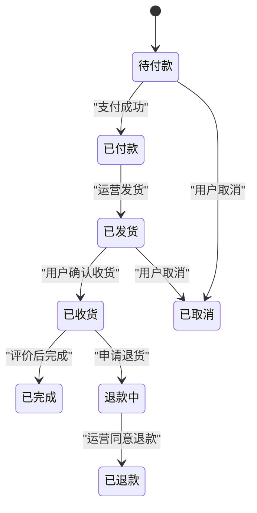
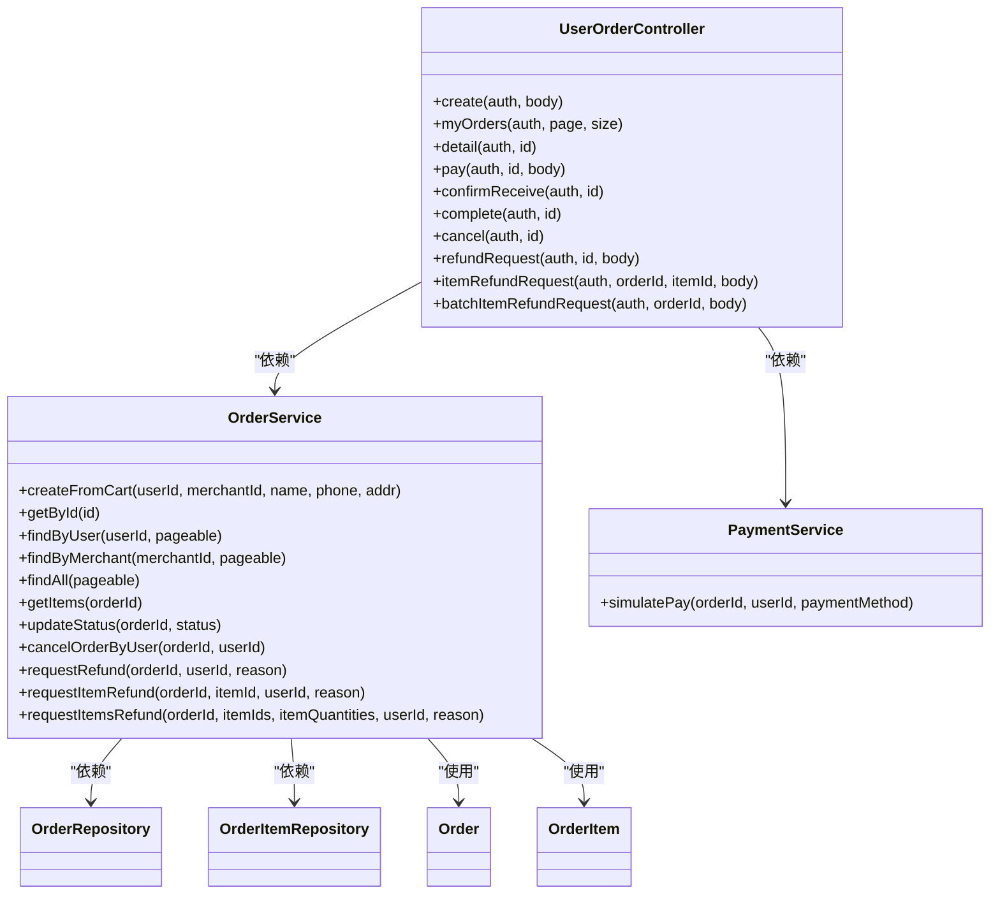

# 订单创建接口

<cite>
**本文档引用的文件**
- [UserOrderController.java](file://backend/src/main/java/com/mall/controller/user/UserOrderController.java)
- [OrderService.java](file://backend/src/main/java/com/mall/service/OrderService.java)
- [PaymentService.java](file://backend/src/main/java/com/mall/service/PaymentService.java)
- [Order.java](file://backend/src/main/java/com/mall/entity/Order.java)
- [OrderItem.java](file://backend/src/main/java/com/mall/entity/OrderItem.java)
- [OrderRepository.java](file://backend/src/main/java/com/mall/repository/OrderRepository.java)
- [OrderItemRepository.java](file://backend/src/main/java/com/mall/repository/OrderItemRepository.java)
- [UserAddressController.java](file://backend/src/main/java/com/mall/controller/user/UserAddressController.java)
- [AddressService.java](file://backend/src/main/java/com/mall/service/AddressService.java)
- [Address.java](file://backend/src/main/java/com/mall/entity/Address.java)
- [application.yml](file://backend/src/main/resources/application.yml)
- [Result.java](file://backend/src/main/java/com/mall/dto/Result.java)
- [user.js](file://frontend/src/api/user.js)
- [Cart.vue](file://frontend/src/views/user/Cart.vue)
- [MyOrders.vue](file://frontend/src/views/user/MyOrders.vue)
- [MyOrders_new.vue](file://frontend/src/views/user/MyOrders_new.vue)
</cite>

## 目录
1. [简介](#简介)
2. [项目结构](#项目结构)
3. [核心组件](#核心组件)
4. [架构总览](#架构总览)
5. [详细组件分析](#详细组件分析)
6. [依赖关系分析](#依赖关系分析)
7. [性能考虑](#性能考虑)
8. [故障排查指南](#故障排查指南)
9. [结论](#结论)

## 简介
本文件面向订单创建与确认流程，提供完整的API文档与实现细节说明，覆盖以下关键点：
- 订单确认接口（POST /user/order/create）
- 订单提交后的支付流程
- 订单数据验证规则
- 收货地址选择与管理
- 优惠券使用接口（当前系统未实现）
- 运费计算逻辑（当前系统未实现）
- 库存扣减机制
- 订单状态流转
- 支付方式选择
- 订单号生成规则
- 异常处理策略

## 项目结构
后端采用Spring Boot + JPA架构，订单相关模块位于`controller`、`service`、`entity`、`repository`包中，前端通过统一的API封装调用。

**图表来源**
- [UserOrderController.java:1-198](file://backend/src/main/java/com/mall/controller/user/UserOrderController.java#L1-L198)
- [UserAddressController.java:1-73](file://backend/src/main/java/com/mall/controller/user/UserAddressController.java#L1-L73)
- [OrderService.java:1-280](file://backend/src/main/java/com/mall/service/OrderService.java#L1-L280)
- [PaymentService.java:1-67](file://backend/src/main/java/com/mall/service/PaymentService.java#L1-L67)
- [AddressService.java:1-91](file://backend/src/main/java/com/mall/service/AddressService.java#L1-L91)
- [Order.java:1-83](file://backend/src/main/java/com/mall/entity/Order.java#L1-L83)
- [OrderItem.java:1-73](file://backend/src/main/java/com/mall/entity/OrderItem.java#L1-L73)
- [Address.java:1-60](file://backend/src/main/java/com/mall/entity/Address.java#L1-L60)

**章节来源**
- [application.yml:1-36](file://backend/src/main/resources/application.yml#L1-L36)

## 核心组件
- 控制器层：用户订单控制器负责接收请求、参数校验、调用服务层并返回统一响应格式。
- 服务层：订单服务负责从购物车创建订单、库存扣减、状态更新与退款流程；支付服务负责模拟支付与销量更新。
- 数据访问层：JPA仓库负责订单与订单项的持久化查询。
- 实体层：订单与订单项模型定义了字段、约束与时间戳。
- 前端API：统一封装HTTP请求，调用后端REST接口。

**章节来源**
- [UserOrderController.java:19-198](file://backend/src/main/java/com/mall/controller/user/UserOrderController.java#L19-L198)
- [OrderService.java:23-280](file://backend/src/main/java/com/mall/service/OrderService.java#L23-L280)
- [PaymentService.java:18-67](file://backend/src/main/java/com/mall/service/PaymentService.java#L18-L67)
- [Order.java:9-83](file://backend/src/main/java/com/mall/entity/Order.java#L9-L83)
- [OrderItem.java:9-73](file://backend/src/main/java/com/mall/entity/OrderItem.java#L9-L73)

## 架构总览
订单创建与支付的整体流程如下：

**图表来源**
- [Cart.vue:422-449](file://frontend/src/views/user/Cart.vue#L422-L449)
- [user.js:58-61](file://frontend/src/api/user.js#L58-L61)
- [UserOrderController.java:33-50](file://backend/src/main/java/com/mall/controller/user/UserOrderController.java#L33-L50)
- [OrderService.java:34-88](file://backend/src/main/java/com/mall/service/OrderService.java#L34-L88)

## 详细组件分析

### 订单确认接口（POST /user/order/create）
- 接口路径：/user/order/create
- 方法：POST
- 请求体参数：
  - merchantId：运营ID（必填）
  - receiverName：收货人姓名（必填）
  - receiverPhone：收货人电话（必填）
  - receiverAddress：收货地址（必填）
- 成功响应：返回订单ID与订单号
- 失败响应：返回错误信息

实现要点：
- 从当前登录用户购物车筛选属于指定运营的商品
- 校验库存充足性，逐项计算小计并累加总金额
- 生成唯一订单号（规则见“订单号生成规则”）
- 保存订单与订单项，并执行库存扣减
- 清空已下单的购物车项

**图表来源**
- [OrderService.java:34-88](file://backend/src/main/java/com/mall/service/OrderService.java#L34-L88)
- [UserOrderController.java:33-50](file://backend/src/main/java/com/mall/controller/user/UserOrderController.java#L33-L50)

**章节来源**
- [UserOrderController.java:33-50](file://backend/src/main/java/com/mall/controller/user/UserOrderController.java#L33-L50)
- [OrderService.java:34-88](file://backend/src/main/java/com/mall/service/OrderService.java#L34-L88)

### 订单提交接口（POST /user/order/{id}/pay）
- 接口路径：/user/order/{id}/pay
- 方法：POST
- 路径参数：id（订单ID）
- 请求体参数：paymentMethod（可选，默认WECHAT）
- 成功响应：标记订单为已支付并写入支付记录
- 失败响应：返回支付失败

实现要点：
- 校验订单存在性与归属
- 校验订单状态必须为PENDING
- 更新订单状态为PAID、设置支付方式、支付时间与应付金额
- 写入支付记录
- 更新商品销量

**图表来源**
- [PaymentService.java:30-65](file://backend/src/main/java/com/mall/service/PaymentService.java#L30-L65)
- [UserOrderController.java:102-111](file://backend/src/main/java/com/mall/controller/user/UserOrderController.java#L102-L111)
- [MyOrders.vue:727-736](file://frontend/src/views/user/MyOrders.vue#L727-L736)

**章节来源**
- [PaymentService.java:30-65](file://backend/src/main/java/com/mall/service/PaymentService.java#L30-L65)
- [UserOrderController.java:102-111](file://backend/src/main/java/com/mall/controller/user/UserOrderController.java#L102-L111)

### 订单数据验证规则
- 收货信息必填：收货人姓名、电话、地址
- 支付方式可选，默认WECHAT
- 订单状态限制：支付仅允许PENDING状态
- 退款申请限制：仅允许已收货或退款申请中的订单

**章节来源**
- [UserOrderController.java:40-49](file://backend/src/main/java/com/mall/controller/user/UserOrderController.java#L40-L49)
- [PaymentService.java:36-39](file://backend/src/main/java/com/mall/service/PaymentService.java#L36-L39)
- [OrderService.java:150-161](file://backend/src/main/java/com/mall/service/OrderService.java#L150-L161)

### 收货地址选择
- 地址管理接口：
  - GET /user/address：获取用户地址列表
  - GET /user/address/default：获取默认地址
  - GET /user/address/{id}：获取指定地址
  - POST /user/address：新增地址
  - PUT /user/address/{id}：更新地址
  - DELETE /user/address/{id}：删除地址
  - PUT /user/address/{id}/default：设为默认地址

- 前端在下单页校验收货信息完整性后才允许提交订单。

**章节来源**
- [UserAddressController.java:19-71](file://backend/src/main/java/com/mall/controller/user/UserAddressController.java#L19-L71)
- [AddressService.java:17-89](file://backend/src/main/java/com/mall/service/AddressService.java#L17-L89)
- [Address.java:10-60](file://backend/src/main/java/com/mall/entity/Address.java#L10-L60)
- [Cart.vue:422-435](file://frontend/src/views/user/Cart.vue#L422-L435)

### 优惠券使用接口
- 当前系统未提供优惠券相关接口与实现。

**章节来源**
- [UserOrderController.java:33-198](file://backend/src/main/java/com/mall/controller/user/UserOrderController.java#L33-L198)

### 运费计算逻辑
- 当前系统未提供运费计算逻辑，运费字段未在订单模型中体现。

**章节来源**
- [Order.java:35-45](file://backend/src/main/java/com/mall/entity/Order.java#L35-L45)

### 库存扣减机制
- 在订单创建时，按订单项数量从商品库存中扣减
- 若库存不足，抛出异常阻止下单
- 取消订单时，回补相应商品库存

**图表来源**
- [OrderService.java:49-84](file://backend/src/main/java/com/mall/service/OrderService.java#L49-L84)

**章节来源**
- [OrderService.java:49-84](file://backend/src/main/java/com/mall/service/OrderService.java#L49-L84)

### 订单状态流转
- 用户侧：PENDING → PAID → SHIPPED → RECEIVED → COMPLETED
- 用户取消：PENDING/PAID/TO_SHIP → CANCELLED
- 退款流程：RECEIVED → REFUND_REQUESTED → REFUNDED

**图表来源**
- [Order.java:31-33](file://backend/src/main/java/com/mall/entity/Order.java#L31-L33)
- [OrderService.java:115-145](file://backend/src/main/java/com/mall/service/OrderService.java#L115-L145)
- [MyOrders_new.vue:1572-1591](file://frontend/src/views/user/MyOrders_new.vue#L1572-L1591)

**章节来源**
- [Order.java:31-33](file://backend/src/main/java/com/mall/entity/Order.java#L31-L33)
- [OrderService.java:115-145](file://backend/src/main/java/com/mall/service/OrderService.java#L115-L145)

### 支付方式选择
- 支付方式枚举：ALIPAY、WECHAT、CARD、COD
- 默认支付方式：WECHAT
- 前端在下单页选择支付方式后提交支付请求

**章节来源**
- [PaymentService.java:38-44](file://backend/src/main/java/com/mall/service/PaymentService.java#L38-L44)
- [MyOrders_new.vue:1593-1601](file://frontend/src/views/user/MyOrders_new.vue#L1593-L1601)

### 订单号生成规则
- 规则：前缀O + 时间戳（yyyyMMddHHmmss）+ UUID截断片段（8字符）
- 示例：OyyyyMMddHHmmssXXXXYYYY

**章节来源**
- [OrderService.java:65](file://backend/src/main/java/com/mall/service/OrderService.java#L65)

### 异常处理策略
- 统一响应包装：Result类提供ok/fail静态方法
- 常见异常场景：
  - 购物车无目标运营商品
  - 库存不足
  - 订单不存在或非当前用户
  - 订单状态不允许取消/退款
  - 支付状态非PENDING

**章节来源**
- [Result.java:10-23](file://backend/src/main/java/com/mall/dto/Result.java#L10-L23)
- [OrderService.java:41-51](file://backend/src/main/java/com/mall/service/OrderService.java#L41-L51)
- [OrderService.java:124-145](file://backend/src/main/java/com/mall/service/OrderService.java#L124-L145)
- [PaymentService.java:32-39](file://backend/src/main/java/com/mall/service/PaymentService.java#L32-L39)

## 依赖关系分析

**图表来源**
- [UserOrderController.java:25-26](file://backend/src/main/java/com/mall/controller/user/UserOrderController.java#L25-L26)
- [OrderService.java:28-31](file://backend/src/main/java/com/mall/service/OrderService.java#L28-L31)
- [PaymentService.java:25-28](file://backend/src/main/java/com/mall/service/PaymentService.java#L25-L28)

**章节来源**
- [UserOrderController.java:25-26](file://backend/src/main/java/com/mall/controller/user/UserOrderController.java#L25-L26)
- [OrderService.java:28-31](file://backend/src/main/java/com/mall/service/OrderService.java#L28-L31)
- [PaymentService.java:25-28](file://backend/src/main/java/com/mall/service/PaymentService.java#L25-L28)

## 性能考虑
- 事务边界：订单创建与支付均使用@Transactional，确保一致性但需注意长事务影响。
- 批量操作：批量退款时按需拆分订单项，避免大事务。
- 查询优化：分页查询订单与订单项，避免一次性加载过多数据。
- 缓存建议：可引入Redis缓存热点商品库存与价格，减少数据库压力。

## 故障排查指南
- 订单创建失败
  - 检查购物车是否包含目标运营商品
  - 检查商品库存是否充足
  - 检查收货信息是否完整
- 支付失败
  - 确认订单状态为PENDING
  - 检查支付方式是否有效
- 取消/退款异常
  - 确认订单状态允许取消/退款
  - 检查订单归属与权限

**章节来源**
- [OrderService.java:41-51](file://backend/src/main/java/com/mall/service/OrderService.java#L41-L51)
- [OrderService.java:124-145](file://backend/src/main/java/com/mall/service/OrderService.java#L124-L145)
- [PaymentService.java:32-39](file://backend/src/main/java/com/mall/service/PaymentService.java#L32-L39)

## 结论
本文档基于现有代码实现了订单创建与支付流程的完整说明，明确了数据验证、库存扣减、状态流转与异常处理策略。对于优惠券与运费计算，当前系统尚未实现，可在后续版本中扩展。建议在生产环境中结合缓存与监控体系进一步提升性能与稳定性。