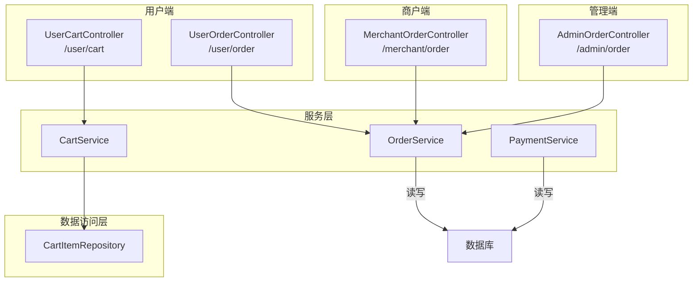
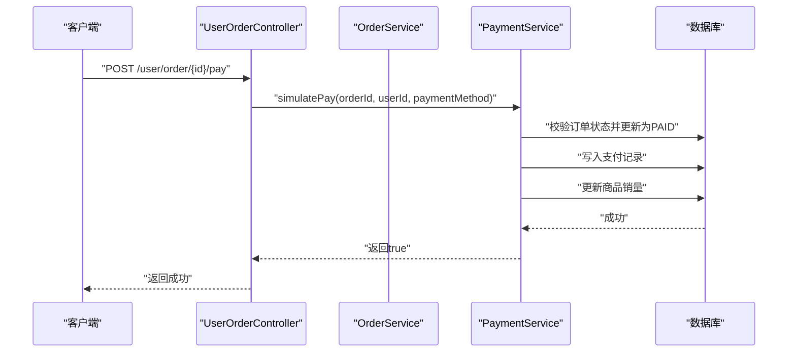
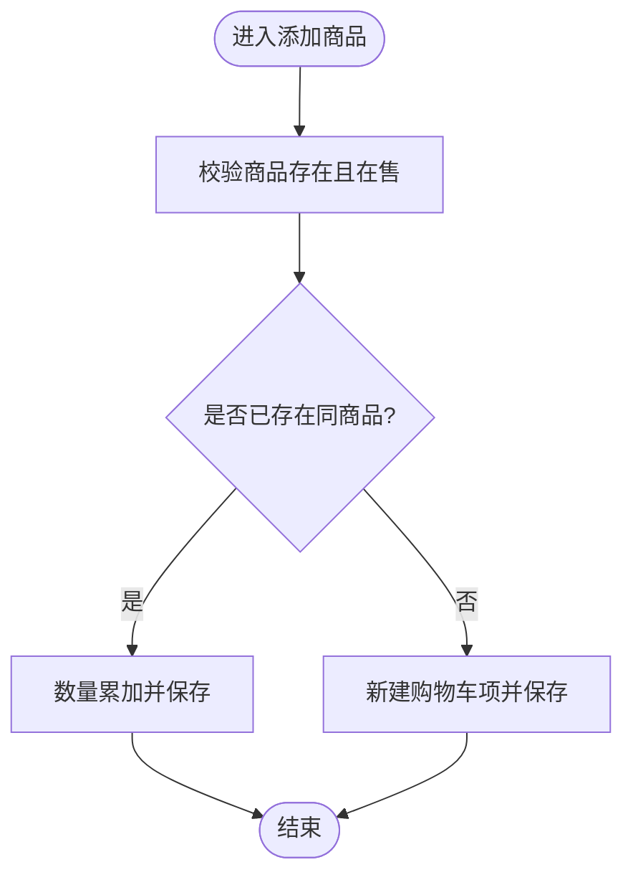
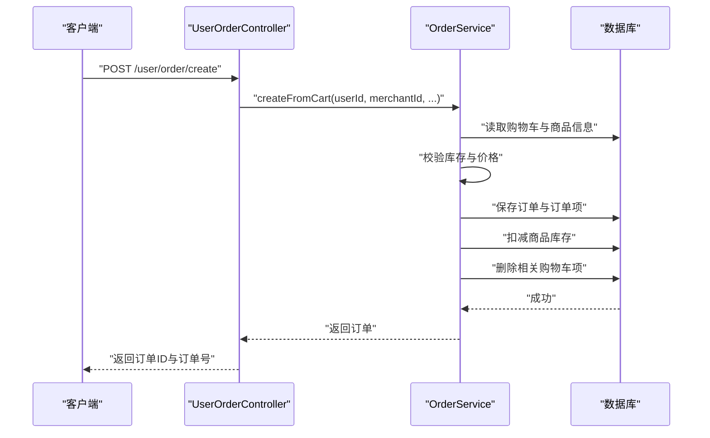
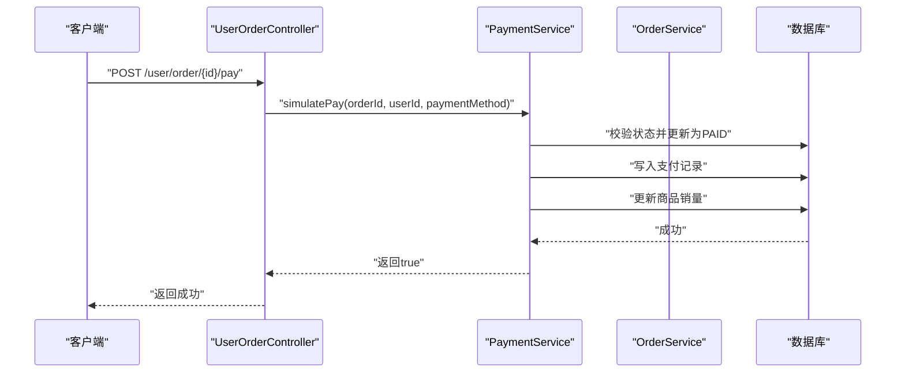
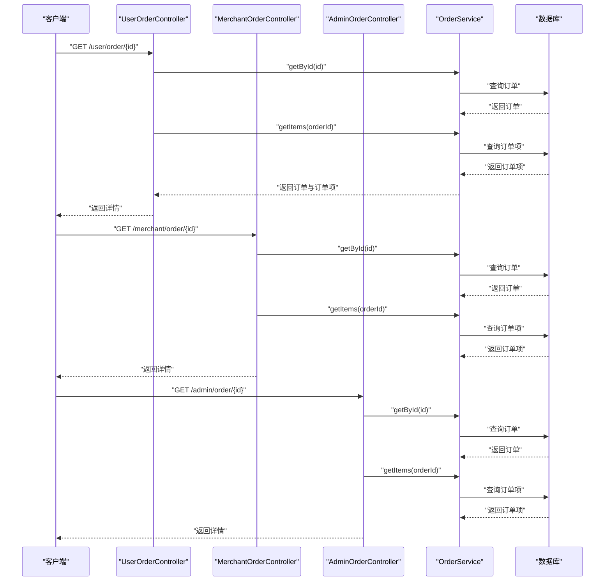
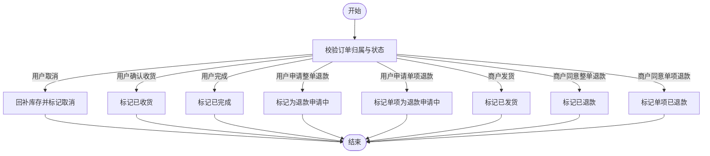
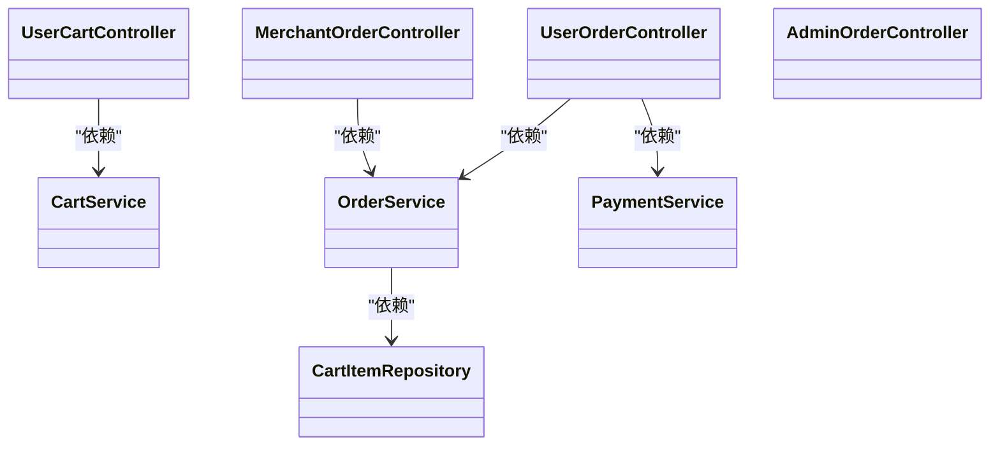
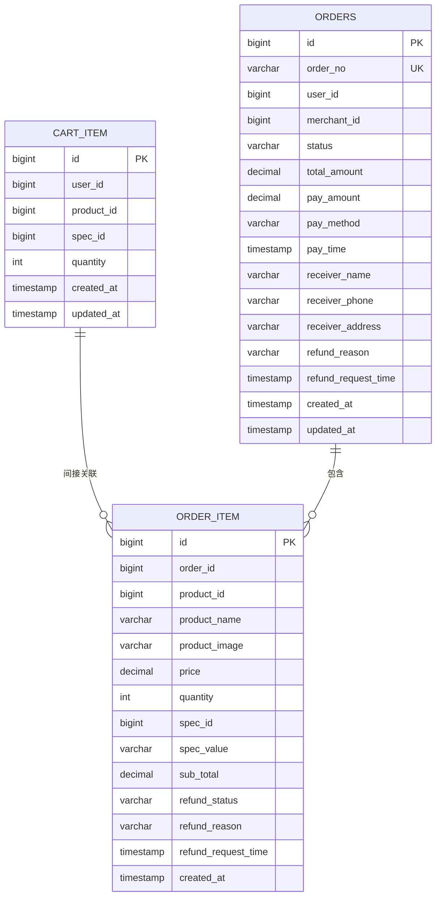

# 订单接口

<cite>
**本文引用的文件**
- [UserCartController.java](file://backend/src/main/java/com/mall/controller/user/UserCartController.java)
- [UserOrderController.java](file://backend/src/main/java/com/mall/controller/user/UserOrderController.java)
- [AdminOrderController.java](file://backend/src/main/java/com/mall/controller/admin/AdminOrderController.java)
- [MerchantOrderController.java](file://backend/src/main/java/com/mall/controller/merchant/MerchantOrderController.java)
- [CartService.java](file://backend/src/main/java/com/mall/service/CartService.java)
- [OrderService.java](file://backend/src/main/java/com/mall/service/OrderService.java)
- [PaymentService.java](file://backend/src/main/java/com/mall/service/PaymentService.java)
- [CartItem.java](file://backend/src/main/java/com/mall/entity/CartItem.java)
- [Order.java](file://backend/src/main/java/com/mall/entity/Order.java)
- [OrderItem.java](file://backend/src/main/java/com/mall/entity/OrderItem.java)
- [CartItemRepository.java](file://backend/src/main/java/com/mall/repository/CartItemRepository.java)
- [application.yml](file://backend/src/main/resources/application.yml)
- [Role.java](file://backend/src/main/java/com/mall/common/Role.java)
</cite>

## 目录
1. [简介](#简介)
2. [项目结构](#项目结构)
3. [核心组件](#核心组件)
4. [架构总览](#架构总览)
5. [详细组件分析](#详细组件分析)
6. [依赖关系分析](#依赖关系分析)
7. [性能考量](#性能考量)
8. [故障排查指南](#故障排查指南)
9. [结论](#结论)
10. [附录](#附录)

## 简介
本文件为电商商城系统的“订单接口”完整API文档，覆盖以下能力：
- 购物车接口：添加商品、修改数量、删除商品、清空购物车
- 订单创建接口：订单确认、优惠券使用（预留）、运费计算（预留）
- 订单支付接口：支付方式选择、支付状态更新
- 订单查询接口：订单列表、订单详情、状态筛选
- 订单状态管理接口：取消订单、确认收货、申请退款
并明确各角色（用户、商户、管理员）在订单流程中的不同权限与接口调用方式。

## 项目结构
后端采用Spring Boot + JPA分层架构，订单相关接口按角色划分在不同包内：
- 用户端：/user/cart、/user/order
- 商户端：/merchant/order
- 管理端：/admin/order

图表来源
- [UserCartController.java:1-67](file://backend/src/main/java/com/mall/controller/user/UserCartController.java#L1-L67)
- [UserOrderController.java:1-198](file://backend/src/main/java/com/mall/controller/user/UserOrderController.java#L1-L198)
- [AdminOrderController.java:1-45](file://backend/src/main/java/com/mall/controller/admin/AdminOrderController.java#L1-L45)
- [MerchantOrderController.java:1-100](file://backend/src/main/java/com/mall/controller/merchant/MerchantOrderController.java#L1-L100)
- [CartService.java:1-62](file://backend/src/main/java/com/mall/service/CartService.java#L1-L62)
- [OrderService.java:1-280](file://backend/src/main/java/com/mall/service/OrderService.java#L1-L280)
- [PaymentService.java:1-67](file://backend/src/main/java/com/mall/service/PaymentService.java#L1-L67)
- [CartItemRepository.java:1-21](file://backend/src/main/java/com/mall/repository/CartItemRepository.java#L1-L21)

章节来源
- [application.yml:1-36](file://backend/src/main/resources/application.yml#L1-L36)

## 核心组件
- 控制器层
  - 用户购物车控制器：提供查询、添加、修改数量、删除接口
  - 用户订单控制器：提供创建订单、查询列表/详情、模拟支付、确认收货、完成订单、取消订单、申请退款等
  - 商户订单控制器：提供查询订单、发货、同意退款、单项/批量同意退款
  - 管理员订单控制器：提供全站订单列表与详情
- 服务层
  - 购物车服务：基于用户ID查询、添加、修改数量、删除
  - 订单服务：从购物车创建订单、状态更新、取消订单、退款申请与审批
  - 支付服务：模拟支付，设置支付方式与时间，生成支付记录，更新商品销量
- 实体与仓库
  - 订单、订单项、购物车项实体定义字段与状态
  - 购物车仓库提供按用户/商品/规格维度的查询与删除

章节来源
- [UserCartController.java:14-67](file://backend/src/main/java/com/mall/controller/user/UserCartController.java#L14-L67)
- [UserOrderController.java:19-198](file://backend/src/main/java/com/mall/controller/user/UserOrderController.java#L19-L198)
- [MerchantOrderController.java:20-100](file://backend/src/main/java/com/mall/controller/merchant/MerchantOrderController.java#L20-L100)
- [AdminOrderController.java:17-45](file://backend/src/main/java/com/mall/controller/admin/AdminOrderController.java#L17-L45)
- [CartService.java:14-62](file://backend/src/main/java/com/mall/service/CartService.java#L14-L62)
- [OrderService.java:23-280](file://backend/src/main/java/com/mall/service/OrderService.java#L23-L280)
- [PaymentService.java:18-67](file://backend/src/main/java/com/mall/service/PaymentService.java#L18-L67)
- [CartItem.java:8-50](file://backend/src/main/java/com/mall/entity/CartItem.java#L8-L50)
- [Order.java:9-83](file://backend/src/main/java/com/mall/entity/Order.java#L9-L83)
- [OrderItem.java:9-73](file://backend/src/main/java/com/mall/entity/OrderItem.java#L9-L73)
- [CartItemRepository.java:9-21](file://backend/src/main/java/com/mall/repository/CartItemRepository.java#L9-L21)

## 架构总览
系统通过REST控制器接收请求，经由服务层执行业务逻辑（事务控制），最终持久化到数据库。支付流程通过模拟支付服务完成状态变更与记录生成。

图表来源
- [UserOrderController.java:102-111](file://backend/src/main/java/com/mall/controller/user/UserOrderController.java#L102-L111)
- [PaymentService.java:30-65](file://backend/src/main/java/com/mall/service/PaymentService.java#L30-L65)
- [OrderService.java:115-121](file://backend/src/main/java/com/mall/service/OrderService.java#L115-L121)

## 详细组件分析

### 购物车接口
- 接口概览
  - GET /user/cart：查询当前用户购物车
  - POST /user/cart/add：添加商品到购物车
  - PUT /user/cart/quantity：修改购物车商品数量
  - DELETE /user/cart/{productId}：从购物车移除商品
- 关键行为
  - 添加商品时校验商品是否存在且在售，若同规格已存在则累加数量
  - 修改数量为0或负数时等效删除
  - 删除按用户+商品维度进行
- 权限与安全
  - 基于认证上下文获取当前用户ID，确保操作仅限本人

图表来源
- [CartService.java:25-43](file://backend/src/main/java/com/mall/service/CartService.java#L25-L43)
- [CartItemRepository.java:13-17](file://backend/src/main/java/com/mall/repository/CartItemRepository.java#L13-L17)

章节来源
- [UserCartController.java:27-65](file://backend/src/main/java/com/mall/controller/user/UserCartController.java#L27-L65)
- [CartService.java:21-60](file://backend/src/main/java/com/mall/service/CartService.java#L21-L60)
- [CartItemRepository.java:11-20](file://backend/src/main/java/com/mall/repository/CartItemRepository.java#L11-L20)

### 订单创建接口
- 接口概览
  - POST /user/order/create：从购物车为指定商户创建订单
- 关键行为
  - 仅允许选择当前登录用户购物车中属于同一商户的商品
  - 校验库存充足，计算小计与总计
  - 创建订单与订单项，扣减对应商品库存，清空相关购物车项
- 参数与返回
  - 请求参数：merchantId、receiverName、receiverPhone、receiverAddress
  - 返回：订单ID与订单号

图表来源
- [UserOrderController.java:33-50](file://backend/src/main/java/com/mall/controller/user/UserOrderController.java#L33-L50)
- [OrderService.java:33-88](file://backend/src/main/java/com/mall/service/OrderService.java#L33-L88)

章节来源
- [UserOrderController.java:33-50](file://backend/src/main/java/com/mall/controller/user/UserOrderController.java#L33-L50)
- [OrderService.java:33-88](file://backend/src/main/java/com/mall/service/OrderService.java#L33-L88)

### 订单支付接口
- 接口概览
  - POST /user/order/{id}/pay：模拟支付，设置支付方式与时间，生成支付记录
- 关键行为
  - 仅允许状态为“待支付”的订单进行支付
  - 默认支付方式为“WECHAT”，可传入其他方式
  - 支付成功后更新商品销量
- 返回
  - 成功返回空对象，失败返回错误信息

图表来源
- [UserOrderController.java:102-111](file://backend/src/main/java/com/mall/controller/user/UserOrderController.java#L102-L111)
- [PaymentService.java:30-65](file://backend/src/main/java/com/mall/service/PaymentService.java#L30-L65)

章节来源
- [UserOrderController.java:102-111](file://backend/src/main/java/com/mall/controller/user/UserOrderController.java#L102-L111)
- [PaymentService.java:30-65](file://backend/src/main/java/com/mall/service/PaymentService.java#L30-L65)

### 订单查询接口
- 用户端
  - GET /user/order：分页查询我的订单，包含订单项
  - GET /user/order/{id}：查询订单详情（含订单项），并校验归属
- 商户端
  - GET /merchant/order：分页查询当前商户的订单
  - GET /merchant/order/{id}：查询订单详情（含订单项），并校验归属
- 管理端
  - GET /admin/order：分页查询全站订单
  - GET /admin/order/{id}：查询订单详情（含订单项）

图表来源
- [UserOrderController.java:88-100](file://backend/src/main/java/com/mall/controller/user/UserOrderController.java#L88-L100)
- [MerchantOrderController.java:47-59](file://backend/src/main/java/com/mall/controller/merchant/MerchantOrderController.java#L47-L59)
- [AdminOrderController.java:33-43](file://backend/src/main/java/com/mall/controller/admin/AdminOrderController.java#L33-L43)
- [OrderService.java:90-113](file://backend/src/main/java/com/mall/service/OrderService.java#L90-L113)

章节来源
- [UserOrderController.java:52-100](file://backend/src/main/java/com/mall/controller/user/UserOrderController.java#L52-L100)
- [MerchantOrderController.java:37-59](file://backend/src/main/java/com/mall/controller/merchant/MerchantOrderController.java#L37-L59)
- [AdminOrderController.java:25-43](file://backend/src/main/java/com/mall/controller/admin/AdminOrderController.java#L25-L43)
- [OrderService.java:90-113](file://backend/src/main/java/com/mall/service/OrderService.java#L90-L113)

### 订单状态管理接口
- 用户端
  - POST /user/order/{id}/cancel：收货前取消订单（回补库存）
  - POST /user/order/{id}/confirm-receive：确认收货
  - POST /user/order/{id}/complete：完成订单
  - POST /user/order/{id}/refund-request：整单申请退款（仅已收货）
  - POST /user/order/{id}/items/{itemId}/refund-request：单项申请退款
  - POST /user/order/{id}/items/batch-refund-request：批量单项申请退款
- 商户端
  - POST /merchant/order/{id}/ship：发货（仅已支付）
  - POST /merchant/order/{id}/accept-refund：同意整单退款
  - POST /merchant/order/{id}/items/{itemId}/accept-refund：同意单项退款
- 管理端
  - 仅提供查询（列表与详情）

图表来源
- [UserOrderController.java:135-152](file://backend/src/main/java/com/mall/controller/user/UserOrderController.java#L135-L152)
- [MerchantOrderController.java:61-85](file://backend/src/main/java/com/mall/controller/merchant/MerchantOrderController.java#L61-L85)
- [OrderService.java:123-145](file://backend/src/main/java/com/mall/service/OrderService.java#L123-L145)
- [OrderService.java:147-161](file://backend/src/main/java/com/mall/service/OrderService.java#L147-L161)
- [OrderService.java:163-185](file://backend/src/main/java/com/mall/service/OrderService.java#L163-L185)
- [OrderService.java:187-240](file://backend/src/main/java/com/mall/service/OrderService.java#L187-L240)
- [OrderService.java:254-278](file://backend/src/main/java/com/mall/service/OrderService.java#L254-L278)

章节来源
- [UserOrderController.java:135-196](file://backend/src/main/java/com/mall/controller/user/UserOrderController.java#L135-L196)
- [MerchantOrderController.java:61-99](file://backend/src/main/java/com/mall/controller/merchant/MerchantOrderController.java#L61-L99)
- [OrderService.java:123-278](file://backend/src/main/java/com/mall/service/OrderService.java#L123-L278)

### 角色与权限
- 角色枚举
  - ADMIN：管理员
  - MERCHANT：商户
  - USER：普通用户
- 权限边界
  - 用户仅能操作自己的订单与购物车
  - 商户仅能操作自己名下的订单
  - 管理员仅能查看全站订单

章节来源
- [Role.java:3-7](file://backend/src/main/java/com/mall/common/Role.java#L3-L7)
- [UserOrderController.java:88-100](file://backend/src/main/java/com/mall/controller/user/UserOrderController.java#L88-L100)
- [MerchantOrderController.java:47-59](file://backend/src/main/java/com/mall/controller/merchant/MerchantOrderController.java#L47-L59)
- [AdminOrderController.java:33-43](file://backend/src/main/java/com/mall/controller/admin/AdminOrderController.java#L33-L43)

## 依赖关系分析
- 控制器依赖服务层，服务层依赖仓库层与实体模型
- 支付服务与订单服务协作，共同维护订单状态与商品销量
- 购物车服务与订单服务协作，实现从购物车创建订单与库存扣减

图表来源
- [UserCartController.java:20](file://backend/src/main/java/com/mall/controller/user/UserCartController.java#L20)
- [UserOrderController.java:25-26](file://backend/src/main/java/com/mall/controller/user/UserOrderController.java#L25-L26)
- [MerchantOrderController.java:26](file://backend/src/main/java/com/mall/controller/merchant/MerchantOrderController.java#L26)
- [AdminOrderController.java:23](file://backend/src/main/java/com/mall/controller/admin/AdminOrderController.java#L23)
- [CartService.java:18](file://backend/src/main/java/com/mall/service/CartService.java#L18)
- [OrderService.java:28-31](file://backend/src/main/java/com/mall/service/OrderService.java#L28-L31)
- [PaymentService.java:25-28](file://backend/src/main/java/com/mall/service/PaymentService.java#L25-L28)
- [CartItemRepository.java:9](file://backend/src/main/java/com/mall/repository/CartItemRepository.java#L9)

## 性能考量
- 分页查询：订单列表均支持分页参数，避免一次性加载过多数据
- 事务边界：订单创建、支付、取消、退款等关键流程使用事务保证一致性
- 状态校验前置：在服务层集中校验状态与权限，减少无效请求开销
- 建议
  - 对高频查询增加索引（如订单表的用户ID、商户ID、状态、创建时间）
  - 对库存扣减与销量更新采用原子操作，避免并发问题

## 故障排查指南
- 常见错误与定位
  - “订单不存在”：检查订单ID与当前用户/商户归属是否匹配
  - “订单状态不可操作”：根据状态机核对当前状态是否允许该操作
  - “库存不足”：检查商品库存与购买数量
  - “支付失败”：确认订单状态为“待支付”，支付方式合法
- 日志与监控
  - 在application.yml中配置日志级别，便于追踪异常
  - 对关键业务（创建订单、支付、退款）埋点统计

章节来源
- [UserOrderController.java:92-94](file://backend/src/main/java/com/mall/controller/user/UserOrderController.java#L92-L94)
- [OrderService.java:127-130](file://backend/src/main/java/com/mall/service/OrderService.java#L127-L130)
- [OrderService.java:49-51](file://backend/src/main/java/com/mall/service/OrderService.java#L49-L51)
- [PaymentService.java:33-36](file://backend/src/main/java/com/mall/service/PaymentService.java#L33-L36)
- [application.yml:32-36](file://backend/src/main/resources/application.yml#L32-L36)

## 结论
本订单接口体系以清晰的角色边界与严谨的状态机为核心，覆盖从购物车到支付、发货、收货、退款的完整链路。通过服务层统一处理业务规则与事务，结合分页与权限校验，既满足功能需求又具备良好的扩展性与可维护性。

## 附录

### 数据模型图

图表来源
- [CartItem.java:15-49](file://backend/src/main/java/com/mall/entity/CartItem.java#L15-L49)
- [Order.java:16-82](file://backend/src/main/java/com/mall/entity/Order.java#L16-L82)
- [OrderItem.java:16-72](file://backend/src/main/java/com/mall/entity/OrderItem.java#L16-L72)