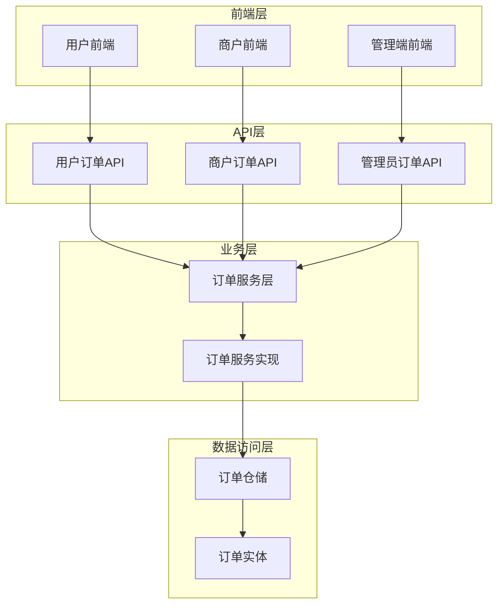
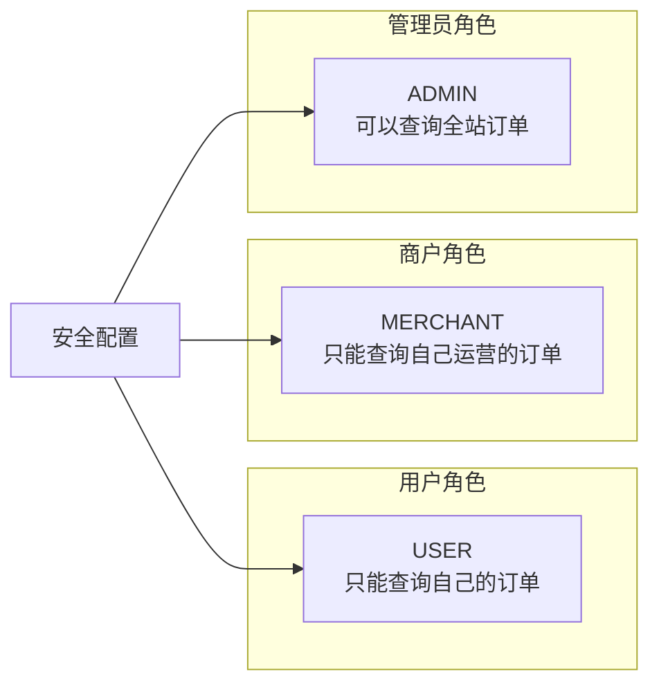
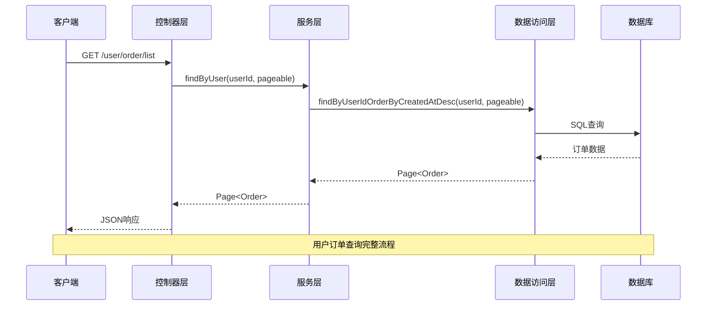
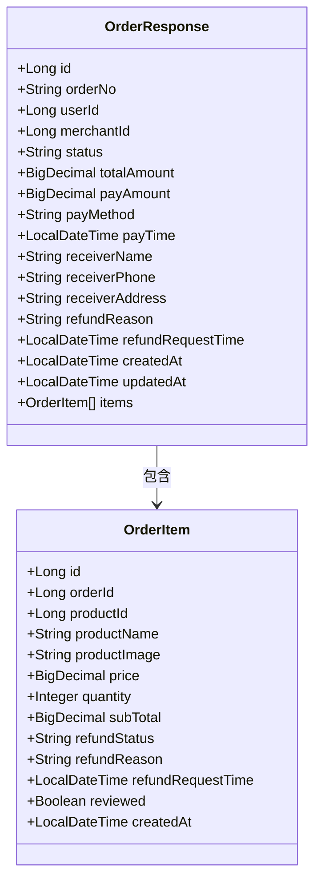
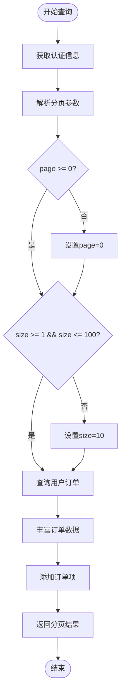
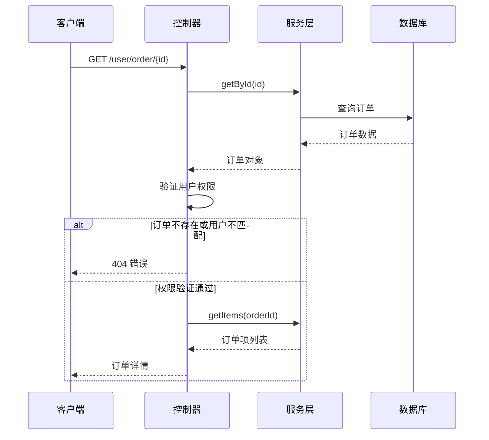
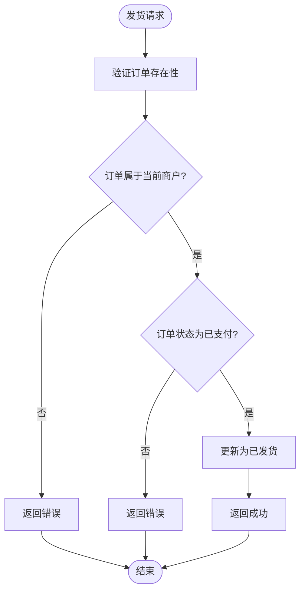
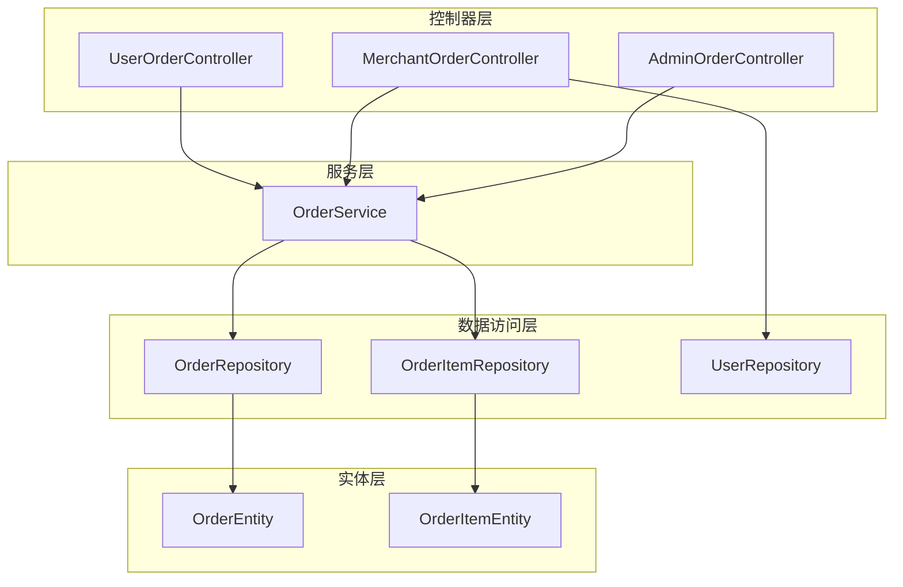
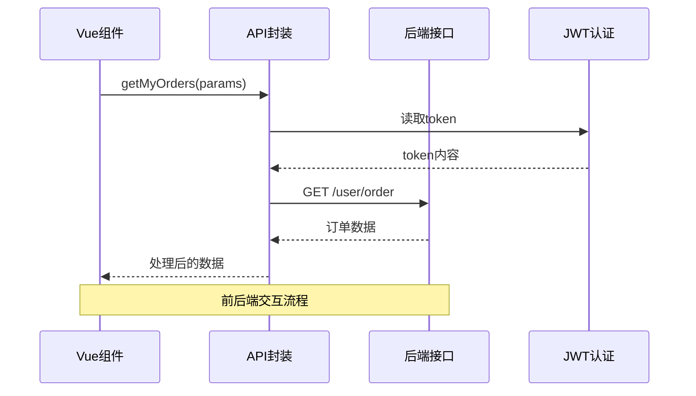
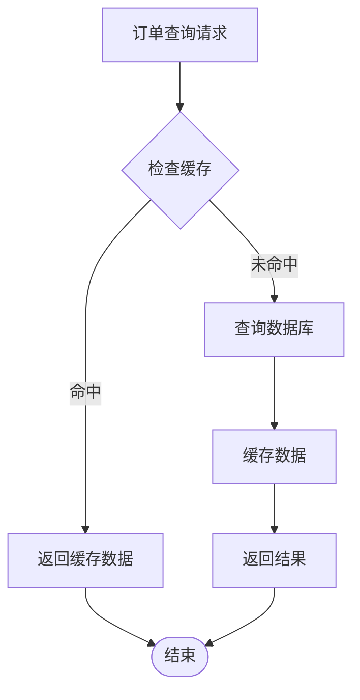

# 订单查询接口

<cite>
**本文档引用的文件**
- [UserOrderController.java](file://backend/src/main/java/com/mall/controller/user/UserOrderController.java)
- [MerchantOrderController.java](file://backend/src/main/java/com/mall/controller/merchant/MerchantOrderController.java)
- [AdminOrderController.java](file://backend/src/main/java/com/mall/controller/admin/AdminOrderController.java)
- [OrderService.java](file://backend/src/main/java/com/mall/service/OrderService.java)
- [OrderRepository.java](file://backend/src/main/java/com/mall/repository/OrderRepository.java)
- [Order.java](file://backend/src/main/java/com/mall/entity/Order.java)
- [OrderItem.java](file://backend/src/main/java/com/mall/entity/OrderItem.java)
- [SecurityConfig.java](file://backend/src/main/java/com/mall/config/SecurityConfig.java)
- [Role.java](file://backend/src/main/java/com/mall/common/Role.java)
- [user.js](file://frontend/src/api/user.js)
- [merchant.js](file://frontend/src/api/merchant.js)
- [admin.js](file://frontend/src/api/admin.js)
- [request.js](file://frontend/src/api/request.js)
</cite>

## 目录
1. [简介](#简介)
2. [项目结构](#项目结构)
3. [核心组件](#核心组件)
4. [架构概览](#架构概览)
5. [详细组件分析](#详细组件分析)
6. [依赖关系分析](#依赖关系分析)
7. [性能考虑](#性能考虑)
8. [故障排除指南](#故障排除指南)
9. [结论](#结论)

## 简介

本文档详细描述了电商系统的订单查询接口，包括用户订单查询、商户订单管理、管理员订单审核等功能。系统基于Spring Boot构建，采用RESTful API设计，支持多角色权限控制和完整的订单生命周期管理。

## 项目结构

订单查询接口分布在三个主要层次中：

**图表来源**
- [UserOrderController.java:19-23](file://backend/src/main/java/com/mall/controller/user/UserOrderController.java#L19-L23)
- [MerchantOrderController.java:20-24](file://backend/src/main/java/com/mall/controller/merchant/MerchantOrderController.java#L20-L24)
- [AdminOrderController.java:17-21](file://backend/src/main/java/com/mall/controller/admin/AdminOrderController.java#L17-L21)

**章节来源**
- [UserOrderController.java:19-23](file://backend/src/main/java/com/mall/controller/user/UserOrderController.java#L19-L23)
- [MerchantOrderController.java:20-24](file://backend/src/main/java/com/mall/controller/merchant/MerchantOrderController.java#L20-L24)
- [AdminOrderController.java:17-21](file://backend/src/main/java/com/mall/controller/admin/AdminOrderController.java#L17-L21)

## 核心组件

### 订单状态枚举

系统定义了完整的订单状态流转：

| 状态值 | 中文含义 | 描述 |
|--------|----------|------|
| PENDING | 待支付 | 订单已创建但未支付 |
| PAID | 已支付 | 用户已完成支付 |
| SHIPPED | 已发货 | 商户已发货 |
| RECEIVED | 已收货 | 用户确认收货 |
| CANCELLED | 已取消 | 订单被取消 |
| REFUND_REQUESTED | 退款中 | 退款申请已提交 |
| REFUNDED | 已退款 | 退款已完成 |

### 角色权限模型

系统支持三种角色，每种角色具有不同的订单查询权限：

**图表来源**
- [SecurityConfig.java:48-50](file://backend/src/main/java/com/mall/config/SecurityConfig.java#L48-L50)
- [Role.java:3-7](file://backend/src/main/java/com/mall/common/Role.java#L3-L7)

**章节来源**
- [Order.java:31-33](file://backend/src/main/java/com/mall/entity/Order.java#L31-L33)
- [SecurityConfig.java:48-50](file://backend/src/main/java/com/mall/config/SecurityConfig.java#L48-L50)
- [Role.java:3-7](file://backend/src/main/java/com/mall/common/Role.java#L3-L7)

## 架构概览

订单查询接口采用分层架构设计，确保职责分离和可维护性：

**图表来源**
- [UserOrderController.java:52-86](file://backend/src/main/java/com/mall/controller/user/UserOrderController.java#L52-L86)
- [OrderService.java:95-98](file://backend/src/main/java/com/mall/service/OrderService.java#L95-L98)
- [OrderRepository.java:17](file://backend/src/main/java/com/mall/repository/OrderRepository.java#L17)

**章节来源**
- [UserOrderController.java:52-86](file://backend/src/main/java/com/mall/controller/user/UserOrderController.java#L52-L86)
- [OrderService.java:95-98](file://backend/src/main/java/com/mall/service/OrderService.java#L95-L98)
- [OrderRepository.java:17](file://backend/src/main/java/com/mall/repository/OrderRepository.java#L17)

## 详细组件分析

### 用户订单查询接口

#### 接口定义

| 属性 | 值 |
|------|-----|
| 方法 | GET |
| 路径 | `/user/order` |
| 权限 | USER角色 |
| 功能 | 查询当前登录用户的订单列表 |

#### 请求参数

| 参数名 | 类型 | 默认值 | 必填 | 描述 |
|--------|------|--------|------|------|
| page | int | 0 | 否 | 分页页码（从0开始） |
| size | int | 10 | 否 | 分页大小（1-100） |

#### 响应结构

**图表来源**
- [UserOrderController.java:58-85](file://backend/src/main/java/com/mall/controller/user/UserOrderController.java#L58-L85)
- [OrderItem.java:1-83](file://backend/src/main/java/com/mall/entity/OrderItem.java#L1-L83)

#### 查询逻辑流程

**图表来源**
- [UserOrderController.java:52-86](file://backend/src/main/java/com/mall/controller/user/UserOrderController.java#L52-L86)
- [OrderService.java:110-113](file://backend/src/main/java/com/mall/service/OrderService.java#L110-L113)

**章节来源**
- [UserOrderController.java:52-86](file://backend/src/main/java/com/mall/controller/user/UserOrderController.java#L52-L86)
- [OrderService.java:95-98](file://backend/src/main/java/com/mall/service/OrderService.java#L95-L98)

### 订单详情查询接口

#### 用户订单详情

| 属性 | 值 |
|------|-----|
| 方法 | GET |
| 路径 | `/user/order/{id}` |
| 权限 | USER角色 |
| 功能 | 查询指定订单详情 |

#### 商户订单详情

| 属性 | 值 |
|------|-----|
| 方法 | GET |
| 路径 | `/merchant/order/{id}` |
| 权限 | MERCHANT角色 |
| 功能 | 查询商户运营的订单详情 |

#### 管理员订单详情

| 属性 | 值 |
|------|-----|
| 方法 | GET |
| 路径 | `/admin/order/{id}` |
| 权限 | ADMIN角色 |
| 功能 | 查询全站订单详情 |

#### 访问控制机制

**图表来源**
- [UserOrderController.java:88-100](file://backend/src/main/java/com/mall/controller/user/UserOrderController.java#L88-L100)
- [MerchantOrderController.java:47-59](file://backend/src/main/java/com/mall/controller/merchant/MerchantOrderController.java#L47-L59)
- [AdminOrderController.java:33-43](file://backend/src/main/java/com/mall/controller/admin/AdminOrderController.java#L33-L43)

**章节来源**
- [UserOrderController.java:88-100](file://backend/src/main/java/com/mall/controller/user/UserOrderController.java#L88-L100)
- [MerchantOrderController.java:47-59](file://backend/src/main/java/com/mall/controller/merchant/MerchantOrderController.java#L47-L59)
- [AdminOrderController.java:33-43](file://backend/src/main/java/com/mall/controller/admin/AdminOrderController.java#L33-L43)

### 商户订单管理接口

#### 商户订单列表查询

| 属性 | 值 |
|------|-----|
| 方法 | GET |
| 路径 | `/merchant/order` |
| 权限 | MERCHANT角色 |
| 功能 | 查询当前商户运营的所有订单 |

#### 商户订单状态控制

商户可以通过以下接口管理订单状态：

| 接口 | 方法 | 权限 | 功能 |
|------|------|------|------|
| `/merchant/order/{id}/ship` | POST | MERCHANT | 订单发货 |
| `/merchant/order/{id}/accept-refund` | POST | MERCHANT | 同意退款 |

#### 发货流程

**图表来源**
- [MerchantOrderController.java:61-71](file://backend/src/main/java/com/mall/controller/merchant/MerchantOrderController.java#L61-L71)

**章节来源**
- [MerchantOrderController.java:37-45](file://backend/src/main/java/com/mall/controller/merchant/MerchantOrderController.java#L37-L45)
- [MerchantOrderController.java:61-71](file://backend/src/main/java/com/mall/controller/merchant/MerchantOrderController.java#L61-L71)

### 管理员订单审核接口

#### 管理员订单列表查询

| 属性 | 值 |
|------|-----|
| 方法 | GET |
| 路径 | `/admin/order` |
| 权限 | ADMIN角色 |
| 功能 | 查询全站所有订单，支持分页 |

#### 管理员权限特点

管理员拥有最高权限，可以：
- 查询全站所有订单
- 查看任意订单详情
- 不受用户或商户身份限制

**章节来源**
- [AdminOrderController.java:25-31](file://backend/src/main/java/com/mall/controller/admin/AdminOrderController.java#L25-L31)
- [AdminOrderController.java:33-43](file://backend/src/main/java/com/mall/controller/admin/AdminOrderController.java#L33-L43)

### 订单状态筛选接口

系统支持按状态筛选订单，主要通过以下方式实现：

#### 用户端状态筛选

用户可以通过订单状态进行筛选，支持的状态包括：
- 待支付 (PENDING)
- 已支付 (PAID)  
- 已发货 (SHIPPED)
- 已收货 (RECEIVED)
- 已取消 (CANCELLED)
- 退款中 (REFUND_REQUESTED)
- 已退款 (REFUNDED)

#### 商户端状态筛选

商户端支持更精细的状态筛选，包括：
- 待发货 (TO_SHIP)
- 待收货 (SHIPPED)
- 已完成 (COMPLETED)

**章节来源**
- [OrderRepository.java:23-26](file://backend/src/main/java/com/mall/repository/OrderRepository.java#L23-L26)

## 依赖关系分析

### 后端依赖关系

**图表来源**
- [UserOrderController.java:25-26](file://backend/src/main/java/com/mall/controller/user/UserOrderController.java#L25-L26)
- [MerchantOrderController.java:26-27](file://backend/src/main/java/com/mall/controller/merchant/MerchantOrderController.java#L26-L27)
- [AdminOrderController.java:23](file://backend/src/main/java/com/mall/controller/admin/AdminOrderController.java#L23)

### 前端集成

前端通过统一的API封装进行调用：

**图表来源**
- [user.js:63-66](file://frontend/src/api/user.js#L63-L66)
- [request.js:9-16](file://frontend/src/api/request.js#L9-L16)

**章节来源**
- [UserOrderController.java:52-86](file://backend/src/main/java/com/mall/controller/user/UserOrderController.java#L52-L86)
- [OrderService.java:95-108](file://backend/src/main/java/com/mall/service/OrderService.java#L95-L108)

## 性能考虑

### 分页查询优化

系统采用数据库层面的分页查询，避免一次性加载大量数据：

- **默认分页大小**: 10条记录
- **最大分页大小**: 100条记录
- **排序规则**: 按创建时间降序排列
- **索引优化**: 在用户ID和商户ID上建立索引

### 缓存策略

### 数据库查询优化

- 使用JPA分页接口减少内存占用
- 通过投影查询只获取必要字段
- 在高频查询字段上建立适当索引

## 故障排除指南

### 常见问题及解决方案

#### 1. 权限不足错误

**症状**: 返回403 Forbidden或"订单不存在"错误

**原因**: 
- 用户尝试访问不属于自己的订单
- 角色权限不正确
- Token过期

**解决方案**:
- 确认当前登录用户身份
- 检查Token有效性
- 验证请求路径是否正确

#### 2. 订单状态异常

**症状**: 订单状态不符合预期

**原因**:
- 订单状态流转顺序错误
- 并发操作导致状态冲突

**解决方案**:
- 按正确的状态顺序进行操作
- 使用事务保证状态一致性

#### 3. 分页查询性能问题

**症状**: 查询响应时间过长

**原因**:
- 分页大小过大
- 缺少必要的数据库索引

**解决方案**:
- 调整分页大小到合理范围
- 为常用查询字段添加索引

**章节来源**
- [UserOrderController.java:92-94](file://backend/src/main/java/com/mall/controller/user/UserOrderController.java#L92-L94)
- [MerchantOrderController.java:64-69](file://backend/src/main/java/com/mall/controller/merchant/MerchantOrderController.java#L64-L69)

## 结论

订单查询接口设计遵循了清晰的分层架构原则，实现了多角色权限控制和完整的订单生命周期管理。系统通过合理的分页策略、权限控制和状态管理，为不同角色提供了合适的订单查询和管理能力。

关键特性包括：
- **多角色权限分离**: 用户、商户、管理员各有明确的查询权限边界
- **完整的状态管理**: 支持订单从创建到完成的全流程状态跟踪
- **高性能查询**: 通过分页和索引优化保证查询性能
- **安全可靠**: 基于JWT的认证机制和严格的权限验证

该接口设计为后续的功能扩展奠定了良好的基础，可以根据业务需求进一步完善搜索、筛选和统计分析功能。