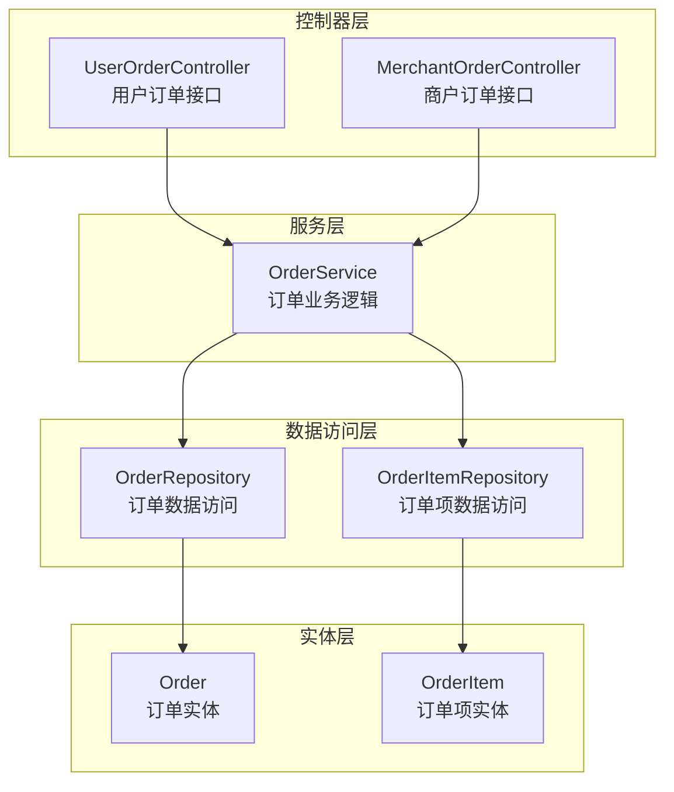
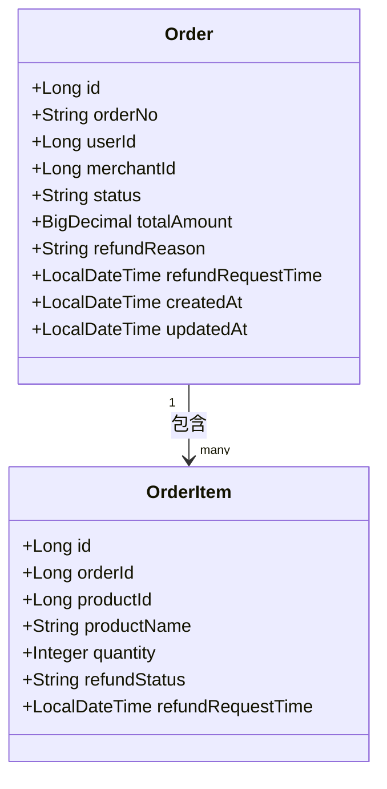
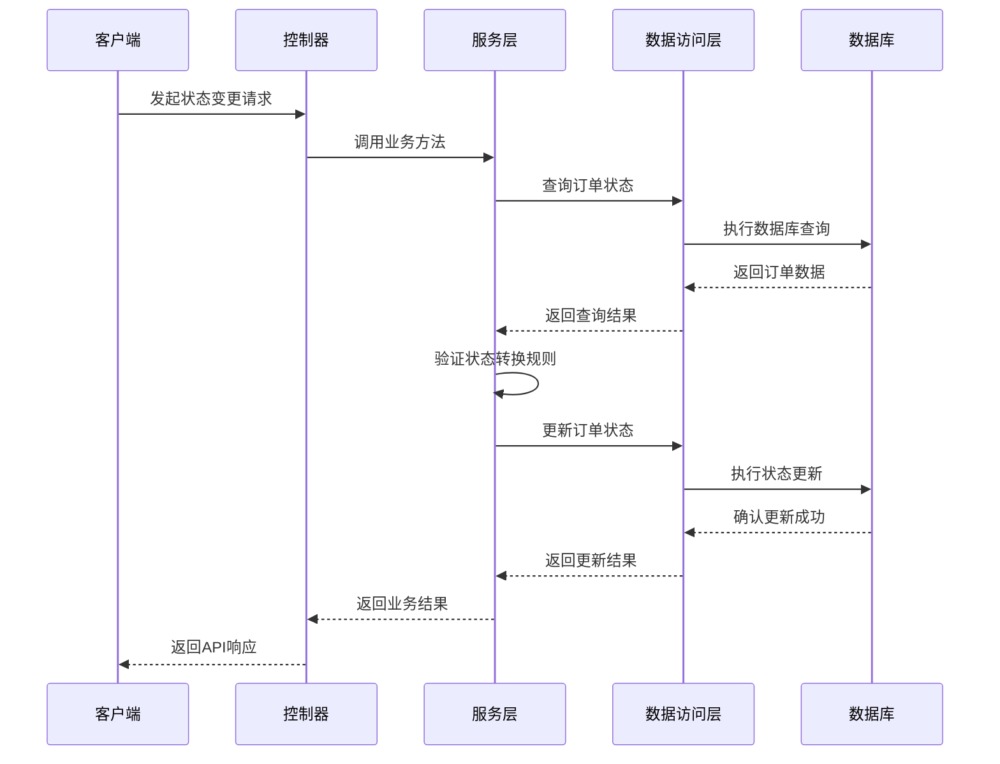
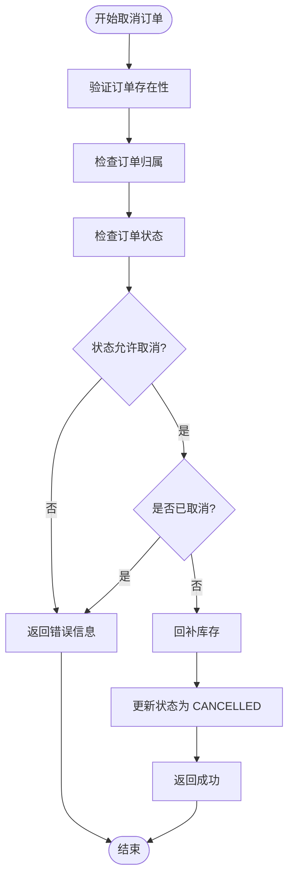
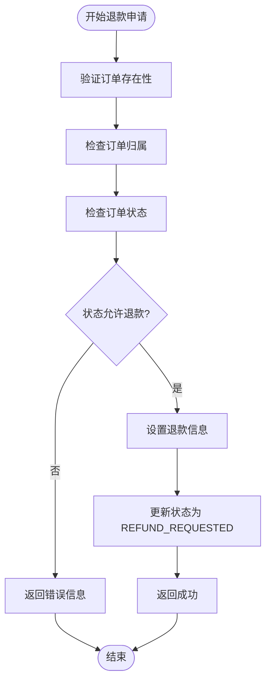
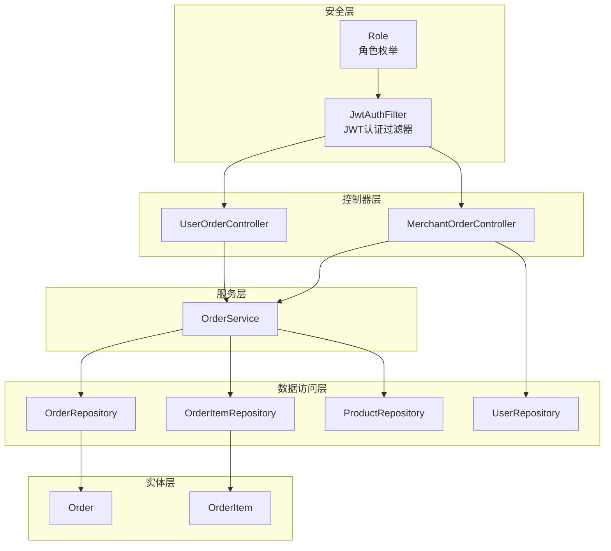
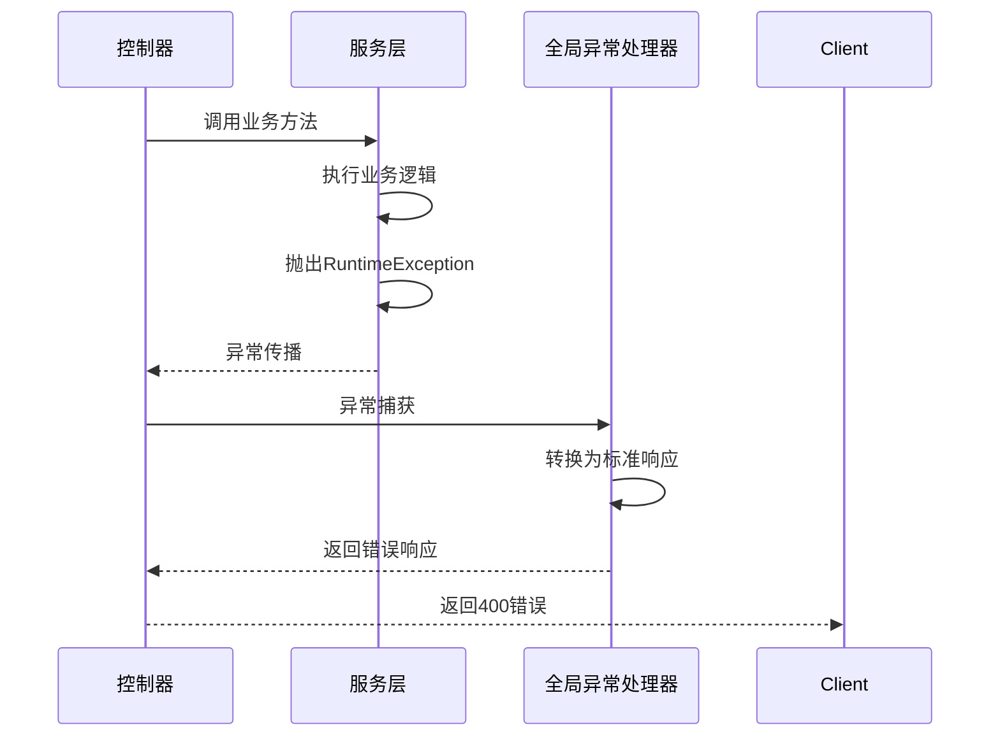

# 订单状态管理接口

<cite>
**本文档引用的文件**
- [UserOrderController.java](file://backend/src/main/java/com/mall/controller/user/UserOrderController.java)
- [MerchantOrderController.java](file://backend/src/main/java/com/mall/controller/merchant/MerchantOrderController.java)
- [OrderService.java](file://backend/src/main/java/com/mall/service/OrderService.java)
- [Order.java](file://backend/src/main/java/com/mall/entity/Order.java)
- [OrderItem.java](file://backend/src/main/java/com/mall/entity/OrderItem.java)
- [OrderRepository.java](file://backend/src/main/java/com/mall/repository/OrderRepository.java)
- [Role.java](file://backend/src/main/java/com/mall/common/Role.java)
- [JwtAuthFilter.java](file://backend/src/main/java/com/mall/security/JwtAuthFilter.java)
- [GlobalExceptionHandler.java](file://backend/src/main/java/com/mall/exception/GlobalExceptionHandler.java)
- [application.yml](file://backend/src/main/resources/application.yml)
- [Result.java](file://backend/src/main/java/com/mall/dto/Result.java)
</cite>

## 目录
1. [简介](#简介)
2. [项目结构](#项目结构)
3. [核心组件](#核心组件)
4. [架构概览](#架构概览)
5. [详细组件分析](#详细组件分析)
6. [依赖关系分析](#依赖关系分析)
7. [性能考虑](#性能考虑)
8. [故障排除指南](#故障排除指南)
9. [结论](#结论)

## 简介

本文档详细描述了电商系统中的订单状态管理接口，包括用户端和商户端的订单状态变更功能。系统实现了完整的订单生命周期管理，涵盖从下单、支付、发货、收货到退款的全流程状态控制。

## 项目结构

订单状态管理功能主要分布在以下层次：

**图表来源**
- [UserOrderController.java:19-23](file://backend/src/main/java/com/mall/controller/user/UserOrderController.java#L19-L23)
- [MerchantOrderController.java:20-24](file://backend/src/main/java/com/mall/controller/merchant/MerchantOrderController.java#L20-L24)
- [OrderService.java:23-26](file://backend/src/main/java/com/mall/service/OrderService.java#L23-L26)

**章节来源**
- [UserOrderController.java:19-23](file://backend/src/main/java/com/mall/controller/user/UserOrderController.java#L19-L23)
- [MerchantOrderController.java:20-24](file://backend/src/main/java/com/mall/controller/merchant/MerchantOrderController.java#L20-L24)
- [OrderService.java:23-26](file://backend/src/main/java/com/mall/service/OrderService.java#L23-L26)

## 核心组件

### 订单状态枚举

系统定义了完整的订单状态体系：

| 状态 | 描述 | 适用场景 |
|------|------|----------|
| PENDING | 待支付 | 订单刚创建，等待用户支付 |
| PAID | 已支付 | 用户完成支付，等待发货 |
| SHIPPED | 已发货 | 商户已发货，等待用户收货 |
| RECEIVED | 已收货 | 用户确认收货，可进行评价 |
| CANCELLED | 已取消 | 订单被取消，不可继续流程 |
| REFUND_REQUESTED | 退款申请中 | 用户或商户发起退款申请 |
| REFUNDED | 已退款 | 退款流程完成 |

### 订单实体设计

**图表来源**
- [Order.java:16-82](file://backend/src/main/java/com/mall/entity/Order.java#L16-L82)
- [OrderItem.java:16-72](file://backend/src/main/java/com/mall/entity/OrderItem.java#L16-L72)

**章节来源**
- [Order.java:31-64](file://backend/src/main/java/com/mall/entity/Order.java#L31-L64)
- [OrderItem.java:50-58](file://backend/src/main/java/com/mall/entity/OrderItem.java#L50-L58)

## 架构概览

订单状态管理系统采用经典的三层架构模式：

**图表来源**
- [UserOrderController.java:136-144](file://backend/src/main/java/com/mall/controller/user/UserOrderController.java#L136-L144)
- [OrderService.java:115-121](file://backend/src/main/java/com/mall/service/OrderService.java#L115-L121)

## 详细组件分析

### 用户端订单状态管理接口

#### 取消订单接口 (PUT /user/order/{id}/cancel)

**接口功能**: 用户在订单未发货前取消订单

**权限验证**:
- 需要用户身份认证
- 验证订单归属权（订单userId必须匹配当前用户）

**前置条件**:
- 订单状态不能为 RECEIVED、REFUND_REQUESTED、REFUNDED
- 订单不能已经是 CANCELLED 状态
- 订单必须存在且属于当前用户

**业务逻辑**:
1. 验证订单存在性和用户权限
2. 检查订单状态是否允许取消
3. 回补库存：将订单项对应商品的库存恢复
4. 更新订单状态为 CANCELLED

**图表来源**
- [OrderService.java:123-145](file://backend/src/main/java/com/mall/service/OrderService.java#L123-L145)

**接口规范**:
- 请求方法: PUT
- 请求路径: `/user/order/{id}/cancel`
- 认证要求: 需要用户令牌
- 权限要求: 订单拥有者
- 成功响应: 200 OK
- 失败响应: 400 Bad Request

**章节来源**
- [UserOrderController.java:136-144](file://backend/src/main/java/com/mall/controller/user/UserOrderController.java#L136-L144)
- [OrderService.java:123-145](file://backend/src/main/java/com/mall/service/OrderService.java#L123-L145)

#### 确认收货接口 (POST /user/order/{id}/confirm-receive)

**接口功能**: 用户确认收到货物

**权限验证**:
- 需要用户身份认证
- 验证订单归属权

**前置条件**:
- 订单必须存在且属于当前用户
- 订单状态必须为 SHIPPED

**业务逻辑**:
1. 验证订单存在性和用户权限
2. 直接将订单状态更新为 RECEIVED

**接口规范**:
- 请求方法: POST
- 请求路径: `/user/order/{id}/confirm-receive`
- 认证要求: 需要用户令牌
- 权限要求: 订单拥有者
- 成功响应: 200 OK
- 失败响应: 400 Bad Request

**章节来源**
- [UserOrderController.java:113-122](file://backend/src/main/java/com/mall/controller/user/UserOrderController.java#L113-L122)

#### 退款申请接口 (POST /user/order/{id}/refund-request)

**接口功能**: 用户申请退货/退款

**权限验证**:
- 需要用户身份认证
- 验证订单归属权

**前置条件**:
- 订单必须存在且属于当前用户
- 订单状态必须为 RECEIVED 或 REFUND_REQUESTED

**业务逻辑**:
1. 验证订单存在性和用户权限
2. 检查订单状态是否允许退款
3. 设置退款原因和申请时间
4. 更新订单状态为 REFUND_REQUESTED

**图表来源**
- [OrderService.java:147-161](file://backend/src/main/java/com/mall/service/OrderService.java#L147-L161)

**接口规范**:
- 请求方法: POST
- 请求路径: `/user/order/{id}/refund-request`
- 认证要求: 需要用户令牌
- 权限要求: 订单拥有者
- 请求参数: reason（退款原因，可选）
- 成功响应: 200 OK
- 失败响应: 400 Bad Request

**章节来源**
- [UserOrderController.java:146-152](file://backend/src/main/java/com/mall/controller/user/UserOrderController.java#L146-L152)
- [OrderService.java:147-161](file://backend/src/main/java/com/mall/service/OrderService.java#L147-L161)

### 商户端订单状态管理接口

#### 商户发货接口 (POST /merchant/order/{id}/ship)

**接口功能**: 商户对已支付订单进行发货

**权限验证**:
- 需要商户身份认证
- 验证订单归属权（订单merchantId必须匹配当前商户）

**前置条件**:
- 订单必须存在且属于当前商户
- 订单状态必须为 PAID

**业务逻辑**:
1. 验证订单存在性和商户权限
2. 检查订单状态是否为 PAID
3. 将订单状态更新为 SHIPPED

**接口规范**:
- 请求方法: POST
- 请求路径: `/merchant/order/{id}/ship`
- 认证要求: 需要商户令牌
- 权限要求: 订单所属商户
- 成功响应: 200 OK
- 失败响应: 400 Bad Request

**章节来源**
- [MerchantOrderController.java:61-71](file://backend/src/main/java/com/mall/controller/merchant/MerchantOrderController.java#L61-L71)

#### 同意退款接口 (POST /merchant/order/{id}/accept-refund)

**接口功能**: 商户同意用户的退款申请

**权限验证**:
- 需要商户身份认证
- 验证订单归属权

**前置条件**:
- 订单必须存在且属于当前商户
- 订单状态必须为 REFUND_REQUESTED

**业务逻辑**:
1. 验证订单存在性和商户权限
2. 检查订单状态是否为 REFUND_REQUESTED
3. 将订单状态更新为 REFUNDED

**接口规范**:
- 请求方法: POST
- 请求路径: `/merchant/order/{id}/accept-refund`
- 认证要求: 需要商户令牌
- 权限要求: 订单所属商户
- 成功响应: 200 OK
- 失败响应: 400 Bad Request

**章节来源**
- [MerchantOrderController.java:73-85](file://backend/src/main/java/com/mall/controller/merchant/MerchantOrderController.java#L73-L85)

### 订单状态历史查询

系统提供了多种方式查询订单状态历史：

#### 用户订单查询
- 接口: GET /user/order
- 功能: 分页查询当前用户的订单列表
- 返回: 订单基本信息和状态

#### 商户订单查询
- 接口: GET /merchant/order
- 功能: 分页查询当前商户的订单列表
- 返回: 订单基本信息和状态

#### 订单详情查询
- 接口: GET /user/order/{id} 和 GET /merchant/order/{id}
- 功能: 查询订单详细信息，包含订单项列表
- 返回: 订单对象和订单项列表

**章节来源**
- [UserOrderController.java:52-86](file://backend/src/main/java/com/mall/controller/user/UserOrderController.java#L52-L86)
- [MerchantOrderController.java:37-59](file://backend/src/main/java/com/mall/controller/merchant/MerchantOrderController.java#L37-L59)

## 依赖关系分析

**图表来源**
- [JwtAuthFilter.java:18-28](file://backend/src/main/java/com/mall/security/JwtAuthFilter.java#L18-L28)
- [Role.java:3-7](file://backend/src/main/java/com/mall/common/Role.java#L3-L7)
- [UserOrderController.java:19-23](file://backend/src/main/java/com/mall/controller/user/UserOrderController.java#L19-L23)
- [MerchantOrderController.java:20-24](file://backend/src/main/java/com/mall/controller/merchant/MerchantOrderController.java#L20-L24)

**章节来源**
- [JwtAuthFilter.java:18-28](file://backend/src/main/java/com/mall/security/JwtAuthFilter.java#L18-L28)
- [Role.java:3-7](file://backend/src/main/java/com/mall/common/Role.java#L3-L7)

## 性能考虑

### 数据库优化
- 使用分页查询避免大量数据传输
- 在订单表上建立适当的索引以提高查询性能
- 使用批量操作减少数据库往返次数

### 缓存策略
- 对常用查询结果进行缓存
- 缓存商品库存信息以减少库存查询压力

### 并发控制
- 使用事务确保状态变更的原子性
- 实现乐观锁防止并发修改冲突

## 故障排除指南

### 常见错误及解决方案

#### 订单不存在错误
**错误类型**: 订单ID无效或订单不属于当前用户/商户
**解决方法**: 
- 验证订单ID格式正确性
- 确认用户/商户身份认证有效
- 检查订单归属关系

#### 状态转换错误
**错误类型**: 当前订单状态不允许执行特定操作
**解决方法**:
- 检查订单当前状态
- 确认操作符合状态机规则
- 验证业务逻辑约束

#### 权限验证错误
**错误类型**: 用户尝试访问非自己拥有的订单
**解决方法**:
- 确认JWT令牌有效性
- 检查用户角色权限
- 验证订单归属关系

**章节来源**
- [GlobalExceptionHandler.java:10-18](file://backend/src/main/java/com/mall/exception/GlobalExceptionHandler.java#L10-L18)

### 异常处理机制

系统采用统一的异常处理机制：

**图表来源**
- [GlobalExceptionHandler.java:13-17](file://backend/src/main/java/com/mall/exception/GlobalExceptionHandler.java#L13-L17)

**章节来源**
- [GlobalExceptionHandler.java:13-17](file://backend/src/main/java/com/mall/exception/GlobalExceptionHandler.java#L13-L17)

## 结论

订单状态管理接口实现了完整的电商订单生命周期管理，具有以下特点：

1. **完整的状态机**: 覆盖从下单到完成的完整流程
2. **严格的权限控制**: 用户和商户权限分离，确保操作安全性
3. **完善的业务逻辑**: 包含库存管理、退款处理等复杂业务场景
4. **良好的扩展性**: 清晰的分层架构便于功能扩展和维护

系统通过RESTful API设计提供了简洁易用的接口，配合严格的业务规则和权限验证，确保了订单状态变更的安全性和一致性。