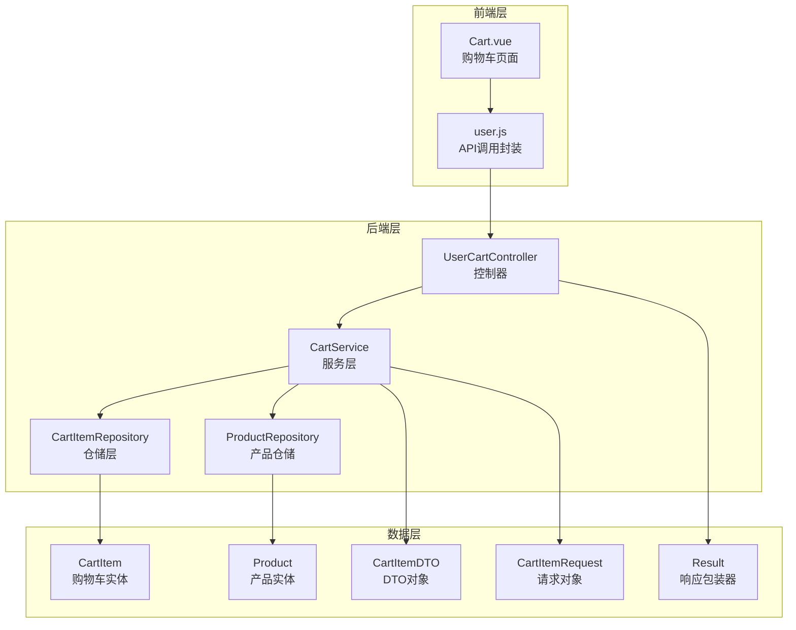
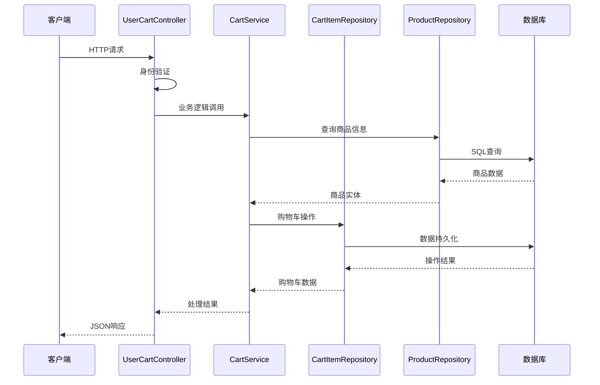
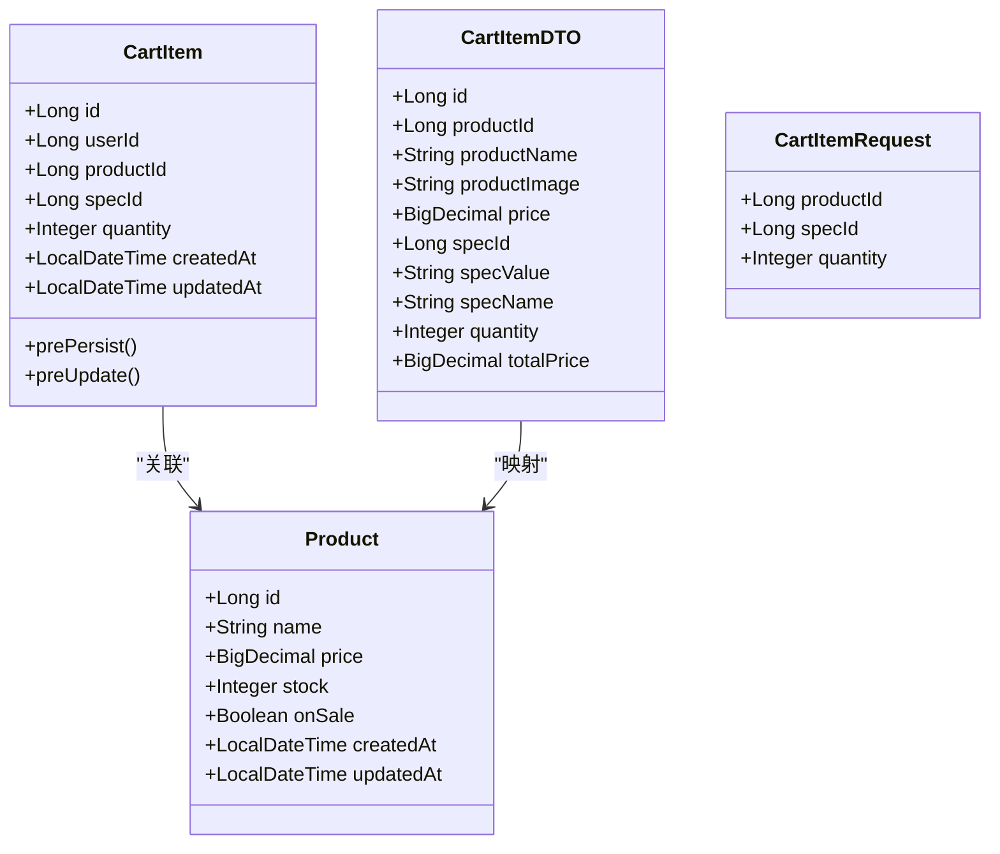
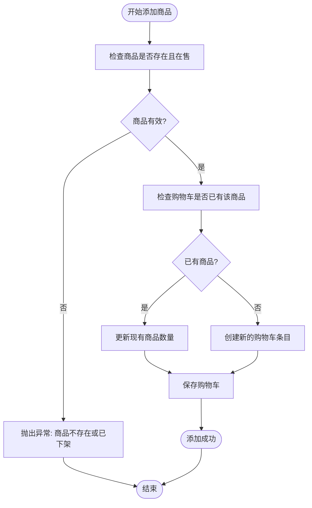
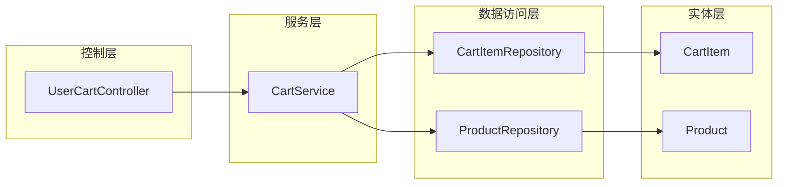
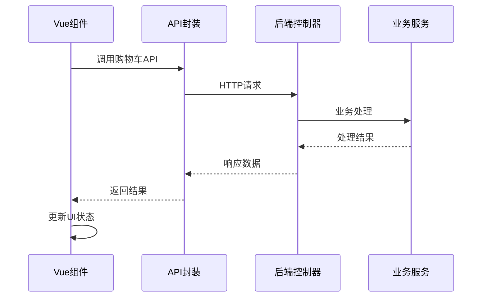

# 购物车管理接口

<cite>
**本文档引用的文件**
- [UserCartController.java](file://backend/src/main/java/com/mall/controller/user/UserCartController.java)
- [CartService.java](file://backend/src/main/java/com/mall/service/CartService.java)
- [CartItem.java](file://backend/src/main/java/com/mall/entity/CartItem.java)
- [CartItemDTO.java](file://backend/src/main/java/com/mall/dto/CartItemDTO.java)
- [CartItemRequest.java](file://backend/src/main/java/com/mall/dto/CartItemRequest.java)
- [CartItemRepository.java](file://backend/src/main/java/com/mall/repository/CartItemRepository.java)
- [Product.java](file://backend/src/main/java/com/mall/entity/Product.java)
- [ProductRepository.java](file://backend/src/main/java/com/mall/repository/ProductRepository.java)
- [Result.java](file://backend/src/main/java/com/mall/dto/Result.java)
- [Cart.vue](file://frontend/src/views/user/Cart.vue)
- [user.js](file://frontend/src/api/user.js)
</cite>

## 目录
1. [简介](#简介)
2. [项目结构](#项目结构)
3. [核心组件](#核心组件)
4. [架构概览](#架构概览)
5. [详细接口文档](#详细接口文档)
6. [数据模型分析](#数据模型分析)
7. [依赖关系分析](#依赖关系分析)
8. [性能考虑](#性能考虑)
9. [故障排除指南](#故障排除指南)
10. [结论](#结论)

## 简介

本文档详细介绍了购物车管理接口的完整API规范，包括查询购物车、添加商品到购物车、修改商品数量和从购物车移除商品四个核心接口。系统采用Spring Boot后端框架，结合前后端分离架构，提供完整的电商购物车功能。

## 项目结构

购物车相关代码主要分布在以下层次：



**图表来源**
- [UserCartController.java:1-67](file://backend/src/main/java/com/mall/controller/user/UserCartController.java#L1-L67)
- [CartService.java:1-62](file://backend/src/main/java/com/mall/service/CartService.java#L1-L62)
- [CartItem.java:1-50](file://backend/src/main/java/com/mall/entity/CartItem.java#L1-L50)
- [Product.java:1-101](file://backend/src/main/java/com/mall/entity/Product.java#L1-L101)

**章节来源**
- [UserCartController.java:1-67](file://backend/src/main/java/com/mall/controller/user/UserCartController.java#L1-L67)
- [CartService.java:1-62](file://backend/src/main/java/com/mall/service/CartService.java#L1-L62)

## 核心组件

### 控制器层
- **UserCartController**: 提供RESTful API接口，处理购物车相关HTTP请求
- **认证机制**: 使用Spring Security进行用户身份验证

### 服务层
- **CartService**: 实现购物车业务逻辑，包括商品添加、数量更新、删除操作
- **事务管理**: 使用@Transactional注解确保数据一致性

### 数据访问层
- **CartItemRepository**: JPA仓储接口，提供购物车数据持久化操作
- **ProductRepository**: 商品信息查询接口

### 实体模型
- **CartItem**: 购物车条目实体，支持规格关联
- **Product**: 商品实体，包含库存信息

**章节来源**
- [UserCartController.java:14-67](file://backend/src/main/java/com/mall/controller/user/UserCartController.java#L14-L67)
- [CartService.java:14-62](file://backend/src/main/java/com/mall/service/CartService.java#L14-L62)
- [CartItemRepository.java:1-21](file://backend/src/main/java/com/mall/repository/CartItemRepository.java#L1-L21)

## 架构概览

系统采用经典的三层架构模式，前后端分离设计：



**图表来源**
- [UserCartController.java:28-65](file://backend/src/main/java/com/mall/controller/user/UserCartController.java#L28-L65)
- [CartService.java:25-60](file://backend/src/main/java/com/mall/service/CartService.java#L25-L60)

## 详细接口文档

### 查询购物车接口

**接口地址**: `GET /user/cart`

**功能描述**: 获取当前登录用户的购物车商品列表

**请求参数**: 无

**响应数据结构**:
```json
{
  "code": 200,
  "message": "success",
  "data": [
    {
      "id": 1,
      "userId": 1001,
      "productId": 2001,
      "specId": null,
      "quantity": 2,
      "createdAt": "2024-01-15T10:30:00",
      "updatedAt": "2024-01-15T14:20:00"
    }
  ]
}
```

**状态码**:
- 200: 请求成功
- 401: 未授权访问

**章节来源**
- [UserCartController.java:27-32](file://backend/src/main/java/com/mall/controller/user/UserCartController.java#L27-L32)

### 添加商品到购物车接口

**接口地址**: `POST /user/cart/add`

**功能描述**: 将指定商品添加到当前用户的购物车

**请求参数**:
```json
{
  "productId": 2001,
  "quantity": 1
}
```

**响应数据结构**:
```json
{
  "code": 200,
  "message": "success",
  "data": {
    "id": 1,
    "userId": 1001,
    "productId": 2001,
    "specId": null,
    "quantity": 1,
    "createdAt": "2024-01-15T10:30:00",
    "updatedAt": "2024-01-15T10:30:00"
  }
}
```

**错误处理**:
- 商品不存在或已下架: 返回400错误
- 参数格式错误: 返回400错误

**章节来源**
- [UserCartController.java:34-45](file://backend/src/main/java/com/mall/controller/user/UserCartController.java#L34-L45)
- [CartService.java:25-43](file://backend/src/main/java/com/mall/service/CartService.java#L25-L43)

### 修改商品数量接口

**接口地址**: `PUT /user/cart/quantity`

**功能描述**: 更新购物车中指定商品的数量

**请求参数**:
```json
{
  "productId": 2001,
  "quantity": 3
}
```

**响应数据结构**:
```json
{
  "code": 200,
  "message": "success",
  "data": null
}
```

**特殊说明**:
- 当quantity小于等于0时，自动删除该商品条目
- 数量必须为正整数

**章节来源**
- [UserCartController.java:47-58](file://backend/src/main/java/com/mall/controller/user/UserCartController.java#L47-L58)
- [CartService.java:45-55](file://backend/src/main/java/com/mall/service/CartService.java#L45-L55)

### 从购物车移除商品接口

**接口地址**: `DELETE /user/cart/{productId}`

**功能描述**: 从购物车中移除指定商品

**路径参数**:
- `productId`: 商品ID

**响应数据结构**:
```json
{
  "code": 200,
  "message": "success",
  "data": null
}
```

**章节来源**
- [UserCartController.java:60-65](file://backend/src/main/java/com/mall/controller/user/UserCartController.java#L60-L65)
- [CartService.java:57-60](file://backend/src/main/java/com/mall/service/CartService.java#L57-L60)

## 数据模型分析

### 购物车数据结构



**图表来源**
- [CartItem.java:15-49](file://backend/src/main/java/com/mall/entity/CartItem.java#L15-L49)
- [Product.java:16-100](file://backend/src/main/java/com/mall/entity/Product.java#L16-L100)
- [CartItemDTO.java:11-32](file://backend/src/main/java/com/mall/dto/CartItemDTO.java#L11-L32)
- [CartItemRequest.java:9-16](file://backend/src/main/java/com/mall/dto/CartItemRequest.java#L9-L16)

### 商品数量限制与库存检查

系统实现了完善的库存检查机制：



**图表来源**
- [CartService.java:25-43](file://backend/src/main/java/com/mall/service/CartService.java#L25-L43)

**章节来源**
- [CartService.java:25-43](file://backend/src/main/java/com/mall/service/CartService.java#L25-L43)
- [CartItem.java:8-49](file://backend/src/main/java/com/mall/entity/CartItem.java#L8-L49)

## 依赖关系分析

### 后端依赖关系



**图表来源**
- [UserCartController.java:20](file://backend/src/main/java/com/mall/controller/user/UserCartController.java#L20)
- [CartService.java:18-19](file://backend/src/main/java/com/mall/service/CartService.java#L18-L19)

### 前后端交互流程



**图表来源**
- [Cart.vue:375-421](file://frontend/src/views/user/Cart.vue#L375-L421)
- [user.js:18-36](file://frontend/src/api/user.js#L18-L36)

**章节来源**
- [Cart.vue:375-421](file://frontend/src/views/user/Cart.vue#L375-L421)
- [user.js:18-36](file://frontend/src/api/user.js#L18-L36)

## 性能考虑

### 数据库优化
- **索引设计**: 购物车表使用(user_id, product_id, spec_id)唯一约束
- **查询优化**: 提供专门的按用户ID查询和按用户+商品查询方法
- **事务管理**: 使用@Transactional确保操作原子性

### 缓存策略
- **前端缓存**: Vue组件内部维护购物车状态
- **数据库缓存**: JPA二级缓存机制

### 并发处理
- **线程安全**: 购物车操作在事务中执行
- **数据一致性**: 通过数据库约束保证唯一性

## 故障排除指南

### 常见错误及解决方案

**1. 商品不存在或已下架**
- **症状**: 添加商品时返回错误
- **原因**: 商品ID无效或商品已下架
- **解决**: 检查商品状态和ID有效性

**2. 数量参数错误**
- **症状**: 修改数量时返回400错误
- **原因**: 数量参数格式不正确或为负数
- **解决**: 确保数量为正整数

**3. 权限问题**
- **症状**: 返回401未授权
- **原因**: 用户未登录或Token失效
- **解决**: 重新登录获取有效Token

**4. 数据库连接问题**
- **症状**: 500服务器错误
- **原因**: 数据库连接异常
- **解决**: 检查数据库连接配置

**章节来源**
- [CartService.java:28](file://backend/src/main/java/com/mall/service/CartService.java#L28)
- [UserCartController.java:42-44](file://backend/src/main/java/com/mall/controller/user/UserCartController.java#L42-L44)

## 结论

购物车管理系统提供了完整的电商购物车功能，具有以下特点：

1. **完整的API覆盖**: 四个核心接口满足购物车基本需求
2. **严格的业务逻辑**: 包含商品状态检查和库存管理
3. **良好的错误处理**: 提供清晰的错误信息和状态码
4. **前后端分离**: 清晰的职责划分和接口约定
5. **可扩展性**: 基于Spring Boot的良好架构便于功能扩展

系统在保证功能完整性的同时，注重用户体验和系统稳定性，为电商应用提供了可靠的购物车解决方案。