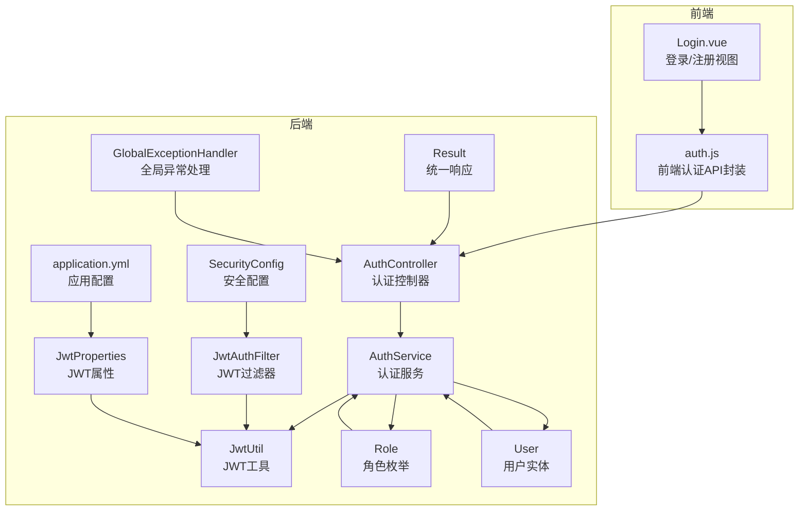
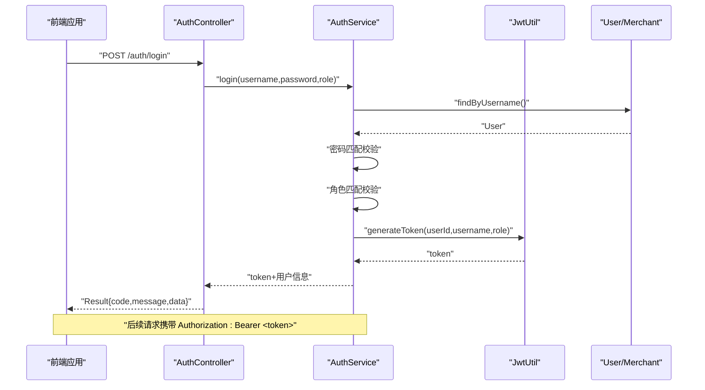
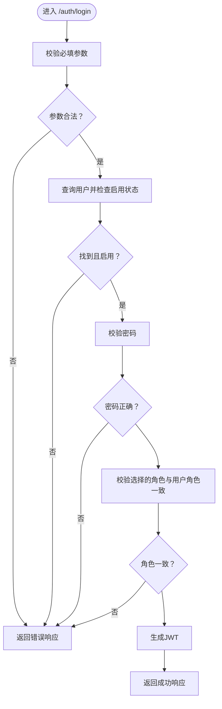
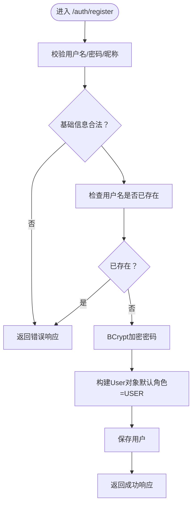
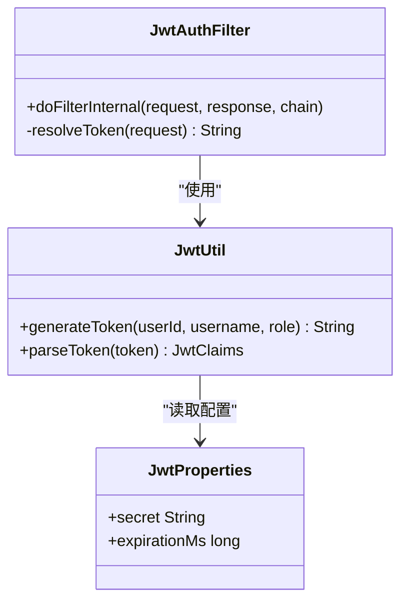
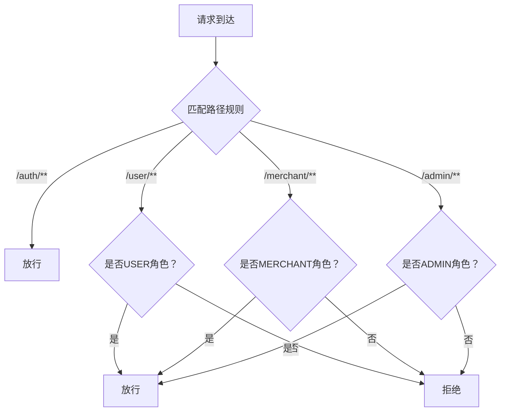
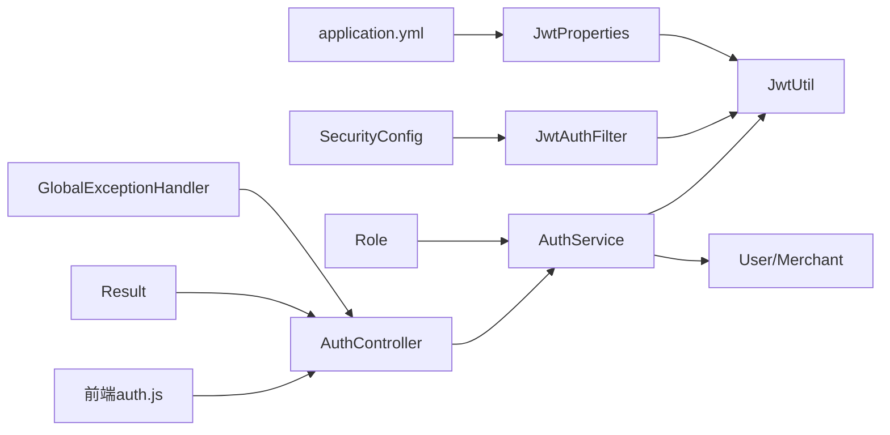

# 认证接口

<cite>
**本文引用的文件**
- [AuthController.java](file://backend/src/main/java/com/mall/controller/AuthController.java)
- [AuthService.java](file://backend/src/main/java/com/mall/service/AuthService.java)
- [JwtUtil.java](file://backend/src/main/java/com/mall/security/JwtUtil.java)
- [JwtAuthFilter.java](file://backend/src/main/java/com/mall/security/JwtAuthFilter.java)
- [SecurityConfig.java](file://backend/src/main/java/com/mall/config/SecurityConfig.java)
- [JwtProperties.java](file://backend/src/main/java/com/mall/config/JwtProperties.java)
- [application.yml](file://backend/src/main/resources/application.yml)
- [Result.java](file://backend/src/main/java/com/mall/dto/Result.java)
- [Role.java](file://backend/src/main/java/com/mall/common/Role.java)
- [User.java](file://backend/src/main/java/com/mall/entity/User.java)
- [auth.js](file://frontend/src/api/auth.js)
- [Login.vue](file://frontend/src/views/Login.vue)
- [GlobalExceptionHandler.java](file://backend/src/main/java/com/mall/exception/GlobalExceptionHandler.java)
</cite>

## 目录
1. [简介](#简介)
2. [项目结构](#项目结构)
3. [核心组件](#核心组件)
4. [架构总览](#架构总览)
5. [详细组件分析](#详细组件分析)
6. [依赖关系分析](#依赖关系分析)
7. [性能考虑](#性能考虑)
8. [故障排查指南](#故障排查指南)
9. [结论](#结论)
10. [附录](#附录)

## 简介
本文件为电商商城系统的认证接口API文档，覆盖用户登录、注册两大核心认证能力，并对JWT令牌生成与解析、角色权限分配、密码加密策略、安全过滤链进行深入说明。文档同时提供Postman测试示例与常见问题解决方案，帮助前后端协作与问题定位。

## 项目结构
认证相关代码主要分布在后端的控制器、服务层、安全模块与配置文件中，前端通过统一的API封装调用后端认证接口。

**图表来源**
- [AuthController.java:11-35](file://backend/src/main/java/com/mall/controller/AuthController.java#L11-L35)
- [AuthService.java:17-59](file://backend/src/main/java/com/mall/service/AuthService.java#L17-L59)
- [SecurityConfig.java:22-55](file://backend/src/main/java/com/mall/config/SecurityConfig.java#L22-L55)
- [JwtAuthFilter.java:18-56](file://backend/src/main/java/com/mall/security/JwtAuthFilter.java#L18-L56)
- [JwtUtil.java:12-47](file://backend/src/main/java/com/mall/security/JwtUtil.java#L12-L47)
- [JwtProperties.java:9-17](file://backend/src/main/java/com/mall/config/JwtProperties.java#L9-L17)
- [application.yml:27-30](file://backend/src/main/resources/application.yml#L27-L30)
- [Result.java:7-23](file://backend/src/main/java/com/mall/dto/Result.java#L7-L23)
- [Role.java:3-7](file://backend/src/main/java/com/mall/common/Role.java#L3-L7)
- [User.java:10-87](file://backend/src/main/java/com/mall/entity/User.java#L10-L87)
- [auth.js:9-25](file://frontend/src/api/auth.js#L9-L25)
- [Login.vue:470-530](file://frontend/src/views/Login.vue#L470-L530)
- [GlobalExceptionHandler.java:10-17](file://backend/src/main/java/com/mall/exception/GlobalExceptionHandler.java#L10-L17)

**章节来源**
- [AuthController.java:11-73](file://backend/src/main/java/com/mall/controller/AuthController.java#L11-L73)
- [AuthService.java:17-92](file://backend/src/main/java/com/mall/service/AuthService.java#L17-L92)
- [SecurityConfig.java:22-74](file://backend/src/main/java/com/mall/config/SecurityConfig.java#L22-L74)
- [JwtAuthFilter.java:18-57](file://backend/src/main/java/com/mall/security/JwtAuthFilter.java#L18-L57)
- [JwtUtil.java:12-48](file://backend/src/main/java/com/mall/security/JwtUtil.java#L12-L48)
- [JwtProperties.java:9-18](file://backend/src/main/java/com/mall/config/JwtProperties.java#L9-L18)
- [application.yml:27-36](file://backend/src/main/resources/application.yml#L27-L36)
- [Result.java:7-24](file://backend/src/main/java/com/mall/dto/Result.java#L7-L24)
- [Role.java:3-8](file://backend/src/main/java/com/mall/common/Role.java#L3-L8)
- [User.java:10-88](file://backend/src/main/java/com/mall/entity/User.java#L10-L88)
- [auth.js:9-26](file://frontend/src/api/auth.js#L9-L26)
- [Login.vue:470-610](file://frontend/src/views/Login.vue#L470-L610)
- [GlobalExceptionHandler.java:10-20](file://backend/src/main/java/com/mall/exception/GlobalExceptionHandler.java#L10-L20)

## 核心组件
- 认证控制器：提供登录与注册接口，负责参数校验与结果包装。
- 认证服务：执行登录校验、密码匹配、角色校验、JWT签发、用户注册与密码加密。
- 安全配置：定义无状态会话、放行路径、基于角色的访问控制、CORS与密码编码器。
- JWT工具：生成与解析JWT，携带用户标识、用户名、角色等声明。
- JWT过滤器：从请求头提取Bearer Token，解析并注入Spring Security上下文。
- 统一响应：Result封装统一的响应结构，便于前后端约定。
- 角色枚举与用户实体：定义角色类型与用户字段，支撑权限与数据模型。

**章节来源**
- [AuthController.java:11-73](file://backend/src/main/java/com/mall/controller/AuthController.java#L11-L73)
- [AuthService.java:17-92](file://backend/src/main/java/com/mall/service/AuthService.java#L17-L92)
- [SecurityConfig.java:22-74](file://backend/src/main/java/com/mall/config/SecurityConfig.java#L22-L74)
- [JwtUtil.java:12-48](file://backend/src/main/java/com/mall/security/JwtUtil.java#L12-L48)
- [JwtAuthFilter.java:18-57](file://backend/src/main/java/com/mall/security/JwtAuthFilter.java#L18-L57)
- [Result.java:7-24](file://backend/src/main/java/com/mall/dto/Result.java#L7-L24)
- [Role.java:3-8](file://backend/src/main/java/com/mall/common/Role.java#L3-L8)
- [User.java:10-88](file://backend/src/main/java/com/mall/entity/User.java#L10-L88)

## 架构总览
认证流程由前端发起请求，后端控制器接收参数，服务层完成业务校验与处理，JWT工具生成令牌，安全过滤器在后续请求中解析令牌并注入认证上下文。

**图表来源**
- [AuthController.java:18-35](file://backend/src/main/java/com/mall/controller/AuthController.java#L18-L35)
- [AuthService.java:28-59](file://backend/src/main/java/com/mall/service/AuthService.java#L28-L59)
- [JwtUtil.java:23-32](file://backend/src/main/java/com/mall/security/JwtUtil.java#L23-L32)
- [JwtAuthFilter.java:30-46](file://backend/src/main/java/com/mall/security/JwtAuthFilter.java#L30-L46)

## 详细组件分析

### 登录接口 /auth/login
- 请求方式：POST
- 路径：/auth/login
- 功能：根据用户名、密码与选择的角色进行登录校验，签发JWT并返回用户信息。
- 请求参数
  - username: 字符串，必填
  - password: 字符串，必填
  - role: 字符串，必填，可选值为 ADMIN、MERCHANT、USER
- 成功响应
  - code: 200
  - message: success
  - data.token: JWT字符串
  - data.userId: 用户ID
  - data.username: 用户名
  - data.role: 角色
  - data.nickname: 昵称
  - data.avatar: 头像URL
  - data.gender: 性别
  - data.merchantId: 商户ID（当角色为MERCHANT时有效）
- 错误响应
  - code: 400
  - message: 具体错误信息（如“用户名或密码错误”、“账号角色不匹配”等）

**图表来源**
- [AuthController.java:18-35](file://backend/src/main/java/com/mall/controller/AuthController.java#L18-L35)
- [AuthService.java:28-59](file://backend/src/main/java/com/mall/service/AuthService.java#L28-L59)

**章节来源**
- [AuthController.java:18-35](file://backend/src/main/java/com/mall/controller/AuthController.java#L18-L35)
- [AuthService.java:28-59](file://backend/src/main/java/com/mall/service/AuthService.java#L28-L59)
- [Result.java:16-22](file://backend/src/main/java/com/mall/dto/Result.java#L16-L22)
- [Role.java:3-7](file://backend/src/main/java/com/mall/common/Role.java#L3-L7)
- [User.java:56-62](file://backend/src/main/java/com/mall/entity/User.java#L56-L62)

### 注册接口 /auth/register
- 请求方式：POST
- 路径：/auth/register
- 功能：普通用户注册，校验用户名唯一性，加密密码，设置默认角色为USER并保存用户信息。
- 请求参数
  - username: 字符串，必填（非空）
  - password: 字符串，必填（非空）
  - nickname: 字符串，必填（非空）
  - gender: 字符串，可选
  - email: 字符串，可选
  - phone: 字符串，可选
  - receiverName: 字符串，可选
  - receiverPhone: 字符串，可选
  - receiverAddress: 字符串，可选
- 成功响应
  - code: 200
  - message: success
  - data.message: 注册成功
- 错误响应
  - code: 400
  - message: 具体错误信息（如“用户名已存在”）

**图表来源**
- [AuthController.java:37-71](file://backend/src/main/java/com/mall/controller/AuthController.java#L37-L71)
- [AuthService.java:62-90](file://backend/src/main/java/com/mall/service/AuthService.java#L62-L90)
- [SecurityConfig.java:69-72](file://backend/src/main/java/com/mall/config/SecurityConfig.java#L69-L72)

**章节来源**
- [AuthController.java:37-71](file://backend/src/main/java/com/mall/controller/AuthController.java#L37-L71)
- [AuthService.java:62-90](file://backend/src/main/java/com/mall/service/AuthService.java#L62-L90)
- [SecurityConfig.java:69-72](file://backend/src/main/java/com/mall/config/SecurityConfig.java#L69-L72)

### JWT令牌生成与解析
- 生成
  - 使用对称密钥（来自配置）生成签名
  - 包含声明：用户ID、用户名、角色、签发时间、过期时间
- 解析
  - 从Authorization头解析Bearer Token
  - 验证签名并提取声明，注入Spring Security认证上下文
- 配置
  - secret：密钥（至少256位）
  - expiration-ms：过期毫秒数，默认一天

**图表来源**
- [JwtUtil.java:12-47](file://backend/src/main/java/com/mall/security/JwtUtil.java#L12-L47)
- [JwtAuthFilter.java:18-56](file://backend/src/main/java/com/mall/security/JwtAuthFilter.java#L18-L56)
- [JwtProperties.java:9-17](file://backend/src/main/java/com/mall/config/JwtProperties.java#L9-L17)
- [application.yml:27-30](file://backend/src/main/resources/application.yml#L27-L30)

**章节来源**
- [JwtUtil.java:23-46](file://backend/src/main/java/com/mall/security/JwtUtil.java#L23-L46)
- [JwtAuthFilter.java:30-55](file://backend/src/main/java/com/mall/security/JwtAuthFilter.java#L30-L55)
- [JwtProperties.java:15-16](file://backend/src/main/java/com/mall/config/JwtProperties.java#L15-L16)
- [application.yml:28-30](file://backend/src/main/resources/application.yml#L28-L30)

### 角色权限分配与访问控制
- 角色枚举：ADMIN、MERCHANT、USER
- 用户实体：包含角色与启用状态
- 安全配置：对不同前缀路径按角色放行或限制
  - /auth/**：放行
  - /user/**：要求USER角色
  - /merchant/**：要求MERCHANT角色
  - /admin/**：要求ADMIN角色

**图表来源**
- [SecurityConfig.java:39-52](file://backend/src/main/java/com/mall/config/SecurityConfig.java#L39-L52)
- [Role.java:3-7](file://backend/src/main/java/com/mall/common/Role.java#L3-L7)
- [User.java:56-62](file://backend/src/main/java/com/mall/entity/User.java#L56-L62)

**章节来源**
- [SecurityConfig.java:39-52](file://backend/src/main/java/com/mall/config/SecurityConfig.java#L39-L52)
- [Role.java:3-7](file://backend/src/main/java/com/mall/common/Role.java#L3-L7)
- [User.java:56-62](file://backend/src/main/java/com/mall/entity/User.java#L56-L62)

## 依赖关系分析
- 控制器依赖服务层进行业务处理
- 服务层依赖仓储、密码编码器与JWT工具
- 安全配置装配JWT过滤器，注入认证上下文
- 前端通过API封装调用后端认证接口

**图表来源**
- [auth.js:9-25](file://frontend/src/api/auth.js#L9-L25)
- [AuthController.java:11-16](file://backend/src/main/java/com/mall/controller/AuthController.java#L11-L16)
- [AuthService.java:17-25](file://backend/src/main/java/com/mall/service/AuthService.java#L17-L25)
- [JwtUtil.java:12-21](file://backend/src/main/java/com/mall/security/JwtUtil.java#L12-L21)
- [JwtAuthFilter.java:18-28](file://backend/src/main/java/com/mall/security/JwtAuthFilter.java#L18-L28)
- [JwtProperties.java:9-17](file://backend/src/main/java/com/mall/config/JwtProperties.java#L9-L17)
- [application.yml:27-30](file://backend/src/main/resources/application.yml#L27-L30)
- [Result.java:7-14](file://backend/src/main/java/com/mall/dto/Result.java#L7-L14)
- [Role.java:3-7](file://backend/src/main/java/com/mall/common/Role.java#L3-L7)
- [GlobalExceptionHandler.java:10-17](file://backend/src/main/java/com/mall/exception/GlobalExceptionHandler.java#L10-L17)

**章节来源**
- [auth.js:9-26](file://frontend/src/api/auth.js#L9-L26)
- [AuthController.java:11-16](file://backend/src/main/java/com/mall/controller/AuthController.java#L11-L16)
- [AuthService.java:17-25](file://backend/src/main/java/com/mall/service/AuthService.java#L17-L25)
- [JwtUtil.java:12-21](file://backend/src/main/java/com/mall/security/JwtUtil.java#L12-L21)
- [JwtAuthFilter.java:18-28](file://backend/src/main/java/com/mall/security/JwtAuthFilter.java#L18-L28)
- [JwtProperties.java:9-17](file://backend/src/main/java/com/mall/config/JwtProperties.java#L9-L17)
- [application.yml:27-30](file://backend/src/main/resources/application.yml#L27-L30)
- [Result.java:7-14](file://backend/src/main/java/com/mall/dto/Result.java#L7-L14)
- [Role.java:3-7](file://backend/src/main/java/com/mall/common/Role.java#L3-L7)
- [GlobalExceptionHandler.java:10-17](file://backend/src/main/java/com/mall/exception/GlobalExceptionHandler.java#L10-L17)

## 性能考虑
- 密码加密采用BCrypt，安全性高但计算成本较高，建议在用户量增长时评估硬件资源与并发场景。
- JWT过期时间默认一天，可根据业务调整，缩短过期时间可提升安全性但增加刷新频率。
- 无状态会话策略降低服务器内存压力，但需确保客户端妥善存储与续传令牌。

[本节为通用指导，无需列出具体文件来源]

## 故障排查指南
- 登录失败
  - 现象：返回“用户名或密码错误”
  - 排查：确认用户名存在且启用；确认密码匹配；确认选择的角色与用户角色一致
- 角色不匹配
  - 现象：返回“账号角色不匹配，请选择正确的角色登录”
  - 排查：前端选择的角色需与后端用户实际角色一致
- 用户名已存在
  - 现象：注册时报错“用户名已存在”
  - 排查：更换用户名或引导用户登录
- 令牌无效
  - 现象：后续接口403/401
  - 排查：确认Authorization头格式为“Bearer <token>”，检查密钥与过期时间配置
- 全局异常
  - 现象：运行时异常统一返回业务失败
  - 排查：查看后端日志定位异常原因

**章节来源**
- [AuthService.java:30-47](file://backend/src/main/java/com/mall/service/AuthService.java#L30-L47)
- [AuthController.java:23-34](file://backend/src/main/java/com/mall/controller/AuthController.java#L23-L34)
- [GlobalExceptionHandler.java:13-17](file://backend/src/main/java/com/mall/exception/GlobalExceptionHandler.java#L13-L17)
- [JwtAuthFilter.java:34-46](file://backend/src/main/java/com/mall/security/JwtAuthFilter.java#L34-L46)

## 结论
本认证体系通过严格的参数校验、密码加密、角色校验与JWT令牌机制，实现了安全可控的登录与注册流程。配合基于角色的访问控制与无状态会话策略，满足多角色业务场景下的权限隔离需求。建议在生产环境中结合业务特性进一步优化令牌有效期与安全策略。

[本节为总结性内容，无需列出具体文件来源]

## 附录

### API定义与示例

- 登录接口
  - 方法：POST
  - 路径：/auth/login
  - 请求体
    - username: 字符串，必填
    - password: 字符串，必填
    - role: 字符串，必填，可选值 ADMIN/MERCHANT/USER
  - 成功响应
    - code: 200
    - data.token: JWT字符串
    - data.userId: 用户ID
    - data.username: 用户名
    - data.role: 角色
    - data.nickname: 昵称
    - data.avatar: 头像URL
    - data.gender: 性别
    - data.merchantId: 商户ID（当角色为MERCHANT时有效）
  - 错误响应
    - code: 400
    - message: 具体错误信息

- 注册接口
  - 方法：POST
  - 路径：/auth/register
  - 请求体
    - username: 字符串，必填
    - password: 字符串，必填
    - nickname: 字符串，必填
    - gender: 字符串，可选
    - email: 字符串，可选
    - phone: 字符串，可选
    - receiverName: 字符串，可选
    - receiverPhone: 字符串，可选
    - receiverAddress: 字符串，可选
  - 成功响应
    - code: 200
    - data.message: 注册成功
  - 错误响应
    - code: 400
    - message: 具体错误信息

- 后续请求携带令牌
  - 请求头：Authorization: Bearer <token>

**章节来源**
- [AuthController.java:18-71](file://backend/src/main/java/com/mall/controller/AuthController.java#L18-L71)
- [Result.java:16-22](file://backend/src/main/java/com/mall/dto/Result.java#L16-L22)
- [JwtAuthFilter.java:21-22](file://backend/src/main/java/com/mall/security/JwtAuthFilter.java#L21-L22)

### Postman测试示例
- 登录
  - 方法：POST
  - URL：http://localhost:8080/api/auth/login
  - Headers：Content-Type: application/json
  - Body（raw JSON）：
    {
      "username": "testuser",
      "password": "TestPass123",
      "role": "USER"
    }
  - 预期：返回code=200与token及用户信息
- 注册
  - 方法：POST
  - URL：http://localhost:8080/api/auth/register
  - Headers：Content-Type: application/json
  - Body（raw JSON）：
    {
      "username": "newuser",
      "password": "NewPass123",
      "nickname": "新用户",
      "phone": "13800001111"
    }
  - 预期：返回code=200与“注册成功”消息
- 携带令牌访问受保护接口
  - 方法：GET/POST（示例：/user/profile）
  - Headers：Content-Type: application/json, Authorization: Bearer <token>
  - 预期：根据角色返回相应数据或403

**章节来源**
- [auth.js:14-25](file://frontend/src/api/auth.js#L14-L25)
- [Login.vue:470-530](file://frontend/src/views/Login.vue#L470-L530)
- [application.yml:22-25](file://backend/src/main/resources/application.yml#L22-L25)