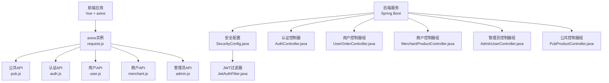
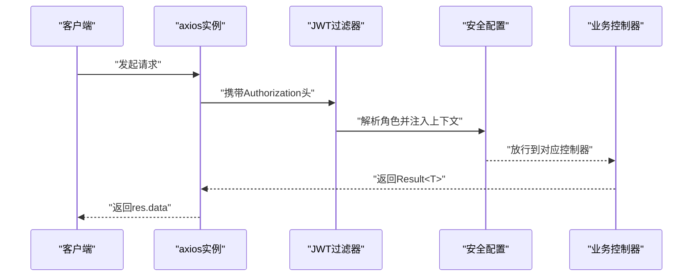
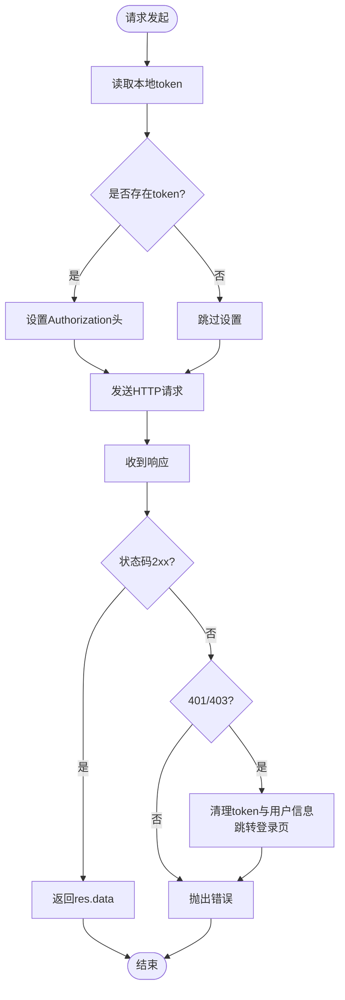
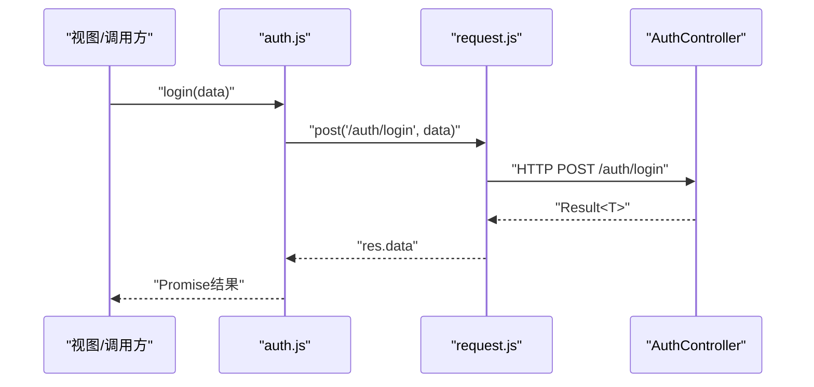
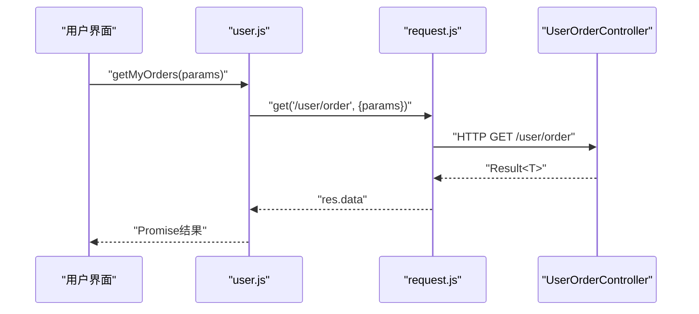
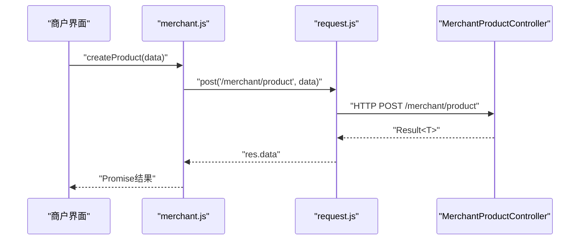
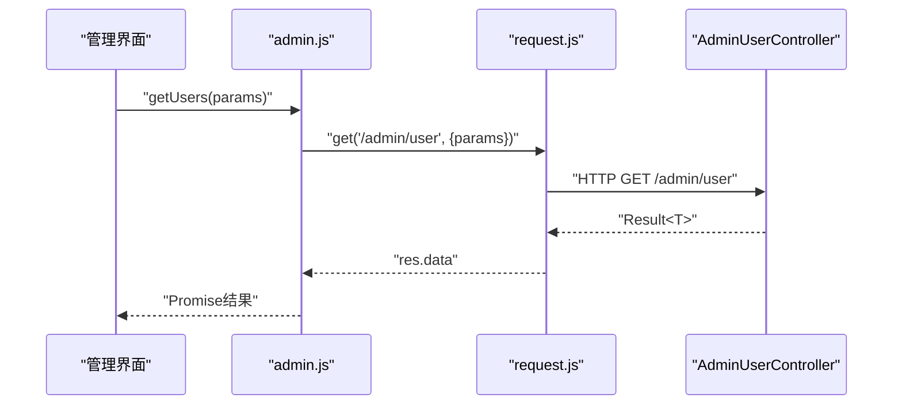
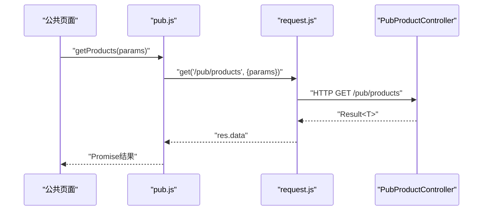
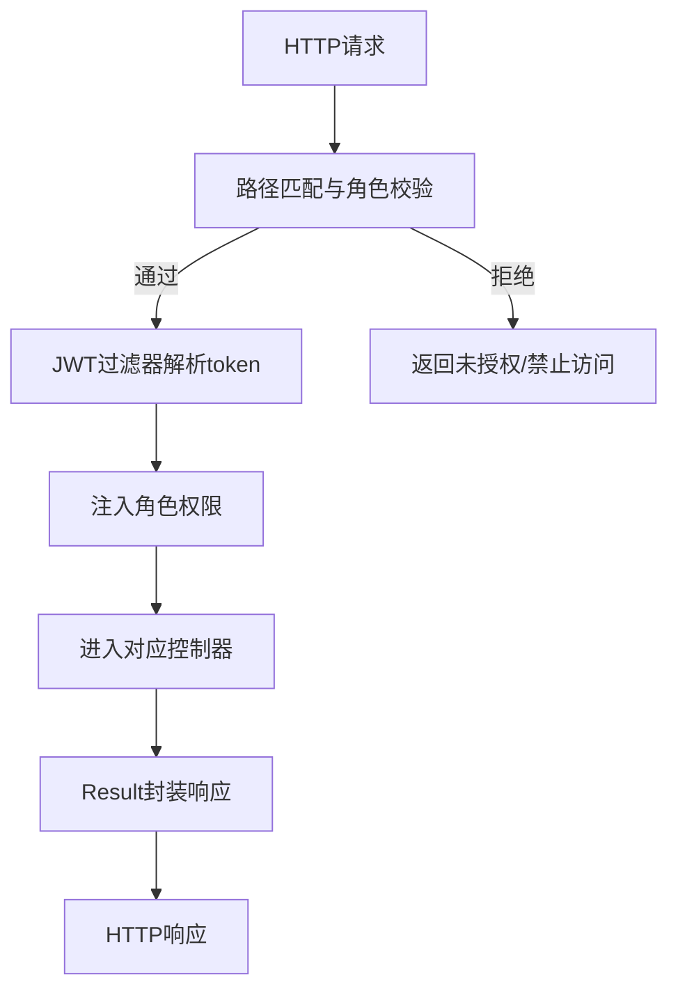
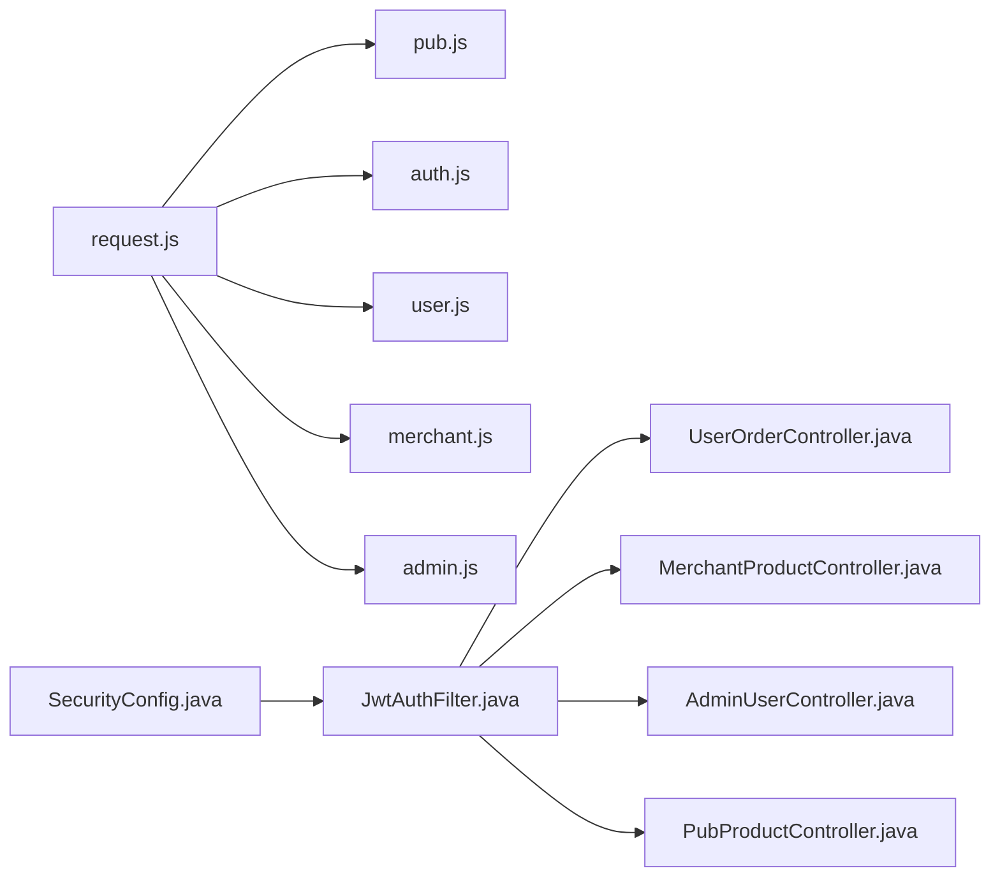

# API集成

<cite>
**本文引用的文件**
- [frontend/src/api/request.js](file://frontend/src/api/request.js)
- [frontend/src/api/auth.js](file://frontend/src/api/auth.js)
- [frontend/src/api/user.js](file://frontend/src/api/user.js)
- [frontend/src/api/merchant.js](file://frontend/src/api/merchant.js)
- [frontend/src/api/admin.js](file://frontend/src/api/admin.js)
- [frontend/src/api/pub.js](file://frontend/src/api/pub.js)
- [backend/src/main/resources/application.yml](file://backend/src/main/resources/application.yml)
- [backend/src/main/java/com/mall/config/SecurityConfig.java](file://backend/src/main/java/com/mall/config/SecurityConfig.java)
- [backend/src/main/java/com/mall/security/JwtAuthFilter.java](file://backend/src/main/java/com/mall/security/JwtAuthFilter.java)
- [backend/src/main/java/com/mall/dto/Result.java](file://backend/src/main/java/com/mall/dto/Result.java)
- [backend/src/main/java/com/mall/controller/AuthController.java](file://backend/src/main/java/com/mall/controller/AuthController.java)
- [backend/src/main/java/com/mall/controller/user/UserOrderController.java](file://backend/src/main/java/com/mall/controller/user/UserOrderController.java)
- [backend/src/main/java/com/mall/controller/merchant/MerchantProductController.java](file://backend/src/main/java/com/mall/controller/merchant/MerchantProductController.java)
- [backend/src/main/java/com/mall/controller/admin/AdminUserController.java](file://backend/src/main/java/com/mall/controller/admin/AdminUserController.java)
- [backend/src/main/java/com/mall/controller/pub/PubProductController.java](file://backend/src/main/java/com/mall/controller/pub/PubProductController.java)
</cite>

## 目录
1. [简介](#简介)
2. [项目结构](#项目结构)
3. [核心组件](#核心组件)
4. [架构总览](#架构总览)
5. [详细组件分析](#详细组件分析)
6. [依赖分析](#依赖分析)
7. [性能考虑](#性能考虑)
8. [故障排查指南](#故障排查指南)
9. [结论](#结论)
10. [附录](#附录)

## 简介
本技术文档面向电商商城系统的API集成，聚焦前端axios封装与多角色后端接口的对接方式，系统性阐述以下主题：
- HTTP请求封装策略：axios实例、请求/响应拦截器、统一错误处理
- 角色API模块设计：用户API、商户API、管理员API、公共API的职责划分与调用方式
- API客户端设计模式：参数格式化、响应数据处理、错误统一处理
- 高级特性：认证token管理、API版本控制思路、请求重试策略
- 调试技巧、性能优化与安全防护建议

## 项目结构
前端采用按角色拆分的API模块，统一通过一个axios实例发起请求；后端以Spring MVC控制器按路径前缀区分角色与功能域，配合基于JWT的无状态鉴权。

图表来源
- [frontend/src/api/request.js:1-38](file://frontend/src/api/request.js#L1-L38)
- [frontend/src/api/auth.js:1-26](file://frontend/src/api/auth.js#L1-L26)
- [frontend/src/api/user.js:1-162](file://frontend/src/api/user.js#L1-L162)
- [frontend/src/api/merchant.js:1-135](file://frontend/src/api/merchant.js#L1-L135)
- [frontend/src/api/admin.js:1-129](file://frontend/src/api/admin.js#L1-L129)
- [frontend/src/api/pub.js:1-74](file://frontend/src/api/pub.js#L1-L74)
- [backend/src/main/java/com/mall/config/SecurityConfig.java:34-55](file://backend/src/main/java/com/mall/config/SecurityConfig.java#L34-L55)
- [backend/src/main/java/com/mall/security/JwtAuthFilter.java:30-47](file://backend/src/main/java/com/mall/security/JwtAuthFilter.java#L30-L47)
- [backend/src/main/java/com/mall/controller/AuthController.java:18-35](file://backend/src/main/java/com/mall/controller/AuthController.java#L18-L35)
- [backend/src/main/java/com/mall/controller/user/UserOrderController.java:34-50](file://backend/src/main/java/com/mall/controller/user/UserOrderController.java#L34-L50)
- [backend/src/main/java/com/mall/controller/merchant/MerchantProductController.java:36-44](file://backend/src/main/java/com/mall/controller/merchant/MerchantProductController.java#L36-L44)
- [backend/src/main/java/com/mall/controller/admin/AdminUserController.java:26-36](file://backend/src/main/java/com/mall/controller/admin/AdminUserController.java#L26-L36)
- [backend/src/main/java/com/mall/controller/pub/PubProductController.java:24-46](file://backend/src/main/java/com/mall/controller/pub/PubProductController.java#L24-L46)

章节来源
- [frontend/src/api/request.js:1-38](file://frontend/src/api/request.js#L1-L38)
- [backend/src/main/resources/application.yml:22-25](file://backend/src/main/resources/application.yml#L22-L25)

## 核心组件
- axios实例与拦截器
  - 基础配置：统一baseURL与超时时间
  - 请求拦截：自动注入Authorization头中的Bearer Token
  - 响应拦截：统一剥离res.data；对401/403进行登出清理并跳转登录页
- 角色API模块
  - 公共API(pub.js)：无需登录或弱依赖登录的数据读取
  - 认证API(auth.js)：登录/注册
  - 用户API(user.js)：个人资料、购物车、收藏、订单、评价、地址、聊天
  - 商户API(merchant.js)：商品管理、订单履约、库存、评价、图片上传
  - 管理员API(admin.js)：用户/商户/分类/订单/资讯/评价管理
- 后端安全与路由
  - 基于路径前缀的访问控制：/pub/**放行；/user/**要求USER；/merchant/**要求MERCHANT；/admin/**要求ADMIN
  - JWT过滤器解析Authorization头，将角色信息注入Security上下文
  - 统一响应包装Result<T>，前后端约定标准返回结构

章节来源
- [frontend/src/api/request.js:4-35](file://frontend/src/api/request.js#L4-L35)
- [frontend/src/api/auth.js:14-25](file://frontend/src/api/auth.js#L14-L25)
- [frontend/src/api/user.js:8-161](file://frontend/src/api/user.js#L8-L161)
- [frontend/src/api/merchant.js:8-134](file://frontend/src/api/merchant.js#L8-L134)
- [frontend/src/api/admin.js:8-128](file://frontend/src/api/admin.js#L8-L128)
- [frontend/src/api/pub.js:8-73](file://frontend/src/api/pub.js#L8-L73)
- [backend/src/main/java/com/mall/config/SecurityConfig.java:39-51](file://backend/src/main/java/com/mall/config/SecurityConfig.java#L39-L51)
- [backend/src/main/java/com/mall/security/JwtAuthFilter.java:30-47](file://backend/src/main/java/com/mall/security/JwtAuthFilter.java#L30-L47)
- [backend/src/main/java/com/mall/dto/Result.java:10-22](file://backend/src/main/java/com/mall/dto/Result.java#L10-L22)

## 架构总览
前后端交互遵循“前端axios封装 + 后端REST控制器 + JWT无状态鉴权”的模式。前端通过统一的axios实例发起请求，后端根据请求路径与角色注解进行鉴权与授权。

图表来源
- [frontend/src/api/request.js:10-16](file://frontend/src/api/request.js#L10-L16)
- [backend/src/main/java/com/mall/security/JwtAuthFilter.java:30-47](file://backend/src/main/java/com/mall/security/JwtAuthFilter.java#L30-L47)
- [backend/src/main/java/com/mall/config/SecurityConfig.java:39-51](file://backend/src/main/java/com/mall/config/SecurityConfig.java#L39-L51)
- [backend/src/main/java/com/mall/dto/Result.java:16-22](file://backend/src/main/java/com/mall/dto/Result.java#L16-L22)

## 详细组件分析

### axios封装与拦截器
- 实例化与基础配置
  - baseURL统一为“/api”，与后端context-path一致
  - 超时设置为10秒
- 请求拦截器
  - 从localStorage读取token，若存在则在Authorization头中附加Bearer前缀
- 响应拦截器
  - 成功时直接返回res.data，隐藏axios包装
  - 失败时判断状态码，401/403执行登出清理并跳转登录页，随后抛出原始错误供上层处理

图表来源
- [frontend/src/api/request.js:10-35](file://frontend/src/api/request.js#L10-L35)

章节来源
- [frontend/src/api/request.js:4-35](file://frontend/src/api/request.js#L4-L35)

### 认证API模块（auth.js）
- 提供登录与注册两个接口，均通过统一的axios实例发起POST请求
- 登录参数包含用户名、密码与角色；注册参数包含基础用户信息
- 返回值为后端Result封装后的数据

图表来源
- [frontend/src/api/auth.js:14-16](file://frontend/src/api/auth.js#L14-L16)
- [backend/src/main/java/com/mall/controller/AuthController.java:18-35](file://backend/src/main/java/com/mall/controller/AuthController.java#L18-L35)

章节来源
- [frontend/src/api/auth.js:14-25](file://frontend/src/api/auth.js#L14-L25)
- [backend/src/main/java/com/mall/controller/AuthController.java:18-35](file://backend/src/main/java/com/mall/controller/AuthController.java#L18-L35)

### 用户API模块（user.js）
- 覆盖用户侧全链路能力：个人资料、购物车、收藏、订单、评价、地址、聊天
- 所有接口均通过统一axios实例发起，自动携带token
- 订单相关接口包含创建、查询、支付、收货、退款申请、批量退款等

图表来源
- [frontend/src/api/user.js:64-66](file://frontend/src/api/user.js#L64-L66)
- [backend/src/main/java/com/mall/controller/user/UserOrderController.java:52-86](file://backend/src/main/java/com/mall/controller/user/UserOrderController.java#L52-L86)

章节来源
- [frontend/src/api/user.js:8-161](file://frontend/src/api/user.js#L8-L161)
- [backend/src/main/java/com/mall/controller/user/UserOrderController.java:34-50](file://backend/src/main/java/com/mall/controller/user/UserOrderController.java#L34-L50)

### 商户API模块（merchant.js）
- 商户看板、商品管理、订单履约、库存管理、评价管理、图片上传
- 商品管理支持新增/更新/删除及规格管理
- 库存管理支持单个与批量调整、预警查询
- 图片上传采用multipart/form-data，自动设置Content-Type

图表来源
- [frontend/src/api/merchant.js:24-26](file://frontend/src/api/merchant.js#L24-L26)
- [backend/src/main/java/com/mall/controller/merchant/MerchantProductController.java:56-114](file://backend/src/main/java/com/mall/controller/merchant/MerchantProductController.java#L56-L114)

章节来源
- [frontend/src/api/merchant.js:8-134](file://frontend/src/api/merchant.js#L8-L134)
- [backend/src/main/java/com/mall/controller/merchant/MerchantProductController.java:36-44](file://backend/src/main/java/com/mall/controller/merchant/MerchantProductController.java#L36-L44)

### 管理员API模块（admin.js）
- 管理端看板、用户/商户/分类/订单/资讯/评价管理
- 用户管理支持分页查询、创建（密码加密）、更新、删除
- 资讯管理支持CRUD与快速发布公告

图表来源
- [frontend/src/api/admin.js:14-16](file://frontend/src/api/admin.js#L14-L16)
- [backend/src/main/java/com/mall/controller/admin/AdminUserController.java:26-36](file://backend/src/main/java/com/mall/controller/admin/AdminUserController.java#L26-L36)

章节来源
- [frontend/src/api/admin.js:8-128](file://frontend/src/api/admin.js#L8-L128)
- [backend/src/main/java/com/mall/controller/admin/AdminUserController.java:26-36](file://backend/src/main/java/com/mall/controller/admin/AdminUserController.java#L26-L36)

### 公共API模块（pub.js）
- 无需登录或弱依赖登录的数据读取：商品列表/详情、新品、销量排行、推荐、分类、资讯、轮播图、评价、规格
- 推荐接口需要登录态时传入userId

图表来源
- [frontend/src/api/pub.js:9-11](file://frontend/src/api/pub.js#L9-L11)
- [backend/src/main/java/com/mall/controller/pub/PubProductController.java:24-46](file://backend/src/main/java/com/mall/controller/pub/PubProductController.java#L24-L46)

章节来源
- [frontend/src/api/pub.js:8-73](file://frontend/src/api/pub.js#L8-L73)
- [backend/src/main/java/com/mall/controller/pub/PubProductController.java:24-46](file://backend/src/main/java/com/mall/controller/pub/PubProductController.java#L24-L46)

### 后端安全与鉴权
- 路由与角色控制
  - /auth/**放行
  - /pub/**放行
  - /images/**放行
  - /user/**要求USER角色
  - /merchant/**要求MERCHANT角色
  - /admin/**要求ADMIN角色
- JWT过滤器
  - 解析Authorization头中的Bearer token
  - 将角色映射为ROLE_USER/ROLE_MERCHANT/ROLE_ADMIN注入SecurityContext
- 统一响应
  - Result<T>封装code/message/data，前后端约定一致

图表来源
- [backend/src/main/java/com/mall/config/SecurityConfig.java:39-51](file://backend/src/main/java/com/mall/config/SecurityConfig.java#L39-L51)
- [backend/src/main/java/com/mall/security/JwtAuthFilter.java:30-47](file://backend/src/main/java/com/mall/security/JwtAuthFilter.java#L30-L47)
- [backend/src/main/java/com/mall/dto/Result.java:16-22](file://backend/src/main/java/com/mall/dto/Result.java#L16-L22)

章节来源
- [backend/src/main/java/com/mall/config/SecurityConfig.java:39-51](file://backend/src/main/java/com/mall/config/SecurityConfig.java#L39-L51)
- [backend/src/main/java/com/mall/security/JwtAuthFilter.java:30-47](file://backend/src/main/java/com/mall/security/JwtAuthFilter.java#L30-L47)
- [backend/src/main/java/com/mall/dto/Result.java:16-22](file://backend/src/main/java/com/mall/dto/Result.java#L16-L22)

## 依赖分析
- 前端模块耦合
  - 各角色API模块仅依赖统一的axios实例，内聚高、耦合低
  - 公共API模块与认证API模块独立，避免不必要的角色耦合
- 后端模块耦合
  - 控制器依赖服务层与仓储层，遵循分层架构
  - 安全配置与JWT过滤器形成鉴权链路，控制器通过注解与路径前缀受控

图表来源
- [frontend/src/api/request.js:1-1](file://frontend/src/api/request.js#L1-L1)
- [frontend/src/api/pub.js:1-1](file://frontend/src/api/pub.js#L1-L1)
- [frontend/src/api/auth.js:1-1](file://frontend/src/api/auth.js#L1-L1)
- [frontend/src/api/user.js:1-1](file://frontend/src/api/user.js#L1-L1)
- [frontend/src/api/merchant.js:1-1](file://frontend/src/api/merchant.js#L1-L1)
- [frontend/src/api/admin.js:1-1](file://frontend/src/api/admin.js#L1-L1)
- [backend/src/main/java/com/mall/config/SecurityConfig.java:34-55](file://backend/src/main/java/com/mall/config/SecurityConfig.java#L34-L55)
- [backend/src/main/java/com/mall/security/JwtAuthFilter.java:30-47](file://backend/src/main/java/com/mall/security/JwtAuthFilter.java#L30-L47)
- [backend/src/main/java/com/mall/controller/user/UserOrderController.java:19-31](file://backend/src/main/java/com/mall/controller/user/UserOrderController.java#L19-L31)
- [backend/src/main/java/com/mall/controller/merchant/MerchantProductController.java:18-34](file://backend/src/main/java/com/mall/controller/merchant/MerchantProductController.java#L18-L34)
- [backend/src/main/java/com/mall/controller/admin/AdminUserController.java:17-21](file://backend/src/main/java/com/mall/controller/admin/AdminUserController.java#L17-L21)
- [backend/src/main/java/com/mall/controller/pub/PubProductController.java:15-23](file://backend/src/main/java/com/mall/controller/pub/PubProductController.java#L15-L23)

章节来源
- [frontend/src/api/request.js:1-38](file://frontend/src/api/request.js#L1-L38)
- [backend/src/main/java/com/mall/config/SecurityConfig.java:34-55](file://backend/src/main/java/com/mall/config/SecurityConfig.java#L34-L55)

## 性能考虑
- 请求合并与缓存
  - 对高频读取的公共数据（如分类、轮播图、新品/销量排行）在前端做缓存与去重
- 分页与懒加载
  - 使用分页参数控制数据规模，结合虚拟列表/滚动懒加载减少渲染压力
- 并发控制
  - 对同一资源的多次请求进行去抖/节流，避免重复网络请求
- 响应压缩与CDN
  - 后端启用GZIP，静态资源走CDN，降低带宽与延迟
- 重试与退避
  - 对瞬时错误（5xx/网络异常）采用指数退避重试，避免雪崩效应
- 传输优化
  - 图片上传使用分片/断点续传（如需），并限制分辨率与格式

## 故障排查指南
- 登录后仍提示未授权
  - 检查Authorization头是否正确附加Bearer token
  - 确认后端JWT过滤器能解析token并注入角色
- 403无权限或登录失效
  - 响应拦截器会清理本地token并跳转登录页；检查登录接口返回与存储逻辑
- 跨域问题
  - 确认后端CORS允许前端开发服务器地址与方法/头
- 参数格式错误
  - 订单退款批量接口需要特定的itemIds与itemQuantities结构；确保传参符合后端解析要求
- 数据不一致
  - 检查后端Result封装与前端res.data剥离是否一致，避免二次包装

章节来源
- [frontend/src/api/request.js:18-35](file://frontend/src/api/request.js#L18-L35)
- [backend/src/main/java/com/mall/config/SecurityConfig.java:58-67](file://backend/src/main/java/com/mall/config/SecurityConfig.java#L58-L67)
- [backend/src/main/java/com/mall/controller/user/UserOrderController.java:170-196](file://backend/src/main/java/com/mall/controller/user/UserOrderController.java#L170-L196)

## 结论
本API集成方案通过统一的axios封装与清晰的角色化API模块，实现了前后端协作的标准化与可维护性。配合后端基于路径前缀与JWT的角色鉴权，既能满足多角色业务需求，又能保证安全性与扩展性。建议在实际工程中进一步完善请求重试、缓存策略与监控埋点，持续提升用户体验与系统稳定性。

## 附录
- API版本控制建议
  - 在baseURL中加入版本前缀（如/api/v1），便于平滑演进与灰度发布
- 错误码规范
  - 建议统一错误码范围：401/403/404/500等，前端据此做差异化处理
- 安全加固
  - 强制HTTPS、CSP、XSS防护、敏感参数脱敏、日志脱敏与审计