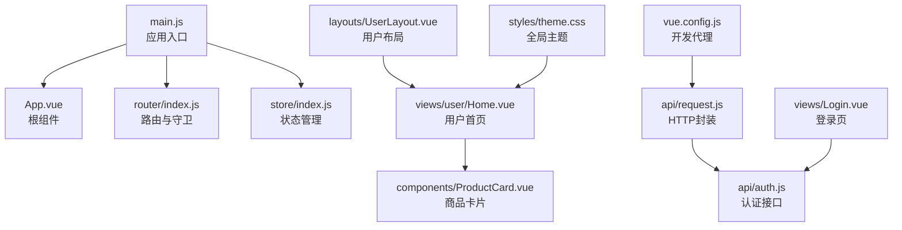
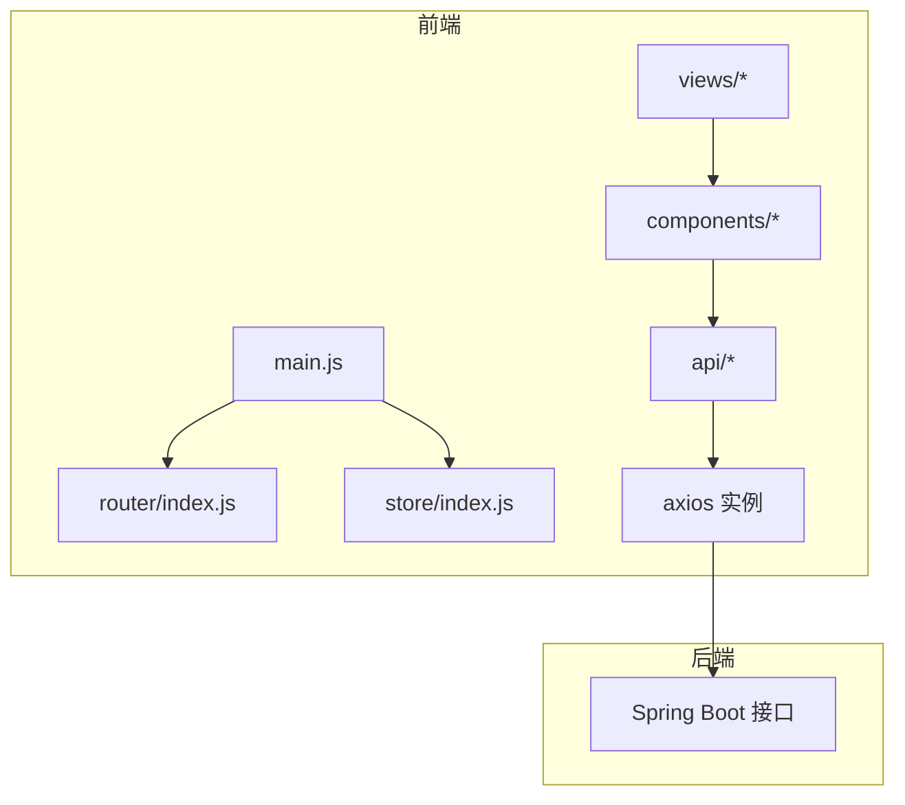
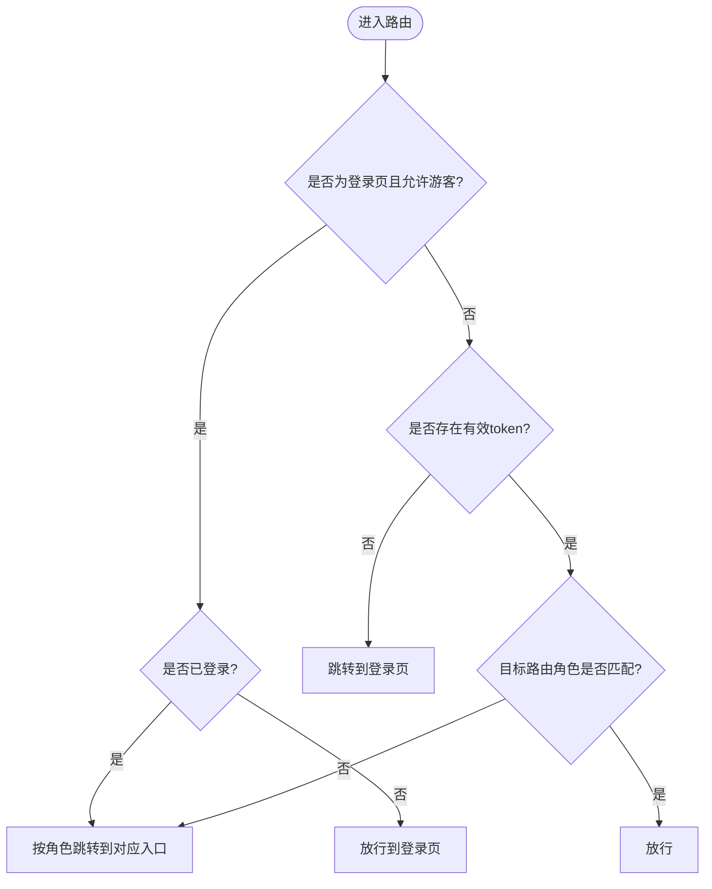
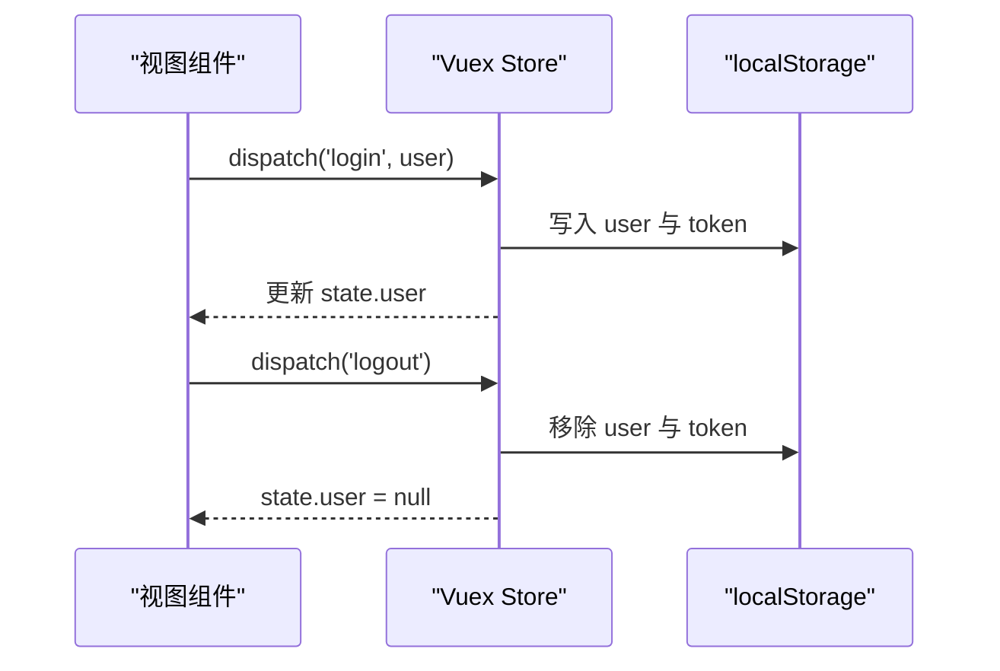
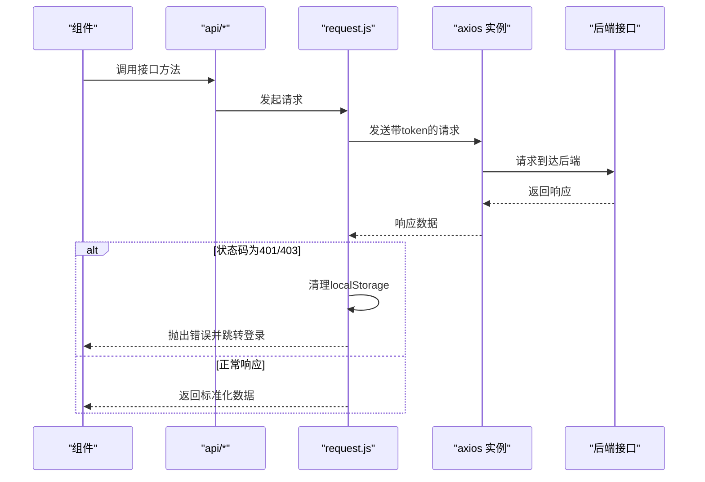
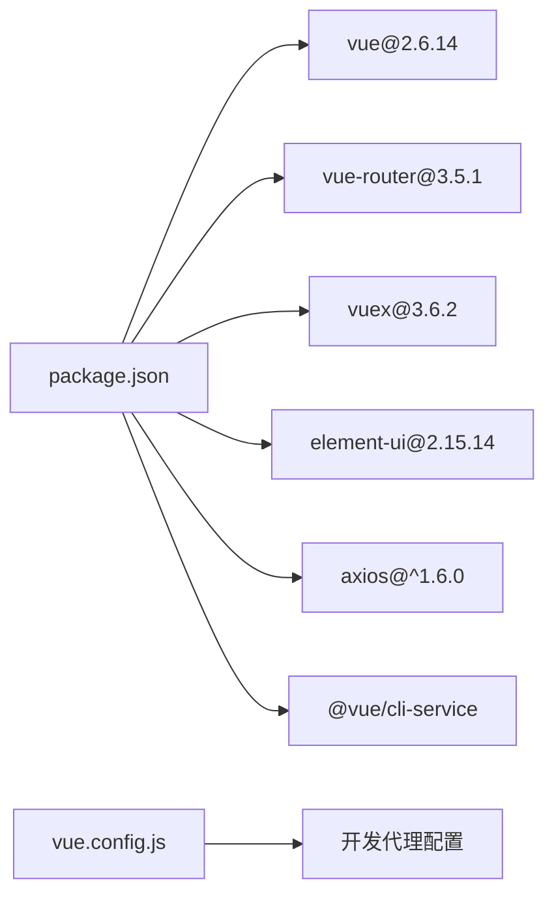

# 前端架构详解

<cite>
**本文档引用的文件**
- [frontend/src/main.js](file://frontend/src/main.js)
- [frontend/src/App.vue](file://frontend/src/App.vue)
- [frontend/src/router/index.js](file://frontend/src/router/index.js)
- [frontend/src/store/index.js](file://frontend/src/store/index.js)
- [frontend/src/api/request.js](file://frontend/src/api/request.js)
- [frontend/src/api/auth.js](file://frontend/src/api/auth.js)
- [frontend/src/layouts/UserLayout.vue](file://frontend/src/layouts/UserLayout.vue)
- [frontend/src/components/ProductCard.vue](file://frontend/src/components/ProductCard.vue)
- [frontend/src/views/user/Home.vue](file://frontend/src/views/user/Home.vue)
- [frontend/src/views/Login.vue](file://frontend/src/views/Login.vue)
- [frontend/src/styles/theme.css](file://frontend/src/styles/theme.css)
- [frontend/vue.config.js](file://frontend/vue.config.js)
- [frontend/package.json](file://frontend/package.json)
- [frontend/public/index.html](file://frontend/public/index.html)
</cite>

## 目录
1. [引言](#引言)
2. [项目结构](#项目结构)
3. [核心组件](#核心组件)
4. [架构总览](#架构总览)
5. [详细组件分析](#详细组件分析)
6. [依赖关系分析](#依赖关系分析)
7. [性能考虑](#性能考虑)
8. [故障排查指南](#故障排查指南)
9. [结论](#结论)
10. [附录](#附录)

## 引言
本文件面向电商商城系统的前端团队，系统性梳理基于 Vue.js 2.6.14 的前端架构，涵盖项目组织、组件化设计、路由与权限控制、状态管理、API 集成、Element UI 使用、响应式与主题定制、组件通信、构建与开发调试、性能优化与最佳实践等。目标是帮助开发者快速理解并高效扩展系统功能。

## 项目结构
前端采用 Vue CLI 5.x 生成的工程骨架，目录清晰分层：
- 根入口与挂载：main.js 注册 Element UI、引入路由与状态管理，挂载根组件 App.vue
- 路由：router/index.js 定义用户/管理员/商户三类角色路由与权限守卫
- 状态管理：store/index.js 管理用户登录态与本地持久化
- API 层：api/request.js 统一封装 axios；各业务模块（auth、user、pub、merchant、admin）按职责拆分
- 视图与布局：views 下按角色划分页面；layouts 提供三类布局组件
- 样式：styles 提供全局主题变量与 Element UI 覆盖
- 构建：vue.config.js 配置开发服务器代理；package.json 定义依赖与脚本

图表来源
- [frontend/src/main.js:1-20](file://frontend/src/main.js#L1-L20)
- [frontend/src/App.vue:1-18](file://frontend/src/App.vue#L1-L18)
- [frontend/src/router/index.js:1-208](file://frontend/src/router/index.js#L1-L208)
- [frontend/src/store/index.js:1-31](file://frontend/src/store/index.js#L1-L31)
- [frontend/src/api/request.js:1-38](file://frontend/src/api/request.js#L1-L38)
- [frontend/src/api/auth.js:1-26](file://frontend/src/api/auth.js#L1-L26)
- [frontend/src/views/Login.vue:1-1103](file://frontend/src/views/Login.vue#L1-L1103)
- [frontend/src/views/user/Home.vue:1-1679](file://frontend/src/views/user/Home.vue#L1-L1679)
- [frontend/src/components/ProductCard.vue:1-261](file://frontend/src/components/ProductCard.vue#L1-L261)
- [frontend/src/layouts/UserLayout.vue:1-177](file://frontend/src/layouts/UserLayout.vue#L1-L177)
- [frontend/src/styles/theme.css:1-209](file://frontend/src/styles/theme.css#L1-L209)
- [frontend/vue.config.js:1-20](file://frontend/vue.config.js#L1-L20)

章节来源
- [frontend/src/main.js:1-20](file://frontend/src/main.js#L1-L20)
- [frontend/src/App.vue:1-18](file://frontend/src/App.vue#L1-L18)
- [frontend/src/router/index.js:1-208](file://frontend/src/router/index.js#L1-L208)
- [frontend/src/store/index.js:1-31](file://frontend/src/store/index.js#L1-L31)
- [frontend/src/api/request.js:1-38](file://frontend/src/api/request.js#L1-L38)
- [frontend/src/api/auth.js:1-26](file://frontend/src/api/auth.js#L1-L26)
- [frontend/src/views/Login.vue:1-1103](file://frontend/src/views/Login.vue#L1-L1103)
- [frontend/src/views/user/Home.vue:1-1679](file://frontend/src/views/user/Home.vue#L1-L1679)
- [frontend/src/components/ProductCard.vue:1-261](file://frontend/src/components/ProductCard.vue#L1-L261)
- [frontend/src/layouts/UserLayout.vue:1-177](file://frontend/src/layouts/UserLayout.vue#L1-L177)
- [frontend/src/styles/theme.css:1-209](file://frontend/src/styles/theme.css#L1-L209)
- [frontend/vue.config.js:1-20](file://frontend/vue.config.js#L1-L20)
- [frontend/package.json:1-24](file://frontend/package.json#L1-L24)
- [frontend/public/index.html:1-12](file://frontend/public/index.html#L1-L12)

## 核心组件
- 应用入口与挂载：注册 Element UI，注入路由与状态管理，渲染根组件
- 根组件：承载路由出口，作为页面容器
- 路由系统：按角色划分路由树，使用全局前置守卫进行登录态与角色校验
- 状态管理：集中存储用户信息与令牌，提供登录/登出动作
- HTTP 封装：统一基础路径、超时、请求头携带、鉴权失败处理
- 布局组件：UserLayout 提供用户端导航与退出逻辑
- 通用组件：ProductCard 封装商品展示与加入购物车交互
- 页面视图：Login 提供多角色登录、注册、忘记密码流程；Home 聚合轮播、新品、排行、推荐等模块

章节来源
- [frontend/src/main.js:1-20](file://frontend/src/main.js#L1-L20)
- [frontend/src/App.vue:1-18](file://frontend/src/App.vue#L1-L18)
- [frontend/src/router/index.js:1-208](file://frontend/src/router/index.js#L1-L208)
- [frontend/src/store/index.js:1-31](file://frontend/src/store/index.js#L1-L31)
- [frontend/src/api/request.js:1-38](file://frontend/src/api/request.js#L1-L38)
- [frontend/src/layouts/UserLayout.vue:1-177](file://frontend/src/layouts/UserLayout.vue#L1-L177)
- [frontend/src/components/ProductCard.vue:1-261](file://frontend/src/components/ProductCard.vue#L1-L261)
- [frontend/src/views/Login.vue:1-1103](file://frontend/src/views/Login.vue#L1-L1103)
- [frontend/src/views/user/Home.vue:1-1679](file://frontend/src/views/user/Home.vue#L1-L1679)

## 架构总览
系统采用“入口 -> 路由守卫 -> 布局/视图 -> 组件 -> API -> 后端”的数据流。Element UI 提供 UI 基础能力，主题通过 CSS 变量统一管理，构建阶段通过代理将 /api、/pub、/images 请求转发至后端服务。

图表来源
- [frontend/src/main.js:1-20](file://frontend/src/main.js#L1-L20)
- [frontend/src/router/index.js:1-208](file://frontend/src/router/index.js#L1-L208)
- [frontend/src/store/index.js:1-31](file://frontend/src/store/index.js#L1-L31)
- [frontend/src/api/request.js:1-38](file://frontend/src/api/request.js#L1-L38)
- [frontend/src/views/user/Home.vue:1-1679](file://frontend/src/views/user/Home.vue#L1-L1679)
- [frontend/src/components/ProductCard.vue:1-261](file://frontend/src/components/ProductCard.vue#L1-L261)

## 详细组件分析

### 路由与权限控制
- 路由表按用户、管理员、商户三类角色划分，子路由覆盖首页、商品、购物车、订单、个人中心等场景
- 全局前置守卫：
  - guest 元信息允许未登录访问登录页；已登录则按角色跳转对应入口
  - 非 guest 路由要求有效 token；若角色不匹配则强制跳转到当前用户角色入口
- 该策略确保不同角色只能访问授权范围内的页面，避免越权访问

图表来源
- [frontend/src/router/index.js:182-205](file://frontend/src/router/index.js#L182-L205)

章节来源
- [frontend/src/router/index.js:1-208](file://frontend/src/router/index.js#L1-L208)

### 状态管理（Vuex）
- 状态：user 字段来自 localStorage，初始化时读取
- 变更：setUser 根据是否传入用户对象决定写入或移除 localStorage 中的 user 与 token
- 动作：login 提交用户信息；logout 清空用户信息
- 与路由守卫配合，实现登录态同步与跨页面持久化

图表来源
- [frontend/src/store/index.js:6-30](file://frontend/src/store/index.js#L6-L30)

章节来源
- [frontend/src/store/index.js:1-31](file://frontend/src/store/index.js#L1-L31)

### HTTP 请求封装与错误处理
- axios 实例：baseURL 为 /api，统一超时时间
- 请求拦截：自动附加 Authorization: Bearer token
- 响应拦截：统一提取 res.data；对 401/403 自动清理本地 token 与用户信息，弹窗提示并跳转登录页
- 该封装屏蔽了跨模块的重复逻辑，统一了错误处理策略

图表来源
- [frontend/src/api/request.js:1-38](file://frontend/src/api/request.js#L1-L38)

章节来源
- [frontend/src/api/request.js:1-38](file://frontend/src/api/request.js#L1-L38)

### Element UI 组件库与主题定制
- 全局引入 Element UI 样式与主题
- 通过 CSS 变量定义全局设计令牌（背景、表面、边框、文字、品牌色、阴影、圆角、布局等），在 theme.css 中集中管理
- element-overrides.css 用于覆盖 Element UI 组件的特定样式
- 布局组件与视图广泛使用 Element UI 的布局、表单、卡片、按钮、分页等组件

章节来源
- [frontend/src/main.js:5-8](file://frontend/src/main.js#L5-L8)
- [frontend/src/styles/theme.css:1-209](file://frontend/src/styles/theme.css#L1-L209)

### 布局与页面视图
- UserLayout：提供用户端顶部导航、品牌标识、主导航链接、用户信息与退出按钮；退出时触发 store.logout 并跳转登录
- Home：聚合轮播图、新品、销量排行、个性化推荐、品牌区等模块；使用 ProductCard 组件展示商品；支持搜索、热门词、购物车加入等交互
- Login：支持多角色登录、注册、忘记密码流程；表单校验、密码强度指示、记住我等功能

章节来源
- [frontend/src/layouts/UserLayout.vue:1-177](file://frontend/src/layouts/UserLayout.vue#L1-L177)
- [frontend/src/views/user/Home.vue:1-1679](file://frontend/src/views/user/Home.vue#L1-L1679)
- [frontend/src/views/Login.vue:1-1103](file://frontend/src/views/Login.vue#L1-L1103)

### 组件通信机制
- 父子通信：Home 通过 props 向 ProductCard 传递商品数据；ProductCard 在点击时通过 $router.push 导航到详情页
- 组件间事件：ProductCard 在加入购物车时通过 $store.state.user 判断登录态，再调用 API 并通过 $message 提示
- 路由级通信：UserLayout 通过 $store.state.user 计算属性绑定用户昵称；退出时通过 $store.dispatch('logout') 与 $router.push('/login') 完成登出

章节来源
- [frontend/src/views/user/Home.vue:242-298](file://frontend/src/views/user/Home.vue#L242-L298)
- [frontend/src/components/ProductCard.vue:45-69](file://frontend/src/components/ProductCard.vue#L45-L69)
- [frontend/src/layouts/UserLayout.vue:59-72](file://frontend/src/layouts/UserLayout.vue#L59-L72)

### API 集成与模块划分
- 认证模块：login、register 方法封装 /auth/* 接口
- 通用请求：request.js 提供 axios 实例与拦截器
- 业务模块：按领域拆分 admin、merchant、pub、user 等模块（具体接口文件位于相应目录）

章节来源
- [frontend/src/api/auth.js:1-26](file://frontend/src/api/auth.js#L1-L26)
- [frontend/src/api/request.js:1-38](file://frontend/src/api/request.js#L1-L38)

## 依赖关系分析
- 运行时依赖：vue、vue-router、vuex、element-ui、axios、echarts、wangeditor
- 开发依赖：@vue/cli-service、@vue/cli-plugin-babel、vue-template-compiler
- 构建与代理：vue.config.js 配置 devServer 端口与 /api、/pub、/images 代理，指向后端 8080 端口

图表来源
- [frontend/package.json:1-24](file://frontend/package.json#L1-L24)
- [frontend/vue.config.js:1-20](file://frontend/vue.config.js#L1-L20)

章节来源
- [frontend/package.json:1-24](file://frontend/package.json#L1-L24)
- [frontend/vue.config.js:1-20](file://frontend/vue.config.js#L1-L20)

## 性能考虑
- 路由懒加载：路由组件通过动态导入减少首屏体积
- 组件懒加载：Home 中对 ProductCard 使用异步组件导入，按需加载
- 图片与资源：轮播图与品牌区使用懒加载与占位处理，提升首屏体验
- 本地缓存：登录态与记住我信息使用 localStorage，减少重复登录成本
- 主题与样式：CSS 变量集中管理，避免重复样式计算
- 构建优化：生产构建由 @vue/cli-service 处理，建议开启压缩与分包策略（可在 vue.config.js 扩展）

章节来源
- [frontend/src/router/index.js:11,151,155,169:11-11](file://frontend/src/router/index.js#L11-L11)
- [frontend/src/views/user/Home.vue:581](file://frontend/src/views/user/Home.vue#L581)
- [frontend/src/components/ProductCard.vue:10-13](file://frontend/src/components/ProductCard.vue#L10-L13)

## 故障排查指南
- 登录后无法访问页面
  - 检查路由守卫逻辑与用户角色是否匹配
  - 确认 localStorage 中 token 与 user 是否存在
- 鉴权失败（401/403）
  - 查看 request.js 响应拦截器是否清理了 token 与用户信息
  - 确认后端 JWT 配置与过期策略
- 开发环境接口 404 或跨域
  - 检查 vue.config.js 代理配置是否正确指向后端地址
  - 确认请求前缀是否为 /api、/pub、/images
- Element UI 样式异常
  - 检查 theme.css 与 element-overrides.css 的引入顺序
  - 确认 CSS 变量命名与覆盖规则

章节来源
- [frontend/src/router/index.js:182-205](file://frontend/src/router/index.js#L182-L205)
- [frontend/src/api/request.js:18-35](file://frontend/src/api/request.js#L18-L35)
- [frontend/vue.config.js:4-17](file://frontend/vue.config.js#L4-L17)
- [frontend/src/main.js:5-8](file://frontend/src/main.js#L5-L8)

## 结论
该前端架构以 Vue 2.6.14 为核心，结合 Element UI、Vuex 与 Vue Router，实现了清晰的角色化路由与权限控制、统一的 HTTP 封装与错误处理、可复用的组件与布局体系。通过 CSS 变量与主题定制，保证了视觉一致性与可维护性。建议后续在构建配置、国际化、测试与监控方面持续完善，以支撑更大规模的业务演进。

## 附录
- 开发与构建
  - 启动开发服务器：npm run serve
  - 生产构建：npm run build
- 关键文件清单
  - 入口与挂载：frontend/src/main.js、frontend/public/index.html
  - 路由与守卫：frontend/src/router/index.js
  - 状态管理：frontend/src/store/index.js
  - HTTP 封装：frontend/src/api/request.js
  - 认证接口：frontend/src/api/auth.js
  - 布局与视图：frontend/src/layouts/UserLayout.vue、frontend/src/views/Login.vue、frontend/src/views/user/Home.vue
  - 样式：frontend/src/styles/theme.css
  - 构建配置：frontend/vue.config.js、frontend/package.json