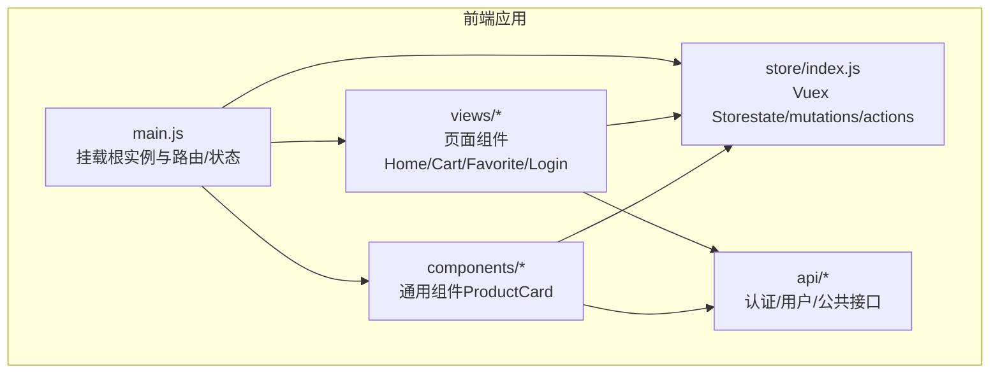
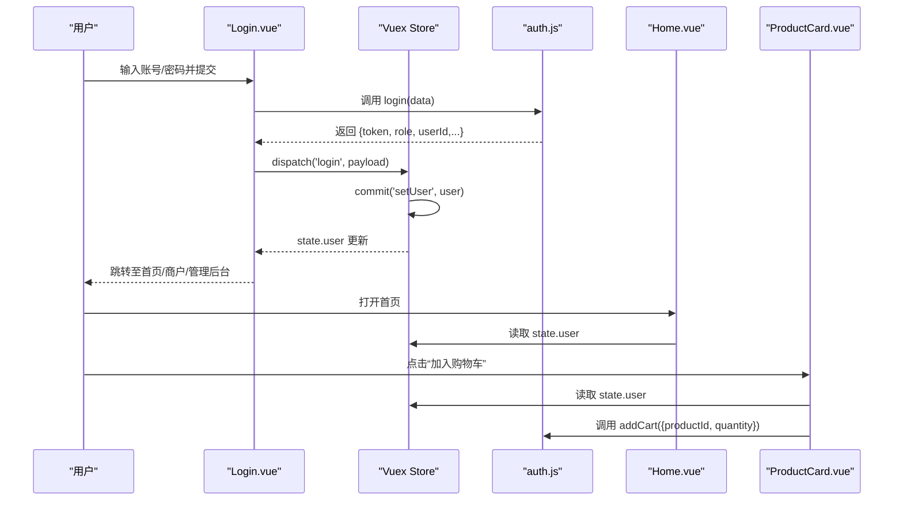
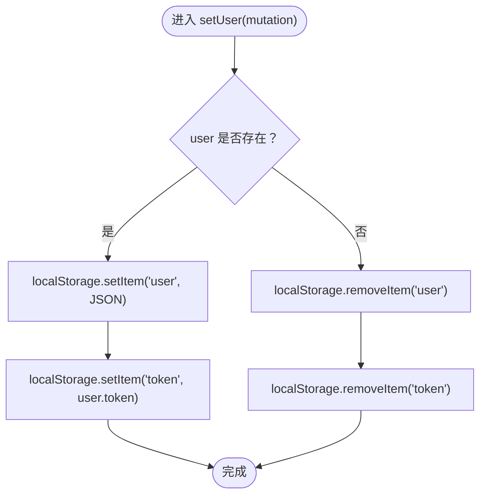
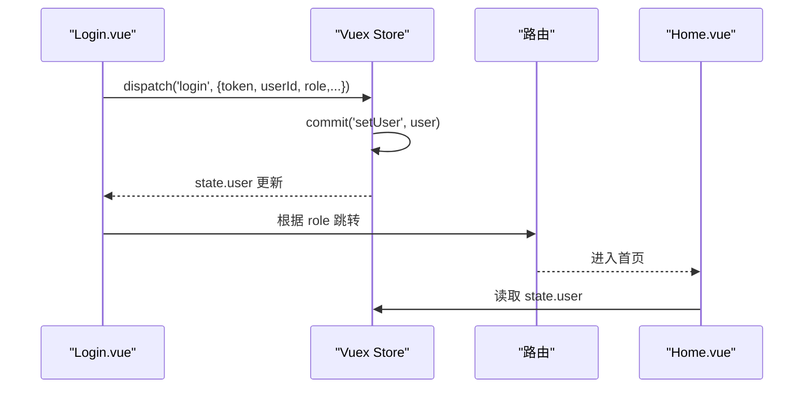
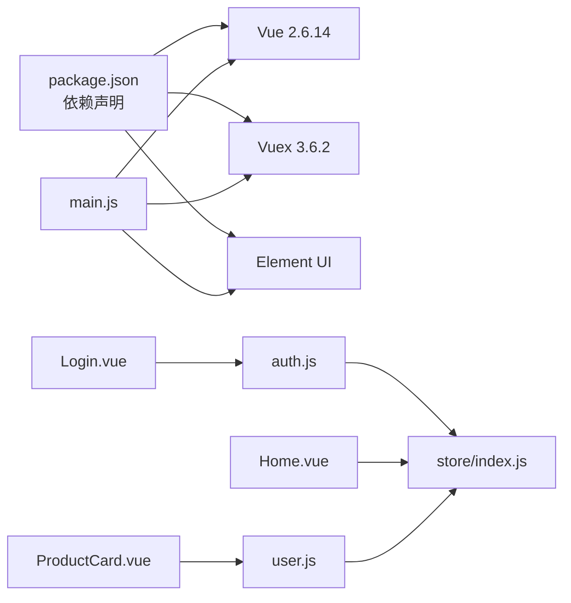

# 状态管理

<cite>
**本文引用的文件**
- [frontend/src/store/index.js](file://frontend/src/store/index.js)
- [frontend/src/main.js](file://frontend/src/main.js)
- [frontend/package.json](file://frontend/package.json)
- [frontend/src/views/Login.vue](file://frontend/src/views/Login.vue)
- [frontend/src/views/user/Home.vue](file://frontend/src/views/user/Home.vue)
- [frontend/src/components/ProductCard.vue](file://frontend/src/components/ProductCard.vue)
- [frontend/src/views/user/Cart.vue](file://frontend/src/views/user/Cart.vue)
- [frontend/src/views/user/Favorite.vue](file://frontend/src/views/user/Favorite.vue)
- [frontend/src/api/auth.js](file://frontend/src/api/auth.js)
- [frontend/src/api/user.js](file://frontend/src/api/user.js)
</cite>

## 目录
1. [简介](#简介)
2. [项目结构](#项目结构)
3. [核心组件](#核心组件)
4. [架构总览](#架构总览)
5. [详细组件分析](#详细组件分析)
6. [依赖分析](#依赖分析)
7. [性能考虑](#性能考虑)
8. [故障排查指南](#故障排查指南)
9. [结论](#结论)
10. [附录](#附录)

## 简介
本文件面向电商商城系统的前端状态管理，聚焦于 Vuex 在本项目中的实现与使用。文档将从状态树设计、mutations 同步修改、actions 异步操作、getters 计算属性的使用出发，结合用户态、购物车、收藏等全局状态组织方式，系统阐述状态持久化策略、状态重置机制、调试工具使用，并总结模块化设计、命名规范与性能优化的最佳实践。同时，提供常见业务场景下的状态管理解决方案，帮助开发者构建可维护、可扩展的状态管理系统。

## 项目结构
前端采用 Vue 2 + Vuex 的经典组合，状态管理入口位于 store/index.js，全局挂载于 main.js 中。业务视图通过 $store.state/$store.dispatch/$store.commit 与状态交互；API 层封装在 api 目录下，统一对外暴露登录、用户、购物车、收藏等接口。

图表来源
- [frontend/src/main.js:1-20](file://frontend/src/main.js#L1-L20)
- [frontend/src/store/index.js:1-31](file://frontend/src/store/index.js#L1-L31)

章节来源
- [frontend/src/main.js:1-20](file://frontend/src/main.js#L1-L20)
- [frontend/src/store/index.js:1-31](file://frontend/src/store/index.js#L1-L31)

## 核心组件
- 全局 Store：集中管理用户登录态与本地持久化逻辑
- 页面组件：Home、Cart、Favorite、Login 等围绕用户态进行渲染与交互
- 通用组件：ProductCard 在加入购物车时读取用户态并触发 API 请求
- API 层：auth.js、user.js 提供认证与用户相关接口

章节来源
- [frontend/src/store/index.js:6-30](file://frontend/src/store/index.js#L6-L30)
- [frontend/src/views/user/Home.vue:424-428](file://frontend/src/views/user/Home.vue#L424-L428)
- [frontend/src/components/ProductCard.vue:55-67](file://frontend/src/components/ProductCard.vue#L55-L67)
- [frontend/src/api/auth.js:14-25](file://frontend/src/api/auth.js#L14-L25)
- [frontend/src/api/user.js:18-36](file://frontend/src/api/user.js#L18-L36)

## 架构总览
下图展示了从用户登录到状态更新、再到页面渲染与 API 调用的整体流程。

图表来源
- [frontend/src/views/Login.vue:503-512](file://frontend/src/views/Login.vue#L503-L512)
- [frontend/src/store/index.js:10-20](file://frontend/src/store/index.js#L10-L20)
- [frontend/src/api/auth.js:14-25](file://frontend/src/api/auth.js#L14-L25)
- [frontend/src/views/user/Home.vue:424-428](file://frontend/src/views/user/Home.vue#L424-L428)
- [frontend/src/components/ProductCard.vue:55-67](file://frontend/src/components/ProductCard.vue#L55-L67)
- [frontend/src/api/user.js:23-26](file://frontend/src/api/user.js#L23-L26)

## 详细组件分析

### Store：用户态与持久化
- 状态树：仅包含用户对象 user，初始值来自 localStorage，便于刷新后保持登录态
- 同步修改：setUser 用于设置/清空用户态，并同步写入/清理 localStorage 中的 user 与 token
- 异步操作：login/logout 分发 setUser，简化调用方逻辑
- 计算属性：当前项目未定义 getters，可按需扩展（例如派生用户权限、默认地址等）

图表来源
- [frontend/src/store/index.js:10-20](file://frontend/src/store/index.js#L10-L20)

章节来源
- [frontend/src/store/index.js:6-30](file://frontend/src/store/index.js#L6-L30)

### 登录流程与状态联动
- 登录成功后，Login.vue 将服务端返回的用户数据通过 dispatch('login', payload) 写入 Store
- Home.vue 通过 computed 读取用户态，控制个性化推荐与导航行为
- ProductCard.vue 在加入购物车前检查用户态，未登录则跳转登录页

图表来源
- [frontend/src/views/Login.vue:503-512](file://frontend/src/views/Login.vue#L503-L512)
- [frontend/src/views/user/Home.vue:424-428](file://frontend/src/views/user/Home.vue#L424-L428)
- [frontend/src/store/index.js:22-28](file://frontend/src/store/index.js#L22-L28)

章节来源
- [frontend/src/views/Login.vue:470-530](file://frontend/src/views/Login.vue#L470-L530)
- [frontend/src/views/user/Home.vue:424-428](file://frontend/src/views/user/Home.vue#L424-L428)
- [frontend/src/components/ProductCard.vue:55-67](file://frontend/src/components/ProductCard.vue#L55-L67)

### 购物车状态与持久化策略
- 当前实现：Store 仅保存用户态；购物车列表由 Cart.vue 通过 API 动态拉取并本地渲染
- 推荐策略：
  - 购物车列表可放入 Store，但建议仅缓存关键字段（如 productId、quantity），避免冗余
  - 对于价格、促销等易变信息，优先以接口为准，Store 仅做轻量缓存
  - 本地持久化：可将购物车轻量数据写入 localStorage，刷新后恢复，但需注意与服务端一致性校验

章节来源
- [frontend/src/views/user/Cart.vue:375-393](file://frontend/src/views/user/Cart.vue#L375-L393)
- [frontend/src/api/user.js:18-36](file://frontend/src/api/user.js#L18-L36)

### 收藏状态与交互
- Favorite.vue 通过 API 拉取收藏列表，本地渲染与删除
- 若需跨页面共享收藏状态，可在 Store 中维护一个轻量的收藏 ID 集合，并在需要时按需拉取详情

章节来源
- [frontend/src/views/user/Favorite.vue:68-88](file://frontend/src/views/user/Favorite.vue#L68-L88)
- [frontend/src/api/user.js:38-56](file://frontend/src/api/user.js#L38-L56)

### 商品卡片与用户态联动
- ProductCard.vue 在加入购物车时读取用户态，未登录则跳转登录页
- 该模式将“是否登录”的判断下沉到组件内部，便于复用；若多处出现相同逻辑，可考虑在路由守卫或全局中间件中统一处理

章节来源
- [frontend/src/components/ProductCard.vue:55-67](file://frontend/src/components/ProductCard.vue#L55-L67)

## 依赖分析
- Vue 2.6.14 与 Vuex 3.6.2 是状态管理的核心运行时
- Element UI 作为 UI 基础库，与 Store 的交互主要体现在消息提示、对话框与表单校验
- API 层通过 axios 封装请求，Store 与 API 的耦合点在于登录成功后的状态写入与后续页面的数据拉取

图表来源
- [frontend/package.json:9-16](file://frontend/package.json#L9-L16)
- [frontend/src/main.js:1-20](file://frontend/src/main.js#L1-L20)
- [frontend/src/views/Login.vue:270](file://frontend/src/views/Login.vue#L270)
- [frontend/src/api/auth.js:1-26](file://frontend/src/api/auth.js#L1-L26)
- [frontend/src/store/index.js:1-31](file://frontend/src/store/index.js#L1-L31)
- [frontend/src/views/user/Home.vue:344-354](file://frontend/src/views/user/Home.vue#L344-L354)
- [frontend/src/components/ProductCard.vue:43](file://frontend/src/components/ProductCard.vue#L43)
- [frontend/src/api/user.js:1-162](file://frontend/src/api/user.js#L1-L162)

章节来源
- [frontend/package.json:1-24](file://frontend/package.json#L1-L24)
- [frontend/src/main.js:1-20](file://frontend/src/main.js#L1-L20)

## 性能考虑
- 状态树瘦身：仅存放必要且稳定的全局数据（如用户态），避免将大体量的列表/详情直接放入 Store
- 本地持久化权衡：localStorage 适合轻量数据与登录态；对于购物车等高频变更数据，建议以接口为主，Store 仅做轻量缓存
- 计算属性与派生数据：在需要时引入 getters，减少重复计算与模板渲染负担
- 组件内状态：对于局部状态（如表单、弹窗显隐），优先使用组件 data，避免污染全局 Store
- 异步流程：actions 中尽量合并多次 mutation，减少不必要的响应式更新

## 故障排查指南
- 登录后页面未显示个性化内容
  - 检查登录成功后是否正确 dispatch('login') 并 commit('setUser')
  - 确认 Home.vue 是否正确读取 state.user
- 加入购物车无反应或报错
  - 确认 ProductCard.vue 在未登录时跳转登录页
  - 检查 addCart 接口返回码与提示
- 退出登录后仍显示登录态
  - 确认 logout 是否调用 commit('setUser', null)，并清理 localStorage 中的 user/token
- 购物车/收藏列表为空
  - 确认 Cart/Favorite 页面已正确拉取列表并填充本地状态
  - 检查网络请求与接口返回结构

章节来源
- [frontend/src/views/Login.vue:503-512](file://frontend/src/views/Login.vue#L503-L512)
- [frontend/src/views/user/Home.vue:424-428](file://frontend/src/views/user/Home.vue#L424-L428)
- [frontend/src/components/ProductCard.vue:55-67](file://frontend/src/components/ProductCard.vue#L55-L67)
- [frontend/src/store/index.js:22-28](file://frontend/src/store/index.js#L22-L28)
- [frontend/src/api/user.js:23-26](file://frontend/src/api/user.js#L23-L26)

## 结论
本项目采用极简的全局 Store 设计，将用户态与本地持久化解耦，配合页面组件与 API 层实现清晰的登录与交互流程。建议在现有基础上引入 getters、模块化拆分与更完善的购物车/收藏状态管理策略，以进一步提升可维护性与性能表现。

## 附录

### 最佳实践清单
- 模块化设计：按领域拆分模块（用户、购物车、收藏、商品），每个模块自包含 state/mutations/actions/getters
- 命名规范：mutation 使用大写常量，action 使用动词短语，getter 使用名词或形容词
- 数据一致性：Store 仅存放稳定与必要的全局数据，列表/详情以接口为准，Store 做轻量缓存
- 调试工具：使用 Vue DevTools/Vuex Devtools 查看 state 变化与 action/mutation 调用链
- 错误处理：在 actions 中统一捕获异常并反馈 UI，避免错误冒泡到组件层

### 常见业务场景解决方案
- 登录/登出：登录成功后 dispatch('login')，登出时 dispatch('logout')，并清理本地存储
- 个性化推荐：基于用户 ID 从后端拉取推荐列表，Store 仅缓存必要字段
- 购物车：Store 仅缓存轻量数据，详情与价格以接口为准；支持本地持久化与服务端同步
- 收藏：Store 维护收藏 ID 集合，按需拉取详情；支持批量删除与单项删除