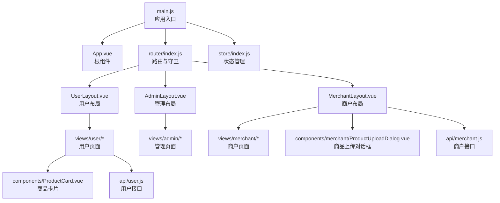
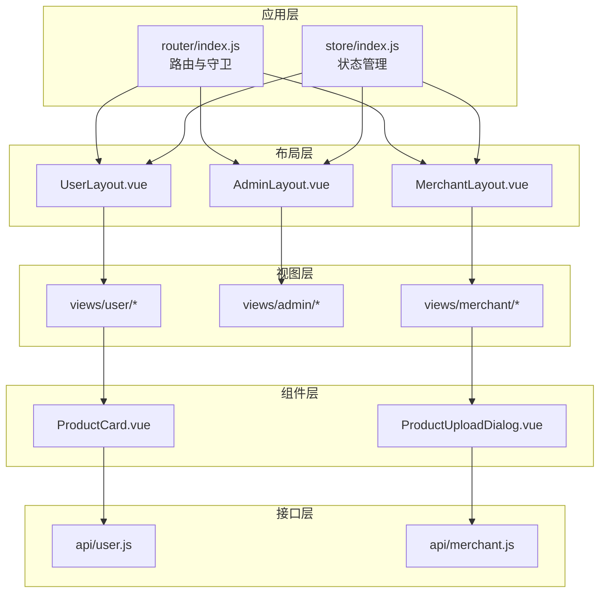
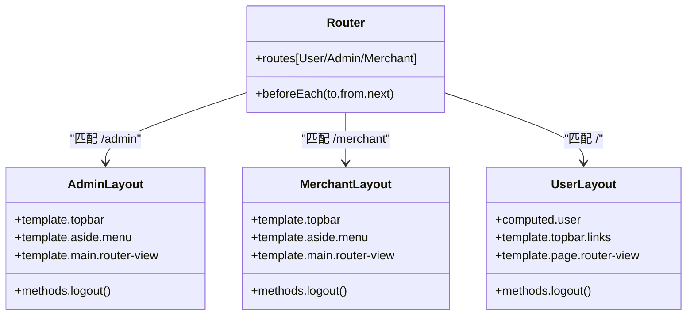
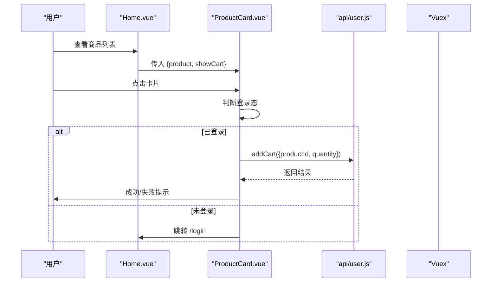
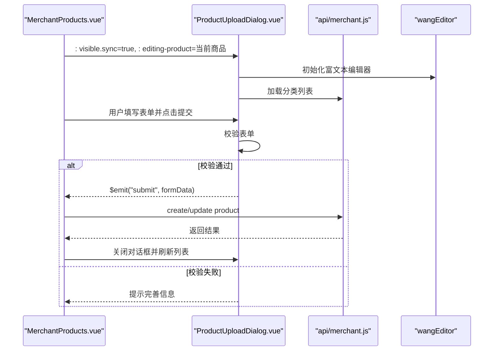
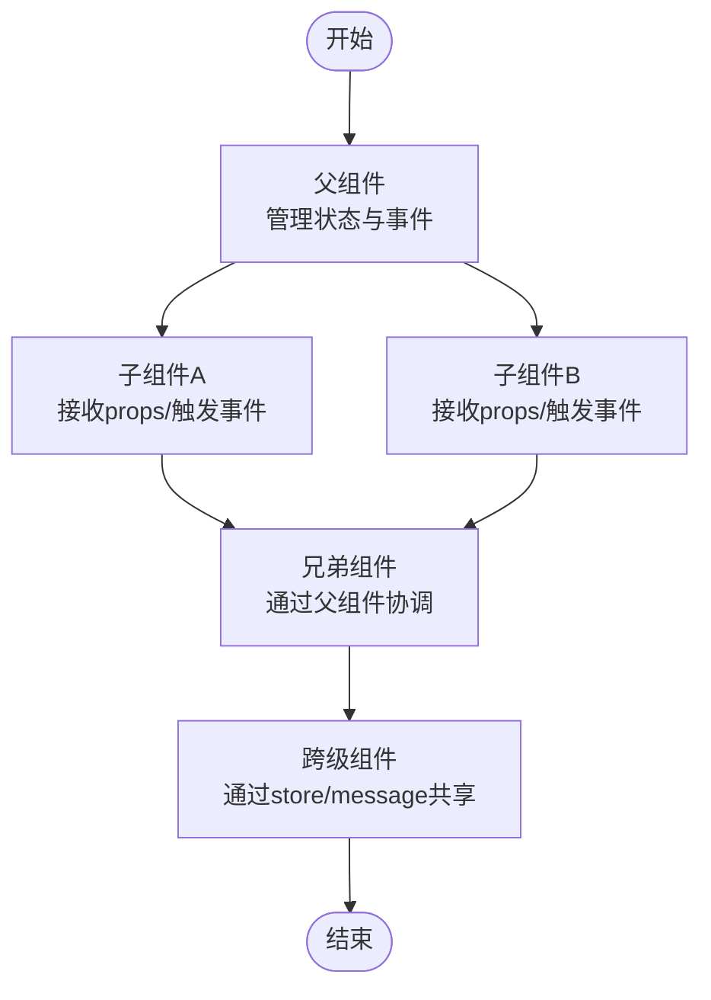
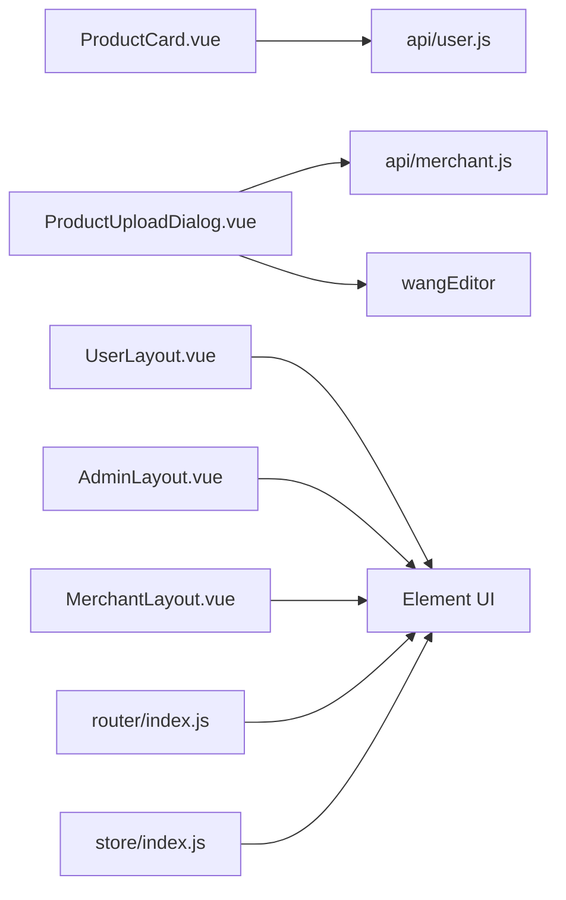

# 组件架构设计

<cite>
**本文档引用的文件**
- [frontend/src/main.js](file://frontend/src/main.js)
- [frontend/src/App.vue](file://frontend/src/App.vue)
- [frontend/src/router/index.js](file://frontend/src/router/index.js)
- [frontend/src/store/index.js](file://frontend/src/store/index.js)
- [frontend/package.json](file://frontend/package.json)
- [frontend/src/layouts/AdminLayout.vue](file://frontend/src/layouts/AdminLayout.vue)
- [frontend/src/layouts/MerchantLayout.vue](file://frontend/src/layouts/MerchantLayout.vue)
- [frontend/src/layouts/UserLayout.vue](file://frontend/src/layouts/UserLayout.vue)
- [frontend/src/components/ProductCard.vue](file://frontend/src/components/ProductCard.vue)
- [frontend/src/components/merchant/ProductUploadDialog.vue](file://frontend/src/components/merchant/ProductUploadDialog.vue)
- [frontend/src/views/user/Home.vue](file://frontend/src/views/user/Home.vue)
- [frontend/src/views/merchant/Products.vue](file://frontend/src/views/merchant/Products.vue)
- [frontend/src/views/admin/Dashboard.vue](file://frontend/src/views/admin/Dashboard.vue)
- [frontend/src/api/user.js](file://frontend/src/api/user.js)
- [frontend/src/api/merchant.js](file://frontend/src/api/merchant.js)
</cite>

## 目录
1. [引言](#引言)
2. [项目结构](#项目结构)
3. [核心组件](#核心组件)
4. [架构总览](#架构总览)
5. [详细组件分析](#详细组件分析)
6. [依赖关系分析](#依赖关系分析)
7. [性能考虑](#性能考虑)
8. [故障排查指南](#故障排查指南)
9. [结论](#结论)
10. [附录](#附录)

## 引言
本文件面向电商商城系统的前端组件架构，围绕 Vue.js 组件化设计理念，系统梳理布局组件（AdminLayout、MerchantLayout、UserLayout）与业务组件（ProductCard、ProductUploadDialog）的设计与实现，阐述 props 传递、事件处理、插槽使用、组件通信（父子、兄弟、跨级）等核心概念，并总结组件注册方式与全局配置策略，最后给出最佳实践与性能优化建议，帮助开发者构建高质量、可复用的组件体系。

## 项目结构
前端采用典型的单页应用（SPA）结构，基于 Vue 2 + Vue Router + Vuex + Element UI 技术栈组织代码。项目主要目录与职责如下：
- src/main.js：应用入口，注册 Element UI、挂载根实例，注入路由与状态管理。
- src/App.vue：根组件，承载路由出口 router-view。
- src/router/index.js：路由表与全局前置守卫，按角色划分用户、管理员、商户三类布局。
- src/store/index.js：Vuex 状态管理，集中存储用户登录态与本地持久化。
- src/layouts：三类布局组件，统一页面骨架与导航。
- src/components：通用业务组件，如商品卡片、商品上传对话框。
- src/views：页面视图，按角色划分用户、管理员、商户功能模块。
- src/api：接口封装，按用户、商户、公共模块拆分。

**图表来源**
- [frontend/src/main.js:1-20](file://frontend/src/main.js#L1-L20)
- [frontend/src/App.vue:1-18](file://frontend/src/App.vue#L1-L18)
- [frontend/src/router/index.js:1-208](file://frontend/src/router/index.js#L1-L208)
- [frontend/src/store/index.js:1-31](file://frontend/src/store/index.js#L1-L31)
- [frontend/src/layouts/AdminLayout.vue:1-129](file://frontend/src/layouts/AdminLayout.vue#L1-L129)
- [frontend/src/layouts/MerchantLayout.vue:1-127](file://frontend/src/layouts/MerchantLayout.vue#L1-L127)
- [frontend/src/layouts/UserLayout.vue:1-177](file://frontend/src/layouts/UserLayout.vue#L1-L177)
- [frontend/src/components/ProductCard.vue:1-261](file://frontend/src/components/ProductCard.vue#L1-L261)
- [frontend/src/components/merchant/ProductUploadDialog.vue:1-920](file://frontend/src/components/merchant/ProductUploadDialog.vue#L1-L920)
- [frontend/src/views/user/Home.vue:1-1679](file://frontend/src/views/user/Home.vue#L1-L1679)
- [frontend/src/views/merchant/Products.vue:1-400](file://frontend/src/views/merchant/Products.vue#L1-L400)
- [frontend/src/views/admin/Dashboard.vue:1-786](file://frontend/src/views/admin/Dashboard.vue#L1-L786)
- [frontend/src/api/user.js:1-162](file://frontend/src/api/user.js#L1-L162)
- [frontend/src/api/merchant.js:1-135](file://frontend/src/api/merchant.js#L1-L135)

**章节来源**
- [frontend/src/main.js:1-20](file://frontend/src/main.js#L1-L20)
- [frontend/src/router/index.js:1-208](file://frontend/src/router/index.js#L1-L208)
- [frontend/src/store/index.js:1-31](file://frontend/src/store/index.js#L1-L31)

## 核心组件
本节聚焦三类布局组件与两个关键业务组件，解释其职责、设计模式与复用策略。

- AdminLayout（管理后台布局）
  - 职责：提供管理端统一头部、侧边菜单与主内容区，内置登出逻辑。
  - 设计要点：通过 Element UI 的 el-menu 与 $route 同步实现导航高亮；通过 $store.dispatch 与 $router 控制登录态与跳转。
  - 复用策略：作为 /admin 路由的父级布局，子路由共享同一外观与交互。

- MerchantLayout（商户运营布局）
  - 职责：提供商户端统一头部、侧边菜单与主内容区，内置登出逻辑。
  - 设计要点：与管理布局类似，但菜单项针对商户功能域；同样通过 $store/$router 管理登录态。

- UserLayout（用户端布局）
  - 职责：提供用户端统一头部（品牌、导航链接、用户信息），主内容区承载页面。
  - 设计要点：通过计算属性读取 $store.state.user，展示昵称；提供登出跳转。

- ProductCard（商品卡片）
  - 职责：展示商品信息（图片、名称、描述、价格、销量），支持点击进入详情与加入购物车。
  - 设计要点：props 接收商品对象与是否显示“加入购物车”按钮；内部处理登录态判断与购物车 API 调用；点击卡片进入详情路由。

- ProductUploadDialog（商品上传/编辑对话框）
  - 职责：提供商品信息编辑、图片上传、富文本详情编辑、分类选择与提交流程。
  - 设计要点：通过 visible 与 editingProduct 控制显示与编辑态；内部维护表单数据、规则与富文本编辑器实例；通过 $emit 触发 submit/close 事件供父组件消费。

**章节来源**
- [frontend/src/layouts/AdminLayout.vue:1-129](file://frontend/src/layouts/AdminLayout.vue#L1-L129)
- [frontend/src/layouts/MerchantLayout.vue:1-127](file://frontend/src/layouts/MerchantLayout.vue#L1-L127)
- [frontend/src/layouts/UserLayout.vue:1-177](file://frontend/src/layouts/UserLayout.vue#L1-L177)
- [frontend/src/components/ProductCard.vue:1-261](file://frontend/src/components/ProductCard.vue#L1-L261)
- [frontend/src/components/merchant/ProductUploadDialog.vue:1-920](file://frontend/src/components/merchant/ProductUploadDialog.vue#L1-L920)

## 架构总览
系统采用“布局组件 + 页面视图 + 业务组件 + 接口模块”的分层架构。路由按角色划分，每个角色拥有独立布局；页面视图组合通用业务组件完成具体功能；接口模块按领域拆分，便于维护与扩展。

**图表来源**
- [frontend/src/router/index.js:1-208](file://frontend/src/router/index.js#L1-L208)
- [frontend/src/store/index.js:1-31](file://frontend/src/store/index.js#L1-L31)
- [frontend/src/layouts/AdminLayout.vue:1-129](file://frontend/src/layouts/AdminLayout.vue#L1-L129)
- [frontend/src/layouts/MerchantLayout.vue:1-127](file://frontend/src/layouts/MerchantLayout.vue#L1-L127)
- [frontend/src/layouts/UserLayout.vue:1-177](file://frontend/src/layouts/UserLayout.vue#L1-L177)
- [frontend/src/components/ProductCard.vue:1-261](file://frontend/src/components/ProductCard.vue#L1-L261)
- [frontend/src/components/merchant/ProductUploadDialog.vue:1-920](file://frontend/src/components/merchant/ProductUploadDialog.vue#L1-L920)
- [frontend/src/api/user.js:1-162](file://frontend/src/api/user.js#L1-L162)
- [frontend/src/api/merchant.js:1-135](file://frontend/src/api/merchant.js#L1-L135)

## 详细组件分析

### 布局组件设计模式与复用策略
- 设计模式
  - 组合模式：布局组件通过 <router-view> 组合不同页面视图，形成统一外观下的差异化内容。
  - 控制反转：登出、导航高亮等行为由布局组件统一处理，降低页面重复代码。
- 复用策略
  - 路由级复用：同一角色的多个页面共享对应布局，减少重复渲染与逻辑分散。
  - 统一主题：Element UI 的菜单与样式在布局内统一配置，确保视觉一致性。

**图表来源**
- [frontend/src/layouts/AdminLayout.vue:1-129](file://frontend/src/layouts/AdminLayout.vue#L1-L129)
- [frontend/src/layouts/MerchantLayout.vue:1-127](file://frontend/src/layouts/MerchantLayout.vue#L1-L127)
- [frontend/src/layouts/UserLayout.vue:1-177](file://frontend/src/layouts/UserLayout.vue#L1-L177)
- [frontend/src/router/index.js:1-208](file://frontend/src/router/index.js#L1-L208)

**章节来源**
- [frontend/src/layouts/AdminLayout.vue:1-129](file://frontend/src/layouts/AdminLayout.vue#L1-L129)
- [frontend/src/layouts/MerchantLayout.vue:1-127](file://frontend/src/layouts/MerchantLayout.vue#L1-L127)
- [frontend/src/layouts/UserLayout.vue:1-177](file://frontend/src/layouts/UserLayout.vue#L1-L177)
- [frontend/src/router/index.js:1-208](file://frontend/src/router/index.js#L1-L208)

### 业务组件封装思路与使用方法

#### ProductCard 组件
- Props 与行为
  - product：必填对象，承载商品基础信息。
  - showCart：可选布尔值，默认显示“加入购物车”按钮。
- 事件与交互
  - 点击卡片触发路由跳转至商品详情。
  - 点击“加入购物车”按钮前检查登录态，调用用户购物车接口并反馈消息。
- 使用示例
  - 在用户首页等列表页以 v-for 渲染，传入商品对象即可。

**图表来源**
- [frontend/src/views/user/Home.vue:1-1679](file://frontend/src/views/user/Home.vue#L1-L1679)
- [frontend/src/components/ProductCard.vue:1-261](file://frontend/src/components/ProductCard.vue#L1-L261)
- [frontend/src/api/user.js:1-162](file://frontend/src/api/user.js#L1-L162)
- [frontend/src/store/index.js:1-31](file://frontend/src/store/index.js#L1-L31)

**章节来源**
- [frontend/src/components/ProductCard.vue:1-261](file://frontend/src/components/ProductCard.vue#L1-L261)
- [frontend/src/views/user/Home.vue:1-1679](file://frontend/src/views/user/Home.vue#L1-L1679)
- [frontend/src/api/user.js:1-162](file://frontend/src/api/user.js#L1-L162)
- [frontend/src/store/index.js:1-31](file://frontend/src/store/index.js#L1-L31)

#### ProductUploadDialog 组件
- Props 与状态
  - visible：控制对话框显示/隐藏。
  - editingProduct：编辑态传入的商品数据。
- 表单与校验
  - 内置表单字段与校验规则，支持分类选择、富文本详情、主图与详情图上传。
- 图片上传与富文本
  - 主图与详情图分别处理上传与预览；富文本编辑器集成自定义上传逻辑，支持多图批量上传与进度反馈。
- 提交流程
  - 校验通过后，通过 $emit("submit", data) 将表单数据回传给父组件；关闭时重置表单并销毁编辑器。

**图表来源**
- [frontend/src/views/merchant/Products.vue:1-400](file://frontend/src/views/merchant/Products.vue#L1-L400)
- [frontend/src/components/merchant/ProductUploadDialog.vue:1-920](file://frontend/src/components/merchant/ProductUploadDialog.vue#L1-L920)
- [frontend/src/api/merchant.js:1-135](file://frontend/src/api/merchant.js#L1-L135)

**章节来源**
- [frontend/src/components/merchant/ProductUploadDialog.vue:1-920](file://frontend/src/components/merchant/ProductUploadDialog.vue#L1-L920)
- [frontend/src/views/merchant/Products.vue:1-400](file://frontend/src/views/merchant/Products.vue#L1-L400)
- [frontend/src/api/merchant.js:1-135](file://frontend/src/api/merchant.js#L1-L135)

### 组件通信机制
- 父子组件通信
  - ProductCard 与 Home：Home 通过 props 传递商品数据；ProductCard 通过 $emit 或路由/状态管理与父组件间接通信。
  - ProductUploadDialog 与 MerchantProducts：通过 props 控制显示与编辑态；通过 $emit("submit"/"close") 与父组件通信。
- 兄弟组件通信
  - 通过共同父组件进行事件传递与状态同步，避免直接跨层级耦合。
- 跨级组件通信
  - 登录态与全局提示：通过 $store.state.user 与 Element UI 的 $message 实现跨组件共享与提示。

[此图为概念性流程图，不直接映射具体源码文件]

## 依赖关系分析
- 组件依赖
  - ProductCard 依赖 api/user.js 与 Element UI 组件库。
  - ProductUploadDialog 依赖 api/merchant.js、wangEditor、Element UI。
  - 布局组件依赖 Element UI 的菜单与按钮组件。
- 外部依赖
  - Element UI：提供 UI 组件与样式。
  - Vue Router：提供路由与导航。
  - Vuex：提供全局状态与持久化。
  - Axios：用于 HTTP 请求（通过封装的 request 模块）。

**图表来源**
- [frontend/src/components/ProductCard.vue:1-261](file://frontend/src/components/ProductCard.vue#L1-L261)
- [frontend/src/components/merchant/ProductUploadDialog.vue:1-920](file://frontend/src/components/merchant/ProductUploadDialog.vue#L1-L920)
- [frontend/src/api/user.js:1-162](file://frontend/src/api/user.js#L1-L162)
- [frontend/src/api/merchant.js:1-135](file://frontend/src/api/merchant.js#L1-L135)
- [frontend/src/layouts/AdminLayout.vue:1-129](file://frontend/src/layouts/AdminLayout.vue#L1-L129)
- [frontend/src/layouts/MerchantLayout.vue:1-127](file://frontend/src/layouts/MerchantLayout.vue#L1-L127)
- [frontend/src/layouts/UserLayout.vue:1-177](file://frontend/src/layouts/UserLayout.vue#L1-L177)
- [frontend/src/router/index.js:1-208](file://frontend/src/router/index.js#L1-L208)
- [frontend/src/store/index.js:1-31](file://frontend/src/store/index.js#L1-L31)

**章节来源**
- [frontend/package.json:1-24](file://frontend/package.json#L1-L24)

## 性能考虑
- 组件懒加载
  - 路由层面使用动态导入，减少首屏体积与初次渲染时间。
- 图片与资源
  - 商品卡片中的图片采用占位符与缩略图策略，避免大图阻塞渲染。
- 表单与富文本
  - 富文本编辑器仅在对话框打开时初始化，销毁时释放内存，避免长期占用。
- 状态与缓存
  - 登录态与用户信息存储于 localStorage，结合 Vuex 管理，减少重复请求。
- 动画与交互
  - 合理使用过渡动画与防抖，避免频繁重排与重绘。

[本节为通用性能建议，不直接分析具体文件]

## 故障排查指南
- 登录态失效
  - 现象：点击“加入购物车”或“编辑商品”被重定向至登录页。
  - 排查：检查 localStorage 中 user/token 是否存在；查看路由守卫逻辑与 $store.state.user。
- 图片上传失败
  - 现象：主图/详情图上传提示失败或进度异常。
  - 排查：确认上传接口可用、Authorization 头是否正确携带；检查富文本编辑器自定义上传逻辑与返回格式。
- 表单校验不生效
  - 现象：提交时未提示必填项或校验规则未触发。
  - 排查：确认 rules 定义与 el-form-item 的 prop 对应；检查 visible/watch 逻辑是否在打开时初始化表单。

**章节来源**
- [frontend/src/router/index.js:182-205](file://frontend/src/router/index.js#L182-L205)
- [frontend/src/store/index.js:1-31](file://frontend/src/store/index.js#L1-L31)
- [frontend/src/components/merchant/ProductUploadDialog.vue:370-430](file://frontend/src/components/merchant/ProductUploadDialog.vue#L370-L430)
- [frontend/src/views/merchant/Products.vue:180-225](file://frontend/src/views/merchant/Products.vue#L180-L225)

## 结论
本项目通过清晰的角色化布局与通用业务组件，实现了高内聚、低耦合的前端架构。借助路由守卫与全局状态管理，组件间通信简洁可靠；通过懒加载与资源优化，兼顾了性能与体验。建议在后续迭代中进一步完善组件文档与测试覆盖，持续优化交互细节与错误处理。

## 附录
- 组件注册与全局配置
  - Element UI：在 main.js 中通过 Vue.use(ElementUI) 全局注册。
  - 根实例：在 main.js 中注入 router 与 store，挂载 App 根组件。
- 最佳实践
  - 明确 props 类型与默认值，严格遵循单向数据流。
  - 使用事件命名规范（如 update:visible、submit），保持父子通信清晰。
  - 对复杂表单与富文本场景，采用延迟初始化与及时销毁，降低内存占用。
  - 对高频交互（如轮播、搜索）增加防抖与节流，提升流畅度。

**章节来源**
- [frontend/src/main.js:1-20](file://frontend/src/main.js#L1-L20)
- [frontend/src/App.vue:1-18](file://frontend/src/App.vue#L1-L18)
- [frontend/src/router/index.js:1-208](file://frontend/src/router/index.js#L1-L208)
- [frontend/src/store/index.js:1-31](file://frontend/src/store/index.js#L1-L31)