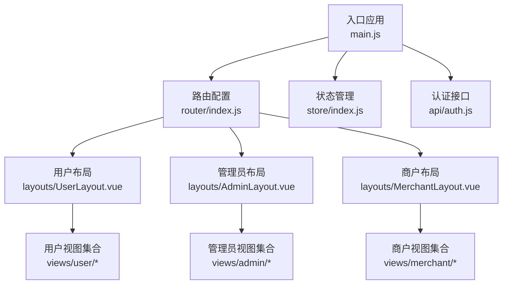
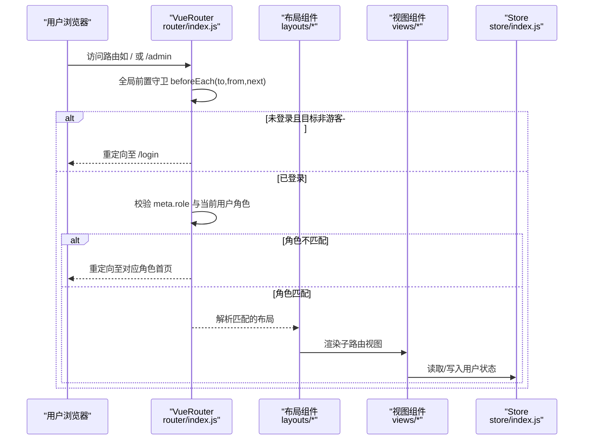
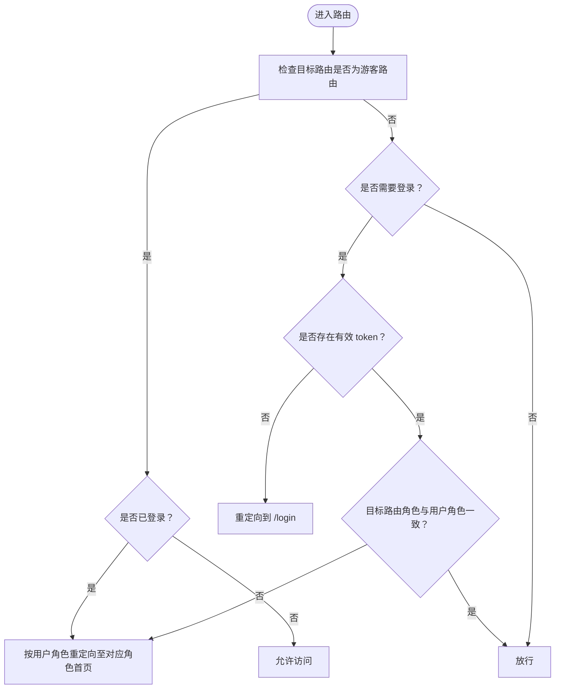
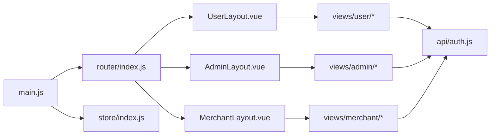

# 路由与导航

<cite>
**本文引用的文件**
- [frontend/src/router/index.js](file://frontend/src/router/index.js)
- [frontend/src/main.js](file://frontend/src/main.js)
- [frontend/src/layouts/UserLayout.vue](file://frontend/src/layouts/UserLayout.vue)
- [frontend/src/layouts/AdminLayout.vue](file://frontend/src/layouts/AdminLayout.vue)
- [frontend/src/layouts/MerchantLayout.vue](file://frontend/src/layouts/MerchantLayout.vue)
- [frontend/src/views/user/Home.vue](file://frontend/src/views/user/Home.vue)
- [frontend/src/views/admin/Dashboard.vue](file://frontend/src/views/admin/Dashboard.vue)
- [frontend/src/views/merchant/Dashboard.vue](file://frontend/src/views/merchant/Dashboard.vue)
- [frontend/src/store/index.js](file://frontend/src/store/index.js)
- [frontend/src/api/auth.js](file://frontend/src/api/auth.js)
- [frontend/package.json](file://frontend/package.json)
- [frontend/vue.config.js](file://frontend/vue.config.js)
</cite>

## 目录
1. [简介](#简介)
2. [项目结构](#项目结构)
3. [核心组件](#核心组件)
4. [架构总览](#架构总览)
5. [详细组件分析](#详细组件分析)
6. [依赖关系分析](#依赖关系分析)
7. [性能考量](#性能考量)
8. [故障排查指南](#故障排查指南)
9. [结论](#结论)
10. [附录](#附录)

## 简介
本文件面向电商商城系统的前端路由与导航，围绕 Vue Router 的配置与使用进行系统化技术文档编写。重点覆盖以下方面：
- 路由定义与嵌套路由设计
- 动态路由参数与路径匹配策略
- 导航守卫的实现与应用场景（全局前置守卫、路由独享守卫、组件内守卫）
- 权限控制机制与多角色导航最佳实践
- 路由懒加载、路由元信息、面包屑导航等高级特性
- 性能优化、SEO 友好性与调试技巧

## 项目结构
前端采用基于角色的路由分层组织方式，通过不同布局组件承载用户、管理员、商户三类角色的导航与页面渲染。

**图表来源**
- [frontend/src/main.js:1-20](file://frontend/src/main.js#L1-L20)
- [frontend/src/router/index.js:1-208](file://frontend/src/router/index.js#L1-L208)
- [frontend/src/layouts/UserLayout.vue:1-177](file://frontend/src/layouts/UserLayout.vue#L1-L177)
- [frontend/src/layouts/AdminLayout.vue:1-129](file://frontend/src/layouts/AdminLayout.vue#L1-L129)
- [frontend/src/layouts/MerchantLayout.vue:1-127](file://frontend/src/layouts/MerchantLayout.vue#L1-L127)
- [frontend/src/store/index.js:1-31](file://frontend/src/store/index.js#L1-L31)
- [frontend/src/api/auth.js:1-26](file://frontend/src/api/auth.js#L1-L26)

**章节来源**
- [frontend/src/main.js:1-20](file://frontend/src/main.js#L1-L20)
- [frontend/src/router/index.js:1-208](file://frontend/src/router/index.js#L1-L208)

## 核心组件
- 路由表与导航守卫
  - 路由表按角色划分，采用嵌套路由组织子页面，支持动态路由参数与重定向。
  - 全局前置守卫负责登录态校验与角色权限拦截，确保仅授权用户可访问对应角色的路由。
- 布局组件
  - UserLayout：提供用户端主导航与头部信息，支持登出与路由跳转。
  - AdminLayout：左侧菜单导航，基于 Element UI 的 el-menu 组件实现角色专属菜单项。
  - MerchantLayout：左侧菜单导航，适配商户运营场景。
- 视图组件
  - 用户首页、管理员仪表盘、商户仪表盘等，展示路由与布局的协同工作。
- 状态管理与认证
  - Store 统一维护用户登录态与本地持久化；认证接口封装登录/注册请求。

**章节来源**
- [frontend/src/router/index.js:6-174](file://frontend/src/router/index.js#L6-L174)
- [frontend/src/router/index.js:182-205](file://frontend/src/router/index.js#L182-L205)
- [frontend/src/layouts/UserLayout.vue:1-177](file://frontend/src/layouts/UserLayout.vue#L1-L177)
- [frontend/src/layouts/AdminLayout.vue:1-129](file://frontend/src/layouts/AdminLayout.vue#L1-L129)
- [frontend/src/layouts/MerchantLayout.vue:1-127](file://frontend/src/layouts/MerchantLayout.vue#L1-L127)
- [frontend/src/views/user/Home.vue:1-800](file://frontend/src/views/user/Home.vue#L1-L800)
- [frontend/src/views/admin/Dashboard.vue:1-786](file://frontend/src/views/admin/Dashboard.vue#L1-L786)
- [frontend/src/views/merchant/Dashboard.vue:1-137](file://frontend/src/views/merchant/Dashboard.vue#L1-L137)
- [frontend/src/store/index.js:1-31](file://frontend/src/store/index.js#L1-L31)
- [frontend/src/api/auth.js:1-26](file://frontend/src/api/auth.js#L1-L26)

## 架构总览
路由与导航的整体架构如下：

**图表来源**
- [frontend/src/router/index.js:182-205](file://frontend/src/router/index.js#L182-L205)
- [frontend/src/layouts/UserLayout.vue:1-177](file://frontend/src/layouts/UserLayout.vue#L1-L177)
- [frontend/src/layouts/AdminLayout.vue:1-129](file://frontend/src/layouts/AdminLayout.vue#L1-L129)
- [frontend/src/layouts/MerchantLayout.vue:1-127](file://frontend/src/layouts/MerchantLayout.vue#L1-L127)
- [frontend/src/store/index.js:1-31](file://frontend/src/store/index.js#L1-L31)

## 详细组件分析

### 路由表与嵌套路由
- 路由表按角色拆分：
  - 用户端：根路径 "/" 对应 UserLayout，子路由覆盖首页、商品列表、详情、购物车、收藏、订单、个人中心、资讯等。
  - 管理员：前缀 "/admin" 对应 AdminLayout，子路由覆盖仪表盘、用户管理、商户管理、分类管理、订单管理、资讯管理、评价管理等。
  - 商户：前缀 "/merchant" 对应 MerchantLayout，子路由覆盖仪表盘、商品管理、库存管理、评价管理、订单管理等。
- 嵌套路由与动态参数：
  - 商品详情与分类详情使用动态参数，如 ":id"，便于在不同角色下复用详情页逻辑。
  - 重定向示例："/announcements" 重定向到 "/news"，避免重复路由。
- 路由懒加载：
  - 所有视图组件均通过函数形式导入，实现按需加载，降低首屏体积。

**章节来源**
- [frontend/src/router/index.js:6-174](file://frontend/src/router/index.js#L6-L174)

### 导航守卫实现
- 全局前置守卫（beforeEach）：
  - 游客策略：当目标路由标记为 guest 且已登录时，依据用户角色重定向至对应角色首页。
  - 登录态校验：若未携带有效 token，则强制跳转至登录页。
  - 角色权限校验：若目标路由 meta.role 与当前用户角色不一致，则重定向至对应角色首页。
- 路由独享守卫与组件内守卫：
  - 当前代码未使用路由独享守卫与组件内守卫，可在特定页面（如敏感操作）按需扩展。

**图表来源**
- [frontend/src/router/index.js:182-205](file://frontend/src/router/index.js#L182-L205)

**章节来源**
- [frontend/src/router/index.js:182-205](file://frontend/src/router/index.js#L182-L205)

### 权限控制与多角色导航
- 角色标识与路由元信息：
  - 路由 meta 中通过 role 字段标识可访问角色，如 "USER"、"ADMIN"、"MERCHANT"。
  - 登录页 meta.guest 标识允许未登录访问。
- 登录态与角色联动：
  - 登录成功后，Store 写入用户信息并持久化 token；随后根据角色跳转至对应角色首页。
  - 布局组件提供统一登出入口，登出后回到登录页。
- 最佳实践建议：
  - 在服务端配合 RBAC 控制接口级权限，前端仅做 UI 层引导与部分可见性控制。
  - 对高敏感页面增加组件内守卫或路由独享守卫，结合后端鉴权二次确认。

**章节来源**
- [frontend/src/router/index.js:10-13](file://frontend/src/router/index.js#L10-L13)
- [frontend/src/router/index.js:176-179](file://frontend/src/router/index.js#L176-L179)
- [frontend/src/router/index.js:182-205](file://frontend/src/router/index.js#L182-L205)
- [frontend/src/store/index.js:1-31](file://frontend/src/store/index.js#L1-L31)
- [frontend/src/api/auth.js:1-26](file://frontend/src/api/auth.js#L1-L26)

### 路由懒加载与性能优化
- 懒加载策略：
  - 所有视图组件通过函数导入，实现按需加载，减少初始包体。
- 性能优化建议：
  - 使用路由级代码分割，结合 webpack 的魔法注释进一步拆分 chunk。
  - 预加载关键路由（如用户首页），对非关键路由采用延迟加载。
  - 合理使用 keep-alive 缓存跨页切换频繁的视图，降低重复渲染成本。

**章节来源**
- [frontend/src/router/index.js:11-11](file://frontend/src/router/index.js#L11-L11)
- [frontend/src/views/user/Home.vue:580-582](file://frontend/src/views/user/Home.vue#L580-L582)

### 路由元信息与面包屑导航
- 路由元信息：
  - meta.guest：用于登录页，允许未登录访问。
  - meta.role：用于角色路由，限制访问角色。
- 面包屑导航：
  - 当前代码未实现通用面包屑组件，可在布局或路由元信息中扩展，结合路由路径生成层级导航。

**章节来源**
- [frontend/src/router/index.js:12-12](file://frontend/src/router/index.js#L12-L12)
- [frontend/src/router/index.js:176-179](file://frontend/src/router/index.js#L176-L179)

### SEO 友好性与调试
- SEO 友好性：
  - 当前使用 hash 模式，利于静态部署；如需更优 SEO，可切换 history 模式并在后端配置回退。
- 调试技巧：
  - 使用浏览器开发者工具 Network 面板观察路由懒加载资源加载时机。
  - 在 beforeEach 中输出 to/from 路由信息，辅助定位权限问题。
  - 结合 Vue Devtools 观察路由与状态变化。

**章节来源**
- [frontend/src/router/index.js:176-179](file://frontend/src/router/index.js#L176-L179)
- [frontend/vue.config.js:1-20](file://frontend/vue.config.js#L1-L20)

## 依赖关系分析
- 组件耦合与职责分离：
  - main.js 仅挂载应用并注入 router 与 store，保持入口简洁。
  - router/index.js 聚合路由定义与守卫，职责清晰。
  - 布局组件仅负责导航与容器渲染，业务逻辑下沉至视图组件。
- 外部依赖：
  - Element UI 提供菜单与表单组件，提升导航与交互体验。
  - ECharts 用于管理员与商户仪表盘的数据可视化。

**图表来源**
- [frontend/src/main.js:1-20](file://frontend/src/main.js#L1-L20)
- [frontend/src/router/index.js:1-208](file://frontend/src/router/index.js#L1-L208)
- [frontend/src/layouts/UserLayout.vue:1-177](file://frontend/src/layouts/UserLayout.vue#L1-L177)
- [frontend/src/layouts/AdminLayout.vue:1-129](file://frontend/src/layouts/AdminLayout.vue#L1-L129)
- [frontend/src/layouts/MerchantLayout.vue:1-127](file://frontend/src/layouts/MerchantLayout.vue#L1-L127)
- [frontend/src/store/index.js:1-31](file://frontend/src/store/index.js#L1-L31)
- [frontend/src/api/auth.js:1-26](file://frontend/src/api/auth.js#L1-L26)

**章节来源**
- [frontend/src/main.js:1-20](file://frontend/src/main.js#L1-L20)
- [frontend/src/router/index.js:1-208](file://frontend/src/router/index.js#L1-L208)
- [frontend/src/layouts/UserLayout.vue:1-177](file://frontend/src/layouts/UserLayout.vue#L1-L177)
- [frontend/src/layouts/AdminLayout.vue:1-129](file://frontend/src/layouts/AdminLayout.vue#L1-L129)
- [frontend/src/layouts/MerchantLayout.vue:1-127](file://frontend/src/layouts/MerchantLayout.vue#L1-L127)
- [frontend/src/store/index.js:1-31](file://frontend/src/store/index.js#L1-L31)
- [frontend/src/api/auth.js:1-26](file://frontend/src/api/auth.js#L1-L26)

## 性能考量
- 路由懒加载与代码分割：已通过函数导入实现，建议结合路由命名与 webpack 配置进一步优化打包体积。
- 视图组件缓存：对高频切换页面（如首页、商品列表）可结合 keep-alive 缓存，减少重复渲染。
- 图表组件按需初始化：ECharts 在组件销毁时释放资源，避免内存泄漏。
- 网络代理与开发体验：开发服务器通过代理转发 /api、/pub、/images 请求，提升联调效率。

**章节来源**
- [frontend/src/router/index.js:11-11](file://frontend/src/router/index.js#L11-L11)
- [frontend/src/views/admin/Dashboard.vue:148-524](file://frontend/src/views/admin/Dashboard.vue#L148-L524)
- [frontend/vue.config.js:1-20](file://frontend/vue.config.js#L1-L20)

## 故障排查指南
- 登录后无法跳转到对应角色页面
  - 检查登录接口返回的角色与选择角色是否一致，以及 Store 是否正确写入用户信息。
- 已登录仍被重定向到 /login
  - 检查本地存储中的 token 是否存在，守卫逻辑是否正确判断。
- 角色间互相访问
  - 检查 meta.role 与用户角色是否一致，必要时在路由守卫中增加日志输出。
- 布局菜单不生效
  - 确认 el-menu 的 index 与路由 path 一致，并检查 $route.path 的绑定。

**章节来源**
- [frontend/src/router/index.js:182-205](file://frontend/src/router/index.js#L182-L205)
- [frontend/src/store/index.js:1-31](file://frontend/src/store/index.js#L1-L31)
- [frontend/src/layouts/AdminLayout.vue:21-29](file://frontend/src/layouts/AdminLayout.vue#L21-L29)
- [frontend/src/layouts/MerchantLayout.vue:21-27](file://frontend/src/layouts/MerchantLayout.vue#L21-L27)

## 结论
该电商商城前端采用清晰的角色化路由体系，结合全局前置守卫实现了基础的权限控制与导航分流。通过路由懒加载与布局组件化，兼顾了性能与可维护性。建议后续在以下方面持续优化：
- 引入路由独享守卫与组件内守卫，强化敏感页面的安全控制。
- 扩展通用面包屑组件，提升用户体验。
- 在后端完善 RBAC 接口权限，前端仅作 UI 引导。
- 如需更强 SEO，评估切换 history 模式并配置服务端回退。

## 附录
- 开发与构建
  - 依赖版本与脚本见 package.json。
  - 开发服务器端口与代理配置见 vue.config.js。

**章节来源**
- [frontend/package.json:1-24](file://frontend/package.json#L1-L24)
- [frontend/vue.config.js:1-20](file://frontend/vue.config.js#L1-L20)