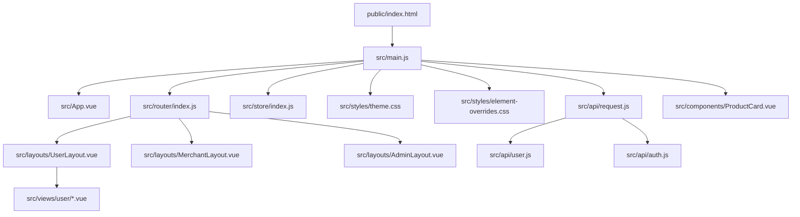
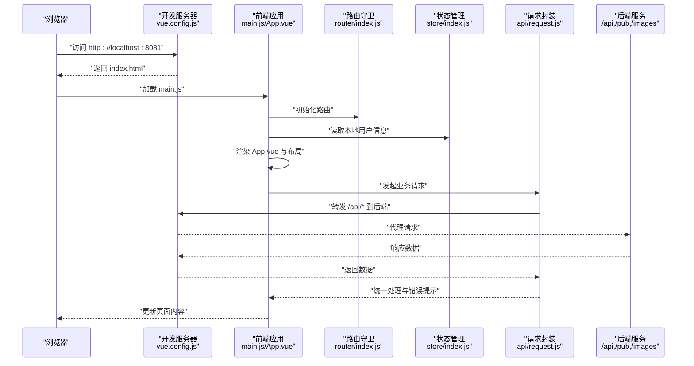
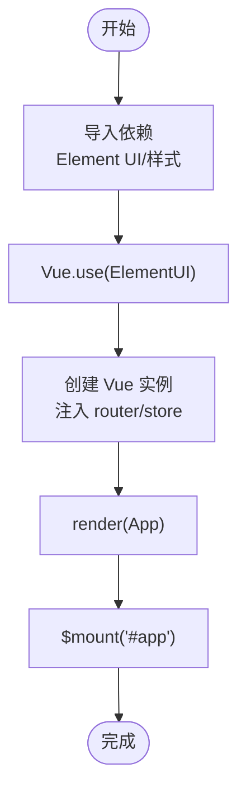
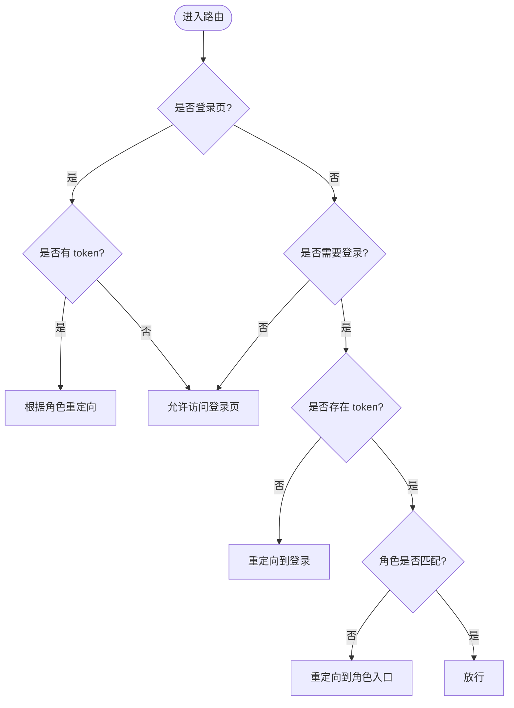
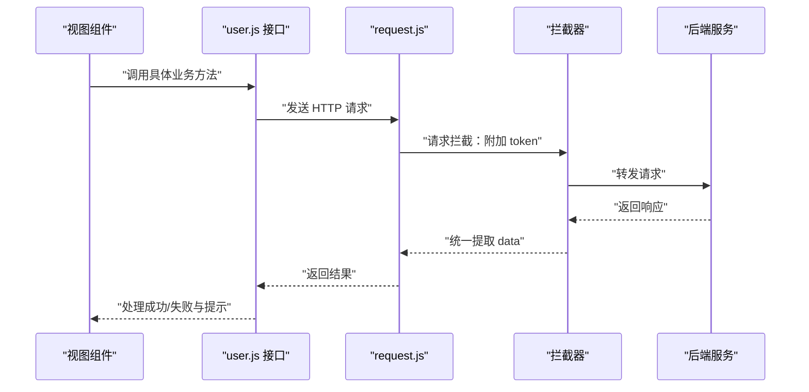
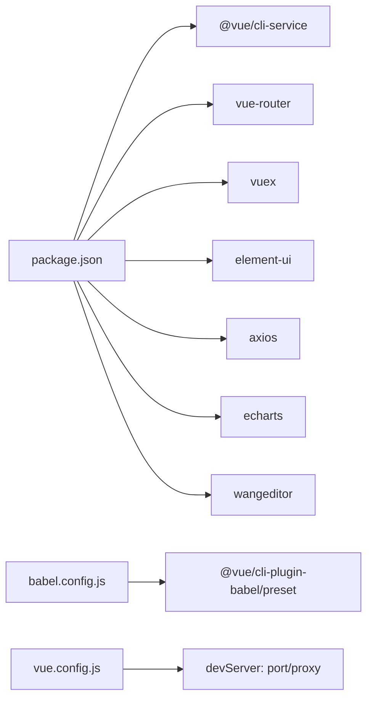

# 项目结构与配置

<cite>
**本文引用的文件**
- [frontend/src/main.js](file://frontend/src/main.js)
- [frontend/src/App.vue](file://frontend/src/App.vue)
- [frontend/public/index.html](file://frontend/public/index.html)
- [frontend/vue.config.js](file://frontend/vue.config.js)
- [frontend/package.json](file://frontend/package.json)
- [frontend/babel.config.js](file://frontend/babel.config.js)
- [frontend/src/router/index.js](file://frontend/src/router/index.js)
- [frontend/src/store/index.js](file://frontend/src/store/index.js)
- [frontend/src/styles/theme.css](file://frontend/src/styles/theme.css)
- [frontend/src/styles/element-overrides.css](file://frontend/src/styles/element-overrides.css)
- [frontend/src/layouts/UserLayout.vue](file://frontend/src/layouts/UserLayout.vue)
- [frontend/src/components/ProductCard.vue](file://frontend/src/components/ProductCard.vue)
- [frontend/src/api/request.js](file://frontend/src/api/request.js)
- [frontend/src/api/user.js](file://frontend/src/api/user.js)
- [frontend/src/api/auth.js](file://frontend/src/api/auth.js)
</cite>

## 目录
1. [简介](#简介)
2. [项目结构](#项目结构)
3. [核心组件](#核心组件)
4. [架构总览](#架构总览)
5. [详细组件分析](#详细组件分析)
6. [依赖关系分析](#依赖关系分析)
7. [性能考虑](#性能考虑)
8. [故障排查指南](#故障排查指南)
9. [结论](#结论)
10. [附录](#附录)

## 简介
本文件面向电商商城系统的前端项目，系统基于 Vue 2 生态（Vue、Vue Router、Vuex、Element UI），采用模块化目录组织与主题化样式体系，结合 axios 封装实现统一的请求拦截与鉴权逻辑。本文档从入口初始化、路由与状态管理、样式主题与UI覆盖、API封装与调用、构建与开发配置等方面进行深入解析，并提供启动流程、开发与生产优化建议及最佳实践。

## 项目结构
前端项目位于 frontend 目录，采用“源码在 src、静态资源在 public”的标准结构。核心目录与职责如下：
- public：静态资源与入口 HTML
- src：
  - api：接口封装与 axios 实例
  - components：可复用组件
  - layouts：页面布局（用户/商户/管理后台）
  - router：路由定义与全局守卫
  - store：状态管理
  - styles：主题变量与 Element UI 样式覆盖
  - views：页面视图
  - App.vue：根组件
  - main.js：应用入口

**图表来源**
- [frontend/public/index.html:1-12](file://frontend/public/index.html#L1-L12)
- [frontend/src/main.js:1-20](file://frontend/src/main.js#L1-L20)
- [frontend/src/App.vue:1-18](file://frontend/src/App.vue#L1-L18)
- [frontend/src/router/index.js:1-208](file://frontend/src/router/index.js#L1-L208)
- [frontend/src/store/index.js:1-31](file://frontend/src/store/index.js#L1-L31)
- [frontend/src/styles/theme.css:1-209](file://frontend/src/styles/theme.css#L1-L209)
- [frontend/src/styles/element-overrides.css:1-210](file://frontend/src/styles/element-overrides.css#L1-L210)
- [frontend/src/layouts/UserLayout.vue:1-177](file://frontend/src/layouts/UserLayout.vue#L1-L177)
- [frontend/src/api/request.js:1-38](file://frontend/src/api/request.js#L1-L38)
- [frontend/src/api/user.js:1-162](file://frontend/src/api/user.js#L1-L162)
- [frontend/src/api/auth.js:1-26](file://frontend/src/api/auth.js#L1-L26)
- [frontend/src/components/ProductCard.vue:1-261](file://frontend/src/components/ProductCard.vue#L1-L261)

**章节来源**
- [frontend/public/index.html:1-12](file://frontend/public/index.html#L1-L12)
- [frontend/src/main.js:1-20](file://frontend/src/main.js#L1-L20)
- [frontend/src/App.vue:1-18](file://frontend/src/App.vue#L1-L18)

## 核心组件
- 应用入口 main.js：引入 Element UI、全局样式、挂载根实例，注入路由与状态管理。
- 根组件 App.vue：最外层容器，渲染 router-view。
- 路由 router/index.js：按角色划分用户/商户/管理后台三套布局与页面，使用 hash 模式与全局前置守卫进行登录态与角色校验。
- 状态 store/index.js：集中存储用户信息与 token，提供登录/登出动作。
- 主题样式 theme.css 与 Element 覆盖 element-overrides.css：通过 CSS 变量统一品牌色与组件风格。
- 布局 UserLayout.vue：用户端顶部导航、面包屑与页面内容区域。
- 组件 ProductCard.vue：商品卡片展示与加入购物车交互。
- API 层 request.js：axios 实例封装、请求头注入与鉴权失败处理；user.js、auth.js 提供业务接口方法。

**章节来源**
- [frontend/src/main.js:1-20](file://frontend/src/main.js#L1-L20)
- [frontend/src/App.vue:1-18](file://frontend/src/App.vue#L1-L18)
- [frontend/src/router/index.js:1-208](file://frontend/src/router/index.js#L1-L208)
- [frontend/src/store/index.js:1-31](file://frontend/src/store/index.js#L1-L31)
- [frontend/src/styles/theme.css:1-209](file://frontend/src/styles/theme.css#L1-L209)
- [frontend/src/styles/element-overrides.css:1-210](file://frontend/src/styles/element-overrides.css#L1-L210)
- [frontend/src/layouts/UserLayout.vue:1-177](file://frontend/src/layouts/UserLayout.vue#L1-L177)
- [frontend/src/components/ProductCard.vue:1-261](file://frontend/src/components/ProductCard.vue#L1-L261)
- [frontend/src/api/request.js:1-38](file://frontend/src/api/request.js#L1-L38)
- [frontend/src/api/user.js:1-162](file://frontend/src/api/user.js#L1-L162)
- [frontend/src/api/auth.js:1-26](file://frontend/src/api/auth.js#L1-L26)

## 架构总览
下图展示了从前端入口到后端服务的整体交互路径，包括开发代理、鉴权拦截与页面渲染。

**图表来源**
- [frontend/vue.config.js:1-20](file://frontend/vue.config.js#L1-L20)
- [frontend/src/main.js:1-20](file://frontend/src/main.js#L1-L20)
- [frontend/src/App.vue:1-18](file://frontend/src/App.vue#L1-L18)
- [frontend/src/router/index.js:182-205](file://frontend/src/router/index.js#L182-L205)
- [frontend/src/store/index.js:1-31](file://frontend/src/store/index.js#L1-L31)
- [frontend/src/api/request.js:1-38](file://frontend/src/api/request.js#L1-L38)

## 详细组件分析

### 入口与初始化流程（main.js）
- 引入 Element UI 及其样式、自定义主题与覆盖样式
- 关闭生产提示，避免控制台告警
- 创建 Vue 实例，注入 router、store，渲染 App 根组件并挂载到 #app

**图表来源**
- [frontend/src/main.js:1-20](file://frontend/src/main.js#L1-L20)

**章节来源**
- [frontend/src/main.js:1-20](file://frontend/src/main.js#L1-L20)
- [frontend/public/index.html:1-12](file://frontend/public/index.html#L1-L12)

### 根组件设计（App.vue）
- 最小化模板，仅包含一个 router-view 占位
- 全局样式重置与基础排版，确保最小高度与字体一致性

**章节来源**
- [frontend/src/App.vue:1-18](file://frontend/src/App.vue#L1-L18)

### 路由与权限（router/index.js）
- 三类角色路由：
  - 用户端：首页、商品、购物车、收藏、订单、个人中心、新闻等
  - 商户端：仪表盘、商品、库存、评价、订单等
  - 管理后台：用户、商户、分类、订单、新闻、评价等
- 使用 hash 模式与动态导入懒加载
- 全局前置守卫：
  - 登录页白名单校验
  - 未登录强制跳转登录
  - 角色不匹配时重定向至对应入口

**图表来源**
- [frontend/src/router/index.js:182-205](file://frontend/src/router/index.js#L182-L205)

**章节来源**
- [frontend/src/router/index.js:1-208](file://frontend/src/router/index.js#L1-L208)

### 状态管理（store/index.js）
- 状态：用户对象与 token 存储于 localStorage
- 动作：login/logout 通过 mutation 同步更新状态与本地存储

**章节来源**
- [frontend/src/store/index.js:1-31](file://frontend/src/store/index.js#L1-L31)

### 样式体系（theme.css 与 element-overrides.css）
- theme.css：定义 CSS 变量（背景、表面、边框、文本、品牌主色、阴影、圆角、容器宽度等），统一全局基础样式与页面容器
- element-overrides.css：覆盖 Element UI 组件的圆角、阴影、按钮渐变、输入框聚焦态、表格悬停、菜单激活态、分页选中态等，形成一致的品牌风格

**章节来源**
- [frontend/src/styles/theme.css:1-209](file://frontend/src/styles/theme.css#L1-L209)
- [frontend/src/styles/element-overrides.css:1-210](file://frontend/src/styles/element-overrides.css#L1-L210)

### 布局组件（UserLayout.vue）
- 顶部栏：品牌标识、主导航链接、用户昵称徽章与退出按钮
- 页面主体：router-view 占位，承载各页面视图
- 与 store 集成：读取用户信息、触发登出并跳转登录

**章节来源**
- [frontend/src/layouts/UserLayout.vue:1-177](file://frontend/src/layouts/UserLayout.vue#L1-L177)

### 商品卡片组件（ProductCard.vue）
- 展示商品图片、名称、描述、价格与销量
- 新品/热销标签、加入购物车按钮
- 交互：点击卡片跳转详情；加入购物车前校验登录态，调用用户 API 并反馈消息

**章节来源**
- [frontend/src/components/ProductCard.vue:1-261](file://frontend/src/components/ProductCard.vue#L1-L261)
- [frontend/src/api/user.js:23-26](file://frontend/src/api/user.js#L23-L26)

### API 封装与认证（request.js、auth.js、user.js）
- request.js：创建 axios 实例，设置基础路径与超时；请求拦截器自动附加 Authorization 头；响应拦截器统一提取 data，并在 401/403 时清理本地会话并跳转登录
- auth.js：登录/注册接口
- user.js：用户侧完整接口集合（资料、购物车、收藏、订单、评价、地址、聊天等）

**图表来源**
- [frontend/src/api/request.js:1-38](file://frontend/src/api/request.js#L1-L38)
- [frontend/src/api/user.js:1-162](file://frontend/src/api/user.js#L1-L162)

**章节来源**
- [frontend/src/api/request.js:1-38](file://frontend/src/api/request.js#L1-L38)
- [frontend/src/api/auth.js:1-26](file://frontend/src/api/auth.js#L1-L26)
- [frontend/src/api/user.js:1-162](file://frontend/src/api/user.js#L1-L162)

## 依赖关系分析
- 构建与脚手架：@vue/cli-service、@vue/cli-plugin-babel、vue-template-compiler
- 运行时依赖：vue、vue-router、vuex、element-ui、axios、echarts、wangeditor
- 开发代理与构建配置：vue.config.js 配置 devServer 端口与 /api、/pub、/images 代理
- Babel 预设：babel.config.js 使用 @vue/cli-plugin-babel/preset

**图表来源**
- [frontend/package.json:1-24](file://frontend/package.json#L1-L24)
- [frontend/babel.config.js:1-6](file://frontend/babel.config.js#L1-L6)
- [frontend/vue.config.js:1-20](file://frontend/vue.config.js#L1-L20)

**章节来源**
- [frontend/package.json:1-24](file://frontend/package.json#L1-L24)
- [frontend/babel.config.js:1-6](file://frontend/babel.config.js#L1-L6)
- [frontend/vue.config.js:1-20](file://frontend/vue.config.js#L1-L20)

## 性能考虑
- 路由懒加载：通过动态导入减少首屏包体
- 组件拆分：布局与通用组件复用，降低重复渲染
- 样式隔离：主题变量集中管理，避免重复覆盖
- 请求拦截：统一封装与错误处理，减少重复代码
- 开发代理：将 /api、/pub、/images 代理到后端，避免跨域与调试成本

[本节为通用建议，无需特定文件引用]

## 故障排查指南
- 登录态异常或频繁跳转登录
  - 检查本地存储中的 token 与 user 是否存在
  - 确认响应拦截器在 401/403 时是否正确清理并跳转
- 接口 403/401 报错
  - 核对请求拦截器是否附加了 Authorization 头
  - 确认后端 JWT 验证与过期策略
- 开发环境无法访问后端接口
  - 检查 vue.config.js 的 devServer.proxy 配置与目标地址
  - 确认后端 CORS 与端口是否正确
- 页面空白或样式错乱
  - 确认 main.js 中 Element UI 与主题样式是否正确引入
  - 检查 theme.css 与 element-overrides.css 是否被加载

**章节来源**
- [frontend/src/store/index.js:1-31](file://frontend/src/store/index.js#L1-L31)
- [frontend/src/api/request.js:1-38](file://frontend/src/api/request.js#L1-L38)
- [frontend/vue.config.js:1-20](file://frontend/vue.config.js#L1-L20)
- [frontend/src/main.js:1-20](file://frontend/src/main.js#L1-L20)
- [frontend/src/styles/theme.css:1-209](file://frontend/src/styles/theme.css#L1-L209)
- [frontend/src/styles/element-overrides.css:1-210](file://frontend/src/styles/element-overrides.css#L1-L210)

## 结论
该前端项目以 Vue 2 为核心，配合 Element UI、axios 与 Vuex，构建了清晰的角色化路由与可复用组件体系。通过统一的 API 封装与样式主题，实现了良好的开发体验与视觉一致性。开发代理与脚手架工具链保证了高效的本地开发与构建流程。后续可在路由模块化、组件按需加载、样式模块化与构建产物分析等方面进一步优化。

[本节为总结性内容，无需特定文件引用]

## 附录

### 启动与构建流程
- 启动开发服务器：执行脚本运行 @vue/cli-service serve，默认端口由 vue.config.js 指定
- 生产构建：执行脚本运行 @vue/cli-service build，生成静态资源到 dist（由 CLI 默认行为决定）

**章节来源**
- [frontend/package.json:5-8](file://frontend/package.json#L5-L8)
- [frontend/vue.config.js:2-3](file://frontend/vue.config.js#L2-L3)

### 开发环境配置要点
- 端口与代理：devServer.port 与 proxy.target
- 跨域与路径映射：/api、/pub、/images 代理到后端
- Babel 预设：使用 @vue/cli-plugin-babel/preset

**章节来源**
- [frontend/vue.config.js:1-20](file://frontend/vue.config.js#L1-L20)
- [frontend/babel.config.js:1-6](file://frontend/babel.config.js#L1-L6)

### 项目结构最佳实践
- 目录分层：按功能域划分 api、components、layouts、views、store、router、styles
- 组件设计：保持单一职责、props 明确、事件与插槽规范
- 样式治理：CSS 变量集中管理，组件样式 scoped，UI 组件覆盖统一入口
- 数据流：通过 Vuex 集中管理用户态，路由守卫保障访问安全
- 构建优化：按需加载、Tree Shaking、压缩与缓存策略

[本节为通用建议，无需特定文件引用]