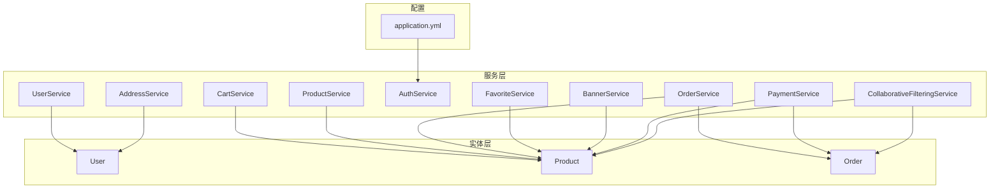
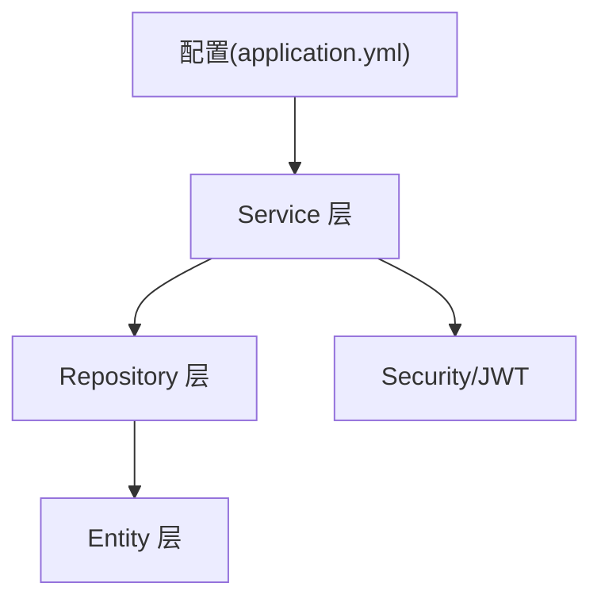
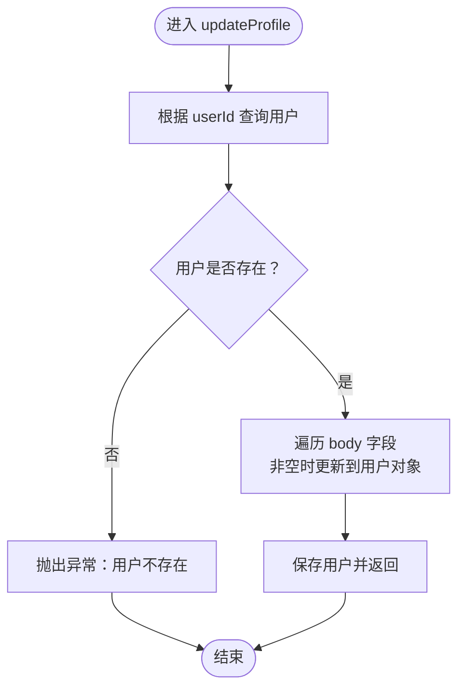
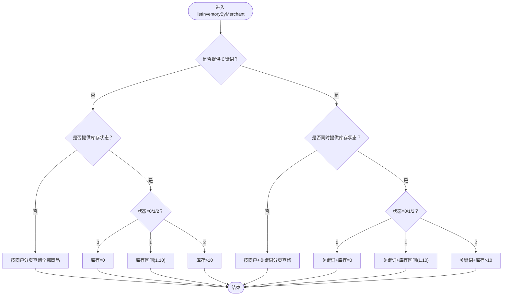
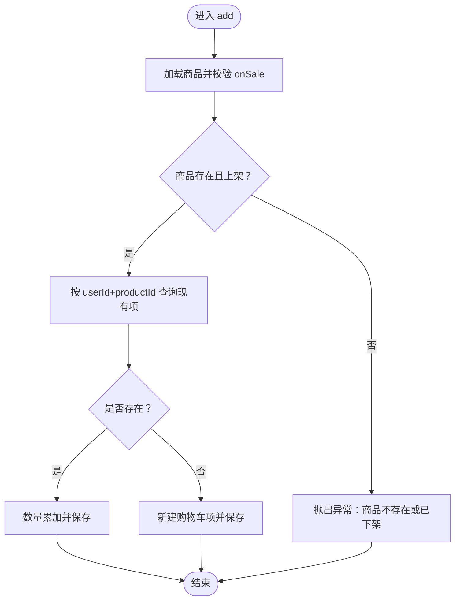
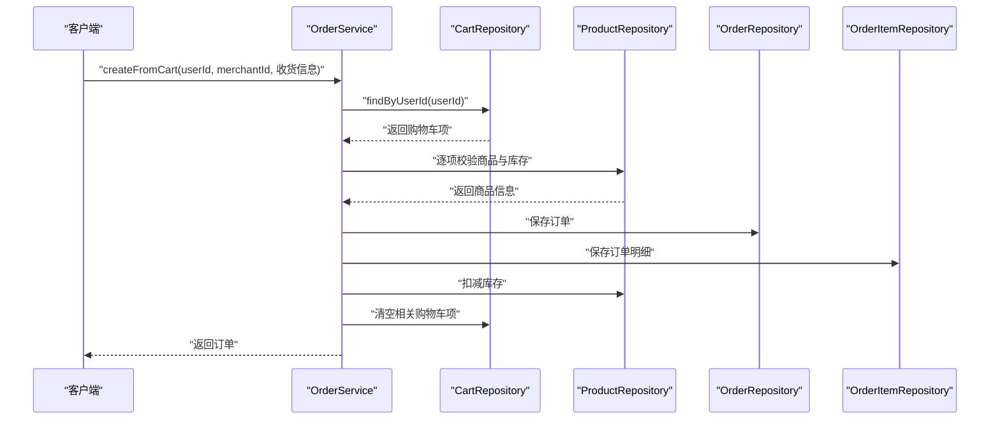
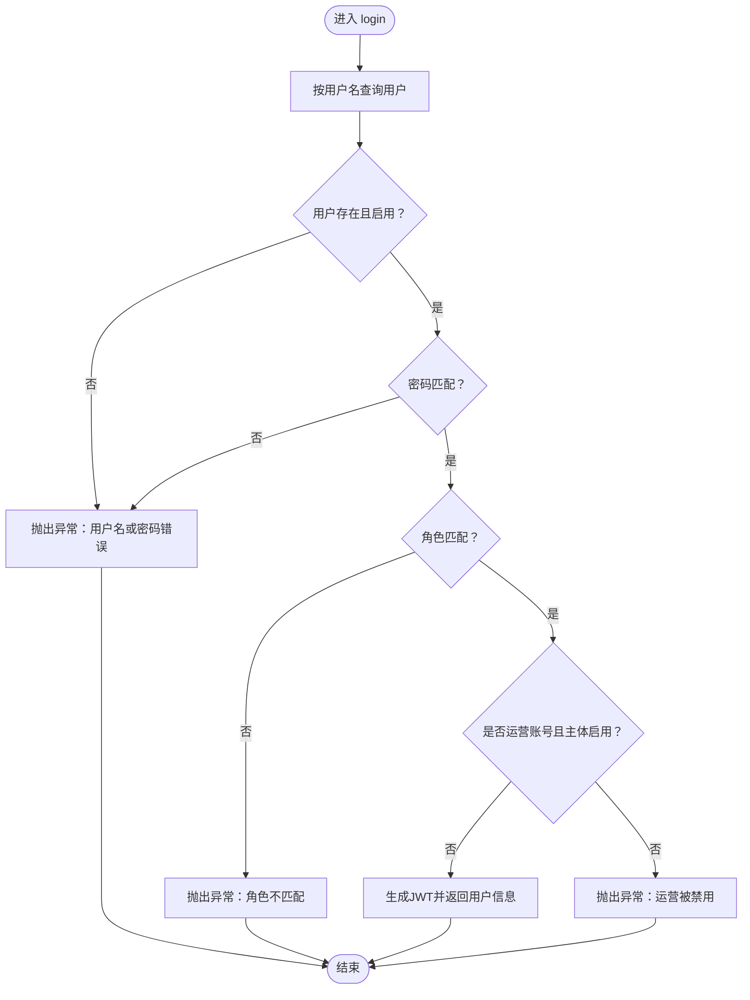
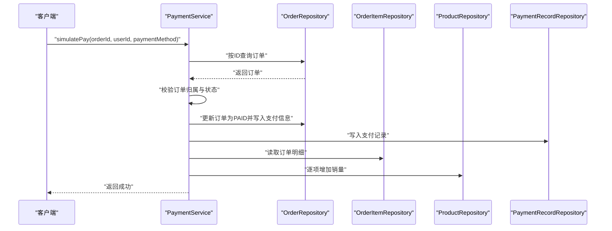
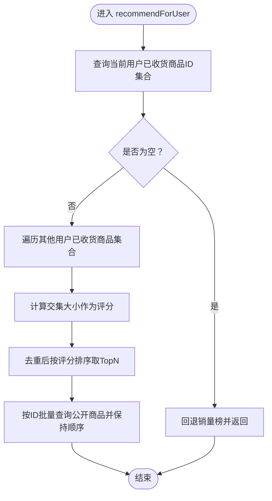
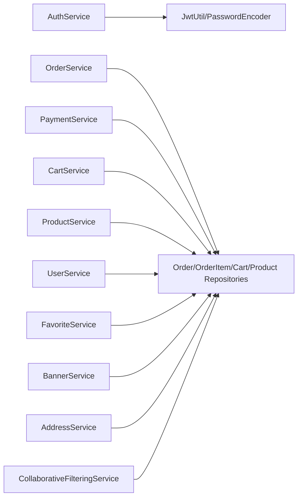

# 业务服务层

<cite>
**本文引用的文件**
- [UserService.java](file://backend/src/main/java/com/mall/service/UserService.java)
- [CartService.java](file://backend/src/main/java/com/mall/service/CartService.java)
- [ProductService.java](file://backend/src/main/java/com/mall/service/ProductService.java)
- [OrderService.java](file://backend/src/main/java/com/mall/service/OrderService.java)
- [AuthService.java](file://backend/src/main/java/com/mall/service/AuthService.java)
- [FavoriteService.java](file://backend/src/main/java/com/mall/service/FavoriteService.java)
- [BannerService.java](file://backend/src/main/java/com/mall/service/BannerService.java)
- [PaymentService.java](file://backend/src/main/java/com/mall/service/PaymentService.java)
- [AddressService.java](file://backend/src/main/java/com/mall/service/AddressService.java)
- [CollaborativeFilteringService.java](file://backend/src/main/java/com/mall/service/CollaborativeFilteringService.java)
- [User.java](file://backend/src/main/java/com/mall/entity/User.java)
- [Product.java](file://backend/src/main/java/com/mall/entity/Product.java)
- [Order.java](file://backend/src/main/java/com/mall/entity/Order.java)
- [Role.java](file://backend/src/main/java/com/mall/common/Role.java)
- [application.yml](file://backend/src/main/resources/application.yml)
</cite>

## 目录
1. [简介](#简介)
2. [项目结构](#项目结构)
3. [核心组件](#核心组件)
4. [架构总览](#架构总览)
5. [详细组件分析](#详细组件分析)
6. [依赖分析](#依赖分析)
7. [性能考虑](#性能考虑)
8. [故障排查指南](#故障排查指南)
9. [结论](#结论)
10. [附录](#附录)

## 简介
本文件面向电商商城系统的业务服务层，系统性梳理Service层的职责边界、业务逻辑封装与协作模式，覆盖用户服务、商品服务、订单服务、认证服务、购物车服务、收藏服务、横幅服务、支付服务、地址服务与协同过滤推荐服务。重点阐述事务管理策略、异常处理机制、参数校验与数据转换、权限检查等通用逻辑，并通过流程图与序列图帮助开发者快速理解复杂业务规则与数据处理链路。

## 项目结构
后端采用Spring Boot工程，Service层位于包com.mall.service，围绕用户、商品、订单、认证、购物车、收藏、横幅、支付、地址与推荐等模块进行职责划分。各服务类以@Transactional注解声明事务边界，结合仓储层Repository完成数据持久化。

图表来源
- [application.yml:1-36](file://backend/src/main/resources/application.yml#L1-L36)
- [UserService.java:14-41](file://backend/src/main/java/com/mall/service/UserService.java#L14-L41)
- [CartService.java:16-61](file://backend/src/main/java/com/mall/service/CartService.java#L16-L61)
- [ProductService.java:18-125](file://backend/src/main/java/com/mall/service/ProductService.java#L18-L125)
- [OrderService.java:26-279](file://backend/src/main/java/com/mall/service/OrderService.java#L26-L279)
- [AuthService.java:20-91](file://backend/src/main/java/com/mall/service/AuthService.java#L20-L91)
- [FavoriteService.java:16-42](file://backend/src/main/java/com/mall/service/FavoriteService.java#L16-L42)
- [BannerService.java:18-84](file://backend/src/main/java/com/mall/service/BannerService.java#L18-L84)
- [PaymentService.java:23-66](file://backend/src/main/java/com/mall/service/PaymentService.java#L23-L66)
- [AddressService.java:14-90](file://backend/src/main/java/com/mall/service/AddressService.java#L14-L90)
- [CollaborativeFilteringService.java:18-80](file://backend/src/main/java/com/mall/service/CollaborativeFilteringService.java#L18-L80)

章节来源
- [application.yml:1-36](file://backend/src/main/resources/application.yml#L1-L36)

## 核心组件
- 用户服务：提供用户资料更新、按ID查询等基础能力。
- 商品服务：提供管理端与用户端的商品查询、分页、搜索、库存筛选与榜单查询。
- 订单服务：负责从购物车创建订单、库存扣减、订单状态变更、取消与退款申请与审批。
- 认证服务：处理用户登录、角色校验、运营主体启用校验与JWT签发。
- 购物车服务：添加、修改数量、删除购物车项，校验商品状态与库存。
- 收藏服务：用户收藏/取消收藏商品，查询收藏列表。
- 横幅服务：横幅列表与公开展示映射，填充商品信息。
- 支付服务：模拟支付，设置订单支付状态与写入支付记录，更新商品销量。
- 地址服务：用户地址的增删改、默认地址切换与查询。
- 推荐服务：基于协同过滤的“猜你喜欢”推荐，无足够数据时回退销量榜。

章节来源
- [UserService.java:14-41](file://backend/src/main/java/com/mall/service/UserService.java#L14-L41)
- [ProductService.java:18-125](file://backend/src/main/java/com/mall/service/ProductService.java#L18-L125)
- [OrderService.java:26-279](file://backend/src/main/java/com/mall/service/OrderService.java#L26-L279)
- [AuthService.java:20-91](file://backend/src/main/java/com/mall/service/AuthService.java#L20-L91)
- [CartService.java:16-61](file://backend/src/main/java/com/mall/service/CartService.java#L16-L61)
- [FavoriteService.java:16-42](file://backend/src/main/java/com/mall/service/FavoriteService.java#L16-L42)
- [BannerService.java:18-84](file://backend/src/main/java/com/mall/service/BannerService.java#L18-L84)
- [PaymentService.java:23-66](file://backend/src/main/java/com/mall/service/PaymentService.java#L23-L66)
- [AddressService.java:14-90](file://backend/src/main/java/com/mall/service/AddressService.java#L14-L90)
- [CollaborativeFilteringService.java:18-80](file://backend/src/main/java/com/mall/service/CollaborativeFilteringService.java#L18-L80)

## 架构总览
Service层通过统一的事务注解与仓储层交互，围绕领域模型进行业务编排。认证服务依赖安全工具与密码编码器；支付服务在事务内更新订单与商品销量；订单服务在创建与退款场景下严格校验状态与库存一致性；推荐服务通过原生查询聚合用户行为数据。

图表来源
- [application.yml:1-36](file://backend/src/main/resources/application.yml#L1-L36)
- [AuthService.java:20-91](file://backend/src/main/java/com/mall/service/AuthService.java#L20-L91)
- [OrderService.java:26-279](file://backend/src/main/java/com/mall/service/OrderService.java#L26-L279)
- [PaymentService.java:23-66](file://backend/src/main/java/com/mall/service/PaymentService.java#L23-L66)

## 详细组件分析

### 用户服务（UserService）
- 职责：按ID查询用户；批量更新用户资料（昵称、头像、性别、邮箱、电话及默认收货信息），空值与空白字符串安全处理。
- 事务：更新操作使用@Transactional确保原子性。
- 参数与数据转换：通过Map接收动态字段，toStr方法统一去除空白并转为null。
- 权限与异常：未找到用户抛出运行时异常；更新字段按是否存在决定是否赋值。

图表来源
- [UserService.java:22-34](file://backend/src/main/java/com/mall/service/UserService.java#L22-L34)

章节来源
- [UserService.java:14-41](file://backend/src/main/java/com/mall/service/UserService.java#L14-L41)

### 商品服务（ProductService）
- 职责：管理端与用户端商品查询、分页、搜索、按分类筛选；运营维度查询与库存筛选；榜单与新品查询；保存与删除。
- 数据隔离：用户侧查询仅返回上架且运营启用的商品。
- 库存筛选：支持关键词+库存状态组合查询，区分缺货、低库存、正常三档阈值。
- 复杂度：分页查询依赖JPA分页接口；库存筛选通过条件分支构建不同查询路径。

图表来源
- [ProductService.java:95-119](file://backend/src/main/java/com/mall/service/ProductService.java#L95-L119)

章节来源
- [ProductService.java:18-125](file://backend/src/main/java/com/mall/service/ProductService.java#L18-L125)

### 购物车服务（CartService）
- 职责：查询用户购物车；添加商品（若已存在则合并数量）；修改数量（<=0删除）；删除单项。
- 事务：添加、修改、删除均在事务中执行。
- 业务校验：添加前校验商品存在且处于上架状态；合并数量时累加。

图表来源
- [CartService.java:25-43](file://backend/src/main/java/com/mall/service/CartService.java#L25-L43)

章节来源
- [CartService.java:16-61](file://backend/src/main/java/com/mall/service/CartService.java#L16-L61)

### 订单服务（OrderService）
- 职责：从购物车按运营维度创建订单、扣减库存、生成订单号；查询用户/运营/全站订单；订单状态变更；用户取消订单并回补库存；申请与审批退款（整单、单项、部分数量拆分）。
- 事务：创建订单、取消订单、单项/整单退款均在事务中执行，保证库存与状态一致性。
- 状态机：PENDING → PAID → SHIPPED → RECEIVED；支持取消与退款流程。
- 异常：对非法状态、库存不足、数量不合法等情况抛出运行时异常。

图表来源
- [OrderService.java:34-88](file://backend/src/main/java/com/mall/service/OrderService.java#L34-L88)

章节来源
- [OrderService.java:26-279](file://backend/src/main/java/com/mall/service/OrderService.java#L26-L279)

### 认证服务（AuthService）
- 职责：用户登录校验（用户名、密码、角色匹配、运营主体启用）、签发JWT；普通用户注册。
- 安全：使用PasswordEncoder进行密码匹配；JWT工具生成令牌；角色枚举来自Role。
- 异常：用户名/密码错误、角色不匹配、运营被禁用等场景抛出异常。

图表来源
- [AuthService.java:28-59](file://backend/src/main/java/com/mall/service/AuthService.java#L28-L59)

章节来源
- [AuthService.java:20-91](file://backend/src/main/java/com/mall/service/AuthService.java#L20-L91)
- [Role.java:1-8](file://backend/src/main/java/com/mall/common/Role.java#L1-L8)

### 收藏服务（FavoriteService）
- 职责：查询用户收藏商品列表（通过收藏表ID映射商品表）；判断是否收藏；添加/删除收藏。
- 事务：添加与删除在事务中执行。
- 异常：添加时若商品不存在抛出异常。

章节来源
- [FavoriteService.java:16-42](file://backend/src/main/java/com/mall/service/FavoriteService.java#L16-L42)

### 横幅服务（BannerService）
- 职责：横幅列表查询与公开展示映射；将商品信息填充至横幅DTO；保存横幅并回填图片URL；删除与按ID查询。
- 映射：toDTO与toPublicDTO分别用于管理端与用户端展示，过滤掉无效商品信息。

章节来源
- [BannerService.java:18-84](file://backend/src/main/java/com/mall/service/BannerService.java#L18-L84)

### 支付服务（PaymentService）
- 职责：模拟支付，校验订单状态为PENDING且归属当前用户，设置支付方式、时间与金额，写入支付记录，并更新商品销量。
- 事务：在事务中完成订单状态更新与支付记录写入。

图表来源
- [PaymentService.java:30-65](file://backend/src/main/java/com/mall/service/PaymentService.java#L30-L65)

章节来源
- [PaymentService.java:23-66](file://backend/src/main/java/com/mall/service/PaymentService.java#L23-L66)

### 地址服务（AddressService）
- 职责：查询用户地址列表（默认地址优先）、按ID获取地址、创建/更新/删除地址、设置默认地址、查询默认地址。
- 事务：创建、更新、删除、设置默认地址在事务中执行。
- 业务：设置默认地址时自动取消用户其他默认标记。

章节来源
- [AddressService.java:14-90](file://backend/src/main/java/com/mall/service/AddressService.java#L14-L90)

### 协同过滤推荐服务（CollaborativeFilteringService）
- 职责：基于“共同购买集合大小”为用户生成“猜你喜欢”推荐；若无足够数据则回退销量榜。
- 算法：统计当前用户已收货商品集合，遍历其他用户已收货商品集合，计算交集规模作为相似度评分，去重后按评分降序取TopN。

图表来源
- [CollaborativeFilteringService.java:32-75](file://backend/src/main/java/com/mall/service/CollaborativeFilteringService.java#L32-L75)

章节来源
- [CollaborativeFilteringService.java:18-80](file://backend/src/main/java/com/mall/service/CollaborativeFilteringService.java#L18-L80)

## 依赖分析
- 组件耦合：各Service通过Repository访问实体，耦合集中在领域模型与查询接口；认证服务依赖安全工具与密码编码器；支付与订单服务强耦合于状态机与库存一致性。
- 事务边界：创建订单、取消订单、单项/整单退款、模拟支付、地址默认切换等关键流程均在@Transactional中执行，避免并发与状态不一致问题。
- 外部依赖：JWT配置来源于application.yml；数据库连接、JPA方言与DDL策略由配置文件定义。

图表来源
- [application.yml:1-36](file://backend/src/main/resources/application.yml#L1-L36)
- [AuthService.java:20-91](file://backend/src/main/java/com/mall/service/AuthService.java#L20-L91)
- [OrderService.java:26-279](file://backend/src/main/java/com/mall/service/OrderService.java#L26-L279)
- [PaymentService.java:23-66](file://backend/src/main/java/com/mall/service/PaymentService.java#L23-L66)
- [CartService.java:16-61](file://backend/src/main/java/com/mall/service/CartService.java#L16-L61)
- [ProductService.java:18-125](file://backend/src/main/java/com/mall/service/ProductService.java#L18-L125)
- [UserService.java:14-41](file://backend/src/main/java/com/mall/service/UserService.java#L14-L41)
- [FavoriteService.java:16-42](file://backend/src/main/java/com/mall/service/FavoriteService.java#L16-L42)
- [BannerService.java:18-84](file://backend/src/main/java/com/mall/service/BannerService.java#L18-L84)
- [AddressService.java:14-90](file://backend/src/main/java/com/mall/service/AddressService.java#L14-L90)
- [CollaborativeFilteringService.java:18-80](file://backend/src/main/java/com/mall/service/CollaborativeFilteringService.java#L18-L80)

章节来源
- [application.yml:1-36](file://backend/src/main/resources/application.yml#L1-L36)

## 性能考虑
- 分页查询：商品与订单查询广泛使用Pageable，建议结合索引优化常见过滤字段（如merchant_id、onSale、status等）。
- 批量查询：收藏列表通过ID集合一次性查询商品，减少多次往返；推荐服务批量查询公开商品并保持顺序。
- 事务范围：将跨实体的写操作收敛在单个事务中，避免中间态；注意长事务可能带来的锁竞争，必要时拆分或缩短事务。
- 缓存建议：对热点榜单（新品、销量）与公开商品详情可引入缓存；横幅与商品图片可结合CDN加速。
- 数据库调优：为高频查询建立复合索引，如订单状态+用户ID、商品状态+商户ID等。

## 故障排查指南
- 登录失败
  - 现象：提示用户名或密码错误。
  - 排查：确认用户名存在且启用；核对密码编码与匹配；检查角色参数与用户角色一致；若为运营账号，确认商户主体启用。
  - 参考
    - [AuthService.java:28-59](file://backend/src/main/java/com/mall/service/AuthService.java#L28-L59)
- 订单创建失败
  - 现象：提示购物车无该运营商品或库存不足。
  - 排查：确认购物车中存在对应运营商品；核对商品库存与购买数量；检查商品状态为上架。
  - 参考
    - [OrderService.java:34-88](file://backend/src/main/java/com/mall/service/OrderService.java#L34-L88)
- 取消订单异常
  - 现象：提示当前订单状态不可取消或订单不存在。
  - 排查：确认订单状态非已收货/退款中/已取消；核对订单归属用户。
  - 参考
    - [OrderService.java:124-145](file://backend/src/main/java/com/mall/service/OrderService.java#L124-L145)
- 退款申请失败
  - 现象：提示当前订单状态不可申请退款或商品数量不合法。
  - 排查：确认订单状态为已收货或已在退款中；核对申请数量不超过购买数量；部分退款时检查拆分逻辑。
  - 参考
    - [OrderService.java:150-240](file://backend/src/main/java/com/mall/service/OrderService.java#L150-L240)
- 支付失败
  - 现象：返回false或未更新支付状态。
  - 排查：确认订单存在且归属当前用户；确认订单状态为PENDING；检查支付方式与默认值。
  - 参考
    - [PaymentService.java:30-65](file://backend/src/main/java/com/mall/service/PaymentService.java#L30-L65)
- 购物车异常
  - 现象：添加失败或数量未更新。
  - 排查：确认商品存在且上架；合并数量时检查重复项；修改数量<=0会触发删除。
  - 参考
    - [CartService.java:25-60](file://backend/src/main/java/com/mall/service/CartService.java#L25-L60)
- 收藏异常
  - 现象：添加失败。
  - 排查：确认商品存在；重复收藏不会报错但无副作用。
  - 参考
    - [FavoriteService.java:31-36](file://backend/src/main/java/com/mall/service/FavoriteService.java#L31-L36)
- 地址异常
  - 现象：设置默认失败或更新无效。
  - 排查：确认地址归属当前用户；设置默认时会自动取消其他默认标记。
  - 参考
    - [AddressService.java:67-85](file://backend/src/main/java/com/mall/service/AddressService.java#L67-L85)

章节来源
- [AuthService.java:28-59](file://backend/src/main/java/com/mall/service/AuthService.java#L28-L59)
- [OrderService.java:124-240](file://backend/src/main/java/com/mall/service/OrderService.java#L124-L240)
- [PaymentService.java:30-65](file://backend/src/main/java/com/mall/service/PaymentService.java#L30-L65)
- [CartService.java:25-60](file://backend/src/main/java/com/mall/service/CartService.java#L25-L60)
- [FavoriteService.java:31-36](file://backend/src/main/java/com/mall/service/FavoriteService.java#L31-L36)
- [AddressService.java:67-85](file://backend/src/main/java/com/mall/service/AddressService.java#L67-L85)

## 结论
本服务层围绕用户、商品、订单、认证、购物车、收藏、横幅、支付、地址与推荐等核心业务域进行清晰的职责划分，通过统一的事务管理与严格的参数校验保障数据一致性与业务正确性。推荐服务采用协同过滤算法提升个性化体验，支付与订单流程体现完整的状态机设计。建议在生产环境中进一步完善缓存策略、索引优化与监控告警，持续提升系统性能与稳定性。

## 附录
- 关键实体属性概览
  - 用户：用户名唯一、密码加密存储、角色枚举、运营关联ID、启用状态、收货信息。
  - 商品：所属商户、分类、名称、描述、图片、价格、库存、销量、上下架状态、新品标识。
  - 订单：订单号唯一、用户与商户、状态、应付/实付金额、支付方式与时间、收货信息、退款相关信息。

章节来源
- [User.java:17-87](file://backend/src/main/java/com/mall/entity/User.java#L17-L87)
- [Product.java:16-99](file://backend/src/main/java/com/mall/entity/Product.java#L16-L99)
- [Order.java:16-81](file://backend/src/main/java/com/mall/entity/Order.java#L16-L81)
- [Role.java:1-8](file://backend/src/main/java/com/mall/common/Role.java#L1-L8)