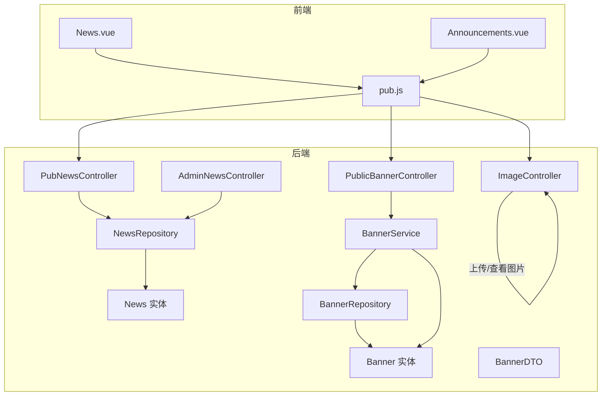
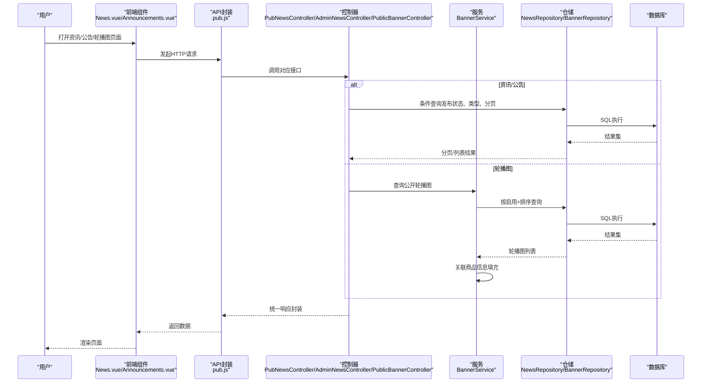
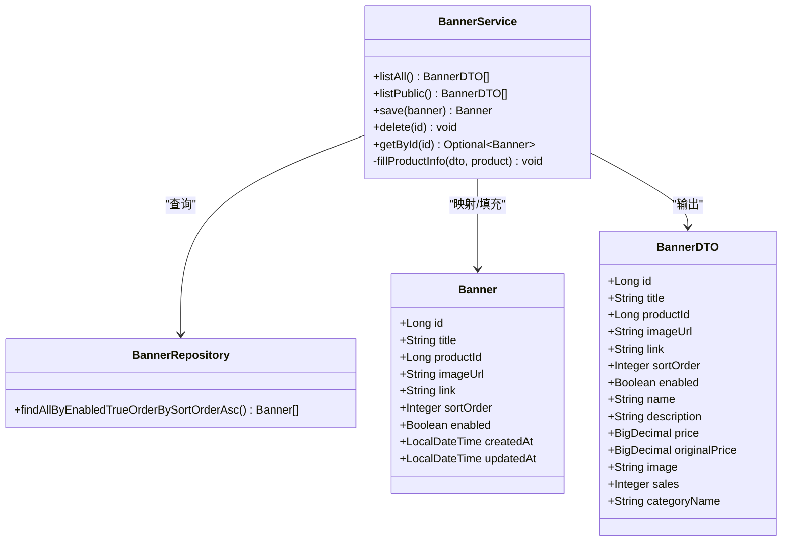
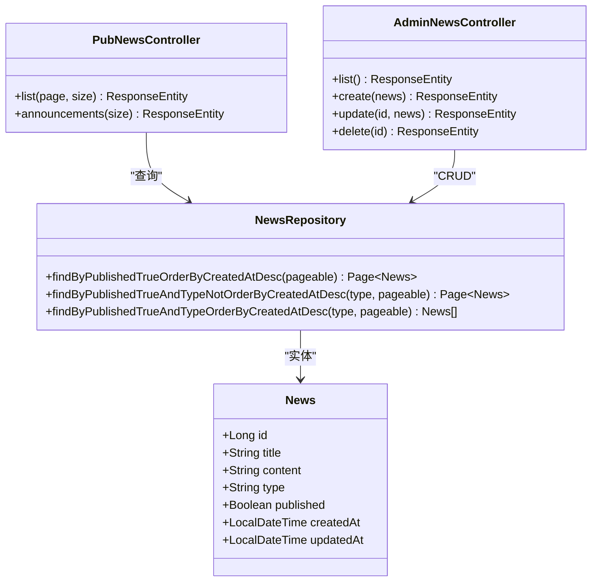
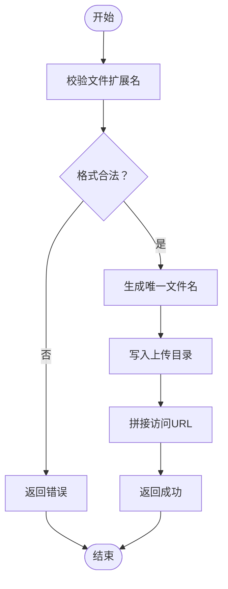
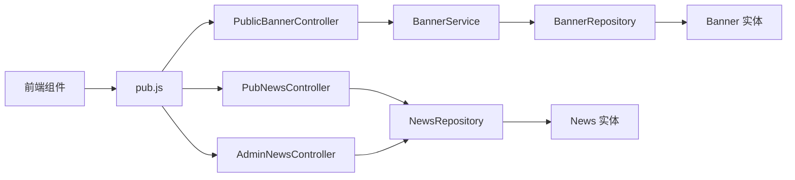

# 内容服务

<cite>
**本文引用的文件**
- [PublicBannerController.java](file://backend/src/main/java/com/mall/controller/pub/PublicBannerController.java)
- [AdminNewsController.java](file://backend/src/main/java/com/mall/controller/admin/AdminNewsController.java)
- [PubNewsController.java](file://backend/src/main/java/com/mall/controller/pub/PubNewsController.java)
- [BannerService.java](file://backend/src/main/java/com/mall/service/BannerService.java)
- [BannerRepository.java](file://backend/src/main/java/com/mall/repository/BannerRepository.java)
- [NewsRepository.java](file://backend/src/main/java/com/mall/repository/NewsRepository.java)
- [Banner.java](file://backend/src/main/java/com/mall/entity/Banner.java)
- [News.java](file://backend/src/main/java/com/mall/entity/News.java)
- [BannerDTO.java](file://backend/src/main/java/com/mall/dto/BannerDTO.java)
- [application.yml](file://backend/src/main/resources/application.yml)
- [Announcements.vue](file://frontend/src/views/user/Announcements.vue)
- [News.vue](file://frontend/src/views/user/News.vue)
- [pub.js](file://frontend/src/api/pub.js)
- [ImageController.java](file://backend/src/main/java/com/mall/controller/pub/ImageController.java)
</cite>

## 目录
1. [简介](#简介)
2. [项目结构](#项目结构)
3. [核心组件](#核心组件)
4. [架构总览](#架构总览)
5. [详细组件分析](#详细组件分析)
6. [依赖分析](#依赖分析)
7. [性能考虑](#性能考虑)
8. [故障排查指南](#故障排查指南)
9. [结论](#结论)
10. [附录](#附录)

## 简介
本文件面向电商商城系统的内容服务，聚焦以下能力：
- 轮播图管理：后台创建/编辑/删除轮播图；前台按排序权重展示，并自动关联已上架商品信息。
- 公告发布：后台管理资讯与公告；前台分页展示资讯与公告，支持类型筛选与合并展示。
- 新闻资讯：统一的“资讯/公告”类型管理，支持已发布状态控制与时间倒序展示。
- 数据验证与图片处理：基于文件扩展名与路径安全的图片上传与访问。
- 缓存策略：当前未见显式缓存实现，建议结合业务热点与CDN进行优化。

## 项目结构
后端采用Spring Boot + JPA分层架构，前端使用Vue 3 + Element Plus。内容服务涉及控制器、服务、仓储、实体与DTO，以及公共图片上传与访问接口。

图表来源
- [PublicBannerController.java:12-22](file://backend/src/main/java/com/mall/controller/pub/PublicBannerController.java#L12-L22)
- [AdminNewsController.java:13-47](file://backend/src/main/java/com/mall/controller/admin/AdminNewsController.java#L13-L47)
- [PubNewsController.java:13-35](file://backend/src/main/java/com/mall/controller/pub/PubNewsController.java#L13-L35)
- [BannerService.java:16-84](file://backend/src/main/java/com/mall/service/BannerService.java#L16-L84)
- [BannerRepository.java:7-9](file://backend/src/main/java/com/mall/repository/BannerRepository.java#L7-L9)
- [NewsRepository.java:11-18](file://backend/src/main/java/com/mall/repository/NewsRepository.java#L11-L18)
- [Banner.java:7-59](file://backend/src/main/java/com/mall/entity/Banner.java#L7-L59)
- [News.java:9-51](file://backend/src/main/java/com/mall/entity/News.java#L9-L51)
- [BannerDTO.java:6-32](file://backend/src/main/java/com/mall/dto/BannerDTO.java#L6-L32)
- [ImageController.java:50-154](file://backend/src/main/java/com/mall/controller/pub/ImageController.java#L50-L154)

章节来源
- [application.yml:1-36](file://backend/src/main/resources/application.yml#L1-L36)

## 核心组件
- 轮播图模块
  - 控制器：PublicBannerController 提供公开轮播图列表查询。
  - 服务：BannerService 负责轮播图列表组装、公开列表过滤、与商品信息联动填充。
  - 仓储：BannerRepository 提供按启用状态与排序权重查询。
  - 实体：Banner 定义轮播图字段与时间戳。
  - DTO：BannerDTO 用于前后端传输的商品展示信息。
- 资讯/公告模块
  - 控制器：AdminNewsController 提供后台增删改查；PubNewsController 提供前台分页查询与公告列表。
  - 仓储：NewsRepository 提供按发布状态、类型与时间排序的查询方法。
  - 实体：News 定义标题、内容、类型、发布状态与时间戳。
- 图片处理
  - ImageController 提供图片上传、校验与访问接口，支持多种格式并生成可访问URL。

章节来源
- [PublicBannerController.java:12-22](file://backend/src/main/java/com/mall/controller/pub/PublicBannerController.java#L12-L22)
- [BannerService.java:16-84](file://backend/src/main/java/com/mall/service/BannerService.java#L16-L84)
- [BannerRepository.java:7-9](file://backend/src/main/java/com/mall/repository/BannerRepository.java#L7-L9)
- [Banner.java:7-59](file://backend/src/main/java/com/mall/entity/Banner.java#L7-L59)
- [BannerDTO.java:6-32](file://backend/src/main/java/com/mall/dto/BannerDTO.java#L6-L32)
- [AdminNewsController.java:13-47](file://backend/src/main/java/com/mall/controller/admin/AdminNewsController.java#L13-L47)
- [PubNewsController.java:13-35](file://backend/src/main/java/com/mall/controller/pub/PubNewsController.java#L13-L35)
- [NewsRepository.java:11-18](file://backend/src/main/java/com/mall/repository/NewsRepository.java#L11-L18)
- [News.java:9-51](file://backend/src/main/java/com/mall/entity/News.java#L9-L51)
- [ImageController.java:50-154](file://backend/src/main/java/com/mall/controller/pub/ImageController.java#L50-L154)

## 架构总览
内容服务遵循典型的MVC分层：
- 控制器层：暴露REST接口，负责请求参数接收与响应封装。
- 服务层：编排业务逻辑，完成数据转换与跨实体关联。
- 仓储层：抽象数据库访问，提供查询方法。
- 实体与DTO：定义数据模型与传输对象。
- 前端：通过API封装调用后端接口，渲染页面。

图表来源
- [PubNewsController.java:21-34](file://backend/src/main/java/com/mall/controller/pub/PubNewsController.java#L21-L34)
- [AdminNewsController.java:21-46](file://backend/src/main/java/com/mall/controller/admin/AdminNewsController.java#L21-L46)
- [PublicBannerController.java:18-21](file://backend/src/main/java/com/mall/controller/pub/PublicBannerController.java#L18-L21)
- [BannerService.java:22-49](file://backend/src/main/java/com/mall/service/BannerService.java#L22-L49)
- [BannerRepository.java:7-9](file://backend/src/main/java/com/mall/repository/BannerRepository.java#L7-L9)
- [NewsRepository.java:11-18](file://backend/src/main/java/com/mall/repository/NewsRepository.java#L11-L18)

## 详细组件分析

### 轮播图管理
- 功能要点
  - 后台管理：通过BannerService与BannerRepository维护轮播图记录，支持设置排序权重与启用状态。
  - 前台展示：PublicBannerController提供公开列表接口，BannerService在公开列表中过滤掉不完整商品信息的轮播图。
  - 商品信息联动：BannerService根据关联商品ID查询商品详情，填充名称、图片、价格、销量等字段到BannerDTO。
- 关键流程
  - 创建/更新：BannerService在保存前尝试回填图片URL，确保轮播图展示一致。
  - 展示：BannerRepository按启用状态与排序权重查询；BannerService再做公开过滤与商品信息填充。
- 数据模型

图表来源
- [Banner.java:14-59](file://backend/src/main/java/com/mall/entity/Banner.java#L14-L59)
- [BannerDTO.java:7-32](file://backend/src/main/java/com/mall/dto/BannerDTO.java#L7-L32)
- [BannerService.java:18-84](file://backend/src/main/java/com/mall/service/BannerService.java#L18-L84)
- [BannerRepository.java:7-9](file://backend/src/main/java/com/mall/repository/BannerRepository.java#L7-L9)

- 前端集成
  - 轮播图列表通过pub.js的getBanners接口获取，前端News.vue与Announcements.vue分别消费不同接口，轮播图由PublicBannerController提供。
- 最佳实践
  - 轮播图排序权重应由运营后台统一维护，避免并发修改导致顺序错乱。
  - 图片URL应指向CDN或静态资源服务器，提升加载速度与稳定性。
  - 对于无关联商品的轮播图，建议在后台强制要求选择有效商品，减少前端过滤成本。

章节来源
- [PublicBannerController.java:12-22](file://backend/src/main/java/com/mall/controller/pub/PublicBannerController.java#L12-L22)
- [BannerService.java:22-75](file://backend/src/main/java/com/mall/service/BannerService.java#L22-L75)
- [BannerRepository.java:7-9](file://backend/src/main/java/com/mall/repository/BannerRepository.java#L7-L9)
- [Banner.java:14-59](file://backend/src/main/java/com/mall/entity/Banner.java#L14-L59)
- [BannerDTO.java:7-32](file://backend/src/main/java/com/mall/dto/BannerDTO.java#L7-L32)
- [pub.js:55-58](file://frontend/src/api/pub.js#L55-L58)
- [News.vue:1-279](file://frontend/src/views/user/News.vue#L1-L279)
- [Announcements.vue:1-36](file://frontend/src/views/user/Announcements.vue#L1-L36)

### 公告发布与资讯管理
- 功能要点
  - 后台接口AdminNewsController提供资讯/公告的增删改查，便于运营人员维护内容。
  - 前台接口PubNewsController提供两类查询：
    - 分页查询已发布资讯（排除公告），支持page与size参数。
    - 查询最新公告列表，支持size参数。
  - 仓储NewsRepository提供按发布状态、类型与时间排序的查询方法，支撑分页与筛选。
- 关键流程
  - 发布控制：News实体包含published字段，仅查询published为true的内容。
  - 类型区分：type字段区分NEWS与ANNOUNCEMENT，前端可按类型筛选或合并展示。
  - 时间排序：默认按createdAt降序，保证最新内容优先展示。
- 数据模型

图表来源
- [News.java:16-51](file://backend/src/main/java/com/mall/entity/News.java#L16-L51)
- [NewsRepository.java:11-18](file://backend/src/main/java/com/mall/repository/NewsRepository.java#L11-L18)
- [PubNewsController.java:13-35](file://backend/src/main/java/com/mall/controller/pub/PubNewsController.java#L13-L35)
- [AdminNewsController.java:13-47](file://backend/src/main/java/com/mall/controller/admin/AdminNewsController.java#L13-L47)

- 前端集成
  - News.vue通过pub.js的getNews与getAnnouncements分别加载资讯与公告，支持Tab切换与合并展示。
  - Announcements.vue加载公告列表，展示标题、发布时间与内容。
- 最佳实践
  - 公告与资讯的类型字段应严格校验，避免误标。
  - 分页大小建议固定在合理范围（如10/20），避免一次性拉取过多数据。
  - 对高频访问的资讯列表可引入Redis缓存，设置合理的TTL与失效策略。

章节来源
- [AdminNewsController.java:13-47](file://backend/src/main/java/com/mall/controller/admin/AdminNewsController.java#L13-L47)
- [PubNewsController.java:13-35](file://backend/src/main/java/com/mall/controller/pub/PubNewsController.java#L13-L35)
- [NewsRepository.java:11-18](file://backend/src/main/java/com/mall/repository/NewsRepository.java#L11-L18)
- [News.java:16-51](file://backend/src/main/java/com/mall/entity/News.java#L16-L51)
- [pub.js:45-58](file://frontend/src/api/pub.js#L45-L58)
- [News.vue:84-146](file://frontend/src/views/user/News.vue#L84-L146)
- [Announcements.vue:16-27](file://frontend/src/views/user/Announcements.vue#L16-L27)

### 数据验证与图片处理
- 文件上传
  - 支持格式：jpg/jpeg/png/gif/webp/bmp。
  - 安全策略：校验文件扩展名，生成唯一文件名，写入指定目录。
  - 访问URL：根据请求协议、主机与端口拼接可访问URL，返回给前端。
- 图片访问
  - 提供图片列表与按文件名查看接口，支持根据扩展名推断媒体类型。
- 建议
  - 前端富文本编辑器中插入图片时，建议限制文件大小与数量，避免超大文件影响性能。
  - 对上传的图片进行压缩与裁剪，结合CDN加速与懒加载优化用户体验。

图表来源
- [ImageController.java:113-154](file://backend/src/main/java/com/mall/controller/pub/ImageController.java#L113-L154)

章节来源
- [ImageController.java:50-154](file://backend/src/main/java/com/mall/controller/pub/ImageController.java#L50-L154)

## 依赖分析
- 控制器与服务
  - PublicBannerController依赖BannerService；BannerService依赖BannerRepository与ProductRepository（用于商品信息填充）。
  - AdminNewsController与PubNewsController均依赖NewsRepository。
- 仓储与实体
  - BannerRepository与NewsRepository分别继承JpaRepository，提供基础CRUD与自定义查询方法。
  - 实体类定义字段与生命周期回调，确保时间戳一致性。
- 前后端依赖
  - 前端通过pub.js封装的HTTP请求调用后端接口，News.vue与Announcements.vue分别消费不同接口。

图表来源
- [PublicBannerController.java:12-22](file://backend/src/main/java/com/mall/controller/pub/PublicBannerController.java#L12-L22)
- [PubNewsController.java:13-35](file://backend/src/main/java/com/mall/controller/pub/PubNewsController.java#L13-L35)
- [AdminNewsController.java:13-47](file://backend/src/main/java/com/mall/controller/admin/AdminNewsController.java#L13-L47)
- [BannerService.java:16-84](file://backend/src/main/java/com/mall/service/BannerService.java#L16-L84)
- [BannerRepository.java:7-9](file://backend/src/main/java/com/mall/repository/BannerRepository.java#L7-L9)
- [NewsRepository.java:11-18](file://backend/src/main/java/com/mall/repository/NewsRepository.java#L11-L18)
- [Banner.java:7-59](file://backend/src/main/java/com/mall/entity/Banner.java#L7-L59)
- [News.java:9-51](file://backend/src/main/java/com/mall/entity/News.java#L9-L51)

## 性能考虑
- 查询优化
  - 轮播图：按enabled与sortOrder查询，建议在sortOrder与enabled上建立索引以提升排序与过滤效率。
  - 资讯/公告：按published与createdAt降序查询，建议在published与createdAt上建立复合索引。
- 分页与缓存
  - 建议对高频访问的资讯列表（如首页资讯流）引入Redis缓存，设置TTL与失效策略，降低数据库压力。
  - 对轮播图与公告列表可采用短期缓存（如5-10分钟），结合CDN加速静态资源。
- 图片处理
  - 建议对上传图片进行压缩与多尺寸裁剪，结合CDN与懒加载减少首屏加载时间。
- 并发与一致性
  - 轮播图排序权重更新需加锁或采用原子更新，避免并发修改导致顺序异常。

## 故障排查指南
- 轮播图为空或商品信息缺失
  - 检查BannerService的公开列表过滤逻辑，确认轮播图是否关联有效商品且商品图片存在。
  - 核对BannerRepository的查询条件与sortOrder值。
- 资讯/公告未显示
  - 确认News实体的published字段为true，type字段正确，且createdAt时间倒序。
  - 检查分页参数page与size是否合理。
- 图片上传失败
  - 检查文件扩展名是否在允许范围内，上传目录是否存在且具备写权限。
  - 查看返回的错误信息，确认URL拼接是否正确。
- 前端无法加载数据
  - 检查后端接口路径与参数，确认CORS与鉴权配置（如需要）。
  - 确认前端pub.js中的请求路径与后端实际路径一致。

章节来源
- [BannerService.java:27-49](file://backend/src/main/java/com/mall/service/BannerService.java#L27-L49)
- [BannerRepository.java:7-9](file://backend/src/main/java/com/mall/repository/BannerRepository.java#L7-L9)
- [NewsRepository.java:11-18](file://backend/src/main/java/com/mall/repository/NewsRepository.java#L11-L18)
- [ImageController.java:113-154](file://backend/src/main/java/com/mall/controller/pub/ImageController.java#L113-L154)
- [pub.js:45-58](file://frontend/src/api/pub.js#L45-L58)

## 结论
内容服务围绕轮播图、公告与资讯三大模块构建，采用清晰的分层设计与简洁的接口约定。通过BannerService与NewsRepository的组合，实现了高效的内容查询与展示。建议后续在缓存、CDN与图片处理方面进一步优化，以提升性能与用户体验。

## 附录
- 接口一览
  - 轮播图：GET /pub/banner
  - 资讯列表：GET /pub/news（分页，排除公告）
  - 公告列表：GET /pub/news/announcements（按最新）
  - 资讯管理（后台）：GET/POST/PUT/DELETE /admin/news
- 前端调用
  - 使用pub.js封装的getBanners、getNews、getAnnouncements等方法，News.vue与Announcements.vue分别消费不同接口。