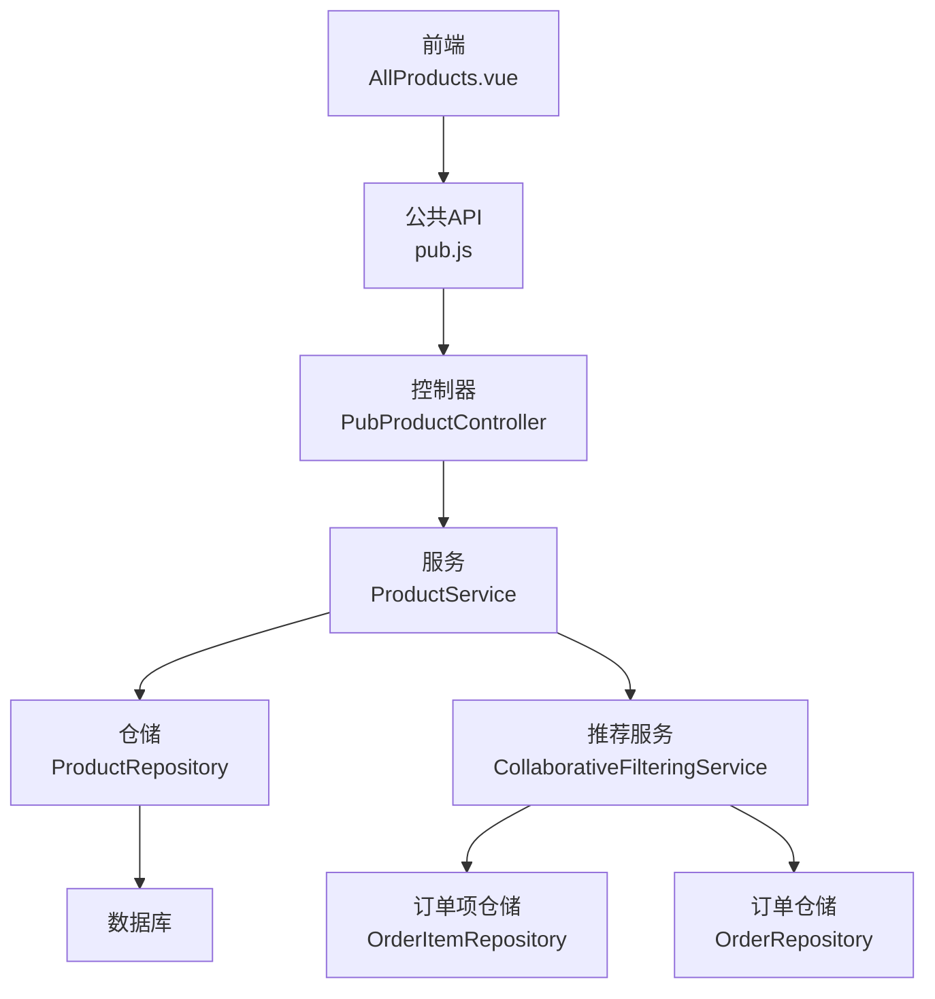
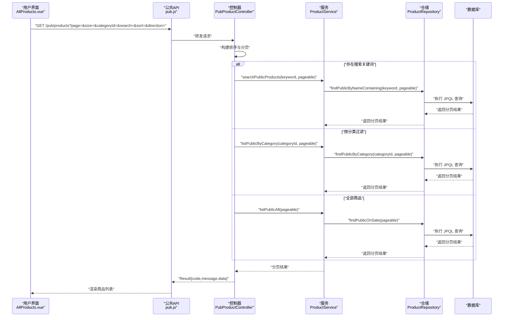
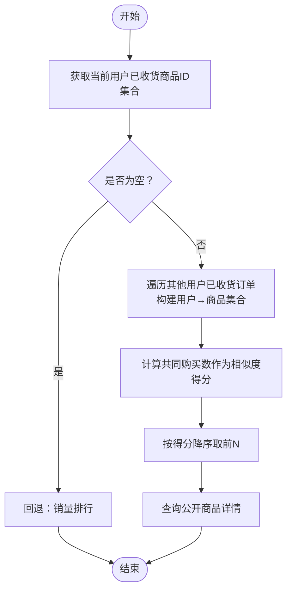
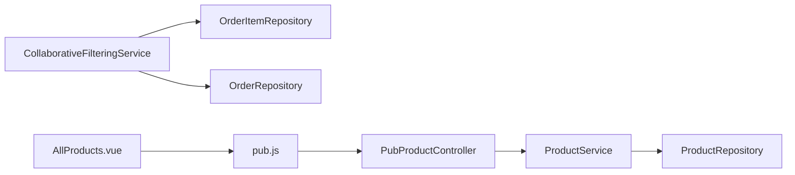

# 商品搜索

<cite>
**本文引用的文件**
- [PubProductController.java](file://backend/src/main/java/com/mall/controller/pub/PubProductController.java)
- [ProductService.java](file://backend/src/main/java/com/mall/service/ProductService.java)
- [ProductRepository.java](file://backend/src/main/java/com/mall/repository/ProductRepository.java)
- [Product.java](file://backend/src/main/java/com/mall/entity/Product.java)
- [application.yml](file://backend/src/main/resources/application.yml)
- [CollaborativeFilteringService.java](file://backend/src/main/java/com/mall/service/CollaborativeFilteringService.java)
- [OrderItemRepository.java](file://backend/src/main/java/com/mall/repository/OrderItemRepository.java)
- [OrderRepository.java](file://backend/src/main/java/com/mall/repository/OrderRepository.java)
- [Result.java](file://backend/src/main/java/com/mall/dto/Result.java)
- [AllProducts.vue](file://frontend/src/views/user/AllProducts.vue)
- [pub.js](file://frontend/src/api/pub.js)
</cite>

## 目录
1. [简介](#简介)
2. [项目结构](#项目结构)
3. [核心组件](#核心组件)
4. [架构总览](#架构总览)
5. [详细组件分析](#详细组件分析)
6. [依赖分析](#依赖分析)
7. [性能考虑](#性能考虑)
8. [故障排查指南](#故障排查指南)
9. [结论](#结论)
10. [附录](#附录)

## 简介
本技术文档围绕电商商城系统的商品搜索功能展开，系统支持用户侧公开搜索、分类筛选、排序规则以及“猜您想买”个性化推荐。搜索范围限定在“上架且运营启用”的商品，确保结果的可见性与一致性。后端采用 Spring Data JPA 提供的分页查询与原生 SQL/JPQL 查询组合实现；前端提供关键词输入、分类过滤、排序切换与分页导航。

## 项目结构
- 后端模块
  - 控制器层：公开商品接口由 PubProductController 提供，负责接收分页、搜索、分类与排序参数。
  - 业务层：ProductService 封装查询逻辑，统一调用 ProductRepository。
  - 数据访问层：ProductRepository 定义 JPQL/原生查询，覆盖公开商品列表、分类过滤、新品与销量排行、关键词搜索等。
  - 实体模型：Product 定义商品字段，含名称、描述、价格、销量、上下架状态等。
  - 配置：application.yml 提供数据库与 JPA 配置。
  - 推荐：CollaborativeFilteringService 基于协同过滤实现“猜您想买”，依赖订单与订单项仓储。
- 前端模块
  - AllProducts.vue：用户侧商品列表页面，集成搜索、分类、排序与分页。
  - pub.js：公共 API 封装，统一调用 /pub/products 等接口。

**图表来源**
- [AllProducts.vue](file://frontend/src/views/user/AllProducts.vue)
- [pub.js](file://frontend/src/api/pub.js)
- [PubProductController.java](file://backend/src/main/java/com/mall/controller/pub/PubProductController.java)
- [ProductService.java](file://backend/src/main/java/com/mall/service/ProductService.java)
- [ProductRepository.java](file://backend/src/main/java/com/mall/repository/ProductRepository.java)
- [CollaborativeFilteringService.java](file://backend/src/main/java/com/mall/service/CollaborativeFilteringService.java)
- [OrderItemRepository.java](file://backend/src/main/java/com/mall/repository/OrderItemRepository.java)
- [OrderRepository.java](file://backend/src/main/java/com/mall/repository/OrderRepository.java)

**章节来源**
- [PubProductController.java:1-95](file://backend/src/main/java/com/mall/controller/pub/PubProductController.java#L1-L95)
- [ProductService.java:1-126](file://backend/src/main/java/com/mall/service/ProductService.java#L1-L126)
- [ProductRepository.java:1-125](file://backend/src/main/java/com/mall/repository/ProductRepository.java#L1-L125)
- [Product.java:1-101](file://backend/src/main/java/com/mall/entity/Product.java#L1-L101)
- [application.yml:1-36](file://backend/src/main/resources/application.yml#L1-L36)
- [CollaborativeFilteringService.java:1-81](file://backend/src/main/java/com/mall/service/CollaborativeFilteringService.java#L1-L81)
- [OrderItemRepository.java:1-20](file://backend/src/main/java/com/mall/repository/OrderItemRepository.java#L1-L20)
- [OrderRepository.java:1-28](file://backend/src/main/java/com/mall/repository/OrderRepository.java#L1-L28)
- [AllProducts.vue:1-561](file://frontend/src/views/user/AllProducts.vue#L1-L561)
- [pub.js:1-74](file://frontend/src/api/pub.js#L1-L74)

## 核心组件
- 公开商品控制器：处理分页、搜索、分类与排序参数，调用 ProductService 执行查询，返回 Result 包装的数据。
- 商品服务：封装用户侧与管理侧查询，其中用户侧搜索通过 ProductRepository 的 JPQL 查询实现。
- 商品仓储：定义 JPQL/原生查询，覆盖公开商品列表、分类过滤、新品与销量排行、关键词搜索等。
- 实体模型：Product 定义商品字段，含名称、描述、价格、销量、上下架状态等。
- 推荐服务：基于协同过滤的“猜您想买”，依赖订单与订单项仓储。
- 前端页面：AllProducts.vue 提供搜索、分类、排序与分页交互，pub.js 统一封装 /pub/products 等接口。

**章节来源**
- [PubProductController.java:24-46](file://backend/src/main/java/com/mall/controller/pub/PubProductController.java#L24-L46)
- [ProductService.java:79-82](file://backend/src/main/java/com/mall/service/ProductService.java#L79-L82)
- [ProductRepository.java:93-105](file://backend/src/main/java/com/mall/repository/ProductRepository.java#L93-L105)
- [Product.java:18-88](file://backend/src/main/java/com/mall/entity/Product.java#L18-L88)
- [CollaborativeFilteringService.java:32-75](file://backend/src/main/java/com/mall/service/CollaborativeFilteringService.java#L32-L75)
- [AllProducts.vue:186-217](file://frontend/src/views/user/AllProducts.vue#L186-L217)
- [pub.js:8-11](file://frontend/src/api/pub.js#L8-L11)

## 架构总览
用户侧搜索流程从前端 AllProducts.vue 发起，经 pub.js 请求 /pub/products，控制器 PubProductController 解析分页、搜索、分类与排序参数，调用 ProductService，最终由 ProductRepository 执行 JPQL 查询，返回公开商品列表。关键词搜索通过 JPQL 的 LIKE 条件实现，同时保证仅返回“上架且运营启用”的商品。

**图表来源**
- [AllProducts.vue:186-217](file://frontend/src/views/user/AllProducts.vue#L186-L217)
- [pub.js:8-11](file://frontend/src/api/pub.js#L8-L11)
- [PubProductController.java:24-46](file://backend/src/main/java/com/mall/controller/pub/PubProductController.java#L24-L46)
- [ProductService.java:42-50](file://backend/src/main/java/com/mall/service/ProductService.java#L42-L50)
- [ProductRepository.java:46-58](file://backend/src/main/java/com/mall/repository/ProductRepository.java#L46-L58)

## 详细组件分析

### 控制器：PubProductController
- 职责
  - 接收分页、搜索、分类与排序参数。
  - 构建排序规范与分页对象。
  - 根据参数选择不同查询路径：关键词搜索、分类过滤或全部商品。
- 关键点
  - 排序字段映射：price/sales/createdAt 映射到实体字段，方向支持 asc/desc。
  - 关键词搜索：当 search 非空时，调用 ProductService.searchPublicProducts。
  - 分类过滤：当 categoryId 存在时，调用 ProductService.listPublicByCategory。
  - 默认路径：否则返回 ProductService.listPublicAll。
- 返回格式：统一使用 Result 包装响应。

**章节来源**
- [PubProductController.java:24-61](file://backend/src/main/java/com/mall/controller/pub/PubProductController.java#L24-L61)
- [PubProductController.java:63-93](file://backend/src/main/java/com/mall/controller/pub/PubProductController.java#L63-L93)
- [Result.java:10-23](file://backend/src/main/java/com/mall/dto/Result.java#L10-L23)

### 服务：ProductService
- 职责
  - 封装用户侧与管理侧查询。
  - 用户侧搜索：searchPublicProducts 委托给 ProductRepository.findPublicByNameContaining。
  - 用户侧分类与全部商品：listPublicByCategory/listPublicAll。
  - 管理侧查询：按商家、分类、上下架状态等条件查询。
- 性能与可见性
  - 用户侧查询始终限制 onSale=true 且商家 enabled=true。
  - 关键词搜索同时匹配 name 与 description 字段。

**章节来源**
- [ProductService.java:42-50](file://backend/src/main/java/com/mall/service/ProductService.java#L42-L50)
- [ProductService.java:79-82](file://backend/src/main/java/com/mall/service/ProductService.java#L79-L82)
- [ProductService.java:94-119](file://backend/src/main/java/com/mall/service/ProductService.java#L94-L119)

### 仓储：ProductRepository
- 关键查询
  - 公开商品列表：findPublicOnSale，限制 onSale=true 且商家 enabled=true。
  - 分类过滤：findPublicByCategory，增加 categoryId 条件。
  - 新品与销量排行：findPublicNewArrivals、findPublicSalesRank。
  - 关键词搜索：findPublicByNameContaining，LIKE 匹配 name 或 description。
- 复杂度与约束
  - JPQL 查询具备分页能力，countQuery 与主查询保持一致的过滤条件。
  - LIKE 使用 %keyword% 形式，可能影响索引利用，详见性能章节。

**章节来源**
- [ProductRepository.java:32-44](file://backend/src/main/java/com/mall/repository/ProductRepository.java#L32-L44)
- [ProductRepository.java:46-58](file://backend/src/main/java/com/mall/repository/ProductRepository.java#L46-L58)
- [ProductRepository.java:60-75](file://backend/src/main/java/com/mall/repository/ProductRepository.java#L60-L75)
- [ProductRepository.java:93-105](file://backend/src/main/java/com/mall/repository/ProductRepository.java#L93-L105)

### 实体：Product
- 字段要点
  - 名称与描述：name、description，用于关键词搜索。
  - 价格与销量：price、sales，用于排序。
  - 上下架与新品：onSale、isNew，用于可见性与新品筛选。
  - 时间戳：createdAt、updatedAt，用于时间排序。
- 设计影响
  - 搜索与排序字段均来自该实体，查询层无需额外关联。

**章节来源**
- [Product.java:18-88](file://backend/src/main/java/com/mall/entity/Product.java#L18-L88)

### 推荐：CollaborativeFilteringService
- 算法概述
  - 基于协同过滤：统计与目标用户有共同购买记录的其他用户，计算商品的相似度得分，去重后按得分降序排序，取前 N。
  - 降级策略：若无足够共同记录，回退至销量排行。
- 依赖
  - 订单与订单项仓储：获取已收货订单与商品 ID 集合。
  - 商品仓储：根据推荐 ID 列表查询公开商品。

**图表来源**
- [CollaborativeFilteringService.java:32-75](file://backend/src/main/java/com/mall/service/CollaborativeFilteringService.java#L32-L75)
- [OrderItemRepository.java:13-18](file://backend/src/main/java/com/mall/repository/OrderItemRepository.java#L13-L18)
- [OrderRepository.java:25-26](file://backend/src/main/java/com/mall/repository/OrderRepository.java#L25-L26)
- [ProductRepository.java:83-83](file://backend/src/main/java/com/mall/repository/ProductRepository.java#L83-L83)

**章节来源**
- [CollaborativeFilteringService.java:14-80](file://backend/src/main/java/com/mall/service/CollaborativeFilteringService.java#L14-L80)
- [OrderItemRepository.java:13-18](file://backend/src/main/java/com/mall/repository/OrderItemRepository.java#L13-L18)
- [OrderRepository.java:25-26](file://backend/src/main/java/com/mall/repository/OrderRepository.java#L25-L26)

### 前端：AllProducts.vue 与 pub.js
- 功能
  - 搜索框与回车触发搜索。
  - 分类过滤：点击分类项清空搜索词并按分类查询。
  - 排序：综合、价格升序、价格降序、销量。
  - 分页：el-pagination 组件，支持页码切换。
  - URL 同步：搜索词通过路由 query 同步，利于分享与刷新。
- 请求参数
  - page、size、categoryId、search、sort、direction。
  - 通过 pub.js 的 getProducts 发起请求。

**章节来源**
- [AllProducts.vue:12-26](file://frontend/src/views/user/AllProducts.vue#L12-L26)
- [AllProducts.vue:186-217](file://frontend/src/views/user/AllProducts.vue#L186-L217)
- [pub.js:8-11](file://frontend/src/api/pub.js#L8-L11)

## 依赖分析
- 控制器依赖服务：PubProductController 依赖 ProductService。
- 服务依赖仓储：ProductService 依赖 ProductRepository。
- 推荐服务依赖订单与订单项仓储：CollaborativeFilteringService 依赖 OrderRepository 与 OrderItemRepository。
- 前端依赖公共 API：AllProducts.vue 依赖 pub.js。
- 数据库配置：application.yml 提供数据源与 JPA 方言配置。

**图表来源**
- [PubProductController.java:21-22](file://backend/src/main/java/com/mall/controller/pub/PubProductController.java#L21-L22)
- [ProductService.java:20](file://backend/src/main/java/com/mall/service/ProductService.java#L20)
- [CollaborativeFilteringService.java:22-24](file://backend/src/main/java/com/mall/service/CollaborativeFilteringService.java#L22-L24)
- [OrderItemRepository.java:13-18](file://backend/src/main/java/com/mall/repository/OrderItemRepository.java#L13-L18)
- [OrderRepository.java:25-26](file://backend/src/main/java/com/mall/repository/OrderRepository.java#L25-L26)
- [AllProducts.vue:131](file://frontend/src/views/user/AllProducts.vue#L131)
- [pub.js:8-11](file://frontend/src/api/pub.js#L8-L11)

**章节来源**
- [application.yml:4-16](file://backend/src/main/resources/application.yml#L4-L16)

## 性能考虑
- 搜索算法与复杂度
  - 关键词搜索使用 LIKE %keyword%，在大表上可能导致全表扫描，时间复杂度近似 O(n)。
  - 建议在 name 与 description 字段建立合适的索引以提升匹配效率。
- 排序与分页
  - 控制器支持按 price/sales/createdAt 排序，结合分页避免一次性加载过多数据。
  - 建议在排序字段上建立索引，减少排序成本。
- 可见性控制
  - 用户侧查询强制 onSale=true 且商家 enabled=true，避免无效数据参与排序与分页。
- 缓存策略（建议）
  - 热门搜索词与热门分类下的商品列表可引入缓存，降低数据库压力。
  - “猜您想买”可缓存用户最近的推荐结果，结合失效策略。
- 查询优化（建议）
  - 将 LIKE %keyword% 改为全文检索（如 MySQL FULLTEXT）或外部搜索引擎（如 Elasticsearch/Solr），以显著提升模糊匹配性能。
  - 对高频查询参数（如 categoryId、sort、direction）进行预聚合或物化视图。
- 数据库与方言
  - application.yml 中设置 Hibernate 方言为 MySQLDialect，确保 SQL 适配与优化提示可用。

**章节来源**
- [ProductRepository.java:93-105](file://backend/src/main/java/com/mall/repository/ProductRepository.java#L93-L105)
- [PubProductController.java:48-61](file://backend/src/main/java/com/mall/controller/pub/PubProductController.java#L48-L61)
- [application.yml:14-16](file://backend/src/main/resources/application.yml#L14-L16)

## 故障排查指南
- 无搜索结果
  - 检查关键词是否过长或包含特殊字符，确认数据库中是否存在匹配的 name 或 description。
  - 确认商品处于 onSale=true 且商家 enabled=true。
- 排序异常
  - 确认前端传入的 sort 字段为 price/sales/createdAt，方向为 asc/desc。
  - 检查实体字段映射是否正确。
- 分页不生效
  - 确认 page 与 size 参数传递正确，且后端分页对象构建成功。
- 推荐结果为空
  - 若当前用户无已收货订单，系统会回退到销量排行；可检查销量排行查询是否正常。
- URL 同步问题
  - 搜索词通过路由 query 同步，若刷新后未生效，检查路由替换逻辑。

**章节来源**
- [ProductRepository.java:32-44](file://backend/src/main/java/com/mall/repository/ProductRepository.java#L32-L44)
- [PubProductController.java:48-61](file://backend/src/main/java/com/mall/controller/pub/PubProductController.java#L48-L61)
- [AllProducts.vue:232-237](file://frontend/src/views/user/AllProducts.vue#L232-L237)
- [CollaborativeFilteringService.java:62-79](file://backend/src/main/java/com/mall/service/CollaborativeFilteringService.java#L62-L79)

## 结论
当前商品搜索功能以 JPA 为基础，实现了用户侧公开搜索、分类筛选与排序规则，并通过 JPQL 保障了可见性控制。关键词搜索采用 LIKE 模糊匹配，简单直观但存在性能瓶颈。建议后续引入全文检索或搜索引擎以提升搜索体验与性能；同时配合缓存与索引优化，进一步改善高并发场景下的响应速度与稳定性。

## 附录

### 接口定义与使用示例
- 获取公开商品列表
  - 方法：GET
  - 路径：/pub/products
  - 参数：
    - page：页码（默认 0）
    - size：每页大小（默认 12）
    - categoryId：分类 ID（可选）
    - search：关键词（可选）
    - sort：排序字段（price/sales/createdAt，可选）
    - direction：排序方向（asc/desc，默认 asc）
  - 示例：/pub/products?page=0&size=12&search=手机&sort=price&direction=asc
- 获取商品详情
  - 方法：GET
  - 路径：/pub/products/{id}
- 获取新品列表
  - 方法：GET
  - 路径：/pub/products/new
  - 参数：size（默认 10）
- 获取销量排行
  - 方法：GET
  - 路径：/pub/products/rank
  - 参数：size（默认 10）
- 个性化推荐
  - 方法：GET
  - 路径：/pub/products/recommend
  - 参数：userId（必填）、size（默认 20）

**章节来源**
- [pub.js:8-31](file://frontend/src/api/pub.js#L8-L31)
- [AllProducts.vue:186-217](file://frontend/src/views/user/AllProducts.vue#L186-L217)

### 最佳实践
- 搜索优化
  - 引入全文检索或搜索引擎，替代 LIKE %keyword%。
  - 对 name 与 description 建立索引，必要时使用前缀索引或倒排索引。
- 排序与分页
  - 在排序字段上建立索引，避免隐式排序导致的性能问题。
  - 控制每页大小，避免过大分页。
- 可见性控制
  - 始终在查询层限制 onSale=true 且商家 enabled=true，避免错误曝光。
- 推荐系统
  - 对订单与订单项表建立合适索引，提升协同过滤计算效率。
  - 引入缓存与定期重建策略，平衡实时性与性能。
- 前端交互
  - 搜索词通过路由同步，便于分享与刷新。
  - 提供清晰的空结果提示与建议，提升用户体验。