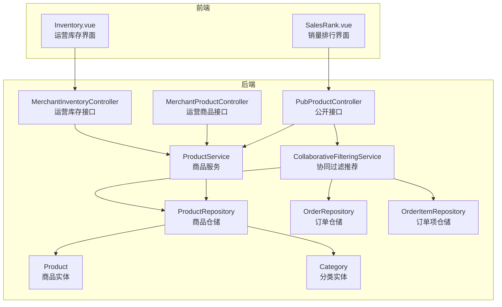
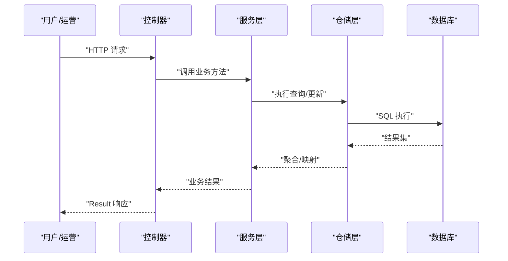
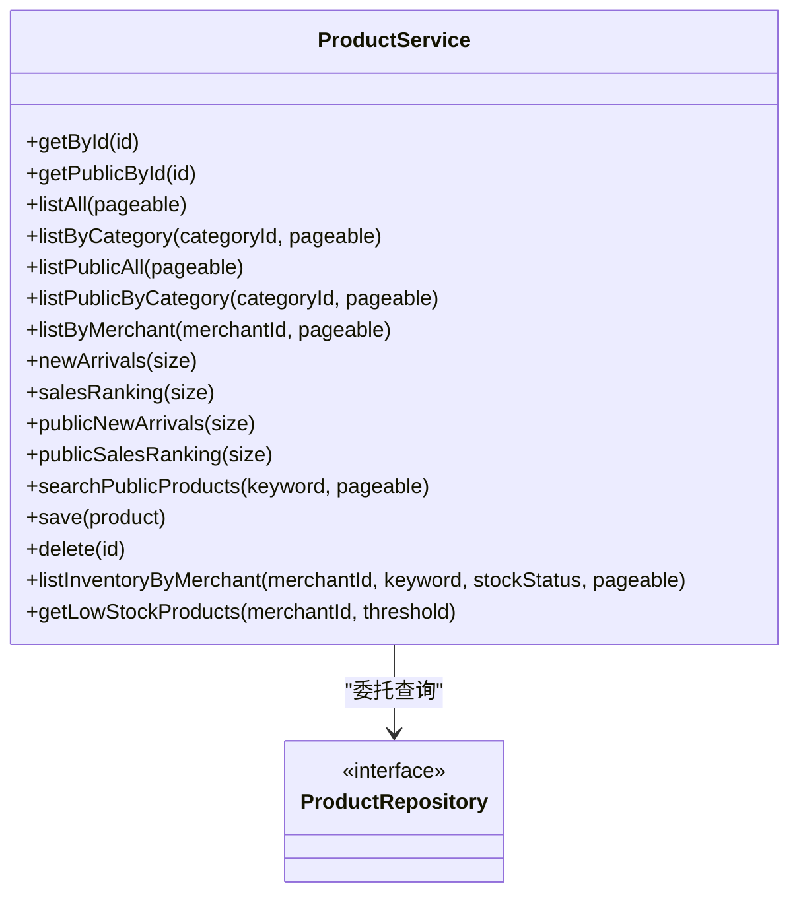
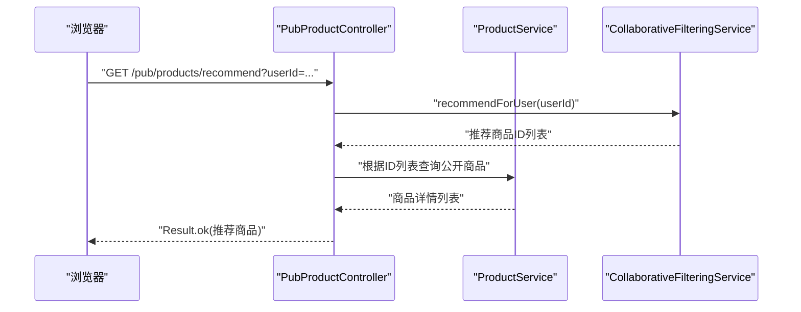
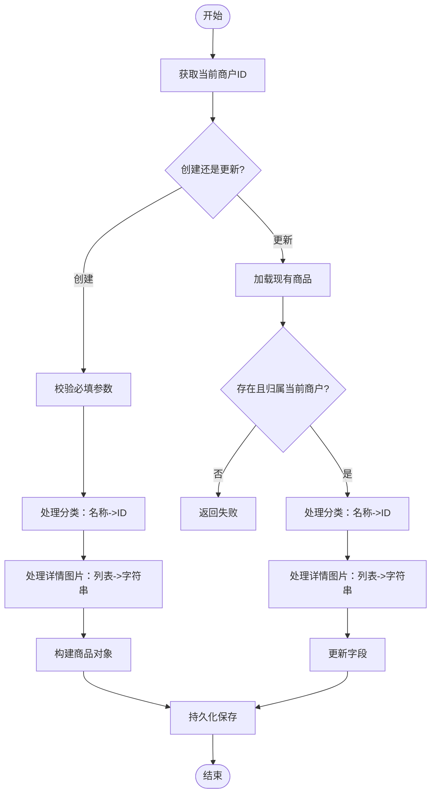
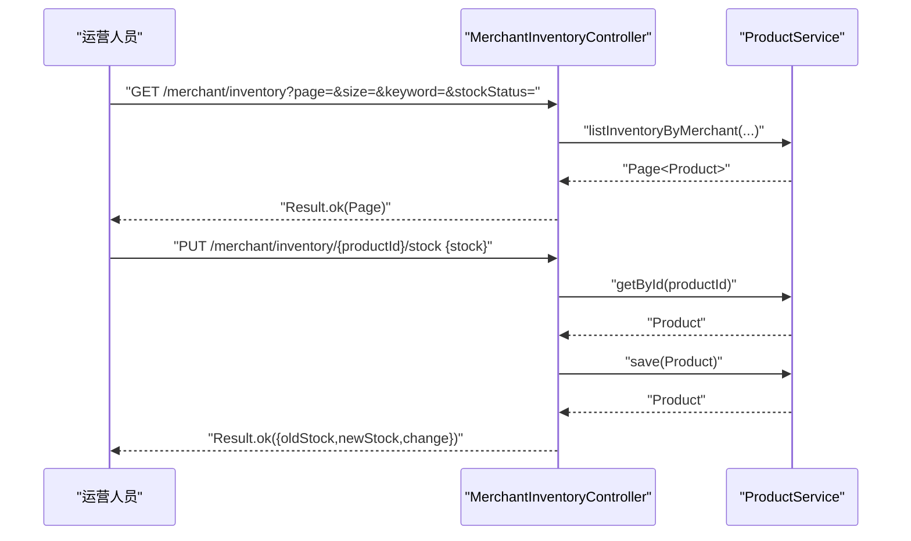
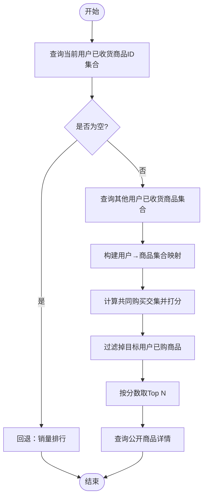
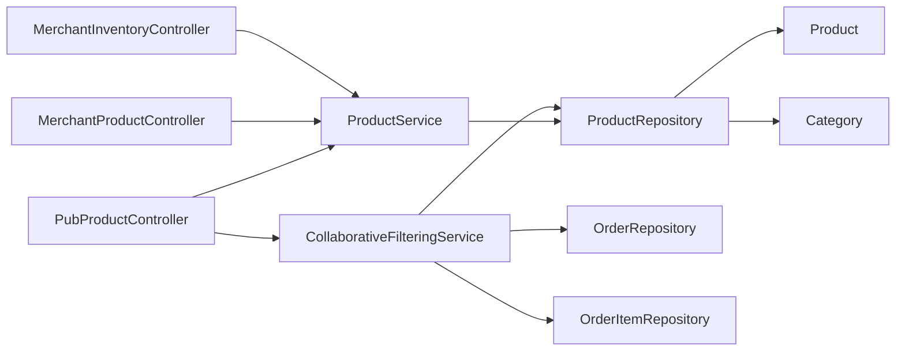

# 商品服务

<cite>
**本文引用的文件**
- [ProductService.java](file://backend/src/main/java/com/mall/service/ProductService.java)
- [PubProductController.java](file://backend/src/main/java/com/mall/controller/pub/PubProductController.java)
- [MerchantProductController.java](file://backend/src/main/java/com/mall/controller/merchant/MerchantProductController.java)
- [Product.java](file://backend/src/main/java/com/mall/entity/Product.java)
- [ProductRepository.java](file://backend/src/main/java/com/mall/repository/ProductRepository.java)
- [CollaborativeFilteringService.java](file://backend/src/main/java/com/mall/service/CollaborativeFilteringService.java)
- [MerchantInventoryController.java](file://backend/src/main/java/com/mall/controller/merchant/MerchantInventoryController.java)
- [OrderItemRepository.java](file://backend/src/main/java/com/mall/repository/OrderItemRepository.java)
- [OrderRepository.java](file://backend/src/main/java/com/mall/repository/OrderRepository.java)
- [Category.java](file://backend/src/main/java/com/mall/entity/Category.java)
- [ProductCreateRequest.java](file://backend/src/main/java/com/mall/dto/ProductCreateRequest.java)
- [Result.java](file://backend/src/main/java/com/mall/dto/Result.java)
- [application.yml](file://backend/src/main/resources/application.yml)
- [Inventory.vue](file://frontend/src/views/merchant/Inventory.vue)
- [SalesRank.vue](file://frontend/src/views/user/SalesRank.vue)
</cite>

## 目录
1. [简介](#简介)
2. [项目结构](#项目结构)
3. [核心组件](#核心组件)
4. [架构总览](#架构总览)
5. [详细组件分析](#详细组件分析)
6. [依赖分析](#依赖分析)
7. [性能考虑](#性能考虑)
8. [故障排查指南](#故障排查指南)
9. [结论](#结论)
10. [附录](#附录)

## 简介
本技术文档围绕电商商城系统的“商品服务”展开，系统性解析商品信息管理、库存控制、商品搜索与推荐算法等核心业务逻辑。文档覆盖商品的增删改查、库存扣减与预警、价格与促销计算、分类管理、详情展示与图片处理、以及基于用户购买行为的协同过滤推荐实现。同时提供性能优化策略、缓存机制建议与并发控制方案，帮助开发者在保证正确性的前提下提升系统吞吐与稳定性。

## 项目结构
后端采用Spring Boot + Spring Data JPA架构，按职责划分为控制器层、服务层、仓储层与领域模型层；前端Vue组件负责运营与用户侧页面交互。商品服务涉及的关键模块如下：
- 控制器层：公开接口控制器与运营接口控制器
- 服务层：商品服务与协同过滤推荐服务
- 仓储层：JPA仓库接口，封装商品、订单项、订单等数据访问
- 领域模型：商品、分类等实体
- DTO与响应封装：请求体与统一响应结构

图表来源
- [PubProductController.java:15-95](file://backend/src/main/java/com/mall/controller/pub/PubProductController.java#L15-L95)
- [MerchantProductController.java:18-180](file://backend/src/main/java/com/mall/controller/merchant/MerchantProductController.java#L18-L180)
- [MerchantInventoryController.java:16-118](file://backend/src/main/java/com/mall/controller/merchant/MerchantInventoryController.java#L16-L118)
- [ProductService.java:15-126](file://backend/src/main/java/com/mall/service/ProductService.java#L15-L126)
- [CollaborativeFilteringService.java:14-81](file://backend/src/main/java/com/mall/service/CollaborativeFilteringService.java#L14-L81)
- [ProductRepository.java:12-125](file://backend/src/main/java/com/mall/repository/ProductRepository.java#L12-L125)
- [OrderRepository.java:13-28](file://backend/src/main/java/com/mall/repository/OrderRepository.java#L13-L28)
- [OrderItemRepository.java:9-20](file://backend/src/main/java/com/mall/repository/OrderItemRepository.java#L9-L20)
- [Product.java:9-101](file://backend/src/main/java/com/mall/entity/Product.java#L9-L101)
- [Category.java:8-41](file://backend/src/main/java/com/mall/entity/Category.java#L8-L41)
- [Inventory.vue:1-679](file://frontend/src/views/merchant/Inventory.vue#L1-L679)
- [SalesRank.vue:1-31](file://frontend/src/views/user/SalesRank.vue#L1-L31)

章节来源
- [application.yml:1-36](file://backend/src/main/resources/application.yml#L1-L36)

## 核心组件
- 商品服务（ProductService）：提供管理端与用户端的商品查询、分页、搜索、销量排行、新品推荐、库存查询与低库存预警等能力，并封装商品保存与删除。
- 协同过滤推荐服务（CollaborativeFilteringService）：基于“共同购买集合大小”对目标用户进行商品相似度打分，生成“猜您想买”推荐列表，无足够数据时回退至销量榜。
- 商品仓储（ProductRepository）：封装JPA查询，包括公开端商品过滤（上架+商家启用）、按分类与关键字搜索、库存相关查询等。
- 订单与订单项仓储（OrderRepository、OrderItemRepository）：提供用户已收货商品ID集合与其它用户已收货商品集合，支撑协同过滤。
- 控制器层：公开接口控制器（PubProductController）与运营接口控制器（MerchantProductController、MerchantInventoryController），分别面向用户与运营侧。
- 实体与DTO：Product、Category、ProductCreateRequest、Result等。

章节来源
- [ProductService.java:15-126](file://backend/src/main/java/com/mall/service/ProductService.java#L15-L126)
- [CollaborativeFilteringService.java:14-81](file://backend/src/main/java/com/mall/service/CollaborativeFilteringService.java#L14-L81)
- [ProductRepository.java:12-125](file://backend/src/main/java/com/mall/repository/ProductRepository.java#L12-L125)
- [OrderRepository.java:13-28](file://backend/src/main/java/com/mall/repository/OrderRepository.java#L13-L28)
- [OrderItemRepository.java:9-20](file://backend/src/main/java/com/mall/repository/OrderItemRepository.java#L9-L20)
- [Product.java:9-101](file://backend/src/main/java/com/mall/entity/Product.java#L9-L101)
- [Category.java:8-41](file://backend/src/main/java/com/mall/entity/Category.java#L8-L41)
- [ProductCreateRequest.java:10-32](file://backend/src/main/java/com/mall/dto/ProductCreateRequest.java#L10-L32)
- [Result.java:7-24](file://backend/src/main/java/com/mall/dto/Result.java#L7-L24)

## 架构总览
商品服务遵循经典的分层架构：
- 表现层：REST控制器接收请求，校验参数与鉴权，调用服务层。
- 领域服务层：业务编排与规则执行，如商品查询、库存调整、推荐生成。
- 数据访问层：JPA仓库封装数据库操作，提供复杂查询与分页。
- 模型层：实体与DTO承载数据结构与传输对象。

图表来源
- [PubProductController.java:24-46](file://backend/src/main/java/com/mall/controller/pub/PubProductController.java#L24-L46)
- [MerchantProductController.java:36-54](file://backend/src/main/java/com/mall/controller/merchant/MerchantProductController.java#L36-L54)
- [MerchantInventoryController.java:33-44](file://backend/src/main/java/com/mall/controller/merchant/MerchantInventoryController.java#L33-L44)
- [ProductService.java:32-55](file://backend/src/main/java/com/mall/service/ProductService.java#L32-L55)
- [ProductRepository.java:15-21](file://backend/src/main/java/com/mall/repository/ProductRepository.java#L15-L21)

## 详细组件分析

### 商品信息服务（ProductService）
- 查询能力
  - 管理端：按ID、分页列出所有上架商品、按分类筛选、按商户筛选、新品与销量排行。
  - 用户端：公开商品列表、公开分类列表、公开详情、公开搜索、公开新品与销量排行。
- 写入与删除：保存商品、删除商品。
- 库存管理：按商户查询商品库存，支持关键词与库存状态过滤；提供低库存商品查询。

图表来源
- [ProductService.java:15-126](file://backend/src/main/java/com/mall/service/ProductService.java#L15-L126)
- [ProductRepository.java:12-125](file://backend/src/main/java/com/mall/repository/ProductRepository.java#L12-L125)

章节来源
- [ProductService.java:22-124](file://backend/src/main/java/com/mall/service/ProductService.java#L22-L124)
- [ProductRepository.java:15-123](file://backend/src/main/java/com/mall/repository/ProductRepository.java#L15-L123)

### 公开商品接口（PubProductController）
- 提供用户侧商品列表、分类过滤、关键字搜索、排序、详情查询、新品与销量排行、协同过滤推荐。
- 排序字段映射：价格、销量、创建时间。
- 推荐接口：需要传入用户ID，调用协同过滤服务生成推荐列表。

图表来源
- [PubProductController.java:85-93](file://backend/src/main/java/com/mall/controller/pub/PubProductController.java#L85-L93)
- [CollaborativeFilteringService.java:32-75](file://backend/src/main/java/com/mall/service/CollaborativeFilteringService.java#L32-L75)
- [ProductRepository.java:77-83](file://backend/src/main/java/com/mall/repository/ProductRepository.java#L77-L83)

章节来源
- [PubProductController.java:24-93](file://backend/src/main/java/com/mall/controller/pub/PubProductController.java#L24-L93)

### 运营商品接口（MerchantProductController）
- 获取当前运营ID（从登录用户映射到商户ID）。
- 列表、详情、创建、更新、删除商品。
- 创建/更新时支持按分类名自动创建或复用顶级分类，处理详情图片列表转逗号分隔字符串。
- 参数校验：名称、价格、库存等。

图表来源
- [MerchantProductController.java:28-114](file://backend/src/main/java/com/mall/controller/merchant/MerchantProductController.java#L28-L114)
- [ProductCreateRequest.java:14-31](file://backend/src/main/java/com/mall/dto/ProductCreateRequest.java#L14-L31)
- [Category.java:15-41](file://backend/src/main/java/com/mall/entity/Category.java#L15-L41)

章节来源
- [MerchantProductController.java:28-178](file://backend/src/main/java/com/mall/controller/merchant/MerchantProductController.java#L28-L178)

### 库存管理接口（MerchantInventoryController）
- 支持分页查询库存、关键词与库存状态过滤。
- 单个与批量调整库存，记录变更前后值。
- 库存预警：查询低于阈值的商品。

图表来源
- [MerchantInventoryController.java:33-108](file://backend/src/main/java/com/mall/controller/merchant/MerchantInventoryController.java#L33-L108)
- [ProductService.java:94-124](file://backend/src/main/java/com/mall/service/ProductService.java#L94-L124)

章节来源
- [MerchantInventoryController.java:33-118](file://backend/src/main/java/com/mall/controller/merchant/MerchantInventoryController.java#L33-L118)

### 协同过滤推荐算法（CollaborativeFilteringService）
- 输入：用户ID
- 步骤：
  1) 获取当前用户已收货商品ID集合；
  2) 获取其他用户的已收货商品集合，形成用户→商品集合映射；
  3) 计算目标用户与其他用户的交集（共同购买商品），阈值为最小共同物品数；
  4) 对其他用户未购买但目标用户未购买的商品进行相似度打分（按共同购买数加总）；
  5) 按分数降序取Top N，查询公开商品详情；
  6) 若无足够数据，回退至公开销量排行。
- 输出：商品列表（公开且上架）。

图表来源
- [CollaborativeFilteringService.java:29-79](file://backend/src/main/java/com/mall/service/CollaborativeFilteringService.java#L29-L79)
- [OrderItemRepository.java:13-18](file://backend/src/main/java/com/mall/repository/OrderItemRepository.java#L13-L18)
- [ProductRepository.java:77-83](file://backend/src/main/java/com/mall/repository/ProductRepository.java#L77-L83)

章节来源
- [CollaborativeFilteringService.java:29-79](file://backend/src/main/java/com/mall/service/CollaborativeFilteringService.java#L29-L79)

### 商品实体与图片处理
- 商品实体包含基础信息、价格、库存、上下架状态、新品标记、创建/更新时间等。
- 图片字段：
  - 主图：image
  - 多图列表：imageList（逗号分隔）
  - 详情轮播图：detailImages（逗号分隔）
- 前端传入图片数组时，后端将其合并为逗号分隔字符串存储，便于展示与检索。

章节来源
- [Product.java:16-100](file://backend/src/main/java/com/mall/entity/Product.java#L16-L100)
- [ProductCreateRequest.java:14-31](file://backend/src/main/java/com/mall/dto/ProductCreateRequest.java#L14-L31)
- [MerchantProductController.java:87-93](file://backend/src/main/java/com/mall/controller/merchant/MerchantProductController.java#L87-L93)

### 商品搜索与分类管理
- 搜索：用户侧搜索仅返回“上架且商家启用”的商品，支持名称或描述模糊匹配。
- 分类：支持按分类ID过滤；创建/更新时可按分类名称自动创建顶级分类。
- 排行：新品与销量排行均提供公开与内部两种视图。

章节来源
- [ProductRepository.java:85-105](file://backend/src/main/java/com/mall/repository/ProductRepository.java#L85-L105)
- [ProductRepository.java:46-75](file://backend/src/main/java/com/mall/repository/ProductRepository.java#L46-L75)
- [MerchantProductController.java:69-85](file://backend/src/main/java/com/mall/controller/merchant/MerchantProductController.java#L69-L85)

## 依赖分析
- 控制器依赖服务：公开与运营控制器均注入商品服务与协同过滤服务。
- 服务依赖仓储：商品服务依赖商品仓储；协同过滤服务依赖订单与商品仓储。
- 实体依赖：商品实体关联分类；订单与订单项实体用于推荐计算。
- 前端依赖：运营库存界面与销量排行界面通过API调用后端接口。

图表来源
- [PubProductController.java:21-22](file://backend/src/main/java/com/mall/controller/pub/PubProductController.java#L21-L22)
- [MerchantProductController.java:24-26](file://backend/src/main/java/com/mall/controller/merchant/MerchantProductController.java#L24-L26)
- [MerchantInventoryController.java:22-23](file://backend/src/main/java/com/mall/controller/merchant/MerchantInventoryController.java#L22-L23)
- [ProductService.java](file://backend/src/main/java/com/mall/service/ProductService.java#L20)
- [CollaborativeFilteringService.java:22-24](file://backend/src/main/java/com/mall/service/CollaborativeFilteringService.java#L22-L24)
- [ProductRepository.java](file://backend/src/main/java/com/mall/repository/ProductRepository.java#L13)
- [OrderRepository.java](file://backend/src/main/java/com/mall/repository/OrderRepository.java#L13)
- [OrderItemRepository.java](file://backend/src/main/java/com/mall/repository/OrderItemRepository.java#L9)
- [Product.java:9-101](file://backend/src/main/java/com/mall/entity/Product.java#L9-L101)
- [Category.java:8-41](file://backend/src/main/java/com/mall/entity/Category.java#L8-L41)

章节来源
- [PubProductController.java:15-95](file://backend/src/main/java/com/mall/controller/pub/PubProductController.java#L15-L95)
- [MerchantProductController.java:18-180](file://backend/src/main/java/com/mall/controller/merchant/MerchantProductController.java#L18-L180)
- [MerchantInventoryController.java:16-118](file://backend/src/main/java/com/mall/controller/merchant/MerchantInventoryController.java#L16-L118)
- [ProductService.java:15-126](file://backend/src/main/java/com/mall/service/ProductService.java#L15-L126)
- [CollaborativeFilteringService.java:14-81](file://backend/src/main/java/com/mall/service/CollaborativeFilteringService.java#L14-L81)
- [ProductRepository.java:12-125](file://backend/src/main/java/com/mall/repository/ProductRepository.java#L12-L125)
- [OrderRepository.java:13-28](file://backend/src/main/java/com/mall/repository/OrderRepository.java#L13-L28)
- [OrderItemRepository.java:9-20](file://backend/src/main/java/com/mall/repository/OrderItemRepository.java#L9-L20)
- [Product.java:9-101](file://backend/src/main/java/com/mall/entity/Product.java#L9-L101)
- [Category.java:8-41](file://backend/src/main/java/com/mall/entity/Category.java#L8-L41)

## 性能考虑
- 查询优化
  - 使用分页与排序：控制器构建排序规范，仓储使用原生或JPQL避免N+1。
  - 公开查询统一过滤“上架+商家启用”，减少无效数据扫描。
- 推荐算法优化
  - 将“其他用户已收货商品集合”以Map缓存短期内存中，降低重复扫描成本。
  - 设置最小共同物品阈值与Top N限制，控制推荐计算规模。
- 库存查询优化
  - 关键字与库存状态组合查询使用索引列（名称、库存、商户ID）。
  - 批量更新时尽量合并事务，减少往返次数。
- 缓存策略
  - 商品详情与热门榜单（新品、销量）可引入Redis缓存，设置合理过期时间。
  - 推荐结果可按用户维度缓存短期有效结果，降低实时计算压力。
- 并发控制
  - 库存扣减采用乐观锁或悲观锁，结合分布式锁防止超卖。
  - 推荐计算采用读写分离或只读副本，避免阻塞主库。
- 数据库与连接池
  - 合理配置连接池大小、超时时间与最大活跃连接数。
  - 开启慢查询日志与SQL格式化，定期审查热点SQL。

## 故障排查指南
- 商品不存在或无权限
  - 运营端详情/更新/删除需校验商品归属当前商户ID，否则返回失败。
- 参数校验失败
  - 商品名称、价格、库存等必填与范围校验不通过时返回错误提示。
- 推荐无结果
  - 当前用户无已收货商品或与其他用户共同购买不足，将回退至销量排行。
- 库存调整异常
  - 库存必须为非负数；批量更新时任一商品非法将拒绝整个批次。
- 前端集成问题
  - 库存管理界面支持快速调整与批量调整，注意校验与错误提示。

章节来源
- [MerchantProductController.java:48-53](file://backend/src/main/java/com/mall/controller/merchant/MerchantProductController.java#L48-L53)
- [MerchantProductController.java:118-122](file://backend/src/main/java/com/mall/controller/merchant/MerchantProductController.java#L118-L122)
- [MerchantInventoryController.java:51-56](file://backend/src/main/java/com/mall/controller/merchant/MerchantInventoryController.java#L51-L56)
- [MerchantInventoryController.java:83-95](file://backend/src/main/java/com/mall/controller/merchant/MerchantInventoryController.java#L83-L95)
- [CollaborativeFilteringService.java:34-37](file://backend/src/main/java/com/mall/service/CollaborativeFilteringService.java#L34-L37)
- [CollaborativeFilteringService.java:62-64](file://backend/src/main/java/com/mall/service/CollaborativeFilteringService.java#L62-L64)
- [Inventory.vue:488-511](file://frontend/src/views/merchant/Inventory.vue#L488-L511)
- [Inventory.vue:622-642](file://frontend/src/views/merchant/Inventory.vue#L622-L642)

## 结论
商品服务通过清晰的分层设计与完善的仓储查询，实现了商品信息管理、库存控制、搜索与排行等核心功能；协同过滤推荐在无足够数据时具备稳健的回退策略。结合缓存与并发控制优化，可在高并发场景下保持稳定与高性能。建议持续关注SQL性能、缓存命中率与库存一致性，确保系统长期可靠运行。

## 附录
- 统一响应结构：Result封装code、message与data，便于前后端一致处理。
- 配置参考：数据库连接、JPA方言与日志级别等在应用配置文件中集中管理。

章节来源
- [Result.java:7-24](file://backend/src/main/java/com/mall/dto/Result.java#L7-L24)
- [application.yml:1-36](file://backend/src/main/resources/application.yml#L1-L36)