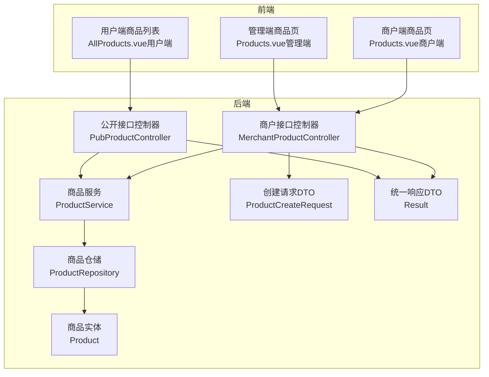
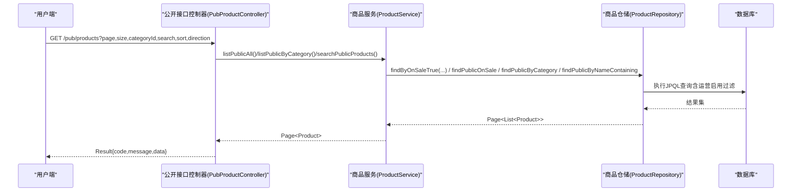
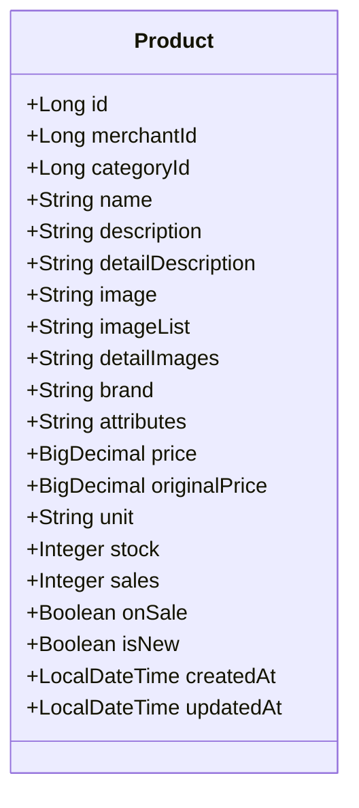
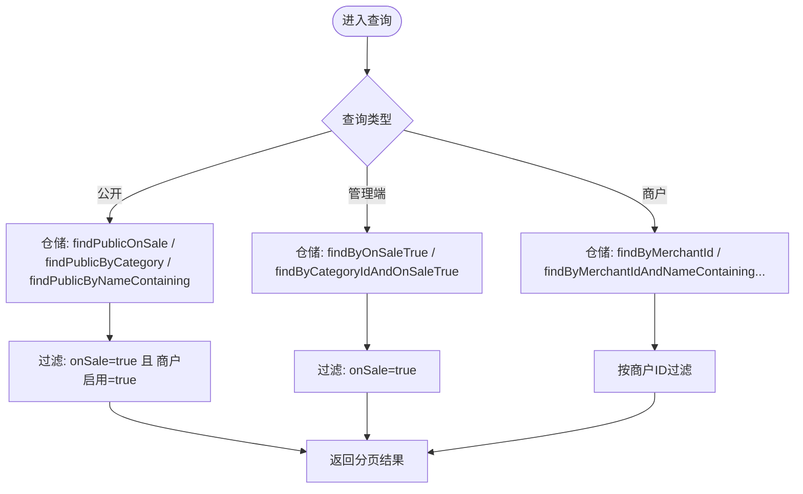
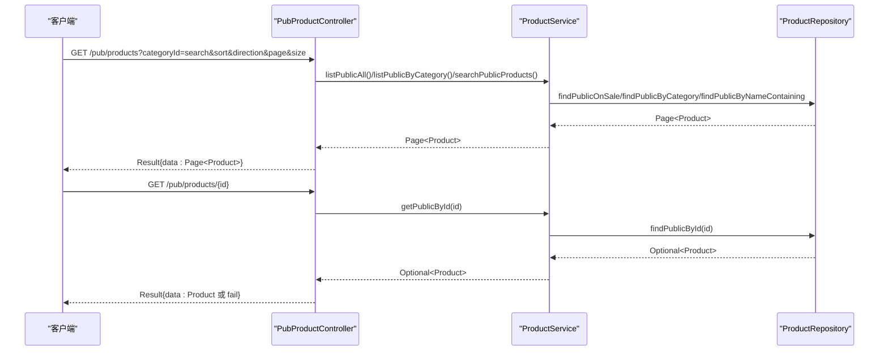
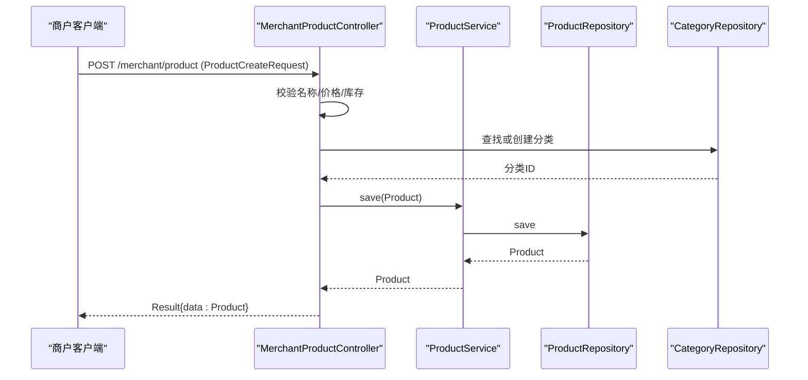
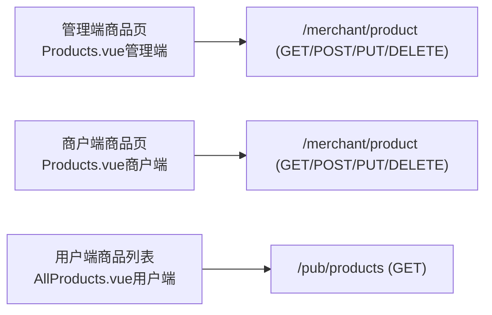
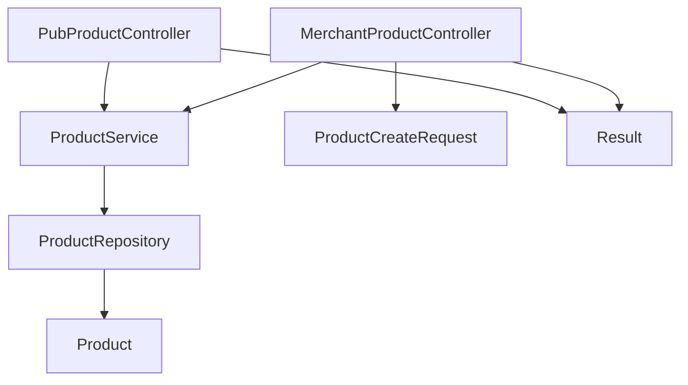

# 商品管理

<cite>
**本文引用的文件**
- [Product.java](file://backend/src/main/java/com/mall/entity/Product.java)
- [ProductService.java](file://backend/src/main/java/com/mall/service/ProductService.java)
- [ProductRepository.java](file://backend/src/main/java/com/mall/repository/ProductRepository.java)
- [PubProductController.java](file://backend/src/main/java/com/mall/controller/pub/PubProductController.java)
- [MerchantProductController.java](file://backend/src/main/java/com/mall/controller/merchant/MerchantProductController.java)
- [ProductCreateRequest.java](file://backend/src/main/java/com/mall/dto/ProductCreateRequest.java)
- [Result.java](file://backend/src/main/java/com/mall/dto/Result.java)
- [Category.java](file://backend/src/main/java/com/mall/entity/Category.java)
- [application.yml](file://backend/src/main/resources/application.yml)
- [Products.vue（管理端）](file://frontend/src/views/admin/Products.vue)
- [Products.vue（商户端）](file://frontend/src/views/merchant/Products.vue)
- [AllProducts.vue（用户端）](file://frontend/src/views/user/AllProducts.vue)
</cite>

## 目录
1. [简介](#简介)
2. [项目结构](#项目结构)
3. [核心组件](#核心组件)
4. [架构总览](#架构总览)
5. [详细组件分析](#详细组件分析)
6. [依赖分析](#依赖分析)
7. [性能考虑](#性能考虑)
8. [故障排查指南](#故障排查指南)
9. [结论](#结论)
10. [附录](#附录)

## 简介
本技术文档围绕电商商城系统的“商品管理”功能展开，系统性解析商品的增删改查、信息维护、状态管理、分页与筛选、以及管理端与用户端查询差异。重点覆盖以下方面：
- 商品实体模型与字段语义
- 控制层（管理端/商户端/公开端）接口职责与调用链
- 服务层对仓储层的封装与业务规则
- 仓储层的查询方法与公开查询的双重过滤（上架+运营启用）
- 前端页面与接口的交互方式（分页、分类筛选、搜索、排序）
- 数据校验规则、业务约束与错误处理策略
- 使用场景与扩展建议

## 项目结构
后端采用分层架构：controller（控制器）、service（服务）、repository（仓储）、entity（实体）、dto（数据传输对象），配合前端 Vue 单页应用进行页面渲染与交互。

图表来源
- [PubProductController.java:1-95](file://backend/src/main/java/com/mall/controller/pub/PubProductController.java#L1-L95)
- [MerchantProductController.java:1-180](file://backend/src/main/java/com/mall/controller/merchant/MerchantProductController.java#L1-L180)
- [ProductService.java:1-126](file://backend/src/main/java/com/mall/service/ProductService.java#L1-L126)
- [ProductRepository.java:1-125](file://backend/src/main/java/com/mall/repository/ProductRepository.java#L1-L125)
- [Product.java:1-101](file://backend/src/main/java/com/mall/entity/Product.java#L1-L101)
- [ProductCreateRequest.java:1-32](file://backend/src/main/java/com/mall/dto/ProductCreateRequest.java#L1-L32)
- [Result.java:1-24](file://backend/src/main/java/com/mall/dto/Result.java#L1-L24)

章节来源
- [application.yml:1-36](file://backend/src/main/resources/application.yml#L1-L36)

## 核心组件
- 商品实体（Product）：承载商品基本信息、价格、库存、上下架状态、新品标记、创建/更新时间等；提供持久化前后钩子以维护时间戳。
- 商品仓储（ProductRepository）：封装基础分页查询、按分类/商户过滤、公开查询（上架且运营启用）、搜索、销量与新品排行、库存管理查询等。
- 商品服务（ProductService）：面向控制器暴露业务方法，负责分页、筛选、搜索、排行、库存查询等；区分管理端与公开端查询策略。
- 公开接口控制器（PubProductController）：用户端商品列表、详情、新品、销量排行、搜索、推荐等。
- 商户接口控制器（MerchantProductController）：商户端商品 CRUD、分类自动创建/复用、图片字段处理、权限校验（仅当前商户）。
- 请求/响应 DTO：ProductCreateRequest 用于创建/更新；Result 提供统一响应结构。
- 前端页面：管理端、商户端、用户端分别对应不同的查询与操作入口。

章节来源
- [Product.java:1-101](file://backend/src/main/java/com/mall/entity/Product.java#L1-L101)
- [ProductRepository.java:1-125](file://backend/src/main/java/com/mall/repository/ProductRepository.java#L1-L125)
- [ProductService.java:1-126](file://backend/src/main/java/com/mall/service/ProductService.java#L1-L126)
- [PubProductController.java:1-95](file://backend/src/main/java/com/mall/controller/pub/PubProductController.java#L1-L95)
- [MerchantProductController.java:1-180](file://backend/src/main/java/com/mall/controller/merchant/MerchantProductController.java#L1-L180)
- [ProductCreateRequest.java:1-32](file://backend/src/main/java/com/mall/dto/ProductCreateRequest.java#L1-L32)
- [Result.java:1-24](file://backend/src/main/java/com/mall/dto/Result.java#L1-L24)
- [Products.vue（管理端）:1-344](file://frontend/src/views/admin/Products.vue#L1-L344)
- [Products.vue（商户端）:1-400](file://frontend/src/views/merchant/Products.vue#L1-L400)
- [AllProducts.vue（用户端）:1-561](file://frontend/src/views/user/AllProducts.vue#L1-L561)

## 架构总览
系统遵循“控制器-服务-仓储-实体”的分层设计，公开查询在仓储层通过 JPQL 实现“上架且运营启用”的双重过滤，确保用户端只看到有效商品。

图表来源
- [PubProductController.java:24-46](file://backend/src/main/java/com/mall/controller/pub/PubProductController.java#L24-L46)
- [ProductService.java:42-82](file://backend/src/main/java/com/mall/service/ProductService.java#L42-L82)
- [ProductRepository.java:34-105](file://backend/src/main/java/com/mall/repository/ProductRepository.java#L34-L105)

## 详细组件分析

### 商品实体与状态管理
- 字段要点
  - 主键、商户ID、分类ID、名称、描述、详情描述、主图与多图、品牌、属性、价格与原价、单位、库存、销量、上下架状态、新品标记、创建/更新时间。
  - 上下架状态默认为“上架”，新品默认为“否”。
- 时间戳
  - 使用持久化/更新前钩子维护 createdAt 与 updatedAt。
- 状态控制
  - 上架状态（onSale）决定商品是否对外展示；
  - 运营启用状态（通过与商户启用关联实现）决定商品是否参与公开查询。

图表来源
- [Product.java:16-100](file://backend/src/main/java/com/mall/entity/Product.java#L16-L100)

章节来源
- [Product.java:1-101](file://backend/src/main/java/com/mall/entity/Product.java#L1-L101)

### 公开查询与管理端/商户端查询差异
- 公开查询（用户端）
  - 仅返回“上架且运营启用”的商品；
  - 仓储层通过 JPQL 在查询与计数中同时加入“商户启用”限制；
  - 支持按分类、关键词搜索、分页与排序。
- 管理端查询
  - 返回“仅上架”的商品列表；
  - 支持按分类、分页、搜索（名称或描述模糊匹配）。
- 商户端查询
  - 返回当前商户下的商品，包含已下架商品；
  - 支持按关键字与库存状态筛选。

图表来源
- [ProductRepository.java:17-105](file://backend/src/main/java/com/mall/repository/ProductRepository.java#L17-L105)
- [ProductService.java:32-82](file://backend/src/main/java/com/mall/service/ProductService.java#L32-L82)

章节来源
- [ProductRepository.java:34-105](file://backend/src/main/java/com/mall/repository/ProductRepository.java#L34-L105)
- [ProductService.java:32-82](file://backend/src/main/java/com/mall/service/ProductService.java#L32-L82)

### 公开接口：商品列表、详情、搜索、排行与推荐
- 列表与筛选
  - 支持分页、分类过滤、关键词搜索、排序（价格/销量/时间）。
- 详情查询
  - 仅返回“上架且运营启用”的商品。
- 新品与销量排行
  - 基于 onSale=true 的公开查询。
- 搜索
  - 支持名称或描述模糊匹配。
- 推荐
  - 协同过滤推荐（需传入用户ID）。

图表来源
- [PubProductController.java:24-93](file://backend/src/main/java/com/mall/controller/pub/PubProductController.java#L24-L93)
- [ProductService.java:42-82](file://backend/src/main/java/com/mall/service/ProductService.java#L42-L82)
- [ProductRepository.java:85-91](file://backend/src/main/java/com/mall/repository/ProductRepository.java#L85-L91)

章节来源
- [PubProductController.java:1-95](file://backend/src/main/java/com/mall/controller/pub/PubProductController.java#L1-L95)

### 商户接口：商品 CRUD 与分类自动处理
- 权限与身份
  - 通过认证信息获取当前商户ID，仅允许操作本商户商品。
- 创建商品
  - 校验名称、价格、库存；
  - 若提供自定义分类名称则自动创建/复用顶级分类；
  - 将图片数组转换为逗号分隔字符串存储到 detailImages。
- 更新商品
  - 同样支持分类自动处理与图片字段转换；
  - 仅允许更新本商户商品。
- 删除商品
  - 仅允许删除本商户商品。

图表来源
- [MerchantProductController.java:56-114](file://backend/src/main/java/com/mall/controller/merchant/MerchantProductController.java#L56-L114)
- [ProductService.java:84-87](file://backend/src/main/java/com/mall/service/ProductService.java#L84-L87)
- [ProductRepository.java:15-15](file://backend/src/main/java/com/mall/repository/ProductRepository.java#L15-L15)
- [Category.java:15-41](file://backend/src/main/java/com/mall/entity/Category.java#L15-L41)

章节来源
- [MerchantProductController.java:1-180](file://backend/src/main/java/com/mall/controller/merchant/MerchantProductController.java#L1-L180)
- [ProductCreateRequest.java:1-32](file://backend/src/main/java/com/mall/dto/ProductCreateRequest.java#L1-L32)
- [Category.java:1-41](file://backend/src/main/java/com/mall/entity/Category.java#L1-L41)

### 前端集成与交互
- 管理端商品页
  - 展示所有商品，支持分页与操作（编辑/详情/删除）。
- 商户端商品页
  - 展示当前商户商品，支持分页与操作（编辑/详情/删除）。
- 用户端商品列表
  - 支持分类筛选、关键词搜索、排序（综合/价格/销量），分页加载商品卡片。

图表来源
- [Products.vue（管理端）:141-226](file://frontend/src/views/admin/Products.vue#L141-L226)
- [Products.vue（商户端）:141-226](file://frontend/src/views/merchant/Products.vue#L141-L226)
- [AllProducts.vue（用户端）:186-261](file://frontend/src/views/user/AllProducts.vue#L186-L261)

章节来源
- [Products.vue（管理端）:1-344](file://frontend/src/views/admin/Products.vue#L1-L344)
- [Products.vue（商户端）:1-400](file://frontend/src/views/merchant/Products.vue#L1-L400)
- [AllProducts.vue（用户端）:1-561](file://frontend/src/views/user/AllProducts.vue#L1-L561)

## 依赖分析
- 控制器依赖服务层，服务层依赖仓储层，仓储层依赖实体与数据库。
- 公开查询依赖 JPQL 中对“商户启用”的联表过滤，确保业务一致性。
- 商户端创建/更新流程依赖分类仓储以实现“自定义分类名自动创建/复用”。

图表来源
- [PubProductController.java:1-95](file://backend/src/main/java/com/mall/controller/pub/PubProductController.java#L1-L95)
- [MerchantProductController.java:1-180](file://backend/src/main/java/com/mall/controller/merchant/MerchantProductController.java#L1-L180)
- [ProductService.java:1-126](file://backend/src/main/java/com/mall/service/ProductService.java#L1-L126)
- [ProductRepository.java:1-125](file://backend/src/main/java/com/mall/repository/ProductRepository.java#L1-L125)
- [Product.java:1-101](file://backend/src/main/java/com/mall/entity/Product.java#L1-L101)
- [ProductCreateRequest.java:1-32](file://backend/src/main/java/com/mall/dto/ProductCreateRequest.java#L1-L32)
- [Result.java:1-24](file://backend/src/main/java/com/mall/dto/Result.java#L1-L24)

## 性能考虑
- 分页与排序
  - 使用 PageRequest 与 Sort 规范分页与排序，避免一次性加载全量数据。
- 查询优化
  - 公开查询在仓储层统一加入“商户启用”过滤，减少前端重复处理。
  - 搜索使用 LIKE 模糊匹配，建议在名称与描述字段建立索引以提升性能。
- 图片字段
  - detailImages 存储逗号分隔的图片URL，便于前端轮播展示，注意长度与存储空间控制。
- 排行与新品
  - 新品与销量排行使用排序查询，建议在 createdAt 与 sales 字段建立索引。

## 故障排查指南
- 响应结构
  - 统一使用 Result 包裹响应，code=200 表示成功，其他表示失败，携带 message 与 data。
- 常见错误
  - 商品不存在：当查询不到或越权访问时返回失败提示。
  - 非运营账号：商户端创建/更新时若用户未绑定商户ID将抛出异常。
  - 参数校验失败：名称为空、价格非正、库存为负等将被拒绝。
- 建议
  - 前端根据 Result.code 与 message 进行提示；
  - 日志级别已在配置中设置，便于定位问题。

章节来源
- [Result.java:16-22](file://backend/src/main/java/com/mall/dto/Result.java#L16-L22)
- [MerchantProductController.java:29-34](file://backend/src/main/java/com/mall/controller/merchant/MerchantProductController.java#L29-L34)
- [MerchantProductController.java:59-67](file://backend/src/main/java/com/mall/controller/merchant/MerchantProductController.java#L59-L67)

## 结论
本商品管理模块通过清晰的分层设计与严格的查询过滤，实现了管理端、商户端与用户端的差异化需求。公开查询在仓储层强制执行“上架+运营启用”双条件，保障了用户端数据的一致性与安全性。服务层与控制器层职责明确，便于扩展与维护。建议后续在搜索与排行场景引入索引优化，并完善图片资源的清理与压缩策略。

## 附录
- 配置参考
  - 数据源与 JPA 配置位于 application.yml，包含数据库连接、方言、DDL 策略与日志级别等。
- 前端页面要点
  - 管理端与商户端均支持分页与操作按钮；
  - 用户端支持分类筛选、关键词搜索与多种排序方式。

章节来源
- [application.yml:1-36](file://backend/src/main/resources/application.yml#L1-L36)
- [Products.vue（管理端）:141-226](file://frontend/src/views/admin/Products.vue#L141-L226)
- [Products.vue（商户端）:141-226](file://frontend/src/views/merchant/Products.vue#L141-L226)
- [AllProducts.vue（用户端）:186-261](file://frontend/src/views/user/AllProducts.vue#L186-L261)