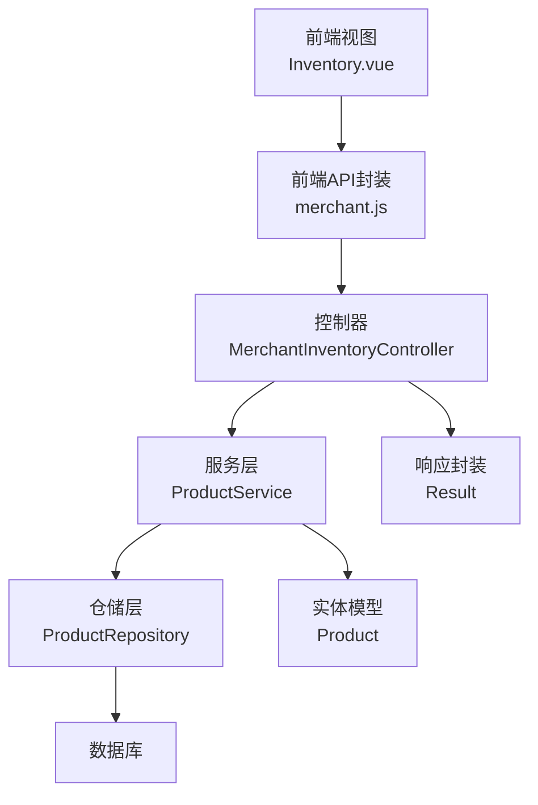
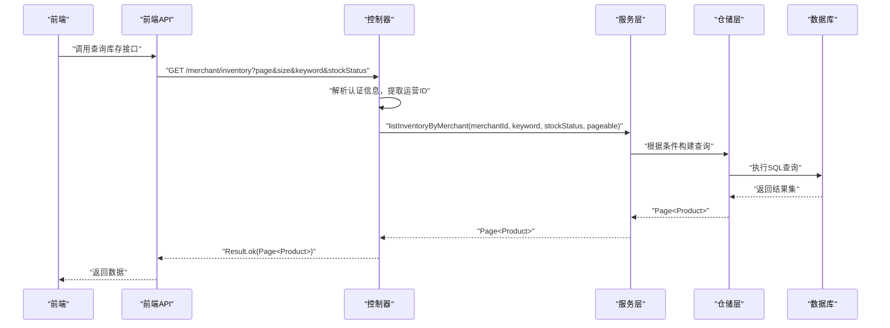
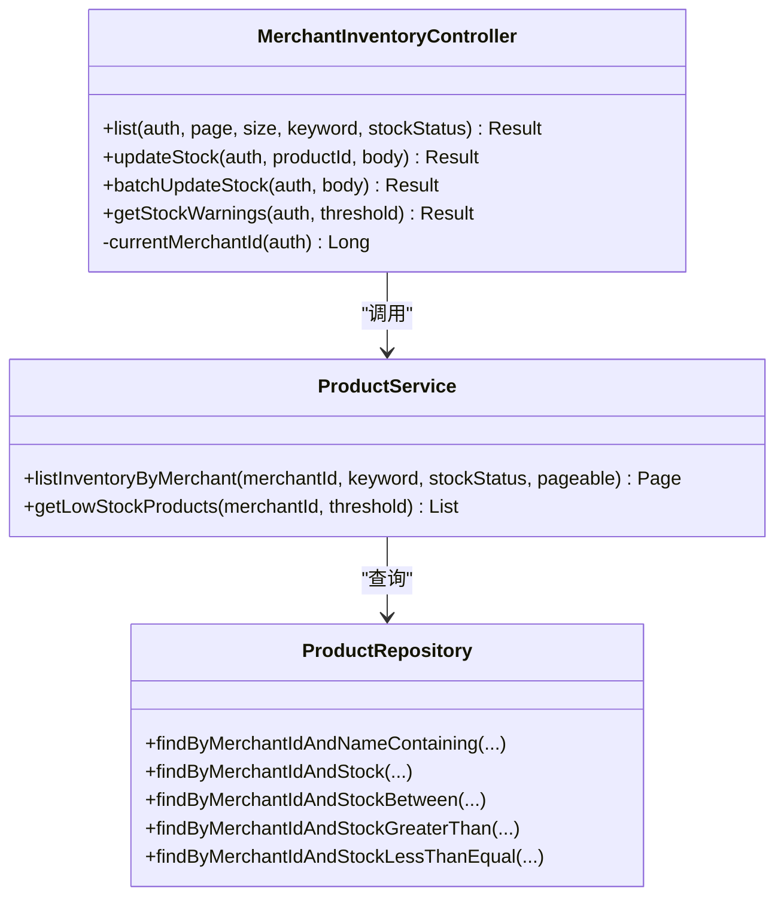
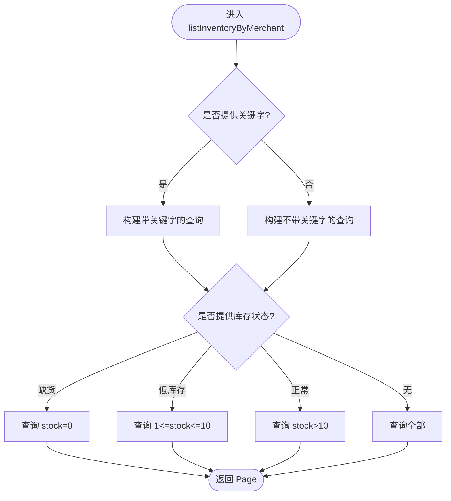
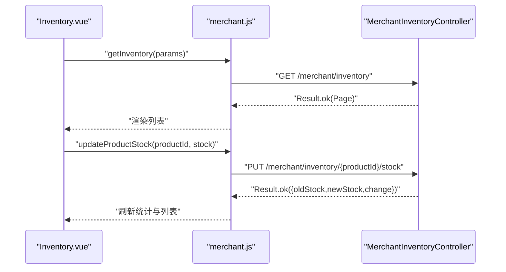
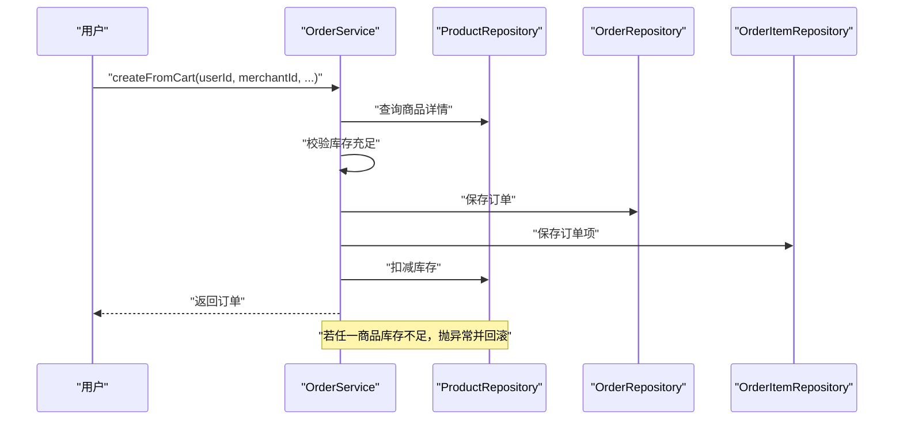
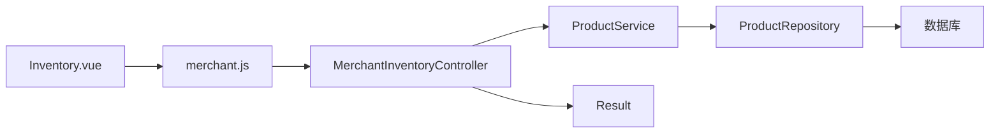

# 库存管理

<cite>
**本文引用的文件**
- [MerchantInventoryController.java](file://backend/src/main/java/com/mall/controller/merchant/MerchantInventoryController.java)
- [ProductService.java](file://backend/src/main/java/com/mall/service/ProductService.java)
- [ProductRepository.java](file://backend/src/main/java/com/mall/repository/ProductRepository.java)
- [Product.java](file://backend/src/main/java/com/mall/entity/Product.java)
- [OrderService.java](file://backend/src/main/java/com/mall/service/OrderService.java)
- [Inventory.vue](file://frontend/src/views/merchant/Inventory.vue)
- [merchant.js](file://frontend/src/api/merchant.js)
- [application.yml](file://backend/src/main/resources/application.yml)
- [Result.java](file://backend/src/main/java/com/mall/dto/Result.java)
</cite>

## 目录
1. [简介](#简介)
2. [项目结构](#项目结构)
3. [核心组件](#核心组件)
4. [架构总览](#架构总览)
5. [详细组件分析](#详细组件分析)
6. [依赖分析](#依赖分析)
7. [性能考虑](#性能考虑)
8. [故障排查指南](#故障排查指南)
9. [结论](#结论)
10. [附录](#附录)

## 简介
本技术文档聚焦电商商城系统的库存管理功能，围绕以下目标展开：
- 深入解析库存查询、库存调整、库存预警等核心业务逻辑
- 详解按商家维度查询商品库存的方法，包括关键字搜索、库存状态筛选
- 解释缺货、低库存、正常库存的状态判断标准与处理策略
- 提供库存管理最佳实践，涵盖库存扣减的并发控制、库存不足时的处理机制
- 说明库存数据的准确性保证、库存同步策略与性能优化方案
- 给出具体使用示例与常见问题解决方案

## 项目结构
后端采用 Spring Boot + JPA 的分层架构，前端基于 Vue + Element UI 实现运营端库存管理界面。库存管理相关模块分布如下：
- 控制器层：运营端库存控制器，提供库存查询、调整、预警接口
- 服务层：商品服务，封装库存相关的查询与统计逻辑
- 数据访问层：商品仓储，提供库存相关的 JPA 查询方法
- 实体层：商品实体，包含库存字段与基础属性
- 前端视图与 API：运营端库存页面与调用的接口封装

图表来源
- [MerchantInventoryController.java:1-118](file://backend/src/main/java/com/mall/controller/merchant/MerchantInventoryController.java#L1-L118)
- [ProductService.java:1-126](file://backend/src/main/java/com/mall/service/ProductService.java#L1-L126)
- [ProductRepository.java:1-125](file://backend/src/main/java/com/mall/repository/ProductRepository.java#L1-L125)
- [Product.java:1-101](file://backend/src/main/java/com/mall/entity/Product.java#L1-L101)
- [Inventory.vue:1-823](file://frontend/src/views/merchant/Inventory.vue#L1-L823)
- [merchant.js:1-135](file://frontend/src/api/merchant.js#L1-L135)
- [Result.java:1-24](file://backend/src/main/java/com/mall/dto/Result.java#L1-L24)

章节来源
- [MerchantInventoryController.java:1-118](file://backend/src/main/java/com/mall/controller/merchant/MerchantInventoryController.java#L1-L118)
- [ProductService.java:1-126](file://backend/src/main/java/com/mall/service/ProductService.java#L1-L126)
- [ProductRepository.java:1-125](file://backend/src/main/java/com/mall/repository/ProductRepository.java#L1-L125)
- [Product.java:1-101](file://backend/src/main/java/com/mall/entity/Product.java#L1-L101)
- [Inventory.vue:1-823](file://frontend/src/views/merchant/Inventory.vue#L1-L823)
- [merchant.js:1-135](file://frontend/src/api/merchant.js#L1-L135)
- [Result.java:1-24](file://backend/src/main/java/com/mall/dto/Result.java#L1-L24)

## 核心组件
- 运营端库存控制器：提供库存查询、单个/批量库存调整、库存预警接口
- 商品服务：封装按商家维度的库存查询、关键字搜索、库存状态筛选、低库存预警
- 商品仓储：提供库存相关的 JPA 方法，覆盖关键词匹配、区间查询、阈值查询
- 商品实体：包含库存字段与基础属性，用于持久化存储
- 前端库存视图：提供搜索、筛选、快速调整、批量调整与预警展示
- 前端 API 封装：统一调用运营端库存接口
- 响应封装：统一封装接口返回码、消息与数据

章节来源
- [MerchantInventoryController.java:1-118](file://backend/src/main/java/com/mall/controller/merchant/MerchantInventoryController.java#L1-L118)
- [ProductService.java:94-125](file://backend/src/main/java/com/mall/service/ProductService.java#L94-L125)
- [ProductRepository.java:107-124](file://backend/src/main/java/com/mall/repository/ProductRepository.java#L107-L124)
- [Product.java:68-78](file://backend/src/main/java/com/mall/entity/Product.java#L68-L78)
- [Inventory.vue:1-823](file://frontend/src/views/merchant/Inventory.vue#L1-L823)
- [merchant.js:68-88](file://frontend/src/api/merchant.js#L68-L88)
- [Result.java:10-23](file://backend/src/main/java/com/mall/dto/Result.java#L10-L23)

## 架构总览
库存管理采用典型的 MVC + 分层架构：
- 控制器层负责接收请求、鉴权与参数校验，调用服务层执行业务逻辑
- 服务层聚合仓储层查询，组合业务规则（如库存状态判断）
- 仓储层通过 JPA 方法与数据库交互
- 前端通过 API 封装调用后端接口，渲染库存列表与预警

图表来源
- [MerchantInventoryController.java:33-44](file://backend/src/main/java/com/mall/controller/merchant/MerchantInventoryController.java#L33-L44)
- [ProductService.java:94-119](file://backend/src/main/java/com/mall/service/ProductService.java#L94-L119)
- [ProductRepository.java:107-124](file://backend/src/main/java/com/mall/repository/ProductRepository.java#L107-L124)
- [Result.java:16-18](file://backend/src/main/java/com/mall/dto/Result.java#L16-L18)

## 详细组件分析

### 控制器层：运营端库存接口
- 接口职责
  - 分页查询当前运营的商品库存，支持关键字搜索与库存状态筛选
  - 单个商品库存调整，校验库存非负与权限
  - 批量库存调整，逐项校验并原子性更新
  - 获取库存预警（阈值默认 10，缺货阈值为 0）
- 关键点
  - 通过认证信息解析运营 ID，确保只能操作自身名下的商品
  - 对库存调整进行前置校验，避免负库存
  - 批量更新采用循环逐条更新，保证每条数据的权限与合法性

图表来源
- [MerchantInventoryController.java:16-118](file://backend/src/main/java/com/mall/controller/merchant/MerchantInventoryController.java#L16-L118)
- [ProductService.java:94-125](file://backend/src/main/java/com/mall/service/ProductService.java#L94-L125)
- [ProductRepository.java:107-124](file://backend/src/main/java/com/mall/repository/ProductRepository.java#L107-L124)

章节来源
- [MerchantInventoryController.java:25-118](file://backend/src/main/java/com/mall/controller/merchant/MerchantInventoryController.java#L25-L118)

### 服务层：库存查询与预警
- 按商家维度查询库存
  - 支持关键字搜索（名称或描述），并可结合库存状态筛选
  - 库存状态定义：缺货（0）、低库存（1-10）、正常库存（>10）
- 低库存预警
  - 提供阈值查询，返回库存小于等于阈值的商品列表
- 性能与复杂度
  - 查询方法由仓储层提供，JPA 自动生成 SQL，复杂度取决于索引与数据量
  - 建议在商品表的 merchant_id、stock、on_sale 等字段建立合适索引

图表来源
- [ProductService.java:94-119](file://backend/src/main/java/com/mall/service/ProductService.java#L94-L119)
- [ProductRepository.java:109-123](file://backend/src/main/java/com/mall/repository/ProductRepository.java#L109-L123)

章节来源
- [ProductService.java:94-125](file://backend/src/main/java/com/mall/service/ProductService.java#L94-L125)

### 仓储层：库存相关查询方法
- 提供按商家维度的库存查询方法族，支持关键字匹配、区间查询、阈值查询
- 与实体模型中的库存字段保持一致，便于服务层直接使用

章节来源
- [ProductRepository.java:107-124](file://backend/src/main/java/com/mall/repository/ProductRepository.java#L107-L124)

### 实体层：商品实体
- 包含库存字段，作为库存管理的数据载体
- 其他基础字段（名称、价格、上下架状态等）支撑库存查询与展示

章节来源
- [Product.java:68-78](file://backend/src/main/java/com/mall/entity/Product.java#L68-L78)

### 前端：库存管理界面与 API
- 功能特性
  - 搜索与筛选：支持关键字与库存状态筛选
  - 快速调整：单个商品库存增减
  - 批量调整：按固定值或百分比调整，支持应用范围（全部、低库存、缺货）
  - 预警统计：低库存与缺货数量统计
- API 调用
  - 查询库存列表、调整库存、批量调整、获取预警

图表来源
- [Inventory.vue:406-540](file://frontend/src/views/merchant/Inventory.vue#L406-L540)
- [merchant.js:70-88](file://frontend/src/api/merchant.js#L70-L88)
- [MerchantInventoryController.java:33-74](file://backend/src/main/java/com/mall/controller/merchant/MerchantInventoryController.java#L33-L74)

章节来源
- [Inventory.vue:1-823](file://frontend/src/views/merchant/Inventory.vue#L1-L823)
- [merchant.js:68-88](file://frontend/src/api/merchant.js#L68-L88)

### 订单与库存扣减（并发控制与数据一致性）
- 下单流程中的库存扣减
  - 在事务中遍历购物车项，逐一校验库存是否充足
  - 若充足则生成订单项并扣减对应商品库存
  - 若不足则抛出异常，事务回滚，不产生订单
- 取消订单与退款的库存回补
  - 取消订单（收货前）会将订单项数量回补到商品库存
  - 单个订单项退款也会回补对应商品库存

图表来源
- [OrderService.java:33-88](file://backend/src/main/java/com/mall/service/OrderService.java#L33-L88)

章节来源
- [OrderService.java:33-88](file://backend/src/main/java/com/mall/service/OrderService.java#L33-L88)

## 依赖分析
- 控制器依赖服务层与用户仓储，用于解析运营身份与权限校验
- 服务层依赖仓储层，提供库存查询与预警
- 仓储层依赖数据库，提供库存相关查询
- 前端依赖 API 封装与控制器接口

图表来源
- [MerchantInventoryController.java:22-23](file://backend/src/main/java/com/mall/controller/merchant/MerchantInventoryController.java#L22-L23)
- [ProductService.java:20](file://backend/src/main/java/com/mall/service/ProductService.java#L20)
- [ProductRepository.java:13](file://backend/src/main/java/com/mall/repository/ProductRepository.java#L13)
- [Result.java:10-23](file://backend/src/main/java/com/mall/dto/Result.java#L10-L23)

章节来源
- [MerchantInventoryController.java:16-31](file://backend/src/main/java/com/mall/controller/merchant/MerchantInventoryController.java#L16-L31)
- [ProductService.java:15-25](file://backend/src/main/java/com/mall/service/ProductService.java#L15-L25)
- [ProductRepository.java:12-13](file://backend/src/main/java/com/mall/repository/ProductRepository.java#L12-L13)
- [Result.java:7-23](file://backend/src/main/java/com/mall/dto/Result.java#L7-L23)

## 性能考虑
- 索引设计建议
  - 在商品表的 merchant_id、stock、on_sale 字段建立复合索引，提升按商家维度与库存状态查询性能
  - 在商品表的 name、description 建立全文索引或模糊查询索引，优化关键字搜索
- 分页与排序
  - 使用 PageRequest 控制分页大小，避免一次性返回大量数据
  - 对常用查询字段建立合适的排序索引，减少排序开销
- 缓存策略
  - 对高频查询（如低库存商品列表）可引入缓存，设置合理过期时间
  - 对库存数据变更（调整、扣减、回补）采用写后读一致性策略
- 并发控制
  - 库存扣减使用数据库事务与行级锁，避免超卖
  - 批量调整采用逐条校验与更新，降低锁竞争
- 数据库配置
  - 合理设置连接池大小与超时时间，避免高并发下的连接阻塞
  - 开启慢查询日志，定期分析与优化慢查询

## 故障排查指南
- 常见问题与定位
  - 无法查询到库存：检查运营账号是否绑定运营ID，确认商品 on_sale 状态
  - 库存调整失败：检查库存是否为负数，确认商品归属是否为当前运营
  - 批量调整部分失败：逐项查看失败原因，修正无效商品或非法库存值
  - 下单失败提示库存不足：核对商品实际库存与购物车数量，确认是否存在并发扣减导致的瞬时不足
- 日志与监控
  - 后端开启必要的日志级别，关注库存查询与扣减的关键路径
  - 前端对失败请求进行错误提示与重试策略
- 数据一致性
  - 对库存变更操作进行幂等性设计，避免重复扣减或回补
  - 定期执行库存对账，发现差异及时修复

章节来源
- [MerchantInventoryController.java:54-61](file://backend/src/main/java/com/mall/controller/merchant/MerchantInventoryController.java#L54-L61)
- [OrderService.java:49-51](file://backend/src/main/java/com/mall/service/OrderService.java#L49-L51)

## 结论
本系统通过清晰的分层架构与完善的库存查询、调整、预警能力，实现了运营端对商品库存的高效管理。结合事务与并发控制策略，保障了库存数据的一致性与准确性。建议在生产环境中进一步完善索引、缓存与监控体系，持续优化查询性能与用户体验。

## 附录
- 使用示例
  - 查询库存：前端调用 getInventory，传入分页参数与可选关键字与库存状态
  - 调整库存：前端调用 updateProductStock 或 batchUpdateStock
  - 获取预警：前端调用 getStockWarnings，默认阈值 10，缺货阈值可传 0
- 最佳实践
  - 库存扣减：下单时严格校验库存，使用事务保证原子性
  - 库存不足：在下单前进行预扣减或采用延迟队列补偿
  - 数据准确性：定期对账，异常场景自动告警与人工复核
  - 性能优化：建立合适索引、分页查询、缓存热点数据