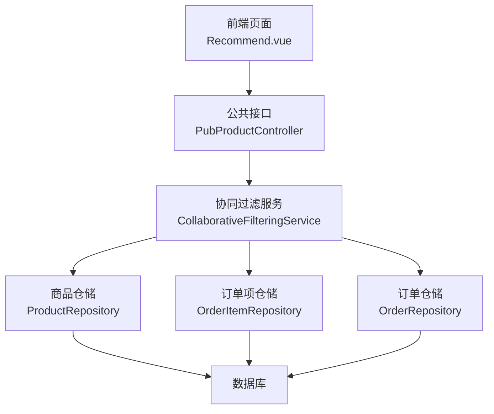
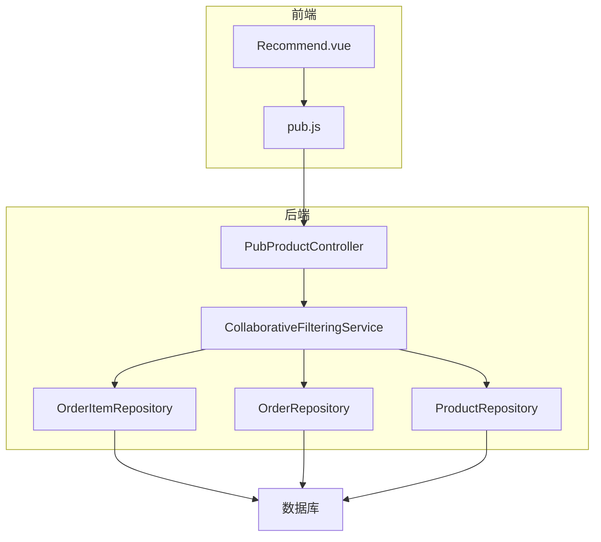
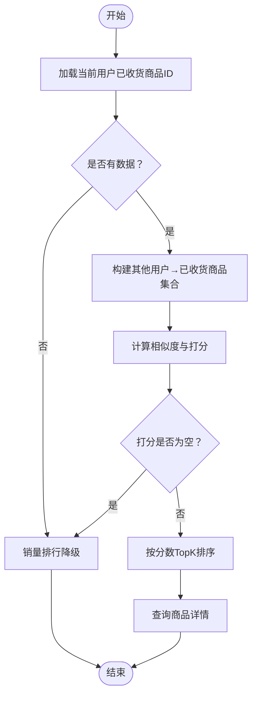
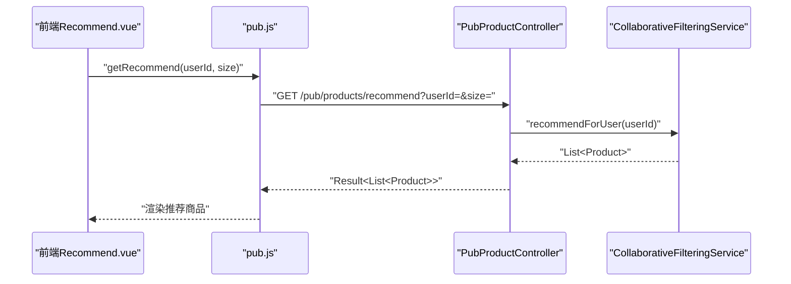
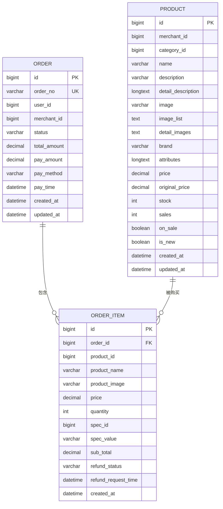
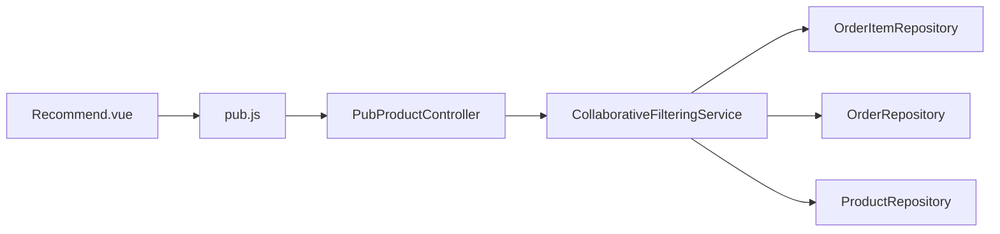
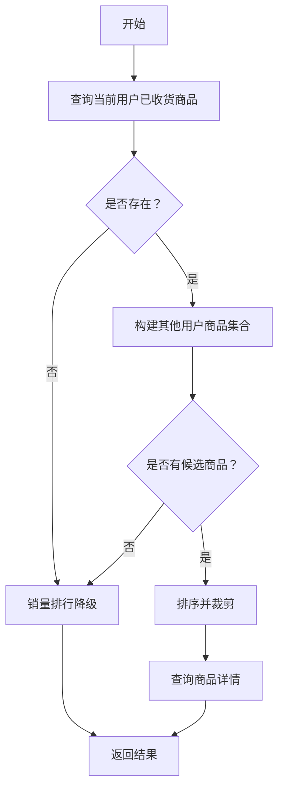

# 推荐系统

<cite>
**本文引用的文件**
- [CollaborativeFilteringService.java](file://backend/src/main/java/com/mall/service/CollaborativeFilteringService.java)
- [PubProductController.java](file://backend/src/main/java/com/mall/controller/pub/PubProductController.java)
- [ProductRepository.java](file://backend/src/main/java/com/mall/repository/ProductRepository.java)
- [OrderItemRepository.java](file://backend/src/main/java/com/mall/repository/OrderItemRepository.java)
- [OrderRepository.java](file://backend/src/main/java/com/mall/repository/OrderRepository.java)
- [Order.java](file://backend/src/main/java/com/mall/entity/Order.java)
- [OrderItem.java](file://backend/src/main/java/com/mall/entity/OrderItem.java)
- [Product.java](file://backend/src/main/java/com/mall/entity/Product.java)
- [Recommend.vue](file://frontend/src/views/user/Recommend.vue)
- [pub.js](file://frontend/src/api/pub.js)
- [application.yml](file://backend/src/main/resources/application.yml)
</cite>

## 目录
1. [引言](#引言)
2. [项目结构](#项目结构)
3. [核心组件](#核心组件)
4. [架构总览](#架构总览)
5. [详细组件分析](#详细组件分析)
6. [依赖分析](#依赖分析)
7. [性能考虑](#性能考虑)
8. [故障与降级策略](#故障与降级策略)
9. [效果评估与A/B测试](#效果评估与ab测试)
10. [可解释性设计](#可解释性设计)
11. [结论](#结论)
12. [附录](#附录)

## 引言
本文件面向电商商城系统的“推荐系统”模块，聚焦于协同过滤算法在真实业务中的落地实现，包括用户相似度计算、推荐结果生成、降级策略、性能优化与可解释性设计。文档以代码为依据，结合前后端交互流程，帮助开发者快速理解并扩展该推荐能力。

## 项目结构
推荐系统由后端服务与前端页面组成：
- 后端通过控制器暴露公开接口，调用协同过滤服务生成推荐；协同过滤服务依赖订单与商品仓储进行数据查询与聚合。
- 前端页面向后端发起“猜您想买”的请求，渲染推荐商品卡片。

图表来源
- [PubProductController.java:85-93](file://backend/src/main/java/com/mall/controller/pub/PubProductController.java#L85-L93)
- [CollaborativeFilteringService.java:32-75](file://backend/src/main/java/com/mall/service/CollaborativeFilteringService.java#L32-L75)
- [OrderItemRepository.java:13-18](file://backend/src/main/java/com/mall/repository/OrderItemRepository.java#L13-L18)
- [OrderRepository.java:25-26](file://backend/src/main/java/com/mall/repository/OrderRepository.java#L25-L26)
- [ProductRepository.java:69-83](file://backend/src/main/java/com/mall/repository/ProductRepository.java#L69-L83)

章节来源
- [application.yml:1-36](file://backend/src/main/resources/application.yml#L1-L36)
- [PubProductController.java:15-95](file://backend/src/main/java/com/mall/controller/pub/PubProductController.java#L15-L95)
- [Recommend.vue:18-35](file://frontend/src/views/user/Recommend.vue#L18-L35)
- [pub.js:28-31](file://frontend/src/api/pub.js#L28-L31)

## 核心组件
- 协同过滤服务：实现“猜您想买”的核心算法，基于用户共同购买行为进行相似度匹配与打分，最终返回候选商品。
- 商品仓储：提供销量排行、公开商品查询等能力，作为协同过滤的降级回退路径。
- 订单与订单项仓储：提供用户已收货商品集合与“其他用户已收货商品集合”，支撑相似度计算。
- 控制器：对外提供“猜您想买”接口，负责参数校验与结果裁剪。
- 前端页面与API：负责调用后端接口并渲染推荐结果。

章节来源
- [CollaborativeFilteringService.java:14-80](file://backend/src/main/java/com/mall/service/CollaborativeFilteringService.java#L14-L80)
- [ProductRepository.java:69-83](file://backend/src/main/java/com/mall/repository/ProductRepository.java#L69-L83)
- [OrderItemRepository.java:13-18](file://backend/src/main/java/com/mall/repository/OrderItemRepository.java#L13-L18)
- [OrderRepository.java:25-26](file://backend/src/main/java/com/mall/repository/OrderRepository.java#L25-L26)
- [PubProductController.java:85-93](file://backend/src/main/java/com/mall/controller/pub/PubProductController.java#L85-L93)
- [Recommend.vue:18-35](file://frontend/src/views/user/Recommend.vue#L18-L35)
- [pub.js:28-31](file://frontend/src/api/pub.js#L28-L31)

## 架构总览
推荐系统采用“控制器-服务-仓储-数据库”的分层架构，协同过滤服务通过仓储层访问订单与商品数据，完成相似度计算与结果筛选，最后返回给前端页面。

图表来源
- [PubProductController.java:85-93](file://backend/src/main/java/com/mall/controller/pub/PubProductController.java#L85-L93)
- [CollaborativeFilteringService.java:32-75](file://backend/src/main/java/com/mall/service/CollaborativeFilteringService.java#L32-L75)
- [OrderItemRepository.java:13-18](file://backend/src/main/java/com/mall/repository/OrderItemRepository.java#L13-L18)
- [OrderRepository.java:25-26](file://backend/src/main/java/com/mall/repository/OrderRepository.java#L25-L26)
- [ProductRepository.java:69-83](file://backend/src/main/java/com/mall/repository/ProductRepository.java#L69-L83)

## 详细组件分析

### 协同过滤服务（核心算法）
- 输入：当前用户ID
- 步骤：
  1) 获取当前用户已收货商品ID集合；
  2) 构建“其他用户→已收货商品集合”的映射；
  3) 计算每个目标用户与其的交集大小作为相似度分数；
  4) 对其他用户购买但当前用户未购买的商品进行累加打分；
  5) 按分数降序排序并限制数量；
  6) 查询对应商品并按顺序返回。
- 降级：若无足够相似用户或无候选商品，回退到销量排行。

图表来源
- [CollaborativeFilteringService.java:32-75](file://backend/src/main/java/com/mall/service/CollaborativeFilteringService.java#L32-L75)
- [ProductRepository.java:69-83](file://backend/src/main/java/com/mall/repository/ProductRepository.java#L69-L83)

章节来源
- [CollaborativeFilteringService.java:14-80](file://backend/src/main/java/com/mall/service/CollaborativeFilteringService.java#L14-L80)

### 控制器与前端交互
- 控制器提供“猜您想买”接口，接收用户ID与推荐数量，调用服务并裁剪结果。
- 前端页面在用户登录后主动拉取推荐列表，渲染商品卡片。

图表来源
- [Recommend.vue:26-31](file://frontend/src/views/user/Recommend.vue#L26-L31)
- [pub.js:28-31](file://frontend/src/api/pub.js#L28-L31)
- [PubProductController.java:85-93](file://backend/src/main/java/com/mall/controller/pub/PubProductController.java#L85-L93)
- [CollaborativeFilteringService.java:32-75](file://backend/src/main/java/com/mall/service/CollaborativeFilteringService.java#L32-L75)

章节来源
- [PubProductController.java:85-93](file://backend/src/main/java/com/mall/controller/pub/PubProductController.java#L85-L93)
- [Recommend.vue:18-35](file://frontend/src/views/user/Recommend.vue#L18-L35)
- [pub.js:28-31](file://frontend/src/api/pub.js#L28-L31)

### 数据模型与仓储
- 订单与订单项：用于提取用户购买行为与“其他用户购买行为”。
- 商品：提供销量排行与公开商品查询，支撑降级策略。
- 仓储方法：
  - 订单项：查询某用户已收货商品ID、查询其他用户已收货商品（排除当前用户）。
  - 订单：查询某用户已收货订单。
  - 商品：销量排行、按ID集合查询公开商品。

图表来源
- [Order.java:16-82](file://backend/src/main/java/com/mall/entity/Order.java#L16-L82)
- [OrderItem.java:16-72](file://backend/src/main/java/com/mall/entity/OrderItem.java#L16-L72)
- [Product.java:16-100](file://backend/src/main/java/com/mall/entity/Product.java#L16-L100)

章节来源
- [OrderItemRepository.java:13-18](file://backend/src/main/java/com/mall/repository/OrderItemRepository.java#L13-L18)
- [OrderRepository.java:25-26](file://backend/src/main/java/com/mall/repository/OrderRepository.java#L25-L26)
- [ProductRepository.java:69-83](file://backend/src/main/java/com/mall/repository/ProductRepository.java#L69-L83)

## 依赖分析
- 协同过滤服务依赖订单项与订单仓储以获取用户购买行为，依赖商品仓储以获取商品详情与销量排行。
- 控制器依赖协同过滤服务与商品服务，负责参数与结果处理。
- 前端通过API模块调用后端接口，渲染推荐结果。

图表来源
- [PubProductController.java:21-22](file://backend/src/main/java/com/mall/controller/pub/PubProductController.java#L21-L22)
- [CollaborativeFilteringService.java:22-24](file://backend/src/main/java/com/mall/service/CollaborativeFilteringService.java#L22-L24)
- [Recommend.vue:19](file://frontend/src/views/user/Recommend.vue#L19)
- [pub.js:28-31](file://frontend/src/api/pub.js#L28-L31)

章节来源
- [PubProductController.java:15-95](file://backend/src/main/java/com/mall/controller/pub/PubProductController.java#L15-L95)
- [CollaborativeFilteringService.java:14-80](file://backend/src/main/java/com/mall/service/CollaborativeFilteringService.java#L14-L80)
- [Recommend.vue:18-35](file://frontend/src/views/user/Recommend.vue#L18-L35)
- [pub.js:28-31](file://frontend/src/api/pub.js#L28-L31)

## 性能考虑
- 时间复杂度与空间复杂度
  - 构建“其他用户→已收货商品集合”：O(U×logP)，U为其他用户数，P为平均每人已收货商品数。
  - 计算交集与打分：O(U×C)，C为与当前用户有交集的用户数，最坏情况下接近U。
  - 最终排序与裁剪：O(K log K)，K为候选商品数。
- 可优化点
  - 早期剪枝：仅保留与当前用户交集大小≥阈值的用户，减少后续遍历。
  - 基于倒排索引：将“商品→购买用户集合”建立倒排，加速相似用户查找。
  - 并行化：对不同用户的交集计算可并行执行，注意线程安全与锁竞争。
  - 缓存：缓存近期热门商品的相似用户集合与Top-K推荐，降低重复计算。
  - 分页与限流：控制单次推荐规模与并发量，避免瞬时高负载。
- 数据库层面
  - 确保订单状态、用户ID、商品ID等字段建立合适索引，提升查询效率。
  - 使用原生SQL或物化视图减少JOIN与子查询成本。

## 故障与降级策略
- 降级触发条件
  - 当前用户无已收货商品或无任何相似用户时，回退到销量排行。
- 降级实现
  - 协同过滤服务内部直接调用销量排行查询，保证一致性与可用性。
- 运行保障
  - 控制器对返回结果进行裁剪，避免超大列表影响前端渲染。
  - 前端对空结果进行友好提示，提升用户体验。

图表来源
- [CollaborativeFilteringService.java:32-79](file://backend/src/main/java/com/mall/service/CollaborativeFilteringService.java#L32-L79)
- [ProductRepository.java:69-83](file://backend/src/main/java/com/mall/repository/ProductRepository.java#L69-L83)

章节来源
- [CollaborativeFilteringService.java:62-79](file://backend/src/main/java/com/mall/service/CollaborativeFilteringService.java#L62-L79)
- [PubProductController.java:85-93](file://backend/src/main/java/com/mall/controller/pub/PubProductController.java#L85-L93)

## 效果评估与A/B测试
- 评估指标
  - 点击率（CTR）、转化率（CVR）、平均停留时长、加购率、复购率。
  - 多样性：推荐商品品类覆盖度、去重后的品牌/类目分布。
  - 新鲜度：新商品曝光占比、新品点击率。
  - 准确性：基于历史购买的召回率、精确率、NDCG等。
- A/B测试方案
  - 分桶策略：按用户ID哈希分桶，确保随机性与稳定性。
  - 实验组与对照组：实验组启用协同过滤，对照组使用销量排行或其他基线策略。
  - 指标采集：埋点记录曝光、点击、下单等事件，统计各组差异。
  - 统计显著性：设定最小样本量与显著性阈值，避免误判。
- 可解释性增强
  - 展示“相似用户也买了”、“与您类似的买家还买了”等提示，提升用户信任。
  - 提供“换一批”按钮，允许用户探索不同风格的商品。

## 可解释性设计
- 信息呈现
  - 在推荐位添加简短理由，例如“基于相似购买行为为您推荐”。
  - 对销量排行类降级结果，标注“热销商品”或“近期畅销”等标签。
- 交互反馈
  - 支持“不感兴趣”反馈，用于后续冷启动与个性化优化。
  - 提供“查看相似商品”入口，引导用户发现更多相关商品。

## 结论
本推荐系统以协同过滤为核心，结合销量排行降级策略，实现了低门槛、高可用的个性化推荐。通过合理的数据模型与仓储查询、前端友好的交互设计，能够在有限资源下提供稳定的服务。未来可在相似用户索引、并行计算与缓存策略等方面进一步优化，以应对更大规模的数据与更高的性能要求。

## 附录
- 关键实现路径参考
  - 协同过滤主流程：[CollaborativeFilteringService.recommendForUser:32-75](file://backend/src/main/java/com/mall/service/CollaborativeFilteringService.java#L32-L75)
  - 销量排行降级：[CollaborativeFilteringService.fallbackBySales:77-79](file://backend/src/main/java/com/mall/service/CollaborativeFilteringService.java#L77-L79)
  - 公开接口“猜您想买”：[PubProductController.recommend:85-93](file://backend/src/main/java/com/mall/controller/pub/PubProductController.java#L85-L93)
  - 前端调用与渲染：[pub.js.getRecommend:28-31](file://frontend/src/api/pub.js#L28-L31)、[Recommend.vue:18-35](file://frontend/src/views/user/Recommend.vue#L18-L35)
  - 商品销量排行查询：[ProductRepository.findPublicSalesRank:69-83](file://backend/src/main/java/com/mall/repository/ProductRepository.java#L69-L83)
  - 已收货商品查询（当前用户）：[OrderItemRepository.findReceivedProductIdsByUserId:13-14](file://backend/src/main/java/com/mall/repository/OrderItemRepository.java#L13-L14)
  - 其他用户已收货商品查询（排除当前用户）：[OrderItemRepository.findOtherUsersReceivedProductsRaw:16-18](file://backend/src/main/java/com/mall/repository/OrderItemRepository.java#L16-L18)
  - 已收货订单查询（当前用户）：[OrderRepository.findReceivedOrdersByUserId:25-26](file://backend/src/main/java/com/mall/repository/OrderRepository.java#L25-L26)