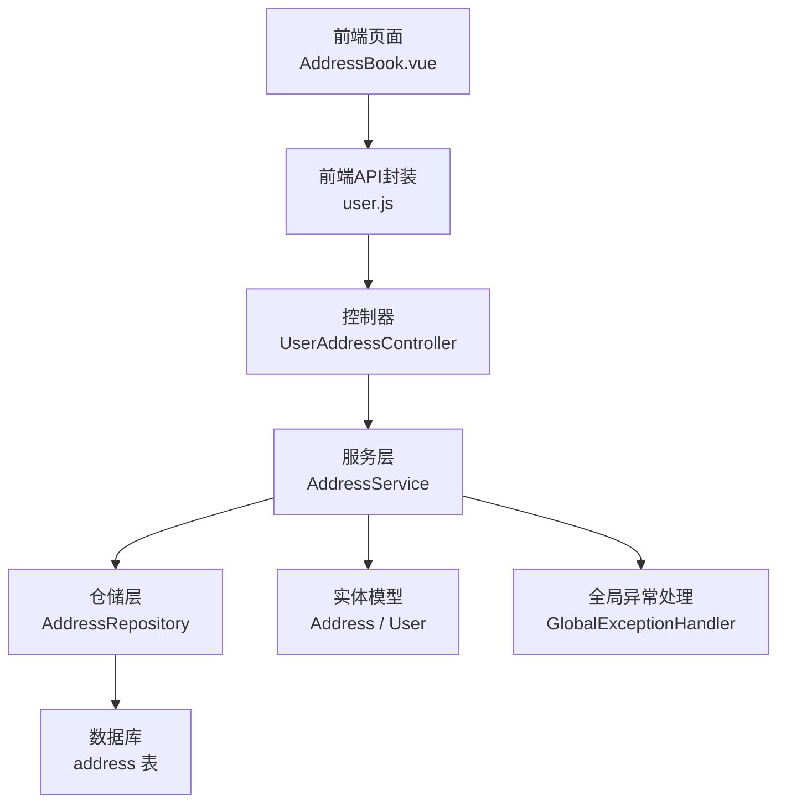
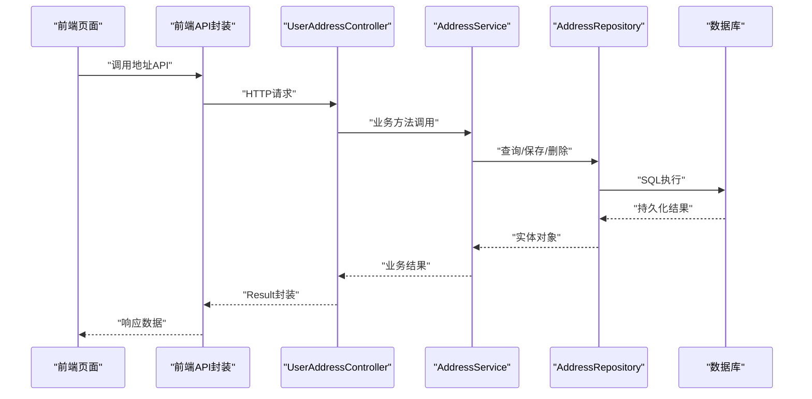
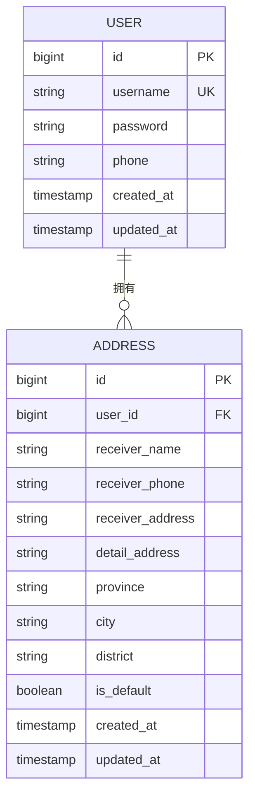
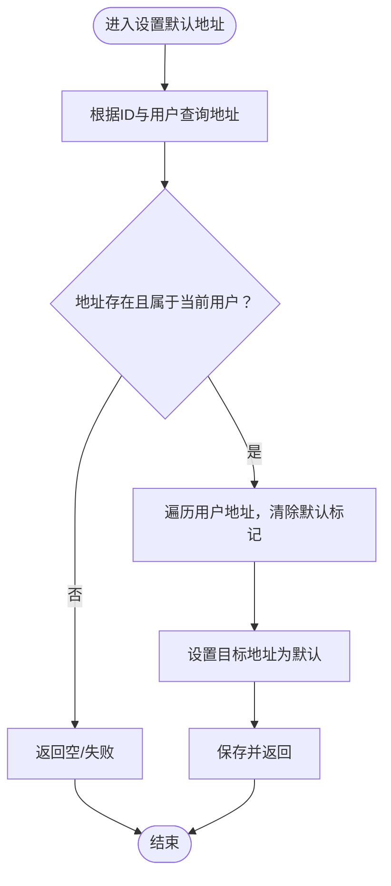
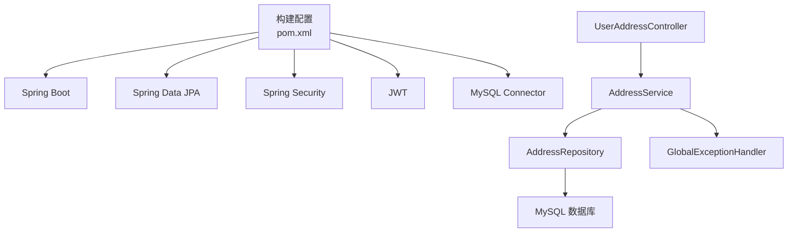

# 地址管理

<cite>
**本文引用的文件**
- [Address.java](file://backend/src/main/java/com/mall/entity/Address.java)
- [User.java](file://backend/src/main/java/com/mall/entity/User.java)
- [AddressService.java](file://backend/src/main/java/com/mall/service/AddressService.java)
- [AddressRepository.java](file://backend/src/main/java/com/mall/repository/AddressRepository.java)
- [UserAddressController.java](file://backend/src/main/java/com/mall/controller/user/UserAddressController.java)
- [Result.java](file://backend/src/main/java/com/mall/dto/Result.java)
- [application.yml](file://backend/src/main/resources/application.yml)
- [GlobalExceptionHandler.java](file://backend/src/main/java/com/mall/exception/GlobalExceptionHandler.java)
- [user.js](file://frontend/src/api/user.js)
- [AddressBook.vue](file://frontend/src/views/user/AddressBook.vue)
- [pom.xml](file://backend/pom.xml)
</cite>

## 目录
1. [简介](#简介)
2. [项目结构](#项目结构)
3. [核心组件](#核心组件)
4. [架构总览](#架构总览)
5. [详细组件分析](#详细组件分析)
6. [依赖分析](#依赖分析)
7. [性能考虑](#性能考虑)
8. [故障排查指南](#故障排查指南)
9. [结论](#结论)
10. [附录](#附录)

## 简介
本技术文档围绕“地址管理”功能进行全面解析，涵盖地址的创建、更新、删除、查询与默认地址设置的业务逻辑，说明地址验证规则与数据标准化处理方式，阐述服务层的事务管理策略与异常处理机制，并提供完整的API接口文档与使用示例，包含批量操作与地址列表查询的最佳实践。

## 项目结构
地址管理功能由后端控制器、服务层、仓储层与实体模型构成，前端通过统一的用户地址API进行交互。关键文件如下：
- 实体模型：Address、User
- 仓储层：AddressRepository
- 服务层：AddressService
- 控制器：UserAddressController
- 响应封装：Result
- 全局异常处理：GlobalExceptionHandler
- 前端API封装：user.js
- 前端页面组件：AddressBook.vue
- 应用配置：application.yml
- 构建配置：pom.xml

图表来源
- [UserAddressController.java:1-73](file://backend/src/main/java/com/mall/controller/user/UserAddressController.java#L1-L73)
- [AddressService.java:1-91](file://backend/src/main/java/com/mall/service/AddressService.java#L1-L91)
- [AddressRepository.java:1-22](file://backend/src/main/java/com/mall/repository/AddressRepository.java#L1-L22)
- [Address.java:1-60](file://backend/src/main/java/com/mall/entity/Address.java#L1-L60)
- [User.java:1-88](file://backend/src/main/java/com/mall/entity/User.java#L1-L88)
- [GlobalExceptionHandler.java:1-18](file://backend/src/main/java/com/mall/exception/GlobalExceptionHandler.java#L1-L18)
- [user.js:128-161](file://frontend/src/api/user.js#L128-L161)
- [AddressBook.vue:154-161](file://frontend/src/views/user/AddressBook.vue#L154-L161)

章节来源
- [UserAddressController.java:1-73](file://backend/src/main/java/com/mall/controller/user/UserAddressController.java#L1-L73)
- [AddressService.java:1-91](file://backend/src/main/java/com/mall/service/AddressService.java#L1-L91)
- [AddressRepository.java:1-22](file://backend/src/main/java/com/mall/repository/AddressRepository.java#L1-L22)
- [Address.java:1-60](file://backend/src/main/java/com/mall/entity/Address.java#L1-L60)
- [User.java:1-88](file://backend/src/main/java/com/mall/entity/User.java#L1-L88)
- [Result.java:1-24](file://backend/src/main/java/com/mall/dto/Result.java#L1-L24)
- [application.yml:1-36](file://backend/src/main/resources/application.yml#L1-L36)
- [GlobalExceptionHandler.java:1-18](file://backend/src/main/java/com/mall/exception/GlobalExceptionHandler.java#L1-L18)
- [user.js:128-161](file://frontend/src/api/user.js#L128-L161)
- [AddressBook.vue:154-161](file://frontend/src/views/user/AddressBook.vue#L154-L161)
- [pom.xml:19-74](file://backend/pom.xml#L19-L74)

## 核心组件
- 实体模型
  - Address：收货地址实体，包含收货人姓名、电话、省市区、详细地址、默认标记及时间戳字段。
  - User：用户实体，包含与地址的一对多关系。
- 仓储层
  - AddressRepository：提供按用户查询地址列表、查询默认地址、按用户计数等方法。
- 服务层
  - AddressService：实现地址CRUD、默认地址设置与校验、事务控制与一致性保障。
- 控制器
  - UserAddressController：暴露REST接口，返回Result封装的响应。
- 响应封装
  - Result：统一封装HTTP响应，包含状态码、消息与数据。
- 异常处理
  - GlobalExceptionHandler：捕获运行时异常并返回业务失败响应。

章节来源
- [Address.java:1-60](file://backend/src/main/java/com/mall/entity/Address.java#L1-L60)
- [User.java:73-75](file://backend/src/main/java/com/mall/entity/User.java#L73-L75)
- [AddressRepository.java:13-21](file://backend/src/main/java/com/mall/repository/AddressRepository.java#L13-L21)
- [AddressService.java:17-89](file://backend/src/main/java/com/mall/service/AddressService.java#L17-L89)
- [UserAddressController.java:19-71](file://backend/src/main/java/com/mall/controller/user/UserAddressController.java#L19-L71)
- [Result.java:16-22](file://backend/src/main/java/com/mall/dto/Result.java#L16-L22)
- [GlobalExceptionHandler.java:13-17](file://backend/src/main/java/com/mall/exception/GlobalExceptionHandler.java#L13-L17)

## 架构总览
地址管理采用经典的分层架构：前端通过API封装调用后端REST接口；控制器负责参数接收与结果封装；服务层执行业务逻辑并保证事务一致性；仓储层与数据库交互；全局异常处理器统一拦截运行时错误。

图表来源
- [UserAddressController.java:19-71](file://backend/src/main/java/com/mall/controller/user/UserAddressController.java#L19-L71)
- [AddressService.java:17-89](file://backend/src/main/java/com/mall/service/AddressService.java#L17-L89)
- [AddressRepository.java:13-21](file://backend/src/main/java/com/mall/repository/AddressRepository.java#L13-L21)
- [Result.java:16-22](file://backend/src/main/java/com/mall/dto/Result.java#L16-L22)

## 详细组件分析

### 数据模型与标准化
- 字段约束与长度限制
  - 收货人姓名、电话、详细地址、省市区等字段均在实体层面定义长度上限，确保入库数据规范化。
  - 默认标记为布尔类型，用于标识用户的默认收货地址。
- 时间戳管理
  - 使用注解在持久化与更新时自动填充创建与更新时间，避免业务层重复赋值。
- 关系映射
  - Address与User为多对一关系，User维护一对多的地址集合，便于按用户聚合查询。

图表来源
- [Address.java:15-47](file://backend/src/main/java/com/mall/entity/Address.java#L15-L47)
- [User.java:73-75](file://backend/src/main/java/com/mall/entity/User.java#L73-L75)

章节来源
- [Address.java:19-47](file://backend/src/main/java/com/mall/entity/Address.java#L19-L47)
- [User.java:73-75](file://backend/src/main/java/com/mall/entity/User.java#L73-L75)

### 服务层事务管理与默认地址机制
- 事务策略
  - 所有写操作（创建、更新、删除、设置默认地址）均标注事务注解，确保数据库一致性。
- 默认地址设置规则
  - 当设置某地址为默认时，先清空该用户其他地址的默认标记，再设置目标地址为默认。
  - 查询默认地址时，使用专门的查询方法，保证唯一性与高效性。
- 安全性与权限校验
  - 读取与修改均基于当前登录用户上下文，防止越权访问。

图表来源
- [AddressService.java:67-89](file://backend/src/main/java/com/mall/service/AddressService.java#L67-L89)
- [AddressRepository.java:17-18](file://backend/src/main/java/com/mall/repository/AddressRepository.java#L17-L18)

章节来源
- [AddressService.java:27-89](file://backend/src/main/java/com/mall/service/AddressService.java#L27-L89)
- [AddressRepository.java:17-18](file://backend/src/main/java/com/mall/repository/AddressRepository.java#L17-L18)

### API接口定义与使用示例
- 列表查询
  - GET /user/address：返回当前用户的所有地址，按默认优先、创建时间倒序排列。
- 详情查询
  - GET /user/address/{id}：返回指定地址详情，若不存在返回失败。
- 创建地址
  - POST /user/address：请求体为地址对象，支持设置默认地址；若设置默认则自动取消其他默认标记。
- 更新地址
  - PUT /user/address/{id}：按ID更新地址；若新状态为默认且原状态非默认，则自动取消其他默认标记。
- 删除地址
  - DELETE /user/address/{id}：按ID删除地址。
- 设置默认地址
  - PUT /user/address/{id}/default：将指定地址设为默认。
- 获取默认地址
  - GET /user/address/default：返回当前用户的默认地址，若不存在返回失败。

前端调用示例（来自页面组件）
- 新增/编辑地址时，将表单数据组装为地址对象并调用对应API。
- 页面展示默认地址标签，支持一键设为默认。

章节来源
- [UserAddressController.java:19-71](file://backend/src/main/java/com/mall/controller/user/UserAddressController.java#L19-L71)
- [user.js:128-161](file://frontend/src/api/user.js#L128-L161)
- [AddressBook.vue:326-341](file://frontend/src/views/user/AddressBook.vue#L326-L341)

### 地址验证规则与数据标准化
- 前端验证
  - 手机号格式校验（正则表达式），必填项校验，字数限制提示。
- 后端约束
  - 实体字段长度与非空约束，确保入库数据符合规范。
- 标准化处理
  - 省市区字段通过级联选择器传递，详细地址与门牌号分离存储，提升可读性与检索效率。

章节来源
- [AddressBook.vue:165-200](file://frontend/src/views/user/AddressBook.vue#L165-L200)
- [Address.java:19-38](file://backend/src/main/java/com/mall/entity/Address.java#L19-L38)

### 错误处理与异常策略
- 全局异常处理
  - 捕获运行时异常，统一返回业务失败响应，避免敏感信息泄露。
- 接口层失败返回
  - 控制器对“地址不存在”等场景返回明确错误信息，前端据此提示用户。

章节来源
- [GlobalExceptionHandler.java:13-17](file://backend/src/main/java/com/mall/exception/GlobalExceptionHandler.java#L13-L17)
- [UserAddressController.java:28-30](file://backend/src/main/java/com/mall/controller/user/UserAddressController.java#L28-L30)
- [UserAddressController.java:58-60](file://backend/src/main/java/com/mall/controller/user/UserAddressController.java#L58-L60)
- [UserAddressController.java:67-69](file://backend/src/main/java/com/mall/controller/user/UserAddressController.java#L67-L69)

## 依赖分析
- 技术栈
  - Spring Boot、Spring Web、Spring Data JPA、MySQL Connector、Lombok、JWT等。
- 外部依赖
  - 数据库连接、JPA方言与DDL策略、日志级别等在应用配置中集中管理。
- 组件耦合
  - 控制器依赖服务层；服务层依赖仓储层；仓储层依赖JPA与数据库；全局异常处理对所有控制器生效。

图表来源
- [pom.xml:19-74](file://backend/pom.xml#L19-L74)
- [application.yml:4-17](file://backend/src/main/resources/application.yml#L4-L17)
- [UserAddressController.java:13-17](file://backend/src/main/java/com/mall/controller/user/UserAddressController.java#L13-L17)
- [AddressService.java:12-15](file://backend/src/main/java/com/mall/service/AddressService.java#L12-L15)
- [AddressRepository.java:11-12](file://backend/src/main/java/com/mall/repository/AddressRepository.java#L11-L12)
- [GlobalExceptionHandler.java:10-17](file://backend/src/main/java/com/mall/exception/GlobalExceptionHandler.java#L10-L17)

章节来源
- [pom.xml:19-74](file://backend/pom.xml#L19-L74)
- [application.yml:4-17](file://backend/src/main/resources/application.yml#L4-L17)

## 性能考虑
- 查询排序
  - 地址列表按默认优先与创建时间倒序，减少前端二次排序开销。
- 默认地址查询
  - 提供专用查询方法，避免全表扫描或复杂过滤。
- 事务边界
  - 将默认地址切换与保存置于同一事务，降低并发冲突概率。
- 建议
  - 在高并发场景下，可考虑对默认地址变更增加幂等控制与重试策略。
  - 对地址列表分页查询以优化大数据集下的渲染性能。

## 故障排查指南
- 常见问题
  - “地址不存在”：检查地址ID与当前用户是否匹配，确认URL路径参数正确。
  - “未设置默认地址”：确认用户是否存在默认地址，或先创建后再设为默认。
  - 手机号格式错误：前端校验失败或后端实体约束导致入库失败。
- 排查步骤
  - 查看控制器返回的Result消息与状态码。
  - 检查全局异常处理器是否拦截了底层异常。
  - 核对数据库中address表的数据完整性与索引情况。

章节来源
- [UserAddressController.java:28-30](file://backend/src/main/java/com/mall/controller/user/UserAddressController.java#L28-L30)
- [UserAddressController.java:67-69](file://backend/src/main/java/com/mall/controller/user/UserAddressController.java#L67-L69)
- [GlobalExceptionHandler.java:13-17](file://backend/src/main/java/com/mall/exception/GlobalExceptionHandler.java#L13-L17)

## 结论
地址管理功能通过清晰的分层设计与严格的事务控制，实现了安全、一致且易用的地址CRUD与默认地址管理能力。前后端配合良好，接口规范统一，具备良好的扩展性与可维护性。建议在后续迭代中引入更细粒度的权限控制与缓存策略，进一步提升性能与用户体验。

## 附录
- API一览（后端）
  - GET /user/address：获取地址列表
  - GET /user/address/{id}：获取地址详情
  - POST /user/address：创建地址
  - PUT /user/address/{id}：更新地址
  - DELETE /user/address/{id}：删除地址
  - PUT /user/address/{id}/default：设置默认地址
  - GET /user/address/default：获取默认地址
- 前端调用（参考）
  - getAddresses、getAddress、createAddress、updateAddress、deleteAddress、setDefaultAddress、getDefaultAddress

章节来源
- [UserAddressController.java:19-71](file://backend/src/main/java/com/mall/controller/user/UserAddressController.java#L19-L71)
- [user.js:128-161](file://frontend/src/api/user.js#L128-L161)