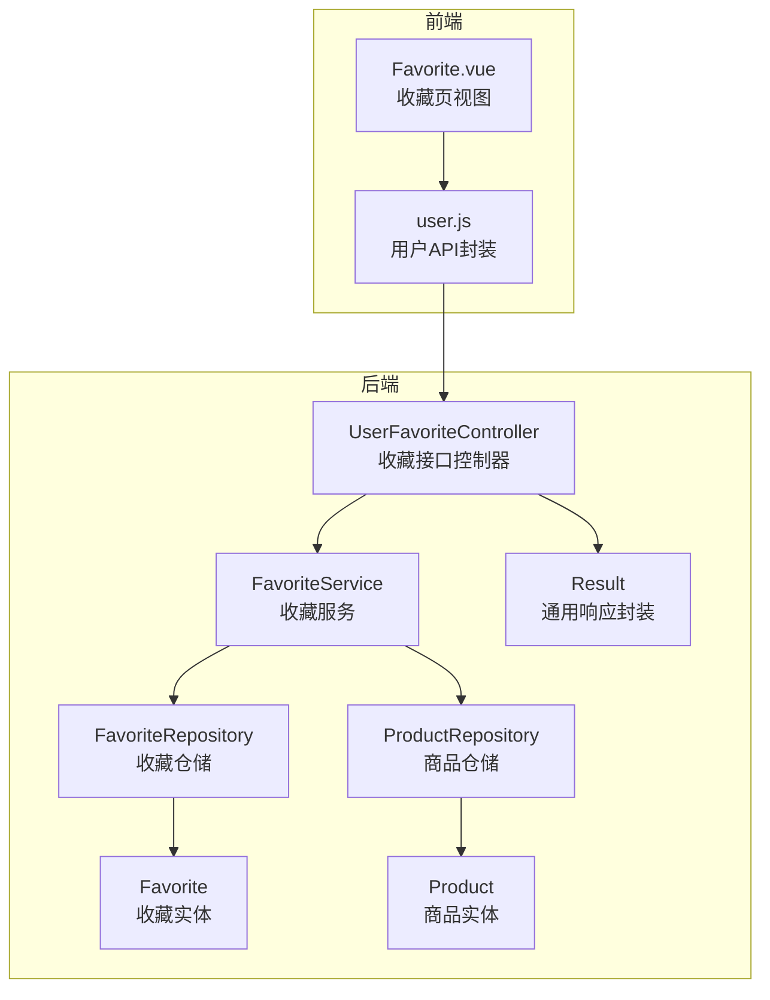
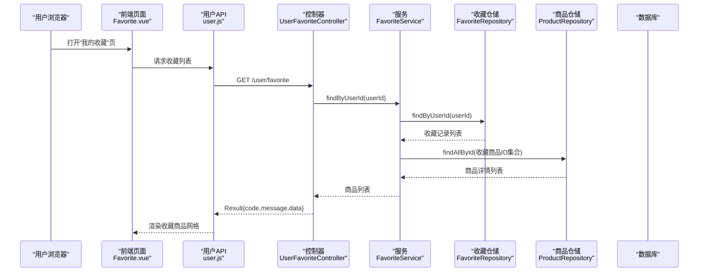
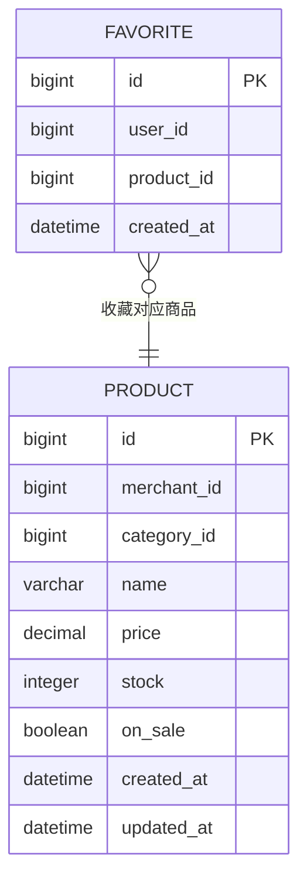
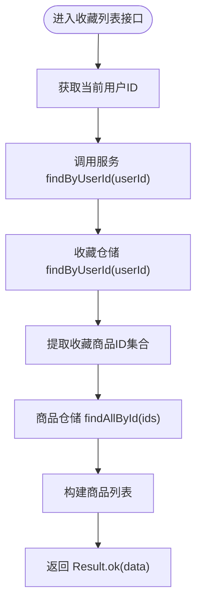
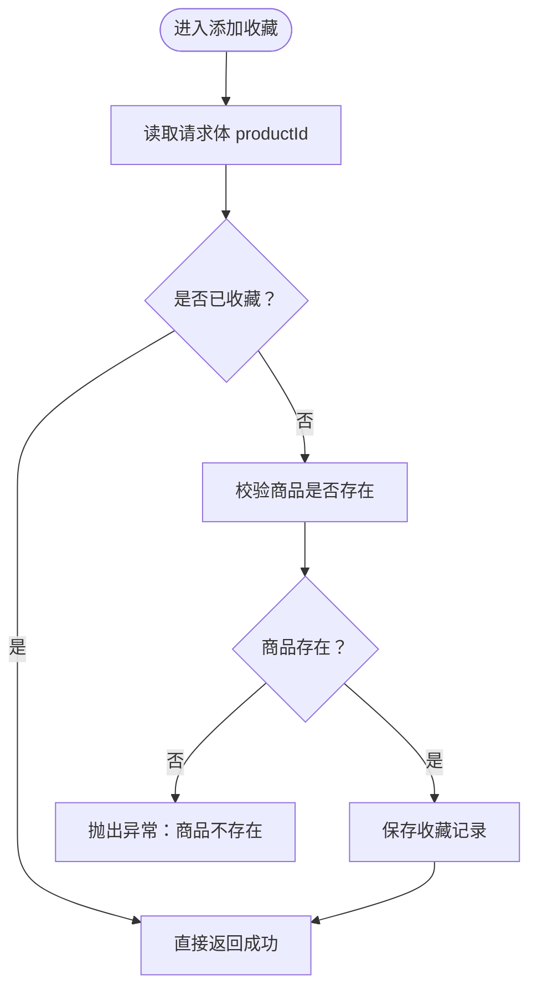
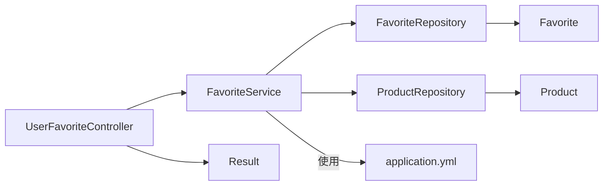

# 收藏夹管理

<cite>
**本文引用的文件**
- [Favorite.java](file://backend/src/main/java/com/mall/entity/Favorite.java)
- [FavoriteRepository.java](file://backend/src/main/java/com/mall/repository/FavoriteRepository.java)
- [FavoriteService.java](file://backend/src/main/java/com/mall/service/FavoriteService.java)
- [UserFavoriteController.java](file://backend/src/main/java/com/mall/controller/user/UserFavoriteController.java)
- [Product.java](file://backend/src/main/java/com/mall/entity/Product.java)
- [ProductRepository.java](file://backend/src/main/java/com/mall/repository/ProductRepository.java)
- [Result.java](file://backend/src/main/java/com/mall/dto/Result.java)
- [application.yml](file://backend/src/main/resources/application.yml)
- [Favorite.vue](file://frontend/src/views/user/Favorite.vue)
- [user.js](file://frontend/src/api/user.js)
</cite>

## 目录
1. [简介](#简介)
2. [项目结构](#项目结构)
3. [核心组件](#核心组件)
4. [架构总览](#架构总览)
5. [详细组件分析](#详细组件分析)
6. [依赖分析](#依赖分析)
7. [性能考虑](#性能考虑)
8. [故障排查指南](#故障排查指南)
9. [结论](#结论)
10. [附录](#附录)

## 简介
本技术文档围绕收藏夹管理功能进行系统化梳理，覆盖数据模型设计、业务流程（添加、删除、查询）、去重机制、数量限制与分页查询现状、事务管理策略以及性能优化建议，并提供完整的收藏夹操作API文档与典型使用场景示例路径，帮助开发者与产品人员快速理解并正确使用收藏夹能力。

## 项目结构
收藏夹功能由后端服务与前端页面共同组成：
- 后端采用Spring Boot + JPA，控制器负责REST接口，服务层编排业务逻辑，仓储层访问数据库。
- 前端Vue组件负责展示收藏列表、触发收藏/取消收藏操作，并调用统一的用户API模块。

图表来源
- [UserFavoriteController.java:14-59](file://backend/src/main/java/com/mall/controller/user/UserFavoriteController.java#L14-L59)
- [FavoriteService.java:14-42](file://backend/src/main/java/com/mall/service/FavoriteService.java#L14-L42)
- [FavoriteRepository.java:9-18](file://backend/src/main/java/com/mall/repository/FavoriteRepository.java#L9-L18)
- [ProductRepository.java:12-124](file://backend/src/main/java/com/mall/repository/ProductRepository.java#L12-L124)
- [Favorite.java:8-34](file://backend/src/main/java/com/mall/entity/Favorite.java#L8-L34)
- [Product.java:9-100](file://backend/src/main/java/com/mall/entity/Product.java#L9-L100)
- [Result.java:10-23](file://backend/src/main/java/com/mall/dto/Result.java#L10-L23)

章节来源
- [UserFavoriteController.java:14-59](file://backend/src/main/java/com/mall/controller/user/UserFavoriteController.java#L14-L59)
- [FavoriteService.java:14-42](file://backend/src/main/java/com/mall/service/FavoriteService.java#L14-L42)
- [FavoriteRepository.java:9-18](file://backend/src/main/java/com/mall/repository/FavoriteRepository.java#L9-L18)
- [ProductRepository.java:12-124](file://backend/src/main/java/com/mall/repository/ProductRepository.java#L12-L124)
- [Favorite.java:8-34](file://backend/src/main/java/com/mall/entity/Favorite.java#L8-L34)
- [Product.java:9-100](file://backend/src/main/java/com/mall/entity/Product.java#L9-L100)
- [Result.java:10-23](file://backend/src/main/java/com/mall/dto/Result.java#L10-L23)

## 核心组件
- 实体层
  - 收藏实体：唯一约束确保同一用户对同一商品仅能收藏一次；持久化时自动记录创建时间。
  - 商品实体：收藏列表查询返回商品信息，包含基础字段如名称、价格、图片等。
- 仓储层
  - 收藏仓储：提供按用户查询、按用户+商品查询、存在性检查、按用户+商品删除等方法。
  - 商品仓储：提供按ID集合批量查询商品的能力，供收藏列表查询使用。
- 服务层
  - 收藏服务：实现收藏列表查询、收藏状态检查、添加收藏（含幂等与商品存在性校验）、删除收藏。
- 控制器层
  - 用户收藏控制器：提供收藏列表、收藏状态检查、添加收藏、取消收藏四个接口，统一返回Result封装。
- 前端
  - 收藏页视图：展示收藏商品网格，支持取消收藏。
  - 用户API：封装收藏相关HTTP请求。

章节来源
- [Favorite.java:8-34](file://backend/src/main/java/com/mall/entity/Favorite.java#L8-L34)
- [Product.java:16-100](file://backend/src/main/java/com/mall/entity/Product.java#L16-L100)
- [FavoriteRepository.java:9-18](file://backend/src/main/java/com/mall/repository/FavoriteRepository.java#L9-L18)
- [ProductRepository.java:12-124](file://backend/src/main/java/com/mall/repository/ProductRepository.java#L12-L124)
- [FavoriteService.java:14-42](file://backend/src/main/java/com/mall/service/FavoriteService.java#L14-L42)
- [UserFavoriteController.java:14-59](file://backend/src/main/java/com/mall/controller/user/UserFavoriteController.java#L14-L59)
- [Favorite.vue:1-175](file://frontend/src/views/user/Favorite.vue#L1-L175)
- [user.js:38-56](file://frontend/src/api/user.js#L38-L56)

## 架构总览
收藏夹整体采用经典的三层架构：前端发起请求 -> 控制器接收并鉴权 -> 服务层执行业务逻辑 -> 仓储层持久化或查询 -> 返回统一结果封装。

图表来源
- [UserFavoriteController.java:27-32](file://backend/src/main/java/com/mall/controller/user/UserFavoriteController.java#L27-L32)
- [FavoriteService.java:21-25](file://backend/src/main/java/com/mall/service/FavoriteService.java#L21-L25)
- [FavoriteRepository.java:11-13](file://backend/src/main/java/com/mall/repository/FavoriteRepository.java#L11-L13)
- [ProductRepository.java:29-30](file://backend/src/main/java/com/mall/repository/ProductRepository.java#L29-L30)

## 详细组件分析

### 数据模型与关联关系
- 收藏实体
  - 唯一约束：用户ID + 商品ID，天然保证收藏去重。
  - 时间戳：创建时自动填充。
- 商品实体
  - 收藏列表返回商品信息，包含名称、价格、图片等字段。
- 关联关系
  - 收藏实体通过外键字段指向用户与商品，查询收藏列表时通过商品ID集合批量回填商品详情。

图表来源
- [Favorite.java:17-33](file://backend/src/main/java/com/mall/entity/Favorite.java#L17-L33)
- [Product.java:18-100](file://backend/src/main/java/com/mall/entity/Product.java#L18-L100)

章节来源
- [Favorite.java:8-34](file://backend/src/main/java/com/mall/entity/Favorite.java#L8-L34)
- [Product.java:9-100](file://backend/src/main/java/com/mall/entity/Product.java#L9-L100)

### 业务流程与控制流

#### 收藏列表查询
- 控制器：GET /user/favorite
- 流程：获取当前用户ID -> 调用服务查询收藏 -> 通过收藏记录中的商品ID集合批量查询商品 -> 返回Result封装。

图表来源
- [UserFavoriteController.java:27-32](file://backend/src/main/java/com/mall/controller/user/UserFavoriteController.java#L27-L32)
- [FavoriteService.java:21-25](file://backend/src/main/java/com/mall/service/FavoriteService.java#L21-L25)
- [FavoriteRepository.java:11-13](file://backend/src/main/java/com/mall/repository/FavoriteRepository.java#L11-L13)
- [ProductRepository.java:29-30](file://backend/src/main/java/com/mall/repository/ProductRepository.java#L29-L30)

章节来源
- [UserFavoriteController.java:27-32](file://backend/src/main/java/com/mall/controller/user/UserFavoriteController.java#L27-L32)
- [FavoriteService.java:21-25](file://backend/src/main/java/com/mall/service/FavoriteService.java#L21-L25)

#### 收藏状态检查
- 控制器：GET /user/favorite/check?productId={id}
- 流程：调用服务 existsByUserIdAndProductId -> 返回布尔值封装在Result中。

章节来源
- [UserFavoriteController.java:34-39](file://backend/src/main/java/com/mall/controller/user/UserFavoriteController.java#L34-L39)
- [FavoriteService.java:27-29](file://backend/src/main/java/com/mall/service/FavoriteService.java#L27-L29)
- [FavoriteRepository.java:13-15](file://backend/src/main/java/com/mall/repository/FavoriteRepository.java#L13-L15)

#### 添加收藏（幂等与校验）
- 控制器：POST /user/favorite/add
- 流程：读取productId -> 幂等判断（若已收藏则直接返回）-> 校验商品是否存在 -> 保存收藏记录。
- 去重机制：数据库唯一约束 + 服务层幂等判断双重保障。

图表来源
- [UserFavoriteController.java:41-51](file://backend/src/main/java/com/mall/controller/user/UserFavoriteController.java#L41-L51)
- [FavoriteService.java:31-36](file://backend/src/main/java/com/mall/service/FavoriteService.java#L31-L36)
- [FavoriteRepository.java:13-15](file://backend/src/main/java/com/mall/repository/FavoriteRepository.java#L13-L15)
- [ProductRepository.java:12-13](file://backend/src/main/java/com/mall/repository/ProductRepository.java#L12-L13)

章节来源
- [UserFavoriteController.java:41-51](file://backend/src/main/java/com/mall/controller/user/UserFavoriteController.java#L41-L51)
- [FavoriteService.java:31-36](file://backend/src/main/java/com/mall/service/FavoriteService.java#L31-L36)

#### 取消收藏
- 控制器：DELETE /user/favorite/{productId}
- 流程：调用服务 deleteByUserIdAndProductId -> 返回Result封装。

章节来源
- [UserFavoriteController.java:53-58](file://backend/src/main/java/com/mall/controller/user/UserFavoriteController.java#L53-L58)
- [FavoriteService.java:38-41](file://backend/src/main/java/com/mall/service/FavoriteService.java#L38-L41)
- [FavoriteRepository.java:17-17](file://backend/src/main/java/com/mall/repository/FavoriteRepository.java#L17-L17)

### 事务管理策略
- 添加收藏与取消收藏均标注为事务方法，确保数据库一致性。
- 添加收藏流程包含存在性校验与保存，事务可保证原子性。
- 取消收藏为单条删除，事务可确保删除操作的原子性。

章节来源
- [FavoriteService.java:31-41](file://backend/src/main/java/com/mall/service/FavoriteService.java#L31-L41)

### 分页查询与数量限制
- 当前实现
  - 收藏列表查询：通过收藏ID集合批量查询商品，未使用分页参数。
  - 商品查询：商品仓储提供多种分页查询方法，但收藏列表未使用分页。
- 建议
  - 若收藏量较大，可在服务层对收藏ID集合分批查询商品，或在控制器层引入分页参数传递至服务层。
  - 在数据库层面可考虑为收藏表增加索引以提升查询性能。

章节来源
- [FavoriteService.java:21-25](file://backend/src/main/java/com/mall/service/FavoriteService.java#L21-L25)
- [ProductRepository.java:12-124](file://backend/src/main/java/com/mall/repository/ProductRepository.java#L12-L124)

### 去重机制
- 数据库唯一约束：用户ID + 商品ID组合唯一，防止重复收藏。
- 服务层幂等：若已收藏则直接返回，避免多余写入。
- 结果：同一用户对同一商品仅保留一条收藏记录。

章节来源
- [Favorite.java:9-9](file://backend/src/main/java/com/mall/entity/Favorite.java#L9-L9)
- [FavoriteService.java:33-33](file://backend/src/main/java/com/mall/service/FavoriteService.java#L33-L33)

### 错误处理
- 商品不存在：添加收藏时若商品不存在，抛出异常并返回失败结果。
- 控制器统一包装：所有接口返回Result封装，便于前端统一处理。

章节来源
- [FavoriteService.java:34-35](file://backend/src/main/java/com/mall/service/FavoriteService.java#L34-L35)
- [UserFavoriteController.java:48-50](file://backend/src/main/java/com/mall/controller/user/UserFavoriteController.java#L48-L50)
- [Result.java:16-22](file://backend/src/main/java/com/mall/dto/Result.java#L16-L22)

## 依赖分析
- 组件耦合
  - 控制器依赖服务；服务依赖仓储；仓储依赖实体；控制器依赖Result封装。
- 外部依赖
  - Spring Data JPA提供仓储抽象；MySQL作为持久化存储；JPA方言与DDL策略在配置文件中定义。

图表来源
- [UserFavoriteController.java:14-59](file://backend/src/main/java/com/mall/controller/user/UserFavoriteController.java#L14-L59)
- [FavoriteService.java:14-42](file://backend/src/main/java/com/mall/service/FavoriteService.java#L14-L42)
- [FavoriteRepository.java:9-18](file://backend/src/main/java/com/mall/repository/FavoriteRepository.java#L9-L18)
- [ProductRepository.java:12-124](file://backend/src/main/java/com/mall/repository/ProductRepository.java#L12-L124)
- [application.yml:1-36](file://backend/src/main/resources/application.yml#L1-L36)

章节来源
- [application.yml:1-36](file://backend/src/main/resources/application.yml#L1-L36)

## 性能考虑
- 查询路径
  - 收藏列表：先查收藏表，再按ID集合批量查商品表。建议对收藏表的用户ID与商品ID建立复合索引，提升查询效率。
- 批量查询
  - 使用findAllById时，注意ID集合大小，避免超大IN列表导致SQL过长或性能下降。可分批查询。
- 事务范围
  - 将校验与保存放在同一事务内，减少并发冲突带来的不一致风险。
- 缓存策略
  - 对热门商品详情可考虑缓存，降低商品仓储压力。
- 日志与监控
  - 生产环境建议开启慢查询日志与关键接口监控，定位性能瓶颈。

[本节为通用性能建议，无需特定文件引用]

## 故障排查指南
- 添加收藏失败
  - 检查商品是否存在；确认请求体包含productId；查看服务层异常信息。
- 收藏列表为空
  - 确认当前用户是否已收藏商品；检查收藏表数据；核对商品是否上架。
- 取消收藏无效
  - 确认传入的productId是否正确；检查是否已收藏；查看删除是否成功。

章节来源
- [FavoriteService.java:34-41](file://backend/src/main/java/com/mall/service/FavoriteService.java#L34-L41)
- [UserFavoriteController.java:48-58](file://backend/src/main/java/com/mall/controller/user/UserFavoriteController.java#L48-L58)

## 结论
收藏夹功能通过唯一约束与服务层幂等实现天然去重，结合事务保证一致性。当前收藏列表查询未引入分页，建议在收藏量增长后引入分页与批量查询优化。整体架构清晰、职责明确，易于扩展与维护。

[本节为总结性内容，无需特定文件引用]

## 附录

### 收藏夹操作API文档
- 获取收藏列表
  - 方法：GET
  - 路径：/user/favorite
  - 认证：需要登录
  - 返回：Result{code,message,data}，data为商品列表
  - 示例路径：[UserFavoriteController.java:27-32](file://backend/src/main/java/com/mall/controller/user/UserFavoriteController.java#L27-L32)
- 检查商品是否已收藏
  - 方法：GET
  - 路径：/user/favorite/check
  - 参数：productId
  - 返回：Result{code,message,data:{favorite:boolean}}
  - 示例路径：[UserFavoriteController.java:34-39](file://backend/src/main/java/com/mall/controller/user/UserFavoriteController.java#L34-L39)
- 新增收藏
  - 方法：POST
  - 路径：/user/favorite/add
  - 请求体：{productId: number}
  - 返回：Result{code,message,data:null}
  - 示例路径：[UserFavoriteController.java:41-51](file://backend/src/main/java/com/mall/controller/user/UserFavoriteController.java#L41-L51)
- 取消收藏
  - 方法：DELETE
  - 路径：/user/favorite/{productId}
  - 返回：Result{code,message,data:null}
  - 示例路径：[UserFavoriteController.java:53-58](file://backend/src/main/java/com/mall/controller/user/UserFavoriteController.java#L53-L58)

章节来源
- [UserFavoriteController.java:14-59](file://backend/src/main/java/com/mall/controller/user/UserFavoriteController.java#L14-L59)
- [Result.java:16-22](file://backend/src/main/java/com/mall/dto/Result.java#L16-L22)

### 前端集成与使用场景
- 收藏页视图
  - 页面：Favorite.vue
  - 功能：加载收藏列表、显示空状态、点击取消收藏
  - 示例路径：[Favorite.vue:57-93](file://frontend/src/views/user/Favorite.vue#L57-L93)
- 用户API封装
  - 方法：getFavorites、checkFavorite、addFavorite、removeFavorite
  - 示例路径：[user.js:38-56](file://frontend/src/api/user.js#L38-L56)

章节来源
- [Favorite.vue:1-175](file://frontend/src/views/user/Favorite.vue#L1-L175)
- [user.js:38-56](file://frontend/src/api/user.js#L38-L56)