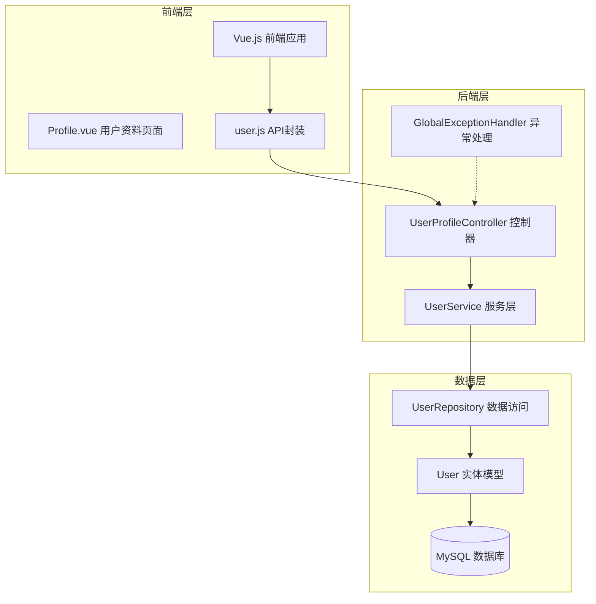
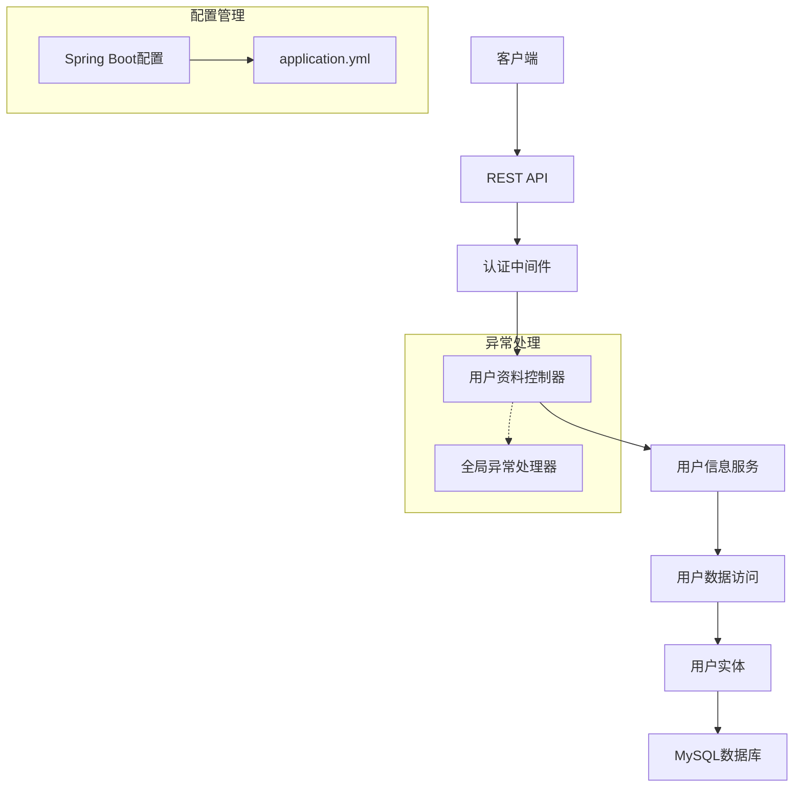
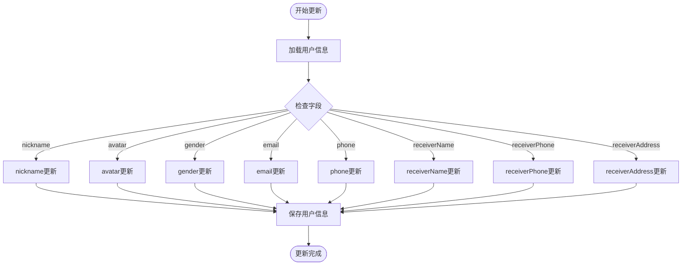
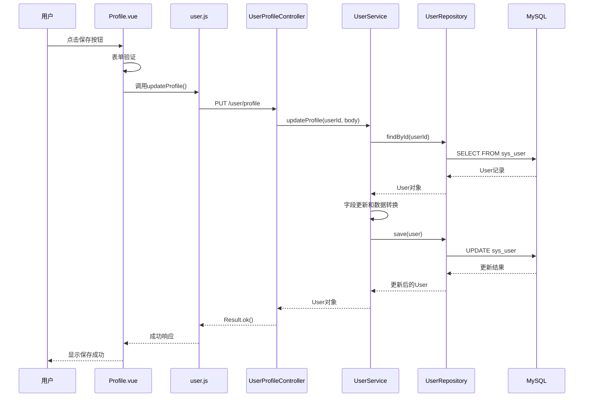
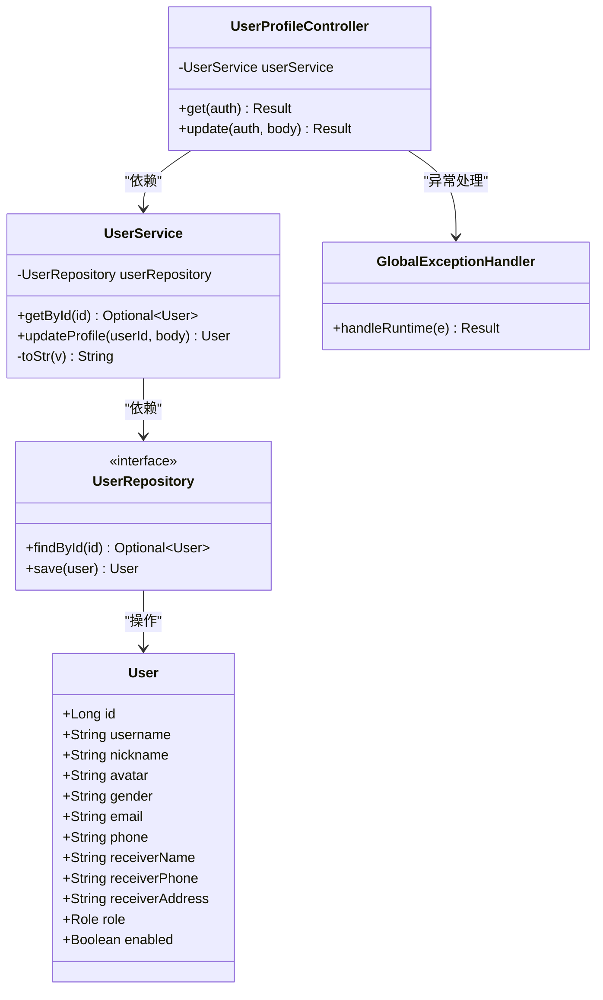

# 用户信息管理

<cite>
**本文档引用的文件**
- [UserService.java](file://backend/src/main/java/com/mall/service/UserService.java)
- [User.java](file://backend/src/main/java/com/mall/entity/User.java)
- [UserRepository.java](file://backend/src/main/java/com/mall/repository/UserRepository.java)
- [UserProfileController.java](file://backend/src/main/java/com/mall/controller/user/UserProfileController.java)
- [GlobalExceptionHandler.java](file://backend/src/main/java/com/mall/exception/GlobalExceptionHandler.java)
- [application.yml](file://backend/src/main/resources/application.yml)
- [Profile.vue](file://frontend/src/views/user/Profile.vue)
- [user.js](file://frontend/src/api/user.js)
- [Result.java](file://backend/src/main/java/com/mall/dto/Result.java)
- [Role.java](file://backend/src/main/java/com/mall/common/Role.java)
- [mall.sql](file://mall.sql)
</cite>

## 目录
1. [简介](#简介)
2. [项目结构](#项目结构)
3. [核心组件](#核心组件)
4. [架构概览](#架构概览)
5. [详细组件分析](#详细组件分析)
6. [依赖关系分析](#依赖关系分析)
7. [性能考虑](#性能考虑)
8. [故障排除指南](#故障排除指南)
9. [结论](#结论)

## 简介

用户信息管理功能是电商系统中的核心模块，负责管理用户的个人资料信息。本文档深入分析了UserService中updateProfile方法的实现机制，包括用户资料更新的字段验证、数据转换和持久化策略。该功能支持更新的字段包括昵称、头像、性别、邮箱、电话、收货人信息等，并提供了完整的业务流程和错误处理机制。

## 项目结构

用户信息管理功能采用典型的三层架构设计，包含前端界面、后端控制器、服务层和数据访问层：



**图表来源**
- [Profile.vue:1-800](file://frontend/src/views/user/Profile.vue#L1-L800)
- [UserProfileController.java:1-41](file://backend/src/main/java/com/mall/controller/user/UserProfileController.java#L1-L41)
- [UserService.java:1-42](file://backend/src/main/java/com/mall/service/UserService.java#L1-L42)

**章节来源**
- [Profile.vue:1-800](file://frontend/src/views/user/Profile.vue#L1-L800)
- [UserProfileController.java:1-41](file://backend/src/main/java/com/mall/controller/user/UserProfileController.java#L1-L41)
- [UserService.java:1-42](file://backend/src/main/java/com/mall/service/UserService.java#L1-L42)

## 核心组件

用户信息管理功能由以下核心组件构成：

### 用户实体模型
User实体类定义了完整的用户信息结构，包含基本资料和收货信息字段。

### 用户服务层
UserService提供用户信息的业务逻辑处理，包括数据验证、转换和持久化。

### 用户控制器
UserProfileController处理HTTP请求，协调用户信息的获取和更新操作。

### 数据访问层
UserRepository继承JPA的JpaRepository接口，提供用户数据的CRUD操作。

**章节来源**
- [User.java:1-88](file://backend/src/main/java/com/mall/entity/User.java#L1-L88)
- [UserService.java:1-42](file://backend/src/main/java/com/mall/service/UserService.java#L1-L42)
- [UserRepository.java:1-20](file://backend/src/main/java/com/mall/repository/UserRepository.java#L1-L20)

## 架构概览

用户信息管理采用分层架构设计，确保关注点分离和代码可维护性：



**图表来源**
- [UserProfileController.java:12-41](file://backend/src/main/java/com/mall/controller/user/UserProfileController.java#L12-L41)
- [UserService.java:12-42](file://backend/src/main/java/com/mall/service/UserService.java#L12-L42)
- [application.yml:1-36](file://backend/src/main/resources/application.yml#L1-L36)

## 详细组件分析

### UserService.updateProfile 方法深度分析

updateProfile方法实现了用户资料的原子性更新，具有以下特性：

#### 方法签名和事务管理
```java
@Transactional
public User updateProfile(Long userId, Map<String, Object> body)
```

该方法使用@Transactional注解确保更新操作的原子性，如果任何字段更新失败，整个事务将回滚。

#### 字段更新策略
方法支持动态字段更新，只更新请求中包含的字段：



**图表来源**
- [UserService.java:22-34](file://backend/src/main/java/com/mall/service/UserService.java#L22-L34)

#### 数据转换机制
toStr方法实现了智能的数据清洗和空值处理：

```mermaid
flowchart TD
Input[输入对象] --> CheckNull{是否为null}
CheckNull --> |是| ReturnNull[返回null]
CheckNull --> |否| ToString[调用toString()]
ToString --> Trim[去除首尾空白]
Trim --> CheckEmpty{字符串是否为空}
CheckEmpty --> |是| ReturnNull
CheckEmpty --> |否| ReturnValue[返回清理后的字符串]
```

**图表来源**
- [UserService.java:36-40](file://backend/src/main/java/com/mall/service/UserService.java#L36-L40)

#### 字段验证规则
系统支持的用户信息字段及其验证规则：

| 字段名 | 类型 | 长度限制 | 验证规则 | 用途 |
|--------|------|----------|----------|------|
| username | String | 64 | 唯一约束 | 用户名标识 |
| nickname | String | 32 | 非空，2-32字符 | 昵称显示 |
| avatar | String | 255 | URL格式 | 头像链接 |
| gender | String | 10 | MALE/FEMALE/OTHER | 性别标识 |
| email | String | 64 | 邮箱格式 | 邮箱绑定 |
| phone | String | 20 | 11位手机号 | 手机绑定 |
| receiverName | String | 32 | 非空 | 收货人姓名 |
| receiverPhone | String | 20 | 非空 | 收货电话 |
| receiverAddress | String | 255 | 非空 | 收货地址 |

**章节来源**
- [UserService.java:22-40](file://backend/src/main/java/com/mall/service/UserService.java#L22-L40)
- [User.java:30-54](file://backend/src/main/java/com/mall/entity/User.java#L30-L54)

### 前端交互流程

前端通过Profile.vue组件提供用户信息管理界面，支持实时验证和数据展示：



**图表来源**
- [Profile.vue:748-789](file://frontend/src/views/user/Profile.vue#L748-L789)
- [user.js:13-16](file://frontend/src/api/user.js#L13-L16)
- [UserProfileController.java:29-39](file://backend/src/main/java/com/mall/controller/user/UserProfileController.java#L29-L39)

**章节来源**
- [Profile.vue:748-789](file://frontend/src/views/user/Profile.vue#L748-L789)
- [user.js:13-16](file://frontend/src/api/user.js#L13-L16)
- [UserProfileController.java:29-39](file://backend/src/main/java/com/mall/controller/user/UserProfileController.java#L29-L39)

### 错误处理机制

系统采用多层次的错误处理策略：

#### 全局异常处理
```java
@RestControllerAdvice
public class GlobalExceptionHandler {
    @ExceptionHandler(RuntimeException.class)
    public Result<?> handleRuntime(RuntimeException e) {
        String msg = e.getMessage() == null || e.getMessage().isBlank() ? "操作失败" : e.getMessage();
        return Result.fail(msg);
    }
}
```

#### 控制器级错误处理
```java
@GetMapping
public Result<?> get(Authentication auth) {
    Long userId = (Long) auth.getPrincipal();
    return userService.getById(userId)
            .map(u -> Result.ok(u))
            .orElse(Result.fail("用户不存在"));
}

@PutMapping
public Result<?> update(Authentication auth, @RequestBody Map<String, Object> body) {
    Long userId = (Long) auth.getPrincipal();
    try {
        User updated = userService.updateProfile(userId, body);
        return Result.ok(updated);
    } catch (Exception e) {
        return Result.fail(e.getMessage());
    }
}
```

**章节来源**
- [GlobalExceptionHandler.java:10-18](file://backend/src/main/java/com/mall/exception/GlobalExceptionHandler.java#L10-L18)
- [UserProfileController.java:20-39](file://backend/src/main/java/com/mall/controller/user/UserProfileController.java#L20-L39)

## 依赖关系分析

用户信息管理功能的依赖关系清晰明确，遵循依赖倒置原则：



**图表来源**
- [UserProfileController.java:12-41](file://backend/src/main/java/com/mall/controller/user/UserProfileController.java#L12-L41)
- [UserService.java:12-42](file://backend/src/main/java/com/mall/service/UserService.java#L12-L42)
- [UserRepository.java:10-19](file://backend/src/main/java/com/mall/repository/UserRepository.java#L10-L19)
- [User.java:17-87](file://backend/src/main/java/com/mall/entity/User.java#L17-L87)

**章节来源**
- [UserProfileController.java:12-41](file://backend/src/main/java/com/mall/controller/user/UserProfileController.java#L12-L41)
- [UserService.java:12-42](file://backend/src/main/java/com/mall/service/UserService.java#L12-L42)
- [UserRepository.java:10-19](file://backend/src/main/java/com/mall/repository/UserRepository.java#L10-L19)

## 性能考虑

### 数据库优化
- 使用唯一索引保证username的唯一性
- 合理的字段长度定义减少存储空间
- 事务管理确保数据一致性

### 缓存策略
- 建议在用户信息频繁访问场景下引入Redis缓存
- 对于头像等静态资源建议CDN加速

### 并发控制
- 使用乐观锁防止并发更新冲突
- 数据库层面的唯一约束保证数据完整性

## 故障排除指南

### 常见问题及解决方案

#### 用户不存在异常
**现象**: 更新用户信息时报错"用户不存在"
**原因**: 用户ID无效或用户已被删除
**解决**: 
1. 确认用户登录状态
2. 检查用户ID参数
3. 验证用户权限

#### 数据验证失败
**现象**: 表单提交后出现验证错误
**原因**: 前端或后端验证规则不匹配
**解决**:
1. 检查前端表单验证规则
2. 确认后端字段长度限制
3. 验证特殊字符处理

#### 事务回滚问题
**现象**: 部分字段更新成功，部分失败
**原因**: 数据库约束冲突或业务逻辑异常
**解决**:
1. 检查数据库约束定义
2. 查看异常日志
3. 确保字段更新的原子性

**章节来源**
- [GlobalExceptionHandler.java:13-17](file://backend/src/main/java/com/mall/exception/GlobalExceptionHandler.java#L13-L17)
- [UserService.java:24](file://backend/src/main/java/com/mall/service/UserService.java#L24)

## 结论

用户信息管理功能通过清晰的分层架构和完善的错误处理机制，实现了用户资料的高效管理和安全保障。核心特点包括：

1. **原子性更新**: 使用事务确保字段更新的完整性
2. **智能数据转换**: 自动处理空值和格式转换
3. **灵活字段支持**: 动态字段更新机制
4. **多层次验证**: 前后端双重验证保障数据质量
5. **统一异常处理**: 全局异常捕获提升用户体验

该实现为电商系统的用户管理提供了可靠的基础，支持后续的功能扩展和性能优化。