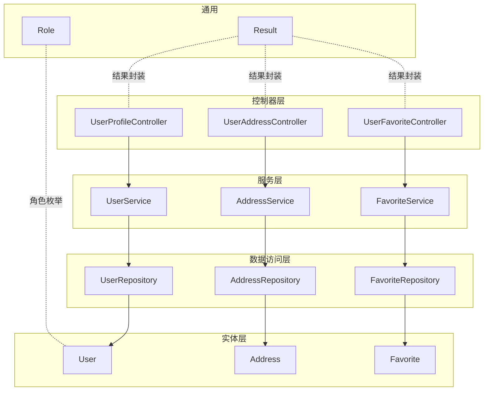
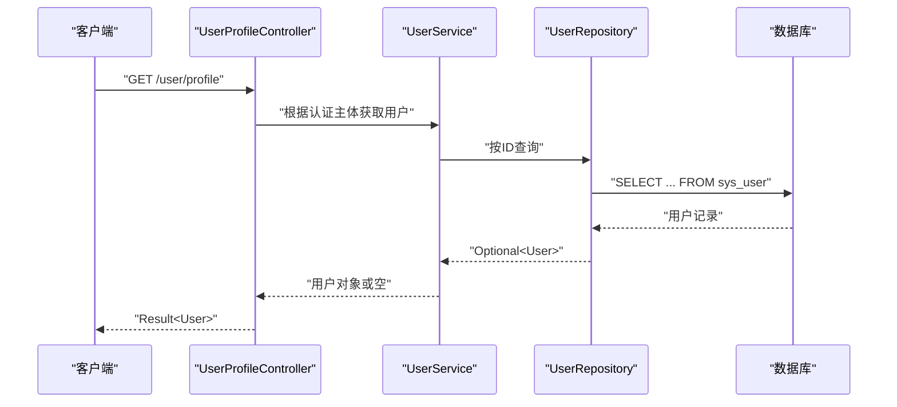
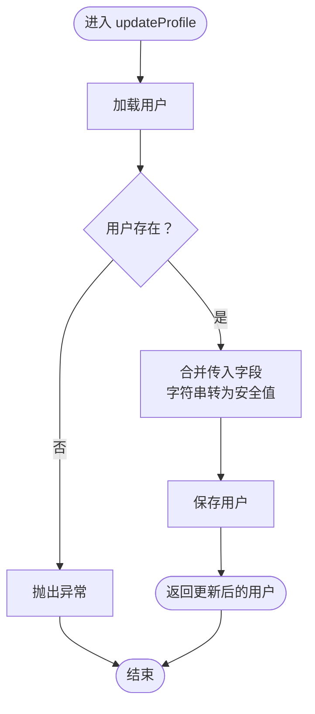
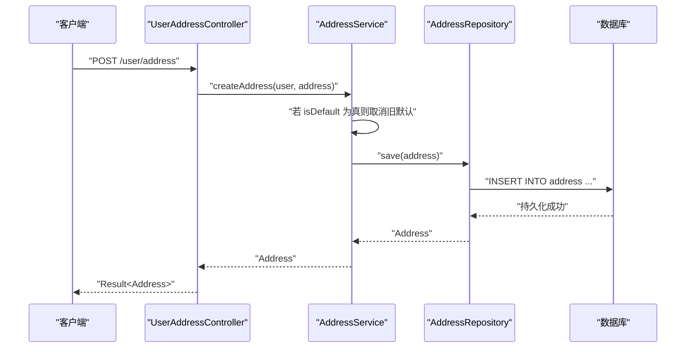
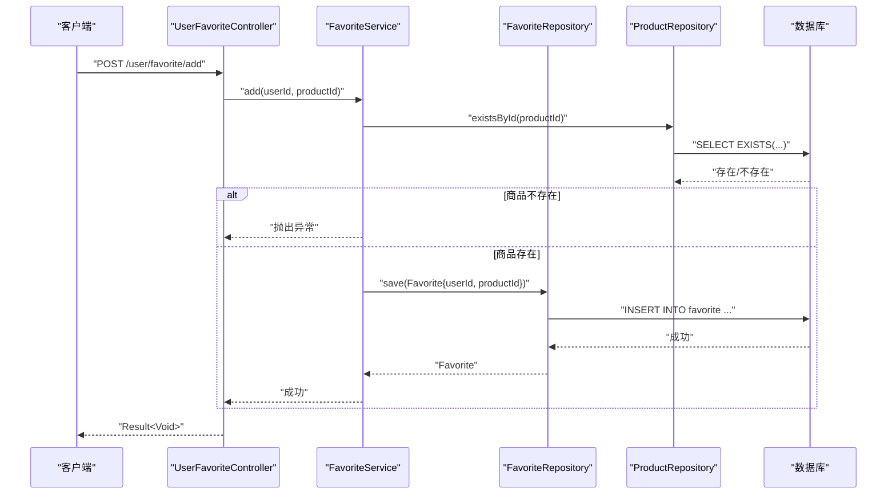
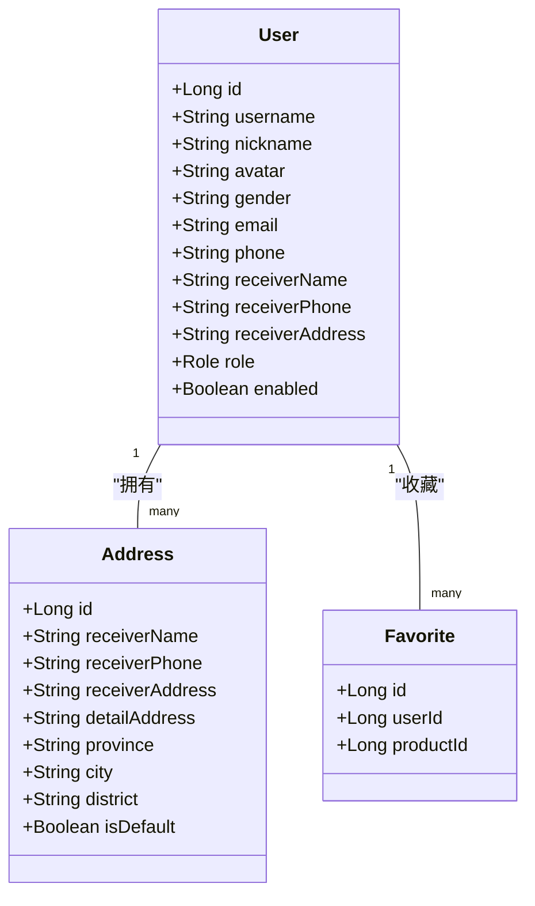

# 用户服务

<cite>
**本文引用的文件**
- [MallApplication.java](file://backend/src/main/java/com/mall/MallApplication.java)
- [application.yml](file://backend/src/main/resources/application.yml)
- [Result.java](file://backend/src/main/java/com/mall/dto/Result.java)
- [Role.java](file://backend/src/main/java/com/mall/common/Role.java)
- [User.java](file://backend/src/main/java/com/mall/entity/User.java)
- [Address.java](file://backend/src/main/java/com/mall/entity/Address.java)
- [Favorite.java](file://backend/src/main/java/com/mall/entity/Favorite.java)
- [UserRepository.java](file://backend/src/main/java/com/mall/repository/UserRepository.java)
- [AddressRepository.java](file://backend/src/main/java/com/mall/repository/AddressRepository.java)
- [FavoriteRepository.java](file://backend/src/main/java/com/mall/repository/FavoriteRepository.java)
- [UserService.java](file://backend/src/main/java/com/mall/service/UserService.java)
- [AddressService.java](file://backend/src/main/java/com/mall/service/AddressService.java)
- [FavoriteService.java](file://backend/src/main/java/com/mall/service/FavoriteService.java)
- [UserProfileController.java](file://backend/src/main/java/com/mall/controller/user/UserProfileController.java)
- [UserAddressController.java](file://backend/src/main/java/com/mall/controller/user/UserAddressController.java)
- [UserFavoriteController.java](file://backend/src/main/java/com/mall/controller/user/UserFavoriteController.java)
</cite>

## 目录
1. [简介](#简介)
2. [项目结构](#项目结构)
3. [核心组件](#核心组件)
4. [架构总览](#架构总览)
5. [详细组件分析](#详细组件分析)
6. [依赖分析](#依赖分析)
7. [性能考虑](#性能考虑)
8. [故障排查指南](#故障排查指南)
9. [结论](#结论)
10. [附录](#附录)

## 简介
本文件面向电商商城系统的“用户服务”，系统性梳理用户信息管理、地址管理与收藏夹管理的业务逻辑与实现细节。重点覆盖：
- 用户资料更新的字段验证、数据转换与持久化策略
- 地址管理的 CRUD、默认地址设置与一致性保障
- 收藏夹的商品添加、删除、查询与存在性检查
- 事务管理策略、异常处理机制与服务间协作模式
- 提供端到端业务流程图与关键代码示例路径

## 项目结构
后端采用 Spring Boot + JPA 的分层架构，按职责划分为：
- 控制器层（controller）：暴露 REST 接口，接收请求并返回统一结果包装
- 服务层（service）：编排业务逻辑，保证事务与一致性
- 数据访问层（repository）：基于 JPA 的仓储接口
- 实体层（entity）：数据库映射模型
- DTO 与通用枚举：结果封装与角色定义
- 配置：数据库连接、JPA、日志与 JWT 参数

图表来源
- [UserProfileController.java:1-41](file://backend/src/main/java/com/mall/controller/user/UserProfileController.java#L1-L41)
- [UserAddressController.java:1-73](file://backend/src/main/java/com/mall/controller/user/UserAddressController.java#L1-L73)
- [UserFavoriteController.java:1-60](file://backend/src/main/java/com/mall/controller/user/UserFavoriteController.java#L1-L60)
- [UserService.java:1-42](file://backend/src/main/java/com/mall/service/UserService.java#L1-L42)
- [AddressService.java:1-91](file://backend/src/main/java/com/mall/service/AddressService.java#L1-L91)
- [FavoriteService.java:1-43](file://backend/src/main/java/com/mall/service/FavoriteService.java#L1-L43)
- [UserRepository.java:1-20](file://backend/src/main/java/com/mall/repository/UserRepository.java#L1-L20)
- [AddressRepository.java:1-22](file://backend/src/main/java/com/mall/repository/AddressRepository.java#L1-L22)
- [FavoriteRepository.java:1-19](file://backend/src/main/java/com/mall/repository/FavoriteRepository.java#L1-L19)
- [User.java:1-88](file://backend/src/main/java/com/mall/entity/User.java#L1-L88)
- [Address.java:1-60](file://backend/src/main/java/com/mall/entity/Address.java#L1-L60)
- [Favorite.java:1-35](file://backend/src/main/java/com/mall/entity/Favorite.java#L1-L35)
- [Result.java:1-24](file://backend/src/main/java/com/mall/dto/Result.java#L1-L24)
- [Role.java:1-8](file://backend/src/main/java/com/mall/common/Role.java#L1-L8)

章节来源
- [MallApplication.java:1-13](file://backend/src/main/java/com/mall/MallApplication.java#L1-L13)
- [application.yml:1-36](file://backend/src/main/resources/application.yml#L1-L36)

## 核心组件
- 用户信息服务（UserService）
  - 职责：按用户 ID 查询与更新资料；对传入字段进行安全转换；持久化保存
  - 关键点：使用注解开启事务；对空值与空白字符串做清理；仅更新传入字段
- 地址信息服务（AddressService）
  - 职责：地址列表、详情、新增、修改、删除、设默认、查询默认
  - 关键点：默认地址唯一性约束；批量取消旧默认；排序规则；存在性校验
- 收藏夹信息服务（FavoriteService）
  - 职责：收藏列表、是否存在、新增、删除
  - 关键点：去重插入；商品存在性校验；通过产品 ID 批量回查商品

章节来源
- [UserService.java:1-42](file://backend/src/main/java/com/mall/service/UserService.java#L1-L42)
- [AddressService.java:1-91](file://backend/src/main/java/com/mall/service/AddressService.java#L1-L91)
- [FavoriteService.java:1-43](file://backend/src/main/java/com/mall/service/FavoriteService.java#L1-L43)

## 架构总览
用户服务整体遵循“控制器-服务-仓储-实体”的分层设计，控制器负责鉴权与参数绑定，服务层编排业务与事务，仓储接口由 JPA 自动生成 SQL，实体模型映射数据库表。

图表来源
- [UserProfileController.java:20-27](file://backend/src/main/java/com/mall/controller/user/UserProfileController.java#L20-L27)
- [UserService.java:18-20](file://backend/src/main/java/com/mall/service/UserService.java#L18-L20)
- [UserRepository.java:10-12](file://backend/src/main/java/com/mall/repository/UserRepository.java#L10-L12)

## 详细组件分析

### 用户资料更新（字段验证、转换与持久化）
- 字段验证与转换
  - 仅当请求体包含对应键时才更新；对字符串字段执行 trim 与空串归零处理
  - 支持昵称、头像、性别、邮箱、电话、收货人信息等字段
- 持久化策略
  - 使用事务方法在单个会话内完成读取与保存
  - 保存前由实体监听器维护时间戳
- 异常处理
  - 若用户不存在，抛出运行时异常；控制器捕获并返回失败结果

图表来源
- [UserService.java:22-34](file://backend/src/main/java/com/mall/service/UserService.java#L22-L34)
- [UserService.java:36-40](file://backend/src/main/java/com/mall/service/UserService.java#L36-L40)
- [User.java:77-86](file://backend/src/main/java/com/mall/entity/User.java#L77-L86)

章节来源
- [UserProfileController.java:30-39](file://backend/src/main/java/com/mall/controller/user/UserProfileController.java#L30-L39)
- [UserService.java:22-40](file://backend/src/main/java/com/mall/service/UserService.java#L22-L40)
- [User.java:1-88](file://backend/src/main/java/com/mall/entity/User.java#L1-L88)

### 地址管理（CRUD、默认地址与一致性）
- 列表与详情
  - 列表按默认优先、创建时间降序排列
  - 详情查询需校验地址归属（同一用户）
- 新增
  - 若 isDefault 为真，则先取消该用户的其他默认地址
  - 设置所属用户并保存
- 修改
  - 先校验归属；若将某地址置为默认且原非默认，则取消其他默认
  - 逐字段复制更新
- 删除
  - 校验归属后删除
- 默认地址
  - 提供单独设置接口与查询默认接口

图表来源
- [UserAddressController.java:34-38](file://backend/src/main/java/com/mall/controller/user/UserAddressController.java#L34-L38)
- [AddressService.java:27-34](file://backend/src/main/java/com/mall/service/AddressService.java#L27-L34)
- [AddressRepository.java:12-18](file://backend/src/main/java/com/mall/repository/AddressRepository.java#L12-L18)

章节来源
- [UserAddressController.java:19-71](file://backend/src/main/java/com/mall/controller/user/UserAddressController.java#L19-L71)
- [AddressService.java:17-89](file://backend/src/main/java/com/mall/service/AddressService.java#L17-L89)
- [AddressRepository.java:1-22](file://backend/src/main/java/com/mall/repository/AddressRepository.java#L1-L22)
- [Address.java:1-60](file://backend/src/main/java/com/mall/entity/Address.java#L1-L60)

### 收藏夹管理（添加、删除、查询与存在性）
- 查询收藏列表
  - 先按用户 ID 查询所有收藏记录，提取商品 ID，再批量查询商品
- 存在性检查
  - 基于唯一索引约束快速判断
- 添加
  - 若已存在则忽略；若商品不存在则抛错；否则写入收藏
- 删除
  - 按用户与商品 ID 删除

图表来源
- [UserFavoriteController.java:42-51](file://backend/src/main/java/com/mall/controller/user/UserFavoriteController.java#L42-L51)
- [FavoriteService.java:31-36](file://backend/src/main/java/com/mall/service/FavoriteService.java#L31-L36)
- [FavoriteRepository.java:9-18](file://backend/src/main/java/com/mall/repository/FavoriteRepository.java#L9-L18)
- [UserFavoriteController.java:28-32](file://backend/src/main/java/com/mall/controller/user/UserFavoriteController.java#L28-L32)
- [FavoriteService.java:21-25](file://backend/src/main/java/com/mall/service/FavoriteService.java#L21-L25)

章节来源
- [UserFavoriteController.java:1-60](file://backend/src/main/java/com/mall/controller/user/UserFavoriteController.java#L1-L60)
- [FavoriteService.java:1-43](file://backend/src/main/java/com/mall/service/FavoriteService.java#L1-L43)
- [FavoriteRepository.java:1-19](file://backend/src/main/java/com/mall/repository/FavoriteRepository.java#L1-L19)
- [Favorite.java:1-35](file://backend/src/main/java/com/mall/entity/Favorite.java#L1-L35)

### 统一结果封装与错误处理
- Result 封装
  - 成功与失败两种静态构造方法，统一响应结构
- 控制器层
  - 在业务异常处捕获并返回失败结果
- 服务层
  - 对用户不存在、商品不存在等场景抛出运行时异常，由上层捕获

章节来源
- [Result.java:1-24](file://backend/src/main/java/com/mall/dto/Result.java#L1-L24)
- [UserProfileController.java:33-38](file://backend/src/main/java/com/mall/controller/user/UserProfileController.java#L33-L38)
- [UserFavoriteController.java:45-49](file://backend/src/main/java/com/mall/controller/user/UserFavoriteController.java#L45-L49)
- [UserService.java:24-24](file://backend/src/main/java/com/mall/service/UserService.java#L24-L24)
- [FavoriteService.java:34-34](file://backend/src/main/java/com/mall/service/FavoriteService.java#L34-L34)

## 依赖分析
- 控制器依赖服务；服务依赖仓储；仓储依赖实体；实体依赖 JPA 注解与监听器
- 事务边界
  - 用户资料更新、地址新增/修改/删除、收藏添加/删除均在服务层以事务方法包裹
- 查询排序与过滤
  - 地址列表按默认优先、创建时间倒序；默认地址查询通过 JPQL 过滤 isDefault
- 外键与唯一约束
  - 地址 belongs-to 用户；收藏表对 (user_id, product_id) 建唯一约束

图表来源
- [User.java:73-75](file://backend/src/main/java/com/mall/entity/User.java#L73-L75)
- [Address.java:15-17](file://backend/src/main/java/com/mall/entity/Address.java#L15-L17)
- [Favorite.java:21-25](file://backend/src/main/java/com/mall/entity/Favorite.java#L21-L25)

章节来源
- [UserRepository.java:1-20](file://backend/src/main/java/com/mall/repository/UserRepository.java#L1-L20)
- [AddressRepository.java:1-22](file://backend/src/main/java/com/mall/repository/AddressRepository.java#L1-L22)
- [FavoriteRepository.java:1-19](file://backend/src/main/java/com/mall/repository/FavoriteRepository.java#L1-L19)

## 性能考虑
- 查询优化
  - 地址列表使用复合排序索引（默认优先、创建时间），避免应用层排序
  - 收藏列表先查收藏 ID 再批量查询商品，减少多次往返
- 事务范围
  - 将读取、校验与写入放在同一事务中，降低并发冲突概率
- 日志与 SQL
  - 生产环境建议关闭 show-sql，启用格式化与方言配置以提升可读性

章节来源
- [application.yml:9-17](file://backend/src/main/resources/application.yml#L9-L17)
- [AddressRepository.java:13-18](file://backend/src/main/java/com/mall/repository/AddressRepository.java#L13-L18)
- [FavoriteService.java:21-25](file://backend/src/main/java/com/mall/service/FavoriteService.java#L21-L25)

## 故障排查指南
- 用户不存在
  - 现象：资料更新抛异常；控制器返回失败
  - 排查：确认认证主体与用户 ID 是否匹配；检查用户是否存在
- 地址不存在
  - 现象：详情、修改、删除、设默认返回失败
  - 排查：确认地址 ID 与用户归属；检查 isDefault 取值
- 商品不存在（收藏）
  - 现象：添加收藏抛异常
  - 排查：确认商品 ID 是否有效；检查商品表状态
- 默认地址重复
  - 现象：新增/修改时默认地址异常
  - 排查：确认同一用户只允许一个默认地址；检查取消默认逻辑是否执行

章节来源
- [UserService.java:24-24](file://backend/src/main/java/com/mall/service/UserService.java#L24-L24)
- [UserAddressController.java:28-31](file://backend/src/main/java/com/mall/controller/user/UserAddressController.java#L28-L31)
- [UserAddressController.java:43-46](file://backend/src/main/java/com/mall/controller/user/UserAddressController.java#L43-L46)
- [UserAddressController.java:57-61](file://backend/src/main/java/com/mall/controller/user/UserAddressController.java#L57-L61)
- [UserAddressController.java:65-70](file://backend/src/main/java/com/mall/controller/user/UserAddressController.java#L65-L70)
- [FavoriteService.java:34-34](file://backend/src/main/java/com/mall/service/FavoriteService.java#L34-L34)

## 结论
用户服务围绕“用户资料、地址、收藏”三大域构建，采用清晰的分层与事务边界，结合 JPA 的仓储与实体映射，实现了高内聚低耦合的服务模块。通过统一结果封装与异常处理，提升了接口稳定性与可观测性。后续可在以下方面持续优化：
- 在控制器层引入参数校验与 DTO 映射，进一步明确契约
- 对高频查询增加缓存策略（如默认地址）
- 完善审计字段与变更追踪

## 附录
- 配置要点
  - 数据源与 JPA 方言、DDL 自动化、SQL 格式化与日志级别
  - JWT 密钥与过期时间配置
- 角色枚举
  - 用户、运营、管理员三类角色，用于权限控制与扩展

章节来源
- [application.yml:1-36](file://backend/src/main/resources/application.yml#L1-L36)
- [Role.java:1-8](file://backend/src/main/java/com/mall/common/Role.java#L1-L8)